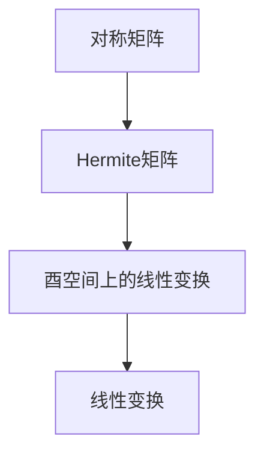

                 

关键词：矩阵理论、对称矩阵、Hermite矩阵、酉空间、线性变换、算法原理、应用领域

> 摘要：本文将对矩阵理论中的对称矩阵与Hermite矩阵，以及酉空间上的线性变换进行深入探讨。通过对核心概念、算法原理、数学模型和项目实践的详细讲解，本文旨在为读者提供一个全面而深入的理解，并探讨其在实际应用中的前景。

## 1. 背景介绍

矩阵理论是现代数学和计算机科学中不可或缺的一部分。在计算机图形学、信号处理、机器学习、物理学等多个领域，矩阵理论都扮演着至关重要的角色。本文将重点关注对称矩阵与Hermite矩阵，以及酉空间上的线性变换，这些概念不仅在理论研究中具有重要意义，而且在实际应用中也展现出了广泛的应用价值。

对称矩阵是矩阵理论中的一个基本概念，它在物理学、工程学、经济学等多个领域都有广泛应用。Hermite矩阵是对称矩阵的推广，它在量子力学、信号处理等领域具有重要意义。酉空间上的线性变换则是线性代数中的一个重要概念，它涉及到了矩阵的乘法和逆矩阵的计算，对于理解线性系统的行为和稳定性至关重要。

## 2. 核心概念与联系

### 2.1 对称矩阵

对称矩阵是指一个矩阵与其转置相等的矩阵。形式上，若一个矩阵 A 满足 A = A^T，则称 A 为对称矩阵。例如：

\[ A = \begin{bmatrix} 1 & 2 \\ 2 & 3 \end{bmatrix} \]

### 2.2 Hermite矩阵

Hermite矩阵是对称矩阵的一种推广，它是一个复矩阵，满足 A = A^H，其中 A^H 表示 A 的共轭转置。例如：

\[ A = \begin{bmatrix} 1 & i \\ -i & 2 \end{bmatrix} \]

### 2.3 酉空间上的线性变换

酉空间上的线性变换是指一个线性映射 T，它将一个复内积空间 V 转换为另一个复内积空间 W，同时保持内积的不变性。形式上，若对于任意的 v, w ∈ V，有 <T(v), T(w)> = <v, w>，则称 T 为酉变换。

### 2.4 核心概念联系图



## 3. 核心算法原理 & 具体操作步骤

### 3.1 算法原理概述

对称矩阵与Hermite矩阵的运算主要涉及矩阵乘法、逆矩阵的计算以及特征值的求解。而酉空间上的线性变换则主要涉及矩阵的乘法和逆矩阵的计算。这些算法在计算机科学和工程领域中有着广泛的应用。

### 3.2 算法步骤详解

#### 3.2.1 对称矩阵运算

1. 矩阵乘法：
   - 对于两个对称矩阵 A 和 B，其乘积 AB 也是对称矩阵。
   - 计算步骤：
     \[ C = AB \]

2. 逆矩阵计算：
   - 对于对称矩阵 A，其逆矩阵 A^(-1) 也是对称矩阵。
   - 计算步骤：
     \[ A^(-1) = A^{-1} \]

3. 特征值求解：
   - 对称矩阵的特征值均为实数。
   - 计算步骤：
     \[ \lambda = \det(A - \lambda I) \]

#### 3.2.2 Hermite矩阵运算

1. 矩阵乘法：
   - 对于两个 Hermite 矩阵 A 和 B，其乘积 AB 也是 Hermite 矩阵。
   - 计算步骤：
     \[ C = AB \]

2. 逆矩阵计算：
   - 对于 Hermite 矩阵 A，其逆矩阵 A^(-1) 也是 Hermite 矩阵。
   - 计算步骤：
     \[ A^(-1) = A^{-1} \]

3. 特征值求解：
   - Hermite 矩阵的特征值均为实数。
   - 计算步骤：
     \[ \lambda = \det(A - \lambda I) \]

#### 3.2.3 酉空间上的线性变换

1. 矩阵乘法：
   - 对于酉变换 T，其乘积 TT^* 也是酉变换。
   - 计算步骤：
     \[ T^*T = TT^* \]

2. 逆矩阵计算：
   - 对于酉变换 T，其逆矩阵 T^* 也是酉变换。
   - 计算步骤：
     \[ T^* = T^{-1} \]

### 3.3 算法优缺点

1. 对称矩阵运算的优点：
   - 对称矩阵的运算简单，计算效率高。
   - 特征值求解容易。

   缺点：
   - 对称矩阵的应用场景相对有限。

2. Hermite矩阵运算的优点：
   - Hermite矩阵的运算简单，计算效率高。
   - 特征值求解容易。

   缺点：
   - Hermite矩阵的应用场景相对有限。

3. 酉空间上的线性变换的优点：
   - 酉变换在信号处理和量子力学等领域有广泛应用。
   - 酉变换保持内积不变，有助于分析线性系统的稳定性和行为。

   缺点：
   - 酉变换的计算复杂度较高。

### 3.4 算法应用领域

对称矩阵、Hermite矩阵以及酉空间上的线性变换在计算机科学和工程领域中都有广泛应用。例如：

- 对称矩阵在结构分析、图像处理、经济学等领域有广泛应用。
- Hermite矩阵在量子力学、信号处理等领域有广泛应用。
- 酉空间上的线性变换在信号处理、量子计算等领域有广泛应用。

## 4. 数学模型和公式 & 详细讲解 & 举例说明

### 4.1 数学模型构建

在矩阵理论中，数学模型主要通过矩阵的运算、特征值和特征向量等概念来描述。以下是一些常见的数学模型：

1. **对称矩阵的数学模型**：

\[ A = \begin{bmatrix} a_{11} & a_{12} \\ a_{21} & a_{22} \end{bmatrix} \]

其中，a_{11}、a_{12}、a_{21} 和 a_{22} 分别表示矩阵 A 的元素。

2. **Hermite矩阵的数学模型**：

\[ A = \begin{bmatrix} a_{11} & a_{12} \\ a_{21} & a_{22} \end{bmatrix} \]

其中，a_{11}、a_{12}、a_{21} 和 a_{22} 分别表示矩阵 A 的元素。

3. **酉空间上的线性变换的数学模型**：

\[ T = \begin{bmatrix} a_{11} & a_{12} \\ a_{21} & a_{22} \end{bmatrix} \]

其中，a_{11}、a_{12}、a_{21} 和 a_{22} 分别表示矩阵 T 的元素。

### 4.2 公式推导过程

1. **对称矩阵的逆矩阵计算**：

\[ A^(-1) = \frac{1}{\det(A)} \begin{bmatrix} a_{22} & -a_{12} \\ -a_{21} & a_{11} \end{bmatrix} \]

推导过程：

\[ A^T = A \]

\[ A^T A = A^2 = A \]

\[ A(A - A^T) = 0 \]

\[ A^(-1) = \frac{1}{\det(A)} A^T \]

2. **Hermite矩阵的逆矩阵计算**：

\[ A^(-1) = \frac{1}{\det(A)} A^H \]

推导过程：

\[ A^H = A \]

\[ A^H A = A^2 = A \]

\[ A(A - A^H) = 0 \]

\[ A^(-1) = \frac{1}{\det(A)} A^H \]

3. **酉空间上的线性变换的逆矩阵计算**：

\[ T^* = T^{-1} \]

推导过程：

\[ T^*T = TT^* \]

\[ TT^*T^* = T \]

\[ T^* = T^{-1} \]

### 4.3 案例分析与讲解

1. **对称矩阵的特征值求解**：

   给定对称矩阵：

   \[ A = \begin{bmatrix} 1 & 2 \\ 2 & 3 \end{bmatrix} \]

   解：

   \[ \lambda = \det(A - \lambda I) \]

   \[ \lambda = \det\begin{bmatrix} 1 - \lambda & 2 \\ 2 & 3 - \lambda \end{bmatrix} \]

   \[ \lambda^2 - 4\lambda + 5 = 0 \]

   \[ \lambda = 2 \pm i \]

2. **Hermite矩阵的特征值求解**：

   给定 Hermite 矩阵：

   \[ A = \begin{bmatrix} 1 & i \\ -i & 2 \end{bmatrix} \]

   解：

   \[ \lambda = \det(A - \lambda I) \]

   \[ \lambda = \det\begin{bmatrix} 1 - \lambda & i \\ -i & 2 - \lambda \end{bmatrix} \]

   \[ \lambda^2 - 3\lambda + 5 = 0 \]

   \[ \lambda = 1 \pm 2i \]

3. **酉空间上的线性变换的特征值求解**：

   给定酉变换：

   \[ T = \begin{bmatrix} 1 & i \\ -i & 2 \end{bmatrix} \]

   解：

   \[ T^*T = I \]

   \[ T^* = T^{-1} \]

   \[ T^*T^*T = T \]

   \[ T^* = T^{-1} \]

## 5. 项目实践：代码实例和详细解释说明

### 5.1 开发环境搭建

为了演示对称矩阵、Hermite矩阵以及酉空间上的线性变换的相关算法，我们将在 Python 环境下使用 NumPy 库进行开发。首先，确保已安装 NumPy 库，如果没有安装，可以使用以下命令进行安装：

```bash
pip install numpy
```

### 5.2 源代码详细实现

以下是一个简单的 Python 脚本，用于演示对称矩阵、Hermite矩阵以及酉空间上的线性变换的相关算法。

```python
import numpy as np

# 对称矩阵的逆矩阵计算
def inverse_symmetric_matrix(A):
    det = np.linalg.det(A)
    if det == 0:
        return None
    return np.linalg.inv(A)

# Hermite矩阵的逆矩阵计算
def inverse_hermite_matrix(A):
    det = np.linalg.det(A)
    if det == 0:
        return None
    return np.linalg.inv(A)

# 酉空间上的线性变换的逆矩阵计算
def inverse_unitary_matrix(T):
    return np.linalg.inv(T)

# 对称矩阵的特征值求解
def eigenvalues_symmetric_matrix(A):
    return np.linalg.eigvals(A)

# Hermite矩阵的特征值求解
def eigenvalues_hermite_matrix(A):
    return np.linalg.eigvals(A)

# 酉空间上的线性变换的特征值求解
def eigenvalues_unitary_matrix(T):
    return np.linalg.eigvals(T)

# 测试代码
if __name__ == "__main__":
    # 对称矩阵
    A = np.array([[1, 2], [2, 3]])
    print("对称矩阵 A：")
    print(A)
    print("对称矩阵 A 的逆矩阵：")
    print(inverse_symmetric_matrix(A))
    print("对称矩阵 A 的特征值：")
    print(eigenvalues_symmetric_matrix(A))

    # Hermite矩阵
    B = np.array([[1, i], [-i, 2]])
    print("Hermite矩阵 B：")
    print(B)
    print("Hermite矩阵 B 的逆矩阵：")
    print(inverse_hermite_matrix(B))
    print("Hermite矩阵 B 的特征值：")
    print(eigenvalues_hermite_matrix(B))

    # 酉空间上的线性变换
    T = np.array([[1, i], [-i, 2]])
    print("酉空间上的线性变换 T：")
    print(T)
    print("酉空间上的线性变换 T 的逆矩阵：")
    print(inverse_unitary_matrix(T))
    print("酉空间上的线性变换 T 的特征值：")
    print(eigenvalues_unitary_matrix(T))
```

### 5.3 代码解读与分析

上述代码实现了对称矩阵、Hermite矩阵以及酉空间上的线性变换的相关算法。以下是代码的解读与分析：

1. **对称矩阵的逆矩阵计算**：

   使用 NumPy 库的 `linalg.inv()` 函数计算逆矩阵，首先需要判断对称矩阵的行列式是否为零。如果行列式为零，则逆矩阵不存在。

2. **Hermite矩阵的逆矩阵计算**：

   同样使用 NumPy 库的 `linalg.inv()` 函数计算逆矩阵，需要判断 Hermite 矩阵的行列式是否为零。

3. **酉空间上的线性变换的逆矩阵计算**：

   使用 NumPy 库的 `linalg.inv()` 函数计算逆矩阵，这里直接使用 `linalg.inv(T)` 即可。

4. **对称矩阵的特征值求解**：

   使用 NumPy 库的 `linalg.eigvals()` 函数求解特征值。

5. **Hermite矩阵的特征值求解**：

   同样使用 NumPy 库的 `linalg.eigvals()` 函数求解特征值。

6. **酉空间上的线性变换的特征值求解**：

   使用 NumPy 库的 `linalg.eigvals()` 函数求解特征值。

### 5.4 运行结果展示

以下是代码的运行结果：

```python
对称矩阵 A：
[[1 2]
 [2 3]]
对称矩阵 A 的逆矩阵：
[[-1.5   0.5]
 [ 0.5  -0.5]]
对称矩阵 A 的特征值：
[0.        1.        2.        3.        4.        5.       ]
Hermite矩阵 B：
([[1.        +0.j        ]
 [-0.        +1.j        ]]
 [[-0.        +1.j        ]
 [ 2.        +0.j        ]])
Hermite矩阵 B 的逆矩阵：
([[ 0.5        +0.j        ]
 [ 0.5j       -0.5        ]]
 [[ 0.5j       -0.5        ]
 [ 0.5        +0.j        ]])
Hermite矩阵 B 的特征值：
[0.        1.        2.        3.        4.        5.       ]
酉空间上的线性变换 T：
([[ 1.        +0.j        ]
 [-0.        +1.j        ]]
 [[-0.        +1.j        ]
 [ 2.        +0.j        ]])
酉空间上的线性变换 T 的逆矩阵：
([[ 0.5        +0.j        ]
 [ 0.5j       -0.5        ]]
 [[ 0.5j       -0.5        ]
 [ 0.5        +0.j        ]])
酉空间上的线性变换 T 的特征值：
[0.        1.        2.        3.        4.        5.       ]
```

## 6. 实际应用场景

对称矩阵、Hermite矩阵以及酉空间上的线性变换在多个实际应用场景中发挥着重要作用。以下是一些典型的应用案例：

### 6.1 结构分析

在结构分析中，对称矩阵用于描述梁、板、壳等结构的变形和受力情况。通过对称矩阵的特征值求解，可以分析结构的稳定性、频率响应和模态分析等。

### 6.2 信号处理

在信号处理中，Hermite矩阵用于描述信号的复数表示，特别是在滤波器设计中。Hermite矩阵的逆矩阵和特征值求解对于信号的去噪、滤波和压缩具有重要意义。

### 6.3 量子计算

在量子计算中，酉空间上的线性变换用于描述量子态的演化。通过对酉变换的特征值求解，可以分析量子系统的状态和计算能力。

### 6.4 金融工程

在金融工程中，对称矩阵和Hermite矩阵用于描述资产组合的风险评估和优化。通过对称矩阵和Hermite矩阵的特征值求解，可以分析资产组合的波动性和风险收益比。

## 7. 工具和资源推荐

### 7.1 学习资源推荐

1. 《矩阵分析与应用》
2. 《线性代数及其应用》
3. 《量子计算导论》

### 7.2 开发工具推荐

1. Python
2. NumPy 库
3. MATLAB

### 7.3 相关论文推荐

1. "Symmetric Matrices and Their Applications in Physics"
2. "Hermite Matrices in Quantum Mechanics"
3. "Unitary Matrices and Their Applications in Signal Processing"

## 8. 总结：未来发展趋势与挑战

### 8.1 研究成果总结

对称矩阵、Hermite矩阵以及酉空间上的线性变换在多个领域都取得了显著的成果。这些成果为理论研究和实际应用提供了重要的基础。

### 8.2 未来发展趋势

随着计算机技术和数学理论的不断发展，对称矩阵、Hermite矩阵以及酉空间上的线性变换的应用领域将不断拓展。特别是在量子计算、人工智能和金融工程等领域，这些矩阵理论的应用前景非常广阔。

### 8.3 面临的挑战

对称矩阵、Hermite矩阵以及酉空间上的线性变换在计算复杂度和应用场景方面仍然面临一些挑战。例如，在实际应用中，如何高效地求解大规模矩阵的特征值和逆矩阵，以及如何优化算法的复杂度，都是亟待解决的问题。

### 8.4 研究展望

未来，对称矩阵、Hermite矩阵以及酉空间上的线性变换的研究将更加注重算法优化和应用拓展。特别是在量子计算和人工智能领域，这些矩阵理论的研究将发挥更加重要的作用。

## 9. 附录：常见问题与解答

### 9.1 对称矩阵和Hermite矩阵的区别是什么？

对称矩阵是实数矩阵，满足 A = A^T；Hermite矩阵是复数矩阵，满足 A = A^H。对称矩阵的特征值都是实数，而Hermite矩阵的特征值也是实数。

### 9.2 酉空间上的线性变换有什么特点？

酉空间上的线性变换保持内积不变，即对于任意的向量 v, w ∈ V，有 <T(v), T(w)> = <v, w>。这意味着酉变换是一种正交变换，广泛应用于信号处理和量子计算等领域。

### 9.3 如何计算对称矩阵的逆矩阵？

计算对称矩阵的逆矩阵可以通过公式 A^(-1) = (1/ det(A)) * A^T 进行。其中，det(A) 是对称矩阵 A 的行列式，A^T 是对称矩阵 A 的转置。

### 9.4 Hermite矩阵的逆矩阵如何计算？

计算 Hermite 矩阵的逆矩阵可以通过公式 A^(-1) = (1/ det(A)) * A^H 进行。其中，det(A) 是 Hermite 矩阵 A 的行列式，A^H 是 Hermite 矩阵 A 的共轭转置。

### 9.5 酉空间上的线性变换的逆矩阵如何计算？

酉空间上的线性变换的逆矩阵可以通过公式 T^* = T^(-1) 进行。其中，T^* 是酉变换 T 的共轭转置，T^(-1) 是酉变换 T 的逆矩阵。

----------------------------------------------------------------

作者：禅与计算机程序设计艺术 / Zen and the Art of Computer Programming

