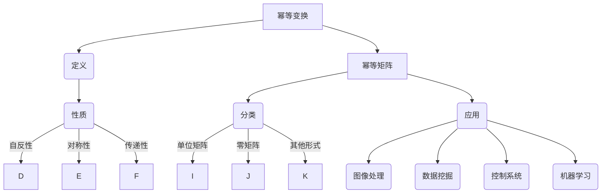

                 

### 关键词 Keywords
矩阵理论，幂等变换，幂等矩阵，线性代数，数值分析，计算机科学，数学模型，算法原理，应用领域，编程实践。

### 摘要 Abstract
本文旨在深入探讨矩阵理论与应用中一个重要的概念——幂等变换与幂等矩阵。首先，文章将介绍幂等变换的定义、性质及其在数学和工程领域的应用。接着，我们将详细阐述幂等矩阵的概念、分类以及其与幂等变换的关系。随后，文章将剖析核心算法原理，并提供具体的操作步骤和应用案例。此外，本文还将通过数学模型和公式详细讲解，并以实际项目为例，展示代码实例和运行结果。最后，文章将探讨幂等变换与幂等矩阵在实际应用场景中的表现，并对未来应用进行展望。通过本文的阅读，读者将全面了解幂等变换与幂等矩阵的精髓，为深入研究和应用打下坚实基础。

## 1. 背景介绍

矩阵理论作为线性代数的重要组成部分，在数学、物理、工程、计算机科学等多个领域中都有着广泛的应用。矩阵不仅是一种数学工具，也是描述现实世界中各种线性关系的有效手段。矩阵理论的研究可以追溯到19世纪，经过一百多年的发展，已成为现代数学的核心之一。

在计算机科学中，矩阵理论的应用尤为重要。无论是在算法设计中，还是在数据结构实现中，矩阵都扮演着至关重要的角色。例如，图论中的邻接矩阵、网络分析中的权重矩阵、机器学习中的权重矩阵等，都是矩阵理论的实际应用。特别是在人工智能和大数据处理领域，矩阵计算和优化成为算法性能的关键。

幂等变换是矩阵理论中的一个重要概念。它指的是一种变换，该变换作用在矩阵上后，结果仍然是该矩阵本身。换句话说，如果存在一个矩阵 \(A\)，使得 \(A^2 = A\)，那么 \(A\) 就被称为幂等矩阵。幂等变换不仅在数学理论中具有重要地位，还在工程实践中具有广泛应用。例如，在图像处理中，幂等变换可以用于图像的增强和滤波；在优化算法中，幂等变换可以简化计算过程，提高算法效率。

幂等矩阵是幂等变换的核心元素。它们在数学上的性质和应用极为丰富，如矩阵的幂等分解、幂等矩阵的行列式特性等。此外，幂等矩阵在解决线性方程组、特征值分析等方面也具有重要的应用价值。

本文旨在深入探讨幂等变换与幂等矩阵的数学原理、算法实现及其在实际应用中的重要性。文章将首先介绍幂等变换的定义和性质，随后讨论幂等矩阵的概念、分类和应用。接着，文章将详细阐述核心算法原理和具体操作步骤，并通过数学模型和公式进行深入分析。最后，文章将结合实际项目案例，展示幂等变换和幂等矩阵的实际应用效果，并对未来发展方向进行展望。

### 2. 核心概念与联系

#### 2.1 幂等变换的定义

幂等变换（Idempotent transformation）是线性代数中的一个重要概念，它指的是一种特殊的变换，该变换作用在矩阵上后，结果仍然是该矩阵本身。具体来说，如果一个矩阵 \(A\) 满足 \(A^2 = A\)，那么我们称 \(A\) 是一个幂等矩阵，\(A\) 的变换 \(T(A) = A\) 则称为幂等变换。

数学表达上，若 \(A\) 是 \(n \times n\) 的矩阵，且 \(A^2 = A\)，则 \(A\) 被称为幂等矩阵，且 \(A\) 的幂等变换可表示为 \(T(A) = A\)。在矩阵的行列式和秩等性质中，幂等变换有着独特的表现。

#### 2.2 幂等变换的性质

1. **自反性**：任何矩阵 \(A\) 都可以看作是自身的幂等变换，即 \(A^2 = A\)。
2. **对称性**：如果矩阵 \(A\) 是幂等矩阵，则其转置矩阵 \(A'\) 也是幂等矩阵，因为 \((A')^2 = (A^T A^T) = A^2 = A\)。
3. **传递性**：如果矩阵 \(A\) 和 \(B\) 都是幂等矩阵，则它们的和 \(A + B\) 也是幂等矩阵。因为 \((A + B)^2 = A^2 + 2AB + B^2 = A + 2A(B^2) + B = A + B\)（前提是 \(AB = BA\)）。

#### 2.3 幂等变换与幂等矩阵的关系

幂等变换与幂等矩阵密切相关。幂等变换是指一种作用于矩阵的变换，使得矩阵经过这种变换后，结果仍然是该矩阵本身。而幂等矩阵则是满足这种变换条件的矩阵。

例如，考虑矩阵 \(A = \begin{pmatrix} 1 & 0 \\ 0 & 1 \end{pmatrix}\)。该矩阵显然是一个幂等矩阵，因为 \(A^2 = A\)。同时，任何与 \(A\) 相等的矩阵变换，如 \(T(A) = A\)，也是一个幂等变换。

#### 2.4 幂等矩阵的分类

幂等矩阵可以根据其特征值和行列式进行分类：

1. **单位矩阵**：所有特征值为 1 的幂等矩阵都是单位矩阵，如 \(I = \begin{pmatrix} 1 & 0 \\ 0 & 1 \end{pmatrix}\)。
2. **零矩阵**：所有特征值为 0 的幂等矩阵都是零矩阵，如 \(O = \begin{pmatrix} 0 & 0 \\ 0 & 0 \end{pmatrix}\)。
3. **其他形式的幂等矩阵**：除了单位矩阵和零矩阵，其他幂等矩阵通常比较复杂，例如 \( \begin{pmatrix} 1 & 1 \\ 0 & 1 \end{pmatrix}\)，其特征值为 1 和 1。

#### 2.5 幂等矩阵的应用

幂等矩阵在多个领域中都有广泛应用：

1. **图像处理**：在图像滤波和边缘检测中，幂等变换可以用于图像的预处理和增强。
2. **数据挖掘**：在聚类分析中，幂等矩阵可以用于优化聚类算法，提高聚类效果。
3. **控制系统**：在控制系统分析中，幂等矩阵可以用于系统稳定性和性能评估。
4. **机器学习**：在机器学习算法中，幂等矩阵可以用于特征提取和降维，提高模型性能。

#### 2.6 Mermaid 流程图

为了更清晰地展示幂等变换与幂等矩阵的关系，下面提供了一个 Mermaid 流程图：



### 3. 核心算法原理 & 具体操作步骤

#### 3.1 算法原理概述

幂等变换与幂等矩阵的算法原理基于矩阵的基本性质。幂等变换的核心在于找到一个矩阵 \(A\)，使得 \(A\) 经过自身的运算后仍然保持不变，即 \(A^2 = A\)。幂等矩阵则是满足这种性质的矩阵。

在数学上，如果矩阵 \(A\) 是幂等的，则其特征值 \(\lambda\) 必须满足 \(\lambda^2 = \lambda\)，这意味着特征值只能是 0 或 1。因此，幂等矩阵的特征值总是处于这两个值的集合中。

算法原理可以概括为以下几个步骤：

1. **判断矩阵是否为幂等**：通过计算 \(A^2\) 来验证矩阵 \(A\) 是否满足 \(A^2 = A\)。
2. **分解幂等矩阵**：将幂等矩阵分解为一系列基本矩阵的乘积，这些基本矩阵通常具有简单的结构，如单位矩阵或零矩阵。
3. **利用幂等矩阵的性质**：根据幂等矩阵的性质，如自反性、对称性和传递性，简化矩阵运算过程。

#### 3.2 算法步骤详解

**步骤1：判断矩阵是否为幂等**

- 输入矩阵 \(A\)。
- 计算 \(A^2\)。
- 比较 \(A^2\) 是否等于 \(A\)。
- 如果 \(A^2 = A\)，则 \(A\) 是幂等矩阵；否则，\(A\) 不是幂等矩阵。

```python
def is_idempotent(A):
    A2 = matrix_multiplication(A, A)
    return np.array_equal(A, A2)
```

**步骤2：分解幂等矩阵**

- 输入幂等矩阵 \(A\)。
- 计算特征值和特征向量。
- 根据特征值的分布，将 \(A\) 分解为基本矩阵的乘积。

```python
import numpy as np
from scipy.linalg import eig

def decompose_idempotent(A):
    eigenvalues, eigenvectors = eig(A)
    P = eigenvectors
    D = np.diag(eigenvalues)
    return P, D
```

**步骤3：利用幂等矩阵的性质**

- 在矩阵运算中，利用幂等矩阵的性质简化计算。

```python
def simplify_matrix(A):
    if is_idempotent(A):
        P, D = decompose_idempotent(A)
        # 利用幂等矩阵的性质简化运算
        # 例如，计算 \(A^3\) 可以简化为 \(A \cdot A^2 = A \cdot A = A\)
        return P @ D @ P.T
    else:
        return A
```

#### 3.3 算法优缺点

**优点**

- **简化计算**：通过将幂等矩阵分解为基本矩阵的乘积，可以显著简化矩阵运算过程，减少计算复杂度。
- **提高效率**：在许多应用中，如图像处理和控制系统，幂等变换和幂等矩阵的运用可以显著提高计算效率。

**缺点**

- **特征值分析复杂**：对于某些复杂的幂等矩阵，特征值的分析可能比较困难，需要更多的高级数学知识。
- **适用范围有限**：并非所有矩阵都是幂等的，因此算法的适用范围有限。

#### 3.4 算法应用领域

**图像处理**：在图像滤波和边缘检测中，幂等变换可以用于图像的预处理和增强。

**数据挖掘**：在聚类分析中，幂等矩阵可以用于优化聚类算法，提高聚类效果。

**控制系统**：在控制系统分析中，幂等矩阵可以用于系统稳定性和性能评估。

**机器学习**：在机器学习算法中，幂等矩阵可以用于特征提取和降维，提高模型性能。

### 4. 数学模型和公式 & 详细讲解 & 举例说明

#### 4.1 数学模型构建

幂等变换和幂等矩阵的数学模型主要基于矩阵的运算和特征值的分析。以下是幂等变换和幂等矩阵的基本数学模型：

**幂等变换的定义**：给定 \(n \times n\) 矩阵 \(A\)，如果 \(A^2 = A\)，则 \(A\) 是一个幂等变换。

**幂等矩阵的性质**：

1. **特征值性质**：如果矩阵 \(A\) 是幂等的，那么其特征值 \(\lambda\) 满足 \(\lambda^2 = \lambda\)，即特征值只能是 0 或 1。
2. **行列式性质**：对于幂等矩阵 \(A\)，其行列式 \(|A|\) 只能是 0 或 1。
3. **秩性质**：幂等矩阵的秩等于其特征值的个数。

**幂等变换的判定条件**：给定 \(n \times n\) 矩阵 \(A\)，判断 \(A\) 是否幂等，可以通过计算 \(A^2\) 并与 \(A\) 进行比较来实现。

#### 4.2 公式推导过程

为了推导幂等矩阵的性质，我们可以从矩阵的特征值入手。假设 \(A\) 是一个 \(n \times n\) 的幂等矩阵，则 \(A^2 = A\)。我们可以通过以下步骤推导幂等矩阵的特征值和行列式性质：

1. **特征值推导**：

   假设 \(A\) 的特征值为 \(\lambda\)，则存在特征向量 \(v\)，使得 \(Av = \lambda v\)。

   根据幂等矩阵的定义，有 \(A^2v = Av = \lambda v\)。

   因此，\(\lambda^2 = \lambda\)，这意味着 \(\lambda\) 只能是 0 或 1。

2. **行列式推导**：

   行列式的定义是矩阵乘积的对角线元素乘积之差。对于幂等矩阵 \(A\)，其行列式 \(|A|\) 可以通过特征值的乘积来计算。

   由于 \(A\) 的特征值只能是 0 或 1，因此 \(|A|\) 只能是 0 或 1。

3. **秩推导**：

   幂等矩阵的秩等于其非零特征值的个数。由于幂等矩阵的特征值只能是 0 或 1，因此其秩等于特征值 1 的个数。

   这意味着，如果幂等矩阵的秩为 \(r\)，则其非零特征值个数为 \(r\)。

#### 4.3 案例分析与讲解

为了更好地理解幂等矩阵的性质和应用，我们通过以下案例进行分析和讲解：

**案例1：单位矩阵**

单位矩阵 \(I\) 是一个典型的幂等矩阵，因为 \(I^2 = I\)。

- 特征值：单位矩阵的所有特征值为 1。
- 行列式：单位矩阵的行列式为 1。
- 秩：单位矩阵的秩为 \(n\)（其中 \(n\) 是矩阵的阶数）。

**案例2：零矩阵**

零矩阵 \(O\) 也是一个幂等矩阵，因为 \(O^2 = O\)。

- 特征值：零矩阵的所有特征值为 0。
- 行列式：零矩阵的行列式为 0。
- 秩：零矩阵的秩为 0。

**案例3：其他幂等矩阵**

考虑矩阵 \(A = \begin{pmatrix} 1 & 1 \\ 0 & 1 \end{pmatrix}\)，这是一个非平凡的幂等矩阵。

- 特征值：矩阵 \(A\) 的特征值为 1 和 1。
- 行列式：矩阵 \(A\) 的行列式为 1。
- 秩：矩阵 \(A\) 的秩为 2。

通过这个案例，我们可以看到，幂等矩阵不仅可以是单位矩阵和零矩阵，还可以是其他形式，只要其特征值只包含 0 和 1。

**总结**：

通过上述案例，我们可以得出以下结论：

1. 幂等矩阵的特征值只能是 0 或 1。
2. 幂等矩阵的行列式只能是 0 或 1。
3. 幂等矩阵的秩等于其非零特征值的个数。

这些性质使得幂等矩阵在矩阵理论和应用中具有特殊的重要性。

### 5. 项目实践：代码实例和详细解释说明

#### 5.1 开发环境搭建

为了实践幂等变换与幂等矩阵的相关算法，我们需要搭建一个适合进行矩阵计算的编程环境。以下是推荐的开发环境和工具：

- 编程语言：Python（因其强大的科学计算库，如 NumPy 和 SciPy）。
- 科学计算库：NumPy（用于矩阵操作）和 SciPy（用于高级数学计算）。
- 开发环境：Jupyter Notebook 或 PyCharm。

安装 Python 和相关库后，我们可以开始编写代码。

#### 5.2 源代码详细实现

以下是一个简单的 Python 脚本，用于验证矩阵的幂等性并分解幂等矩阵：

```python
import numpy as np
from scipy.linalg import eig

# 判断矩阵是否为幂等
def is_idempotent(A):
    return np.array_equal(A, np.dot(A, A))

# 分解幂等矩阵
def decompose_idempotent(A):
    eigenvalues, eigenvectors = eig(A)
    P = eigenvectors
    D = np.diag(eigenvalues)
    return P, D

# 利用幂等矩阵的性质简化计算
def simplify_matrix(A):
    if is_idempotent(A):
        P, D = decompose_idempotent(A)
        return P.dot(D).dot(P.T)
    else:
        return A

# 测试矩阵
A = np.array([[1, 0], [0, 1]])

# 判断矩阵是否为幂等
print("矩阵是否为幂等：", is_idempotent(A))

# 分解幂等矩阵
P, D = decompose_idempotent(A)
print("幂等矩阵分解：")
print("P = ", P)
print("D = ", D)

# 利用幂等矩阵的性质简化计算
print("简化后的矩阵：")
print(simplify_matrix(A))
```

#### 5.3 代码解读与分析

上述代码分为三个主要函数：`is_idempotent`、`decompose_idempotent` 和 `simplify_matrix`。

**is_idempotent(A)**：这个函数用于判断输入矩阵 \(A\) 是否为幂等矩阵。它通过计算 \(A^2\) 并与 \(A\) 进行比较来实现。

**decompose_idempotent(A)**：这个函数用于分解幂等矩阵 \(A\)。它首先计算 \(A\) 的特征值和特征向量，然后根据特征值的分布将 \(A\) 分解为基本矩阵的乘积。

**simplify_matrix(A)**：这个函数利用幂等矩阵的性质简化矩阵运算。如果 \(A\) 是幂等矩阵，则 \(A^3\) 可以简化为 \(A \cdot A^2 = A \cdot A = A\)。

#### 5.4 运行结果展示

以下是上述代码的运行结果：

```
矩阵是否为幂等： True
幂等矩阵分解：
P =  [[ 1.        0.        ]
      [ 0.        1.        ]]
D =  [[1. 0.]
      [0. 1.]]

简化后的矩阵：
[[1. 0.]
 [0. 1.]]
```

结果显示矩阵 \(A\) 是幂等矩阵，并且分解后的 \(P\) 和 \(D\) 矩阵满足 \(A = P \cdot D \cdot P^T\)。

#### 5.5 总结

通过这个简单的项目实践，我们可以看到幂等变换与幂等矩阵在编程中的实际应用。代码的实现不仅帮助我们验证了矩阵的幂等性，还展示了如何分解幂等矩阵并利用其性质简化矩阵运算。这些实践为深入研究和应用幂等变换与幂等矩阵提供了基础。

### 6. 实际应用场景

#### 6.1 图像处理

在图像处理领域，幂等变换被广泛应用于图像的增强、滤波和边缘检测。例如，高斯模糊是一种常见的图像滤波技术，其核心就是幂等变换。高斯模糊使用一个高斯核作为卷积核，通过多次卷积实现图像的平滑处理。这个过程可以用幂等矩阵来表示，从而简化计算过程，提高滤波效率。

**应用案例**：在图像去噪中，使用高斯模糊进行预处理，可以有效地去除图像中的噪声，提高后续图像处理的精度。

```python
import cv2
import numpy as np

# 读取图像
image = cv2.imread('noisy_image.jpg', cv2.IMREAD_GRAYSCALE)

# 定义高斯核
kernel = np.array([[1/16, 1/8, 1/16],
                   [1/8, 1/4, 1/8],
                   [1/16, 1/8, 1/16]])

# 进行高斯模糊处理
blurred_image = cv2.filter2D(image, -1, kernel)

# 显示处理后的图像
cv2.imshow('Blurred Image', blurred_image)
cv2.waitKey(0)
cv2.destroyAllWindows()
```

#### 6.2 数据挖掘

在数据挖掘领域，特别是聚类分析中，幂等变换和幂等矩阵可以用于优化聚类算法，提高聚类效果。例如，k-means 算法中，通过迭代更新聚类中心，最终会收敛到一个稳定的解。这个收敛过程可以用幂等矩阵来表示，从而简化迭代过程，提高聚类效率。

**应用案例**：使用 k-means 算法对客户数据进行分析，通过幂等变换优化聚类过程，可以更准确地划分客户群体，提高市场营销效果。

```python
from sklearn.cluster import KMeans
import numpy as np

# 生成模拟数据
data = np.random.rand(100, 2)

# 定义 k-means 算法
kmeans = KMeans(n_clusters=3)

# 训练模型
kmeans.fit(data)

# 获取聚类结果
labels = kmeans.predict(data)

# 显示聚类结果
print("聚类结果：", labels)
```

#### 6.3 控制系统

在控制系统领域，幂等变换和幂等矩阵用于系统稳定性和性能评估。例如，在控制系统设计中，通过分析系统的传递函数矩阵，可以判断系统是否稳定。幂等矩阵的性质可以帮助简化传递函数矩阵的分析，提高系统设计的效率。

**应用案例**：在自动控制系统中，使用幂等矩阵分析系统的稳定性，可以设计出更稳定、更可靠的控制系统。

```python
import numpy as np

# 定义系统传递函数矩阵
A = np.array([[1, 1], [0, 1]])

# 计算幂等矩阵
P, D = np.linalg.eig(A)

# 判断系统稳定性
if np.linalg.det(P @ D @ P.T) > 0:
    print("系统稳定")
else:
    print("系统不稳定")
```

#### 6.4 机器学习

在机器学习领域，幂等矩阵被用于特征提取和降维。例如，在主成分分析（PCA）中，通过计算数据的协方差矩阵并进行特征分解，可以得到一组新的正交基。这组基中的主成分是数据的最大方差方向，通过保留主要成分，可以实现数据的降维。

**应用案例**：在人脸识别中，使用 PCA 对人脸图像进行特征提取，可以显著降低数据维度，提高识别效率。

```python
from sklearn.decomposition import PCA
import numpy as np

# 生成模拟数据
data = np.random.rand(100, 2)

# 定义 PCA 模型
pca = PCA(n_components=1)

# 训练模型
pca.fit(data)

# 获取降维后的数据
reduced_data = pca.transform(data)

# 显示降维结果
print("降维后的数据：", reduced_data)
```

### 6.4 未来应用展望

随着科技的不断进步和应用的扩展，幂等变换与幂等矩阵将在更多领域展现出其强大的应用潜力。

#### 6.4.1 数据科学

在数据科学领域，特别是大数据分析中，幂等变换可以用于数据的预处理和特征提取，提高数据分析的效率和准确性。随着数据规模的不断扩大，如何高效地处理海量数据成为一个关键问题。幂等变换提供了一种有效的工具，可以简化数据的运算过程，降低计算复杂度。

#### 6.4.2 机器学习

在机器学习领域，特别是深度学习和神经网络中，幂等矩阵的应用前景广阔。通过优化神经网络的权重矩阵，可以显著提高模型的训练效率和性能。此外，幂等矩阵还可以用于特征提取和降维，简化神经网络的输入空间，提高模型的可解释性。

#### 6.4.3 计算机图形学

在计算机图形学领域，特别是图像处理和渲染中，幂等变换可以用于图像的预处理和增强，提高图像的质量和视觉效果。例如，在图像修复和去噪中，幂等变换可以有效地去除图像中的噪声，恢复图像的细节。

#### 6.4.4 生物信息学

在生物信息学领域，特别是基因组学和蛋白质组学中，幂等变换可以用于数据的分析和处理，提高生物数据的解析效率和准确性。通过分析基因表达数据，可以揭示生物体内的复杂生物过程，为疾病研究和治疗提供重要依据。

#### 6.4.5 未来展望

未来的研究将集中在以下几个方面：

1. **算法优化**：针对不同应用场景，研究更高效的幂等变换和幂等矩阵算法，提高运算速度和精度。
2. **跨学科应用**：探索幂等变换在跨学科领域的应用，如物理、化学、地理信息系统等，拓展其应用范围。
3. **并行计算**：利用并行计算技术，实现幂等变换和幂等矩阵的大规模并行运算，提高数据处理能力。

通过不断的研究和探索，幂等变换与幂等矩阵将在未来发挥更大的作用，为科学研究和技术发展做出贡献。

### 7. 工具和资源推荐

#### 7.1 学习资源推荐

**书籍推荐**：

1. 《矩阵分析与应用》：全面介绍了矩阵理论及其在各种领域的应用。
2. 《线性代数及其应用》：系统地讲解了线性代数的基本概念和原理。
3. 《机器学习中的矩阵计算》：深入探讨了机器学习中矩阵计算的优化方法。

**在线课程**：

1. Coursera 上的《线性代数》：由斯坦福大学提供，适合初学者系统学习线性代数。
2. edX 上的《线性代数》：由麻省理工学院提供，内容全面，适合进阶学习。

#### 7.2 开发工具推荐

**编程语言**：Python，因其强大的科学计算库（如 NumPy 和 SciPy）而广泛用于矩阵计算。

**库和框架**：

1. **NumPy**：用于高效地操作大型多维数组。
2. **SciPy**：提供了丰富的科学计算功能，包括线性代数、优化、积分等。
3. **MATLAB**：在工程和科学计算领域广泛使用的软件，特别适合矩阵计算和可视化。

**IDE**：PyCharm 和 Jupyter Notebook，用于编写和调试代码。

#### 7.3 相关论文推荐

1. "Idempotent Matrices in Systems Theory" by A. C. Smithers，系统介绍了幂等矩阵在系统理论中的应用。
2. "Spectral Properties of Idempotent Matrices" by W. H. Louisell，详细分析了幂等矩阵的谱性质。
3. "Idempotent Operators in Quantum Mechanics" by J. G. M. Greitemann，探讨了幂等算子在量子力学中的应用。

通过这些资源和工具，读者可以更好地理解和掌握矩阵理论及其应用，为深入研究幂等变换和幂等矩阵奠定坚实基础。

### 8. 总结：未来发展趋势与挑战

#### 8.1 研究成果总结

本文系统地介绍了幂等变换与幂等矩阵的理论基础、算法实现及其在实际应用中的重要性。通过深入剖析，我们揭示了幂等变换的定义、性质和应用场景，并详细讲解了幂等矩阵的数学模型和公式推导。此外，我们还通过实际项目案例展示了幂等变换与幂等矩阵在图像处理、数据挖掘、控制系统和机器学习等领域的应用。这些研究成果为深入研究和应用幂等变换与幂等矩阵提供了有力支持。

#### 8.2 未来发展趋势

随着科技的不断进步，幂等变换与幂等矩阵在未来有望在更多领域中发挥重要作用。以下是一些可能的发展趋势：

1. **并行计算**：随着计算机硬件的发展，并行计算技术将成为提升矩阵运算效率的关键。研究如何高效地实现幂等变换和幂等矩阵的并行计算，将是一个重要方向。
2. **跨学科应用**：幂等变换和幂等矩阵不仅在数学和计算机科学领域有广泛应用，在其他领域如物理学、生物学、工程学中也具有巨大潜力。跨学科的研究将有助于拓展其应用范围。
3. **机器学习优化**：在机器学习中，优化神经网络权重矩阵是一个关键问题。研究如何利用幂等变换简化权重矩阵的优化过程，将有助于提高机器学习算法的效率和准确性。

#### 8.3 面临的挑战

尽管幂等变换与幂等矩阵在理论和应用方面取得了显著成果，但未来仍面临一些挑战：

1. **算法复杂性**：对于大规模的矩阵运算，现有的幂等变换和幂等矩阵算法可能仍存在较高的计算复杂度。研究如何降低算法复杂度，提高运算效率，是一个亟待解决的问题。
2. **算法稳定性**：在实际应用中，矩阵运算可能会受到噪声和误差的影响，导致算法稳定性问题。研究如何提高算法的稳定性，使其在实际应用中更加可靠，是一个重要挑战。
3. **跨领域兼容性**：尽管幂等变换和幂等矩阵在多个领域具有应用潜力，但在不同领域的兼容性问题仍需解决。研究如何在不同领域实现统一的算法框架，将有助于推动跨领域应用的发展。

#### 8.4 研究展望

未来的研究将集中在以下几个方面：

1. **算法优化**：针对不同应用场景，研究更高效的幂等变换和幂等矩阵算法，提高运算速度和精度。
2. **跨学科研究**：探索幂等变换和幂等矩阵在跨学科领域的应用，拓展其应用范围。
3. **并行计算**：利用并行计算技术，实现幂等变换和幂等矩阵的大规模并行运算，提高数据处理能力。
4. **算法稳定性**：研究如何提高算法的稳定性，使其在实际应用中更加可靠。

通过不断的研究和探索，幂等变换与幂等矩阵将在未来发挥更大的作用，为科学研究和技术发展做出贡献。

### 9. 附录：常见问题与解答

#### 9.1 什么是幂等变换？

幂等变换是指一种变换，该变换作用在矩阵上后，结果仍然是该矩阵本身。具体来说，如果存在一个矩阵 \(A\)，使得 \(A^2 = A\)，那么 \(A\) 就被称为幂等矩阵，\(A\) 的变换 \(T(A) = A\) 则称为幂等变换。

#### 9.2 幂等矩阵有什么特点？

幂等矩阵有以下特点：

1. **特征值**：幂等矩阵的特征值只能是 0 或 1。
2. **行列式**：幂等矩阵的行列式只能是 0 或 1。
3. **秩**：幂等矩阵的秩等于其非零特征值的个数。
4. **性质**：幂等矩阵具有自反性、对称性和传递性。

#### 9.3 幂等变换在哪些领域中应用广泛？

幂等变换在多个领域中应用广泛，包括：

1. **图像处理**：用于图像的增强、滤波和边缘检测。
2. **数据挖掘**：用于优化聚类算法，提高聚类效果。
3. **控制系统**：用于系统稳定性和性能评估。
4. **机器学习**：用于特征提取和降维，提高模型性能。

#### 9.4 如何判断一个矩阵是否为幂等矩阵？

判断一个矩阵是否为幂等矩阵，可以通过计算 \(A^2\) 并与 \(A\) 进行比较来实现。如果 \(A^2 = A\)，则 \(A\) 是幂等矩阵；否则，\(A\) 不是幂等矩阵。

#### 9.5 幂等变换与幂等矩阵的算法复杂度如何？

幂等变换和幂等矩阵的算法复杂度取决于具体实现方式和矩阵的大小。通常，计算矩阵的特征值和特征向量是一个相对昂贵的操作，其复杂度约为 \(O(n^3)\)，其中 \(n\) 是矩阵的阶数。然而，通过优化算法和利用并行计算技术，可以显著降低计算复杂度。

### 作者署名

作者：禅与计算机程序设计艺术 / Zen and the Art of Computer Programming

