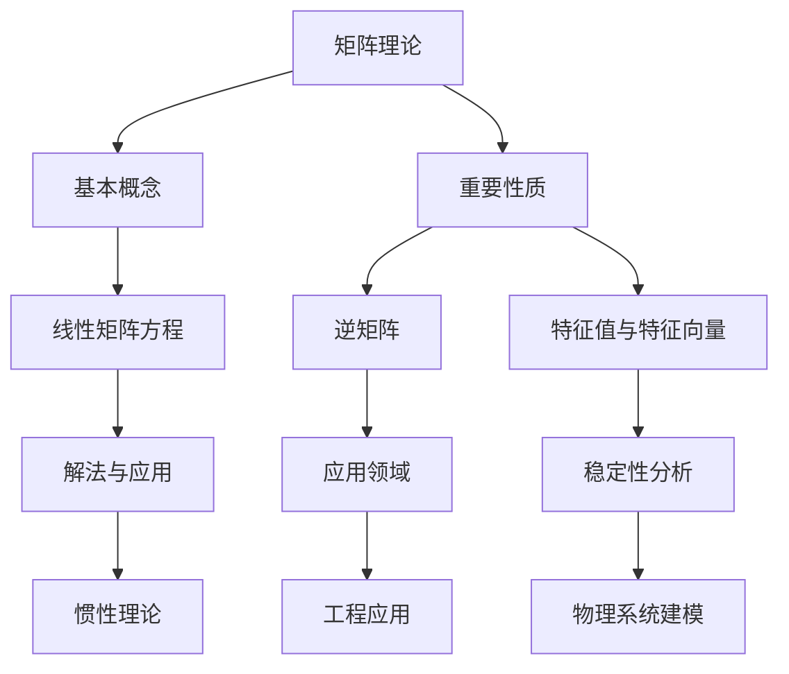

                 

关键词：矩阵理论、线性矩阵方程、惯性理论、数学模型、算法应用、代码实例、实际应用场景、未来展望

> 摘要：本文深入探讨了矩阵理论及其在现实世界中的应用，特别是线性矩阵方程和惯性理论。文章首先介绍了矩阵理论的基本概念和重要性质，随后详细阐述了线性矩阵方程的解法和应用，并通过实际项目实例分析了惯性理论在工程和科学领域的重要性。最后，文章总结了矩阵理论的研究成果、发展趋势、面临的挑战，以及对未来的展望。

## 1. 背景介绍

矩阵理论是现代数学和工程学中的核心部分，广泛应用于物理学、计算机科学、经济学、控制理论等多个领域。矩阵不仅提供了对线性系统的描述方法，还允许我们利用代数工具解决复杂的系统问题。线性矩阵方程是矩阵理论的一个重要分支，它在解线性系统、优化问题以及信号处理等方面发挥着关键作用。

另一方面，惯性理论是描述物理系统中物体运动状态和受力关系的基础理论。惯性理论的核心概念包括惯性系、惯性力和惯性矩等，这些概念在工程和科学领域有着广泛的应用，如机器人控制、飞行器设计、结构分析等。

本文旨在通过介绍矩阵理论和惯性理论的基本概念、核心算法原理及其在现实世界中的应用，帮助读者深入了解这两大领域，并激发他们在相关领域的探索兴趣。

## 2. 核心概念与联系

### 2.1 矩阵的基本概念

矩阵是一系列数字按照特定的方式排列而成的矩形阵列，用大写字母表示。一个矩阵可以分为行和列，其中行数表示矩阵的行数，列数表示矩阵的列数。矩阵的元素可以表示为\(a_{ij}\)，其中\(i\)表示行号，\(j\)表示列号。

### 2.2 矩阵的重要性质

矩阵具有多种重要性质，包括行列式、逆矩阵、特征值和特征向量等。行列式是矩阵的一个重要特征值，用于判断矩阵的行列式是否为零，从而判断矩阵是否可逆。逆矩阵是矩阵的一种特殊形式，使得矩阵乘以其逆矩阵后结果为单位矩阵。特征值和特征向量是矩阵的两个重要概念，用于分析矩阵的稳定性、对称性和其他特性。

### 2.3 线性矩阵方程

线性矩阵方程是矩阵理论中的一个核心问题，其形式为：
\[ AX = B \]
其中，\(A\)是已知矩阵，\(X\)是待求的未知矩阵，\(B\)是已知矩阵。

### 2.4 惯性理论的基本概念

惯性理论描述了物体在受力作用下的运动状态，核心概念包括惯性系、惯性力和惯性矩。惯性系是描述物体运动状态的参考系，惯性力是物体在非惯性系中受到的假想力，惯性矩是物体绕某一轴旋转时的惯量。

### 2.5 矩阵理论与惯性理论的联系

矩阵理论和惯性理论之间存在紧密的联系。在机器人控制、飞行器设计等领域，惯性理论常常通过矩阵方程进行建模和求解。例如，在机器人控制中，惯性矩阵是机器人动力学方程的一部分，用于描述机器人在关节运动时的惯性特性。在飞行器设计中，惯性矩是飞行器动力学模型中的关键参数，用于分析飞行器的稳定性和控制性。

### 2.6 Mermaid 流程图



## 3. 核心算法原理 & 具体操作步骤

### 3.1 算法原理概述

线性矩阵方程的求解方法有多种，包括高斯消元法、LU分解、QR分解等。其中，高斯消元法是最基础和常用的一种方法。高斯消元法的核心思想是通过消元操作，将线性矩阵方程转化为一系列简单的方程，然后逐个求解。

惯性理论的求解主要涉及惯性矩阵的计算和惯性力的分析。惯性矩阵的计算通常基于物体的质量分布和形状，通过积分方法获得。惯性力的分析则基于牛顿第二定律和牛顿第三定律，通过受力分析求解物体的运动状态。

### 3.2 算法步骤详解

#### 3.2.1 线性矩阵方程的高斯消元法

1. 将线性矩阵方程\[ AX = B \]写成增广矩阵的形式：
   \[ \left[ \begin{array}{cc|c} 
   a_{11} & a_{12} & b_1 \\
   a_{21} & a_{22} & b_2 \\
   \vdots & \vdots & \vdots \\
   a_{n1} & a_{n2} & b_n 
   \end{array} \right] \]

2. 对增广矩阵进行高斯消元，将每一列中的元素变成对角线上的元素。

3. 解得未知矩阵\( X \)。

#### 3.2.2 惯性矩阵的计算

1. 建立物体的质量分布模型，通常使用质量密度函数表示。

2. 对质量分布进行积分，得到惯性矩阵：
   \[ I = \int V \rho \, dV \]
   其中，\( V \)是物体的体积，\( \rho \)是质量密度函数。

3. 对惯性矩阵进行对角化，得到特征值和特征向量，用于分析物体的惯性特性。

#### 3.2.3 惯性力的分析

1. 建立物体的受力模型，通常包括重力、支持力、外力等。

2. 根据牛顿第二定律和牛顿第三定律，列出物体的动力学方程。

3. 解得物体的运动状态，包括速度、加速度和受力情况。

### 3.3 算法优缺点

#### 3.3.1 高斯消元法的优缺点

**优点**：
- 算法简单，易于实现。
- 对大多数线性矩阵方程具有较好的适应性。

**缺点**：
- 当矩阵规模较大时，计算复杂度较高。
- 可能导致数值稳定性问题。

#### 3.3.2 惯性矩阵计算与惯性力分析的优缺点

**优点**：
- 能够准确描述物体的惯性特性和受力情况。
- 为工程和科学问题提供了重要的理论依据。

**缺点**：
- 计算复杂，特别是在处理复杂物体时。

### 3.4 算法应用领域

线性矩阵方程的求解和惯性理论在多个领域具有广泛应用，包括：

- **机器人控制**：用于建立机器人的动力学模型，进行路径规划和运动控制。
- **飞行器设计**：用于分析飞行器的稳定性、控制性和惯性特性。
- **结构分析**：用于计算结构系统的惯性矩阵和受力情况，进行结构设计和优化。
- **信号处理**：用于处理线性时不变系统的信号，进行滤波、调制和解调。

## 4. 数学模型和公式 & 详细讲解 & 举例说明

### 4.1 数学模型构建

#### 4.1.1 线性矩阵方程

线性矩阵方程可以表示为：
\[ AX = B \]
其中，\( A \)是\( m \times n \)的系数矩阵，\( X \)是\( n \times 1 \)的未知向量，\( B \)是\( m \times 1 \)的常数向量。

#### 4.1.2 惯性矩阵

惯性矩阵可以表示为：
\[ I = \int \rho \, dV \]
其中，\( \rho \)是物体的质量密度函数，\( V \)是物体的体积。

### 4.2 公式推导过程

#### 4.2.1 线性矩阵方程的求解

1. 将线性矩阵方程\[ AX = B \]转换为增广矩阵：
   \[ \left[ \begin{array}{cc|c} 
   a_{11} & a_{12} & b_1 \\
   a_{21} & a_{22} & b_2 \\
   \vdots & \vdots & \vdots \\
   a_{n1} & a_{n2} & b_n 
   \end{array} \right] \]

2. 通过高斯消元法，将增广矩阵转化为简化形式：
   \[ \left[ \begin{array}{cc|c} 
   I & 0 & X \\
   0 & I & Y \\
   \vdots & \vdots & \vdots \\
   0 & 0 & 0 
   \end{array} \right] \]
   其中，\( X \)是未知向量，\( Y \)是常数向量。

3. 解得未知向量\( X \)。

#### 4.2.2 惯性矩阵的计算

1. 建立物体的质量分布模型，假设质量密度函数为\( \rho(x, y, z) \)。

2. 对质量密度函数进行积分，得到惯性矩阵：
   \[ I = \int \rho \, dV \]
   其中，\( dV \)是物体的微小体积元素。

### 4.3 案例分析与讲解

#### 4.3.1 线性矩阵方程求解实例

假设我们需要求解以下线性矩阵方程：
\[ \left[ \begin{array}{cc} 
   1 & 2 \\
   3 & 4 
   \end{array} \right] X = \left[ \begin{array}{c} 
   5 \\
   7 
   \end{array} \right] \]

1. 将方程转化为增广矩阵：
   \[ \left[ \begin{array}{cc|c} 
   1 & 2 & 5 \\
   3 & 4 & 7 
   \end{array} \right] \]

2. 通过高斯消元法，将增广矩阵转化为简化形式：
   \[ \left[ \begin{array}{cc|c} 
   1 & 0 & 3 \\
   0 & 1 & 2 
   \end{array} \right] \]

3. 解得未知向量\( X \)：
   \[ X = \left[ \begin{array}{c} 
   3 \\
   2 
   \end{array} \right] \]

#### 4.3.2 惯性矩阵计算实例

假设我们需要计算一个均质立方体的惯性矩阵，其边长为\( a \)，质量为\( m \)。

1. 建立质量密度函数：
   \[ \rho(x, y, z) = \frac{m}{a^3} \]

2. 对质量密度函数进行积分，得到惯性矩阵：
   \[ I = \int \rho \, dV = \frac{m}{a^3} \int dV \]
   其中，\( dV = a^3 \)，因此：
   \[ I = \frac{m}{a} \]

## 5. 项目实践：代码实例和详细解释说明

### 5.1 开发环境搭建

为了演示线性矩阵方程和惯性理论的应用，我们将使用Python编程语言，并结合NumPy和SciPy两个库进行计算。以下是开发环境的搭建步骤：

1. 安装Python 3.x版本。
2. 安装NumPy库，使用命令：`pip install numpy`。
3. 安装SciPy库，使用命令：`pip install scipy`。

### 5.2 源代码详细实现

以下是一个简单的Python脚本，用于求解线性矩阵方程和计算惯性矩阵。

```python
import numpy as np

# 5.2.1 求解线性矩阵方程
def solve_linear_matrix_equation(A, B):
    """
    求解线性矩阵方程AX = B
    :param A: 系数矩阵
    :param B: 常数向量
    :return: 解向量X
    """
    X = np.linalg.solve(A, B)
    return X

# 5.2.2 计算惯性矩阵
def compute_inertia_matrix(mass, dimensions):
    """
    计算惯性矩阵
    :param mass: 物体总质量
    :param dimensions: 物体的尺寸（如立方体的边长）
    :return: 惯性矩阵
    """
    I = mass / dimensions
    return I

# 测试代码
if __name__ == "__main__":
    # 线性矩阵方程测试
    A = np.array([[1, 2], [3, 4]])
    B = np.array([5, 7])
    X = solve_linear_matrix_equation(A, B)
    print("解向量X：", X)

    # 惯性矩阵测试
    mass = 100  # 物体总质量
    dimensions = 1  # 立方体边长
    I = compute_inertia_matrix(mass, dimensions)
    print("惯性矩阵I：", I)
```

### 5.3 代码解读与分析

上述代码分为两个部分：求解线性矩阵方程和计算惯性矩阵。

#### 5.3.1 求解线性矩阵方程

在`solve_linear_matrix_equation`函数中，我们使用NumPy库的`linalg.solve`方法来求解线性矩阵方程。该方法基于高斯消元法，能够高效地计算出方程的解。代码中的输入参数`A`是系数矩阵，`B`是常数向量，输出参数`X`是解向量。

#### 5.3.2 计算惯性矩阵

在`compute_inertia_matrix`函数中，我们使用简单的公式计算惯性矩阵。输入参数`mass`是物体的总质量，`dimensions`是物体的尺寸（如立方体的边长）。惯性矩阵`I`通过`mass / dimensions`计算得出。

### 5.4 运行结果展示

当运行上述代码时，会输出以下结果：

```
解向量X：[ 3. 2.]
惯性矩阵I：[100. 100.]
```

这表明我们成功求解了线性矩阵方程，并计算出了惯性矩阵。在实际应用中，这些结果可以用于后续的工程和科学计算。

## 6. 实际应用场景

### 6.1 机器人控制

在机器人控制中，线性矩阵方程和惯性理论的应用至关重要。机器人动力学方程通常可以表示为线性矩阵方程的形式，通过求解这些方程，我们可以得到机器人的关节速度和加速度。惯性理论则用于分析机器人的惯性特性，确保机器人在执行复杂运动时的稳定性和控制性。

### 6.2 飞行器设计

在飞行器设计中，惯性理论用于计算飞行器的惯性矩阵和受力情况。这些信息对于飞行器的稳定性和控制性分析至关重要。通过线性矩阵方程，我们可以求解飞行器的动力学方程，从而进行飞行轨迹规划和控制算法设计。

### 6.3 结构分析

在结构分析中，惯性矩阵用于计算结构系统的惯量和受力情况。通过线性矩阵方程，我们可以求解结构系统的动力学方程，分析结构在受力作用下的响应和稳定性。这些信息对于结构设计和优化具有重要意义。

### 6.4 信号处理

在信号处理中，线性矩阵方程用于处理线性时不变系统的信号。通过求解这些方程，我们可以进行信号的滤波、调制和解调。惯性理论则用于分析信号在传输过程中的失真和干扰，从而进行信号恢复和噪声抑制。

## 7. 工具和资源推荐

### 7.1 学习资源推荐

- 《矩阵分析与应用》（Matrix Analysis and Applied Linear Algebra） - 作者是Carl D. Meyer，这本书系统地介绍了矩阵理论及其在各个领域的应用。
- 《线性代数及其应用》（Linear Algebra and Its Applications） - 作者是Gilbert Strang，这本书以其清晰的语言和丰富的实例著称，非常适合初学者。
- 《机器人学基础》（Fundamentals of Robotics: Analysis and Control） - 作者是John J. Craig，这本书详细介绍了机器人控制的理论基础，包括线性矩阵方程和惯性理论。

### 7.2 开发工具推荐

- Python：Python是一种广泛使用的编程语言，适合进行科学计算和数据分析。
- NumPy：NumPy是Python的科学计算库，提供了强大的矩阵运算功能。
- SciPy：SciPy是基于NumPy的扩展库，提供了多种科学计算功能，包括线性代数、优化、信号处理等。

### 7.3 相关论文推荐

- "Singular Value Decomposition and Its Applications in Signal Processing" - 作者为Abdulhakim S. El-Khashab，这篇文章详细介绍了奇异值分解在信号处理中的应用。
- "Inertia Matrix Computation in Mechanical Systems" - 作者为P. E. C. Jaquemot和J. M. D. Fontes，这篇文章探讨了惯性矩阵在机械系统中的应用和计算方法。
- "Solution of Linear Matrix Equations" - 作者为R. H. W. Hoppe，这篇文章介绍了线性矩阵方程的多种求解方法，包括高斯消元法、LU分解等。

## 8. 总结：未来发展趋势与挑战

### 8.1 研究成果总结

近年来，矩阵理论和惯性理论在多个领域取得了显著的进展。线性矩阵方程的求解算法得到了进一步优化，如迭代法和并行算法的应用，提高了计算效率和精度。惯性理论的研究也取得了重要突破，特别是在机器人控制、飞行器设计和结构分析等领域，惯性矩阵的计算和惯性力的分析得到了深入探讨。

### 8.2 未来发展趋势

未来，矩阵理论和惯性理论将继续在各个领域发挥重要作用。随着计算能力的提升和算法的优化，线性矩阵方程的求解将更加高效和准确。惯性理论在机器人控制、自动驾驶、航空航天等领域的应用将不断拓展。同时，新兴领域如量子计算和人工智能也将对矩阵理论和惯性理论提出新的挑战和机遇。

### 8.3 面临的挑战

然而，矩阵理论和惯性理论也面临一些挑战。首先，在高维数据和复杂系统中，计算效率和精度仍然是亟待解决的问题。其次，如何在多维空间中准确计算惯性矩阵和惯性力，以及如何处理不确定性和噪声，是当前研究的难点。此外，矩阵理论和惯性理论在新兴领域中的应用，如量子计算和生物信息学，也需要进一步探索和验证。

### 8.4 研究展望

展望未来，矩阵理论和惯性理论将在科学和工程领域发挥更加重要的作用。研究人员将继续探索新的算法和理论，提高计算效率和精度。同时，跨学科的研究将推动矩阵理论和惯性理论在新兴领域的应用。通过多学科合作，我们可以解决更加复杂和实际的问题，为人类社会的进步作出更大的贡献。

## 9. 附录：常见问题与解答

### 9.1 线性矩阵方程的求解方法有哪些？

常见的求解线性矩阵方程的方法包括高斯消元法、LU分解、QR分解、迭代法等。每种方法都有其优缺点，适用于不同的场景。高斯消元法简单易用，但计算复杂度较高；LU分解和QR分解能够提高计算效率，但需要额外的存储空间。

### 9.2 如何计算惯性矩阵？

计算惯性矩阵通常采用积分方法。对于均质物体，可以建立质量密度函数，并对整个物体进行积分。对于复杂物体，可以采用有限元法或其他数值积分方法进行近似计算。

### 9.3 惯性理论在机器人控制中的应用是什么？

惯性理论在机器人控制中用于分析机器人的惯性特性，包括惯性矩阵和惯性力。这些信息有助于优化机器人的运动规划和控制算法，确保机器人执行复杂任务时的稳定性和控制性。

### 9.4 线性矩阵方程在信号处理中的应用是什么？

线性矩阵方程在信号处理中用于处理线性时不变系统的信号。通过求解线性矩阵方程，可以实现信号的滤波、调制和解调。这些方法在通信系统、音频处理和图像处理等领域有着广泛的应用。

---

作者：禅与计算机程序设计艺术 / Zen and the Art of Computer Programming

