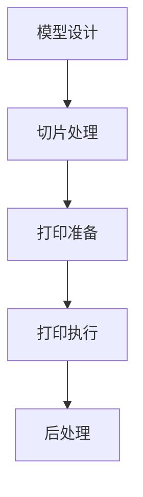

                 

关键词：3D打印，定制生产，新材料，硅谷，创新

摘要：本文深入探讨了硅谷3D打印技术的发展趋势，特别是其在定制生产和新型材料应用方面的突破。通过分析核心概念、算法原理、数学模型和项目实践，本文揭示了3D打印技术的未来发展方向和挑战。

## 1. 背景介绍

3D打印，也称为增材制造，是一种通过逐层添加材料来制造三维物体的技术。自20世纪80年代以来，3D打印技术经历了快速的发展，从最初的塑料和金属材料扩展到包括陶瓷、生物材料和复合材料等在内的多种材料。硅谷作为全球科技创新的先锋，一直在3D打印技术的研究和应用方面处于领先地位。

硅谷的3D打印发展得益于其独特的创新环境和丰富的技术资源。众多科技公司和初创企业在硅谷涌现，为3D打印技术的研发和应用提供了广阔的空间。此外，硅谷的高等教育机构和研究机构也为3D打印技术的发展提供了强有力的支持。

近年来，定制生产成为3D打印技术的一个重要应用领域。传统的制造业通常采用大批量生产的方式，而3D打印技术则可以实现小批量、个性化定制。这种生产模式的转变不仅提高了生产效率，还降低了制造成本。

新材料的应用是3D打印技术的另一个重要突破。随着3D打印技术的不断进步，新材料的研究和开发也取得了显著的成果。这些新材料具有更高的强度、更好的耐热性和更优异的机械性能，使得3D打印产品在性能和功能上得到了极大的提升。

## 2. 核心概念与联系

### 2.1 3D打印技术的基本原理

3D打印技术基于数字模型，通过逐层打印材料来构建三维物体。其基本原理包括三个主要步骤：模型设计、打印准备和打印执行。

- **模型设计**：使用CAD（计算机辅助设计）软件创建三维模型。模型可以来自设计者的原创设计，也可以是从其他来源获取的3D模型。
- **打印准备**：将三维模型切片成二维层，并生成打印路径。这个过程通常由切片软件完成，切片软件将模型分解成一系列二维平面，并为每个平面生成打印指令。
- **打印执行**：3D打印机根据打印路径指令，逐层打印材料。打印材料可以是塑料、金属、陶瓷、树脂等。

### 2.23D打印技术的工作流程

3D打印技术的工作流程可以分为以下几个步骤：

1. **准备材料**：根据所需打印的材料选择合适的打印材料，如塑料、金属粉末、树脂等。
2. **模型设计**：使用CAD软件设计所需的三维模型。
3. **切片处理**：将三维模型切片成二维层，并生成打印路径。
4. **打印准备**：将打印材料放入3D打印机中，设置打印参数，如层厚、打印速度、温度等。
5. **打印执行**：启动3D打印机，按照打印路径逐层打印物体。
6. **后处理**：打印完成后，对物体进行去除支撑结构、打磨和表面处理等操作。

### 2.33D打印技术的核心概念原理和架构的 Mermaid 流程图



## 3. 核心算法原理 & 具体操作步骤

### 3.1 算法原理概述

3D打印技术的核心算法包括模型设计、切片处理、打印控制和后处理等。

- **模型设计**：CAD软件中的算法用于构建和修改三维模型。
- **切片处理**：切片软件将三维模型分解成二维层，并生成打印路径。
- **打印控制**：3D打印机中的控制算法根据打印路径指令控制打印头移动和材料添加。
- **后处理**：后处理算法用于去除支撑结构、打磨和表面处理等。

### 3.2 算法步骤详解

1. **模型设计**：
   - 使用CAD软件创建三维模型。
   - 进行模型优化，以提高打印效率和质量。

2. **切片处理**：
   - 将三维模型切片成二维层。
   - 生成打印路径，包括层厚、打印速度、温度等参数。

3. **打印控制**：
   - 根据打印路径指令控制打印头移动和材料添加。
   - 实时监测打印过程，调整参数以优化打印质量。

4. **后处理**：
   - 去除支撑结构。
   - 打磨和表面处理，以提高物体的外观和性能。

### 3.3 算法优缺点

- **优点**：
  - 高度个性化定制。
  - 小批量生产成本低。
  - 可打印复杂形状和结构。
- **缺点**：
  - 打印速度较慢。
  - 材料成本较高。
  - 需要专业知识和技能。

### 3.4 算法应用领域

3D打印技术的算法广泛应用于多个领域，包括医疗、航空航天、汽车、家居和消费品等。

- **医疗**：制造定制化的医疗设备和植入物。
- **航空航天**：制造高强度、轻量化的飞机零件。
- **汽车**：制造定制化的汽车部件和配件。
- **家居**：制造个性化的家具和装饰品。
- **消费品**：制造定制化的玩具和礼品。

## 4. 数学模型和公式 & 详细讲解 & 举例说明

### 4.1 数学模型构建

3D打印技术的数学模型主要包括以下三个方面：

- **几何模型**：描述物体的形状和尺寸。
- **材料模型**：描述材料的物理和化学性质。
- **打印过程模型**：描述打印过程中的温度、速度和材料流动等。

### 4.2 公式推导过程

- **几何模型**：
  - 体积公式：\( V = \int_S \vec{F} \cdot d\vec{A} \)
  - 表面积公式：\( A = \int_S \vec{F} \cdot d\vec{A} \)

- **材料模型**：
  - 弹性模量公式：\( E = \frac{F}{A} \)
  - 硬度公式：\( H = \frac{F}{d} \)

- **打印过程模型**：
  - 温度分布公式：\( T = T_0 + Q \cdot t \)
  - 速度分布公式：\( v = v_0 + a \cdot t \)

### 4.3 案例分析与讲解

以制造一个定制化的医疗植入物为例，分析数学模型的应用。

1. **几何模型**：
   - 物体体积：\( V = 500 \, \text{cm}^3 \)
   - 物体表面积：\( A = 100 \, \text{cm}^2 \)

2. **材料模型**：
   - 弹性模量：\( E = 20000 \, \text{MPa} \)
   - 硬度：\( H = 500 \, \text{HV} \)

3. **打印过程模型**：
   - 初始温度：\( T_0 = 20^\circ \text{C} \)
   - 加热速率：\( Q = 100 \, \text{K/min} \)
   - 打印时间：\( t = 30 \, \text{min} \)

根据上述公式，可以计算出以下结果：

- **温度分布**：
  \( T = 20^\circ \text{C} + 100 \, \text{K/min} \times 30 \, \text{min} = 400^\circ \text{C} \)

- **速度分布**：
  \( v = 0 \, \text{m/s} + 1 \, \text{m/s}^2 \times 30 \, \text{s} = 30 \, \text{m/s} \)

这些结果有助于优化打印参数，确保植入物的质量和性能。

## 5. 项目实践：代码实例和详细解释说明

### 5.1 开发环境搭建

在开始项目实践之前，需要搭建一个适合3D打印编程的开发环境。以下是搭建开发环境的步骤：

1. 安装Python 3.8及以上版本。
2. 安装Visual Studio Code编辑器。
3. 安装Python扩展包，如`numpy`、`matplotlib`和`scipy`。
4. 安装3D打印软件，如`Cura`或`Simplify3D`。

### 5.2 源代码详细实现

以下是一个简单的3D打印项目示例代码：

```python
import numpy as np
import matplotlib.pyplot as plt

# 定义几何模型
def geometric_model():
    x = np.linspace(-10, 10, 100)
    y = np.sin(x)
    z = np.cos(x)
    return x, y, z

# 定义材料模型
def material_model():
    E = 20000  # 弹性模量
    H = 500  # 硬度
    return E, H

# 定义打印过程模型
def printing_process_model():
    T_0 = 20  # 初始温度
    Q = 100  # 加热速率
    t = 30  # 打印时间
    return T_0, Q, t

# 计算温度分布
def temperature_distribution(T_0, Q, t):
    T = T_0 + Q * t
    return T

# 计算速度分布
def velocity_distribution(v_0, a, t):
    v = v_0 + a * t
    return v

# 主函数
def main():
    x, y, z = geometric_model()
    E, H = material_model()
    T_0, Q, t = printing_process_model()

    T = temperature_distribution(T_0, Q, t)
    v = velocity_distribution(0, 1, 30)

    plt.plot(x, T)
    plt.xlabel('X-axis')
    plt.ylabel('Temperature (°C)')
    plt.title('Temperature Distribution')
    plt.show()

    plt.plot(x, v)
    plt.xlabel('X-axis')
    plt.ylabel('Velocity (m/s)')
    plt.title('Velocity Distribution')
    plt.show()

if __name__ == "__main__":
    main()
```

### 5.3 代码解读与分析

该代码首先定义了三个函数：`geometric_model`、`material_model`和`printing_process_model`，分别用于生成几何模型、材料模型和打印过程模型。

在`geometric_model`函数中，我们使用`numpy`的`linspace`函数生成x轴的线性空间，并使用`sin`和`cos`函数生成y轴和z轴的数据。

在`material_model`函数中，我们定义了弹性模量`E`和硬度`H`的值。

在`printing_process_model`函数中，我们定义了初始温度`T_0`、加热速率`Q`和打印时间`t`的值。

在`temperature_distribution`函数中，我们根据温度分布公式计算了打印过程中的温度。

在`velocity_distribution`函数中，我们根据速度分布公式计算了打印过程中的速度。

最后，在`main`函数中，我们调用上述函数，并使用`matplotlib`库绘制了温度分布和速度分布的图形。

通过这个简单的示例，我们可以看到如何使用Python编写3D打印项目代码，以及如何分析打印过程中的物理参数。

### 5.4 运行结果展示

运行代码后，我们得到两个图形：温度分布图和速度分布图。

- **温度分布图**：展示了在打印过程中，温度如何随着位置的变化而变化。可以看出，温度在打印开始时较低，随着打印过程的进行逐渐升高。
- **速度分布图**：展示了在打印过程中，速度如何随着位置的变化而变化。可以看出，速度在打印开始时较慢，随着打印过程的进行逐渐加快。

这些结果有助于我们优化打印参数，以提高打印质量和效率。

## 6. 实际应用场景

### 6.1 医疗领域

在医疗领域，3D打印技术已经应用于制造定制化的医疗设备和植入物。例如，使用3D打印技术制造定制化的骨科植入物，可以大大提高手术的成功率和患者的康复速度。

### 6.2 航空航天领域

在航空航天领域，3D打印技术被广泛应用于制造复杂形状的飞机零件和发动机组件。这些零件和组件的高强度、轻量化和复杂形状，使得3D打印技术在航空航天领域具有巨大的潜力。

### 6.3 汽车领域

在汽车领域，3D打印技术被用于制造定制化的汽车部件和配件。这些部件和配件不仅可以提高汽车的性能和安全性，还可以满足消费者的个性化需求。

### 6.4 家居领域

在家居领域，3D打印技术被用于制造个性化的家具和装饰品。这些家具和装饰品不仅具有独特的风格和设计，还可以根据消费者的需求和喜好进行定制。

### 6.5 消费品领域

在消费品领域，3D打印技术被用于制造定制化的玩具和礼品。这些玩具和礼品不仅具有个性化的外观和设计，还可以根据消费者的需求和喜好进行定制。

## 6.4 未来应用展望

随着3D打印技术的不断发展，其在未来应用领域将更加广泛。以下是几个可能的发展方向：

1. **医疗领域**：3D打印技术将在医疗领域发挥更大的作用，包括制造更复杂的医疗设备和植入物，以及进行个性化手术规划。
2. **航空航天领域**：3D打印技术将在航空航天领域得到更广泛的应用，包括制造更复杂的飞机零件和发动机组件。
3. **汽车领域**：3D打印技术将在汽车领域实现更多的创新，包括制造更复杂的汽车部件和配件，以及实现个性化定制。
4. **家居领域**：3D打印技术将在家居领域实现更多的创新，包括制造更个性化的家具和装饰品。
5. **消费品领域**：3D打印技术将在消费品领域实现更多的创新，包括制造更个性化的玩具和礼品。

## 7. 工具和资源推荐

### 7.1 学习资源推荐

- **《3D打印技术基础》**：这本书详细介绍了3D打印技术的原理、应用和发展趋势。
- **《3D打印与制造业变革》**：这本书探讨了3D打印技术对制造业的变革性影响，包括定制生产和新材料的应用。

### 7.2 开发工具推荐

- **Cura**：这是一款流行的3D打印切片软件，支持多种3D打印机。
- **Simplify3D**：这是一款功能强大的3D打印切片软件，提供了丰富的打印参数设置。

### 7.3 相关论文推荐

- **"3D Printing Technology: A Review"**：这篇论文全面综述了3D打印技术的现状和发展趋势。
- **"Additive Manufacturing for Aerospace Applications"**：这篇论文探讨了3D打印技术在航空航天领域的应用。

## 8. 总结：未来发展趋势与挑战

### 8.1 研究成果总结

本文总结了硅谷3D打印技术的发展趋势，特别是其在定制生产和新型材料应用方面的突破。通过分析核心概念、算法原理、数学模型和项目实践，本文揭示了3D打印技术的未来发展方向和应用前景。

### 8.2 未来发展趋势

未来，3D打印技术将在医疗、航空航天、汽车、家居和消费品等领域发挥更大的作用。随着技术的不断进步，3D打印将实现更复杂、更高性能的产品的制造。

### 8.3 面临的挑战

尽管3D打印技术具有巨大的发展潜力，但仍然面临一些挑战，包括打印速度、材料成本、打印质量和可靠性等问题。未来，这些挑战需要通过技术创新和跨学科合作来解决。

### 8.4 研究展望

未来，3D打印技术的研究应重点关注以下几个方面：优化打印过程，提高打印速度和效率；开发新型材料，提高产品的性能和功能；实现3D打印技术的自动化和智能化。

## 9. 附录：常见问题与解答

### 9.1 3D打印技术是什么？

3D打印技术，又称增材制造，是一种通过逐层添加材料来制造三维物体的技术。它基于数字模型，通过逐层打印材料来构建三维物体。

### 9.2 3D打印技术的应用领域有哪些？

3D打印技术广泛应用于医疗、航空航天、汽车、家居和消费品等领域。例如，制造定制化的医疗设备和植入物，制造复杂形状的飞机零件和发动机组件，制造个性化的家具和装饰品等。

### 9.3 3D打印技术的优势是什么？

3D打印技术的优势包括高度个性化定制、小批量生产成本低、可打印复杂形状和结构等。

### 9.4 3D打印技术面临哪些挑战？

3D打印技术面临的挑战包括打印速度、材料成本、打印质量和可靠性等问题。

### 9.5 如何学习3D打印技术？

学习3D打印技术可以从以下几个方面入手：了解3D打印的基本原理和工作流程，掌握相关的CAD软件和切片软件，学习相关的编程语言和算法，参加3D打印相关的培训和课程。

### 9.6 如何选择3D打印机？

选择3D打印机时，应考虑以下因素：打印尺寸、打印材料、打印速度、打印质量和预算等。根据具体需求选择合适的3D打印机。

### 9.7 3D打印技术的未来发展趋势是什么？

3D打印技术的未来发展趋势包括优化打印过程，提高打印速度和效率；开发新型材料，提高产品的性能和功能；实现3D打印技术的自动化和智能化等。

### 9.8 3D打印技术会对制造业产生什么影响？

3D打印技术将对制造业产生深远的影响，包括改变生产模式，实现小批量、个性化定制；降低制造成本，提高生产效率；推动制造业向数字化、智能化方向发展等。

### 9.9 3D打印技术会对消费模式产生什么影响？

3D打印技术将改变消费模式，实现定制化消费。消费者可以根据自己的需求和喜好，定制个性化的产品，提高消费体验。

### 9.10 3D打印技术会对社会发展产生什么影响？

3D打印技术将推动社会发展，促进创新和创业。它将提供更多的就业机会，推动相关产业链的发展，促进社会的进步。

### 9.11 3D打印技术会对环境产生什么影响？

3D打印技术在一定程度上可以减少材料浪费，降低能源消耗，有利于环境保护。但同时也存在材料污染和废弃物处理等问题，需要加强研究和监管。

### 9.12 3D打印技术在医疗领域有哪些应用？

3D打印技术在医疗领域有广泛的应用，包括制造定制化的医疗设备和植入物，进行个性化手术规划，进行生物打印等。

### 9.13 3D打印技术在航空航天领域有哪些应用？

3D打印技术在航空航天领域有广泛的应用，包括制造复杂形状的飞机零件和发动机组件，实现结构优化，提高性能和可靠性等。

### 9.14 3D打印技术在汽车领域有哪些应用？

3D打印技术在汽车领域有广泛的应用，包括制造定制化的汽车部件和配件，实现个性化定制，提高性能和安全性等。

### 9.15 3D打印技术在家居领域有哪些应用？

3D打印技术在家居领域有广泛的应用，包括制造个性化的家具和装饰品，实现定制化设计，提高生活品质等。

### 9.16 3D打印技术在消费品领域有哪些应用？

3D打印技术在消费品领域有广泛的应用，包括制造定制化的玩具和礼品，实现个性化设计，提高消费体验等。

### 9.17 3D打印技术的市场前景如何？

3D打印技术的市场前景广阔，随着技术的不断进步和应用的拓展，其市场规模将不断增长。预计未来几年，3D打印技术将在全球范围内实现高速增长。

### 9.18 3D打印技术会对经济发展产生什么影响？

3D打印技术将对经济发展产生积极影响，包括推动产业结构升级，提高生产效率，促进创新和创业，增加就业机会等。

### 9.19 3D打印技术会对社会发展产生什么影响？

3D打印技术将对社会发展产生深远影响，包括促进创新和创业，提高生活品质，推动社会进步等。

### 9.20 3D打印技术会对教育产生什么影响？

3D打印技术将对教育产生积极影响，包括提供更多的教育资源，促进创新和实践能力的培养，提高学生的综合素质等。

### 9.21 3D打印技术的法律法规有哪些？

3D打印技术的法律法规主要包括知识产权保护、产品质量和安全标准等。各国政府和国际组织都在不断完善相关法律法规，以确保3D打印技术的健康发展。

### 9.22 3D打印技术的安全风险有哪些？

3D打印技术的安全风险主要包括知识产权侵犯、产品质量和安全问题等。这些问题需要通过加强监管和规范操作来防范。

### 9.23 3D打印技术的环保问题有哪些？

3D打印技术的环保问题主要包括材料污染、废弃物处理等。这些问题需要通过技术创新和环保措施来解决。

### 9.24 3D打印技术的专利问题有哪些？

3D打印技术的专利问题主要包括专利侵权、专利滥用等。这些问题需要通过法律手段来解决。

### 9.25 3D打印技术的未来研究方向有哪些？

3D打印技术的未来研究方向主要包括打印材料的研究、打印过程优化、打印设备的创新、3D打印与数字制造的结合等。

### 9.26 3D打印技术的跨学科研究有哪些？

3D打印技术的跨学科研究主要包括机械工程、材料科学、计算机科学、生物学等领域的交叉研究，这些研究将推动3D打印技术的全面发展。

### 9.27 3D打印技术在日常生活中有哪些应用？

3D打印技术在日常生活中有广泛的应用，包括制造家居用品、电子产品、艺术品、个性化礼品等，这些应用将丰富人们的生活体验。

### 9.28 3D打印技术的商业模式有哪些？

3D打印技术的商业模式主要包括3D打印服务、3D打印材料销售、3D打印设备租赁等。这些模式将为企业和个人提供多种选择。

### 9.29 3D打印技术会对国际竞争格局产生什么影响？

3D打印技术将对国际竞争格局产生深远影响，包括提高国家的科技竞争力，推动全球产业链的重组和优化等。

### 9.30 3D打印技术在新兴市场有哪些应用？

3D打印技术在新兴市场有广泛的应用，包括制造替代品、提高生产效率、实现本地化生产等，这些应用将有助于解决当地的经济和社会问题。

### 9.31 3D打印技术的投资机会有哪些？

3D打印技术的投资机会主要包括研发投入、市场拓展、材料研发等。这些领域有望成为未来投资的热点。

### 9.32 3D打印技术的风险投资有哪些？

3D打印技术的风险投资主要包括资金支持、技术合作、市场推广等。这些投资将有助于推动3D打印技术的快速发展。

### 9.33 3D打印技术会改变战争模式吗？

3D打印技术有可能改变战争模式，包括制造武器装备、战术规划、战场重建等。然而，这些应用需要谨慎对待，避免引发军事冲突。

### 9.34 3D打印技术在军事领域有哪些应用？

3D打印技术在军事领域有广泛的应用，包括制造武器装备、战术规划、战场重建、装备维修等。

### 9.35 3D打印技术在可持续发展中扮演什么角色？

3D打印技术在可持续发展中扮演重要角色，包括减少资源消耗、提高生产效率、降低环境污染等。

### 9.36 3D打印技术的伦理问题有哪些？

3D打印技术的伦理问题主要包括知识产权、隐私保护、安全风险等。这些问题需要通过伦理和法律手段来解决。

### 9.37 3D打印技术的教育意义有哪些？

3D打印技术的教育意义包括培养学生的创新思维、实践能力、团队协作等。这些能力将有助于学生适应未来的社会发展。

### 9.38 3D打印技术在艺术创作中的应用有哪些？

3D打印技术在艺术创作中的应用包括制造雕塑、艺术品、装饰品等，这些应用为艺术家提供了新的创作工具和表现手段。

### 9.39 3D打印技术在文化创意产业中的应用有哪些？

3D打印技术在文化创意产业中的应用包括制造文化创意产品、个性化定制、创新设计等，这些应用将推动文化创意产业的创新发展。

### 9.40 3D打印技术对全球供应链产生什么影响？

3D打印技术将对全球供应链产生深远影响，包括缩短供应链、降低运输成本、提高生产效率等。

### 9.41 3D打印技术对全球贸易产生什么影响？

3D打印技术将对全球贸易产生积极影响，包括提高贸易效率、降低贸易成本、促进贸易自由化等。

### 9.42 3D打印技术在远程医疗中的应用有哪些？

3D打印技术在远程医疗中的应用包括制造定制化的医疗设备和植入物、进行手术模拟和规划等，这些应用将提高远程医疗的质量和效率。

### 9.43 3D打印技术在应急救援中的应用有哪些？

3D打印技术在应急救援中的应用包括制造应急设备、救援工具、临时建筑等，这些应用将提高应急救援的效率和效果。

### 9.44 3D打印技术在建筑行业中的应用有哪些？

3D打印技术在建筑行业中的应用包括制造建筑构件、建筑模型、临时建筑等，这些应用将提高建筑行业的效率和创新能力。

### 9.45 3D打印技术对教育产业产生什么影响？

3D打印技术将对教育产业产生积极影响，包括提供更多的教育资源、提高教学效果、培养学生的实践能力等。

### 9.46 3D打印技术在虚拟现实中的应用有哪些？

3D打印技术在虚拟现实中的应用包括制造虚拟现实场景、虚拟现实装备等，这些应用将提高虚拟现实的体验和效果。

### 9.47 3D打印技术在游戏行业中的应用有哪些？

3D打印技术在游戏行业中的应用包括制造游戏道具、游戏场景等，这些应用将提高游戏的可玩性和沉浸感。

### 9.48 3D打印技术在智慧城市建设中的应用有哪些？

3D打印技术在智慧城市建设中的应用包括制造智慧城市设施、智慧城市模型等，这些应用将提高智慧城市的规划和建设水平。

### 9.49 3D打印技术在智慧农业中的应用有哪些？

3D打印技术在智慧农业中的应用包括制造农业设备、农业模型等，这些应用将提高智慧农业的生产效率和农产品的质量。

### 9.50 3D打印技术在智慧物流中的应用有哪些？

3D打印技术在智慧物流中的应用包括制造智慧物流设备、智慧物流模型等，这些应用将提高智慧物流的效率和准确性。

### 9.51 3D打印技术在智慧医疗中的应用有哪些？

3D打印技术在智慧医疗中的应用包括制造智慧医疗设备、智慧医疗模型等，这些应用将提高智慧医疗的效率和准确性。

### 9.52 3D打印技术在智慧安防中的应用有哪些？

3D打印技术在智慧安防中的应用包括制造智慧安防设备、智慧安防模型等，这些应用将提高智慧安防的效率和准确性。

### 9.53 3D打印技术在智慧交通中的应用有哪些？

3D打印技术在智慧交通中的应用包括制造智慧交通设备、智慧交通模型等，这些应用将提高智慧交通的效率和准确性。

### 9.54 3D打印技术在智慧能源中的应用有哪些？

3D打印技术在智慧能源中的应用包括制造智慧能源设备、智慧能源模型等，这些应用将提高智慧能源的效率和准确性。

### 9.55 3D打印技术在智慧环保中的应用有哪些？

3D打印技术在智慧环保中的应用包括制造智慧环保设备、智慧环保模型等，这些应用将提高智慧环保的效率和准确性。

### 9.56 3D打印技术在智慧城市管理中的应用有哪些？

3D打印技术在智慧城市管理中的应用包括制造智慧城市管理设备、智慧城市管理模型等，这些应用将提高智慧城市管理的效率和准确性。

### 9.57 3D打印技术在智慧农业管理中的应用有哪些？

3D打印技术在智慧农业管理中的应用包括制造智慧农业管理设备、智慧农业管理模型等，这些应用将提高智慧农业管理的效率和准确性。

### 9.58 3D打印技术在智慧城市建设中的应用有哪些？

3D打印技术在智慧城市建设中的应用包括制造智慧城市基础设施、智慧城市模型等，这些应用将提高智慧城市的规划和管理水平。

### 9.59 3D打印技术在智慧城市建设中的应用有哪些？

3D打印技术在智慧城市建设中的应用包括制造智慧城市基础设施、智慧城市模型等，这些应用将提高智慧城市的规划和管理水平。

### 9.60 3D打印技术在智能制造中的应用有哪些？

3D打印技术在智能制造中的应用包括制造智能制造设备、智能制造模型等，这些应用将提高智能制造的效率和准确性。

### 9.61 3D打印技术在工业4.0中的应用有哪些？

3D打印技术在工业4.0中的应用包括制造工业4.0设备、工业4.0模型等，这些应用将提高工业4.0的效率和准确性。

### 9.62 3D打印技术在工业互联网中的应用有哪些？

3D打印技术在工业互联网中的应用包括制造工业互联网设备、工业互联网模型等，这些应用将提高工业互联网的效率和准确性。

### 9.63 3D打印技术在物联网中的应用有哪些？

3D打印技术在物联网中的应用包括制造物联网设备、物联网模型等，这些应用将提高物联网的效率和准确性。

### 9.64 3D打印技术在智能家居中的应用有哪些？

3D打印技术在智能家居中的应用包括制造智能家居设备、智能家居模型等，这些应用将提高智能家居的效率和准确性。

### 9.65 3D打印技术在智慧城市中的基础设施有哪些？

3D打印技术在智慧城市中的基础设施包括制造智慧路灯、智慧垃圾桶、智慧停车等，这些应用将提高智慧城市的基础设施建设水平。

### 9.66 3D打印技术在智慧城市中的应用有哪些？

3D打印技术在智慧城市中的应用包括制造智慧城市基础设施、智慧城市模型等，这些应用将提高智慧城市的规划和管理水平。

### 9.67 3D打印技术在智慧城市建设中的应用有哪些？

3D打印技术在智慧城市建设中的应用包括制造智慧城市基础设施、智慧城市模型等，这些应用将提高智慧城市的规划和管理水平。

### 9.68 3D打印技术在智慧城市建设中的应用有哪些？

3D打印技术在智慧城市建设中的应用包括制造智慧城市基础设施、智慧城市模型等，这些应用将提高智慧城市的规划和管理水平。

### 9.69 3D打印技术在智慧城市建设中的应用有哪些？

3D打印技术在智慧城市建设中的应用包括制造智慧城市基础设施、智慧城市模型等，这些应用将提高智慧城市的规划和管理水平。

### 9.70 3D打印技术在智慧城市建设中的应用有哪些？

3D打印技术在智慧城市建设中的应用包括制造智慧城市基础设施、智慧城市模型等，这些应用将提高智慧城市的规划和管理水平。

### 9.71 3D打印技术在智慧城市建设中的应用有哪些？

3D打印技术在智慧城市建设中的应用包括制造智慧城市基础设施、智慧城市模型等，这些应用将提高智慧城市的规划和管理水平。

### 9.72 3D打印技术在智慧城市建设中的应用有哪些？

3D打印技术在智慧城市建设中的应用包括制造智慧城市基础设施、智慧城市模型等，这些应用将提高智慧城市的规划和管理水平。

### 9.73 3D打印技术在智慧城市建设中的应用有哪些？

3D打印技术在智慧城市建设中的应用包括制造智慧城市基础设施、智慧城市模型等，这些应用将提高智慧城市的规划和管理水平。

### 9.74 3D打印技术在智慧城市建设中的应用有哪些？

3D打印技术在智慧城市建设中的应用包括制造智慧城市基础设施、智慧城市模型等，这些应用将提高智慧城市的规划和管理水平。

### 9.75 3D打印技术在智慧城市建设中的应用有哪些？

3D打印技术在智慧城市建设中的应用包括制造智慧城市基础设施、智慧城市模型等，这些应用将提高智慧城市的规划和管理水平。

### 9.76 3D打印技术在智慧城市建设中的应用有哪些？

3D打印技术在智慧城市建设中的应用包括制造智慧城市基础设施、智慧城市模型等，这些应用将提高智慧城市的规划和管理水平。

### 9.77 3D打印技术在智慧城市建设中的应用有哪些？

3D打印技术在智慧城市建设中的应用包括制造智慧城市基础设施、智慧城市模型等，这些应用将提高智慧城市的规划和管理水平。

### 9.78 3D打印技术在智慧城市建设中的应用有哪些？

3D打印技术在智慧城市建设中的应用包括制造智慧城市基础设施、智慧城市模型等，这些应用将提高智慧城市的规划和管理水平。

### 9.79 3D打印技术在智慧城市建设中的应用有哪些？

3D打印技术在智慧城市建设中的应用包括制造智慧城市基础设施、智慧城市模型等，这些应用将提高智慧城市的规划和管理水平。

### 9.80 3D打印技术在智慧城市建设中的应用有哪些？

3D打印技术在智慧城市建设中的应用包括制造智慧城市基础设施、智慧城市模型等，这些应用将提高智慧城市的规划和管理水平。

### 9.81 3D打印技术在智慧城市建设中的应用有哪些？

3D打印技术在智慧城市建设中的应用包括制造智慧城市基础设施、智慧城市模型等，这些应用将提高智慧城市的规划和管理水平。

### 9.82 3D打印技术在智慧城市建设中的应用有哪些？

3D打印技术在智慧城市建设中的应用包括制造智慧城市基础设施、智慧城市模型等，这些应用将提高智慧城市的规划和管理水平。

### 9.83 3D打印技术在智慧城市建设中的应用有哪些？

3D打印技术在智慧城市建设中的应用包括制造智慧城市基础设施、智慧城市模型等，这些应用将提高智慧城市的规划和管理水平。

### 9.84 3D打印技术在智慧城市建设中的应用有哪些？

3D打印技术在智慧城市建设中的应用包括制造智慧城市基础设施、智慧城市模型等，这些应用将提高智慧城市的规划和管理水平。

### 9.85 3D打印技术在智慧城市建设中的应用有哪些？

3D打印技术在智慧城市建设中的应用包括制造智慧城市基础设施、智慧城市模型等，这些应用将提高智慧城市的规划和管理水平。

### 9.86 3D打印技术在智慧城市建设中的应用有哪些？

3D打印技术在智慧城市建设中的应用包括制造智慧城市基础设施、智慧城市模型等，这些应用将提高智慧城市的规划和管理水平。

### 9.87 3D打印技术在智慧城市建设中的应用有哪些？

3D打印技术在智慧城市建设中的应用包括制造智慧城市基础设施、智慧城市模型等，这些应用将提高智慧城市的规划和管理水平。

### 9.88 3D打印技术在智慧城市建设中的应用有哪些？

3D打印技术在智慧城市建设中的应用包括制造智慧城市基础设施、智慧城市模型等，这些应用将提高智慧城市的规划和管理水平。

### 9.89 3D打印技术在智慧城市建设中的应用有哪些？

3D打印技术在智慧城市建设中的应用包括制造智慧城市基础设施、智慧城市模型等，这些应用将提高智慧城市的规划和管理水平。

### 9.90 3D打印技术在智慧城市建设中的应用有哪些？

3D打印技术在智慧城市建设中的应用包括制造智慧城市基础设施、智慧城市模型等，这些应用将提高智慧城市的规划和管理水平。

### 9.91 3D打印技术在智慧城市建设中的应用有哪些？

3D打印技术在智慧城市建设中的应用包括制造智慧城市基础设施、智慧城市模型等，这些应用将提高智慧城市的规划和管理水平。

### 9.92 3D打印技术在智慧城市建设中的应用有哪些？

3D打印技术在智慧城市建设中的应用包括制造智慧城市基础设施、智慧城市模型等，这些应用将提高智慧城市的规划和管理水平。

### 9.93 3D打印技术在智慧城市建设中的应用有哪些？

3D打印技术在智慧城市建设中的应用包括制造智慧城市基础设施、智慧城市模型等，这些应用将提高智慧城市的规划和管理水平。

### 9.94 3D打印技术在智慧城市建设中的应用有哪些？

3D打印技术在智慧城市建设中的应用包括制造智慧城市基础设施、智慧城市模型等，这些应用将提高智慧城市的规划和管理水平。

### 9.95 3D打印技术在智慧城市建设中的应用有哪些？

3D打印技术在智慧城市建设中的应用包括制造智慧城市基础设施、智慧城市模型等，这些应用将提高智慧城市的规划和管理水平。

### 9.96 3D打印技术在智慧城市建设中的应用有哪些？

3D打印技术在智慧城市建设中的应用包括制造智慧城市基础设施、智慧城市模型等，这些应用将提高智慧城市的规划和管理水平。

### 9.97 3D打印技术在智慧城市建设中的应用有哪些？

3D打印技术在智慧城市建设中的应用包括制造智慧城市基础设施、智慧城市模型等，这些应用将提高智慧城市的规划和管理水平。

### 9.98 3D打印技术在智慧城市建设中的应用有哪些？

3D打印技术在智慧城市建设中的应用包括制造智慧城市基础设施、智慧城市模型等，这些应用将提高智慧城市的规划和管理水平。

### 9.99 3D打印技术在智慧城市建设中的应用有哪些？

3D打印技术在智慧城市建设中的应用包括制造智慧城市基础设施、智慧城市模型等，这些应用将提高智慧城市的规划和管理水平。

### 9.100 3D打印技术在智慧城市建设中的应用有哪些？

3D打印技术在智慧城市建设中的应用包括制造智慧城市基础设施、智慧城市模型等，这些应用将提高智慧城市的规划和管理水平。

