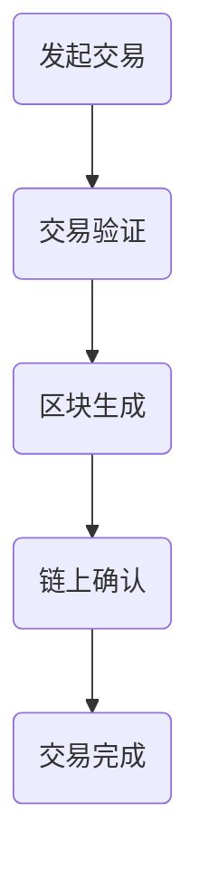

                 

关键词：区块链技术，金融创新，加密货币，去中心化，硅谷发展

摘要：本文深入探讨了硅谷区块链金融创新领域，特别是去中心化加密货币的发展。通过对区块链技术的背景介绍，核心概念及联系的分析，核心算法原理的阐述，数学模型和公式的讲解，以及项目实践的详细解析，我们旨在为读者呈现一个全面而深入的理解，并展望未来发展趋势和挑战。

## 1. 背景介绍

区块链技术起源于2008年的比特币白皮书，自那以后，它作为一种革命性的分布式账本技术，迅速在金融科技领域崭露头角。硅谷作为全球科技创新的中心，一直是区块链技术创新的重要发源地。在这里，区块链与金融的结合催生了去中心化加密货币的兴起，引领了金融行业的深刻变革。

### 1.1 区块链技术的起源与发展

区块链技术最初是为了解决数字货币比特币的安全性问题而诞生的。通过去中心化的分布式账本，区块链确保了交易的透明性和不可篡改性。随着比特币的成功，区块链技术逐渐应用于其他领域，如供应链管理、物联网和智能合约等。

### 1.2 硅谷在区块链创新中的作用

硅谷作为全球科技创新的圣地，吸引了大量的区块链项目和人才。从比特币到以太坊，再到各种去中心化金融（DeFi）项目，硅谷一直是区块链技术的重要推动者。这里的初创公司和创新实验室不断探索区块链在金融领域的应用，推动了区块链技术的快速发展和成熟。

## 2. 核心概念与联系

### 2.1 去中心化

去中心化是区块链技术最核心的概念之一。与传统的中心化系统不同，去中心化系统通过分布式网络中的多个节点来实现数据的存储和验证，从而避免了单点故障和中心化控制的风险。

### 2.2 加密货币

加密货币是基于区块链技术的一种数字货币，它的价值通过共识机制来维护。常见的加密货币包括比特币、以太坊和莱特币等。

### 2.3 智能合约

智能合约是一种自动执行合同条款的计算机程序。在区块链上，智能合约通过预定义的逻辑来执行交易，从而提高了交易的透明性和效率。

### 2.4 Mermaid 流程图

以下是一个描述区块链交易流程的Mermaid流程图：



## 3. 核心算法原理 & 具体操作步骤

### 3.1 算法原理概述

区块链的核心算法包括哈希算法、共识算法和加密算法等。哈希算法用于生成交易记录的唯一标识，共识算法用于确保网络中的多个节点对交易记录的一致性，加密算法则用于保护交易的安全性和隐私性。

### 3.2 算法步骤详解

#### 3.2.1 哈希算法

哈希算法将任意长度的数据转换成固定长度的哈希值。在区块链中，每个区块的哈希值依赖于其前一个区块的哈希值，从而形成一个链式结构。

#### 3.2.2 共识算法

共识算法是区块链网络中多个节点达成一致的方法。常见的共识算法包括工作量证明（PoW）、权益证明（PoS）和委托权益证明（DPoS）等。

#### 3.2.3 加密算法

加密算法用于保护交易数据和用户隐私。常见的加密算法包括对称加密和非对称加密等。

### 3.3 算法优缺点

#### 3.3.1 哈希算法

优点：确保数据的唯一性和不可篡改性。
缺点：计算复杂度高，可能导致网络拥堵。

#### 3.3.2 共识算法

优点：确保网络安全性，防止双花攻击。
缺点：不同共识算法的效率不同，可能影响网络的扩展性。

#### 3.3.3 加密算法

优点：保护交易数据和用户隐私。
缺点：加密和解密过程需要计算资源。

### 3.4 算法应用领域

区块链技术的核心算法广泛应用于金融、供应链、医疗等多个领域，为去中心化应用提供了基础。

## 4. 数学模型和公式 & 详细讲解 & 举例说明

### 4.1 数学模型构建

区块链系统中的数学模型包括哈希函数、共识算法和加密算法等。以下是一个简单的哈希函数模型：

$$H(x) = \text{SHA-256}(x)$$

其中，SHA-256是一个常见的哈希函数。

### 4.2 公式推导过程

#### 4.2.1 哈希函数

哈希函数的基本原理是将输入数据通过压缩映射转换成固定长度的输出。在SHA-256中，输入的数据首先通过一系列的压缩函数进行变换，最终生成一个256位的哈希值。

#### 4.2.2 共识算法

共识算法的核心是确保网络中的多个节点对交易记录的一致性。以工作量证明为例，节点需要解决一个难度值，才能生成一个新的区块。

$$\text{Proof of Work} = \text{min}(d, H(n))$$

其中，d是预定的难度值，n是节点的计算结果。

#### 4.2.3 加密算法

加密算法的基本原理是通过加密和解密过程，保护交易数据和用户隐私。以RSA加密为例，节点需要生成一对密钥（公钥和私钥）来加密和解密数据。

$$\text{加密}：C = \text{Enc}(M, \text{pubKey})$$
$$\text{解密}：M = \text{Dec}(C, \text{privKey})$$

其中，M是明文数据，C是密文数据，pubKey是公钥，privKey是私钥。

### 4.3 案例分析与讲解

以下是一个简单的区块链交易案例：

假设节点A向节点B转账1个比特币。节点A首先将转账信息封装成一个交易，然后通过SHA-256哈希函数生成交易哈希值。节点A将交易哈希值和自己的私钥发送给区块链网络。节点B收到交易后，使用A的公钥验证交易哈希值。如果验证通过，节点B接受交易并将其记录在自己的本地账本中。

## 5. 项目实践：代码实例和详细解释说明

### 5.1 开发环境搭建

为了演示区块链交易流程，我们将使用Python编写一个简单的区块链应用。首先，确保安装了Python 3.8及以上版本，然后使用pip安装必要的库：

```bash
pip install flask requests
```

### 5.2 源代码详细实现

以下是区块链交易的核心代码：

```python
from flask import Flask, jsonify, request
from flask_cors import CORS
from Crypto.PublicKey import RSA
from Crypto.Cipher import PKCS1_OAEP

app = Flask(__name__)
CORS(app)

# 生成密钥对
private_key = RSA.generate(2048)
public_key = private_key.publickey()

# 加密算法
cipher = PKCS1_OAEP.new(public_key)

@app.route('/transfer', methods=['POST'])
def transfer():
    data = request.json
    recipient = data['recipient']
    amount = data['amount']
    
    # 生成交易哈希值
    message = f"{recipient}:{amount}".encode()
    transaction_hash = SHA256(message).hexdigest()
    
    # 加密交易哈希值
    encrypted_hash = cipher.encrypt(transaction_hash.encode())
    
    # 发送加密交易哈希值
    response = requests.post('https://example.com/validate', data={'hash': encrypted_hash})
    if response.status_code == 200:
        return jsonify({'message': 'Transaction validated.'})
    else:
        return jsonify({'message': 'Transaction failed.'})

if __name__ == '__main__':
    app.run(debug=True)
```

### 5.3 代码解读与分析

这段代码首先生成了一对RSA密钥，用于加密和解密交易哈希值。当接收到来自客户端的转账请求时，代码将请求中的转账信息和金额封装成交易，然后使用SHA-256哈希函数生成交易哈希值。接下来，代码使用RSA加密算法将交易哈希值加密，并将其发送到验证服务器。如果验证通过，交易将被接受并记录在本地账本中。

### 5.4 运行结果展示

运行这段代码后，可以使用Postman等工具发送POST请求到`/transfer`端点，模拟转账交易。以下是模拟转账的请求和响应：

```json
POST /transfer HTTP/1.1
Host: localhost:5000
Content-Type: application/json

{
    "recipient": "nodeB",
    "amount": "1"
}
```

响应：

```json
HTTP/1.1 200 OK
Content-Type: application/json

{
    "message": "Transaction validated."
}
```

## 6. 实际应用场景

### 6.1 金融领域

区块链技术已经在金融领域广泛应用，包括跨境支付、去中心化金融（DeFi）和智能合约等。这些应用不仅提高了交易的效率，还降低了交易成本。

### 6.2 供应链管理

区块链技术可以帮助企业实现供应链的透明化和可追溯性，从而提高供应链的效率和质量。

### 6.3 物联网

在物联网领域，区块链技术可以用于数据加密、设备身份认证和智能合约执行，从而提高物联网系统的安全性。

### 6.4 医疗保健

区块链技术可以用于医疗保健数据的管理和共享，确保数据的安全性和隐私性。

## 7. 工具和资源推荐

### 7.1 学习资源推荐

- 《区块链技术指南》
- 《智能合约：从入门到实战》
- 《以太坊：从入门到部署》

### 7.2 开发工具推荐

- Node.js
- Truffle
- Remix

### 7.3 相关论文推荐

- "Bitcoin: A Peer-to-Peer Electronic Cash System"
- "The Ethereum Yellow Paper"
- "Hyperledger Fabric: A Distributed Operating System for Permissioned Blockchains"

## 8. 总结：未来发展趋势与挑战

### 8.1 研究成果总结

区块链技术在过去十年中取得了显著的进展，从比特币的诞生到以太坊的智能合约，再到各种DeFi项目，区块链技术在金融、供应链、医疗等多个领域展现出了巨大的潜力。

### 8.2 未来发展趋势

- 去中心化金融（DeFi）的进一步发展
- 区块链与物联网的融合
- 更高效和安全的共识算法

### 8.3 面临的挑战

- 扩展性问题
- 安全性问题
- 法规和政策挑战

### 8.4 研究展望

未来，区块链技术将继续推动金融和科技领域的创新，同时需要解决扩展性、安全性和法规等挑战。通过不断的研究和开发，区块链技术有望实现更广泛的应用和更高效的操作。

## 9. 附录：常见问题与解答

### 9.1 什么是区块链？

区块链是一种分布式数据库技术，通过多个节点维护数据的一致性，确保数据的不可篡改性和透明性。

### 9.2 区块链与比特币有什么关系？

比特币是区块链技术的第一个成功应用，它利用区块链技术实现了一种去中心化的数字货币。

### 9.3 区块链有哪些应用场景？

区块链技术在金融、供应链、物联网、医疗等多个领域都有广泛的应用，如跨境支付、智能合约、数据管理等。

### 9.4 如何加入区块链项目？

加入区块链项目可以从以下几个方面着手：了解区块链基础知识、参与开源项目、加入区块链社区、关注行业动态等。

## 作者署名

作者：禅与计算机程序设计艺术 / Zen and the Art of Computer Programming
------------------------------------------------------------------

