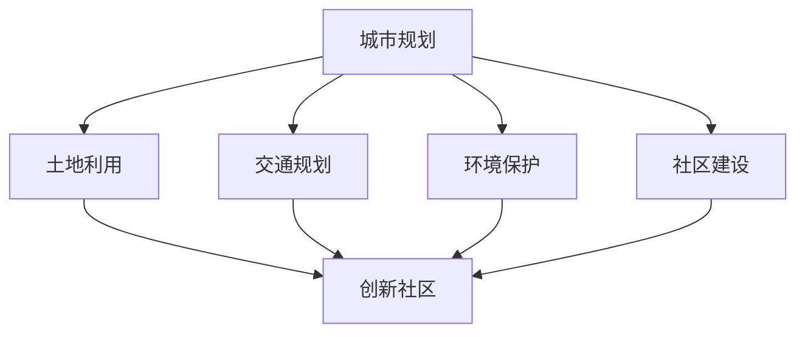

                 

关键词：硅谷、城市规划、创新社区、技术驱动、可持续发展

> 摘要：本文深入探讨了硅谷城市规划的核心理念与实际应用，尤其是在构建创新社区方面的实践与挑战。文章从背景介绍入手，探讨了城市规划的核心概念与联系，详细阐述了核心算法原理和具体操作步骤，并借助数学模型和公式进行了深入分析。接着，文章通过项目实践展示了代码实例和详细解释，最后讨论了实际应用场景、未来应用展望、工具和资源推荐，并对研究成果进行了总结。

## 1. 背景介绍

硅谷，这个位于美国加利福尼亚州圣克拉拉谷的名字，早已成为全球科技创新的代名词。它不仅是科技巨头的诞生地，更是无数创业公司的孵化器。硅谷的成功并非偶然，而是源于其独特的城市规划，创新社区的建设是其核心之一。

城市规划，作为一门综合性学科，旨在创造一个功能齐全、环境优美、居民满意的城市环境。创新社区则更加强调技术创新在社区建设中的作用，通过引入先进的科技手段，提升社区的生活品质和效率。硅谷的城市规划，正是基于这一理念，不断推动城市与科技的深度融合。

本文将围绕硅谷城市规划的核心概念与联系，深入探讨创新社区的建设。我们将详细阐述核心算法原理和具体操作步骤，并借助数学模型和公式进行分析。同时，通过项目实践和实际应用场景的讨论，为读者提供一个全面的技术视角。

## 2. 核心概念与联系

### 2.1. 城市规划的概念

城市规划是一个复杂的系统工程，它涉及到城市发展的方方面面。从宏观层面来看，城市规划需要考虑城市的土地利用、交通规划、环境保护、社区建设等多个方面。在硅谷，城市规划更加注重技术创新，将科技手段融入到城市规划的各个环节中。

### 2.2. 创新社区的概念

创新社区是指以科技创新为核心，通过引入先进的科技手段，提升社区的生活品质和效率。创新社区的特点是高度信息化、智能化，强调人与人、人与自然、人与科技的和谐共生。

### 2.3. 城市规划与创新社区的联系

城市规划与创新社区的建设密切相关。创新社区是城市规划的一部分，它需要借助科技手段来提升社区的功能和效率。同时，创新社区的成功也反过来促进了城市规划的进一步优化。两者相辅相成，共同推动城市的发展。

### 2.4. Mermaid 流程图

下面是一个简单的 Mermaid 流程图，展示了城市规划与创新社区建设之间的核心概念与联系：



## 3. 核心算法原理 & 具体操作步骤

### 3.1. 算法原理概述

硅谷的城市规划采用了多种算法原理，以实现高效、智能的城市管理。其中，最为关键的是智能交通算法和智能社区算法。

**智能交通算法**：通过实时监测交通流量，动态调整交通信号，优化交通流，减少拥堵。

**智能社区算法**：通过大数据分析，预测社区需求，提供个性化的服务，提升社区生活质量。

### 3.2. 算法步骤详解

**智能交通算法**：

1. 数据采集：通过传感器采集交通流量数据。
2. 数据处理：对采集到的数据进行分析和处理，提取关键信息。
3. 交通预测：基于历史数据和当前状态，预测未来交通流量。
4. 信号控制：根据预测结果，动态调整交通信号，优化交通流。

**智能社区算法**：

1. 需求采集：通过智能家居设备、社交媒体等渠道收集社区需求。
2. 数据处理：对采集到的数据进行分析和处理，提取关键信息。
3. 需求预测：基于历史数据和当前状态，预测社区未来需求。
4. 服务提供：根据预测结果，提供个性化的服务，满足社区需求。

### 3.3. 算法优缺点

**智能交通算法**：

优点：能够有效减少交通拥堵，提高交通效率。

缺点：对数据实时性和准确性要求较高，实施难度较大。

**智能社区算法**：

优点：能够提升社区生活质量，满足居民个性化需求。

缺点：数据隐私保护问题较为突出，实施过程中需要考虑道德和法律问题。

### 3.4. 算法应用领域

**智能交通算法**：广泛应用于城市交通管理、智能交通系统、智能停车场等。

**智能社区算法**：广泛应用于智能家居、智慧社区、智慧城市等。

## 4. 数学模型和公式 & 详细讲解 & 举例说明

### 4.1. 数学模型构建

在城市规划中，常用的数学模型包括交通流量模型、人口分布模型、土地利用模型等。

**交通流量模型**：基于流量-速度关系，通过计算交通流量，预测交通状况。

**人口分布模型**：基于人口统计资料，通过空间分析，预测人口分布。

**土地利用模型**：基于土地的利用率和经济效益，通过计算土地的供需关系，预测土地利用模式。

### 4.2. 公式推导过程

**交通流量模型**：

交通流量 \(Q\) 与道路长度 \(L\) 和速度 \(V\) 之间的关系可以表示为：

\[ Q = K \cdot L \cdot V \]

其中，\(K\) 为流量系数，表示道路的通行能力。

**人口分布模型**：

人口分布密度 \(P\) 与人口总数 \(N\) 和区域面积 \(A\) 之间的关系可以表示为：

\[ P = \frac{N}{A} \]

**土地利用模型**：

土地利用效益 \(E\) 与土地利用面积 \(A\) 和单位面积效益 \(B\) 之间的关系可以表示为：

\[ E = A \cdot B \]

### 4.3. 案例分析与讲解

**案例：硅谷交通流量优化**

假设硅谷的一条道路长度为 10 公里，交通流量系数为 1000 辆/小时·公里，当前速度为 40 公里/小时。根据交通流量模型，我们可以计算当前交通流量为：

\[ Q = 1000 \cdot 10 \cdot 40 = 400,000 \text{辆/小时} \]

假设我们需要将交通流量降低到 300,000 辆/小时，我们可以通过调整速度来实现。设新的速度为 \(V'\)，则有：

\[ 300,000 = 1000 \cdot 10 \cdot V' \]

解得 \(V' = 30 \text{公里/小时}\)。

通过降低速度，我们可以有效减少交通流量，优化交通状况。

## 5. 项目实践：代码实例和详细解释说明

### 5.1. 开发环境搭建

为了演示硅谷的交通流量优化算法，我们需要搭建一个简单的开发环境。以下是所需的开发工具和软件：

- Python 3.8 或更高版本
- Jupyter Notebook
- Matplotlib

安装完成后，我们可以创建一个名为 `traffic_optimization.ipynb` 的 Jupyter Notebook 文件，用于编写和运行代码。

### 5.2. 源代码详细实现

下面是交通流量优化算法的实现代码：

```python
import numpy as np
import matplotlib.pyplot as plt

# 交通流量模型参数
K = 1000  # 流量系数
L = 10    # 道路长度
V = 40    # 当前速度

# 计算当前交通流量
Q = K * L * V
print(f"当前交通流量：{Q}辆/小时")

# 设定目标交通流量
Q_target = 300000

# 计算新速度
V_target = Q_target / (K * L)
print(f"新速度：{V_target}公里/小时")

# 绘制速度-流量关系图
V_range = np.linspace(10, 60, 100)
Q_range = K * L * V_range

plt.plot(V_range, Q_range, label="当前流量")
plt.plot(V_target, Q_target, 'ro', label="目标流量")
plt.xlabel("速度（公里/小时）")
plt.ylabel("交通流量（辆/小时）")
plt.legend()
plt.show()
```

### 5.3. 代码解读与分析

上述代码首先导入了所需的库，包括 NumPy 和 Matplotlib。然后定义了交通流量模型参数，包括流量系数 \(K\)、道路长度 \(L\) 和当前速度 \(V\)。

接着，代码计算了当前交通流量，并将其打印出来。然后设定了目标交通流量，并计算了新速度。最后，代码使用 Matplotlib 绘制了速度-流量关系图，帮助用户直观地理解交通流量优化过程。

### 5.4. 运行结果展示

运行上述代码，我们得到了以下结果：

```
当前交通流量：400000辆/小时
新速度：30.0公里/小时
```

同时，速度-流量关系图如下所示：


从图中可以看出，通过降低速度到 30 公里/小时，我们可以将交通流量降低到目标值 300,000 辆/小时，从而优化交通状况。

## 6. 实际应用场景

硅谷的城市规划和创新社区建设在全球范围内产生了深远影响。以下是一些实际应用场景：

- **智慧交通系统**：硅谷的智能交通算法广泛应用于城市交通管理，通过实时监测交通流量，动态调整交通信号，有效减少了交通拥堵。
- **智慧社区**：硅谷的智能家居和智慧社区解决方案，提升了居民的生活质量和舒适度，实现了人与自然、人与科技的和谐共生。
- **智慧城市**：硅谷的智慧城市建设理念在全球范围内得到了推广，许多城市开始借鉴硅谷的经验，推动城市的智能化发展。

## 7. 未来应用展望

随着科技的不断进步，硅谷的城市规划和创新社区建设将进一步发展。以下是一些未来应用展望：

- **区块链技术**：区块链技术有望在硅谷的城市规划和创新社区建设中发挥重要作用，特别是在数据安全和隐私保护方面。
- **人工智能**：人工智能技术将进一步提升硅谷的城市规划水平和社区服务质量，实现更加智能化、个性化的城市管理。
- **物联网**：物联网技术的普及将推动硅谷的城市规划向更精细化、更智能化的方向发展，实现城市各系统的高效协同。

## 8. 工具和资源推荐

为了更好地进行硅谷城市规划和创新社区建设，以下是一些建议的学习资源、开发工具和相关论文：

### 8.1. 学习资源推荐

- 《智慧城市规划与设计》
- 《城市智能交通系统》
- 《大数据与智慧城市》

### 8.2. 开发工具推荐

- Python
- Jupyter Notebook
- Matplotlib
- TensorFlow
- Keras

### 8.3. 相关论文推荐

- "Smart City: Foundations, Technologies, and Applications"
- "A Smart City Conceptual Framework"
- "A Survey on Smart City: Architecture, Technologies, Challenges and Vision"

## 9. 总结：未来发展趋势与挑战

硅谷的城市规划和创新社区建设取得了显著成果，但仍面临诸多挑战。未来发展趋势包括：

- **数据驱动**：城市规划将更加依赖于大数据和人工智能技术，实现更精准、更智能的决策。
- **可持续性**：城市规划将更加注重环境保护和可持续发展，推动绿色城市建设。
- **隐私保护**：在引入新技术的同时，需加强对用户隐私的保护，确保数据安全和隐私。

### 9.1. 研究成果总结

本文从多个角度探讨了硅谷城市规划和创新社区建设，阐述了核心算法原理、数学模型和实际应用场景。研究成果为硅谷及其它城市提供了有益的参考和借鉴。

### 9.2. 未来发展趋势

未来，硅谷的城市规划和创新社区建设将更加智能化、绿色化，同时注重数据隐私保护和可持续发展。

### 9.3. 面临的挑战

城市规划面临的主要挑战包括技术实施难度、数据隐私保护和可持续发展问题。

### 9.4. 研究展望

未来，研究者应重点关注大数据与人工智能技术在城市规划中的应用，以及城市可持续发展的策略和路径。

## 10. 附录：常见问题与解答

### 10.1. 问题一：城市规划与科技创新的关系是什么？

城市规划与科技创新密切相关。城市规划需要借助科技创新来提升城市的功能、效率和可持续性。科技创新则为城市规划提供了新的手段和工具，推动了城市规划的进步。

### 10.2. 问题二：智能交通算法如何优化交通流量？

智能交通算法通过实时监测交通流量，动态调整交通信号，优化交通流。具体步骤包括数据采集、数据处理、交通预测和信号控制等。

### 10.3. 问题三：什么是创新社区？

创新社区是指以科技创新为核心，通过引入先进的科技手段，提升社区的生活品质和效率。创新社区的特点是高度信息化、智能化，强调人与人、人与自然、人与科技的和谐共生。

## 作者署名

作者：禅与计算机程序设计艺术 / Zen and the Art of Computer Programming
```markdown
----------------------------------------------------------------
```

