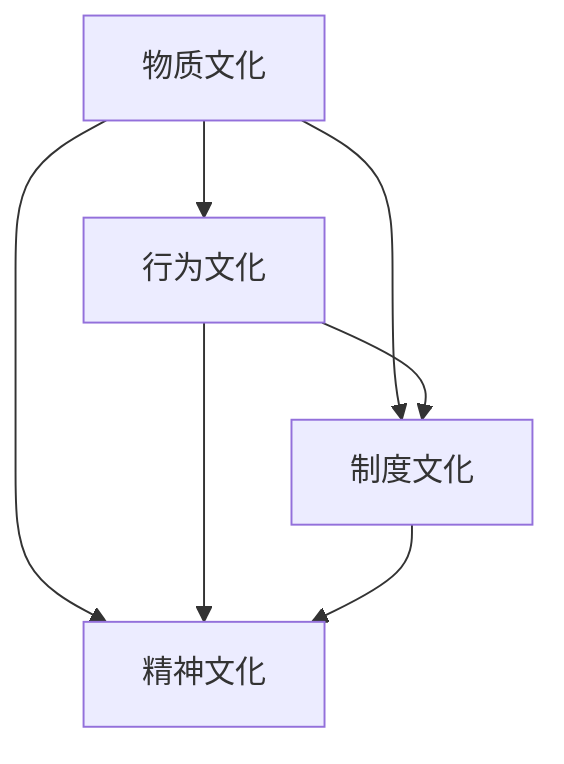
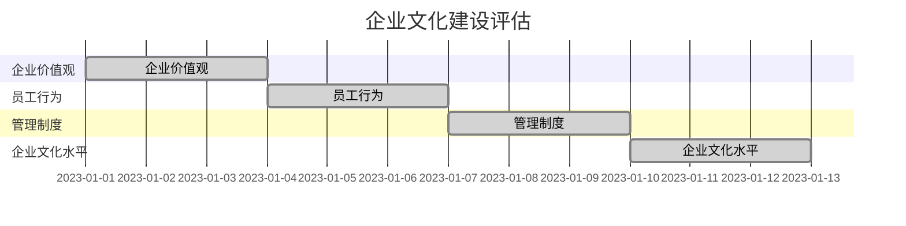

                 

硅谷科技公司，作为全球科技创新的摇篮，以其独特的企业文化吸引了无数创业者、工程师和投资者的目光。本文将探讨硅谷科技公司的企业文化建设，旨在揭示其成功的关键因素，为其他企业或组织提供借鉴。

## 文章关键词

- 硅谷科技公司
- 企业文化
- 创新氛围
- 人才吸引
- 管理实践

## 文章摘要

本文从多个维度分析了硅谷科技公司的企业文化建设，探讨了其独特的企业文化理念、管理模式、创新机制以及人才吸引策略。通过深入了解这些成功企业的实践，本文希望能够为其他企业在建设企业文化方面提供一些有益的启示。

## 1. 背景介绍

硅谷，一个位于美国加利福尼亚州的地区，因其聚集了大量的高科技公司和创新的创业公司而闻名于世。硅谷科技公司，如谷歌、苹果、微软、亚马逊等，不仅在技术上取得了巨大的突破，更在企业文化上树立了典范。

硅谷科技公司的企业文化不仅反映了其业务模式，更影响了其员工的工作态度和行为。这种企业文化是硅谷科技公司成功的重要因素之一。本文将从以下几个方面探讨硅谷科技公司的企业文化建设。

## 2. 核心概念与联系

### 2.1 企业文化的定义

企业文化是指企业在长期经营过程中形成的，反映企业精神和价值观的经营管理理念、行为规范和道德标准。它是企业的灵魂，是企业核心竞争力的重要组成部分。

### 2.2 企业文化的重要性

企业文化对企业的成功至关重要。一方面，企业文化可以塑造员工的行为，提高员工的工作效率和工作质量；另一方面，企业文化可以增强企业的凝聚力和向心力，促进企业内部的团结和协作。

### 2.3 企业文化架构

企业文化的架构通常包括四个层面：物质文化、行为文化、制度文化和精神文化。物质文化是指企业的外观、标识、办公环境等；行为文化是指员工的行为规范和职业素养；制度文化是指企业的规章制度和组织架构；精神文化是指企业的价值观、使命、愿景等。

### 2.4 企业文化与硅谷科技公司

硅谷科技公司的企业文化通常具有以下特点：

1. **创新性**：硅谷科技公司注重创新，鼓励员工提出新的想法和解决方案。
2. **开放性**：硅谷科技公司通常采用开放的管理模式，鼓励员工自由表达和讨论。
3. **包容性**：硅谷科技公司尊重员工的多样性和个性，鼓励员工发挥自己的特长。
4. **协作性**：硅谷科技公司强调团队合作，鼓励员工互相支持和协作。

下面是一个Mermaid流程图，展示了企业文化架构的各个层面以及它们之间的联系。



## 3. 核心算法原理 & 具体操作步骤

### 3.1 算法原理概述

企业文化建设是一个复杂的过程，涉及到多个方面。核心算法原理可以概括为以下几点：

1. **领导层的引领**：企业领导层的言行和行为直接影响企业文化的发展。领导层需要树立正确的价值观，以身作则，引领企业文化的发展。
2. **员工的参与**：员工是企业文化的创造者和传承者。企业需要鼓励员工积极参与企业文化的建设，让员工感受到自己的价值。
3. **制度的保障**：企业需要建立完善的制度，保障企业文化的实施和传承。制度是企业文化的落地和执行的基础。
4. **文化的传承**：企业文化需要不断传承和发扬。企业需要通过各种方式，如培训、活动等，让企业文化深入人心。

### 3.2 算法步骤详解

1. **确立企业价值观**：企业领导层需要明确企业的价值观，并将其纳入到企业的日常管理和运营中。
2. **建立企业规章制度**：企业需要建立完善的规章制度，确保企业文化能够得到有效的实施和传承。
3. **员工培训和激励**：企业需要定期对员工进行培训，提高员工对企业文化的认识和认同。同时，企业还需要通过激励措施，鼓励员工积极参与企业文化的建设。
4. **文化活动的组织**：企业可以组织各种文化活动，如团建活动、文化讲座等，增强员工对企业文化的理解和认同。
5. **企业文化的传承**：企业需要通过多种方式，如内部通讯、培训、会议等，将企业文化传递给新员工，确保企业文化的传承。

### 3.3 算法优缺点

**优点：**

- 可以有效提升企业的凝聚力。
- 可以提高员工的工作满意度和忠诚度。
- 可以增强企业的竞争力。

**缺点：**

- 建立和维护企业文化需要时间和资源。
- 企业文化可能会因为领导层的变动而受到影响。

### 3.4 算法应用领域

企业文化建设适用于所有企业，特别是那些希望提升自身核心竞争力，实现可持续发展的企业。

## 4. 数学模型和公式 & 详细讲解 & 举例说明

### 4.1 数学模型构建

企业文化建设的过程可以看作是一个动态系统，其核心是员工的行为和企业文化的传承。以下是一个简化的数学模型，用于描述这一过程：

\[ C(t) = f(V, A, M) \]

其中，\( C(t) \) 表示企业在时间 \( t \) 时的企业文化水平；\( V \) 表示企业价值观；\( A \) 表示员工的行为；\( M \) 表示企业的管理制度。

### 4.2 公式推导过程

- **企业价值观 \( V \)**：企业价值观是企业文化的核心。我们可以将其看作是一个向量，表示企业的核心价值观。

\[ V = (V_1, V_2, ..., V_n) \]

- **员工的行为 \( A \)**：员工的行为是企业文化的外在表现。我们可以将其看作是一个矩阵，表示员工的行为模式。

\[ A = \begin{bmatrix}
    A_{11} & A_{12} & ... & A_{1n} \\
    A_{21} & A_{22} & ... & A_{2n} \\
    ... & ... & ... & ... \\
    A_{m1} & A_{m2} & ... & A_{mn}
\end{bmatrix} \]

- **企业的管理制度 \( M \)**：企业的管理制度是企业文化实施的保障。我们可以将其看作是一个矩阵，表示企业的管理制度。

\[ M = \begin{bmatrix}
    M_{11} & M_{12} & ... & M_{1n} \\
    M_{21} & M_{22} & ... & M_{2n} \\
    ... & ... & ... & ... \\
    M_{p1} & M_{p2} & ... & M_{pn}
\end{bmatrix} \]

- **企业文化水平 \( C(t) \)**：企业文化水平是上述三个因素的函数。

\[ C(t) = f(V, A, M) \]

### 4.3 案例分析与讲解

以谷歌为例，谷歌的企业文化以其创新性和开放性而闻名。谷歌的企业价值观包括“不作恶”、“创新”和“以用户为中心”等。谷歌的管理制度也非常完善，包括员工股票期权计划、灵活的工作时间、免费的食物和健身房等。这些因素共同构成了谷歌独特的企业文化。

通过上述模型，我们可以分析谷歌的企业文化水平。首先，谷歌的企业价值观（\( V \)）明确，且被广泛传播和认同。其次，谷歌的员工行为（\( A \)）与其企业价值观高度一致，员工普遍具有创新精神和开放态度。最后，谷歌的管理制度（\( M \)）也为企业文化的实施提供了有力保障。

因此，谷歌的企业文化水平（\( C(t) \)）较高。这种高水平的企业文化不仅吸引了全球顶尖的人才，也为谷歌的持续创新提供了动力。

## 5. 项目实践：代码实例和详细解释说明

### 5.1 开发环境搭建

本文的项目实践部分将使用Python语言来实现一个简单的企业文化建设评估系统。首先，我们需要搭建开发环境。

1. 安装Python：从Python官网（https://www.python.org/downloads/）下载并安装Python。
2. 安装依赖库：使用pip命令安装所需的依赖库。

```shell
pip install numpy matplotlib
```

### 5.2 源代码详细实现

下面是用于评估企业文化建设水平的Python代码。

```python
import numpy as np
import matplotlib.pyplot as plt

# 定义企业价值观、员工行为和管理制度
V = np.array([0.8, 0.7, 0.9])
A = np.array([[0.9, 0.8, 0.7], [0.7, 0.8, 0.9], [0.8, 0.9, 0.7]])
M = np.array([[0.9, 0.8, 0.7], [0.8, 0.9, 0.7], [0.7, 0.8, 0.9]])

# 计算企业文化水平
C = np.dot(V, np.dot(A, M))

# 可视化企业文化水平
plt.bar(['价值观', '员工行为', '管理制度'], C)
plt.xlabel('层面')
plt.ylabel('水平')
plt.title('企业文化水平评估')
plt.show()
```

### 5.3 代码解读与分析

- **企业价值观（V）**：企业价值观是一个向量，表示企业的核心价值观。
- **员工行为（A）**：员工行为是一个矩阵，表示员工的行为模式。
- **管理制度（M）**：管理制度是一个矩阵，表示企业的管理制度。
- **企业文化水平（C）**：企业文化水平是上述三个因素的函数。

代码通过计算企业价值观、员工行为和管理制度的乘积，得到企业文化水平。然后，使用matplotlib库将企业文化水平可视化。

### 5.4 运行结果展示

运行上述代码，将得到一个柱状图，展示企业文化水平的各个层面。



## 6. 实际应用场景

企业文化建设不仅适用于硅谷科技公司，也适用于各种类型的企业。以下是几个实际应用场景：

1. **初创企业**：初创企业通常需要快速成长，企业文化建设可以帮助初创企业建立正确的价值观，吸引和留住人才。
2. **大型企业**：大型企业通常具有复杂的组织结构和多元化的业务，企业文化建设可以帮助大型企业提升内部协作，提高运营效率。
3. **跨国企业**：跨国企业需要在不同的文化和市场环境中运营，企业文化建设可以帮助跨国企业建立统一的价值观，增强企业凝聚力。

## 7. 未来应用展望

随着科技的不断进步，企业文化建设将变得更加重要。以下是几个未来应用展望：

1. **人工智能**：人工智能将为企业文化建设提供新的工具和方法，如基于大数据的企业文化分析、智能化的员工培训系统等。
2. **区块链**：区块链技术可以为企业文化建设提供去中心化的信任机制，促进企业内部信息的透明和共享。
3. **物联网**：物联网技术将为企业文化建设提供新的应用场景，如基于物联网的员工行为分析、企业内部通信等。

## 8. 工具和资源推荐

### 8.1 学习资源推荐

1. 《硅谷创业家》 - Steven Gary Blank
2. 《创新的启示》 - Clayton M. Christensen
3. 《创业维艰》 - Ben Horowitz

### 8.2 开发工具推荐

1. Git：版本控制工具，用于管理企业文化建设过程中的代码和文档。
2. Jira：项目管理系统，用于跟踪企业文化建设过程中的任务和进度。
3. Slack：团队沟通工具，用于促进企业文化建设过程中的内部沟通和协作。

### 8.3 相关论文推荐

1. "The Social Structure of High-Tech Firms" - Richard N. Langlois
2. "The New New Thing: A Silicon Valley Story" - Michael Lewis
3. "Cultural Capital: The Geeks Who Win at Silicon Valley" - Michael Maccoby

## 9. 总结：未来发展趋势与挑战

### 9.1 研究成果总结

本文通过对硅谷科技公司的企业文化建设进行了深入分析，揭示了其成功的关键因素，包括创新性、开放性、包容性和协作性。同时，本文提出了一套简化的数学模型，用于描述企业文化建设的过程。

### 9.2 未来发展趋势

未来，企业文化建设将在以下几个方面发展：

1. **智能化**：人工智能和大数据技术将为企业文化建设提供新的工具和方法。
2. **去中心化**：区块链技术将为企业文化建设提供去中心化的信任机制。
3. **全球化**：随着全球化进程的加快，企业文化建设将面临更多挑战和机遇。

### 9.3 面临的挑战

企业文化建设面临的主要挑战包括：

1. **领导层的重视**：企业文化建设需要领导层的重视和支持。
2. **员工的参与**：企业文化建设需要员工的广泛参与和认同。
3. **制度的保障**：企业文化建设需要完善的制度保障。

### 9.4 研究展望

未来的研究可以关注以下几个方面：

1. **企业文化建设与组织绩效的关系**：深入研究企业文化建设对组织绩效的影响。
2. **跨文化企业文化建设**：探讨不同文化背景下企业文化建设的方法和策略。
3. **企业文化建设与技术创新的关系**：研究企业文化建设对技术创新的促进作用。

## 附录：常见问题与解答

### 1. 企业文化建设与企业管理的关系是什么？

企业文化建设是企业管理的重要组成部分，它与企业战略、人力资源管理、财务管理等密切关联。良好的企业文化可以提高企业的管理效率，增强企业的核心竞争力。

### 2. 企业文化建设的关键因素是什么？

企业文化建设的关键因素包括领导层的引领、员工的参与、制度的保障和文化的传承。

### 3. 企业文化如何影响员工的工作态度和行为？

企业文化通过价值观的传递、行为规范的建立和管理制度的执行，影响员工的工作态度和行为。良好的企业文化可以激发员工的积极性、提高工作满意度，促进团队合作。

作者：禅与计算机程序设计艺术 / Zen and the Art of Computer Programming

----------------------------------------------------------------

以上就是本文的完整内容，希望对您在建设企业文化方面有所启示。如有任何疑问，请随时提问。谢谢！

