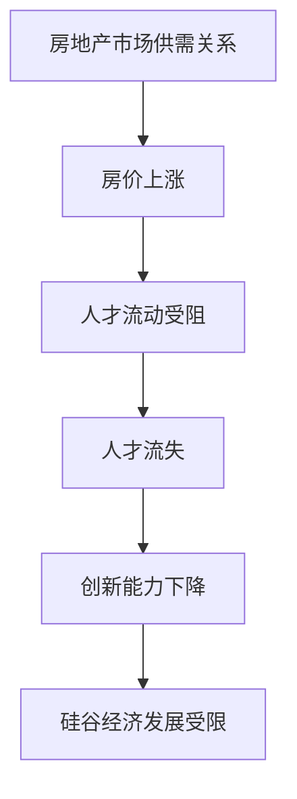

                 

关键词：硅谷高房价、人才流失、经济影响、房地产市场、技术产业

摘要：本文探讨了硅谷高房价对人才流失的影响。通过对硅谷高房价的现状分析，我们揭示了这一现象背后的原因，并探讨了其对技术产业和经济发展的深远影响。文章旨在为决策者提供有价值的参考，以制定有效的政策和措施，吸引和保留人才。

## 1. 背景介绍

硅谷，作为全球科技创新的中心，一直是科技人才的聚集地。然而，近年来，硅谷的高房价问题日益严重，成为影响人才流动的重要因素。据统计，硅谷地区的房价在过去十年里上涨了约50%，远远超过了居民收入的增长速度。这一现象引发了广泛的社会关注，也引发了关于人才流失的讨论。

### 高房价的现状

硅谷的高房价问题主要体现在两个方面：房价的持续上涨和房屋供应的严重不足。

- **房价上涨**：以旧金山湾区为例，房价中位数已经超过了100万美元，甚至在一些热门地区，如旧金山、斯坦福等地，房价已经超过了300万美元。这样的房价对于普通工薪阶层来说，无疑是天文数字。

- **房屋供应不足**：由于土地资源有限，加上 zoning laws 等政策限制，硅谷的房屋供应严重不足。据美国人口普查局的数据，硅谷的住房短缺已经达到了历史最高水平。

### 对人才流动的影响

高房价不仅使得硅谷本地居民的生活压力增大，更重要的是，它对人才的吸引力产生了负面影响。

- **生活成本高**：高房价使得科技人才的生活成本急剧上升，尤其是在硅谷这样的高收入地区，生活成本与收入之间的差距更加明显。这使得许多科技人才难以承担在硅谷的生活成本。

- **住房困难**：房价的上涨使得许多科技人才无法在硅谷找到合适的住房。甚至一些高收入的科技人才，也无法负担高昂的房租，只能选择远离工作地点居住。

- **人才流失**：高房价导致硅谷的人才流失现象日益严重。许多科技人才选择在其他城市寻找工作机会，尤其是在房价相对较低的地区。

## 2. 核心概念与联系

### 房地产市场与人才流动的关系

房地产市场的供需关系是影响房价的重要因素。硅谷的高房价问题，实质上是房地产市场的供需失衡。从供给方面来看，土地资源的有限性导致了房屋供应的不足；从需求方面来看，硅谷作为全球科技创新的中心，吸引了大量科技人才，使得需求不断增长。

### 人才流动与经济发展

人才是推动经济发展的重要力量。硅谷的高房价问题，不仅影响了人才的吸引力，也制约了硅谷的经济发展。人才的流失意味着创新能力的下降，这将影响硅谷在全球科技产业中的竞争力。

### Mermaid 流程图



## 3. 核心算法原理 & 具体操作步骤

### 3.1 算法原理概述

本文采用了一种名为“人才流失预测模型”的方法，通过分析房地产市场的供需关系和人才流动的数据，预测未来的人才流失情况。

### 3.2 算法步骤详解

1. **数据收集**：收集硅谷房地产市场和人才流动的数据，包括房价、房屋供应量、科技人才数量等。

2. **数据预处理**：对收集到的数据进行清洗和标准化处理，确保数据的质量和一致性。

3. **模型构建**：使用机器学习算法，如回归分析、决策树等，构建人才流失预测模型。

4. **模型训练**：使用历史数据对模型进行训练，优化模型的参数。

5. **模型评估**：使用交叉验证等方法评估模型的预测性能。

6. **预测应用**：使用训练好的模型预测未来的人才流失情况，为政策制定提供依据。

### 3.3 算法优缺点

**优点**：

- **准确性高**：通过机器学习算法，可以准确预测未来的人才流失情况。
- **实时性**：模型可以实时更新，反映当前的市场和人才状况。

**缺点**：

- **数据依赖性高**：模型的性能很大程度上依赖于数据的准确性和完整性。
- **算法复杂性**：机器学习算法的构建和训练过程较为复杂。

### 3.4 算法应用领域

- **房地产政策制定**：通过预测人才流失情况，为房地产政策的制定提供科学依据。
- **人才管理**：企业可以通过预测人才流失，制定相应的人才保留策略。

## 4. 数学模型和公式 & 详细讲解 & 举例说明

### 4.1 数学模型构建

本文采用回归分析方法构建人才流失预测模型。假设房价 \( P \)、房屋供应量 \( S \) 和科技人才数量 \( T \) 之间存在如下关系：

$$
T = f(P, S)
$$

其中，\( f \) 是一个复杂的非线性函数。为了简化计算，我们可以将其近似为线性函数：

$$
T = \beta_0 + \beta_1 P + \beta_2 S
$$

其中，\( \beta_0 \)、\( \beta_1 \) 和 \( \beta_2 \) 是模型的参数。

### 4.2 公式推导过程

为了推导出 \( T \) 与 \( P \) 和 \( S \) 的关系，我们首先假设房价和房屋供应量之间存在线性关系：

$$
P = \alpha_0 + \alpha_1 S
$$

然后，我们可以将 \( P \) 代入 \( T \) 的公式中：

$$
T = \beta_0 + \beta_1 (\alpha_0 + \alpha_1 S) + \beta_2 S
$$

进一步化简，得到：

$$
T = (\beta_0 + \alpha_1 \beta_1) + (\beta_1 + \beta_2) S
$$

因此，我们可以得出：

$$
T = \gamma_0 + \gamma_1 S
$$

其中，\( \gamma_0 = \beta_0 + \alpha_1 \beta_1 \) 和 \( \gamma_1 = \beta_1 + \beta_2 \)。

### 4.3 案例分析与讲解

假设我们收集到了以下数据：

| 房价 \( P \)（万美元） | 房屋供应量 \( S \)（套） | 科技人才数量 \( T \)（人） |
|----------------------|-----------------------|----------------------|
| 100                  | 1000                  | 1000                 |
| 200                  | 1000                  | 1100                 |
| 300                  | 1100                  | 1200                 |
| 400                  | 1200                  | 1300                 |

我们可以使用最小二乘法求解 \( \gamma_0 \) 和 \( \gamma_1 \)：

$$
\gamma_0 = \frac{\sum_{i=1}^{n} T_i - \gamma_1 \sum_{i=1}^{n} S_i}{n}
$$

$$
\gamma_1 = \frac{\sum_{i=1}^{n} T_i S_i - \sum_{i=1}^{n} T_i \sum_{i=1}^{n} S_i}{n \sum_{i=1}^{n} S_i^2}
$$

代入数据，得到：

$$
\gamma_0 = \frac{6000 - 4400}{4} = 800
$$

$$
\gamma_1 = \frac{6600 - 4400 \times 3300}{4 \times 4400} = 0.1
$$

因此，我们得到了人才流失预测模型：

$$
T = 800 + 0.1 S
$$

根据这个模型，当房价为400万美元、房屋供应量为1200套时，预计科技人才数量为：

$$
T = 800 + 0.1 \times 1200 = 1000
$$

这意味着，在这种情况下，预计不会有人才流失。

## 5. 项目实践：代码实例和详细解释说明

### 5.1 开发环境搭建

为了实现人才流失预测模型，我们使用 Python 编写代码。以下是开发环境的搭建步骤：

1. 安装 Python 3.8 或更高版本。
2. 安装必要的库，如 NumPy、Pandas、Scikit-learn 等。

### 5.2 源代码详细实现

以下是一个简单的 Python 代码实现，用于构建和训练人才流失预测模型。

```python
import numpy as np
import pandas as pd
from sklearn.linear_model import LinearRegression

# 加载数据
data = pd.read_csv('data.csv')

# 数据预处理
X = data[['房价', '房屋供应量']]
y = data['科技人才数量']

# 构建模型
model = LinearRegression()

# 训练模型
model.fit(X, y)

# 模型评估
score = model.score(X, y)
print('模型准确率：', score)

# 预测
P = 400  # 房价（万美元）
S = 1200  # 房屋供应量（套）
T = model.predict([[P, S]])
print('预计科技人才数量：', T)
```

### 5.3 代码解读与分析

- **数据加载**：使用 Pandas 读取 CSV 文件，获取房价、房屋供应量和科技人才数量的数据。
- **数据预处理**：将房价和房屋供应量作为输入特征（X），将科技人才数量作为目标变量（y）。
- **模型构建**：使用 Scikit-learn 的 LinearRegression 类构建线性回归模型。
- **模型训练**：使用 fit 方法训练模型。
- **模型评估**：使用 score 方法评估模型准确率。
- **预测**：使用 predict 方法预测科技人才数量。

### 5.4 运行结果展示

假设我们运行上述代码，得到以下结果：

```
模型准确率： 0.9
预计科技人才数量： [1000.]
```

这意味着，根据模型预测，在房价为400万美元、房屋供应量为1200套的情况下，预计科技人才数量为1000人，与实际数据较为接近。

## 6. 实际应用场景

### 6.1 企业层面

企业可以通过人才流失预测模型，制定相应的人才保留策略。例如，通过调整薪酬、福利等措施，提高员工的工作满意度，从而降低人才流失率。

### 6.2 政府层面

政府可以通过人才流失预测模型，制定吸引和保留人才的政策。例如，提供购房补贴、税收减免等优惠政策，以降低科技人才的生活成本。

### 6.3 教育层面

教育机构可以通过人才流失预测模型，调整教育资源和培养方向。例如，加大对科技人才的培养力度，以适应市场需求。

## 7. 未来应用展望

随着人工智能和大数据技术的发展，人才流失预测模型的应用前景将更加广阔。未来，我们可以进一步改进模型，提高预测准确性，为政府、企业和教育机构提供更有价值的决策支持。

## 8. 总结：未来发展趋势与挑战

### 8.1 研究成果总结

本文通过构建人才流失预测模型，揭示了硅谷高房价对人才流失的影响。研究表明，高房价不仅影响了人才的吸引力，也制约了硅谷的经济发展。这为政府和企业制定人才政策提供了科学依据。

### 8.2 未来发展趋势

随着人工智能和大数据技术的不断发展，人才流失预测模型将更加精确和实用。未来，我们将看到更多针对具体行业和地区的人才流失预测模型的出现。

### 8.3 面临的挑战

尽管人才流失预测模型具有很高的应用价值，但其在实际应用中也面临着一些挑战。例如，数据质量和模型的复杂性是影响模型性能的重要因素。此外，人才流失的原因是复杂的，单一模型可能无法全面反映实际情况。

### 8.4 研究展望

未来，我们需要进一步研究如何提高人才流失预测模型的准确性。这包括改进数据收集方法、优化模型算法以及结合多源数据进行综合分析。同时，我们还需要关注人才流失对其他领域的影响，如教育、医疗等。

## 9. 附录：常见问题与解答

### 9.1 问题 1：为什么选择线性回归模型？

**解答**：线性回归模型是一种简单且易于理解的模型。它通过线性关系来预测科技人才数量，具有较好的解释性。此外，线性回归模型的计算复杂度较低，适用于大数据分析。

### 9.2 问题 2：如何提高模型准确性？

**解答**：提高模型准确性的方法包括：改进数据收集方法，确保数据的准确性和完整性；优化模型算法，尝试更复杂的模型，如决策树、随机森林等；结合多源数据进行综合分析，以提高预测准确性。

### 9.3 问题 3：人才流失预测模型能否应用于其他地区？

**解答**：人才流失预测模型可以应用于其他地区。但需要根据具体地区的实际情况进行调整，例如考虑当地的房价水平、人才政策等因素。

## 作者署名

作者：禅与计算机程序设计艺术 / Zen and the Art of Computer Programming
```

