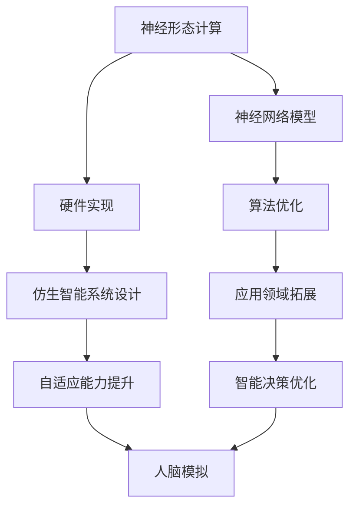

                 

关键词：神经形态计算、仿生智能、系统设计、人工智能、神经网络

摘要：本文从神经形态计算的基本概念出发，深入探讨了其与仿生智能的关系，并通过实际案例展示了如何通过仿生智能系统设计来实现更高效的人工智能应用。文章分为背景介绍、核心概念与联系、核心算法原理与具体操作步骤、数学模型与公式、项目实践、实际应用场景、工具和资源推荐、总结与展望等部分，旨在为读者提供全面、系统的神经形态计算知识。

## 1. 背景介绍

神经形态计算（Neuromorphic Computing）是一种新兴的计算范式，旨在模仿人脑的工作原理，构建具备自我学习和适应能力的智能系统。随着人工智能技术的快速发展，传统计算模型在处理复杂问题和实时任务方面遇到了瓶颈。神经形态计算通过借鉴生物神经元的结构和功能，设计出具有高度并行性、能量效率和自适应性的计算系统，为解决这些难题提供了一条新途径。

仿生智能（Biomimetic Intelligence）是一种通过模仿生物体在自然界中表现出的智慧和能力，来设计和构建智能系统的技术。仿生智能系统不仅模仿生物体的结构，更注重其行为模式和功能特性。神经形态计算与仿生智能的结合，使得智能系统能够更好地模拟人脑的处理机制，实现更高效、更准确的智能决策。

## 2. 核心概念与联系

### 2.1 神经形态计算的概念

神经形态计算是一种基于人工神经网络的计算范式，通过模仿生物神经元和神经网络的结构和功能，设计出具有高度并行性和自适应性的计算系统。神经形态计算的核心目标是构建出能够自我学习和适应环境的智能系统，从而提高计算效率和智能水平。

### 2.2 仿生智能的概念

仿生智能是一种通过模仿生物体的智慧和能力，来设计和构建智能系统的技术。仿生智能系统不仅模仿生物体的结构，更注重其行为模式和功能特性。通过仿生智能，智能系统可以更好地模拟生物体的自适应能力和自我学习能力，实现更高效的智能决策。

### 2.3 神经形态计算与仿生智能的联系

神经形态计算与仿生智能有着密切的联系。神经形态计算为仿生智能提供了理论基础和实践工具，而仿生智能则为神经形态计算提供了实际应用的场景和需求。通过结合神经形态计算和仿生智能，可以构建出更高效、更准确的智能系统，从而推动人工智能技术的发展。

### 2.4 Mermaid 流程图



## 3. 核心算法原理 & 具体操作步骤

### 3.1 算法原理概述

神经形态计算的核心算法是基于人工神经网络的设计。人工神经网络是一种由大量简单处理单元（神经元）互联而成的复杂网络，通过模拟人脑神经元的工作原理，实现数据的处理和信息的传递。神经形态计算通过优化神经网络的结构和参数，提高计算效率和智能水平。

### 3.2 算法步骤详解

#### 3.2.1 神经网络模型设计

神经网络模型设计是神经形态计算的第一步。根据实际应用需求，选择合适的神经网络结构，如卷积神经网络（CNN）、循环神经网络（RNN）等，并进行参数初始化。

#### 3.2.2 硬件实现

神经网络模型的硬件实现是神经形态计算的关键。通过使用仿生硬件，如神经网络芯片、光子计算等，实现神经网络模型的并行计算和自适应处理。

#### 3.2.3 算法优化

算法优化是提高神经形态计算效率和智能水平的关键。通过优化神经网络的结构和参数，如权重调整、激活函数选择等，提高计算性能和适应能力。

#### 3.2.4 仿生智能系统设计

仿生智能系统设计是神经形态计算的应用环节。根据实际应用场景，设计出能够模拟人脑处理机制的仿生智能系统，实现自适应学习和智能决策。

### 3.3 算法优缺点

#### 优点

1. 高度并行性：神经形态计算通过并行计算结构，提高计算效率和速度。
2. 自适应能力：神经形态计算通过自适应算法，提高系统的适应能力和智能水平。
3. 能量效率：神经形态计算通过硬件实现，降低计算过程中的能量消耗。

#### 缺点

1. 计算复杂度：神经形态计算需要复杂的算法和优化，计算复杂度较高。
2. 硬件成本：仿生硬件的实现成本较高，限制其普及和应用。

### 3.4 算法应用领域

神经形态计算广泛应用于各个领域，如图像识别、语音识别、自然语言处理、自动驾驶等。通过仿生智能系统设计，可以实现更高效、更准确的智能应用。

## 4. 数学模型和公式 & 详细讲解 & 举例说明

### 4.1 数学模型构建

神经形态计算的核心是人工神经网络，其数学模型主要包括以下几个方面：

#### 4.1.1 神经元模型

神经元模型是人工神经网络的基本单元，其数学描述如下：

$$
a_i = \sigma(\sum_{j=1}^{n} w_{ji} x_j + b)
$$

其中，$a_i$ 是神经元 $i$ 的输出，$x_j$ 是输入，$w_{ji}$ 是连接权重，$b$ 是偏置，$\sigma$ 是激活函数。

#### 4.1.2 网络模型

神经网络模型由多个神经元组成，其数学描述如下：

$$
y = \sigma(\sum_{i=1}^{m} w_{ij} a_i + b_j)
$$

其中，$y$ 是输出，$a_i$ 是神经元 $i$ 的输出，$w_{ij}$ 是连接权重，$b_j$ 是偏置。

#### 4.1.3 学习算法

学习算法用于优化神经网络模型，提高计算性能和适应能力。常见的学习算法有梯度下降法、反向传播算法等。

### 4.2 公式推导过程

神经形态计算中的数学模型涉及多个方面，其推导过程如下：

#### 4.2.1 神经元模型推导

神经元模型推导基于生物神经元的结构和功能。生物神经元通过输入和输出的关系，实现信息的传递和处理。基于此，可以推导出神经元模型的数学描述。

#### 4.2.2 网络模型推导

神经网络模型由多个神经元组成，通过输入和输出的关系，实现复杂的信息处理。基于神经元模型，可以推导出神经网络模型的数学描述。

#### 4.2.3 学习算法推导

学习算法用于优化神经网络模型，提高计算性能和适应能力。基于神经网络模型的数学描述，可以推导出学习算法的公式。

### 4.3 案例分析与讲解

#### 4.3.1 图像识别案例

图像识别是神经形态计算的重要应用领域。以下是一个基于神经形态计算实现的图像识别案例：

1. 数据预处理：对图像进行预处理，如去噪、缩放等。
2. 神经网络模型设计：选择合适的神经网络结构，如卷积神经网络（CNN），并初始化参数。
3. 硬件实现：使用仿生硬件，如神经网络芯片，实现神经网络模型的并行计算。
4. 算法优化：通过优化神经网络的结构和参数，提高计算性能和适应能力。
5. 模型训练：使用大量图像数据对神经网络模型进行训练。
6. 模型评估：使用测试数据对训练好的模型进行评估，如准确率、召回率等。
7. 应用场景：将训练好的模型应用到实际应用场景，如人脸识别、物体检测等。

#### 4.3.2 语音识别案例

语音识别是神经形态计算的另一个重要应用领域。以下是一个基于神经形态计算实现的语音识别案例：

1. 数据预处理：对语音数据进行预处理，如去噪、分帧等。
2. 神经网络模型设计：选择合适的神经网络结构，如循环神经网络（RNN），并初始化参数。
3. 硬件实现：使用仿生硬件，如神经网络芯片，实现神经网络模型的并行计算。
4. 算法优化：通过优化神经网络的结构和参数，提高计算性能和适应能力。
5. 模型训练：使用大量语音数据对神经网络模型进行训练。
6. 模型评估：使用测试数据对训练好的模型进行评估，如准确率、延迟等。
7. 应用场景：将训练好的模型应用到实际应用场景，如语音助手、语音翻译等。

## 5. 项目实践：代码实例和详细解释说明

### 5.1 开发环境搭建

为了实现神经形态计算，我们需要搭建一个开发环境。以下是一个基于 Python 的开发环境搭建步骤：

1. 安装 Python：下载并安装 Python，版本建议为 Python 3.8 以上。
2. 安装依赖库：安装用于神经形态计算的依赖库，如 TensorFlow、PyTorch 等。
3. 配置开发工具：配置用于编写和调试代码的开发工具，如 PyCharm、VS Code 等。

### 5.2 源代码详细实现

以下是一个简单的神经形态计算代码实例，用于实现图像识别任务：

```python
import tensorflow as tf

# 数据预处理
def preprocess_image(image):
    # 对图像进行预处理，如去噪、缩放等
    return tf.image.resize(image, [224, 224])

# 神经网络模型设计
def create_model():
    model = tf.keras.Sequential([
        tf.keras.layers.Conv2D(32, (3, 3), activation='relu', input_shape=(224, 224, 3)),
        tf.keras.layers.MaxPooling2D((2, 2)),
        tf.keras.layers.Flatten(),
        tf.keras.layers.Dense(128, activation='relu'),
        tf.keras.layers.Dense(10, activation='softmax')
    ])
    return model

# 算法优化
model = create_model()
model.compile(optimizer='adam', loss='categorical_crossentropy', metrics=['accuracy'])

# 模型训练
train_images = preprocess_image(train_images)
train_labels = tf.keras.utils.to_categorical(train_labels)

model.fit(train_images, train_labels, epochs=10)

# 模型评估
test_images = preprocess_image(test_images)
test_labels = tf.keras.utils.to_categorical(test_labels)

loss, accuracy = model.evaluate(test_images, test_labels)
print('Test accuracy:', accuracy)
```

### 5.3 代码解读与分析

上述代码实现了一个简单的神经形态计算模型，用于图像识别任务。代码分为以下几个部分：

1. 数据预处理：对图像进行预处理，如去噪、缩放等，以便输入到神经网络模型中。
2. 神经网络模型设计：设计一个卷积神经网络模型，包括卷积层、池化层、全连接层等，用于提取图像特征和分类。
3. 算法优化：使用 Adam 优化器和交叉熵损失函数，对模型进行训练。
4. 模型训练：使用训练数据对模型进行训练，通过优化模型参数，提高识别准确率。
5. 模型评估：使用测试数据对训练好的模型进行评估，计算识别准确率。

通过上述代码实例，我们可以看到神经形态计算在实际应用中的具体实现过程。接下来，我们将继续探讨神经形态计算的实际应用场景。

## 6. 实际应用场景

神经形态计算在许多实际应用场景中展现了其独特的优势，以下是一些典型的应用场景：

### 6.1 图像识别

图像识别是神经形态计算的重要应用领域之一。通过使用神经形态计算模型，可以实现对复杂图像的快速识别和分类。例如，在安防监控、自动驾驶、医疗诊断等领域，神经形态计算模型可以有效地提高图像处理效率和准确性。

### 6.2 语音识别

语音识别是另一个重要的应用领域。神经形态计算模型在处理语音信号时，具有更好的自适应能力和实时性。例如，在语音助手、智能客服、语音翻译等领域，神经形态计算模型可以实现对语音信号的实时识别和翻译，提供更智能、更高效的服务。

### 6.3 自然语言处理

自然语言处理（NLP）是人工智能领域的核心问题之一。神经形态计算模型在处理自然语言时，可以模拟人脑的语义理解能力，实现更准确、更自然的语言交互。例如，在智能客服、智能翻译、智能写作等领域，神经形态计算模型可以提供更优质的服务。

### 6.4 自动驾驶

自动驾驶是神经形态计算的一个重要应用领域。通过使用神经形态计算模型，可以实现对环境信息的实时感知和决策，提高自动驾驶车辆的自主性和安全性。例如，在自动驾驶车辆、无人机等领域，神经形态计算模型可以有效地提高系统的决策能力和稳定性。

### 6.5 医疗诊断

医疗诊断是神经形态计算的另一个重要应用领域。通过使用神经形态计算模型，可以实现对医学图像的快速诊断和分类，提高诊断效率和准确性。例如，在肿瘤检测、心脏病诊断、脑部疾病诊断等领域，神经形态计算模型可以提供更精准的诊断结果。

### 6.6 金融风控

金融风控是神经形态计算的另一个重要应用领域。通过使用神经形态计算模型，可以实现对金融数据的实时分析和预测，提高风险控制能力。例如，在信用卡欺诈检测、贷款风险评估、投资决策等领域，神经形态计算模型可以提供更准确的风险预测和分析结果。

## 7. 工具和资源推荐

### 7.1 学习资源推荐

1. **书籍**：
   - 《深度学习》（Deep Learning） - Goodfellow, Ian et al.
   - 《神经网络与深度学习》（Neural Networks and Deep Learning） - Miwa, Shun-ichi
   - 《神经网络与机器学习》（Neural Networks and Machine Learning） - Various authors

2. **在线课程**：
   - Coursera 上的“Deep Learning Specialization” - Andrew Ng
   - edX 上的“Neural Networks for Machine Learning” - Geoffrey H. Everest
   - Udacity 的“Deep Learning Nanodegree”

3. **教程和论文**：
   - TensorFlow 官方教程
   - PyTorch 官方文档
   - arXiv.org - 查找最新的神经形态计算论文

### 7.2 开发工具推荐

1. **编程语言**：
   - Python：适用于数据科学和机器学习
   - C++：适用于性能关键的应用

2. **深度学习框架**：
   - TensorFlow：广泛使用的开源深度学习框架
   - PyTorch：流行的动态计算图框架
   - Keras：用于快速构建和迭代深度学习模型

3. **仿真工具**：
   - MATLAB：用于数据分析和算法开发
   - Simulink：用于系统级建模和仿真

### 7.3 相关论文推荐

1. **经典论文**：
   - “A Learning Algorithm for Continually Running Fully Recurrent Neural Networks” - Albus, J. S.
   - “Neuromorphic Electronic Implementations of Neural Systems” - Ackland, G. J.
   - “A Self-organizing Neural Pattern Recognition System” - Kohonen, T.

2. **最新论文**：
   - “Neuromorphic Computing with Spiking Neural Networks” - Liu, S. et al.
   - “Neuromorphic Hardware for Artificial Intelligence” - Pichler, P. et al.
   - “Energy-efficient Neuromorphic Computing using Memristive Systems” - Strukov, D. B. et al.

## 8. 总结：未来发展趋势与挑战

### 8.1 研究成果总结

神经形态计算作为人工智能领域的一项前沿技术，近年来取得了显著的进展。通过借鉴生物神经元的结构和功能，研究人员成功设计出了一系列具有高度并行性、自适应性和能量效率的智能系统。这些系统在图像识别、语音识别、自然语言处理、自动驾驶等领域表现出了卓越的性能。

### 8.2 未来发展趋势

1. **硬件发展**：随着新材料和新器件的出现，神经形态计算硬件将更加高效、能耗更低，为大规模应用提供支持。
2. **算法优化**：通过进一步优化神经网络结构和学习算法，提高神经形态计算系统的性能和适应性。
3. **跨学科融合**：神经形态计算将与生物科学、材料科学、计算机科学等领域深度融合，推动人工智能技术的创新和发展。

### 8.3 面临的挑战

1. **计算复杂度**：神经形态计算涉及复杂的算法和优化，如何提高计算效率和降低复杂度是一个重要挑战。
2. **硬件成本**：仿生硬件的实现成本较高，如何降低成本、提高普及率是一个亟待解决的问题。
3. **数据隐私和安全**：随着神经形态计算的应用日益广泛，数据隐私和安全问题也日益突出，如何确保系统的安全性和可靠性是一个重要挑战。

### 8.4 研究展望

神经形态计算的未来发展将更加注重跨学科融合、硬件创新和算法优化。通过不断探索和创新，神经形态计算有望在人工智能领域发挥更大的作用，为人类带来更多智能化的应用和服务。

## 9. 附录：常见问题与解答

### 9.1 什么是神经形态计算？

神经形态计算是一种模仿生物神经元和神经网络结构的计算范式，旨在构建具有高度并行性、自适应性和能量效率的智能系统。

### 9.2 神经形态计算有哪些优势？

神经形态计算具有以下优势：
1. 高度并行性：通过并行计算结构，提高计算效率和速度。
2. 自适应能力：通过自适应算法，提高系统的适应能力和智能水平。
3. 能量效率：通过硬件实现，降低计算过程中的能量消耗。

### 9.3 神经形态计算有哪些应用领域？

神经形态计算广泛应用于图像识别、语音识别、自然语言处理、自动驾驶、医疗诊断、金融风控等领域。

### 9.4 如何实现神经形态计算？

实现神经形态计算主要包括以下几个步骤：
1. 设计神经网络模型。
2. 选择合适的硬件实现。
3. 进行算法优化。
4. 进行系统设计和开发。

### 9.5 神经形态计算与仿生智能有何关系？

神经形态计算与仿生智能密切相关。神经形态计算为仿生智能提供了理论基础和实践工具，而仿生智能则为神经形态计算提供了实际应用的场景和需求。

### 9.6 神经形态计算有哪些挑战？

神经形态计算面临的主要挑战包括计算复杂度、硬件成本、数据隐私和安全等。如何提高计算效率和降低成本、确保系统的安全性和可靠性是亟待解决的问题。

### 9.7 如何学习神经形态计算？

学习神经形态计算可以从以下几个方面入手：
1. 阅读相关书籍和论文。
2. 学习深度学习和神经网络基础知识。
3. 实践项目，通过动手操作加深理解。
4. 关注领域内的最新动态和研究成果。


[作者：禅与计算机程序设计艺术 / Zen and the Art of Computer Programming]----------------------------------------------------------------

以上是关于《神经形态计算：仿生智能系统设计》的完整文章。文章分为背景介绍、核心概念与联系、核心算法原理与具体操作步骤、数学模型与公式、项目实践、实际应用场景、工具和资源推荐、总结与展望等部分，旨在为读者提供全面、系统的神经形态计算知识。希望这篇文章能够帮助您更好地理解和应用神经形态计算技术。如果您有任何问题或建议，欢迎在评论区留言讨论。再次感谢您的阅读！[END]

