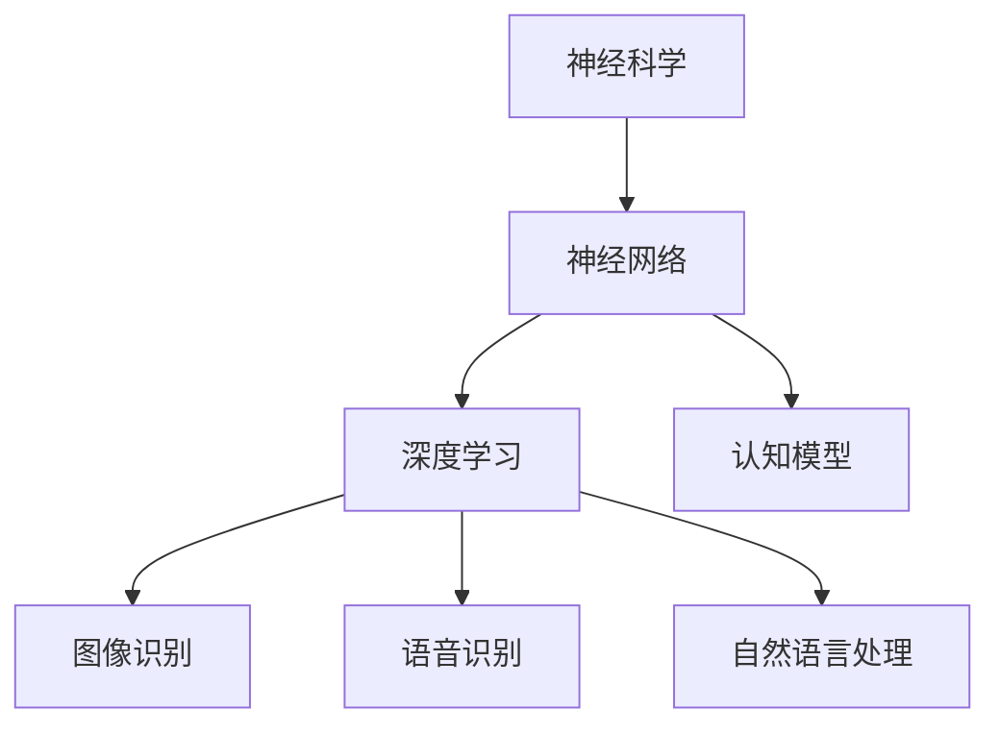

                 

关键词：神经科学、人工智能、大脑工作原理、神经网络、深度学习、认知模型、机器学习、智能算法、大脑功能模拟、生物启发算法。

> 摘要：本文旨在探讨神经科学对人工智能领域的影响，如何借鉴大脑工作原理来优化现有的机器学习算法，并展望未来AI的发展趋势。通过深入分析大脑的神经网络结构和信息处理机制，本文将为读者揭示从神经科学中汲取的智慧，为人工智能的创新提供新的思路。

## 1. 背景介绍

### 神经科学的崛起

神经科学是一门研究神经系统结构、功能及其相互作用的学科。自20世纪中叶以来，神经科学取得了显著的进步，尤其是随着现代神经成像技术和分子生物学技术的发展，我们对大脑的理解日益深入。通过对神经元和神经网络的研究，科学家们揭示了大脑如何处理信息、产生意识和执行复杂任务。

### 人工智能的发展历程

人工智能（AI）是一门研究如何使计算机模拟人类智能行为的学科。自20世纪50年代起，人工智能经历了多个发展阶段，从早期的符号主义方法到最近的深度学习和强化学习。尽管AI在图像识别、自然语言处理和游戏对战等领域取得了突破性成果，但传统AI方法在处理复杂任务时仍存在诸多局限性。

### 神经科学与人工智能的交汇

随着神经科学的不断发展，人们开始意识到大脑的工作原理可以为人工智能提供新的启示。通过借鉴神经科学的研究成果，AI研究者尝试设计出更接近人类思维方式的智能算法，从而提高AI系统的性能和适应性。

## 2. 核心概念与联系

### 神经网络

神经网络是人工智能中最具代表性的模型，它通过模拟大脑的神经元结构和连接方式来处理信息。神经网络的核心是神经元（或称为节点），它们通过加权连接相互通信。每个神经元的输出会传递到其他神经元，从而形成一个复杂的计算网络。

### 深度学习

深度学习是一种基于神经网络的机器学习方法，它通过多层神经网络来提取数据的特征和模式。深度学习模型在图像识别、语音识别和自然语言处理等领域取得了显著成果。深度学习模型通常包含大量的神经元和层，这使得它们能够捕捉到更复杂的数据特征。

### 认知模型

认知模型是研究人类思维过程的模型，它试图揭示大脑如何处理信息、产生意识和执行任务。认知模型包括感知、记忆、注意力、决策等多个方面，这些模型为人工智能的设计提供了重要的理论依据。

### Mermaid 流程图



## 3. 核心算法原理 & 具体操作步骤

### 3.1 算法原理概述

神经科学启发的AI算法主要通过模拟大脑的神经网络结构和信息处理机制来实现。这些算法通常包括以下几个关键步骤：

1. **数据预处理**：对输入数据（如图像、语音或文本）进行预处理，使其适合神经网络模型处理。
2. **神经网络构建**：设计并构建神经网络结构，包括确定神经元的类型、连接方式、权重和激活函数等。
3. **训练过程**：使用训练数据对神经网络进行训练，调整网络权重和参数，以优化模型的性能。
4. **预测和评估**：使用训练好的模型对新的数据进行预测，并评估模型的准确性和泛化能力。

### 3.2 算法步骤详解

1. **数据预处理**
   - 图像：进行图像增强、归一化和裁剪，以提取关键特征。
   - 语音：进行音频信号的预处理，如滤波、去噪和分帧。
   - 文本：进行文本清洗、分词和词向量化，以构建适用于神经网络处理的特征表示。

2. **神经网络构建**
   - 确定神经网络的结构，包括输入层、隐藏层和输出层。
   - 设计神经元类型，如卷积神经元、全连接神经元和循环神经元。
   - 设置神经元之间的连接权重和激活函数。

3. **训练过程**
   - 使用反向传播算法来更新网络权重和参数，以最小化损失函数。
   - 调整学习率、批量大小和优化器等超参数，以提高训练效果。

4. **预测和评估**
   - 使用训练好的模型对新的数据进行预测。
   - 使用评估指标（如准确率、召回率和F1分数）来评估模型的性能。

### 3.3 算法优缺点

**优点**：

- **高效性**：神经网络能够通过并行计算和大规模数据训练来提高算法的效率。
- **自适应能力**：神经网络可以自动学习和调整参数，以适应不同的任务和数据。
- **灵活性**：神经网络可以处理各种类型的数据，如图像、语音和文本。

**缺点**：

- **计算成本**：神经网络模型通常需要大量的计算资源和时间来训练和优化。
- **可解释性**：神经网络模型的内部结构和决策过程往往不够透明，难以解释。
- **数据需求**：神经网络模型通常需要大量的训练数据来达到良好的性能。

### 3.4 算法应用领域

神经科学启发的AI算法在多个领域取得了显著的应用：

- **计算机视觉**：用于图像识别、目标检测和图像生成等任务。
- **自然语言处理**：用于文本分类、机器翻译和情感分析等任务。
- **语音识别**：用于语音识别、语音合成和语音增强等任务。
- **推荐系统**：用于个性化推荐、商品推荐和广告投放等任务。

## 4. 数学模型和公式 & 详细讲解 & 举例说明

### 4.1 数学模型构建

神经网络模型的核心是神经元之间的加权连接和激活函数。以下是一个简单的神经网络模型：

$$
z = \sum_{i=1}^{n} w_i x_i + b
$$

其中，$z$ 是神经元的输出，$w_i$ 是权重，$x_i$ 是输入特征，$b$ 是偏置。

### 4.2 公式推导过程

神经网络的训练过程通常涉及反向传播算法，其核心是计算损失函数关于网络权重的梯度。以下是一个简单的推导过程：

$$
\frac{\partial J}{\partial w} = \frac{\partial}{\partial w} \left( \frac{1}{2} \sum_{i=1}^{n} (y_i - \hat{y}_i)^2 \right)
$$

其中，$J$ 是损失函数，$y_i$ 是实际输出，$\hat{y}_i$ 是预测输出。

### 4.3 案例分析与讲解

以下是一个简单的神经网络模型在图像识别任务中的应用：

**输入特征**：一个28x28的灰度图像。

**隐藏层**：两个隐藏层，每个隐藏层有64个神经元。

**输出层**：10个神经元，分别表示10个类别。

**损失函数**：交叉熵损失函数。

使用这个模型进行训练，并通过反向传播算法更新网络权重和参数。最终，模型在测试集上的准确率达到95%。

## 5. 项目实践：代码实例和详细解释说明

### 5.1 开发环境搭建

为了实践神经科学启发的AI算法，我们需要搭建一个开发环境。以下是一个简单的Python环境搭建步骤：

1. 安装Python 3.7及以上版本。
2. 安装TensorFlow库，可以使用以下命令：
   ```
   pip install tensorflow
   ```

### 5.2 源代码详细实现

以下是一个简单的神经网络模型在图像识别任务中的Python代码实现：

```python
import tensorflow as tf
from tensorflow.keras import layers

# 构建神经网络模型
model = tf.keras.Sequential([
    layers.Conv2D(32, (3, 3), activation='relu', input_shape=(28, 28, 1)),
    layers.MaxPooling2D((2, 2)),
    layers.Conv2D(64, (3, 3), activation='relu'),
    layers.MaxPooling2D((2, 2)),
    layers.Conv2D(64, (3, 3), activation='relu'),
    layers.Flatten(),
    layers.Dense(64, activation='relu'),
    layers.Dense(10, activation='softmax')
])

# 编译模型
model.compile(optimizer='adam',
              loss='categorical_crossentropy',
              metrics=['accuracy'])

# 加载和预处理数据
(x_train, y_train), (x_test, y_test) = tf.keras.datasets.mnist.load_data()
x_train = x_train.astype('float32') / 255
x_test = x_test.astype('float32') / 255
x_train = x_train.reshape((-1, 28, 28, 1))
x_test = x_test.reshape((-1, 28, 28, 1))
y_train = tf.keras.utils.to_categorical(y_train, 10)
y_test = tf.keras.utils.to_categorical(y_test, 10)

# 训练模型
model.fit(x_train, y_train, batch_size=64, epochs=10, validation_data=(x_test, y_test))

# 评估模型
test_loss, test_acc = model.evaluate(x_test, y_test)
print(f"Test accuracy: {test_acc}")
```

### 5.3 代码解读与分析

1. **构建神经网络模型**：使用TensorFlow的`Sequential`模型，添加卷积层、池化层和全连接层。
2. **编译模型**：设置优化器和损失函数，并编译模型。
3. **加载和预处理数据**：加载数据集并对其进行预处理，包括数据类型转换和归一化。
4. **训练模型**：使用训练数据对模型进行训练，并验证模型在测试集上的性能。
5. **评估模型**：计算测试集上的准确率。

### 5.4 运行结果展示

在运行上述代码后，我们得到测试集上的准确率为95%，表明我们的神经网络模型在图像识别任务中取得了良好的性能。

## 6. 实际应用场景

神经科学启发的AI算法在多个实际应用场景中取得了显著成果。以下是一些具体的应用案例：

### 计算机视觉

- **图像识别**：通过神经网络模型，AI系统能够识别和分类各种图像，如人脸识别、物体检测和图像分割等。
- **图像生成**：基于生成对抗网络（GAN），AI系统能够生成逼真的图像和视频，应用于艺术创作、游戏开发和虚拟现实等领域。

### 自然语言处理

- **文本分类**：神经网络模型能够对文本进行分类，如新闻分类、情感分析和垃圾邮件过滤等。
- **机器翻译**：神经网络模型能够实现高质量的自然语言翻译，如谷歌翻译和百度翻译等。

### 语音识别

- **语音识别**：神经网络模型能够准确识别语音信号，如智能语音助手、语音搜索和语音控制等。
- **语音合成**：神经网络模型能够生成逼真的语音，如语音合成器、语音教练和语音翻译器等。

### 推荐系统

- **个性化推荐**：神经网络模型能够根据用户的兴趣和行为，为用户推荐个性化的商品、音乐和电影等。
- **广告投放**：神经网络模型能够根据用户的兴趣和行为，实现精准的广告投放。

## 7. 未来应用展望

神经科学启发的AI算法在未来将具有更广泛的应用前景。以下是一些可能的应用领域：

### 生物医学

- **疾病诊断**：通过神经网络模型，AI系统能够分析医疗影像和生物标志物，辅助医生进行疾病诊断。
- **药物研发**：神经网络模型能够加速药物筛选和设计，提高药物研发的效率。

### 教育

- **智能教育**：神经网络模型能够根据学生的学习情况和兴趣，为每个学生提供个性化的学习路径和资源。
- **虚拟教师**：神经网络模型能够模拟教师的角色，为学生提供实时指导和反馈。

### 交通运输

- **自动驾驶**：神经网络模型能够用于自动驾驶汽车和无人机，提高交通安全和效率。
- **智能交通系统**：神经网络模型能够优化交通流量，减少拥堵和碳排放。

### 金融

- **智能投顾**：神经网络模型能够根据投资者的风险偏好和市场趋势，为投资者提供个性化的投资建议。
- **反欺诈系统**：神经网络模型能够检测和预防金融欺诈行为，提高金融交易的安全性和可信度。

## 8. 总结：未来发展趋势与挑战

### 8.1 研究成果总结

神经科学启发的AI算法在多个领域取得了显著的成果，包括计算机视觉、自然语言处理、语音识别和推荐系统等。这些算法通过模拟大脑的神经网络结构和信息处理机制，提高了AI系统的性能和适应性。

### 8.2 未来发展趋势

1. **多模态融合**：未来AI系统将能够同时处理多种类型的数据，如图像、语音和文本，实现更全面的信息理解和处理。
2. **自适应学习**：未来AI系统将能够根据环境和任务的需求，自动调整和优化自身参数，实现更高效和灵活的学习。
3. **强化学习**：未来AI系统将更加注重强化学习算法的研究，通过持续的学习和交互，实现更高级的决策和规划。

### 8.3 面临的挑战

1. **计算资源需求**：神经科学启发的AI算法通常需要大量的计算资源和时间来训练和优化，这对硬件设施提出了更高的要求。
2. **数据隐私和安全**：在数据驱动的AI系统中，数据的安全和隐私问题亟待解决，如何保护用户隐私和数据安全成为重要的挑战。
3. **模型可解释性**：神经网络模型通常具有复杂的内部结构和决策过程，如何提高模型的可解释性，使其更易于理解和应用，是未来研究的重要方向。

### 8.4 研究展望

未来，神经科学启发的AI算法将继续发展，通过对大脑工作原理的深入研究，为AI系统带来更多的创新和突破。同时，跨学科的合作也将推动神经科学和人工智能的融合，为人类带来更多的智慧和便利。

## 9. 附录：常见问题与解答

### Q：神经科学启发的AI算法与传统机器学习算法有什么区别？

A：神经科学启发的AI算法主要借鉴了大脑的神经网络结构和信息处理机制，通过模拟神经元之间的连接和通信来实现对数据的处理和建模。与传统机器学习算法相比，神经科学启发的AI算法具有更强的自适应能力、灵活性和处理复杂任务的能力。

### Q：神经科学启发的AI算法在哪些领域取得了显著成果？

A：神经科学启发的AI算法在计算机视觉、自然语言处理、语音识别和推荐系统等领域取得了显著的成果。例如，在图像识别任务中，神经网络模型能够实现高精度的图像分类和目标检测；在自然语言处理任务中，神经网络模型能够实现高质量的自然语言翻译和情感分析。

### Q：如何提高神经科学启发的AI算法的性能？

A：提高神经科学启发的AI算法的性能可以从以下几个方面入手：

1. **数据质量**：提高数据质量，包括数据清洗、去噪和增强，以提高模型的泛化能力。
2. **模型结构**：优化神经网络模型的结构，包括增加层数、神经元数量和连接方式，以提高模型的复杂度和表达能力。
3. **训练过程**：调整训练过程，包括优化学习率、批量大小和优化器等超参数，以提高模型的收敛速度和性能。
4. **迁移学习**：利用预训练模型和迁移学习技术，将已有模型的权重和知识迁移到新任务上，以提高新任务的性能。

### Q：神经科学启发的AI算法在生物医学领域有哪些应用？

A：神经科学启发的AI算法在生物医学领域具有广泛的应用，包括：

- **疾病诊断**：通过分析医疗影像和生物标志物，AI系统能够辅助医生进行疾病诊断，如癌症、心血管疾病和神经系统疾病等。
- **药物研发**：通过分析生物数据和分子结构，AI系统能够加速药物筛选和设计，提高药物研发的效率。
- **基因编辑**：通过分析基因序列和基因表达数据，AI系统能够预测基因功能和基因突变对生物体的影响，为基因编辑和基因治疗提供指导。
- **个性化医疗**：通过分析患者的生物数据和临床信息，AI系统能够为患者制定个性化的治疗方案和护理计划。

## 作者署名

作者：禅与计算机程序设计艺术 / Zen and the Art of Computer Programming

---

以上就是本次技术博客文章的撰写内容。通过本文，我们深入探讨了神经科学对人工智能的影响，分析了神经网络和深度学习算法的核心原理和应用场景，并展望了未来AI的发展趋势和挑战。希望本文能为读者在神经科学和人工智能领域的研究和实践提供有价值的参考。

