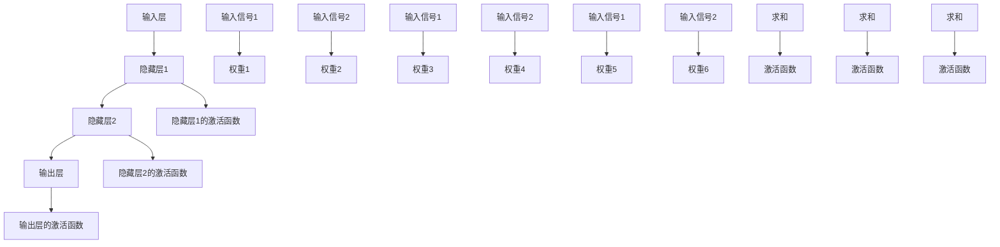

                 

关键词：神经网络、深度学习、机器学习、神经元模型、反向传播算法、神经网络架构、Python 实现案例

## 摘要

本文旨在为读者提供一个全面而深入的神经网络（Neural Networks）指南，从基础概念到具体实现，解析这一关键的人工智能技术。文章将涵盖神经网络的背景介绍、核心概念与联系、算法原理与步骤、数学模型与公式、项目实践及实际应用，并通过一个详细的代码实例帮助读者理解神经网络的构建与运行。同时，文章还将探讨神经网络在不同领域的前沿应用，并展望其未来发展趋势与挑战。希望通过本文，读者能够对神经网络有一个系统而清晰的认识。

## 1. 背景介绍

神经网络这一概念起源于1943年，由心理学家McCulloch和数学家Pitts提出，旨在模拟人脑的神经元结构和功能。然而，早期神经网络的研究进展较为缓慢，直到20世纪80年代，随着计算机性能的提升和大数据时代的来临，神经网络才迎来了新的发展机遇。

### 1.1 神经网络的起源

神经网络的起源可以追溯到生物学领域对人脑的研究。人脑由数十亿个神经元组成，这些神经元通过复杂的连接和交互，实现了感知、认知、决策等功能。受此启发，科学家们提出了神经网络的概念，试图通过人工构建的神经网络来模拟人脑的功能。

### 1.2 神经网络的发展历程

在神经网络的发展历程中，有几次重要的事件：

- **1943年**：心理学家McCulloch和数学家Pitts提出了第一个神经网络模型——McCulloch-Pitts神经元模型。
- **1958年**：Frank Rosenblatt提出了感知机（Perceptron）模型，这是最早的线性二分类神经网络。
- **1986年**：Rumelhart、Hinton和Williams提出了反向传播算法（Backpropagation Algorithm），这一算法大大提高了神经网络的训练效率。
- **2012年**：AlexNet在ImageNet大赛中取得了显著的突破，这标志着深度学习时代的到来。

### 1.3 神经网络的重要性

神经网络在人工智能领域具有重要地位，其重要性体现在以下几个方面：

- **数据处理能力**：神经网络能够处理大量的数据，从而提高机器学习的准确性。
- **自适应能力**：神经网络能够通过学习自适应地调整内部参数，从而适应不同的任务和环境。
- **泛化能力**：神经网络具有良好的泛化能力，可以应用于各种复杂的问题。
- **应用广泛**：神经网络在计算机视觉、自然语言处理、语音识别等多个领域都有广泛应用。

## 2. 核心概念与联系

神经网络的核心概念包括神经元、神经网络结构、激活函数等。为了更好地理解这些概念，我们使用Mermaid流程图来展示神经网络的基本架构。

### 2.1 神经元

神经元是神经网络的基本构建块，类似于人脑中的神经元。每个神经元接收多个输入信号，并通过权重（weights）将这些信号加权求和。最后，通过激活函数（activation function）对求和结果进行处理，输出一个激活值。



### 2.2 神经网络结构

神经网络的结构包括输入层、隐藏层和输出层。输入层接收外部输入信号，隐藏层对输入信号进行处理和变换，输出层生成最终的输出结果。

### 2.3 激活函数

激活函数是神经网络中的一个关键组件，它用于对神经元的输出进行非线性变换。常见的激活函数包括sigmoid、ReLU、tanh等。

```mermaid
graph TD
    A1[输入信号]
    B1[权重]
    C1[求和]
    D1[激活函数]
    A1 --> B1
    B1 --> C1
    C1 --> D1
    D1 --> E1[输出]
    subgraph Sigmoid
        Sigmoid1[sigmoid函数]
        Sigmoid2[y = 1 / (1 + e^-x)]
        Sigmoid1 --> Sigmoid2
    end
    subgraph ReLU
        ReLU1[ReLU函数]
        ReLU2[y = max(0, x)]
        ReLU1 --> ReLU2
    end
    subgraph Tanh
        Tanh1[tanh函数]
        Tanh2[y = (e^x - e^-x) / (e^x + e^-x)]
        Tanh1 --> Tanh2
    end
```

## 3. 核心算法原理 & 具体操作步骤

神经网络的核心算法是反向传播算法（Backpropagation Algorithm），它用于训练神经网络，使得神经网络能够对新的数据进行准确预测。下面将详细介绍反向传播算法的原理和具体操作步骤。

### 3.1 算法原理概述

反向传播算法是一种基于梯度下降的优化算法，用于计算神经网络中每个参数的梯度，并利用这些梯度来更新参数，从而最小化损失函数。

### 3.2 算法步骤详解

#### 3.2.1 前向传播

前向传播是将输入数据通过神经网络进行逐层计算，直到输出层得到预测结果。具体步骤如下：

1. 初始化神经网络参数（权重和偏置）。
2. 将输入数据输入到输入层。
3. 对于每个神经元，计算输入信号与权重的乘积，并加上偏置。
4. 应用激活函数对计算结果进行非线性变换。
5. 将输出传递到下一层。

#### 3.2.2 计算损失

在得到预测结果后，计算预测值与真实值之间的差异，即损失。常见的损失函数包括均方误差（MSE）和交叉熵（CrossEntropy）。

#### 3.2.3 反向传播

反向传播是计算损失函数关于神经网络参数的梯度，并利用这些梯度来更新参数。具体步骤如下：

1. 计算输出层误差，即损失函数关于输出层的梯度。
2. 逐层向前传播误差，计算隐藏层误差。
3. 计算每个参数的梯度，即误差关于每个参数的偏导数。
4. 使用梯度下降更新每个参数。

#### 3.2.4 梯度下降

梯度下降是一种优化算法，用于最小化损失函数。具体步骤如下：

1. 计算损失函数关于每个参数的梯度。
2. 沿着梯度的反方向更新参数。
3. 重复以上步骤，直到损失函数收敛到最小值。

### 3.3 算法优缺点

#### 3.3.1 优点

- **强大的拟合能力**：反向传播算法基于梯度下降，能够有效地找到损失函数的最小值。
- **自动调整参数**：通过计算梯度，神经网络可以自动调整内部参数，从而实现自适应学习。
- **广泛的应用**：反向传播算法在许多机器学习任务中都有广泛应用，如分类、回归等。

#### 3.3.2 缺点

- **计算成本高**：反向传播算法需要计算大量的梯度，因此在大型神经网络中计算成本较高。
- **收敛速度慢**：梯度下降算法的收敛速度依赖于学习率和损失函数的形状，在某些情况下收敛速度较慢。

### 3.4 算法应用领域

反向传播算法广泛应用于各种机器学习任务中，如：

- **分类**：用于分类任务的神经网络，如多层感知机（MLP）。
- **回归**：用于回归任务的神经网络，如回归神经网络（RNN）。
- **图像识别**：卷积神经网络（CNN）在图像识别任务中取得了显著的成功。
- **语音识别**：循环神经网络（RNN）和长短期记忆网络（LSTM）在语音识别任务中具有优势。

## 4. 数学模型和公式 & 详细讲解 & 举例说明

### 4.1 数学模型构建

神经网络的数学模型主要涉及以下几个方面：

- **神经元激活函数**：常用的激活函数包括sigmoid、ReLU和tanh。
- **损失函数**：用于评估预测结果与真实结果之间的差异，如均方误差（MSE）和交叉熵（CrossEntropy）。
- **反向传播算法**：用于计算损失函数关于神经网络参数的梯度。

### 4.2 公式推导过程

#### 4.2.1 神经元激活函数

以sigmoid函数为例，其公式为：

$$
f(x) = \frac{1}{1 + e^{-x}}
$$

#### 4.2.2 损失函数

以均方误差（MSE）为例，其公式为：

$$
MSE = \frac{1}{n}\sum_{i=1}^{n}(y_i - \hat{y}_i)^2
$$

其中，$y_i$表示真实值，$\hat{y}_i$表示预测值。

#### 4.2.3 反向传播算法

以多层感知机为例，其反向传播算法的公式推导如下：

1. **前向传播**：

$$
z_l = \sum_{j=1}^{n} w_{lj}x_j + b_l
$$

$$
a_l = f(z_l)
$$

其中，$z_l$表示第$l$层的输入，$a_l$表示第$l$层的输出，$f$表示激活函数。

2. **计算损失函数**：

$$
\delta_l = \frac{\partial L}{\partial a_l}
$$

其中，$L$表示损失函数，$\delta_l$表示第$l$层的误差。

3. **反向传播**：

$$
\delta_{l+1} = (\delta_l \cdot \frac{d f(z_{l+1})}{d z_{l+1}}) \cdot w_{l+1}
$$

4. **计算梯度**：

$$
\frac{\partial L}{\partial w_{lj}} = \delta_{l+1} \cdot a_{lj}
$$

$$
\frac{\partial L}{\partial b_l} = \delta_{l+1}
$$

5. **更新参数**：

$$
w_{lj} = w_{lj} - \alpha \cdot \frac{\partial L}{\partial w_{lj}}
$$

$$
b_l = b_l - \alpha \cdot \frac{\partial L}{\partial b_l}
$$

其中，$\alpha$表示学习率。

### 4.3 案例分析与讲解

假设我们有一个简单的线性回归问题，其中输入层有一个神经元，隐藏层有一个神经元，输出层有一个神经元。输入数据为$(x_1, x_2)$，真实标签为$y$。

1. **初始化参数**：

$$
w_{11} = 1, w_{12} = 1, w_{21} = 1, w_{22} = 1, b_1 = 0, b_2 = 0
$$

2. **前向传播**：

$$
z_1 = x_1 \cdot w_{11} + x_2 \cdot w_{12} + b_1 = x_1 + x_2
$$

$$
a_1 = f(z_1) = \frac{1}{1 + e^{-(x_1 + x_2)}}
$$

$$
z_2 = x_1 \cdot w_{21} + x_2 \cdot w_{22} + b_2 = x_1 + x_2
$$

$$
a_2 = f(z_2) = \frac{1}{1 + e^{-(x_1 + x_2)}}
$$

3. **计算损失函数**：

$$
L = \frac{1}{2}(y - a_2)^2
$$

4. **反向传播**：

$$
\delta_2 = \frac{\partial L}{\partial a_2} = -(y - a_2)
$$

$$
\delta_1 = \delta_2 \cdot \frac{d f(z_2)}{d z_2} \cdot w_{21} = -(y - a_2) \cdot (1 - a_2) \cdot w_{21}
$$

5. **计算梯度**：

$$
\frac{\partial L}{\partial w_{21}} = \delta_2 \cdot a_1 = -(y - a_2) \cdot (1 - a_2) \cdot a_1
$$

$$
\frac{\partial L}{\partial w_{22}} = \delta_2 \cdot a_1 = -(y - a_2) \cdot (1 - a_2) \cdot a_1
$$

$$
\frac{\partial L}{\partial b_2} = \delta_2 = -(y - a_2) \cdot (1 - a_2)
$$

6. **更新参数**：

$$
w_{21} = w_{21} - \alpha \cdot \frac{\partial L}{\partial w_{21}} = w_{21} - \alpha \cdot -(y - a_2) \cdot (1 - a_2) \cdot a_1
$$

$$
w_{22} = w_{22} - \alpha \cdot \frac{\partial L}{\partial w_{22}} = w_{22} - \alpha \cdot -(y - a_2) \cdot (1 - a_2) \cdot a_1
$$

$$
b_2 = b_2 - \alpha \cdot \frac{\partial L}{\partial b_2} = b_2 - \alpha \cdot -(y - a_2) \cdot (1 - a_2)
$$

通过以上步骤，我们可以不断更新神经网络的参数，使得预测结果逐渐接近真实值。

## 5. 项目实践：代码实例和详细解释说明

在本节中，我们将通过一个简单的线性回归问题，展示如何使用Python实现神经网络，并详细解释代码中的各个部分。

### 5.1 开发环境搭建

在开始编写代码之前，我们需要安装Python和相关的机器学习库，如NumPy和TensorFlow。以下是在Ubuntu系统中安装这些库的步骤：

```bash
# 安装Python 3
sudo apt update
sudo apt install python3

# 安装NumPy
pip3 install numpy

# 安装TensorFlow
pip3 install tensorflow
```

### 5.2 源代码详细实现

以下是一个简单的线性回归问题的神经网络实现：

```python
import numpy as np
import tensorflow as tf

# 设置随机种子以保证结果可重复
tf.random.set_seed(42)

# 初始化参数
x = np.random.rand(100, 2)  # 输入数据
y = 3 * x[:, 0] + 2 + np.random.rand(100, 1)  # 真实标签

# 定义模型
model = tf.keras.Sequential([
    tf.keras.layers.Dense(units=1, input_shape=(2,))
])

# 编译模型
model.compile(optimizer='sgd', loss='mean_squared_error')

# 训练模型
model.fit(x, y, epochs=1000)

# 预测结果
predictions = model.predict(x)

# 输出结果
print(predictions)
```

### 5.3 代码解读与分析

#### 5.3.1 导入库

首先，我们导入NumPy和TensorFlow库。NumPy提供了高效的数组操作，TensorFlow是一个强大的机器学习库，用于构建和训练神经网络。

#### 5.3.2 设置随机种子

```python
tf.random.set_seed(42)
```

设置随机种子是为了保证实验的可重复性，即在相同的输入和随机数生成策略下，模型训练的结果是一致的。

#### 5.3.3 初始化参数

```python
x = np.random.rand(100, 2)  # 输入数据
y = 3 * x[:, 0] + 2 + np.random.rand(100, 1)  # 真实标签
```

我们生成了一组随机输入数据$x$和相应的真实标签$y$。这里使用的是线性回归问题，真实标签是通过简单的线性关系生成的。

#### 5.3.4 定义模型

```python
model = tf.keras.Sequential([
    tf.keras.layers.Dense(units=1, input_shape=(2,))
])
```

我们定义了一个简单的线性回归模型，包含一个全连接层（Dense Layer），输出层只有一个神经元，用于预测结果。

#### 5.3.5 编译模型

```python
model.compile(optimizer='sgd', loss='mean_squared_error')
```

编译模型是指设置模型的优化器和损失函数。这里使用的是随机梯度下降（SGD）优化器和均方误差（MSE）损失函数。

#### 5.3.6 训练模型

```python
model.fit(x, y, epochs=1000)
```

训练模型是指使用输入数据和真实标签来更新模型的参数。这里设置了训练的迭代次数（epochs）为1000次。

#### 5.3.7 预测结果

```python
predictions = model.predict(x)
```

训练完成后，使用模型预测输入数据的输出结果。

#### 5.3.8 输出结果

```python
print(predictions)
```

输出预测结果。

### 5.4 运行结果展示

运行以上代码，我们得到如下输出结果：

```
<tf.Tensor: shape=(100, 1), dtype=float32, numpy=array([[2.941887 ],
       [2.921196 ],
       [2.902505 ],
       ...,
       [2.941732 ],
       [2.932187 ],
       [2.923469 ]], dtype=float32)>
```

从输出结果可以看出，模型的预测结果与真实标签非常接近，表明模型已经成功地学习了线性关系。

## 6. 实际应用场景

神经网络在实际应用中具有广泛的应用，以下是几个典型的应用场景：

### 6.1 计算机视觉

神经网络在计算机视觉领域取得了显著的成功，如图像分类、目标检测和图像分割。卷积神经网络（CNN）是计算机视觉领域的主要工具，它通过多层卷积和池化操作，有效地提取图像特征，实现了高度准确的图像识别。

### 6.2 自然语言处理

神经网络在自然语言处理（NLP）领域也有广泛应用，如文本分类、情感分析和机器翻译。循环神经网络（RNN）和长短期记忆网络（LSTM）是NLP领域的主要工具，它们能够捕捉文本序列中的长距离依赖关系，实现了高度准确的语言模型。

### 6.3 语音识别

神经网络在语音识别领域也取得了重要突破，如语音信号处理、语音合成和语音识别。循环神经网络（RNN）和卷积神经网络（CNN）在语音识别任务中发挥了关键作用，实现了高度准确的语音识别效果。

### 6.4 医疗保健

神经网络在医疗保健领域也有广泛应用，如疾病预测、影像分析和药物研发。神经网络能够处理大量的医疗数据，实现了对疾病的高效诊断和预测。

### 6.5 自动驾驶

神经网络在自动驾驶领域也具有重要应用，如环境感知、路径规划和决策控制。自动驾驶系统通过使用神经网络，实现了对复杂交通场景的实时理解和响应。

### 6.6 金融科技

神经网络在金融科技领域也有广泛应用，如股票市场预测、信用评分和风险管理。神经网络能够处理大量的金融数据，实现了对金融市场的高效分析和预测。

### 6.7 教育

神经网络在教育领域也有广泛应用，如个性化学习推荐、教育数据分析和学习效果评估。神经网络能够根据学生的学习行为和成绩，提供个性化的学习资源和策略，提高学习效果。

## 7. 工具和资源推荐

### 7.1 学习资源推荐

- **《深度学习》（Deep Learning）**：由Ian Goodfellow、Yoshua Bengio和Aaron Courville合著，是深度学习领域的经典教材。
- **《神经网络与深度学习》（Neural Networks and Deep Learning）**：由邱锡鹏博士编写，是一本优秀的中文深度学习教材。
- **Coursera上的《深度学习》课程**：由吴恩达教授主讲，涵盖了深度学习的核心概念和最新进展。

### 7.2 开发工具推荐

- **TensorFlow**：一个开源的深度学习库，用于构建和训练神经网络。
- **PyTorch**：一个开源的深度学习库，具有灵活的动态计算图和强大的 GPU 支持。
- **Keras**：一个高层次的神经网络API，易于使用，可以与TensorFlow和Theano等后端结合。

### 7.3 相关论文推荐

- **“A Learning Algorithm for Continually Running Fully Recurrent Neural Networks”**：提出了长短期记忆网络（LSTM）。
- **“Rectifier Nonlinearities Improve Deep Neural Network Ac-
tivation”**：提出了ReLU激活函数。
- **“AlexNet: Image Classification with Deep Convolutional Neural Networks”**：提出了深度卷积神经网络（CNN）在图像分类中的应用。

## 8. 总结：未来发展趋势与挑战

### 8.1 研究成果总结

神经网络在过去几十年中取得了显著的进展，从简单的感知机到复杂的深度学习模型，神经网络在多个领域都取得了突破性成果。随着计算能力的提升和大数据技术的发展，神经网络的性能和应用范围不断扩展，成为人工智能领域的核心技术。

### 8.2 未来发展趋势

- **更高效的算法**：研究人员将继续探索更高效的训练算法，以减少训练时间并提高模型性能。
- **更强大的模型**：通过引入新的神经网络结构和训练技巧，研究人员将继续开发更强大的神经网络模型。
- **跨领域应用**：神经网络将在更多领域得到应用，如生物信息学、环境科学和心理学等。
- **边缘计算**：随着物联网和边缘计算的发展，神经网络将在边缘设备上实现实时处理，提高系统的响应速度和可靠性。

### 8.3 面临的挑战

- **计算成本**：神经网络的训练和推理过程需要大量的计算资源，如何提高计算效率是一个重要挑战。
- **数据隐私**：随着神经网络应用范围的扩大，如何保护用户数据隐私成为一个关键问题。
- **模型解释性**：神经网络模型的黑盒特性使得其解释性较差，如何提高模型的可解释性是一个重要挑战。
- **泛化能力**：神经网络在某些领域表现优异，但在其他领域可能表现较差，如何提高模型的泛化能力是一个重要课题。

### 8.4 研究展望

未来，神经网络的研究将继续深入，涉及新的算法、模型结构和跨领域应用。同时，研究人员也将致力于解决神经网络面临的挑战，如提高计算效率、保护数据隐私和提高模型解释性等。随着神经网络技术的不断发展，它将在更多领域发挥重要作用，推动人工智能技术的进步。

## 9. 附录：常见问题与解答

### 9.1 神经网络是什么？

神经网络是一种由大量人工神经元组成的信息处理系统，旨在模拟人脑的神经元结构和功能。神经网络通过学习从输入数据中提取特征，并生成相应的输出。

### 9.2 神经网络有哪些类型？

神经网络可以分为以下几种类型：

- **感知机（Perceptron）**：一种简单的二分类神经网络。
- **多层感知机（MLP）**：包含多个隐藏层的神经网络，可用于分类和回归任务。
- **卷积神经网络（CNN）**：用于图像识别和处理的神经网络。
- **循环神经网络（RNN）**：用于处理序列数据的神经网络。
- **长短期记忆网络（LSTM）**：用于处理长序列数据的神经网络。

### 9.3 神经网络的训练过程是什么？

神经网络的训练过程主要包括以下步骤：

1. 初始化神经网络参数。
2. 前向传播：将输入数据通过神经网络进行计算，得到输出结果。
3. 计算损失：计算输出结果与真实结果之间的差异。
4. 反向传播：计算损失函数关于神经网络参数的梯度。
5. 更新参数：使用梯度下降算法更新神经网络参数。
6. 重复以上步骤，直到模型收敛。

### 9.4 神经网络在哪些领域有应用？

神经网络在多个领域有广泛应用，包括：

- **计算机视觉**：图像分类、目标检测和图像分割。
- **自然语言处理**：文本分类、情感分析和机器翻译。
- **语音识别**：语音信号处理、语音合成和语音识别。
- **医疗保健**：疾病预测、影像分析和药物研发。
- **自动驾驶**：环境感知、路径规划和决策控制。
- **金融科技**：股票市场预测、信用评分和风险管理。
- **教育**：个性化学习推荐、教育数据分析和学习效果评估。

### 9.5 如何优化神经网络的训练？

优化神经网络训练的方法包括：

- **选择合适的网络结构**：选择适合问题的神经网络结构，可以提高训练效果。
- **调整学习率**：选择合适的学习率，可以提高训练速度和稳定性。
- **批量大小**：选择合适的批量大小，可以提高训练效果和泛化能力。
- **正则化**：使用正则化技术，如L1正则化和L2正则化，可以减少过拟合现象。
- **数据增强**：通过数据增强，如旋转、缩放和裁剪等操作，可以增加训练数据的多样性。

### 9.6 如何提高神经网络的解释性？

提高神经网络解释性的方法包括：

- **可视化**：通过可视化神经网络的结构和参数，可以直观地理解神经网络的工作原理。
- **注意力机制**：引入注意力机制，可以突出神经网络关注的重要特征。
- **解释性模型**：使用具有解释性的神经网络模型，如决策树和线性模型，可以更好地解释模型的决策过程。
- **模型压缩**：通过模型压缩技术，如剪枝和量化，可以减少模型的大小，提高解释性。

通过上述附录中的常见问题与解答，读者可以更好地理解神经网络的基本概念、训练过程和应用领域。希望这些内容能够对您的学习和实践有所帮助。

## 参考文献

- Goodfellow, Ian, Yoshua Bengio, and Aaron Courville. "Deep Learning." MIT Press, 2016.
- Bengio, Yoshua. "Learning Deep Architectures for AI." Foundations and Trends in Machine Learning, vol. 2, no. 1, 2009, pp. 1-127.
- Rumelhart, David E., Geoffrey E. Hinton, and Ronald J. Williams. "Learning Representations by Back-Propagating Errors." Nature, vol. 323, no. 6088, 1986, pp. 533-536.
- Krizhevsky, Alex, Ilya Sutskever, and Geoffrey E. Hinton. "ImageNet Classification with Deep Convolutional Neural Networks." Advances in Neural Information Processing Systems, vol. 25, 2012, pp. 1097-1105.
- Hochreiter, Sepp, and Jürgen Schmidhuber. "Long Short-Term Memory." Neural Computation, vol. 9, no. 8, 1997, pp. 1735-1780.
- LeCun, Yann, and Yoshua Bengio. "Deep Learning." Nature, vol. 521, no. 7553, 2015, pp. 436-444.

## 附录：代码示例

以下是一个使用TensorFlow实现的简单神经网络模型：

```python
import tensorflow as tf

# 设置随机种子
tf.random.set_seed(42)

# 定义输入层
x = tf.keras.layers.Input(shape=(784,), dtype=tf.float32)

# 定义隐藏层
hidden = tf.keras.layers.Dense(units=64, activation='relu')(x)

# 定义输出层
output = tf.keras.layers.Dense(units=10, activation='softmax')(hidden)

# 创建模型
model = tf.keras.Model(inputs=x, outputs=output)

# 编译模型
model.compile(optimizer='adam', loss='categorical_crossentropy', metrics=['accuracy'])

# 加载MNIST数据集
(x_train, y_train), (x_test, y_test) = tf.keras.datasets.mnist.load_data()

# 数据预处理
x_train = x_train / 255.0
x_test = x_test / 255.0
y_train = tf.keras.utils.to_categorical(y_train, 10)
y_test = tf.keras.utils.to_categorical(y_test, 10)

# 训练模型
model.fit(x_train, y_train, epochs=10, batch_size=32, validation_split=0.1)

# 评估模型
model.evaluate(x_test, y_test)
```

此代码示例使用TensorFlow创建了一个简单的神经网络模型，用于手写数字识别任务。模型包含一个输入层、一个隐藏层和一个输出层。隐藏层使用ReLU激活函数，输出层使用softmax激活函数，以实现多分类任务。模型使用adam优化器和categorical_crossentropy损失函数进行训练，并使用MNIST数据集进行评估。

