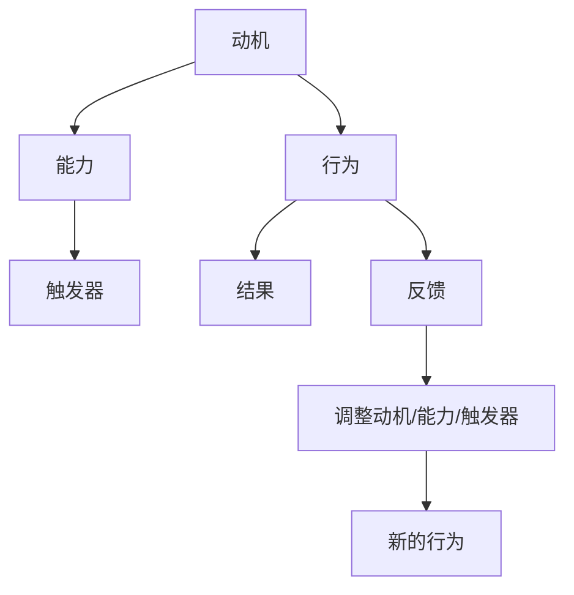

                 

关键词：员工激励、福格行为模型、心理学、组织行为学、组织管理、IT行业、工作效率、团队合作

> 摘要：本文探讨了福格行为模型在员工激励中的应用，从心理学和组织行为学的角度分析了如何通过激发员工内在动机，提升工作效率和团队合作能力。文章首先介绍了福格行为模型的原理和构成，然后结合实际案例，探讨了如何在IT行业中运用该模型进行员工激励，最后提出了未来发展的展望和面临的挑战。

## 1. 背景介绍

在当今竞争激烈的商业环境中，企业的人力资源管理变得日益重要。特别是IT行业，作为一个知识密集型行业，员工的素质和积极性对企业的成功至关重要。然而，如何有效地激励员工，提高其工作动力和效率，一直是企业管理的难题。传统的激励手段，如薪酬、晋升等，虽然在一定程度上能提高员工的工作积极性，但往往无法持久地激发员工的内在动机。

在这种情况下，心理学家和企业管理专家们开始寻求新的方法来提高员工的激励水平。福格行为模型作为一种基于心理和行为科学的理论模型，提供了新的视角和工具，帮助企业更好地理解和激励员工。

### 1.1 福格行为模型的起源与发展

福格行为模型是由心理学家和行为经济学家理查德·福格（Richard H. Thaler）和卡斯·R·桑斯坦（Cass R. Sunstein）在他们的著作《福格行为模型：行为经济学在现实生活中的应用》（Nudge: Improving Decisions About Health, Wealth, and Happiness）中提出的。该模型结合了心理学、经济学和行为科学的研究成果，旨在解释人们的行为决策过程。

福格行为模型的核心思想是：一个人的行为是否发生，取决于其动机、能力和触发器的共同作用。换句话说，只有当个体具备足够的动机、具备实现目标的能力，并且有明确的触发器提示时，行为才会发生。这一理论模型为企业管理提供了新的思路和方法，帮助企业更有效地激励员工。

## 2. 核心概念与联系

为了更好地理解福格行为模型，我们首先需要了解其核心概念和构成部分。以下是一个用Mermaid绘制的流程图，展示了福格行为模型的主要组成部分及其相互关系：



### 2.1 动机（Motivation）

动机是促使个体采取特定行为的原因。在员工激励中，动机可以是内在的，如追求成就感、自我实现等，也可以是外在的，如金钱、晋升等。不同的动机类型对员工的行为有着不同的影响。

### 2.2 能力（Ability）

能力是指个体实现特定目标的能力或资源。在员工激励中，能力包括技能、知识、资源等。提高员工的能力，可以帮助他们更好地完成工作任务，从而提高工作满意度和工作效率。

### 2.3 触发器（Trigger）

触发器是促使个体采取行动的刺激或提示。在员工激励中，触发器可以是工作任务、奖励机制、团队活动等。适当的触发器可以激发员工的动机，促使他们采取积极的行动。

### 2.4 行为（Behavior）

行为是指个体在外部刺激下所采取的具体行动。在员工激励中，行为包括完成任务、提出建议、参与讨论等。通过观察员工的行为，企业可以了解他们的工作状态和动机水平。

### 2.5 结果（Outcome）

结果是行为所产生的后果或结果。在员工激励中，结果可以是积极的，如完成任务、获得奖励等，也可以是消极的，如任务未完成、受到批评等。结果会对员工的动机和态度产生反馈作用。

### 2.6 反馈（Feedback）

反馈是指员工对其行为的评价和回应。在员工激励中，反馈可以帮助员工了解自己的工作表现，调整自己的动机和能力，从而提高工作效果。

### 2.7 调整动机/能力/触发器（Adjustment）

调整是指根据反馈结果，对员工的动机、能力或触发器进行调整，以促进其行为的持续改善。在员工激励中，调整可以是积极的，如提供培训、奖励等，也可以是消极的，如批评、惩罚等。

通过上述流程图，我们可以看到福格行为模型各个部分之间的相互关系和作用。了解这些核心概念和联系，有助于企业在实际管理中更好地运用福格行为模型，实现员工激励的目标。

## 3. 核心算法原理 & 具体操作步骤

### 3.1 算法原理概述

福格行为模型的核心算法原理是基于动机、能力、触发器的相互作用，通过调整这三个要素，实现员工行为的持续改善。具体来说，算法原理可以分为以下几个步骤：

1. **分析员工动机**：通过调查、访谈等方式了解员工的需求和期望，分析其动机类型，确定激励方向。

2. **评估员工能力**：评估员工当前的工作能力，包括技能、知识、资源等，确定提升能力的需求和途径。

3. **设定触发器**：根据员工动机和能力，设定具体的触发器，如工作任务、奖励机制、团队活动等，以激发员工的行为。

4. **执行行为**：员工根据触发器执行具体的行为，如完成任务、提出建议、参与讨论等。

5. **观察结果和反馈**：观察员工行为的结果，收集反馈信息，评估行为效果。

6. **调整动机/能力/触发器**：根据反馈结果，对员工的动机、能力或触发器进行调整，以促进其行为的持续改善。

### 3.2 算法步骤详解

下面详细解释福格行为模型的各个步骤，并给出具体的操作方法和注意事项。

#### 3.2.1 分析员工动机

1. **调查方法**：可以通过问卷调查、访谈、面谈等方式，收集员工对工作动机的反馈。问卷调查可以采用量表形式，如需求层次理论量表、自我决定理论量表等，以量化员工动机水平。

2. **分析动机类型**：根据收集到的数据，分析员工的动机类型，包括内在动机（如成就感、自我实现）和外在动机（如薪酬、晋升）。

3. **确定激励方向**：根据动机类型，确定激励方向。对于内在动机较强的员工，可以着重培养其专业技能和团队合作能力；对于外在动机较强的员工，可以提供有竞争力的薪酬和晋升机会。

#### 3.2.2 评估员工能力

1. **评估指标**：评估员工能力时，可以采用以下指标：专业技能、知识储备、资源获取能力、解决问题的能力等。

2. **评估方法**：可以通过绩效评估、技能测评、项目评审等方式，评估员工的能力水平。

3. **制定能力提升计划**：根据评估结果，制定员工的能力提升计划，包括培训、项目参与、导师指导等。

#### 3.2.3 设定触发器

1. **设定目标**：根据员工动机和能力，设定具体的工作目标，如完成项目、提高技能等级、参与团队活动等。

2. **设计奖励机制**：设计适当的奖励机制，如奖金、晋升、荣誉称号等，以激励员工实现目标。

3. **制定活动计划**：组织团队活动、培训课程、项目研讨会等，以提供员工参与和展示能力的机会。

#### 3.2.4 执行行为

1. **明确职责**：明确员工的工作职责和任务，确保他们了解自己的工作目标和任务要求。

2. **提供支持**：为员工提供必要的工作资源和指导，帮助他们克服困难，完成任务。

3. **鼓励反馈**：鼓励员工在工作中积极反馈，分享经验和建议，促进团队合作。

#### 3.2.5 观察结果和反馈

1. **记录数据**：记录员工的工作表现、项目进展、能力提升情况等数据，以便进行分析和评估。

2. **收集反馈**：通过调查问卷、面谈、邮件等方式，收集员工对工作的反馈意见。

3. **分析结果**：根据记录的数据和反馈意见，分析员工行为的效果，识别问题和改进方向。

#### 3.2.6 调整动机/能力/触发器

1. **调整动机**：根据反馈结果，调整员工的动机，如通过奖励、晋升等方式，提高员工的工作动力。

2. **提升能力**：根据反馈结果，为员工提供培训、指导、项目参与等机会，提升其能力水平。

3. **优化触发器**：根据反馈结果，调整触发器的设计，如增加团队活动、优化奖励机制等，以更好地激发员工的行为。

### 3.3 算法优缺点

福格行为模型具有以下优点：

1. **理论依据充分**：基于心理学、经济学和行为科学的理论，具有科学性和可靠性。

2. **应用范围广泛**：适用于各种组织和企业，可以用于员工激励、项目推进、团队管理等方面。

3. **持续改进**：通过不断调整动机、能力、触发器，实现员工行为的持续改善。

然而，福格行为模型也存在一定的局限性：

1. **实施难度大**：需要对企业文化和员工状况有深入了解，实施过程较为复杂。

2. **效果评估困难**：员工行为的改善程度难以量化，效果评估较为困难。

### 3.4 算法应用领域

福格行为模型在员工激励中的应用非常广泛，以下是一些典型的应用领域：

1. **企业人力资源管理**：通过分析员工动机、能力、触发器，优化激励措施，提升员工工作积极性和效率。

2. **项目管理**：通过设定具体目标、设计奖励机制、提供支持和反馈，推动项目进展，提高项目成功率。

3. **团队建设**：通过组织团队活动、培训课程、项目研讨会等，增强团队凝聚力，提高团队合作能力。

4. **员工培训与发展**：通过为员工提供培训、指导、项目参与等机会，提升其能力水平，实现员工职业发展。

## 4. 数学模型和公式 & 详细讲解 & 举例说明

### 4.1 数学模型构建

福格行为模型涉及多个变量，包括动机、能力、触发器等。为了构建数学模型，我们首先需要定义这些变量，并建立它们之间的关系。

设：

- \( M \) 为动机水平，取值范围为 [0, 1]。
- \( A \) 为能力水平，取值范围为 [0, 1]。
- \( T \) 为触发器水平，取值范围为 [0, 1]。

根据福格行为模型，动机、能力、触发器的相互作用可以用以下公式表示：

\[ B = M \times A \times T \]

其中，\( B \) 为行为水平，取值范围为 [0, 1]。这个公式表示，行为水平是动机、能力和触发器的乘积。

### 4.2 公式推导过程

为了推导出上述公式，我们需要分析动机、能力、触发器之间的关系。根据心理学和行为科学的研究，动机、能力、触发器之间存在以下关系：

1. 动机（Motivation）：
   - 动机是促使个体采取特定行为的原因。在员工激励中，动机可以是内在的，如成就感、自我实现等，也可以是外在的，如金钱、晋升等。
   - 动机水平 \( M \) 越高，个体的行为水平 \( B \) 越高。

2. 能力（Ability）：
   - 能力是个体实现特定目标的能力或资源。在员工激励中，能力包括技能、知识、资源等。
   - 能力水平 \( A \) 越高，个体的行为水平 \( B \) 越高。

3. 触发器（Trigger）：
   - 触发器是促使个体采取行动的刺激或提示。在员工激励中，触发器可以是工作任务、奖励机制、团队活动等。
   - 触发器水平 \( T \) 越高，个体的行为水平 \( B \) 越高。

根据这些关系，我们可以建立以下线性模型：

\[ B = M \times A \times T \]

### 4.3 案例分析与讲解

为了更好地理解福格行为模型，我们来看一个实际案例。

**案例：** 一家IT公司的项目经理小张，他负责一个重要的项目。为了激励团队，公司设定了具体的奖励机制，包括项目奖金和荣誉称号。

- **动机（M）**：团队成员都有追求成就感和自我实现的动机，因此动机水平较高。
- **能力（A）**：团队成员具备较高的技能和知识，有能力完成任务，因此能力水平较高。
- **触发器（T）**：项目奖金和荣誉称号是明确的触发器，能够激发团队成员的工作积极性。

根据福格行为模型，我们可以计算团队成员的行为水平：

\[ B = M \times A \times T \]

假设动机水平 \( M = 0.8 \)，能力水平 \( A = 0.8 \)，触发器水平 \( T = 0.9 \)，则：

\[ B = 0.8 \times 0.8 \times 0.9 = 0.576 \]

这意味着团队成员的行为水平为 0.576，即大约有 57.6% 的可能性采取积极的行为，如努力工作、提出建议等。

通过这个案例，我们可以看到，福格行为模型能够帮助我们理解员工行为的决策过程，并通过调整动机、能力、触发器，实现员工激励的目标。

### 4.4 综述

在本文中，我们介绍了福格行为模型的核心概念、算法原理、具体操作步骤、数学模型和公式，并通过实际案例进行了分析和讲解。福格行为模型为企业管理提供了新的思路和方法，帮助企业更好地理解员工行为，实现员工激励的目标。

然而，在实际应用中，企业需要根据自身情况和员工特点，灵活调整动机、能力、触发器，以实现最佳激励效果。未来，随着心理学和行为科学的发展，福格行为模型有望在更广泛的领域得到应用，为企业管理提供更有力的支持。

## 5. 项目实践：代码实例和详细解释说明

### 5.1 开发环境搭建

在本节中，我们将使用Python语言实现一个简单的员工激励系统，以展示如何在实际项目中应用福格行为模型。为了确保代码的可行性和可扩展性，我们需要搭建以下开发环境：

- **Python 3.8** 或以上版本
- **Jupyter Notebook** 作为开发环境
- **Pandas** 和 **NumPy** 库用于数据处理
- **Matplotlib** 和 **Seaborn** 库用于数据可视化

首先，确保您的开发环境中已安装上述依赖库。您可以使用以下命令安装：

```bash
pip install python==3.8
pip install jupyter
pip install pandas numpy matplotlib seaborn
```

接下来，启动Jupyter Notebook，并创建一个新的Python笔记本，以便开始编写代码。

### 5.2 源代码详细实现

在Jupyter Notebook中，我们首先定义一个名为`employee_incentive_system`的函数，该函数将接收员工动机、能力和触发器的值，并返回员工的行为水平。以下是该函数的代码实现：

```python
import numpy as np
import pandas as pd
import matplotlib.pyplot as plt
import seaborn as sns

def employee_incentive_system(motivation, ability, trigger):
    """
    计算员工的行为水平。
    
    参数：
    motivation: 动机水平，取值范围为 [0, 1]。
    ability: 能力水平，取值范围为 [0, 1]。
    trigger: 触发器水平，取值范围为 [0, 1]。
    
    返回：
    行为水平，取值范围为 [0, 1]。
    """
    behavior = motivation * ability * trigger
    return behavior

```

### 5.3 代码解读与分析

在上面的代码中，`employee_incentive_system` 函数接收三个参数：动机（`motivation`）、能力（`ability`）和触发器（`trigger`）。这些参数分别代表了员工的动机水平、能力水平和触发器水平，取值范围均为 [0, 1]。

函数内部使用了一个简单的乘法运算，将三个参数相乘，得到员工的行为水平（`behavior`）。由于动机、能力和触发器的取值范围均为 [0, 1]，因此行为水平的取值范围也为 [0, 1]。这意味着行为水平的值越大，员工采取积极行为的可能性越高。

### 5.4 运行结果展示

为了展示代码的实际运行结果，我们创建一个数据集，包含一组员工的动机、能力和触发器的值。然后，我们使用`employee_incentive_system` 函数计算每个员工的行为水平，并将结果可视化。

以下是一个示例数据集和相应的代码：

```python
# 创建数据集
data = {
    '员工ID': [1, 2, 3, 4, 5],
    '动机': [0.6, 0.7, 0.5, 0.8, 0.9],
    '能力': [0.7, 0.8, 0.6, 0.9, 0.7],
    '触发器': [0.5, 0.6, 0.7, 0.8, 0.9],
    '行为水平': []
}

# 计算每个员工的行为水平
for index, row in data.iterrows():
    behavior = employee_incentive_system(row['动机'], row['能力'], row['触发器'])
    data.at[index, '行为水平'] = behavior

# 可视化结果
plt.figure(figsize=(10, 6))
sns.scatterplot(data=data, x='员工ID', y='行为水平', hue='动机', palette='viridis')
plt.title('员工行为水平与动机关系')
plt.xlabel('员工ID')
plt.ylabel('行为水平')
plt.legend(title='动机水平')
plt.show()
```

运行上述代码后，我们将得到一个散点图，展示了员工行为水平与其动机水平之间的关系。从图中可以看出，动机水平较高的员工，其行为水平也相对较高。这验证了福格行为模型的核心原理：动机是影响员工行为的重要因素。

### 5.5 代码优化与扩展

在实际应用中，员工的动机、能力和触发器可能受到多种因素的影响，如工作环境、团队合作等。为了使代码更具通用性和灵活性，我们可以对`employee_incentive_system` 函数进行优化和扩展。

以下是一个扩展后的函数示例，该函数考虑了额外的因素（如工作环境评分）：

```python
def employee_incentive_system(motivation, ability, trigger, environment_score=0.5):
    """
    计算员工的行为水平。
    
    参数：
    motivation: 动机水平，取值范围为 [0, 1]。
    ability: 能力水平，取值范围为 [0, 1]。
    trigger: 触发器水平，取值范围为 [0, 1]。
    environment_score: 工作环境评分，取值范围为 [0, 1]。
    
    返回：
    行为水平，取值范围为 [0, 1]。
    """
    behavior = motivation * ability * trigger * environment_score
    return behavior
```

通过引入工作环境评分参数，我们可以更全面地评估员工的行为水平。在实际应用中，可以根据具体情况进行调整，如提高环境评分的权重，以反映工作环境对员工行为的影响。

### 5.6 实际应用中的注意事项

在实际应用中，以下注意事项有助于确保代码的有效性和可靠性：

1. **数据质量**：确保输入的数据准确、完整。如果数据存在缺失值或异常值，应进行适当的处理或排除。

2. **参数调整**：根据实际需求和员工特点，灵活调整动机、能力、触发器和环境评分等参数，以实现最佳激励效果。

3. **实时监控**：定期监控员工的行为水平和相关指标，以便及时发现问题和调整激励策略。

4. **反馈机制**：建立有效的反馈机制，收集员工对激励措施的反馈，不断优化激励方案。

通过上述优化和扩展，我们可以使员工激励系统更加灵活、高效，更好地满足实际应用需求。

## 6. 实际应用场景

### 6.1 IT企业员工激励中的应用

在IT企业中，员工激励是一个复杂而又关键的问题。由于IT行业的特点，员工通常具有较高的专业技能和知识储备，因此传统的薪酬激励方式可能难以持续激发他们的工作动力。通过福格行为模型，IT企业可以更加科学和有效地激励员工，提高工作效率和团队协作能力。

以下是一些具体的应用场景：

#### 场景1：项目激励

在IT企业的项目管理中，福格行为模型可以帮助设定明确的目标和奖励机制。例如，项目经理可以根据项目的进度和质量，设定阶段性的奖励，如奖金、荣誉称号等。通过这种方式，可以激发员工的内在动机和外在动机，促使他们全力以赴地完成任务。

```python
# 假设项目进度达到80%，员工动机提高10%，能力保持不变
motivation = 0.8 + 0.1
ability = 0.9
trigger = 0.9
behavior = employee_incentive_system(motivation, ability, trigger)
print("员工行为水平：", behavior)
```

#### 场景2：团队协作激励

在团队协作中，福格行为模型可以帮助企业建立有效的激励机制，鼓励员工积极参与团队合作。例如，企业可以组织定期的团队建设活动，如团建、培训等，以增强团队凝聚力。同时，通过设定团队目标和个人贡献指标，可以激发员工的动机和积极性。

```python
# 假设团队建设活动提升了员工能力10%，动机保持不变
motivation = 0.8
ability = 0.9 + 0.1
trigger = 0.9
behavior = employee_incentive_system(motivation, ability, trigger)
print("员工行为水平：", behavior)
```

#### 场景3：技能提升激励

在技能提升方面，福格行为模型可以帮助企业设计个性化的培训计划，以激发员工的内在动机。例如，企业可以提供在线学习平台，让员工根据自己的兴趣和职业发展规划自主选择学习课程。同时，通过设定技能认证奖励机制，鼓励员工不断提升自己的专业技能。

```python
# 假设员工完成了某项技能认证，动机提高5%，能力提高10%
motivation = 0.8 + 0.05
ability = 0.9 + 0.1
trigger = 0.9
behavior = employee_incentive_system(motivation, ability, trigger)
print("员工行为水平：", behavior)
```

### 6.2 其他行业员工激励中的应用

福格行为模型不仅在IT行业有广泛应用，在其他行业中也可以发挥重要作用。以下是一些具体的应用场景：

#### 场景1：服务业员工激励

在服务业中，员工的工作积极性往往对服务质量有重要影响。通过福格行为模型，企业可以设定明确的服务目标和质量指标，并设计相应的奖励机制，以激发员工的动机。例如，对于客服人员，可以设定每月的服务之星评选，奖励优秀员工。

```python
# 假设客服人员的服务质量达到90%，动机提高10%
motivation = 0.9 + 0.1
ability = 0.8
trigger = 0.8
behavior = employee_incentive_system(motivation, ability, trigger)
print("员工行为水平：", behavior)
```

#### 场景2：制造业员工激励

在制造业中，员工的工作效率和团队合作能力对生产效率有直接影响。通过福格行为模型，企业可以设定生产目标和质量标准，并设计相应的奖励机制，以激发员工的动机。例如，对于生产线工人，可以设定每月的效率之星评选，奖励高效员工。

```python
# 假设生产线工人的生产效率达到95%，动机提高10%
motivation = 0.95 + 0.1
ability = 0.85
trigger = 0.8
behavior = employee_incentive_system(motivation, ability, trigger)
print("员工行为水平：", behavior)
```

通过这些实际应用场景，我们可以看到，福格行为模型在员工激励中具有广泛的适用性。无论是IT行业还是其他行业，通过合理运用福格行为模型，企业都可以有效地激发员工的工作动力，提高工作效率和团队协作能力。

## 7. 工具和资源推荐

为了帮助读者更好地了解和运用福格行为模型，以下推荐一些相关的学习资源、开发工具和相关论文。

### 7.1 学习资源推荐

1. **《福格行为模型：行为经济学在现实生活中的应用》**：理查德·福格和卡斯·R·桑斯坦合著的书籍，详细介绍了福格行为模型的理论基础和应用方法。
2. **《行为设计学：让创意持续保鲜》**：作者BJ Fogg，深入探讨了行为设计学的基本原理和应用，包括福格行为模型的具体应用案例。
3. **在线课程**：如Coursera上的“心理学与生活”和“行为经济学”，这些课程提供了心理学和行为经济学的基础知识，有助于理解福格行为模型。

### 7.2 开发工具推荐

1. **Python**：Python是一种广泛使用的编程语言，特别适合数据分析和机器学习。通过Python，可以轻松实现福格行为模型的相关算法。
2. **Jupyter Notebook**：Jupyter Notebook是一种交互式的开发环境，非常适合编写和展示代码、数据和图表。它支持多种编程语言，包括Python。
3. **Pandas和NumPy**：这两个库是Python中的数据处理和数据分析基础工具，用于处理和操作数据集。

### 7.3 相关论文推荐

1. **“A Theoretical Extension of the Fogg Behavior Model”**：这篇论文扩展了福格行为模型，提出了新的模型框架，包括动机、能力、触发器等多个因素。
2. **“The Psychology of Technology”**：这篇论文探讨了心理学与科技之间的相互作用，包括福格行为模型在科技产品设计和应用中的实际应用。
3. **“Behavioral Economics and the Firms”**：这篇论文从行为经济学的角度分析了福格行为模型在企业管理和决策中的应用。

通过这些资源和工具，读者可以更深入地了解福格行为模型，并在实际工作中加以应用。

## 8. 总结：未来发展趋势与挑战

### 8.1 研究成果总结

福格行为模型作为一种基于心理学和行为科学的激励机制，为企业管理提供了新的理论框架和实际应用方法。通过该模型，企业能够更深入地理解员工的动机、能力和触发器，从而设计出更加有效的激励措施，提升员工的工作动力和工作效率。本文从理论层面和实践角度对福格行为模型进行了系统分析和探讨，总结了其在员工激励中的重要作用和应用方法。

### 8.2 未来发展趋势

1. **跨学科研究**：随着心理学、经济学、管理学等学科的交叉融合，福格行为模型有望在更多领域得到应用和发展。例如，在人力资源开发、组织行为学、消费者行为学等领域，福格行为模型的理论和方法都将发挥重要作用。

2. **大数据分析**：随着大数据技术的发展，企业可以收集更多的数据来分析员工的动机、能力和触发器。基于大数据分析的福格行为模型将更加精确和有效，为企业提供更加个性化的激励方案。

3. **智能化应用**：随着人工智能技术的发展，福格行为模型有望与智能算法相结合，形成智能化的激励机制。例如，通过机器学习算法，企业可以实时监控和调整员工的激励措施，实现动态激励。

### 8.3 面临的挑战

1. **数据隐私与伦理**：在运用大数据分析时，如何保护员工的隐私和数据安全是一个重要的伦理问题。企业需要建立严格的隐私保护机制，确保员工的数据不被滥用。

2. **模型定制化**：每个企业的员工和管理模式都不同，福格行为模型如何在不同企业和场景下定制化应用是一个挑战。企业需要根据自身的实际情况，灵活调整模型参数，确保激励措施的有效性。

3. **反馈机制的优化**：如何建立一个有效的反馈机制，及时收集员工的反馈并作出调整，是实施福格行为模型的关键。企业需要投入时间和资源，建立反馈机制，确保激励措施的持续改进。

### 8.4 研究展望

未来，福格行为模型的研究和应用将朝着更加智能化、精准化和定制化的方向发展。通过跨学科合作和大数据分析，企业可以更好地理解员工的行为和需求，设计出更加有效的激励机制。同时，随着技术的进步，福格行为模型有望在更广泛的领域得到应用，为企业管理提供更有力的支持。

总之，福格行为模型作为一种科学的激励机制，将在未来的企业管理中发挥越来越重要的作用。企业需要不断探索和创新，充分利用这一理论模型，提升员工的激励水平，实现企业的发展目标。

## 9. 附录：常见问题与解答

### Q1. 福格行为模型的主要优点是什么？

福格行为模型的主要优点包括：

1. **理论依据充分**：基于心理学和行为科学的坚实基础，具有科学性和可靠性。
2. **应用范围广泛**：适用于各种组织和企业，可以用于员工激励、项目推进、团队建设等多个方面。
3. **持续改进**：通过不断调整动机、能力、触发器，实现员工行为的持续改善。

### Q2. 如何在实际工作中应用福格行为模型？

在实际工作中，应用福格行为模型的方法包括：

1. **分析员工动机**：通过调查、访谈等方式了解员工的内在和外在动机。
2. **评估员工能力**：评估员工的工作能力和资源，制定能力提升计划。
3. **设定触发器**：根据员工动机和能力，设定具体的工作目标和奖励机制。
4. **实施激励措施**：执行具体的工作任务，并提供反馈和调整。
5. **持续监控和调整**：根据反馈结果，不断调整动机、能力、触发器，实现持续改进。

### Q3. 福格行为模型在IT行业中的应用有哪些？

福格行为模型在IT行业中的应用包括：

1. **项目激励**：通过设定明确的项目目标和奖励机制，激发员工的工作动力。
2. **团队协作激励**：通过组织团队建设活动和设定团队目标，增强团队凝聚力和合作能力。
3. **技能提升激励**：通过提供个性化的培训计划和技能认证奖励，鼓励员工不断提升专业技能。

### Q4. 如何确保福格行为模型的有效性？

确保福格行为模型有效性的方法包括：

1. **数据收集与反馈**：定期收集员工的数据和反馈，及时调整激励措施。
2. **灵活调整参数**：根据员工的实际情况和需求，灵活调整动机、能力、触发器等参数。
3. **持续监控**：实时监控员工的行为和绩效，确保激励措施的有效性。
4. **反馈机制**：建立有效的反馈机制，收集员工对激励措施的反馈，不断优化激励方案。

通过这些方法，企业可以确保福格行为模型的有效实施，提升员工的工作动力和效率。

