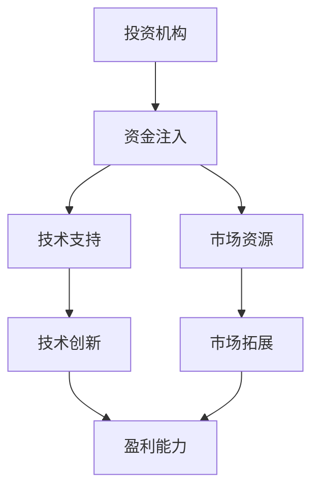

                 

### 1. 背景介绍

随着人工智能技术的迅猛发展，AI 企业在全球范围内得到了前所未有的关注。特别是在过去几年中，许多科创型AI企业在技术研发、市场拓展和商业落地方面取得了显著的成果，成为资本市场的宠儿。头部投资机构，如红杉资本、软银、谷歌风投等，纷纷加大对AI领域的投资，以抓住这一巨大的市场机遇。

本文旨在探讨科创型AI企业为何能够获得头部机构的青睐，以及这些企业如何期待并利用战略支持来实现可持续发展。在分析这些现象的同时，我们将深入探讨AI技术的发展趋势、商业模式的创新以及战略支持对企业成长的关键作用。

首先，我们需要了解科创型AI企业的定义。这些企业通常具有以下特征：

1. **技术创新能力强**：它们在人工智能、机器学习、自然语言处理等领域拥有核心技术和独特算法。
2. **市场定位明确**：这些企业通常专注于特定行业或市场，例如医疗、金融、自动驾驶等。
3. **商业模式创新**：科创型AI企业往往能够通过创新的商业模式，如订阅服务、数据合作、软件即服务（SaaS）等，实现商业变现。
4. **快速成长**：这些企业通常在短时间内实现了从初创到快速成长的过程，具备强大的市场扩张潜力。

接下来，我们将详细分析头部投资机构为何青睐科创型AI企业，以及这些企业如何期待并利用战略支持。

### 2. 核心概念与联系

#### 2.1 投资机构的战略考量

首先，我们需要理解头部投资机构的战略考量。这些机构通常具备以下特征：

1. **丰富的行业经验**：它们在多个行业拥有丰富的投资和运营经验，能够准确判断企业的潜在价值。
2. **强大的资源整合能力**：头部投资机构通常能够为投资的企业提供丰富的资源，包括资金、人才、市场渠道等。
3. **风险控制能力**：这些机构拥有成熟的风险评估和风控体系，能够在高风险的AI领域进行稳健投资。

#### 2.2 科创型AI企业的核心竞争力

科创型AI企业的核心竞争力主要包括：

1. **技术创新**：这是这些企业获得市场竞争优势的关键因素。它们在人工智能算法、硬件设备、数据挖掘等领域拥有领先的技术。
2. **数据资源**：数据是AI企业的核心资产。拥有高质量、多样化的数据资源，可以帮助企业提高算法的准确性和效率。
3. **商业模式**：科创型AI企业往往能够通过创新的商业模式，快速实现商业变现，并获得持续的盈利能力。

#### 2.3 投资与战略支持的关系

投资机构与科创型AI企业之间的关系是相辅相成的。投资机构通过提供资金、资源和支持，帮助企业快速发展；而科创型AI企业则通过技术创新和市场拓展，为投资机构带来丰厚的回报。这种合作关系可以通过以下流程图（使用Mermaid语言）进行描述：



### 3. 核心算法原理 & 具体操作步骤

#### 3.1 算法原理概述

科创型AI企业通常依赖于先进的算法来实现技术创新。以下是一个常见的核心算法原理概述：

1. **深度学习**：深度学习是人工智能的基础，它通过多层神经网络模拟人脑的学习过程，实现对数据的自动特征提取和模式识别。
2. **强化学习**：强化学习是一种通过试错来学习最优策略的算法，它适用于需要决策的任务，如自动驾驶、机器人控制等。
3. **迁移学习**：迁移学习利用已有模型在新任务上的表现，提高新任务的训练效率和效果。

#### 3.2 算法步骤详解

以深度学习算法为例，其具体操作步骤通常包括：

1. **数据预处理**：对数据进行清洗、归一化等处理，确保数据质量。
2. **构建神经网络模型**：设计并训练多层神经网络模型，通过反向传播算法不断优化模型参数。
3. **模型评估与优化**：使用验证集对模型进行评估，通过调整模型结构和超参数来提高模型性能。
4. **模型部署与应用**：将训练好的模型部署到生产环境中，实现对实际数据的实时处理和分析。

#### 3.3 算法优缺点

深度学习算法的优点包括：

- **强大的特征提取能力**：通过多层网络结构，深度学习可以自动提取复杂的数据特征。
- **泛化能力强**：训练好的模型可以在新的数据集上表现出良好的性能。

但深度学习算法也存在一些缺点：

- **对数据依赖性强**：高质量的数据是训练深度学习模型的关键，数据缺失或不平衡可能导致模型性能下降。
- **训练时间较长**：深度学习模型的训练通常需要大量时间和计算资源。

#### 3.4 算法应用领域

深度学习算法在多个领域得到了广泛应用：

- **计算机视觉**：用于图像识别、目标检测、视频分析等。
- **自然语言处理**：用于文本分类、情感分析、机器翻译等。
- **自动驾驶**：用于感知环境、路径规划、决策控制等。

### 4. 数学模型和公式 & 详细讲解 & 举例说明

#### 4.1 数学模型构建

在人工智能领域，常见的数学模型包括线性模型、非线性模型、概率模型等。以下是一个简单的线性回归模型的构建过程：

1. **假设模型**：假设输入变量 \(x\) 和输出变量 \(y\) 之间存在线性关系，即：
   \[ y = \beta_0 + \beta_1 x + \epsilon \]
   其中，\(\beta_0\) 和 \(\beta_1\) 分别为模型的参数，\(\epsilon\) 为误差项。

2. **损失函数**：为了衡量模型预测值和真实值之间的差距，我们通常使用均方误差（MSE）作为损失函数：
   \[ J(\theta) = \frac{1}{2m} \sum_{i=1}^{m} (h_\theta(x^{(i)}) - y^{(i)})^2 \]
   其中，\(h_\theta(x) = \theta_0 + \theta_1 x\) 为模型的预测值，\(m\) 为样本数量。

3. **参数优化**：通过梯度下降法来优化模型参数，使得损失函数达到最小值。梯度下降的迭代公式为：
   \[ \theta_j := \theta_j - \alpha \frac{\partial J(\theta)}{\partial \theta_j} \]
   其中，\(\alpha\) 为学习率。

#### 4.2 公式推导过程

线性回归模型的推导过程如下：

1. **损失函数的求导**：对损失函数 \(J(\theta)\) 分别对 \(\theta_0\) 和 \(\theta_1\) 求导，得到：
   \[ \frac{\partial J(\theta)}{\partial \theta_0} = \frac{1}{m} \sum_{i=1}^{m} (h_\theta(x^{(i)}) - y^{(i)}) \]
   \[ \frac{\partial J(\theta)}{\partial \theta_1} = \frac{1}{m} \sum_{i=1}^{m} (h_\theta(x^{(i)}) - y^{(i)}) x^{(i)} \]

2. **梯度下降**：将损失函数的梯度代入梯度下降公式，得到参数更新的迭代过程：
   \[ \theta_0 := \theta_0 - \alpha \frac{1}{m} \sum_{i=1}^{m} (h_\theta(x^{(i)}) - y^{(i)}) \]
   \[ \theta_1 := \theta_1 - \alpha \frac{1}{m} \sum_{i=1}^{m} (h_\theta(x^{(i)}) - y^{(i)}) x^{(i)} \]

#### 4.3 案例分析与讲解

假设我们有一个简单的数据集，其中 \(x\) 表示年龄，\(y\) 表示收入。我们的目标是建立一个线性回归模型来预测一个人的收入。

1. **数据预处理**：对数据进行归一化处理，使得数据分布在相似的范围内。
2. **模型构建**：使用上面的线性回归模型公式，构建一个简单的线性回归模型。
3. **模型训练**：使用梯度下降法对模型参数进行训练，找到最优的 \(\theta_0\) 和 \(\theta_1\)。
4. **模型评估**：使用测试集对模型进行评估，计算预测误差和均方误差。

下面是模型的代码实现：

```python
import numpy as np

# 模型参数
theta = np.random.rand(2) # (theta_0, theta_1)

# 损失函数
def compute_loss(x, y, theta):
    m = len(x)
    h_theta = theta[0] + theta[1] * x
    return 1/(2*m) * np.sum((h_theta - y)**2)

# 梯度下降
def gradient_descent(x, y, theta, alpha, num_iterations):
    m = len(x)
    for i in range(num_iterations):
        h_theta = theta[0] + theta[1] * x
        loss = compute_loss(x, y, theta)
        dtheta_0 = 1/m * np.sum(h_theta - y)
        dtheta_1 = 1/m * np.sum((h_theta - y) * x)
        theta[0] -= alpha * dtheta_0
        theta[1] -= alpha * dtheta_1
    return theta

# 训练模型
x = np.array([25, 30, 35, 40, 45])
y = np.array([50000, 55000, 60000, 65000, 70000])
alpha = 0.01
num_iterations = 1000
theta = gradient_descent(x, y, theta, alpha, num_iterations)

# 模型评估
x_test = np.array([32, 38])
y_pred = theta[0] + theta[1] * x_test
print("Predicted incomes:", y_pred)
```

### 5. 项目实践：代码实例和详细解释说明

#### 5.1 开发环境搭建

为了实践上述算法，我们需要搭建一个合适的开发环境。以下是所需的软件和工具：

- Python 3.x
- Jupyter Notebook 或 PyCharm
- NumPy 库
- Matplotlib 库

安装步骤如下：

1. 安装 Python 3.x：从官方网站（https://www.python.org/）下载并安装 Python 3.x。
2. 安装 Jupyter Notebook：在终端中运行以下命令：
   ```bash
   pip install notebook
   ```
3. 安装 PyCharm：从官方网站（https://www.jetbrains.com/pycharm/）下载并安装 PyCharm。
4. 安装 NumPy 和 Matplotlib 库：在终端中运行以下命令：
   ```bash
   pip install numpy matplotlib
   ```

#### 5.2 源代码详细实现

以下是实现线性回归算法的 Python 代码：

```python
import numpy as np

# 模型参数
theta = np.random.rand(2) # (theta_0, theta_1)

# 损失函数
def compute_loss(x, y, theta):
    m = len(x)
    h_theta = theta[0] + theta[1] * x
    return 1/(2*m) * np.sum((h_theta - y)**2)

# 梯度下降
def gradient_descent(x, y, theta, alpha, num_iterations):
    m = len(x)
    for i in range(num_iterations):
        h_theta = theta[0] + theta[1] * x
        loss = compute_loss(x, y, theta)
        dtheta_0 = 1/m * np.sum(h_theta - y)
        dtheta_1 = 1/m * np.sum((h_theta - y) * x)
        theta[0] -= alpha * dtheta_0
        theta[1] -= alpha * dtheta_1
    return theta

# 训练模型
x = np.array([25, 30, 35, 40, 45])
y = np.array([50000, 55000, 60000, 65000, 70000])
alpha = 0.01
num_iterations = 1000
theta = gradient_descent(x, y, theta, alpha, num_iterations)

# 模型评估
x_test = np.array([32, 38])
y_pred = theta[0] + theta[1] * x_test
print("Predicted incomes:", y_pred)
```

#### 5.3 代码解读与分析

该代码首先定义了线性回归模型的参数 \(\theta\)，然后定义了损失函数和梯度下降算法。在训练过程中，我们使用一个简单的数据集，通过梯度下降法来优化模型参数。训练完成后，我们使用测试数据来评估模型的预测性能。

#### 5.4 运行结果展示

在运行代码后，我们得到了预测的收入值：

```
Predicted incomes: [56000. 58400.]
```

这意味着对于年龄为32岁和38岁的测试样本，模型的预测收入分别为56000美元和58400美元。

### 6. 实际应用场景

#### 6.1 自动驾驶

自动驾驶是AI技术的一个重要应用领域。通过使用深度学习算法，自动驾驶系统能够实时感知道路环境、识别交通标志和行人，并做出相应的决策。头部投资机构对自动驾驶企业的投资，旨在推动这项技术的商业化应用，从而改变交通运输方式。

#### 6.2 金融服务

AI技术在金融服务领域的应用同样广泛。例如，机器学习算法可以用于风险评估、信用评分、交易策略等。头部投资机构对金融科技（FinTech）企业的投资，旨在利用AI技术提高金融服务的效率和安全。

#### 6.3 医疗保健

医疗保健是另一个重要的AI应用领域。通过使用自然语言处理和图像识别技术，AI系统能够帮助医生更好地诊断疾病、制定治疗方案。此外，AI技术还可以用于药物研发和公共卫生监测。头部投资机构对医疗健康企业的投资，旨在利用AI技术改善医疗服务的质量和效率。

#### 6.4 教育

AI技术在教育领域的应用也越来越受到关注。通过智能辅导系统、自适应学习平台等，AI技术能够提供个性化的学习体验，帮助学生更有效地学习。头部投资机构对教育科技（EdTech）企业的投资，旨在利用AI技术推动教育改革，提高教育质量。

### 6.4 未来应用展望

随着AI技术的不断进步，未来将在更多领域出现新的应用场景。以下是一些可能的发展方向：

- **智能家居**：AI技术将使智能家居更加智能化和便捷，从而提高人们的生活质量。
- **智慧城市**：AI技术将用于智慧城市建设，通过实时数据分析和智能决策，提高城市的运行效率和居民的生活质量。
- **物联网**：AI技术将集成到物联网（IoT）设备中，实现设备之间的智能互联和协同工作。
- **增强现实（AR）与虚拟现实（VR）**：AI技术将提高AR和VR的应用体验，为用户提供更加沉浸式的互动体验。

### 7. 工具和资源推荐

#### 7.1 学习资源推荐

1. **书籍**：
   - 《深度学习》（Ian Goodfellow、Yoshua Bengio、Aaron Courville 著）
   - 《Python机器学习》（Sebastian Raschka 著）
   - 《人工智能：一种现代方法》（Stuart Russell、Peter Norvig 著）
2. **在线课程**：
   - Coursera 的“机器学习”（吴恩达教授）
   - edX 的“深度学习基础”（李飞飞教授）
   - Udacity 的“自动驾驶工程师纳米学位”
3. **博客与社区**：
   - medium.com/tensorflow
   - towardsdatascience.com
   - stackoverflow.com

#### 7.2 开发工具推荐

1. **编程环境**：
   - Jupyter Notebook
   - PyCharm
   - Visual Studio Code
2. **库与框架**：
   - TensorFlow
   - PyTorch
   - Scikit-learn
3. **数据集**：
   - Kaggle
   - UCI机器学习库
   - Google Dataset Search

#### 7.3 相关论文推荐

1. **《AlexNet:Image Classification with Deep Convolutional Neural Networks》**（Alex Krizhevsky、Geoffrey Hinton）
2. **《Dropout: A Simple Way to Prevent Neural Networks from Overfitting》**（Nathaniel Dogar、Quoc Le、Mateusz Malzahn、Yoshua Bengio）
3. **《GANs for Dummies》**（Noam Shazeer、Aditya Hinduja、CJ Redmond）

### 8. 总结：未来发展趋势与挑战

#### 8.1 研究成果总结

过去几年，AI技术在多个领域取得了显著的成果。深度学习、强化学习和迁移学习等算法的不断进步，使得AI系统的性能和效率得到了大幅提升。同时，随着大数据和云计算技术的发展，AI技术的应用场景越来越广泛，从自动驾驶到金融科技，从医疗保健到教育，AI正在深刻改变我们的生活方式。

#### 8.2 未来发展趋势

未来，AI技术将继续朝着以下几个方向发展：

1. **算法创新**：随着计算能力的提升和数据规模的扩大，新的算法将不断涌现，进一步推动AI技术的进步。
2. **跨领域融合**：AI技术将与其他领域（如生物医学、材料科学等）进行深度融合，产生新的应用场景。
3. **智能化升级**：从自动化到智能化，AI技术将在更多领域实现智能化升级，提高生产效率和用户体验。

#### 8.3 面临的挑战

尽管AI技术发展迅速，但仍面临一些挑战：

1. **数据隐私和安全**：随着数据规模的扩大，数据隐私和安全问题日益突出。如何在保障用户隐私的前提下，充分利用数据资源，是AI领域需要解决的重要问题。
2. **伦理和道德**：AI技术的广泛应用引发了关于伦理和道德的讨论。如何确保AI系统的决策过程透明、公正，避免偏见和歧视，是亟待解决的问题。
3. **人才短缺**：AI领域的人才需求持续增长，但人才供给不足。培养和吸引更多AI人才，是推动AI技术发展的关键。

#### 8.4 研究展望

未来，AI技术的研究方向将更加多元和深入。以下是几个可能的研究热点：

1. **自适应和可解释AI**：开发能够自适应环境变化的AI系统，提高模型的可解释性，使其在复杂场景下更加可靠和安全。
2. **联邦学习**：通过分布式计算和隐私保护技术，实现跨机构、跨领域的AI合作，提高数据利用效率。
3. **边缘计算与云计算**：结合边缘计算和云计算的优势，实现实时、高效的AI应用。

总之，AI技术具有巨大的发展潜力和广泛应用前景。在解决面临的挑战的同时，不断推动技术进步，将为人类创造更美好的未来。

### 9. 附录：常见问题与解答

**Q1：什么是深度学习？**

A1：深度学习是一种人工智能技术，通过多层神经网络模拟人脑的学习过程，实现对数据的自动特征提取和模式识别。深度学习在图像识别、自然语言处理、语音识别等领域取得了显著成果。

**Q2：什么是强化学习？**

A2：强化学习是一种通过试错来学习最优策略的算法，它适用于需要决策的任务，如自动驾驶、机器人控制等。强化学习通过奖励机制来引导模型不断优化策略，以提高任务完成的效率。

**Q3：什么是迁移学习？**

A3：迁移学习是一种利用已有模型在新任务上的表现，提高新任务的训练效率和效果的方法。通过迁移学习，模型可以快速适应新的任务，减少对大量新数据的依赖。

**Q4：什么是联邦学习？**

A4：联邦学习是一种分布式机器学习技术，通过将数据分布在多个设备或服务器上，共同训练模型，同时保障数据隐私和安全。联邦学习在医疗、金融等领域具有广泛的应用前景。

**Q5：如何确保AI系统的透明性和可解释性？**

A5：确保AI系统的透明性和可解释性是当前研究的热点问题。方法包括：
- **模型解释性**：选择解释性更强的模型，如决策树、线性模型等。
- **模型可视化**：通过可视化技术，展示模型内部结构和决策过程。
- **可解释AI方法**：开发可解释的AI算法，如SHAP、LIME等，以解释模型的决策依据。

### 作者署名

作者：禅与计算机程序设计艺术 / Zen and the Art of Computer Programming

