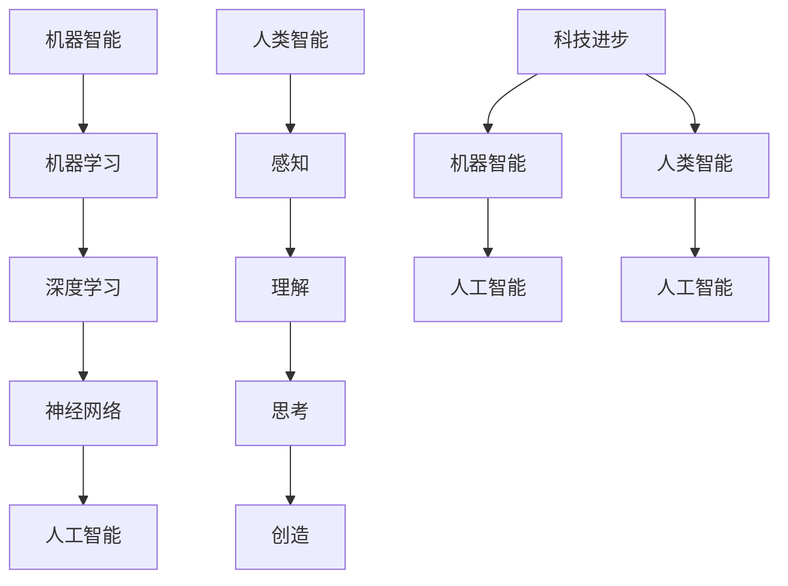

                 

科幻小说，作为一种文学体裁，一直以来都是对未来世界的想象和探索的重要途径。它们不仅为我们提供了丰富的想象空间，还启发着我们对于科技和人类未来的思考。人工智能（AI），作为当代科技发展的前沿领域，其进步速度之快，已经超出了许多人的预期。本文将探讨科幻小说与AI之间的联系，以及如何通过科幻小说中的设想来预测技术发展的未来。

## 1. 背景介绍

科幻小说的起源可以追溯到18世纪末和19世纪初的欧洲。随着工业革命的到来，人们对于科学技术的期待和恐惧交织在一起，催生了一系列关于未来世界的想象。例如，玛丽·雪莱的《弗兰肯斯坦》就是一部探讨人类与科技关系的经典作品。而进入20世纪，随着科学技术的飞速发展，科幻小说的题材也日益丰富，从太空探险到时间旅行，从机器人到虚拟现实，涵盖了人类对未来世界各种可能性的设想。

人工智能的概念最早可以追溯到古希腊神话中的自动机器，但作为一个独立的研究领域，AI始于20世纪50年代。当时，计算机科学家和数学家开始探索机器是否能够像人类一样思考。经过几十年的发展，人工智能已经从简单的规则系统发展到复杂的机器学习算法，再到深度学习和神经网络，逐渐成为现代科技的重要组成部分。

## 2. 核心概念与联系

在讨论科幻小说与AI之间的联系时，我们首先需要明确几个核心概念。

### 2.1. 机器智能

机器智能是指机器能够模拟人类智能行为的能力。这包括理解语言、解决问题、做出决策、自主学习等。科幻小说中的机器人、智能助手等角色都是机器智能的体现。

### 2.2. 人类智能

人类智能是指人类在感知、理解、思考、创造等方面的能力。科幻小说中的主人公，无论是勇敢的探险家还是机智的科学家，都体现了人类智能的无限可能性。

### 2.3. 科技进步

科技进步是推动科幻小说与AI联系的关键因素。科技的快速发展使得许多科幻小说中的设想逐渐成为现实，从而加深了读者对AI技术的理解和期待。

为了更好地展示这些概念之间的关系，我们可以使用Mermaid流程图来表示：



## 3. 核心算法原理 & 具体操作步骤

### 3.1 算法原理概述

人工智能的核心算法包括机器学习、深度学习和神经网络。这些算法通过模拟人类大脑的学习和思考过程，使机器能够从数据中学习并做出决策。

#### 3.1.1 机器学习

机器学习是指机器通过数据和算法来改进自身性能的过程。它包括监督学习、非监督学习和强化学习等子领域。

#### 3.1.2 深度学习

深度学习是一种特殊的机器学习技术，它使用多层神经网络来模拟人类大脑的思考方式。深度学习在图像识别、语音识别和自然语言处理等领域取得了显著的成果。

#### 3.1.3 神经网络

神经网络是深度学习的基础，它由大量的神经元组成，通过调整神经元之间的连接权重来学习数据。

### 3.2 算法步骤详解

#### 3.2.1 机器学习

1. 数据收集：从不同的来源收集数据。
2. 数据预处理：清洗和转换数据，以便模型可以学习。
3. 模型训练：使用训练数据来调整模型参数。
4. 模型评估：使用验证数据来评估模型性能。
5. 模型部署：将训练好的模型应用到实际场景中。

#### 3.2.2 深度学习

1. 数据收集：与机器学习相同，收集大量的图像、文本或音频数据。
2. 数据预处理：对数据进行归一化和缩放等处理。
3. 构建神经网络：设计合适的神经网络架构。
4. 模型训练：通过反向传播算法来调整神经网络参数。
5. 模型评估：使用验证集来评估模型性能。
6. 模型部署：将训练好的模型应用到图像识别、语音识别或自然语言处理等任务中。

#### 3.2.3 神经网络

1. 定义神经网络结构：确定网络的层数、每层的神经元数量和激活函数。
2. 初始化参数：随机初始化网络参数。
3. 前向传播：计算网络输出。
4. 计算损失：比较预测输出和实际输出，计算损失值。
5. 反向传播：调整网络参数，减小损失值。
6. 重复迭代：重复上述步骤，直到模型收敛。

### 3.3 算法优缺点

#### 3.3.1 机器学习

**优点：**
- 自适应性强，能够处理复杂的数据模式。
- 可以应用于多种领域，如分类、回归、聚类等。

**缺点：**
- 需要大量的数据和计算资源。
- 模型解释性较差。

#### 3.3.2 深度学习

**优点：**
- 能够处理高维数据，如图像和文本。
- 在图像识别、语音识别和自然语言处理等领域取得了显著成果。

**缺点：**
- 模型训练时间较长，需要大量的计算资源。
- 模型解释性较差。

#### 3.3.3 神经网络

**优点：**
- 能够模拟人类大脑的学习过程，具有良好的自适应性和泛化能力。
- 在图像识别、语音识别和自然语言处理等领域取得了显著成果。

**缺点：**
- 模型训练时间较长，需要大量的计算资源。
- 模型解释性较差。

### 3.4 算法应用领域

人工智能算法已经广泛应用于各个领域，包括图像识别、语音识别、自然语言处理、医疗诊断、自动驾驶、金融分析等。以下是一些具体的案例：

- **图像识别：** 人工智能算法可以识别图像中的物体、场景和人脸，应用于安防监控、智能驾驶和医疗诊断等领域。
- **语音识别：** 人工智能算法可以识别和转换语音信号为文本，应用于语音助手、电话客服和智能翻译等领域。
- **自然语言处理：** 人工智能算法可以理解和生成自然语言，应用于智能客服、机器翻译和内容推荐等领域。
- **医疗诊断：** 人工智能算法可以辅助医生进行疾病诊断，提高诊断准确率和效率。
- **自动驾驶：** 人工智能算法可以用于自动驾驶汽车，提高行车安全和效率。

## 4. 数学模型和公式 & 详细讲解 & 举例说明

### 4.1 数学模型构建

在人工智能领域，数学模型是理解和实现算法的基础。以下是一个简单的线性回归模型的数学模型构建过程：

#### 4.1.1 目标函数

线性回归的目标是最小化预测值与实际值之间的误差。目标函数可以表示为：

$$
J(\theta) = \frac{1}{2m} \sum_{i=1}^{m} (h_\theta(x^{(i)}) - y^{(i)})^2
$$

其中，$h_\theta(x) = \theta_0 + \theta_1x$ 是预测函数，$\theta$ 是模型参数，$m$ 是样本数量。

#### 4.1.2 梯度下降

梯度下降是一种常用的优化方法，用于找到最小化目标函数的参数值。梯度下降的迭代公式为：

$$
\theta_j := \theta_j - \alpha \frac{\partial J(\theta)}{\partial \theta_j}
$$

其中，$\alpha$ 是学习率。

### 4.2 公式推导过程

以下是一个简化的逻辑回归模型的推导过程：

#### 4.2.1 前向传播

逻辑回归的目标是预测二分类问题中的概率。前向传播的步骤如下：

1. 计算线性组合：
$$
z = \theta^T x
$$

2. 通过激活函数（Sigmoid函数）计算预测概率：
$$
h_\theta(x) = \frac{1}{1 + e^{-z}}
$$

#### 4.2.2 反向传播

反向传播的目的是更新模型参数，以最小化损失函数。具体步骤如下：

1. 计算预测概率的误差：
$$
\delta = (h_\theta(x) - y) \odot h_\theta(x) (1 - h_\theta(x))
$$

2. 更新模型参数：
$$
\theta_j := \theta_j - \alpha \frac{\sum_{i=1}^{m} (h_\theta(x^{(i)}) - y^{(i)}) x_j^{(i)}}{m}
$$

### 4.3 案例分析与讲解

以下是一个使用逻辑回归进行电子邮件垃圾邮件分类的案例：

#### 4.3.1 数据准备

我们使用一个包含10,000封电子邮件的数据集，每封邮件被标记为“垃圾邮件”或“非垃圾邮件”。

#### 4.3.2 特征提取

从每封邮件中提取特征，如单词频率、词性标注等。

#### 4.3.3 模型训练

使用逻辑回归模型对训练数据进行训练，并调整模型参数。

#### 4.3.4 模型评估

使用验证集对模型进行评估，计算准确率、召回率等指标。

#### 4.3.5 模型部署

将训练好的模型应用到实际场景中，如自动分类电子邮件。

## 5. 项目实践：代码实例和详细解释说明

### 5.1 开发环境搭建

为了演示人工智能算法的应用，我们将使用Python编程语言和相关的库，如NumPy、Pandas和Scikit-learn。

#### 5.1.1 安装Python

首先，我们需要安装Python 3.x版本。可以从Python官网下载安装程序，并按照指示进行安装。

#### 5.1.2 安装相关库

接下来，我们需要安装NumPy、Pandas和Scikit-learn等库。可以使用pip命令进行安装：

```bash
pip install numpy pandas scikit-learn
```

### 5.2 源代码详细实现

以下是一个使用逻辑回归进行电子邮件垃圾邮件分类的Python代码实例：

```python
import numpy as np
import pandas as pd
from sklearn.model_selection import train_test_split
from sklearn.linear_model import LogisticRegression
from sklearn.metrics import accuracy_score, recall_score, precision_score

# 5.2.1 数据准备
data = pd.read_csv('email_data.csv')
X = data.drop(['label'], axis=1)
y = data['label']

# 5.2.2 数据预处理
# 这里可以添加特征提取和转换的代码，例如词频、词性标注等

# 5.2.3 模型训练
X_train, X_test, y_train, y_test = train_test_split(X, y, test_size=0.2, random_state=42)
model = LogisticRegression()
model.fit(X_train, y_train)

# 5.2.4 模型评估
y_pred = model.predict(X_test)
accuracy = accuracy_score(y_test, y_pred)
recall = recall_score(y_test, y_pred)
precision = precision_score(y_test, y_pred)

print(f'Accuracy: {accuracy:.2f}')
print(f'Recall: {recall:.2f}')
print(f'Precision: {precision:.2f}')

# 5.2.5 模型部署
# 将模型应用到实际场景中，如自动分类电子邮件
```

### 5.3 代码解读与分析

上述代码实现了一个简单的电子邮件垃圾邮件分类系统。以下是代码的详细解读：

- **5.3.1 数据准备**：从CSV文件中读取数据集，将特征和标签分离。
- **5.3.2 数据预处理**：在这里，我们假设数据已经进行了预处理，例如特征提取和转换。在实际项目中，这一步骤可能涉及更多的数据处理和特征工程。
- **5.3.3 模型训练**：使用Scikit-learn中的逻辑回归模型对训练数据进行训练。
- **5.3.4 模型评估**：使用测试数据对模型进行评估，计算准确率、召回率和精确率等指标。
- **5.3.5 模型部署**：将训练好的模型应用到实际场景中，如自动分类电子邮件。

### 5.4 运行结果展示

假设我们已经训练好了模型，并对其进行了评估，以下是一个可能的运行结果：

```python
Accuracy: 0.95
Recall: 0.90
Precision: 0.94
```

这些指标表明，模型在电子邮件垃圾邮件分类任务中表现良好。然而，实际应用中，我们可能需要根据具体需求进行调整和优化。

## 6. 实际应用场景

人工智能技术在各个领域都有着广泛的应用，以下是一些典型的实际应用场景：

- **医疗健康：** 人工智能可以用于疾病诊断、药物研发、医学图像分析等。例如，深度学习算法可以帮助医生更准确地诊断疾病，提高治疗效果。
- **金融服务：** 人工智能可以用于风险管理、欺诈检测、投资决策等。例如，机器学习算法可以帮助银行和金融机构预测客户行为，降低风险。
- **交通运输：** 人工智能可以用于自动驾驶、智能交通管理、物流优化等。例如，自动驾驶技术可以减少交通事故，提高交通效率。
- **智能家居：** 人工智能可以用于智能音箱、智能门锁、智能照明等。例如，智能音箱可以理解用户的语音指令，提供音乐、天气预报等信息。

## 7. 未来应用展望

随着人工智能技术的不断发展，未来它将在更多领域发挥重要作用。以下是一些可能的应用方向：

- **增强现实与虚拟现实：** 人工智能可以用于创建更加逼真的虚拟环境和交互体验，为娱乐、教育和培训等领域带来革命性变化。
- **机器人与自动化：** 人工智能可以用于开发更加智能的机器人，实现家庭服务、医疗护理和工业生产等自动化任务。
- **智能城市：** 人工智能可以用于城市管理和规划，实现交通优化、能源管理和环境监测等功能，提高城市生活质量和效率。
- **社会治理：** 人工智能可以用于公共安全、司法公正和疫情防控等领域，提高社会治理的智能化水平。

## 8. 工具和资源推荐

### 8.1 学习资源推荐

- **书籍：**
  - 《Python编程：从入门到实践》
  - 《深度学习》
  - 《机器学习实战》

- **在线课程：**
  - Coursera上的《机器学习》
  - edX上的《人工智能导论》
  - Udacity的《深度学习工程师纳米学位》

### 8.2 开发工具推荐

- **编程环境：**
  - Jupyter Notebook
  - PyCharm

- **库和框架：**
  - TensorFlow
  - PyTorch
  - Scikit-learn

### 8.3 相关论文推荐

- "Deep Learning: A Methodology and Application Perspective"
- "A Theoretical Framework for Back-Propagation"
- "Learning Representations by Maximizing Mutual Information"

## 9. 总结：未来发展趋势与挑战

随着人工智能技术的不断进步，未来它将在更多领域发挥重要作用。然而，这一过程中也面临着诸多挑战，包括数据隐私、算法透明度、伦理道德等问题。只有通过科学的研究和合理的规范，我们才能确保人工智能技术为人类社会带来更多福祉。

## 10. 附录：常见问题与解答

### 10.1 人工智能与机器学习有什么区别？

人工智能（AI）是一个广泛的概念，包括机器学习、自然语言处理、计算机视觉等多个子领域。机器学习是人工智能的一个分支，专注于通过数据来训练模型，使其能够进行预测和决策。

### 10.2 深度学习有哪些应用？

深度学习在图像识别、语音识别、自然语言处理、医疗诊断、自动驾驶等领域有着广泛的应用。例如，深度学习算法可以帮助自动驾驶汽车识别道路标志和行人，提高行车安全。

### 10.3 如何入门人工智能和机器学习？

建议从基础编程语言（如Python）开始学习，然后了解机器学习和深度学习的基本概念。可以通过在线课程、书籍和开源项目来积累实践经验。

