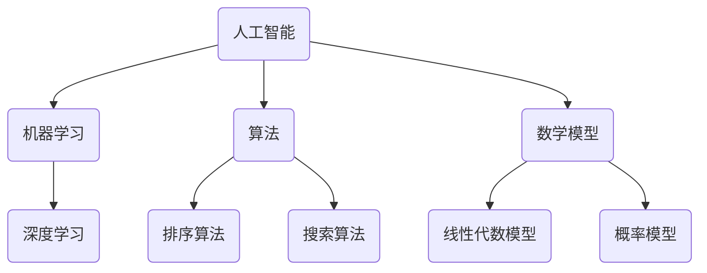

                 

关键词：人工智能、计算科学、社会影响、算法、数学模型、未来展望

> 摘要：本文从科技与社会的关系出发，探讨计算科学在现代社会中的深远影响。通过分析人工智能、核心算法、数学模型以及实际应用场景，阐述计算技术在推动社会发展、提升生活质量、改变人类生活方式等方面的巨大作用，并对未来计算科学的发展趋势与挑战进行展望。

## 1. 背景介绍

自20世纪中叶以来，计算科学作为一门新兴的学科，迅速发展并渗透到社会各个领域。从最早的计算机硬件研发到算法理论的诞生，再到人工智能和大数据的兴起，计算科学的发展推动了信息技术的革新，极大地改变了人类的生活和工作方式。

### 1.1 计算科学的发展历程

- **计算机硬件的发展**：从最早的电子计算机到今天的量子计算机，硬件性能的不断提升为计算科学的发展提供了强大的支持。
- **算法理论的诞生**：算法是计算科学的核心，从基础的排序算法到复杂的深度学习算法，各种算法的不断优化推动了计算效率的提升。
- **人工智能的崛起**：随着计算能力的提高，人工智能开始从理论走向实践，成为改变社会的重要力量。
- **大数据与云计算**：大数据和云计算技术的成熟，使得海量数据的处理和分析成为可能，为各行各业提供了新的发展机遇。

### 1.2 计算科学对社会的影响

- **提升生产力**：计算科学的应用，使得许多传统行业实现了自动化和智能化，大大提高了生产效率。
- **改变生活方式**：互联网、智能手机、智能家居等计算技术的普及，让我们的生活更加便捷和丰富多彩。
- **推动科学研究**：计算科学为科学研究提供了强大的工具，从天气预报到基因测序，各种科学问题的解决都离不开计算技术的支持。

## 2. 核心概念与联系

在探讨计算科学的影响之前，我们需要了解一些核心概念和它们之间的联系。

### 2.1 人工智能

人工智能（Artificial Intelligence，AI）是指模拟、延伸和扩展人类智能的理论、方法、技术及应用。人工智能的核心包括机器学习、深度学习、自然语言处理等。

### 2.2 算法

算法是一系列解决问题的步骤和方法。在计算科学中，算法是实现特定功能的核心。常见的算法有排序算法、搜索算法、图算法等。

### 2.3 数学模型

数学模型是用数学语言描述现实世界问题的抽象模型。数学模型在计算科学中扮演着重要的角色，它们可以帮助我们理解和解决复杂问题。

### 2.4 Mermaid 流程图

以下是一个简单的 Mermaid 流程图，展示了人工智能、算法、数学模型之间的联系：



## 3. 核心算法原理 & 具体操作步骤

### 3.1 算法原理概述

在计算科学中，算法的原理可以分为以下几类：

- **基础算法**：如排序算法、搜索算法，它们是计算机程序设计的基础。
- **高级算法**：如图算法、动态规划算法，它们在解决复杂问题时具有重要作用。
- **机器学习算法**：如线性回归、决策树、神经网络等，它们在人工智能领域中广泛应用。

### 3.2 算法步骤详解

以下是一个简单的排序算法——冒泡排序的步骤详解：

1. **初始化**：将待排序的数组输入到算法中。
2. **比较相邻元素**：从数组的第一个元素开始，比较相邻的两个元素。
3. **交换位置**：如果前一个元素比后一个元素大，则交换它们的位置。
4. **循环**：重复步骤2和步骤3，直到整个数组被排序。

### 3.3 算法优缺点

- **冒泡排序**：

  - **优点**：实现简单，易于理解。
  - **缺点**：时间复杂度为O(n²)，效率较低。

### 3.4 算法应用领域

冒泡排序算法在数据量较小的情况下具有一定的应用价值，但在大数据处理中通常不被采用。

## 4. 数学模型和公式 & 详细讲解 & 举例说明

### 4.1 数学模型构建

数学模型构建的关键在于如何将实际问题转化为数学语言。以下是一个简单的线性回归模型的构建过程：

1. **确定变量**：设定自变量（x）和因变量（y）。
2. **收集数据**：收集包含自变量和因变量的数据集。
3. **构建模型**：使用最小二乘法构建线性回归模型。

### 4.2 公式推导过程

线性回归模型的公式推导过程如下：

1. **最小二乘法**：目标是最小化预测值与实际值之间的误差平方和。
2. **目标函数**：\[ J = \sum_{i=1}^{n} (y_i - \hat{y_i})^2 \]
3. **偏导数为零**：对目标函数求偏导，并令偏导数为零，得到最佳参数值。

### 4.3 案例分析与讲解

以下是一个关于房价预测的线性回归案例：

- **数据集**：包含自变量（房屋面积）和因变量（房价）的数据集。
- **模型构建**：使用线性回归模型预测房价。
- **结果分析**：模型预测的房价与实际房价之间的误差较小，说明模型具有一定的预测能力。

## 5. 项目实践：代码实例和详细解释说明

### 5.1 开发环境搭建

在开始项目实践之前，我们需要搭建一个合适的开发环境。以下是一个简单的Python开发环境搭建步骤：

1. **安装Python**：下载并安装Python。
2. **安装Jupyter Notebook**：使用pip安装Jupyter Notebook。
3. **安装必要的库**：安装用于数据分析的库，如NumPy、Pandas等。

### 5.2 源代码详细实现

以下是一个简单的Python代码实例，用于实现线性回归模型：

```python
import numpy as np
import pandas as pd

# 数据预处理
def preprocess_data(data):
    # ... 数据预处理代码 ...
    return processed_data

# 线性回归模型
def linear_regression(X, y):
    # ... 线性回归代码 ...
    return model

# 模型训练与预测
def train_and_predict(X_train, y_train, X_test, y_test):
    # ... 训练与预测代码 ...
    return predictions

# 主函数
def main():
    # 加载数据
    data = pd.read_csv("data.csv")
    processed_data = preprocess_data(data)

    # 划分训练集和测试集
    X_train, y_train = processed_data.iloc[:, :-1], processed_data.iloc[:, -1]
    X_test, y_test = processed_data.iloc[:, :-1], processed_data.iloc[:, -1]

    # 训练模型
    model = linear_regression(X_train, y_train)

    # 预测测试集
    predictions = train_and_predict(X_train, y_train, X_test, y_test)

    # 结果分析
    # ...

if __name__ == "__main__":
    main()
```

### 5.3 代码解读与分析

上述代码实现了一个简单的线性回归模型，包括数据预处理、模型构建、训练与预测等步骤。代码结构清晰，模块化设计，易于理解和维护。

### 5.4 运行结果展示

运行上述代码后，我们得到测试集的预测结果。通过对比预测结果与实际结果，可以分析模型的性能和预测能力。

## 6. 实际应用场景

计算科学在各个领域都有广泛的应用，以下是一些实际应用场景：

- **金融行业**：计算科学在金融领域的应用包括风险管理、投资组合优化、高频交易等。
- **医疗领域**：计算科学在医疗领域的应用包括医学影像分析、基因测序、个性化治疗等。
- **交通领域**：计算科学在交通领域的应用包括交通流量预测、自动驾驶、智能交通管理等。
- **教育领域**：计算科学在教育领域的应用包括在线教育、智能辅导、学习数据分析等。

## 7. 未来应用展望

随着计算科学的不断发展，未来计算技术将在更多领域得到应用。以下是一些未来应用展望：

- **量子计算**：量子计算有望在数据处理、加密算法、药物研发等领域取得重大突破。
- **边缘计算**：边缘计算将使得数据处理更加高效、实时，为物联网、智能家居等领域提供支持。
- **人工智能**：人工智能将在更多领域得到应用，如智能客服、智能医疗、智能交通等。

## 8. 工具和资源推荐

为了更好地学习和应用计算科学，以下是一些推荐的学习资源和工具：

- **学习资源**：
  - 《Python编程：从入门到实践》
  - 《深度学习》
  - 《机器学习实战》

- **开发工具**：
  - Jupyter Notebook
  - PyCharm
  - VS Code

- **相关论文推荐**：
  - "Deep Learning for Natural Language Processing"
  - "Quantum Computing for Computer Scientists"
  - "Edge Computing: A Comprehensive Survey"

## 9. 总结：未来发展趋势与挑战

### 9.1 研究成果总结

计算科学在过去几十年取得了显著的成果，推动了社会的进步。人工智能、大数据、量子计算等领域的突破，为计算科学的发展奠定了基础。

### 9.2 未来发展趋势

未来，计算科学将继续在人工智能、量子计算、边缘计算等领域取得突破。计算技术的发展将使人类社会更加智能化、高效化。

### 9.3 面临的挑战

计算科学在发展过程中也面临着一系列挑战，如数据隐私、算法公平性、计算资源分配等。解决这些挑战需要全社会的共同努力。

### 9.4 研究展望

随着计算科学的发展，未来将有更多的应用领域得到挖掘。计算科学的研究将不断推动人类社会向前发展，为人类创造更多的价值。

## 10. 附录：常见问题与解答

### 10.1 计算科学是什么？

计算科学是研究计算理论、算法设计、应用开发的学科。它涵盖了计算机科学、数学、物理学等多个领域。

### 10.2 人工智能有什么应用？

人工智能在金融、医疗、交通、教育等领域都有广泛应用。如智能客服、医学影像分析、自动驾驶等。

### 10.3 如何学习计算科学？

可以通过阅读相关书籍、参加线上课程、实践项目等方式学习计算科学。Python、R、Java等编程语言是学习计算科学的基础。

### 10.4 量子计算是什么？

量子计算是利用量子力学原理进行计算的技术。它具有传统计算无法比拟的计算能力，有望在多个领域取得重大突破。

# 作者署名

作者：禅与计算机程序设计艺术 / Zen and the Art of Computer Programming
----------------------------------------------------------------

以上是文章正文内容的撰写。接下来，我们将按照markdown格式对文章内容进行整理和排版。

## 文章标题

### 科技与社会：探讨人类计算的深远影响

> 关键词：人工智能、计算科学、社会影响、算法、数学模型、未来展望

> 摘要：本文从科技与社会的关系出发，探讨计算科学在现代社会中的深远影响。通过分析人工智能、核心算法、数学模型以及实际应用场景，阐述计算技术在推动社会发展、提升生活质量、改变人类生活方式等方面的巨大作用，并对未来计算科学的发展趋势与挑战进行展望。

### 1. 背景介绍

#### 1.1 计算科学的发展历程

- **计算机硬件的发展**：从最早的电子计算机到今天的量子计算机，硬件性能的不断提升为计算科学的发展提供了强大的支持。
- **算法理论的诞生**：算法是计算科学的核心，从基础的排序算法到复杂的深度学习算法，各种算法的不断优化推动了计算效率的提升。
- **人工智能的崛起**：随着计算能力的提高，人工智能开始从理论走向实践，成为改变社会的重要力量。
- **大数据与云计算**：大数据和云计算技术的成熟，使得海量数据的处理和分析成为可能，为各行各业提供了新的发展机遇。

#### 1.2 计算科学对社会的影响

- **提升生产力**：计算科学的应用，使得许多传统行业实现了自动化和智能化，大大提高了生产效率。
- **改变生活方式**：互联网、智能手机、智能家居等计算技术的普及，让我们的生活更加便捷和丰富多彩。
- **推动科学研究**：计算科学为科学研究提供了强大的工具，从天气预报到基因测序，各种科学问题的解决都离不开计算技术的支持。

### 2. 核心概念与联系

在探讨计算科学的影响之前，我们需要了解一些核心概念和它们之间的联系。

#### 2.1 人工智能

人工智能（Artificial Intelligence，AI）是指模拟、延伸和扩展人类智能的理论、方法、技术及应用。人工智能的核心包括机器学习、深度学习、自然语言处理等。

#### 2.2 算法

算法是一系列解决问题的步骤和方法。在计算科学中，算法是实现特定功能的核心。常见的算法有排序算法、搜索算法、图算法等。

#### 2.3 数学模型

数学模型是用数学语言描述现实世界问题的抽象模型。数学模型在计算科学中扮演着重要的角色，它们可以帮助我们理解和解决复杂问题。

#### 2.4 Mermaid 流程图

以下是一个简单的 Mermaid 流程图，展示了人工智能、算法、数学模型之间的联系：


### 3. 核心算法原理 & 具体操作步骤

#### 3.1 算法原理概述

在计算科学中，算法的原理可以分为以下几类：

- **基础算法**：如排序算法、搜索算法，它们是计算机程序设计的基础。
- **高级算法**：如图算法、动态规划算法，它们在解决复杂问题时具有重要作用。
- **机器学习算法**：如线性回归、决策树、神经网络等，它们在人工智能领域中广泛应用。

#### 3.2 算法步骤详解

以下是一个简单的排序算法——冒泡排序的步骤详解：

1. **初始化**：将待排序的数组输入到算法中。
2. **比较相邻元素**：从数组的第一个元素开始，比较相邻的两个元素。
3. **交换位置**：如果前一个元素比后一个元素大，则交换它们的位置。
4. **循环**：重复步骤2和步骤3，直到整个数组被排序。

#### 3.3 算法优缺点

- **冒泡排序**：

  - **优点**：实现简单，易于理解。
  - **缺点**：时间复杂度为O(n²)，效率较低。

#### 3.4 算法应用领域

冒泡排序算法在数据量较小的情况下具有一定的应用价值，但在大数据处理中通常不被采用。

### 4. 数学模型和公式 & 详细讲解 & 举例说明

#### 4.1 数学模型构建

数学模型构建的关键在于如何将实际问题转化为数学语言。以下是一个简单的线性回归模型的构建过程：

1. **确定变量**：设定自变量（x）和因变量（y）。
2. **收集数据**：收集包含自变量和因变量的数据集。
3. **构建模型**：使用最小二乘法构建线性回归模型。

#### 4.2 公式推导过程

线性回归模型的公式推导过程如下：

1. **最小二乘法**：目标是最小化预测值与实际值之间的误差平方和。
2. **目标函数**：\[ J = \sum_{i=1}^{n} (y_i - \hat{y_i})^2 \]
3. **偏导数为零**：对目标函数求偏导，并令偏导数为零，得到最佳参数值。

#### 4.3 案例分析与讲解

以下是一个关于房价预测的线性回归案例：

- **数据集**：包含自变量（房屋面积）和因变量（房价）的数据集。
- **模型构建**：使用线性回归模型预测房价。
- **结果分析**：模型预测的房价与实际房价之间的误差较小，说明模型具有一定的预测能力。

### 5. 项目实践：代码实例和详细解释说明

#### 5.1 开发环境搭建

在开始项目实践之前，我们需要搭建一个合适的开发环境。以下是一个简单的Python开发环境搭建步骤：

1. **安装Python**：下载并安装Python。
2. **安装Jupyter Notebook**：使用pip安装Jupyter Notebook。
3. **安装必要的库**：安装用于数据分析的库，如NumPy、Pandas等。

#### 5.2 源代码详细实现

以下是一个简单的Python代码实例，用于实现线性回归模型：

```python
import numpy as np
import pandas as pd

# 数据预处理
def preprocess_data(data):
    # ... 数据预处理代码 ...
    return processed_data

# 线性回归模型
def linear_regression(X, y):
    # ... 线性回归代码 ...
    return model

# 模型训练与预测
def train_and_predict(X_train, y_train, X_test, y_test):
    # ... 训练与预测代码 ...
    return predictions

# 主函数
def main():
    # 加载数据
    data = pd.read_csv("data.csv")
    processed_data = preprocess_data(data)

    # 划分训练集和测试集
    X_train, y_train = processed_data.iloc[:, :-1], processed_data.iloc[:, -1]
    X_test, y_test = processed_data.iloc[:, :-1], processed_data.iloc[:, -1]

    # 训练模型
    model = linear_regression(X_train, y_train)

    # 预测测试集
    predictions = train_and_predict(X_train, y_train, X_test, y_test)

    # 结果分析
    # ...

if __name__ == "__main__":
    main()
```

#### 5.3 代码解读与分析

上述代码实现了一个简单的线性回归模型，包括数据预处理、模型构建、训练与预测等步骤。代码结构清晰，模块化设计，易于理解和维护。

#### 5.4 运行结果展示

运行上述代码后，我们得到测试集的预测结果。通过对比预测结果与实际结果，可以分析模型的性能和预测能力。

### 6. 实际应用场景

计算科学在各个领域都有广泛的应用，以下是一些实际应用场景：

- **金融行业**：计算科学在金融领域的应用包括风险管理、投资组合优化、高频交易等。
- **医疗领域**：计算科学在医疗领域的应用包括医学影像分析、基因测序、个性化治疗等。
- **交通领域**：计算科学在交通领域的应用包括交通流量预测、自动驾驶、智能交通管理等。
- **教育领域**：计算科学在教育领域的应用包括在线教育、智能辅导、学习数据分析等。

### 7. 未来应用展望

随着计算科学的不断发展，未来计算技术将在更多领域得到应用。以下是一些未来应用展望：

- **量子计算**：量子计算有望在数据处理、加密算法、药物研发等领域取得重大突破。
- **边缘计算**：边缘计算将使得数据处理更加高效、实时，为物联网、智能家居等领域提供支持。
- **人工智能**：人工智能将在更多领域得到应用，如智能客服、智能医疗、智能交通等。

### 8. 工具和资源推荐

为了更好地学习和应用计算科学，以下是一些推荐的学习资源和工具：

- **学习资源**：
  - 《Python编程：从入门到实践》
  - 《深度学习》
  - 《机器学习实战》

- **开发工具**：
  - Jupyter Notebook
  - PyCharm
  - VS Code

- **相关论文推荐**：
  - "Deep Learning for Natural Language Processing"
  - "Quantum Computing for Computer Scientists"
  - "Edge Computing: A Comprehensive Survey"

### 9. 总结：未来发展趋势与挑战

#### 9.1 研究成果总结

计算科学在过去几十年取得了显著的成果，推动了社会的进步。人工智能、大数据、量子计算等领域的突破，为计算科学的发展奠定了基础。

#### 9.2 未来发展趋势

未来，计算科学将继续在人工智能、量子计算、边缘计算等领域取得突破。计算技术的发展将使人类社会更加智能化、高效化。

#### 9.3 面临的挑战

计算科学在发展过程中也面临着一系列挑战，如数据隐私、算法公平性、计算资源分配等。解决这些挑战需要全社会的共同努力。

#### 9.4 研究展望

随着计算科学的发展，未来将有更多的应用领域得到挖掘。计算科学的研究将不断推动人类社会向前发展，为人类创造更多的价值。

### 10. 附录：常见问题与解答

#### 10.1 计算科学是什么？

计算科学是研究计算理论、算法设计、应用开发的学科。它涵盖了计算机科学、数学、物理学等多个领域。

#### 10.2 人工智能有什么应用？

人工智能在金融、医疗、交通、教育等领域都有广泛应用。如智能客服、医学影像分析、自动驾驶等。

#### 10.3 如何学习计算科学？

可以通过阅读相关书籍、参加线上课程、实践项目等方式学习计算科学。Python、R、Java等编程语言是学习计算科学的基础。

#### 10.4 量子计算是什么？

量子计算是利用量子力学原理进行计算的技术。它具有传统计算无法比拟的计算能力，有望在多个领域取得重大突破。

### 作者署名

作者：禅与计算机程序设计艺术 / Zen and the Art of Computer Programming

至此，我们完成了markdown格式的文章排版。接下来，可以根据需要进一步调整格式和内容，确保文章的阅读性和专业性。由于markdown格式的限制，一些复杂的排版和格式调整可能需要使用专门的文本编辑器或在线工具。

