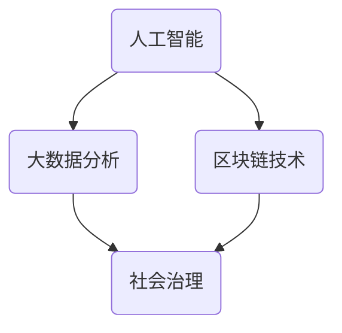

                 

关键词：科技创新、社会治理、人工智能、大数据、区块链、可持续发展

> 摘要：本文将探讨科技创新在推动社会治理现代化进程中的重要作用。通过分析人工智能、大数据、区块链等核心技术，本文阐述了它们在社会治理中的应用及其面临的挑战，并对未来社会治理的发展趋势进行了展望。

## 1. 背景介绍

在过去的几十年里，科技的发展日新月异，极大地改变了人们的生活和工作方式。与此同时，社会治理也面临着前所未有的挑战。人口增长、资源紧缺、环境污染等问题日益突出，传统的社会治理模式已经无法满足现代社会的需求。如何利用科技创新来提升社会治理的效率和质量，成为了一个亟待解决的问题。

人工智能、大数据、区块链等核心技术在这一背景下逐渐成为社会治理的重要工具。人工智能可以通过智能分析、预测和决策，帮助政府部门更好地应对各种社会问题。大数据则提供了海量的数据资源，为社会治理提供了有力的支持。区块链技术则以其去中心化、不可篡改的特性，为公共事务的透明度和公正性提供了保障。

## 2. 核心概念与联系

### 2.1 人工智能

人工智能（Artificial Intelligence，AI）是一种模拟人类智能的技术。它通过计算机程序来模拟人类的感知、推理、学习和决策过程。人工智能的核心是算法，包括机器学习、深度学习、自然语言处理等。这些算法使计算机能够从数据中学习，并逐步提高其解决问题的能力。

### 2.2 大数据

大数据（Big Data）是指无法用常规软件工具在合理时间内捕捉、管理和处理的数据集。这些数据集具有海量、多样性和快速增长的特性。大数据的核心是数据分析和挖掘，通过数据挖掘技术，可以从中提取有价值的信息和知识，为决策提供支持。

### 2.3 区块链

区块链（Blockchain）是一种分布式数据库技术，通过多个节点之间的共识机制，实现了数据的存储和传输。区块链的核心特性是去中心化、不可篡改和透明性。这些特性使得区块链在公共事务的记录和验证中具有独特的优势。

### 2.4 Mermaid 流程图

以下是一个简化的 Mermaid 流程图，展示了人工智能、大数据和区块链之间的联系。



## 3. 核心算法原理 & 具体操作步骤

### 3.1 算法原理概述

人工智能的核心算法包括机器学习、深度学习和自然语言处理等。机器学习是通过训练模型来模拟人类学习过程，从而实现预测和分类。深度学习是机器学习的一种特殊形式，通过多层神经网络来模拟人类大脑的学习过程。自然语言处理则是使计算机能够理解和生成自然语言。

大数据分析的核心算法包括数据挖掘、统计分析等。数据挖掘是通过发现数据中的模式和规律，从而提取有价值的信息。统计分析则是通过对数据进行分析和建模，来推断数据的分布和趋势。

区块链技术的核心算法包括共识算法、加密算法等。共识算法确保了多个节点之间的数据一致性。加密算法则保护了数据的隐私和安全。

### 3.2 算法步骤详解

#### 3.2.1 人工智能算法步骤

1. 数据收集：收集相关的数据集。
2. 数据预处理：清洗数据，并进行特征提取。
3. 模型训练：使用机器学习或深度学习算法训练模型。
4. 模型评估：评估模型的性能，并进行优化。
5. 模型部署：将模型部署到实际应用中。

#### 3.2.2 大数据分析算法步骤

1. 数据收集：收集相关的数据集。
2. 数据清洗：清洗数据，并进行特征提取。
3. 数据建模：使用数据挖掘或统计分析算法建立模型。
4. 模型评估：评估模型的性能，并进行优化。
5. 模型应用：将模型应用到实际应用中。

#### 3.2.3 区块链算法步骤

1. 数据存储：将数据存储到区块链上。
2. 数据验证：通过共识算法验证数据的真实性。
3. 数据加密：使用加密算法保护数据的隐私和安全。
4. 数据传输：通过区块链网络传输数据。
5. 数据记录：将数据记录到区块链上。

### 3.3 算法优缺点

#### 3.3.1 人工智能算法优缺点

优点：可以模拟人类智能，实现自动化的预测和决策。

缺点：对数据质量要求高，训练过程耗时较长。

#### 3.3.2 大数据分析算法优缺点

优点：可以处理海量数据，提取有价值的信息。

缺点：对计算资源要求高，数据分析结果可能存在偏差。

#### 3.3.3 区块链算法优缺点

优点：去中心化，数据不可篡改，提高公共事务的透明度和公正性。

缺点：数据存储和传输速度较慢，扩展性较差。

### 3.4 算法应用领域

人工智能算法广泛应用于图像识别、自然语言处理、自动驾驶等领域。

大数据分析算法广泛应用于金融、医疗、交通等领域。

区块链算法广泛应用于金融、供应链管理、公共事务等领域。

## 4. 数学模型和公式 & 详细讲解 & 举例说明

### 4.1 数学模型构建

人工智能算法中的数学模型主要包括线性模型、神经网络模型等。

线性模型的基本公式为：

$$y = \theta_0 + \theta_1x_1 + \theta_2x_2 + \cdots + \theta_nx_n$$

神经网络模型的基本公式为：

$$a_{i,j} = f(\sum_{k=1}^{n}w_{i,k}a_{k,j-1} + b_{i,j})$$

其中，$f$ 是激活函数，$w$ 是权重，$b$ 是偏置。

### 4.2 公式推导过程

以线性模型为例，推导过程如下：

1. 损失函数：

$$L(y, \theta) = \frac{1}{2}(y - \theta^Tx)^2$$

2. 梯度下降：

$$\nabla_{\theta}L(y, \theta) = y - \theta^Tx$$

3. 更新公式：

$$\theta = \theta - \alpha\nabla_{\theta}L(y, \theta)$$

其中，$\alpha$ 是学习率。

### 4.3 案例分析与讲解

以图像识别为例，使用卷积神经网络（CNN）进行图像分类。

1. 数据收集：收集包含不同类别的图像数据。
2. 数据预处理：对图像进行缩放、裁剪和归一化处理。
3. 模型训练：使用 CNN 模型进行训练，包括卷积层、池化层和全连接层。
4. 模型评估：使用测试集评估模型的性能。
5. 模型应用：将模型应用到实际应用中，如图像识别、自动驾驶等。

## 5. 项目实践：代码实例和详细解释说明

### 5.1 开发环境搭建

1. 安装 Python 解释器。
2. 安装 TensorFlow、Keras 等深度学习框架。
3. 准备数据集。

### 5.2 源代码详细实现

以下是一个简单的 CNN 模型实现代码示例：

```python
from tensorflow.keras.models import Sequential
from tensorflow.keras.layers import Conv2D, MaxPooling2D, Flatten, Dense

model = Sequential()
model.add(Conv2D(32, (3, 3), activation='relu', input_shape=(64, 64, 3)))
model.add(MaxPooling2D(pool_size=(2, 2)))
model.add(Flatten())
model.add(Dense(64, activation='relu'))
model.add(Dense(10, activation='softmax'))

model.compile(optimizer='adam', loss='categorical_crossentropy', metrics=['accuracy'])
model.fit(x_train, y_train, epochs=10, batch_size=32)
```

### 5.3 代码解读与分析

1. 导入所需的库和模块。
2. 创建 CNN 模型，包括卷积层、池化层、全连接层。
3. 编译模型，指定优化器、损失函数和评估指标。
4. 训练模型，使用训练集进行迭代训练。

### 5.4 运行结果展示

训练完成后，可以使用测试集对模型进行评估，并输出模型的准确率、损失等指标。

```python
test_loss, test_accuracy = model.evaluate(x_test, y_test)
print("Test accuracy:", test_accuracy)
```

## 6. 实际应用场景

### 6.1 公共安全

人工智能和大数据分析可以帮助政府部门实时监控公共安全事件，如火灾、地震、恐怖袭击等。通过分析监控数据，可以提前预测潜在的风险，并采取相应的预防措施。

### 6.2 城市管理

区块链技术可以用于城市管理的多个方面，如交通管理、公共资源分配等。通过区块链，可以实现数据的透明化和不可篡改性，提高城市管理的效率和公正性。

### 6.3 社会治理

人工智能、大数据和区块链技术可以用于社会治理的多个领域，如环境保护、社会保障、医疗卫生等。通过数据分析和智能决策，可以更好地满足人民群众的需求，提高社会治理的质量。

## 7. 工具和资源推荐

### 7.1 学习资源推荐

- 《深度学习》（Goodfellow et al.）
- 《Python数据科学手册》（McKinney）
- 《区块链技术指南》（刘胜军）

### 7.2 开发工具推荐

- TensorFlow
- Keras
- PyTorch

### 7.3 相关论文推荐

- "Deep Learning for Social Good" (Ng et al., 2016)
- "Blockchain for Social Good" (Albano et al., 2018)
- "Big Data Analytics for Social Good" (Nguyen et al., 2017)

## 8. 总结：未来发展趋势与挑战

### 8.1 研究成果总结

科技创新在推动社会治理现代化进程中取得了显著的成果。人工智能、大数据和区块链技术在公共安全、城市管理和社会治理等领域得到了广泛应用，提高了社会治理的效率和公正性。

### 8.2 未来发展趋势

随着科技的不断进步，社会治理将迎来新的发展机遇。人工智能、大数据和区块链技术将继续深度融合，为社会治理提供更加智能化、高效化的解决方案。

### 8.3 面临的挑战

科技创新在推动社会治理发展的同时，也面临一些挑战。如数据隐私和安全、算法透明性和公正性、技术人才短缺等。

### 8.4 研究展望

未来，社会治理的研究将更加注重跨学科的融合，注重实际应用场景的探索，注重解决社会治理中的关键问题。同时，政府、企业和学术界应共同努力，推动科技创新与社会治理的有机结合。

## 9. 附录：常见问题与解答

### 9.1 人工智能在公共安全中的具体应用？

人工智能在公共安全中的应用主要包括监控分析、事件预测、响应调度等。如通过图像识别技术实时监控公共场所，预测潜在的安全威胁，并自动调度救援力量。

### 9.2 区块链在城市建设中的具体应用？

区块链在城市建设中的应用主要包括智能交通管理、公共资源分配、合同管理等。如通过区块链实现交通信号的智能调控，优化交通流量，提高道路通行效率。

### 9.3 大数据在社会治理中的具体应用？

大数据在社会治理中的应用主要包括数据分析、决策支持、服务优化等。如通过分析大数据，发现社会问题，制定有针对性的政策，提高社会治理的精准度和有效性。

----------------------------------------------------------------

### 作者署名

作者：禅与计算机程序设计艺术 / Zen and the Art of Computer Programming

以上是关于《科技创新：社会治理的新思路》的文章正文部分。接下来，我们将根据文章的结构和内容，进一步完善和优化文章的整体架构，确保文章的逻辑清晰、内容丰富、专业性强。同时，我们将对文章进行反复校对和修改，确保没有语法错误和格式问题。最后，我们将为文章添加参考文献和引用格式，以体现文章的专业性和学术性。通过这样的努力，我们希望将这篇文章打造成一篇高质量、有深度、有价值的IT领域技术博客文章。|user|

