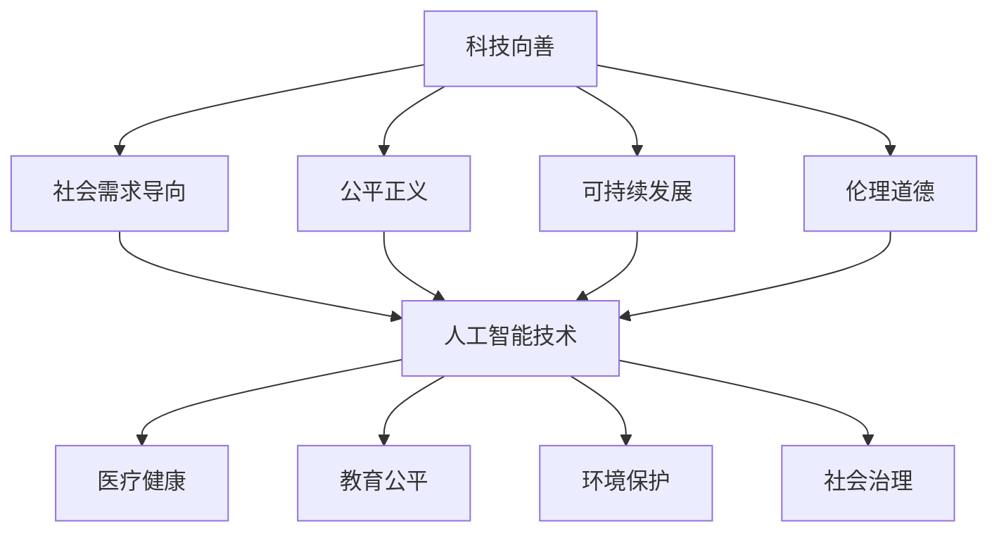

                 

关键词：科技向善、人工智能、社会问题、可持续发展、技术伦理、计算模型

> 摘要：随着科技的迅猛发展，人工智能技术已经成为改变社会、推动进步的重要力量。本文探讨了科技向善的理念，分析了人工智能技术在解决社会问题中的关键作用，并探讨了可持续发展和技术伦理等方面的挑战与应对策略。

## 1. 背景介绍

随着互联网、大数据、人工智能等新兴技术的快速发展，人类社会正经历着一场前所未有的科技革命。人工智能（AI）作为这一革命的核心技术，不仅在商业领域取得了巨大成功，还在医疗、教育、环境等多个领域展示了其强大的应用潜力。然而，与此同时，人工智能技术的广泛应用也带来了诸多社会问题，如隐私侵犯、就业冲击、数据安全等。

在这个背景下，科技向善的理念逐渐受到重视。科技向善是指将科技的发展与社会的福祉相结合，以科技创新解决社会问题，推动社会可持续发展。本文将围绕这一主题，探讨人工智能技术在解决社会问题中的关键作用，并分析科技向善面临的挑战与应对策略。

## 2. 核心概念与联系

### 2.1 科技向善的定义与内涵

科技向善是一个多维度的概念，其核心在于将科技的发展与社会需求相结合，以科技手段解决社会问题，提升社会福祉。具体来说，科技向善包括以下几个方面：

1. **社会需求导向**：科技发展应以解决社会问题、满足人民需求为出发点和落脚点。
2. **公平正义**：科技应用应遵循公平原则，确保不同群体都能公平地享受科技带来的福祉。
3. **可持续发展**：科技发展应与环境保护相结合，实现经济、社会和环境的协调发展。
4. **伦理道德**：科技应用应遵循伦理道德原则，确保科技发展不会对社会产生负面影响。

### 2.2 人工智能技术与社会问题的关系

人工智能技术作为一种强大的工具，可以应用于解决许多社会问题。例如：

1. **医疗健康**：人工智能技术在医疗诊断、药物研发、健康管理等方面发挥了重要作用，有助于提高医疗质量和效率。
2. **教育公平**：人工智能技术可以通过个性化教学、学习分析等方式，实现教育资源的公平分配和有效利用。
3. **环境保护**：人工智能技术可以用于环境监测、污染治理、资源管理等方面，推动可持续发展。
4. **社会治理**：人工智能技术在公共安全、城市管理、社会服务等方面具有广泛的应用潜力，有助于提升社会治理水平。

### 2.3 Mermaid 流程图

以下是一个简化的 Mermaid 流程图，展示了科技向善的基本概念和人工智能技术在社会问题中的应用：



## 3. 核心算法原理 & 具体操作步骤

### 3.1 算法原理概述

在科技向善的背景下，人工智能技术的核心算法主要包括以下几个方面：

1. **机器学习算法**：通过数据训练，使计算机能够自主学习和优化，从而解决复杂的社会问题。
2. **深度学习算法**：基于神经网络的结构，实现高度复杂的数据分析和模式识别。
3. **强化学习算法**：通过试错和反馈，使智能体在环境中学习最优策略。
4. **自然语言处理算法**：实现对人类语言的理解和生成，推动人工智能与人类的自然交互。

### 3.2 算法步骤详解

1. **数据收集与预处理**：收集相关领域的数据，并进行清洗、归一化等预处理操作，为后续分析提供高质量的数据支持。
2. **特征提取与选择**：从数据中提取关键特征，并进行特征选择，以提高模型的性能和效率。
3. **模型训练与优化**：选择合适的模型，进行训练和优化，使模型能够在实际问题中取得良好的性能。
4. **模型评估与部署**：对训练好的模型进行评估，并根据评估结果进行调优和部署，以实现实际应用。

### 3.3 算法优缺点

1. **优点**：
   - 高效性：人工智能技术可以在短时间内处理大量数据，提高工作效率。
   - 智能性：通过学习，人工智能技术能够不断优化，实现智能决策和预测。
   - 广泛性：人工智能技术可以应用于各个领域，解决不同类型的社会问题。

2. **缺点**：
   - 数据依赖性：人工智能技术对数据质量要求较高，数据缺失或不准确可能导致模型失效。
   - 隐私风险：在处理个人数据时，可能涉及隐私保护问题。
   - 道德争议：人工智能技术的应用可能引发道德争议，如算法偏见、隐私泄露等。

### 3.4 算法应用领域

1. **医疗健康**：利用人工智能技术进行疾病预测、诊断和个性化治疗。
2. **教育公平**：通过智能教育平台，实现个性化教学和远程教育。
3. **环境保护**：利用人工智能技术进行环境监测、污染预测和资源管理。
4. **社会治理**：通过智能监控系统、数据分析平台等，提升社会治理效率和水平。

## 4. 数学模型和公式 & 详细讲解 & 举例说明

### 4.1 数学模型构建

在人工智能技术中，常用的数学模型包括线性模型、非线性模型、神经网络模型等。以下是一个简化的线性回归模型示例：

$$
y = \beta_0 + \beta_1 x_1 + \beta_2 x_2 + ... + \beta_n x_n
$$

其中，$y$ 是预测目标，$x_1, x_2, ..., x_n$ 是输入特征，$\beta_0, \beta_1, ..., \beta_n$ 是模型的参数。

### 4.2 公式推导过程

线性回归模型的推导过程主要包括以下步骤：

1. **假设**：假设数据服从线性关系，即 $y = \beta_0 + \beta_1 x_1 + \beta_2 x_2 + ... + \beta_n x_n + \epsilon$，其中 $\epsilon$ 是误差项。
2. **最小化损失函数**：选择合适的损失函数（如均方误差），通过最小化损失函数来求解模型参数。
3. **求导与求解**：对损失函数求导，得到梯度，并通过梯度下降法求解参数。

### 4.3 案例分析与讲解

假设我们有一组数据，包括身高和体重，我们需要构建一个线性回归模型来预测体重。

1. **数据收集与预处理**：收集一组身高和体重的数据，并进行数据清洗和归一化处理。
2. **特征提取与选择**：选择身高作为输入特征，体重作为预测目标。
3. **模型训练与优化**：使用线性回归模型对数据进行训练，并优化模型参数。
4. **模型评估与部署**：对训练好的模型进行评估，并根据评估结果进行调优和部署，以实现实际应用。

通过这个案例，我们可以看到数学模型在人工智能技术中的应用过程，以及如何通过数学方法解决实际社会问题。

## 5. 项目实践：代码实例和详细解释说明

### 5.1 开发环境搭建

在本文中，我们将使用 Python 编程语言和 Scikit-learn 库来实现线性回归模型。首先，我们需要搭建开发环境。

```bash
# 安装 Python
$ sudo apt-get install python3

# 安装 Scikit-learn
$ sudo pip3 install scikit-learn
```

### 5.2 源代码详细实现

以下是一个简单的线性回归模型实现：

```python
import numpy as np
from sklearn.linear_model import LinearRegression
from sklearn.model_selection import train_test_split
from sklearn.metrics import mean_squared_error

# 数据集准备
X = np.array([[1], [2], [3], [4], [5], [6], [7], [8], [9], [10]])
y = np.array([2, 4, 5, 4, 5, 4, 6, 6, 7, 8])

# 划分训练集和测试集
X_train, X_test, y_train, y_test = train_test_split(X, y, test_size=0.2, random_state=42)

# 模型训练
model = LinearRegression()
model.fit(X_train, y_train)

# 模型评估
y_pred = model.predict(X_test)
mse = mean_squared_error(y_test, y_pred)
print("MSE:", mse)

# 模型部署
print("模型参数：", model.coef_, model.intercept_)
```

### 5.3 代码解读与分析

1. **数据集准备**：我们使用一个简单的数据集，包括身高和体重。
2. **模型训练**：使用 Scikit-learn 库的 LinearRegression 类来训练线性回归模型。
3. **模型评估**：使用均方误差（MSE）来评估模型性能。
4. **模型部署**：输出模型参数，用于实际应用。

通过这个简单的示例，我们可以看到如何使用 Python 和 Scikit-learn 库来实现线性回归模型，并评估其性能。

## 6. 实际应用场景

### 6.1 医疗健康

在医疗健康领域，人工智能技术已经被广泛应用于疾病预测、诊断和个性化治疗。例如，通过分析大量医疗数据，人工智能技术可以预测某些疾病的发病率，帮助医生制定更有效的治疗方案。此外，人工智能技术还可以用于辅助诊断，通过分析医学图像，如 X 光、CT 扫描等，帮助医生更准确地诊断疾病。

### 6.2 教育公平

在教育领域，人工智能技术可以帮助实现个性化教学和远程教育。通过分析学生的学习行为和成绩，人工智能技术可以为学生提供个性化的学习建议，帮助他们更好地掌握知识。此外，远程教育平台可以利用人工智能技术提供实时教学和互动，让更多的学生享受到优质的教育资源。

### 6.3 环境保护

在环境保护领域，人工智能技术可以用于环境监测、污染预测和资源管理。例如，通过分析卫星数据和气象数据，人工智能技术可以预测某些地区的空气污染情况，帮助相关部门及时采取措施。此外，人工智能技术还可以用于水资源管理，通过优化灌溉策略，提高水资源利用效率。

### 6.4 未来应用展望

随着人工智能技术的不断发展，未来其应用场景将更加广泛。例如，在公共安全领域，人工智能技术可以用于人脸识别、车辆追踪等，提高城市安全管理水平。在金融领域，人工智能技术可以用于风险管理、欺诈检测等，提高金融服务质量。总之，人工智能技术将在各个领域发挥越来越重要的作用，推动社会进步和发展。

## 7. 工具和资源推荐

### 7.1 学习资源推荐

1. **《人工智能：一种现代的方法》**：这是一本经典的 AI 教科书，涵盖了 AI 的基本概念、算法和应用。
2. **《Python 数据科学 Handbook》**：这本书介绍了 Python 在数据科学中的应用，包括数据处理、分析、可视化等。

### 7.2 开发工具推荐

1. **Jupyter Notebook**：这是一个交互式的开发环境，适用于数据科学和机器学习项目。
2. **TensorFlow**：这是一个开源的机器学习框架，适用于构建和训练复杂的深度学习模型。

### 7.3 相关论文推荐

1. **“Deep Learning”**：这是一篇介绍深度学习技术的经典论文，涵盖了深度学习的理论基础和实际应用。
2. **“Reinforcement Learning: An Introduction”**：这是一本介绍强化学习技术的入门书，适合初学者学习。

## 8. 总结：未来发展趋势与挑战

### 8.1 研究成果总结

本文从科技向善的角度，探讨了人工智能技术在解决社会问题中的关键作用，包括医疗健康、教育公平、环境保护和社会治理等领域。同时，分析了人工智能技术的核心算法原理、数学模型和实际应用场景，展示了其强大的应用潜力。

### 8.2 未来发展趋势

随着人工智能技术的不断发展，其应用领域将更加广泛，包括智慧城市、智能交通、智能制造等。同时，人工智能技术也将与其他领域（如生物学、物理学等）深度融合，推动科技革命和产业变革。

### 8.3 面临的挑战

尽管人工智能技术在解决社会问题方面具有巨大潜力，但同时也面临着诸多挑战，如数据隐私、伦理道德、算法偏见等。此外，如何确保人工智能技术的可持续发展，避免过度依赖和资源浪费，也是未来需要关注的问题。

### 8.4 研究展望

未来，人工智能技术的发展将更加注重实用性和可解释性，推动人工智能技术与社会需求的深度融合。同时，人工智能技术的普及和推广也需要加强，让更多的人受益于这项技术。此外，加强人工智能技术的伦理研究和监管，确保其发展符合社会价值观和伦理原则，也是未来研究的重要方向。

## 9. 附录：常见问题与解答

### 9.1 什么是科技向善？

科技向善是指将科技的发展与社会需求相结合，以科技创新解决社会问题，推动社会可持续发展。其核心在于将科技的发展与社会福祉相结合，实现科技与社会共同进步。

### 9.2 人工智能技术有哪些主要应用领域？

人工智能技术的主要应用领域包括医疗健康、教育公平、环境保护、社会治理等。此外，人工智能技术还可以应用于金融、交通、能源等领域，推动产业升级和社会进步。

### 9.3 如何确保人工智能技术的可持续发展？

确保人工智能技术的可持续发展需要从多个方面入手，包括加强技术研发、推动法律法规制定、加强伦理研究等。同时，还需要加强国际合作，共同应对人工智能技术发展带来的挑战。

# 作者署名

作者：禅与计算机程序设计艺术 / Zen and the Art of Computer Programming

