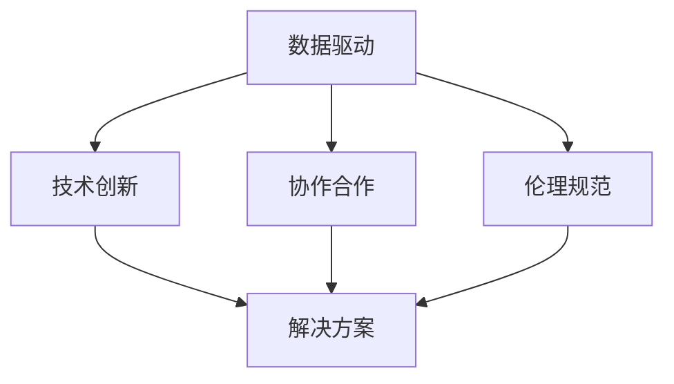

                 

关键词：科技向善，社会问题，解决方案，人工智能，可持续发展，技术伦理，创新应用

> 摘要：本文探讨了科技向善的核心理念，阐述了如何运用科技的力量解决社会难题。通过分析核心概念、算法原理、数学模型、项目实践和未来展望，展示了科技在促进社会进步和解决人类面临挑战中的重要作用。文章还提出了未来发展的趋势和挑战，以及相关工具和资源的推荐。

## 1. 背景介绍

在当今世界，科技发展迅猛，信息技术、人工智能、大数据等领域的突破性进展，正在深刻改变我们的生活方式和社会结构。然而，科技的进步并不总是伴随着正面效应，有时也会带来一系列社会问题，如隐私泄露、就业危机、数字鸿沟等。因此，科技向善成为一种重要的发展理念，呼吁科技从业者不仅仅关注技术本身的创新，更应关注科技如何促进社会福祉。

科技向善的理念，强调将科技应用于解决社会问题，推动可持续发展，并遵循伦理道德原则。这种理念要求我们在追求技术突破的同时，也要关注技术的社会影响，努力使科技发展惠及更多的人群。

## 2. 核心概念与联系

### 2.1. 科技向善的定义

科技向善（Tech for Good）是指利用技术手段解决社会问题，提升人类福祉的过程。它不仅涉及技术创新，还包括对技术应用的伦理考量和社会责任的承担。

### 2.2. 社会问题的分类

社会问题可以分为三大类：经济问题、社会问题和环境问题。经济问题包括贫困、失业、收入不平等；社会问题涉及教育、医疗、住房、社会公正；环境问题则包括气候变化、污染、资源匮乏。

### 2.3. 科技向善的架构

科技向善的架构包括以下几个关键组成部分：

- **数据驱动**：利用大数据和人工智能分析社会问题，制定科学有效的解决方案。
- **技术创新**：推动前沿技术的研发和应用，为社会问题提供技术支撑。
- **协作合作**：鼓励不同领域、不同背景的专家和利益相关者合作，共同解决复杂的社会问题。
- **伦理规范**：确保技术应用符合伦理标准，保护用户隐私和权利。

### 2.4. Mermaid 流程图



## 3. 核心算法原理 & 具体操作步骤

### 3.1. 算法原理概述

科技向善的实施需要一系列核心算法的支持，这些算法通常包括数据挖掘、机器学习、深度学习等技术。以下是一个简要概述：

- **数据挖掘**：通过分析大量数据，发现潜在的模式和趋势，为社会问题提供洞察。
- **机器学习**：利用历史数据训练模型，预测未来趋势，辅助决策。
- **深度学习**：模仿人脑神经网络结构，解决复杂的分类和回归问题。

### 3.2. 算法步骤详解

- **数据收集**：收集与问题相关的数据，包括结构化和非结构化数据。
- **数据预处理**：清洗、整合和标准化数据，为建模做准备。
- **模型训练**：选择合适的算法，训练模型。
- **模型评估**：评估模型性能，调整参数。
- **模型部署**：将模型应用于实际问题，提供决策支持。

### 3.3. 算法优缺点

- **数据挖掘**：优点在于可以处理大规模数据，发现潜在规律；缺点是对数据质量和数量有较高要求。
- **机器学习**：优点是自动化，可以处理复杂问题；缺点是需要大量数据，训练过程可能较慢。
- **深度学习**：优点是强大的特征提取能力，可以处理高维数据；缺点是计算资源需求高，模型复杂度难以解释。

### 3.4. 算法应用领域

算法在科技向善中的应用非常广泛，包括但不限于以下几个方面：

- **健康医疗**：通过数据分析预测疾病趋势，提高医疗效率。
- **环境保护**：监测环境变化，预测污染风险，制定环境保护政策。
- **社会管理**：分析社会问题，制定干预措施，提高社会公正性。

## 4. 数学模型和公式 & 详细讲解 & 举例说明

### 4.1. 数学模型构建

数学模型是科技向善的重要工具，可以量化社会问题，提供决策支持。以下是一个简单的线性回归模型示例：

$$
y = \beta_0 + \beta_1x_1 + \beta_2x_2 + ... + \beta_nx_n + \epsilon
$$

其中，$y$ 是目标变量，$x_1, x_2, ..., x_n$ 是特征变量，$\beta_0, \beta_1, ..., \beta_n$ 是模型参数，$\epsilon$ 是误差项。

### 4.2. 公式推导过程

线性回归模型的推导过程基于最小二乘法，目标是找到一组参数，使得预测值与实际值之间的误差平方和最小。具体推导过程如下：

$$
\min \sum_{i=1}^{n}(y_i - \beta_0 - \beta_1x_{i1} - \beta_2x_{i2} - ... - \beta_nx_{in})^2
$$

通过对每个参数求偏导数，并令其等于零，可以得到模型的参数估计值。

### 4.3. 案例分析与讲解

以下是一个健康医疗领域的案例，通过线性回归模型预测疾病趋势：

- **数据集**：某地区的健康数据，包括人口数量、医疗资源、疾病发生情况等。
- **模型**：线性回归模型。
- **结果**：预测未来几年的疾病发生趋势。

通过模型预测，可以提前准备医疗资源，制定公共卫生政策，提高医疗服务的效率。

## 5. 项目实践：代码实例和详细解释说明

### 5.1. 开发环境搭建

- **工具**：Python、Jupyter Notebook、NumPy、Pandas、Scikit-learn、Matplotlib。
- **环境**：Python 3.8、Jupyter Notebook 7.0。

### 5.2. 源代码详细实现

以下是一个简单的线性回归模型实现的代码实例：

```python
import numpy as np
import pandas as pd
from sklearn.linear_model import LinearRegression
import matplotlib.pyplot as plt

# 数据加载
data = pd.read_csv('health_data.csv')
X = data[['population', 'medical_resources']]
y = data['disease_cases']

# 模型训练
model = LinearRegression()
model.fit(X, y)

# 模型评估
score = model.score(X, y)
print(f'Model R-squared: {score:.2f}')

# 预测
future_population = np.array([[500000, 2000]])
future_disease_cases = model.predict(future_population)
print(f'Predicted disease cases: {future_disease_cases[0][0]:.2f}')

# 可视化
plt.scatter(X['population'], y)
plt.plot(future_population, future_disease_cases, color='red')
plt.xlabel('Population')
plt.ylabel('Disease Cases')
plt.title('Disease Case Prediction')
plt.show()
```

### 5.3. 代码解读与分析

- **数据加载**：从CSV文件中加载数据集。
- **模型训练**：使用Scikit-learn库中的线性回归模型进行训练。
- **模型评估**：计算模型的决定系数（R-squared），评估模型性能。
- **预测**：使用训练好的模型进行预测，并打印结果。
- **可视化**：绘制散点图和预测线，展示模型预测结果。

### 5.4. 运行结果展示

运行代码后，可以看到模型预测的结果，以及散点图和预测线的可视化展示。

## 6. 实际应用场景

科技向善的应用场景非常广泛，以下是一些典型的实际应用场景：

- **健康医疗**：利用大数据和人工智能技术，预测疾病趋势，提高医疗效率。
- **环境保护**：通过物联网和大数据分析，实时监测环境变化，制定环境保护政策。
- **社会管理**：利用数据挖掘和机器学习技术，分析社会问题，提高社会治理水平。
- **教育**：开发智能化教育系统，因材施教，提高教育质量。

## 7. 未来应用展望

随着科技的不断发展，科技向善的应用场景将更加广泛。未来，我们有望看到更多创新的科技解决方案，如：

- **智慧城市**：利用物联网、大数据和人工智能技术，实现城市管理的智能化。
- **无人驾驶**：通过自动驾驶技术，提高交通安全，减少交通事故。
- **智能家居**：开发智能化家居系统，提高生活质量，减少能源消耗。

## 8. 工具和资源推荐

### 8.1. 学习资源推荐

- **书籍**：《Python数据科学 Handbook》、《深度学习》、《大数据之路》。
- **在线课程**：Coursera、edX、Udacity 提供的相关课程。
- **网站**：Kaggle、DataCamp、Machine Learning Mastery。

### 8.2. 开发工具推荐

- **编程语言**：Python、R、Java。
- **库和框架**：NumPy、Pandas、Scikit-learn、TensorFlow、PyTorch。
- **IDE**：Jupyter Notebook、Visual Studio Code。

### 8.3. 相关论文推荐

- **论文集**：《人工智能应用前沿》、《大数据技术综述》、《深度学习论文集》。
- **期刊**：《计算机研究与发展》、《计算机科学》、《人工智能学报》。

## 9. 总结：未来发展趋势与挑战

### 9.1. 研究成果总结

科技向善已经成为科技领域的重要研究方向，众多研究成果展示了科技在解决社会问题中的巨大潜力。然而，科技向善仍面临诸多挑战，如技术伦理、数据隐私、计算资源等。

### 9.2. 未来发展趋势

- **跨学科合作**：鼓励不同领域专家的合作，共同解决复杂的社会问题。
- **技术创新**：推动前沿技术的研究和应用，为社会问题提供更多解决方案。
- **可持续发展**：将科技应用于可持续发展，实现经济、社会和环境的平衡。

### 9.3. 面临的挑战

- **技术伦理**：确保技术应用符合伦理标准，保护用户隐私和权利。
- **数据隐私**：保护用户数据隐私，防止数据泄露。
- **计算资源**：确保计算资源充足，支持大规模数据分析和模型训练。

### 9.4. 研究展望

未来，科技向善研究将更加注重跨学科合作、技术创新和可持续发展。通过不断探索和突破，我们有望为社会问题的解决提供更加有效的科技解决方案。

## 10. 附录：常见问题与解答

### 10.1. 科技向善是什么？

科技向善是一种发展理念，强调将科技应用于解决社会问题，推动可持续发展，并遵循伦理道德原则。

### 10.2. 科技向善有哪些应用领域？

科技向善的应用领域非常广泛，包括健康医疗、环境保护、社会管理、教育等。

### 10.3. 科技向善的挑战有哪些？

科技向善面临的主要挑战包括技术伦理、数据隐私、计算资源等。

### 10.4. 科技向善有哪些发展趋势？

科技向善的发展趋势包括跨学科合作、技术创新和可持续发展。

作者：禅与计算机程序设计艺术 / Zen and the Art of Computer Programming
----------------------------------------------------------------

这篇文章旨在探讨科技向善的核心理念，通过分析核心概念、算法原理、数学模型、项目实践和未来展望，展示了科技在解决社会难题中的重要作用。文章还提出了未来发展的趋势和挑战，以及相关工具和资源的推荐。希望这篇文章能够激发读者对于科技向善的思考，共同推动科技的发展，为社会的进步做出贡献。

