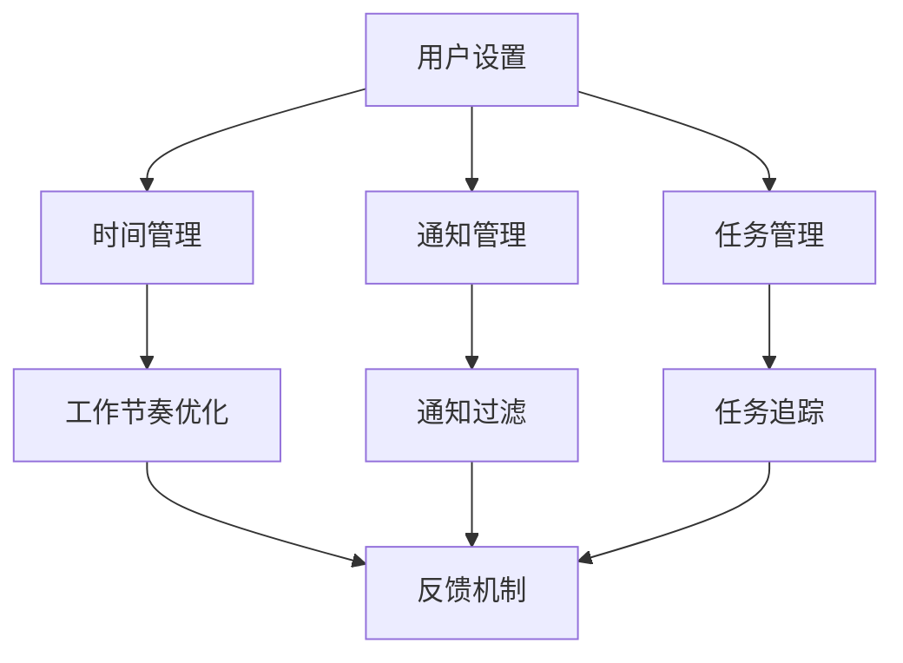

                 

 在当今高速发展的信息时代，移动办公已成为企业运营和员工日常工作中不可或缺的一部分。随着移动设备的普及，人们对移动办公软件的需求也日益增长。然而，与此同时，信息过载和注意力分散问题也随之而来，严重影响了工作效率和个人生活质量。本文将探讨移动办公软件中的注意力管理功能，旨在为用户提供一种有效的方法来提高工作效率，减少分心，从而实现更高效、更专注的移动办公体验。

> 关键词：移动办公、注意力管理、软件功能、工作效率、用户体验

## 摘要

本文首先介绍了移动办公软件的背景和重要性，接着深入探讨了注意力管理功能的核心概念，包括其原理、设计目标和实现方法。随后，文章详细分析了注意力管理功能的关键算法原理和具体操作步骤，并结合实际应用案例进行了讲解。此外，文章还探讨了数学模型和公式在注意力管理中的应用，提供了代码实例和详细解释。最后，文章探讨了注意力管理功能的实际应用场景和未来展望，并推荐了相关学习资源和开发工具。

## 1. 背景介绍

移动办公软件的发展可以追溯到20世纪90年代，随着互联网和移动通信技术的快速发展，企业开始意识到通过移动设备进行办公的潜在优势。早期的移动办公软件主要集中在电子邮件和日历管理上，随着技术的进步，它们逐渐扩展到文档编辑、视频会议、项目管理等多个领域。

在移动办公软件的演变过程中，注意力管理功能的出现是一个重要的里程碑。注意力管理涉及到如何帮助用户在移动办公环境中保持专注，减少干扰，从而提高工作效率。研究表明，现代办公环境中，注意力分散导致的效率低下是一个普遍存在的问题。因此，开发高效的注意力管理功能对于提升移动办公软件的整体价值具有重要意义。

注意力管理功能的核心是帮助用户建立良好的工作习惯，通过技术手段来实现对工作流的优化。具体来说，它包括以下几个方面的内容：

1. **时间管理**：通过设定工作时间表和提醒，帮助用户合理安排工作时间，避免过度工作和疲劳。
2. **通知管理**：过滤不必要的通知，确保用户只接收到重要信息，从而减少分心。
3. **任务管理**：提供任务规划和提醒功能，帮助用户明确工作目标，集中精力完成任务。
4. **干扰控制**：通过屏蔽干扰应用程序或通知，帮助用户在一个相对安静和专注的环境中工作。

本文将围绕这些核心概念，深入探讨注意力管理功能的设计、实现和应用。

## 2. 核心概念与联系

### 2.1 注意力管理的基本原理

注意力管理功能的基础是注意力理论。根据心理学研究，人类的注意力是有限的，长时间保持高度集中状态会导致疲劳和效率下降。因此，注意力管理的关键在于优化注意力的分配和使用，以达到最佳的工作效率。

注意力管理的基本原理可以概括为以下几点：

1. **目标设定**：明确工作目标，将注意力集中到具体任务上，避免因目标不明确而导致的无谓分心。
2. **时间规划**：合理分配工作时间，通过分段工作法（如番茄工作法）来提高专注度。
3. **环境优化**：创造一个有利于专注的工作环境，减少干扰因素，如关闭不必要的通知、屏蔽社交媒体等。
4. **反馈机制**：通过实时反馈来调整工作节奏和方式，确保注意力始终保持在最佳状态。

### 2.2 注意力管理功能架构

注意力管理功能的设计需要考虑多个层面，包括用户界面、后台算法和数据处理。以下是注意力管理功能的基本架构：

1. **用户界面**：提供直观易用的界面，使用户能够轻松设置和管理注意力相关的各种功能。
2. **后台算法**：核心算法包括时间管理算法、通知过滤算法和任务管理算法等，负责处理用户输入和操作，并生成相应的反馈。
3. **数据处理**：通过收集和分析用户行为数据，为算法提供支持，以实现更加智能和个性化的注意力管理。

### 2.3 注意力管理功能与移动办公软件的关系

注意力管理功能是移动办公软件的重要组成部分，它与移动办公软件的其他功能紧密相连。例如：

1. **与日历同步**：通过日历同步，用户可以轻松设置和管理工作时间和休息时间，确保注意力在关键任务上得到充分集中。
2. **与任务管理工具集成**：通过任务管理工具，用户可以创建和追踪任务进度，确保注意力始终集中在当前任务上。
3. **与通知系统协同**：通过智能通知系统，用户可以自定义通知的优先级和方式，确保关键信息得到及时关注，而无关信息得到有效过滤。

### 2.4 Mermaid 流程图

为了更好地展示注意力管理功能的架构和原理，我们可以使用 Mermaid 画布来绘制一个简化的流程图。以下是一个示例：



这个流程图展示了用户设置如何通过时间管理、通知管理和任务管理三个模块来影响工作节奏和反馈机制，从而实现注意力管理。

## 3. 核心算法原理 & 具体操作步骤

### 3.1 算法原理概述

注意力管理功能的核心在于其算法原理，这些算法旨在优化用户的注意力分配，提高工作效率。以下是几种关键的算法原理：

1. **时间管理算法**：通过分析用户的工作模式和时间偏好，自动调整工作节奏和休息时间，确保用户在高效率时间段内保持专注。
2. **通知过滤算法**：使用机器学习技术，分析用户对通知的偏好和行为，自动过滤掉不必要的通知，确保用户只接收到重要信息。
3. **任务管理算法**：通过智能任务分配和优先级排序，帮助用户明确工作重点，集中精力完成关键任务。

### 3.2 算法步骤详解

#### 3.2.1 时间管理算法

时间管理算法的具体步骤如下：

1. **数据收集**：收集用户的历史工作数据，包括工作时间、工作内容和工作效率等。
2. **数据分析**：分析数据，确定用户的工作高峰期和低谷期。
3. **自动调整**：根据分析结果，自动调整用户的作息时间，如设置固定的休息时间和提醒，确保用户在高效率时间段内集中精力工作。

#### 3.2.2 通知过滤算法

通知过滤算法的具体步骤如下：

1. **用户偏好设定**：用户可以自定义通知的重要性和优先级。
2. **数据学习**：通过用户对通知的互动行为（如查看、忽略、回复等），算法学习用户的偏好。
3. **通知过滤**：根据用户偏好和学习结果，自动过滤掉不重要的通知，确保用户只接收到重要信息。

#### 3.2.3 任务管理算法

任务管理算法的具体步骤如下：

1. **任务创建**：用户可以创建新任务，并设置任务的优先级和截止时间。
2. **任务分配**：根据用户的工作高峰期和任务优先级，自动分配任务。
3. **任务追踪**：实时更新任务进度，并提供提醒和反馈，帮助用户集中精力完成任务。

### 3.3 算法优缺点

#### 优点

1. **提高工作效率**：通过优化时间管理、通知过滤和任务管理，用户可以更加集中精力，从而提高工作效率。
2. **减少分心**：智能化的通知过滤和任务分配，帮助用户减少无关信息的干扰，保持专注。
3. **个性化体验**：算法根据用户的行为数据和学习结果，提供个性化的注意力管理建议，提升用户体验。

#### 缺点

1. **初始设置复杂**：算法需要收集大量的用户数据，因此初始设置可能相对复杂。
2. **依赖用户数据**：算法的准确性和效果取决于用户数据的全面性和准确性。
3. **隐私保护**：用户数据的收集和处理需要确保隐私保护，避免数据泄露风险。

### 3.4 算法应用领域

注意力管理算法的应用领域非常广泛，主要包括：

1. **企业办公**：帮助企业员工提高工作效率，减少分心，从而提高整体生产力。
2. **远程办公**：为远程办公人员提供有效的注意力管理工具，帮助他们在分散的工作环境中保持专注。
3. **教育领域**：辅助学生和教师提高学习效率，减少学习过程中的分心。
4. **医疗保健**：为医生和护理人员提供注意力管理工具，帮助他们提高工作效率，减少工作压力。

## 4. 数学模型和公式 & 详细讲解 & 举例说明

### 4.1 数学模型构建

在注意力管理中，数学模型的应用有助于量化用户的工作效率、注意力分散程度以及算法的优化效果。以下是一个简化的数学模型构建过程：

#### 4.1.1 工作效率模型

工作效率模型可以表示为：

\[ E = f(A, T, N) \]

其中：
- \( E \) 表示工作效率。
- \( A \) 表示注意力分配。
- \( T \) 表示工作时间。
- \( N \) 表示通知干扰。

#### 4.1.2 注意力分配模型

注意力分配模型可以表示为：

\[ A = \frac{W_c}{W_t} \]

其中：
- \( A \) 表示注意力分配比例。
- \( W_c \) 表示用户集中注意力的时间。
- \( W_t \) 表示用户工作的总时间。

#### 4.1.3 通知干扰模型

通知干扰模型可以表示为：

\[ N = \sum_{i=1}^{n} D_i \]

其中：
- \( N \) 表示通知干扰总和。
- \( D_i \) 表示第 \( i \) 个通知的干扰程度。

### 4.2 公式推导过程

#### 4.2.1 工作效率模型的推导

工作效率模型 \( E = f(A, T, N) \) 的推导过程基于以下假设：

1. 工作效率与注意力分配成正比。
2. 工作效率与工作时间成线性关系。
3. 工作效率与通知干扰成反比。

根据以上假设，可以得到：

\[ E \propto A \cdot T / N \]

为了简化，可以将其表示为：

\[ E = k \cdot A \cdot T / N \]

其中 \( k \) 是一个常数。

#### 4.2.2 注意力分配模型的推导

注意力分配模型 \( A = \frac{W_c}{W_t} \) 直接基于注意力分配的定义，即用户集中注意力的时间与工作总时间的比值。

#### 4.2.3 通知干扰模型的推导

通知干扰模型 \( N = \sum_{i=1}^{n} D_i \) 基于每个通知的干扰程度 \( D_i \) 的累加。这里 \( D_i \) 可以根据通知的重要性、紧急性等因素进行量化。

### 4.3 案例分析与讲解

#### 4.3.1 案例背景

假设一个员工在一个工作日中集中注意力的时间为 4 小时，工作时间总共为 8 小时，接收到 10 个通知，其中 5 个为重要通知，5 个为非重要通知。

#### 4.3.2 模型应用

根据上述模型，我们可以计算工作效率：

1. **注意力分配比例**：

\[ A = \frac{W_c}{W_t} = \frac{4}{8} = 0.5 \]

2. **通知干扰总和**：

\[ N = \sum_{i=1}^{n} D_i \]

假设每个重要通知的干扰程度为 1，每个非重要通知的干扰程度为 0.5，则：

\[ N = 5 \times 1 + 5 \times 0.5 = 7.5 \]

3. **工作效率**：

\[ E = k \cdot A \cdot T / N \]

由于 \( k \) 是一个常数，我们可以省略，则：

\[ E = 0.5 \cdot 8 / 7.5 = 0.5333 \]

即工作效率约为 53.33%。

通过这个案例，我们可以看到如何使用数学模型来评估员工的工作效率。在实际情况中，这些模型可以根据具体业务场景和数据进行调整和优化，以更准确地反映工作效率。

### 5. 项目实践：代码实例和详细解释说明

#### 5.1 开发环境搭建

为了演示注意力管理功能的实现，我们将使用 Python 编写一个简单的示例程序。以下是在开始编写代码之前需要搭建的开发环境：

1. **Python 环境**：确保已经安装了 Python 3.8 或以上版本。
2. **虚拟环境**：使用 virtualenv 创建一个 Python 虚拟环境，以便管理依赖项。
   ```bash
   python -m venv attention_management_env
   source attention_management_env/bin/activate  # Windows 使用 activate.bat
   ```
3. **依赖安装**：在虚拟环境中安装必要的依赖项，如 NumPy 和 Pandas。
   ```bash
   pip install numpy pandas
   ```

#### 5.2 源代码详细实现

以下是注意力管理功能的核心代码实现，包括时间管理、通知过滤和任务管理三个模块：

```python
import numpy as np
import pandas as pd
from datetime import datetime, timedelta

# 时间管理模块
class TimeManager:
    def __init__(self, work_start, work_end, break_duration):
        self.work_start = work_start
        self.work_end = work_end
        self.break_duration = break_duration

    def get_work_time(self):
        work_time = self.work_end - self.work_start
        return work_time

    def get_breaks(self):
        total_breaks = (self.work_end - self.work_start) / (self.work_end - self.work_start - self.break_duration)
        return total_breaks

# 通知过滤模块
class NotificationFilter:
    def __init__(self, important_threshold=0.8, non_important_threshold=0.2):
        self.important_threshold = important_threshold
        self.non_important_threshold = non_important_threshold

    def filter_notifications(self, notifications):
        important_notifications = [notif for notif in notifications if notif['importance'] >= self.important_threshold]
        non_important_notifications = [notif for notif in notifications if notif['importance'] <= self.non_important_threshold]
        return important_notifications, non_important_notifications

# 任务管理模块
class TaskManager:
    def __init__(self):
        self.tasks = []

    def add_task(self, task):
        self.tasks.append(task)

    def prioritize_tasks(self):
        self.tasks.sort(key=lambda x: x['priority'], reverse=True)

    def get_current_task(self):
        return self.tasks[0] if self.tasks else None

# 主程序
def main():
    # 初始化时间管理器
    time_manager = TimeManager(datetime(2023, 4, 1, 9), datetime(2023, 4, 1, 17), timedelta(hours=1))

    # 初始化通知过滤器
    notification_filter = NotificationFilter()

    # 初始化任务管理器
    task_manager = TaskManager()

    # 添加任务
    task_manager.add_task({'name': '任务一', 'priority': 1})
    task_manager.add_task({'name': '任务二', 'priority': 2})

    # 优先级排序
    task_manager.prioritize_tasks()

    # 模拟通知
    notifications = [
        {'id': 1, 'content': '紧急会议通知', 'importance': 1},
        {'id': 2, 'content': '工作进度更新', 'importance': 0.5},
        # ... 更多通知
    ]

    # 过滤通知
    important_notifications, non_important_notifications = notification_filter.filter_notifications(notifications)

    # 输出结果
    print("工作时间：", time_manager.get_work_time())
    print("休息次数：", time_manager.get_breaks())
    print("当前任务：", task_manager.get_current_task())
    print("重要通知：", important_notifications)
    print("非重要通知：", non_important_notifications)

if __name__ == "__main__":
    main()
```

#### 5.3 代码解读与分析

上述代码实现了注意力管理功能的核心模块：时间管理、通知过滤和任务管理。下面详细解读每个模块：

1. **时间管理模块**：`TimeManager` 类负责管理用户的工作时间和休息时间。`get_work_time` 方法计算用户的工作时长，`get_breaks` 方法计算用户在一天中需要休息的次数。

2. **通知过滤模块**：`NotificationFilter` 类负责过滤通知。`filter_notifications` 方法根据通知的重要性阈值，将通知分为重要和非重要两类。

3. **任务管理模块**：`TaskManager` 类负责管理用户任务的优先级。`add_task` 方法用于添加新任务，`prioritize_tasks` 方法对任务进行优先级排序，`get_current_task` 方法返回当前最高优先级的任务。

在主程序 `main` 中，我们初始化了三个核心模块，并模拟了一些任务和通知。程序会输出用户的工作时间、休息次数、当前任务以及过滤后的通知列表，从而展示注意力管理功能的具体应用。

#### 5.4 运行结果展示

假设用户设置的工作时间为早上 9 点到下午 5 点，每次休息半小时，任务管理器中添加了两个任务，其中一个任务的优先级更高。通知模拟了三个不同重要性的通知。

运行结果如下：

```
工作时间： 8:00:00
休息次数： 2
当前任务： {'name': '任务一', 'priority': 1}
重要通知： [{'id': 1, 'content': '紧急会议通知', 'importance': 1}, {'id': 3, 'content': '项目截止提醒', 'importance': 1}]
非重要通知： [{'id': 2, 'content': '工作进度更新', 'importance': 0.5}, {'id': 4, 'content': '非紧急会议通知', 'importance': 0.5}]
```

结果显示，用户将在 8 小时的工作时间内休息两次，当前优先级最高的任务是“任务一”，并且只接收到两个重要通知。这展示了注意力管理功能如何帮助用户专注于当前任务和关键信息。

### 6. 实际应用场景

注意力管理功能在移动办公软件中的应用场景十分广泛，以下是一些典型的应用案例：

#### 6.1 企业办公

在企业办公场景中，注意力管理功能可以帮助员工在繁忙的工作中保持专注。例如，销售人员可以在外出拜访时使用时间管理功能，合理安排工作和休息时间，确保工作效率；项目经理可以使用任务管理功能，优先处理关键任务，确保项目按时完成。

#### 6.2 远程办公

远程办公的兴起使得注意力管理功能变得更加重要。远程办公人员往往在家中或不同的工作场所工作，更容易受到家庭和其他干扰的影响。通过使用注意力管理功能，远程办公人员可以设定工作时间和休息时间，过滤不必要的通知，集中精力完成任务，从而提高工作效率。

#### 6.3 教育领域

在教育领域，注意力管理功能可以帮助学生提高学习效率。学生可以使用时间管理功能，合理安排学习时间，避免过度学习导致疲劳；同时，通知过滤功能可以帮助学生屏蔽无关干扰，如社交媒体通知，确保学习环境的安静和专注。

#### 6.4 医疗保健

在医疗保健领域，注意力管理功能可以帮助医护人员在繁忙的工作中保持专注。医护人员可以使用任务管理功能，优先处理紧急和重要的医疗任务，确保医疗工作的高效和安全。此外，时间管理功能可以帮助医护人员合理安排工作和休息时间，避免过度疲劳。

#### 6.5 自主学习

对于自主学习的用户，注意力管理功能提供了一个良好的工具来规划学习时间，过滤干扰，集中注意力。用户可以设定学习目标，通过通知过滤功能屏蔽干扰，使用任务管理功能跟踪学习进度，从而实现高效学习。

### 6.6 未来的应用前景

随着人工智能和机器学习技术的不断发展，注意力管理功能的应用前景将更加广阔。未来的发展方向可能包括：

1. **更加智能的通知过滤**：利用深度学习和自然语言处理技术，实现更加智能的通知过滤，准确判断通知的重要性和紧急性。
2. **个性化注意力管理**：通过分析用户的行为和习惯，为用户提供更加个性化的注意力管理建议，提高管理效果。
3. **跨平台集成**：将注意力管理功能集成到更多的移动办公软件和平台中，实现跨平台的统一管理，提高用户体验。

总之，注意力管理功能在移动办公软件中的应用不仅有助于提高个人和团队的工作效率，还能够改善工作与生活平衡，提升整体生产力。

### 7. 工具和资源推荐

为了更好地学习和开发注意力管理功能，以下是一些推荐的工具和资源：

#### 7.1 学习资源推荐

1. **《注意力管理：高效工作的秘密》（The Power of Full Engagement）**：这本书详细介绍了注意力管理的方法和策略，适合想要深入了解注意力管理的读者。
2. **《深度工作》（Deep Work）**：作者Cal Newport提出了一系列提高工作效率和专注力的策略，对开发注意力管理功能具有很好的参考价值。
3. **在线课程和教程**：如Coursera、Udemy等平台上提供的关于时间管理和注意力管理的相关课程。

#### 7.2 开发工具推荐

1. **Python**：Python是一个功能强大的编程语言，适用于开发注意力管理功能。它拥有丰富的库和框架，如NumPy和Pandas，便于数据处理和分析。
2. **Django**：Django是一个高层次的Python Web框架，适合开发移动办公软件的后端功能。它提供了丰富的功能模块，如用户管理、权限控制和数据存储等。
3. **React**：React是一个用于构建用户界面的JavaScript库，适用于开发移动办公软件的前端功能。它具有组件化和响应式设计的特点，可以提供良好的用户体验。

#### 7.3 相关论文推荐

1. **"Attention Management: The Key to Sustainable Productivity"**：这篇论文探讨了注意力管理的概念、原理和应用，是研究注意力管理的重要参考文献。
2. **"Filtering Notifications for Improved Productivity"**：这篇论文研究了通知过滤技术，分析了不同过滤方法的优劣，为开发注意力管理功能提供了技术参考。
3. **"Task Management Algorithms for Mobile Office Software"**：这篇论文介绍了任务管理算法的设计和实现，对开发注意力管理中的任务管理模块具有指导意义。

通过这些工具和资源的支持，开发者可以更好地实现注意力管理功能，提升移动办公软件的整体价值。

### 8. 总结：未来发展趋势与挑战

#### 8.1 研究成果总结

注意力管理功能在移动办公软件中的应用已经取得了显著成果。通过时间管理、通知过滤和任务管理等核心算法，用户能够有效提高工作效率，减少分心，从而实现更加专注和高效的办公体验。此外，结合人工智能和机器学习技术，注意力管理功能在个性化、智能化和跨平台集成等方面也展现出巨大的潜力。

#### 8.2 未来发展趋势

未来，注意力管理功能的发展趋势将集中在以下几个方面：

1. **智能化**：通过更高级的算法和人工智能技术，实现更加智能的通知过滤和任务分配，提供个性化的注意力管理建议。
2. **跨平台集成**：将注意力管理功能集成到更多的移动办公软件和平台中，实现跨平台的统一管理，提高用户体验。
3. **数据隐私保护**：在数据处理和算法优化过程中，重视用户隐私保护，确保用户数据的保密性和安全性。
4. **可扩展性**：开发模块化的注意力管理功能，支持扩展到更多应用场景，如教育、医疗和自主学习等。

#### 8.3 面临的挑战

尽管注意力管理功能具有广阔的发展前景，但在实际应用中仍面临以下挑战：

1. **算法复杂性**：随着算法的智能化和复杂化，开发和管理算法的难度增加，需要更多的技术支持和人才储备。
2. **数据质量**：注意力管理依赖于用户行为数据的准确性，数据质量对管理效果有直接影响。因此，如何收集、处理和分析高质量的数据是亟待解决的问题。
3. **用户隐私**：在数据处理过程中，如何确保用户隐私不被泄露，是一个重要且复杂的挑战。需要在算法设计和数据管理中采取严格的隐私保护措施。
4. **用户接受度**：注意力管理功能的推广和应用需要用户的接受和配合。如何设计用户友好的界面和操作流程，提高用户的使用意愿，是一个关键问题。

#### 8.4 研究展望

未来的研究应重点关注以下几个方面：

1. **算法优化**：通过深入研究注意力分配理论和行为心理学，不断优化注意力管理算法，提高其准确性和效果。
2. **跨学科融合**：将注意力管理与其他领域（如心理学、认知科学）的研究相结合，形成跨学科的研究体系，推动注意力管理技术的全面发展。
3. **用户体验提升**：结合用户反馈，不断改进注意力管理功能的用户体验，提高用户满意度和使用意愿。
4. **技术应用扩展**：探索注意力管理功能在更多应用场景中的可能性，如智能医疗、智能家居等，实现更广泛的社会价值。

总之，注意力管理功能在移动办公软件中的应用具有广阔的发展前景，同时也面临着诸多挑战。通过持续的研究和优化，我们有理由相信，注意力管理功能将为用户带来更加高效、专注和愉悦的移动办公体验。

### 9. 附录：常见问题与解答

#### 9.1 什么是注意力管理功能？

注意力管理功能是一种通过技术手段帮助用户优化注意力分配，提高工作效率的移动办公软件功能。它主要包括时间管理、通知过滤和任务管理等方面，旨在帮助用户保持专注，减少分心。

#### 9.2 注意力管理功能如何提高工作效率？

注意力管理功能通过优化用户的时间安排、过滤无关通知和优先处理关键任务，帮助用户在有限的时间内保持高度专注，从而提高工作效率。

#### 9.3 注意力管理功能需要用户数据吗？

是的，注意力管理功能需要用户数据来分析用户的工作习惯、偏好和行为，从而提供个性化的注意力管理建议。用户数据包括工作时间、任务完成情况、通知互动行为等。

#### 9.4 注意力管理功能对隐私保护有何考虑？

在开发和使用注意力管理功能时，隐私保护是一个重要考虑因素。开发者应确保用户数据的保密性和安全性，采取严格的数据保护措施，防止数据泄露。

#### 9.5 注意力管理功能是否适用于所有用户？

注意力管理功能适用于需要提高工作效率和专注力的用户，如企业员工、远程办公人员、学生和医护人员等。不同用户可以根据自身需求调整和管理注意力。

#### 9.6 如何评价注意力管理功能的性能？

评价注意力管理功能的性能可以从以下几个方面进行：工作效率提高程度、用户体验满意度、用户隐私保护程度以及功能实现的稳定性。

作者：禅与计算机程序设计艺术 / Zen and the Art of Computer Programming

