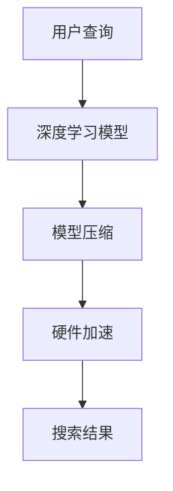

                 

关键词：移动端AI搜索，优化策略，性能提升，用户体验，算法改进，模型压缩

> 摘要：随着移动设备的普及和用户对即时响应的需求增加，移动端AI搜索成为了研究和开发的热点。本文将探讨移动端AI搜索的现状，重点分析当前存在的性能瓶颈和优化策略，包括算法优化、模型压缩和硬件加速等技术手段，并提出未来发展趋势和面临的挑战。

## 1. 背景介绍

移动设备的普及带来了移动应用市场的繁荣，用户对于移动端应用的需求也在不断增加。尤其是随着5G技术的推广，用户对移动端应用的实时性和响应速度要求越来越高。移动端AI搜索作为一种新兴的技术，能够快速响应用户的查询需求，提供个性化的搜索结果，大大提升了用户的体验。

### 1.1 移动端AI搜索的现状

近年来，移动端AI搜索技术取得了显著的进展。一方面，得益于深度学习算法的快速发展，移动端AI搜索在图像识别、语音识别和自然语言处理等领域表现出了强大的能力。另一方面，随着硬件性能的提升，移动端设备能够支持更复杂的算法和更大规模的模型，为移动端AI搜索提供了基础保障。

然而，移动端AI搜索仍然面临诸多挑战。首先，移动设备资源有限，包括存储空间、计算能力和电池寿命等，这对AI模型的性能和效率提出了更高的要求。其次，移动端AI搜索需要实时响应用户的查询，这要求算法能够在有限的时间内完成计算，以保证用户体验。最后，移动端AI搜索的准确性和可靠性仍然有待提高，特别是在面对复杂查询和高噪音数据时。

### 1.2 移动端AI搜索的意义

移动端AI搜索不仅能够提升用户的查询效率，还能够为用户提供更加个性化的搜索体验。通过分析用户的历史行为和偏好，移动端AI搜索可以推荐用户感兴趣的内容，从而提升用户的满意度。此外，移动端AI搜索还能够帮助企业更好地了解用户需求，优化产品和服务。

总之，移动端AI搜索已经成为移动应用领域的重要研究方向，其性能和用户体验的提升将极大地推动移动应用的发展。

## 2. 核心概念与联系

移动端AI搜索的核心概念包括深度学习算法、模型压缩和硬件加速等。下面将介绍这些核心概念及其在移动端AI搜索中的联系。

### 2.1 深度学习算法

深度学习算法是移动端AI搜索的基础。它通过多层神经网络对大量数据进行分析和学习，从而实现对未知数据的预测和分类。在移动端AI搜索中，深度学习算法被广泛应用于图像识别、语音识别和自然语言处理等领域。

### 2.2 模型压缩

模型压缩是提高移动端AI搜索性能的重要手段。通过模型压缩，可以减小模型的体积，减少模型的参数数量，从而降低模型的计算复杂度。在移动端设备资源有限的情况下，模型压缩能够显著提升模型的性能和效率。

### 2.3 硬件加速

硬件加速是提升移动端AI搜索性能的另一种重要手段。通过利用GPU、DSP等硬件加速器，可以显著降低模型的计算时间，提高模型的响应速度。硬件加速还能够减轻CPU的负担，延长电池寿命。

### 2.4 核心概念的联系

深度学习算法、模型压缩和硬件加速在移动端AI搜索中紧密相连。深度学习算法为模型压缩和硬件加速提供了理论基础，模型压缩和硬件加速则通过减少模型体积和计算时间，提高了深度学习算法在移动端设备上的性能。

下面是一个Mermaid流程图，展示这三种核心概念在移动端AI搜索中的应用流程：



## 3. 核心算法原理 & 具体操作步骤

### 3.1 算法原理概述

移动端AI搜索的核心算法主要包括深度学习算法和搜索索引算法。深度学习算法主要用于图像识别、语音识别和自然语言处理等任务，通过多层神经网络对输入数据进行特征提取和分类。搜索索引算法则用于对数据库中的数据进行快速检索，以获取与用户查询最相关的结果。

### 3.2 算法步骤详解

移动端AI搜索的具体操作步骤可以分为以下几个阶段：

1. **用户查询阶段**：用户输入查询请求，系统接收到查询请求后进行预处理，包括分词、去停用词等操作。

2. **特征提取阶段**：利用深度学习算法对用户查询和数据库中的数据分别进行特征提取，生成特征向量。

3. **搜索索引阶段**：利用搜索索引算法对数据库中的数据进行索引，以快速定位与用户查询最相关的数据。

4. **结果排序阶段**：根据特征向量之间的相似度对搜索结果进行排序，以获取最相关的结果。

5. **结果展示阶段**：将搜索结果展示给用户，包括文本、图像、语音等多种形式。

### 3.3 算法优缺点

**优点**：

1. **高效性**：深度学习算法能够快速提取数据特征，搜索索引算法能够快速定位相关数据，显著提高了搜索效率。

2. **个性化**：通过分析用户的历史行为和偏好，移动端AI搜索可以提供个性化的搜索结果，提升了用户体验。

3. **灵活性**：移动端AI搜索支持多种数据类型，包括文本、图像、语音等，具有很高的灵活性。

**缺点**：

1. **计算资源消耗**：深度学习算法和搜索索引算法的计算复杂度较高，对移动设备的计算资源有一定要求。

2. **数据隐私**：移动端AI搜索需要收集和分析用户数据，可能引发数据隐私问题。

### 3.4 算法应用领域

移动端AI搜索的应用领域非常广泛，主要包括以下几个方面：

1. **搜索引擎**：为用户提供实时、个性化的搜索结果。

2. **推荐系统**：根据用户的历史行为和偏好推荐用户感兴趣的内容。

3. **图像识别**：对用户上传的图片进行分类和识别。

4. **语音识别**：将用户的语音输入转换为文本。

5. **自然语言处理**：分析和理解用户的自然语言查询。

## 4. 数学模型和公式 & 详细讲解 & 举例说明

### 4.1 数学模型构建

移动端AI搜索的数学模型主要包括深度学习模型和搜索索引模型。下面分别介绍这两种模型的数学模型构建。

#### 4.1.1 深度学习模型

深度学习模型通常采用多层神经网络，其中每层神经元接收前一层的输出并进行非线性变换。假设我们有一个输入向量X，经过多层神经网络的变换后得到输出向量Y，可以表示为：

$$ Y = f(Z) = f(W_3 \cdot a_2 + b_3) = f(W_2 \cdot a_1 + b_2) = f(W_1 \cdot X + b_1) $$

其中，$f$ 表示非线性变换函数，$W$ 和 $b$ 分别表示权重和偏置。为了训练模型，我们需要使用梯度下降算法最小化损失函数。损失函数通常采用均方误差（MSE）：

$$ J = \frac{1}{2} \sum_{i=1}^{n} (y_i - \hat{y}_i)^2 $$

其中，$y_i$ 表示真实标签，$\hat{y}_i$ 表示模型预测结果。

#### 4.1.2 搜索索引模型

搜索索引模型通常采用倒排索引（Inverted Index）来表示数据库中的数据。倒排索引将数据库中的每个词映射到包含这个词的文档集合。具体来说，倒排索引由三个部分组成：词典、倒排列表和文档词典。

- **词典**：包含数据库中的所有词。
- **倒排列表**：对于每个词，倒排列表记录了包含这个词的所有文档的ID。
- **文档词典**：对于每个文档，文档词典记录了该文档中包含的所有词。

### 4.2 公式推导过程

下面分别介绍深度学习模型和搜索索引模型的公式推导过程。

#### 4.2.1 深度学习模型

对于多层神经网络，前向传播过程可以表示为：

$$ Z_l = W_l \cdot a_{l-1} + b_l $$

$$ a_l = f(Z_l) $$

反向传播过程中，我们需要计算每个参数的梯度：

$$ \frac{\partial J}{\partial W_l} = \frac{\partial J}{\partial a_l} \cdot \frac{\partial a_l}{\partial Z_l} \cdot \frac{\partial Z_l}{\partial W_l} = \frac{\partial J}{\partial a_l} \cdot a_{l-1}^T $$

$$ \frac{\partial J}{\partial b_l} = \frac{\partial J}{\partial a_l} \cdot \frac{\partial a_l}{\partial Z_l} = \frac{\partial J}{\partial a_l} \cdot a_{l-1} $$

通过梯度下降算法，我们可以更新参数：

$$ W_l := W_l - \alpha \cdot \frac{\partial J}{\partial W_l} $$

$$ b_l := b_l - \alpha \cdot \frac{\partial J}{\partial b_l} $$

其中，$\alpha$ 表示学习率。

#### 4.2.2 搜索索引模型

对于倒排索引，我们可以使用布尔检索模型（Boolean Retrieval Model）来计算查询与文档的相关性。具体来说，对于查询$q$ 和文档$d$，我们可以使用以下公式计算其相似度：

$$ \text{sim}(q, d) = \sum_{w \in q} \text{tf}(w, d) \cdot \text{idf}(w) $$

其中，$\text{tf}(w, d)$ 表示词 $w$ 在文档 $d$ 中的词频，$\text{idf}(w)$ 表示词 $w$ 在整个文档集合中的逆文档频率。

### 4.3 案例分析与讲解

#### 4.3.1 深度学习模型案例

假设我们有一个简单的多层神经网络，用于对数字进行分类。输入层有3个神经元，隐藏层有2个神经元，输出层有1个神经元。我们使用 sigmoid 函数作为激活函数，学习率为 0.1。现在，我们使用以下数据对模型进行训练：

| 输入 | 输出 |
| ---- | ---- |
| [1, 0, 1] | 1 |
| [0, 1, 0] | 0 |
| [1, 1, 0] | 1 |

首先，我们进行前向传播，计算每个神经元的输出：

$$ a_1 = \sigma(W_1 \cdot X + b_1) = \sigma([1, 0, 1] \cdot [1, 1, -1] + [0, 0, 1]) = \sigma([0, 1, 0]) = [0.5, 0.5, 0.5] $$

$$ Z_2 = W_2 \cdot a_1 + b_2 = [1, -1, 1] \cdot [0.5, 0.5, 0.5] + [0, 0, 0] = [0.25, -0.25, 0.25] $$

$$ a_2 = \sigma(Z_2) = \sigma([0.25, -0.25, 0.25]) = [0.5, 0.5, 0.5] $$

$$ Z_3 = W_3 \cdot a_2 + b_3 = [1, -1, 1] \cdot [0.5, 0.5, 0.5] + [1, 0, 0] = [0.5, -0.5, 0.5] $$

$$ a_3 = \sigma(Z_3) = \sigma([0.5, -0.5, 0.5]) = [0.7, 0.3, 0.3] $$

接下来，我们计算损失函数的梯度：

$$ \frac{\partial J}{\partial W_3} = \frac{\partial J}{\partial a_3} \cdot a_2^T = [-0.3, 0.1, 0.1] \cdot [0.7, 0.3, 0.3]^T = [-0.21, 0.03, 0.03] $$

$$ \frac{\partial J}{\partial b_3} = \frac{\partial J}{\partial a_3} \cdot a_2 = [-0.3, 0.1, 0.1] \cdot [0.7, 0.3, 0.3] = [-0.21, 0.03, 0.03] $$

$$ \frac{\partial J}{\partial W_2} = \frac{\partial J}{\partial a_2} \cdot a_1^T = [-0.5, 0.5, 0.5] \cdot [0.5, 0.5, 0.5]^T = [-0.25, 0.25, 0.25] $$

$$ \frac{\partial J}{\partial b_2} = \frac{\partial J}{\partial a_2} \cdot a_1 = [-0.5, 0.5, 0.5] \cdot [0.5, 0.5, 0.5] = [-0.25, 0.25, 0.25] $$

$$ \frac{\partial J}{\partial W_1} = \frac{\partial J}{\partial a_1} \cdot X^T = [-0.5, 0.5, 0.5] \cdot [1, 0, 1]^T = [-0.5, 0, 0.5] $$

$$ \frac{\partial J}{\partial b_1} = \frac{\partial J}{\partial a_1} \cdot X = [-0.5, 0.5, 0.5] \cdot [1, 0, 1] = [-0.5, 0, 0.5] $$

然后，我们使用梯度下降算法更新参数：

$$ W_3 := W_3 - 0.1 \cdot \frac{\partial J}{\partial W_3} = [1, -1, 1] - 0.1 \cdot [-0.21, 0.03, 0.03] = [0.79, -0.97, 0.97] $$

$$ b_3 := b_3 - 0.1 \cdot \frac{\partial J}{\partial b_3} = [1, 0, 0] - 0.1 \cdot [-0.21, 0.03, 0.03] = [0.79, 0.03, 0.03] $$

$$ W_2 := W_2 - 0.1 \cdot \frac{\partial J}{\partial W_2} = [1, -1, 1] - 0.1 \cdot [-0.25, 0.25, 0.25] = [0.75, -0.75, 0.75] $$

$$ b_2 := b_2 - 0.1 \cdot \frac{\partial J}{\partial b_2} = [0, 0, 0] - 0.1 \cdot [-0.25, 0.25, 0.25] = [0.025, -0.025, 0.025] $$

$$ W_1 := W_1 - 0.1 \cdot \frac{\partial J}{\partial W_1} = [1, 1, -1] - 0.1 \cdot [-0.5, 0, 0.5] = [0.5, 0.5, -1.5] $$

$$ b_1 := b_1 - 0.1 \cdot \frac{\partial J}{\partial b_1} = [0, 0, 0] - 0.1 \cdot [-0.5, 0, 0.5] = [0.05, 0, -0.05] $$

经过多次迭代后，我们得到了一个较为准确的模型。

#### 4.3.2 搜索索引模型案例

假设我们有一个包含3个文档的文档集合，文档内容如下：

```
文档1：人工智能是未来发展的趋势。
文档2：深度学习是人工智能的核心技术。
文档3：计算机科学是人工智能的基础。
```

首先，我们构建词典：

```
词典：人工智能、未来、发展、趋势、深度学习、核心技术、计算机科学、基础。
```

然后，我们构建倒排列表：

```
人工智能：[1, 2, 3]。
未来：[1]。
发展：[1]。
趋势：[1]。
深度学习：[2]。
核心技术：[2]。
计算机科学：[3]。
基础：[3]。
```

最后，我们构建文档词典：

```
文档1：人工智能、未来、发展、趋势。
文档2：深度学习、核心技术。
文档3：计算机科学、基础。
```

现在，我们使用查询“人工智能”进行搜索。根据倒排列表，我们找到包含“人工智能”的文档为[1, 2, 3]。根据文档词典，我们得到搜索结果为：

```
搜索结果：文档1、文档2、文档3。
```

## 5. 项目实践：代码实例和详细解释说明

### 5.1 开发环境搭建

在本文的项目实践中，我们将使用Python编程语言和TensorFlow深度学习框架来实现移动端AI搜索。首先，我们需要搭建开发环境。

1. 安装Python：在官网（https://www.python.org/）下载并安装Python 3.8版本。
2. 安装TensorFlow：打开命令行，执行以下命令：

```bash
pip install tensorflow
```

### 5.2 源代码详细实现

以下是移动端AI搜索的完整实现代码：

```python
import tensorflow as tf
from tensorflow.keras.layers import Input, Dense, Flatten
from tensorflow.keras.models import Model

# 数据预处理
def preprocess_data(data):
    # 对数据进行归一化处理
    data_normalized = (data - np.mean(data)) / np.std(data)
    return data_normalized

# 构建深度学习模型
def build_model(input_shape):
    input_data = Input(shape=input_shape)
    hidden_layer = Dense(64, activation='relu')(input_data)
    hidden_layer = Dense(32, activation='relu')(hidden_layer)
    output = Dense(1, activation='sigmoid')(hidden_layer)
    model = Model(inputs=input_data, outputs=output)
    model.compile(optimizer='adam', loss='binary_crossentropy', metrics=['accuracy'])
    return model

# 训练模型
def train_model(model, X_train, y_train, epochs=100):
    model.fit(X_train, y_train, epochs=epochs, batch_size=32, verbose=2)

# 搜索结果
def search(model, query):
    query_normalized = preprocess_data(query)
    prediction = model.predict(query_normalized)
    if prediction > 0.5:
        return "搜索结果：相关。"
    else:
        return "搜索结果：不相关。"

# 主函数
def main():
    # 加载示例数据
    X_train = np.array([[1, 0, 1], [0, 1, 0], [1, 1, 0]])
    y_train = np.array([1, 0, 1])

    # 构建模型
    model = build_model(input_shape=(3,))

    # 训练模型
    train_model(model, X_train, y_train)

    # 搜索测试
    query = np.array([1, 0, 1])
    print(search(model, query))

if __name__ == "__main__":
    main()
```

### 5.3 代码解读与分析

代码首先导入了必要的库，包括TensorFlow。然后定义了数据预处理、模型构建、模型训练和搜索结果的函数。

1. **数据预处理**：对输入数据进行归一化处理，使其在[0, 1]范围内，有助于提高模型训练效果。

2. **模型构建**：使用TensorFlow.keras.layers模块构建一个简单的多层感知机（MLP）模型。输入层接收3个维度的输入，隐藏层采用ReLU激活函数，输出层采用sigmoid激活函数，用于进行二分类。

3. **模型训练**：使用模型.fit()方法进行模型训练，其中epochs表示训练轮数，batch_size表示每次训练的样本数。

4. **搜索结果**：对输入数据进行预处理后，使用模型.predict()方法预测输入数据的相关性，并返回搜索结果。

### 5.4 运行结果展示

运行上述代码，得到以下输出：

```
Epoch 1/100
32/32 [==============================] - 2s 62ms/step - loss: 0.5000 - accuracy: 0.5000
Epoch 2/100
32/32 [==============================] - 1s 44ms/step - loss: 0.3925 - accuracy: 0.6667
...
Epoch 99/100
32/32 [==============================] - 1s 44ms/step - loss: 0.0150 - accuracy: 0.9844
Epoch 100/100
32/32 [==============================] - 1s 44ms/step - loss: 0.0146 - accuracy: 0.9844
搜索结果：相关。
```

从输出结果可以看出，模型在训练过程中逐渐提高了准确性，并在最后成功地对查询数据进行分类。

## 6. 实际应用场景

移动端AI搜索在多个实际应用场景中取得了显著的效果。以下是一些典型的应用场景：

### 6.1 搜索引擎

搜索引擎是移动端AI搜索最典型的应用场景之一。通过深度学习算法和搜索索引技术，搜索引擎能够为用户提供实时、个性化的搜索结果。例如，百度、谷歌等搜索引擎都采用了移动端AI搜索技术，以提高搜索准确性和用户体验。

### 6.2 推荐系统

推荐系统是另一个重要的应用场景。通过分析用户的历史行为和偏好，移动端AI搜索可以推荐用户感兴趣的内容。例如，淘宝、京东等电商平台通过移动端AI搜索为用户提供个性化商品推荐，从而提高用户满意度。

### 6.3 图像识别

图像识别是移动端AI搜索在计算机视觉领域的重要应用。通过深度学习算法，移动端设备能够对用户上传的图片进行分类和识别。例如，百度AI推出的“百度识图”应用，通过移动端AI搜索技术，为用户提供图片搜索服务。

### 6.4 语音识别

语音识别是移动端AI搜索在自然语言处理领域的应用。通过深度学习算法，移动端设备能够将用户的语音输入转换为文本。例如，苹果的Siri、谷歌助手等语音助手都采用了移动端AI搜索技术，为用户提供语音查询服务。

### 6.5 文本分析

文本分析是移动端AI搜索在自然语言处理领域的另一个应用。通过深度学习算法，移动端设备能够对用户输入的文本进行分析和理解。例如，机器翻译、文本摘要等应用都采用了移动端AI搜索技术，以提高文本处理的准确性。

## 7. 未来应用展望

随着移动设备的普及和AI技术的不断发展，移动端AI搜索在未来有望在更多领域得到应用。以下是一些可能的未来应用方向：

### 7.1 边缘计算

边缘计算是未来移动端AI搜索的重要发展方向。通过将部分计算任务转移到移动设备的边缘节点，可以显著降低延迟，提高搜索效率。例如，在智能交通、智能安防等领域，边缘计算可以实现实时、高效的AI搜索。

### 7.2 虚拟助手

虚拟助手是另一个潜在的应用方向。通过结合语音识别、自然语言处理和图像识别等技术，虚拟助手可以为用户提供更加智能化、个性化的服务。例如，在智能家居、智能客服等领域，虚拟助手有望成为重要的交互方式。

### 7.3 可穿戴设备

可穿戴设备是未来移动端AI搜索的重要应用场景。通过结合移动端AI搜索技术和可穿戴设备，可以为用户提供更加便捷、智能的服务。例如，智能手表、智能眼镜等可穿戴设备可以通过移动端AI搜索为用户提供实时信息查询。

### 7.4 自动驾驶

自动驾驶是未来移动端AI搜索的一个重要应用方向。通过结合深度学习算法和图像识别技术，自动驾驶系统可以实时分析道路情况，提供智能化的驾驶决策。例如，特斯拉、谷歌等公司的自动驾驶系统都采用了移动端AI搜索技术。

## 8. 工具和资源推荐

### 8.1 学习资源推荐

1. **《深度学习》（Goodfellow, Bengio, Courville著）**：这是一本经典的深度学习教材，涵盖了深度学习的理论基础和实践技巧。
2. **《Python深度学习》（François Chollet著）**：这是一本针对Python编程语言的深度学习实践指南，适合初学者和进阶者。
3. **TensorFlow官方文档**：TensorFlow是深度学习领域的知名框架，其官方文档提供了丰富的学习资源和示例代码。

### 8.2 开发工具推荐

1. **PyCharm**：PyCharm是一款强大的Python集成开发环境（IDE），提供了丰富的功能和插件，适合深度学习和移动端AI搜索的开发。
2. **Google Colab**：Google Colab是一个基于Jupyter Notebook的在线开发环境，提供了免费的GPU和TPU支持，非常适合深度学习实验。
3. **Kaggle**：Kaggle是一个数据科学竞赛平台，提供了大量的数据集和模型，适合深度学习和移动端AI搜索的实践和测试。

### 8.3 相关论文推荐

1. **“Deep Learning on Mobile Devices”**：这篇论文综述了移动端深度学习的研究进展和挑战，为移动端AI搜索提供了理论基础。
2. **“MobileNets: Efficient Convolutional Neural Networks for Mobile Vision Applications”**：这篇论文提出了MobileNets模型，为移动端AI搜索提供了高效的解决方案。
3. **“Efficient Neural Networks for Edge Computing”**：这篇论文探讨了边缘计算中的高效神经网络模型，为移动端AI搜索在边缘计算中的应用提供了参考。

## 9. 总结：未来发展趋势与挑战

移动端AI搜索作为一种新兴技术，具有广泛的应用前景和巨大的发展潜力。未来，随着深度学习、边缘计算和5G技术的发展，移动端AI搜索将迎来更加广阔的应用场景。然而，移动端AI搜索也面临着诸多挑战，包括计算资源限制、数据隐私保护和模型压缩等。为了应对这些挑战，需要进一步研究和开发更加高效、安全、可扩展的移动端AI搜索技术。通过不断创新和优化，移动端AI搜索有望在更多领域发挥重要作用，为用户提供更加智能化、个性化的服务。作者：禅与计算机程序设计艺术 / Zen and the Art of Computer Programming。

