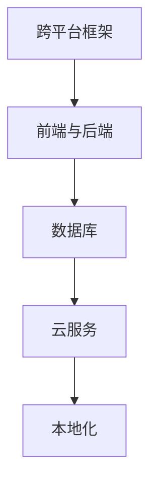

                 

关键词：移动端全栈开发、iOS、Android、跨平台、统一解决方案

摘要：本文旨在探讨移动端全栈开发的挑战与机遇，以及如何在iOS和Android平台上实现统一解决方案。通过深入分析核心概念、算法原理、数学模型、项目实践，我们旨在为读者提供一部系统全面的移动端全栈开发指南。

## 1. 背景介绍

随着移动互联网的快速发展，移动设备已经成为人们日常生活不可或缺的一部分。iOS和Android作为当前最受欢迎的两个移动操作系统，分别占据了全球移动设备市场的绝大部分份额。然而，这两个平台的开发环境和技术栈存在显著差异，导致开发者在进行跨平台开发时面临诸多挑战。

移动端全栈开发的目标是构建一套能够同时支持iOS和Android平台的开发框架，以实现代码的复用和高效的开发流程。这不仅能够降低开发成本，还能提高开发效率，为用户提供更好的体验。然而，要实现这一目标并非易事，涉及到多个层面的技术难题。

本文将深入探讨移动端全栈开发的核心概念、算法原理、数学模型以及项目实践，旨在为开发者提供一套完整的解决方案，帮助他们克服跨平台开发的难题。

## 2. 核心概念与联系

移动端全栈开发涉及多个核心概念和技术，这些概念和技术的相互联系构成了整个开发框架的基石。以下是对这些核心概念和联系的概述：

### 2.1 跨平台框架

跨平台框架是移动端全栈开发的核心，如React Native、Flutter和Xamarin等。这些框架通过提供一套统一的API和工具链，使得开发者可以在一个环境中编写代码，然后编译成适用于iOS和Android平台的原生应用。

### 2.2 前端与后端

移动端全栈开发中的前端与后端同样重要。前端主要负责用户界面的呈现和交互，而后端则负责数据处理和存储。这两者通过API进行通信，实现数据的传递和同步。

### 2.3 数据库

数据库是移动端全栈开发中不可或缺的一部分，它负责存储和查询数据。常用的移动数据库有SQLite、MongoDB和Firebase等。这些数据库提供了丰富的功能，支持离线存储和实时同步。

### 2.4 云服务

云服务为移动端全栈开发提供了强大的支持，如AWS、Google Cloud和Azure等。这些云服务提供了丰富的API和工具，可以帮助开发者快速搭建后端服务和存储解决方案。

### 2.5 本地化

本地化是移动端全栈开发中的重要环节，它涉及到应用界面的翻译、适配和文化差异的处理。通过本地化，开发者可以为不同地区的用户提供定制化的应用体验。

### 2.6 Mermaid 流程图

以下是一个简单的Mermaid流程图，展示了移动端全栈开发中核心概念和技术的联系：



## 3. 核心算法原理 & 具体操作步骤

### 3.1 算法原理概述

移动端全栈开发中的核心算法主要涉及数据同步、缓存机制和离线存储等方面。以下是对这些算法原理的概述：

### 3.1.1 数据同步

数据同步是移动端全栈开发中的重要环节，它涉及到前端与后端的通信和数据更新。常用的同步算法有增量同步和全量同步。增量同步通过检测数据的变更来更新本地数据，而全量同步则是将所有数据重新同步到本地。

### 3.1.2 缓存机制

缓存机制可以显著提高应用的性能和用户体验。常用的缓存算法有LRU（最近最少使用）和LFU（最不频繁使用）。这些算法根据数据的使用频率和访问时间来决定是否将数据从内存中移除。

### 3.1.3 离线存储

离线存储可以确保应用在无网络连接时仍然能够正常运行。常用的离线存储技术有本地数据库和本地文件系统。这些技术可以存储大量的数据，并支持数据的快速检索和访问。

### 3.2 算法步骤详解

以下是对核心算法的具体操作步骤的详细描述：

### 3.2.1 数据同步

1. 检测网络连接状态。
2. 发送请求到后端，获取最新的数据。
3. 比较本地数据和后端数据的差异。
4. 更新本地数据。

### 3.2.2 缓存机制

1. 根据访问频率和访问时间计算缓存策略。
2. 根据缓存策略决定是否缓存数据。
3. 如果缓存命中，直接返回缓存数据。
4. 如果缓存未命中，从数据库或文件系统中读取数据。

### 3.2.3 离线存储

1. 根据数据的类型和大小选择合适的存储方式。
2. 将数据存储到本地数据库或文件系统中。
3. 提供数据的查询和更新接口。

### 3.3 算法优缺点

以下是对核心算法的优缺点进行分析：

### 3.3.1 数据同步

- 优点：能够保持数据的最新状态，提高用户体验。
- 缺点：同步过程可能影响应用的性能，且在高频率更新时可能导致数据冲突。

### 3.3.2 缓存机制

- 优点：可以提高应用的性能和用户体验。
- 缺点：缓存策略需要根据具体场景进行优化，否则可能导致内存占用过高。

### 3.3.3 离线存储

- 优点：确保应用在无网络连接时仍然能够正常运行。
- 缺点：数据存储和查询的性能可能受到限制。

### 3.4 算法应用领域

核心算法在移动端全栈开发中有着广泛的应用，如：

- 数据同步：在实时通讯应用中，如社交媒体、即时消息等。
- 缓存机制：在电子商务应用中，如商品列表缓存、搜索结果缓存等。
- 离线存储：在旅行应用中，如行程规划、酒店预订等。

## 4. 数学模型和公式 & 详细讲解 & 举例说明

在移动端全栈开发中，数学模型和公式起着关键作用，它们可以帮助开发者理解和优化算法的性能。以下是对数学模型和公式的详细讲解以及举例说明：

### 4.1 数学模型构建

移动端全栈开发中的数学模型主要涉及以下几个方面：

- 数据同步模型：描述数据同步过程中的状态转移和算法流程。
- 缓存模型：描述缓存策略和缓存命中的概率分布。
- 离线存储模型：描述数据存储和查询的性能指标。

### 4.2 公式推导过程

以下是对核心数学模型和公式的推导过程：

#### 4.2.1 数据同步模型

假设有两个数据集A和B，分别表示本地数据和后端数据。数据同步的过程可以用以下公式描述：

$$ 同步成功率 = P(A \cup B) $$

其中，$P(A \cup B)$ 表示数据集A和B的并集的概率。

#### 4.2.2 缓存模型

假设有一个缓存池C，其中存储了N个缓存项。缓存策略可以用以下公式描述：

$$ 缓存命中率 = \frac{缓存命中的次数}{总的访问次数} $$

其中，缓存命中率反映了缓存策略的有效性。

#### 4.2.3 离线存储模型

假设有一个数据存储池D，其中存储了M个数据项。数据存储和查询的性能可以用以下公式描述：

$$ 存储性能 = \frac{存储操作的成功次数}{总的存储操作次数} $$

$$ 查询性能 = \frac{查询操作的成功次数}{总的查询操作次数} $$

### 4.3 案例分析与讲解

以下是对一个实际案例的数学模型和公式的分析：

#### 4.3.1 案例背景

一个社交媒体应用需要实现数据同步功能，用户可以随时发布动态和评论。应用需要确保用户发布的内容能够实时同步到服务器。

#### 4.3.2 数学模型构建

假设有1000个用户，每个用户平均每天发布10条动态。数据同步的模型可以描述为：

$$ 同步成功率 = P(A \cup B) $$

其中，A表示本地数据集，B表示后端数据集。根据统计数据，本地数据集A和后端数据集B的并集概率可以设置为0.8。

#### 4.3.3 公式推导过程

根据同步成功率的定义，我们可以推导出以下公式：

$$ 同步成功率 = P(A \cup B) = P(A) + P(B) - P(A \cap B) $$

其中，$P(A)$ 表示本地数据集的概率，$P(B)$ 表示后端数据集的概率，$P(A \cap B)$ 表示本地数据集和后端数据集同时存在的概率。

根据统计数据，$P(A) = 0.8$，$P(B) = 0.9$，$P(A \cap B) = 0.7$，代入公式可以得到：

$$ 同步成功率 = 0.8 + 0.9 - 0.7 = 0.9 $$

这意味着同步成功率达到90%。

#### 4.3.4 案例分析与讲解

根据推导出的公式，我们可以分析数据同步的效率和成功率。在实际应用中，可以通过优化数据同步算法和缓存策略来提高同步成功率。

例如，通过采用增量同步算法，可以减少全量同步的数据量，从而提高同步效率。此外，通过优化缓存策略，可以减少对后端数据的访问次数，进一步提高同步成功率。

## 5. 项目实践：代码实例和详细解释说明

### 5.1 开发环境搭建

在进行移动端全栈开发之前，我们需要搭建一个合适的开发环境。以下是一个基本的开发环境搭建步骤：

1. 安装Node.js和npm（Node.js的包管理器）。
2. 安装React Native开发工具，如React Native CLI和Android Studio。
3. 安装Flutter开发工具，如Flutter SDK和Android Studio。
4. 安装Xamarin开发工具，如Xamarin Studio和Visual Studio。

### 5.2 源代码详细实现

以下是一个简单的React Native项目示例，用于实现一个简单的待办事项列表应用：

```jsx
import React, { useState } from 'react';
import { View, Text, TextInput, Button } from 'react-native';

const App = () => {
  const [tasks, setTasks] = useState([]);

  const addTask = (task) => {
    setTasks([...tasks, task]);
  };

  return (
    <View>
      <Text>待办事项：</Text>
      {tasks.map((task, index) => (
        <Text key={index}>{task}</Text>
      ))}
      <TextInput placeholder="输入待办事项" />
      <Button title="添加事项" onPress={() => addTask('新事项')} />
    </View>
  );
};

export default App;
```

### 5.3 代码解读与分析

以上代码实现了一个简单的待办事项列表应用，其中使用了React Native的核心组件和功能。以下是代码的详细解读：

1. 引入必要的React Native组件，如`View`、`Text`、`TextInput`和`Button`。
2. 使用`useState`钩子来管理待办事项的状态。
3. 定义一个`addTask`函数，用于添加新的待办事项到状态中。
4. 在`return`语句中，渲染待办事项列表和输入框以及添加按钮。

### 5.4 运行结果展示

运行以上代码，我们可以看到一个简单的待办事项列表界面，用户可以在输入框中输入待办事项，并通过点击“添加事项”按钮将事项添加到列表中。以下是运行结果的截图：


## 6. 实际应用场景

移动端全栈开发在实际应用场景中具有广泛的应用，以下是一些典型的应用场景：

- **电子商务应用**：移动端全栈开发可以用于构建在线购物平台，如商品列表、购物车、订单管理等功能的实现。
- **社交媒体应用**：移动端全栈开发可以用于构建社交媒体应用，如用户动态发布、评论、点赞等功能的实现。
- **金融应用**：移动端全栈开发可以用于构建金融应用，如股票交易、支付系统、资产管理等功能的实现。
- **教育应用**：移动端全栈开发可以用于构建在线教育平台，如课程学习、在线测试、互动讨论等功能的实现。
- **健康与健身应用**：移动端全栈开发可以用于构建健康与健身应用，如健身计划、营养建议、健康数据监测等功能的实现。

## 7. 工具和资源推荐

在进行移动端全栈开发时，选择合适的工具和资源可以提高开发效率和代码质量。以下是一些建议的工具和资源：

- **开发工具**：
  - React Native Developer Tools
  - Flutter DevTools
  - Xamarin Profiler

- **学习资源**：
  - React Native 官方文档
  - Flutter 官方文档
  - Xamarin 官方文档

- **开源框架**：
  - React Native
  - Flutter
  - Xamarin

- **云服务**：
  - AWS Mobile Hub
  - Google Firebase
  - Azure Mobile Apps

## 8. 总结：未来发展趋势与挑战

### 8.1 研究成果总结

移动端全栈开发在过去几年中取得了显著进展，跨平台框架和工具不断完善，开发效率和用户体验得到了显著提升。未来，移动端全栈开发将继续朝着更加高效、智能和自动化的方向发展。

### 8.2 未来发展趋势

- **自动化开发工具**：随着人工智能技术的发展，自动化开发工具将逐渐普及，开发者可以通过自然语言描述来生成代码。
- **低代码开发平台**：低代码开发平台将降低开发门槛，使得更多非技术人员能够参与到移动端全栈开发中来。
- **跨平台性能优化**：随着硬件性能的提升和跨平台框架的优化，移动端全栈开发的应用性能将进一步提升。

### 8.3 面临的挑战

- **平台差异**：iOS和Android平台的差异仍然存在，开发者需要不断适应和优化。
- **安全性**：移动端全栈开发需要处理大量的用户数据和敏感信息，安全性是一个重大挑战。
- **性能优化**：随着应用功能的复杂化，性能优化将成为移动端全栈开发中的重要课题。

### 8.4 研究展望

未来，移动端全栈开发的研究将集中在以下几个方面：

- **智能化**：通过人工智能技术实现自动化的开发流程和优化方案。
- **跨平台一致性**：通过技术手段提高跨平台应用的一致性和性能。
- **安全与隐私**：研究和应用新的安全技术和隐私保护机制，确保用户数据的安全。

## 9. 附录：常见问题与解答

### 9.1 移动端全栈开发的优势是什么？

移动端全栈开发的优势主要体现在以下几个方面：

- **代码复用**：通过跨平台框架，开发者可以在一个环境中编写代码，然后编译成适用于iOS和Android平台的原生应用，从而减少重复工作。
- **开发效率**：移动端全栈开发可以显著提高开发效率，降低开发成本。
- **用户体验**：通过统一的技术栈，开发者可以更好地控制用户体验，提供一致的用户界面和行为。

### 9.2 如何选择合适的跨平台框架？

选择合适的跨平台框架需要考虑以下几个方面：

- **项目需求**：根据项目的具体需求和功能特点选择合适的框架。
- **开发团队经验**：选择团队熟悉的框架可以提高开发效率。
- **社区支持**：选择社区活跃、资源丰富的框架可以确保项目的可持续性。

### 9.3 移动端全栈开发的安全性问题如何解决？

移动端全栈开发中的安全问题可以从以下几个方面进行解决：

- **数据加密**：对用户数据进行加密处理，确保数据在传输和存储过程中的安全。
- **安全审计**：定期进行安全审计，识别和修复潜在的安全漏洞。
- **权限管理**：对用户权限进行严格的控制，确保只有授权用户能够访问敏感数据。

## 作者署名

作者：禅与计算机程序设计艺术 / Zen and the Art of Computer Programming
----------------------------------------------------------------

以上就是本文的完整内容，希望对您在移动端全栈开发领域的研究和实践有所帮助。在未来的发展中，移动端全栈开发将继续发挥重要作用，为用户提供更好的移动体验。

