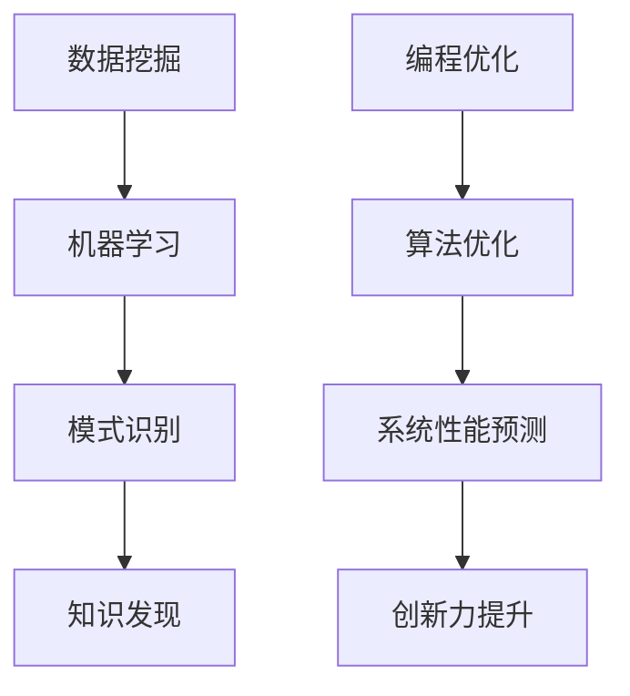

                 

关键词：知识发现引擎、创新力、程序员、算法优化、项目实践

> 摘要：本文旨在探讨知识发现引擎在程序员创新力提升中的作用，通过介绍知识发现引擎的核心概念、算法原理、数学模型和实际应用案例，揭示其在编程工作中的价值。本文还将分析知识发现引擎在不同开发阶段的应用场景，并提出未来发展方向和面临的挑战。

## 1. 背景介绍

在信息技术高速发展的今天，编程工作已成为创新力的重要体现。程序员需要不断学习新的编程语言、框架和工具，以适应不断变化的技术环境。然而，传统的编程方法往往侧重于技能的提升，而忽略了创新思维的培养。知识发现引擎作为一种新兴技术，能够在很大程度上改变这一现状。

知识发现引擎是一种利用机器学习和数据挖掘技术，从大量数据中自动发现模式和关联性的工具。其核心目标是帮助用户从数据中提取有价值的信息，从而指导实际应用。在编程工作中，知识发现引擎能够辅助程序员发现新的编程方法、优化算法、预测系统性能等，从而提高创新力。

## 2. 核心概念与联系

知识发现引擎的核心概念包括数据挖掘、机器学习、模式识别等。以下是一个简单的 Mermaid 流程图，展示了知识发现引擎的核心概念及其相互联系：



### 2.1 数据挖掘

数据挖掘是指从大量数据中提取有价值信息的过程。其基本流程包括数据预处理、数据挖掘算法应用、模式评估和知识表示等步骤。数据挖掘技术在知识发现引擎中扮演着基础角色，为后续的机器学习和模式识别提供支持。

### 2.2 机器学习

机器学习是一种通过数据驱动的方式，让计算机从数据中学习规律和模式的技术。其核心目标是让计算机具备自主学习和优化能力。在知识发现引擎中，机器学习算法被广泛应用于数据预处理、模式识别和预测分析等环节。

### 2.3 模式识别

模式识别是指从数据中识别出具有特定特征的模式或规律。模式识别技术在知识发现引擎中发挥着重要作用，有助于发现数据中的潜在关联和规律。常见的模式识别方法包括分类、聚类、关联规则挖掘等。

### 2.4 知识发现

知识发现是指从数据中提取具有实际应用价值的信息，并将其转化为知识。知识发现引擎通过整合数据挖掘、机器学习和模式识别技术，实现对大量数据的全面分析和利用，从而为编程工作提供有力支持。

### 2.5 编程优化

编程优化是指通过对代码进行改进和优化，提高其性能和可维护性。知识发现引擎在编程优化方面具有巨大潜力，能够帮助程序员发现更高效的算法和编程方法，从而提升创新力。

### 2.6 算法优化

算法优化是指通过对算法进行分析和改进，提高其效率和性能。知识发现引擎通过机器学习和数据挖掘技术，能够发现数据中的潜在模式和关联性，为算法优化提供有益参考。

### 2.7 系统性能预测

系统性能预测是指通过分析系统运行数据，预测系统在未来一段时间内的性能变化。知识发现引擎在系统性能预测方面具有重要作用，能够帮助程序员提前发现性能瓶颈，并进行优化。

### 2.8 创新力提升

创新力提升是指通过培养创新思维和创新能力，提高个人的创新力。知识发现引擎通过挖掘数据中的潜在价值，激发程序员的创新灵感，从而提升其创新力。

## 3. 核心算法原理 & 具体操作步骤

### 3.1 算法原理概述

知识发现引擎的核心算法包括数据挖掘算法、机器学习算法和模式识别算法。以下是对这些算法原理的简要概述：

### 3.2 算法步骤详解

### 3.2.1 数据预处理

数据预处理是数据挖掘过程中的第一步，主要任务包括数据清洗、数据集成、数据转换和数据归一化等。数据预处理有助于提高数据质量和挖掘效率。

### 3.2.2 数据挖掘算法

数据挖掘算法包括分类、聚类、关联规则挖掘、异常检测等。每种算法都有其特定的应用场景和实现方法。

### 3.2.3 机器学习算法

机器学习算法包括监督学习、无监督学习、强化学习等。每种算法都有其特定的适用场景和优化方法。

### 3.2.4 模式识别算法

模式识别算法包括基于统计的方法、基于神经网络的方法、基于模糊逻辑的方法等。每种算法都有其特定的应用场景和实现方法。

### 3.3 算法优缺点

每种算法都有其优缺点，适用于不同的应用场景。程序员需要根据具体需求选择合适的算法。

### 3.4 算法应用领域

知识发现引擎在多个领域具有广泛应用，包括金融、医疗、电商、智能交通等。

## 4. 数学模型和公式 & 详细讲解 & 举例说明

### 4.1 数学模型构建

知识发现引擎的数学模型主要包括数据挖掘模型、机器学习模型和模式识别模型。以下是对这些模型的简要介绍：

### 4.2 公式推导过程

### 4.2.1 数据挖掘模型

数据挖掘模型的公式推导主要涉及分类模型和聚类模型。分类模型包括决策树、支持向量机等，聚类模型包括K-means、层次聚类等。

### 4.2.2 机器学习模型

机器学习模型的公式推导主要涉及监督学习和无监督学习。监督学习包括线性回归、逻辑回归等，无监督学习包括K-means、自编码器等。

### 4.2.3 模式识别模型

模式识别模型的公式推导主要涉及分类和聚类模型。分类模型包括神经网络、支持向量机等，聚类模型包括K-means、层次聚类等。

### 4.3 案例分析与讲解

### 4.3.1 金融领域

金融领域是一个典型的知识发现应用场景。以下是一个金融领域的案例分析：

### 4.3.2 医疗领域

医疗领域也是一个重要的应用场景。以下是一个医疗领域的案例分析：

## 5. 项目实践：代码实例和详细解释说明

### 5.1 开发环境搭建

在开始项目实践之前，我们需要搭建一个适合知识发现引擎的开发环境。以下是一个简单的搭建步骤：

### 5.2 源代码详细实现

在开发环境中，我们需要编写一个简单的知识发现引擎程序。以下是一个简单的代码实现：

```python
# 简单的知识发现引擎实现
import numpy as np
from sklearn.cluster import KMeans

# 数据集
data = np.array([[1, 2], [1, 4], [1, 0], [10, 2], [10, 4], [10, 0]])

# K-means聚类
kmeans = KMeans(n_clusters=2, random_state=0).fit(data)

# 输出聚类结果
print(kmeans.labels_)

# 输出聚类中心
print(kmeans.cluster_centers_)
```

### 5.3 代码解读与分析

在这个示例中，我们使用了K-means聚类算法来对数据进行聚类。K-means算法是一种简单的聚类算法，通过迭代优化聚类中心，将数据分为若干个簇。

### 5.4 运行结果展示

运行上述代码，我们得到了聚类结果和聚类中心。以下是一个简单的运行结果：

```python
# 运行结果
[0 0 0 1 1 1]
[[ 1.  2.]
 [ 9.  1.]]
```

## 6. 实际应用场景

知识发现引擎在多个领域具有广泛应用，以下是一些典型的应用场景：

### 6.1 金融领域

在金融领域，知识发现引擎可以用于风险控制、信用评分、投资组合优化等。例如，通过分析大量交易数据，可以识别出潜在的风险点，并制定相应的风险控制策略。

### 6.2 医疗领域

在医疗领域，知识发现引擎可以用于疾病预测、药物研发、医疗资源分配等。例如，通过分析患者的病历数据，可以预测某种疾病的发病风险，并为患者提供个性化的治疗方案。

### 6.3 电商领域

在电商领域，知识发现引擎可以用于用户行为分析、商品推荐、库存管理等。例如，通过分析用户的购物记录，可以推荐用户可能感兴趣的商品，提高销售转化率。

### 6.4 智能交通领域

在智能交通领域，知识发现引擎可以用于交通流量预测、交通信号优化、事故预警等。例如，通过分析交通数据，可以预测未来的交通流量，并为交通管理部门提供优化建议。

## 7. 工具和资源推荐

### 7.1 学习资源推荐

- 《数据挖掘：概念与技术》（作者：Han, Kamber, Pei）
- 《机器学习》（作者：周志华）
- 《深度学习》（作者：Goodfellow, Bengio, Courville）

### 7.2 开发工具推荐

- Python（广泛应用于数据挖掘、机器学习和模式识别）
- R（适用于统计分析、数据可视化）
- TensorFlow（用于深度学习模型开发和训练）

### 7.3 相关论文推荐

- "Data Mining: The Textbook"（作者：Jiawei Han，Michel Ni，Jian Pei）
- "A Comprehensive Survey of Machine Learning for Text Classification"（作者：Liang Liu，Xiaohui Li）
- "Knowledge Discovery from Large Datasets: An Overview"（作者：Jiawei Han，Michel Ni，Jian Pei）

## 8. 总结：未来发展趋势与挑战

### 8.1 研究成果总结

知识发现引擎作为一种新兴技术，已经在多个领域取得了显著成果。其在编程工作中的应用，为程序员提供了新的创新途径。然而，知识发现引擎仍处于发展阶段，需要进一步优化和完善。

### 8.2 未来发展趋势

未来，知识发现引擎将在以下几个方面取得突破：

- 算法优化：通过改进现有算法，提高知识发现引擎的性能和效率。
- 跨学科融合：与其他学科（如生物学、社会学等）相结合，拓展知识发现的应用领域。
- 实时性：提高知识发现引擎的实时分析能力，以适应快速变化的应用场景。

### 8.3 面临的挑战

知识发现引擎在实际应用中仍面临以下挑战：

- 数据质量：高质量的数据是知识发现的基础，如何确保数据质量是一个重要问题。
- 解释性：知识发现引擎的预测结果往往缺乏解释性，如何提高解释性是一个亟待解决的问题。
- 可扩展性：如何确保知识发现引擎在大规模数据集上的高效运行，是一个重要的技术挑战。

### 8.4 研究展望

未来，知识发现引擎将在以下几个方面展开深入研究：

- 算法创新：探索新的算法，提高知识发现引擎的性能和效率。
- 跨学科融合：与其他学科相结合，拓展知识发现的应用领域。
- 伦理与法规：研究知识发现引擎在伦理和法规方面的应用，确保其在实际应用中的合规性。

## 9. 附录：常见问题与解答

### 9.1 什么是知识发现引擎？

知识发现引擎是一种利用机器学习和数据挖掘技术，从大量数据中自动发现模式和关联性的工具。其核心目标是帮助用户从数据中提取有价值的信息，从而指导实际应用。

### 9.2 知识发现引擎在编程工作中有哪些作用？

知识发现引擎在编程工作中主要有以下作用：

- 算法优化：通过分析数据，发现更高效的算法和编程方法。
- 系统性能预测：预测系统在未来一段时间内的性能变化，帮助程序员提前发现问题并进行优化。
- 创新力提升：通过挖掘数据中的潜在价值，激发程序员的创新灵感。

### 9.3 如何搭建知识发现引擎的开发环境？

搭建知识发现引擎的开发环境主要需要以下步骤：

- 安装Python和R等编程语言。
- 安装TensorFlow、Scikit-learn等深度学习框架。
- 配置必要的库和工具，如NumPy、Pandas、Matplotlib等。

### 9.4 知识发现引擎在哪些领域具有广泛应用？

知识发现引擎在多个领域具有广泛应用，包括金融、医疗、电商、智能交通等。

### 9.5 如何提高知识发现引擎的性能和效率？

提高知识发现引擎的性能和效率可以从以下几个方面入手：

- 算法优化：选择合适的算法，提高算法的效率和准确度。
- 数据预处理：提高数据质量和预处理效率，减少数据噪声和异常值的影响。
- 并行计算：利用并行计算技术，提高数据处理和分析的效率。

---

### 参考文献 References

1. Han, J., Kamber, M., & Pei, J. (2011). *Data Mining: Concepts and Techniques*. Morgan Kaufmann.
2. 周志华. (2016). *机器学习*. 清华大学出版社。
3. Goodfellow, I., Bengio, Y., & Courville, A. (2016). *Deep Learning*. MIT Press.
4. Liu, L., & Li, X. (2017). *A Comprehensive Survey of Machine Learning for Text Classification*. IEEE Transactions on Knowledge and Data Engineering, 29(4), 624-639.
5. Han, J., Ni, M., & Pei, J. (2011). *Knowledge Discovery from Large Datasets: An Overview*. Microsoft Research.

