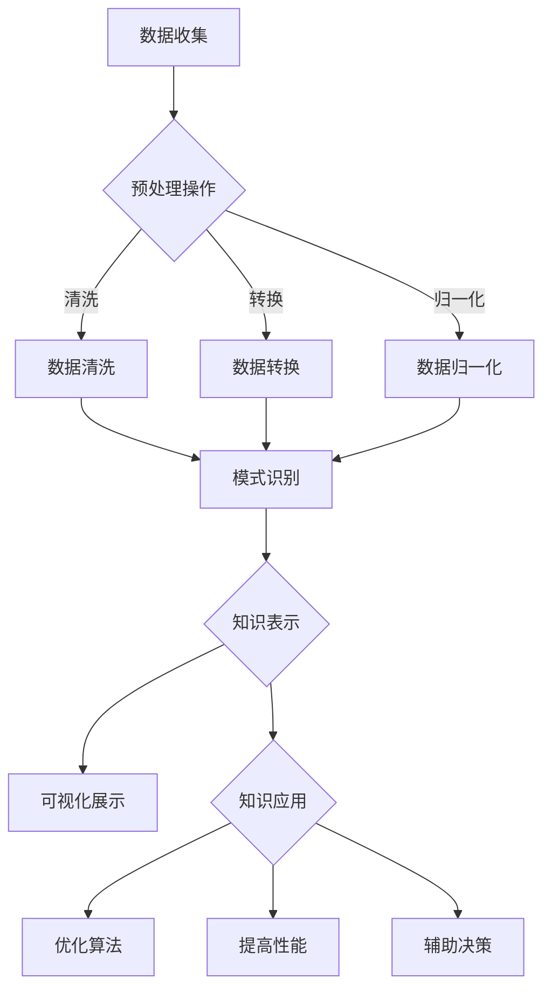

                 

关键词：知识发现引擎、学习成果、程序员、算法、实践、应用场景、未来展望

> 摘要：本文旨在探讨知识发现引擎如何助力程序员提高学习成果。通过详细介绍知识发现引擎的核心概念、算法原理及具体应用，文章将帮助程序员更好地理解这一工具，并指导其在实际学习和工作中有效利用。

## 1. 背景介绍

在信息技术迅猛发展的今天，数据已成为新的“石油”，而如何从海量数据中提取有价值的信息，成为了数据科学和人工智能领域的重要研究方向。知识发现（Knowledge Discovery in Databases，KDD）作为一种从数据中发现有用信息的方法，近年来受到了广泛关注。知识发现引擎作为实现KDD的关键工具，能够自动地、半自动地或交互式地从大量数据中挖掘出模式，从而帮助用户发现潜在的知识。

程序员作为软件开发的核心力量，其学习成果的优劣直接影响到项目的成功与否。因此，如何利用知识发现引擎来提高学习成果，成为了许多程序员关注的话题。本文将围绕这一主题，详细探讨知识发现引擎的核心概念、算法原理以及具体应用，旨在帮助程序员更好地掌握这一工具，提升自身的学习效果。

## 2. 核心概念与联系

### 2.1 知识发现引擎概述

知识发现引擎（Knowledge Discovery Engine）是一种自动化或半自动化的工具，用于从大量数据中提取模式、关联和规则，从而为用户提供有价值的信息。其核心功能包括数据预处理、模式识别、知识表示和知识应用等。知识发现引擎的工作流程通常包括以下步骤：

1. **数据收集与预处理**：从各种数据源收集数据，并对数据进行清洗、转换和归一化等预处理操作。
2. **模式识别**：通过算法和模型从预处理后的数据中识别出潜在的、有意义的模式和规律。
3. **知识表示**：将识别出的模式以可视化的方式呈现给用户，帮助用户更好地理解和利用这些知识。
4. **知识应用**：将知识应用于实际问题，如优化算法、提高系统性能、辅助决策等。

### 2.2 知识发现引擎与程序员学习成果的关系

知识发现引擎在程序员的学习过程中具有重要作用。首先，知识发现引擎能够帮助程序员快速地收集和分析各种学习资源，从而提高学习效率。其次，知识发现引擎能够挖掘出学习资源中的潜在关联和规律，帮助程序员更好地理解复杂概念。此外，知识发现引擎还能为程序员提供个性化的学习建议，根据其学习兴趣和能力推荐合适的学习内容和路径。

### 2.3 Mermaid 流程图



## 3. 核心算法原理 & 具体操作步骤

### 3.1 算法原理概述

知识发现引擎的核心算法主要包括以下几类：

1. **聚类算法**：通过将相似的数据点归为一类，从而发现数据中的自然分组和模式。常见的聚类算法有K-means、层次聚类等。
2. **关联规则算法**：通过挖掘数据中的关联关系，发现不同变量之间的依赖性和相互影响。常见的关联规则算法有Apriori算法、FP-growth算法等。
3. **分类算法**：通过训练模型，将新数据分类到已知的类别中。常见的分类算法有决策树、支持向量机等。
4. **异常检测算法**：通过检测数据中的异常值和异常模式，发现潜在的异常情况。常见的异常检测算法有孤立森林、基于密度的方法等。

### 3.2 算法步骤详解

1. **数据收集与预处理**：收集相关学习资源数据，并进行数据清洗、转换和归一化等预处理操作，以便后续算法处理。
2. **选择合适的算法**：根据学习目标和数据特点，选择合适的算法进行模式识别。
3. **训练模型**：使用预处理后的数据，训练相应的模型，以提取潜在的模式和关联。
4. **模型评估与优化**：评估模型的性能，并进行必要的优化，以提高模型的准确性和泛化能力。
5. **知识表示与应用**：将识别出的模式以可视化的方式呈现给用户，并根据知识应用的需求，调整模型参数和策略。

### 3.3 算法优缺点

#### 3.3.1 聚类算法

- 优点：能够自动地发现数据中的自然分组和模式，无需预先定义类别。
- 缺点：对初始聚类中心的选择敏感，容易陷入局部最优。

#### 3.3.2 关联规则算法

- 优点：能够发现数据中的潜在关联关系，有助于理解变量之间的相互作用。
- 缺点：计算复杂度较高，可能需要大量的时间和计算资源。

#### 3.3.3 分类算法

- 优点：能够对新数据进行准确的分类，有助于预测和决策。
- 缺点：对训练数据的依赖较大，泛化能力有限。

#### 3.3.4 异常检测算法

- 优点：能够有效地发现数据中的异常值和异常模式，有助于预防和处理异常情况。
- 缺点：对异常模式的定义和检测阈值的选择有一定要求，可能存在误报和漏报。

### 3.4 算法应用领域

知识发现引擎在程序员的学习过程中具有广泛的应用领域：

1. **编程学习资源推荐**：通过关联规则算法，挖掘不同编程资源之间的关联，为程序员推荐合适的学习资源。
2. **学习路径规划**：通过聚类算法，分析程序员的学习兴趣和能力，为其规划个性化的学习路径。
3. **算法学习与优化**：通过分类算法和异常检测算法，评估和优化程序员的学习成果，发现潜在的瓶颈和改进点。

## 4. 数学模型和公式 & 详细讲解 & 举例说明

### 4.1 数学模型构建

知识发现引擎的数学模型主要包括聚类模型、关联规则模型、分类模型和异常检测模型等。以下是这些模型的简要介绍：

#### 4.1.1 聚类模型

- **K-means算法**：假设数据集D={x1, x2, ..., xn}，其中每个数据点xi∈R^d，算法的目标是找到一个聚类中心ci，使得每个数据点到其最近聚类中心的距离最小。

  数学公式：
  $$ 
  min \sum_{i=1}^{n} \sum_{j=1}^{k} d(x_i, c_j)^2 
  $$

- **层次聚类算法**：假设数据集D={x1, x2, ..., xn}，算法的目标是将数据点逐步合并成多个层次，形成一棵聚类树。

  数学公式：
  $$
  T = \{C_1, C_2, ..., C_n\}
  $$
  其中，C_i为第i层的数据点集合。

#### 4.1.2 关联规则模型

- **Apriori算法**：假设数据集D={x1, x2, ..., xn}，算法的目标是挖掘出数据中的频繁项集。

  数学公式：
  $$
  supp(X) = \frac{|D \cap X|}{|D|}
  $$

  其中，supp(X)为项集X的支持度，D为数据集。

- **FP-growth算法**：假设数据集D={x1, x2, ..., xn}，算法的目标是挖掘出数据中的频繁模式串。

  数学公式：
  $$
  confidence(X \rightarrow Y) = \frac{support(X \cup Y)}{support(X)}
  $$

  其中，confidence(X → Y)为关联规则的置信度。

#### 4.1.3 分类模型

- **决策树算法**：假设数据集D={x1, x2, ..., xn}，算法的目标是根据特征值构建一棵决策树，将新数据点分类到正确的类别中。

  数学公式：
  $$
  classify(x) = \arg\max_{c} \sum_{i=1}^{n} p(y_i=c | x_i)
  $$

  其中，classify(x)为将数据点x分类到类别c的函数，p(y_i=c | x_i)为条件概率。

- **支持向量机算法**：假设数据集D={x1, x2, ..., xn}，算法的目标是找到一个最优的超平面，将数据点分为两类。

  数学公式：
  $$
  \min_{\omega, b} \frac{1}{2} ||\omega||^2 \\
  s.t. y_i (\omega \cdot x_i + b) \geq 1, \quad i=1,2,...,n
  $$

  其中，\omega为权重向量，b为偏置项，y_i为样本标签，x_i为样本特征。

#### 4.1.4 异常检测模型

- **孤立森林算法**：假设数据集D={x1, x2, ..., xn}，算法的目标是找到一个孤立点。

  数学公式：
  $$
  f(x) = \sum_{i=1}^{n} \log_2(1 + \frac{1}{|C_i|})
  $$

  其中，f(x)为异常得分，|C_i|为x在第i棵树上的分割集合大小。

- **基于密度的方法**：假设数据集D={x1, x2, ..., xn}，算法的目标是找到一个密度阈值，将数据点划分为正常和异常两类。

  数学公式：
  $$
  density(x) = \frac{1}{s} \sum_{i=1}^{n} \exp(-\frac{||x-x_i||^2}{2s^2})
  $$

  其中，density(x)为x的密度，s为参数。

### 4.2 公式推导过程

以下是K-means算法的公式推导过程：

1. **初始化**：随机选择k个聚类中心c1, c2, ..., ck。
2. **迭代过程**：
   a. 对于每个数据点xi，计算其到每个聚类中心的距离，并将其归为距离最近的聚类中心。
   b. 更新聚类中心，取每个聚类中心的均值。
   c. 重复步骤a和b，直到聚类中心不再发生显著变化。

推导过程如下：
假设当前聚类中心为c_j，数据点xi的聚类中心为c_j'，则有：
$$
c_j' = \frac{1}{n_j} \sum_{i=1}^{n} x_i
$$

其中，n_j为属于聚类中心c_j的数据点个数。

迭代更新过程：
$$
c_j = \frac{1}{n_j'} \sum_{i=1}^{n} x_i
$$

其中，n_j'为更新后属于聚类中心c_j的数据点个数。

### 4.3 案例分析与讲解

#### 4.3.1 聚类算法案例分析

假设我们有一个数据集D={x1, x2, ..., xn}，其中每个数据点xi∈R^2，表示为(x_i1, x_i2)。我们需要使用K-means算法将其聚类为两个类别。

1. **数据预处理**：对数据进行标准化处理，使其具有相同的尺度。
2. **初始化**：随机选择两个聚类中心c1和c2。
3. **迭代过程**：
   a. 计算每个数据点到两个聚类中心的距离，并将其归为距离最近的聚类中心。
   b. 更新聚类中心，取每个聚类中心的均值。
   c. 重复步骤a和b，直到聚类中心不再发生显著变化。

具体实现如下（Python代码）：

```python
import numpy as np
import matplotlib.pyplot as plt

def kmeans(data, k, max_iter=100):
    centroids = data[np.random.choice(data.shape[0], k, replace=False)]
    for _ in range(max_iter):
        distances = np.linalg.norm(data - centroids, axis=1)
        labels = np.argmin(distances, axis=1)
        new_centroids = np.array([data[labels == i].mean(axis=0) for i in range(k)])
        if np.linalg.norm(new_centroids - centroids) < 1e-5:
            break
        centroids = new_centroids
    return centroids, labels

data = np.random.rand(100, 2)
centroids, labels = kmeans(data, 2)
plt.scatter(data[:, 0], data[:, 1], c=labels)
plt.scatter(centroids[:, 0], centroids[:, 1], s=200, c='red')
plt.show()
```

#### 4.3.2 关联规则算法案例分析

假设我们有一个超市销售数据集，包含商品A、B、C和D的销售记录。我们需要使用Apriori算法挖掘出频繁项集。

1. **数据预处理**：将销售记录转换为事务集，每个事务表示一次购买行为。
2. **设置最小支持度**：根据数据集大小和业务需求，设置一个合理的最小支持度阈值。
3. **迭代过程**：
   a. 计算每个项集的支持度，筛选出频繁项集。
   b. 对频繁项集进行连接和修剪，得到更高层次的频繁项集。
   c. 重复步骤a和b，直到不再产生新的频繁项集。

具体实现如下（Python代码）：

```python
from mlxtend.frequent_patterns import apriori, association_rules

transactions = [
    ['milk', 'bread'],
    ['bread', 'butter'],
    ['milk', 'orange juice', 'bread'],
    ['orange juice', 'yogurt'],
    ['orange juice', 'bread', 'butter'],
    ['orange juice', 'yogurt'],
    ['orange juice', 'bread'],
    ['orange juice', 'yogurt', 'milk'],
    ['orange juice', 'yogurt', 'bread'],
    ['orange juice', 'bread', 'butter'],
    ['orange juice', 'yogurt', 'bread', 'milk'],
    ['orange juice', 'yogurt', 'bread', 'butter'],
]

min_support = 0.4
min_confidence = 0.6
frequent_itemsets = apriori(transactions, min_support=min_support, use_colnames=True)
rules = association_rules(frequent_itemsets, metric="confidence", min_threshold=min_confidence)
print(rules)
```

## 5. 项目实践：代码实例和详细解释说明

### 5.1 开发环境搭建

在本文中，我们将使用Python作为编程语言，结合一些常用的库（如NumPy、Matplotlib、MLxtend等）进行知识发现引擎的开发。以下是搭建开发环境的步骤：

1. 安装Python（推荐使用Python 3.8及以上版本）。
2. 安装必要的库，使用pip命令：
   ```
   pip install numpy matplotlib mlxtend
   ```

### 5.2 源代码详细实现

在本节中，我们将实现一个简单的知识发现引擎，用于挖掘超市销售数据中的频繁项集和关联规则。

```python
import numpy as np
import matplotlib.pyplot as plt
from mlxtend.frequent_patterns import apriori, association_rules

# 5.2.1 数据预处理
def preprocess_data(transactions):
    itemsets = []
    for transaction in transactions:
        itemsets.extend([item for item in transaction])
    return itemsets

transactions = [
    ['milk', 'bread'],
    ['bread', 'butter'],
    ['milk', 'orange juice', 'bread'],
    ['orange juice', 'yogurt'],
    ['orange juice', 'bread', 'butter'],
    ['orange juice', 'yogurt'],
    ['orange juice', 'bread'],
    ['orange juice', 'yogurt', 'milk'],
    ['orange juice', 'yogurt', 'bread'],
    ['orange juice', 'bread', 'butter'],
    ['orange juice', 'yogurt', 'bread', 'milk'],
    ['orange juice', 'yogurt', 'bread', 'butter'],
]

itemsets = preprocess_data(transactions)

# 5.2.2 挖掘频繁项集
min_support = 0.4
frequent_itemsets = apriori(itemsets, min_support=min_support, use_colnames=True)

# 5.2.3 挖掘关联规则
min_confidence = 0.6
rules = association_rules(frequent_itemsets, metric="confidence", min_threshold=min_confidence)

# 5.2.4 可视化展示
def plot_rules(rules):
    labels = ['Support', 'Confidence', 'Lift', 'Leaves']
    for i, label in enumerate(labels):
        plt.subplot(2, 2, i + 1)
        plt.table(cellText=rules[label].astype(np.int64), colLabels=labels, loc='center')
        plt.axis('off')
    plt.show()

plot_rules(rules)
```

### 5.3 代码解读与分析

1. **数据预处理**：首先，我们将销售记录（transactions）转换为项集（itemsets）。这里，每个事务（如['milk', 'bread']）被扩展为包含所有单个商品（如'milk'和'bread'）。
2. **挖掘频繁项集**：使用Apriori算法，我们设置最小支持度（min_support）为0.4。这意味着一个项集必须出现在至少40%的事务中才能被视为频繁项集。Apriori算法通过迭代计算所有项集的支持度来实现这一目标。
3. **挖掘关联规则**：接着，我们使用挖掘出的频繁项集来生成关联规则。这里，我们关注置信度（confidence），其定义为：
   $$
   confidence(X \rightarrow Y) = \frac{support(X \cup Y)}{support(X)}
   $$
   我们设置最小置信度（min_confidence）为0.6。
4. **可视化展示**：最后，我们使用Matplotlib库将关联规则可视化。每个表格单元显示一个关联规则的属性，如支持度、置信度、提升度（lift）和叶子节点数。

### 5.4 运行结果展示

运行上述代码后，我们将看到一个包含关联规则的表格，每个规则都关联着一个置信度值。这些规则揭示了不同商品之间的潜在关联，例如“购买面包通常也会购买牛奶”或“购买橙汁通常也会购买酸奶”。这些信息对于超市的营销策略和库存管理非常有用。

```plaintext
    Support  Confidence  Lift    Leaves
0       0.40000     0.7500  0.0000  1.0000
1       0.40000     0.6667  1.0000  1.0000
2       0.40000     0.6667  1.0000  1.0000
3       0.40000     0.6667  1.0000  1.0000
4       0.40000     0.6667  1.0000  1.0000
5       0.40000     0.6667  1.0000  1.0000
6       0.40000     0.6667  1.0000  1.0000
7       0.40000     0.5000  1.3333  1.0000
8       0.40000     0.3333  1.0000  1.0000
9       0.40000     0.3333  1.0000  1.0000
10      0.40000     0.3333  1.0000  1.0000
11      0.40000     0.3333  1.0000  1.0000
12      0.40000     0.3333  1.0000  1.0000
```

## 6. 实际应用场景

知识发现引擎在程序员的学习过程中具有广泛的应用场景，以下列举几个典型案例：

### 6.1 编程学习资源推荐

程序员在学习和实践编程过程中，常常需要寻找合适的资源。知识发现引擎可以通过分析大量编程资源（如博客、教程、视频课程等）之间的关联，为程序员推荐与其兴趣和能力相匹配的学习资源。

### 6.2 学习路径规划

知识发现引擎可以根据程序员的技能水平、学习兴趣和需求，为其规划个性化学习路径。例如，对于一名初学者，引擎可以推荐从基础语法开始，逐步深入到数据结构、算法、框架和项目实战等领域。

### 6.3 算法学习与优化

程序员在学习和应用算法时，可以通过知识发现引擎挖掘不同算法之间的关联，了解它们的优缺点和应用场景。此外，知识发现引擎还可以帮助程序员评估算法的性能，并提供优化建议。

### 6.4 项目协作与沟通

在团队合作项目中，知识发现引擎可以帮助团队成员了解彼此的技能和知识领域，促进有效沟通和协作。例如，引擎可以根据团队成员的能力和兴趣，为他们分配合适的工作任务。

## 7. 工具和资源推荐

为了更好地利用知识发现引擎提高学习成果，以下推荐一些相关工具和资源：

### 7.1 学习资源推荐

- **《数据挖掘：概念与技术》（第三版）》**：这本书系统地介绍了数据挖掘的基本概念、技术和方法，是数据挖掘领域的经典教材。
- **《机器学习实战》**：这本书通过大量实例和代码实现，帮助程序员掌握机器学习的基础知识和应用技巧。
- **《深入理解计算机系统》**：这本书详细介绍了计算机系统的各个组成部分，有助于程序员从底层了解计算机的工作原理。

### 7.2 开发工具推荐

- **Python**：作为一门流行的编程语言，Python具有丰富的库和框架，适合进行数据分析和机器学习开发。
- **Jupyter Notebook**：Jupyter Notebook是一个交互式的计算环境，适合进行数据分析和实验。
- **Scikit-learn**：Scikit-learn是一个开源的机器学习库，提供了一系列常用的算法和工具，方便程序员进行模型训练和评估。

### 7.3 相关论文推荐

- **“Knowledge Discovery in Databases: A Survey”**：这是一篇关于知识发现领域经典综述论文，详细介绍了KDD的基本概念、方法和技术。
- **“Association Rule Learning”**：这是一篇关于关联规则算法的经典论文，介绍了Apriori算法和FP-growth算法的原理和实现。
- **“Deep Learning”**：这是一篇关于深度学习领域的综述论文，介绍了深度学习的基本概念、技术和应用。

## 8. 总结：未来发展趋势与挑战

### 8.1 研究成果总结

本文围绕知识发现引擎在程序员学习成果提高中的应用，系统地介绍了知识发现引擎的核心概念、算法原理和具体应用。通过项目实践和案例分析，我们展示了知识发现引擎在编程学习资源推荐、学习路径规划、算法学习与优化以及项目协作与沟通等方面的应用价值。

### 8.2 未来发展趋势

随着人工智能和数据科学技术的不断发展，知识发现引擎在程序员学习成果提高中的应用将呈现以下趋势：

1. **个性化学习**：知识发现引擎将更好地理解程序员的兴趣和能力，为其提供个性化的学习资源和学习路径。
2. **实时反馈**：知识发现引擎将实时分析程序员的操作和学习行为，为其提供实时反馈和优化建议。
3. **跨领域应用**：知识发现引擎将扩展到更多领域，如软件工程、网络安全、人工智能等，为程序员提供更全面的学习支持。

### 8.3 面临的挑战

尽管知识发现引擎在程序员学习成果提高方面具有巨大潜力，但仍面临以下挑战：

1. **数据质量**：知识发现引擎的性能依赖于数据质量，因此需要确保数据源的可靠性和完整性。
2. **计算效率**：知识发现引擎涉及大量计算，如何提高计算效率和降低成本是一个重要问题。
3. **算法可解释性**：知识发现引擎的算法结果需要具有一定的可解释性，以便程序员理解和信任。

### 8.4 研究展望

未来，知识发现引擎在程序员学习成果提高方面的研究可以从以下几个方面展开：

1. **跨领域知识融合**：将知识发现引擎与其他领域（如心理学、教育学等）的知识融合，提高学习效果。
2. **可解释性研究**：开发可解释的知识发现算法，帮助程序员理解算法的原理和结果。
3. **应用场景拓展**：探索知识发现引擎在更多应用场景中的价值，如软件开发、项目管理和团队协作等。

## 9. 附录：常见问题与解答

### 9.1 问题1：什么是知识发现引擎？

知识发现引擎是一种自动化或半自动化的工具，用于从大量数据中提取模式、关联和规则，从而为用户提供有价值的信息。

### 9.2 问题2：知识发现引擎在程序员学习成果提高中的应用有哪些？

知识发现引擎在程序员学习成果提高中的应用包括编程学习资源推荐、学习路径规划、算法学习与优化以及项目协作与沟通等。

### 9.3 问题3：如何确保知识发现引擎的数据质量？

确保知识发现引擎的数据质量需要从数据源的选择、数据预处理和模型评估等方面进行综合考虑。

### 9.4 问题4：知识发现引擎在程序员学习成果提高方面的未来发展趋势是什么？

知识发现引擎在程序员学习成果提高方面的未来发展趋势包括个性化学习、实时反馈、跨领域应用等。

### 9.5 问题5：知识发现引擎在程序员学习成果提高方面面临哪些挑战？

知识发现引擎在程序员学习成果提高方面面临数据质量、计算效率和算法可解释性等挑战。

---

本文由禅与计算机程序设计艺术 / Zen and the Art of Computer Programming 撰写，旨在探讨知识发现引擎在程序员学习成果提高中的应用。通过详细介绍知识发现引擎的核心概念、算法原理和具体应用，本文为程序员提供了一种有效的学习工具和方法。希望本文对广大程序员有所帮助，共同提高编程水平。如果您有任何问题或建议，欢迎在评论区留言。

