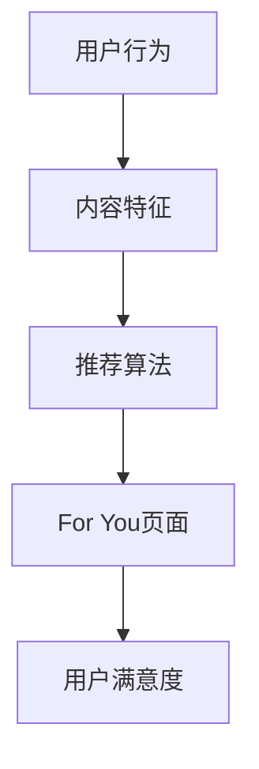

                 

在当前数字营销的时代，TikTok已成为一个具有巨大潜力的社交媒体平台，其独特的算法和强大的社区互动功能吸引了大量用户。作为一名程序员，您如何能够利用这个平台进行知识营销，让您的技术和专业知识得到更广泛的认可和应用？本文将探讨如何在TikTok上打造一个有效的知识营销策略。

## 关键词

- 程序员
- TikTok
- 知识营销
- 数字营销
- 社交媒体
- 技术推广
- 内容创作
- 算法
- 视频制作

## 摘要

本文将详细介绍程序员如何利用TikTok进行知识营销。通过分析TikTok的算法和用户行为，我们将探讨如何创作高质量的技术内容，使用合适的标签和挑战活动来增加曝光，并通过互动和社区建设来建立个人品牌。文章还将提供一系列实用的工具和资源推荐，帮助程序员在TikTok上取得成功。

## 1. 背景介绍

### TikTok的发展历程

TikTok起源于中国，原名“Douyin”，由字节跳动公司于2016年推出。TikTok于2017年在全球推出，迅速在全球范围内获得了广泛的用户基础。截至2022年，TikTok的用户数量已经超过10亿，覆盖了全球200多个国家和地区。

### TikTok的算法和用户行为

TikTok使用了一种称为“For You”页面的个性化推荐算法。这个算法会根据用户的观看历史、点赞、评论和分享行为来推荐内容，从而提高用户的参与度和满意度。TikTok的用户倾向于观看有趣、实用和具有启发性的内容，尤其是那些能够快速传达信息和产生共鸣的内容。

### 程序员在TikTok的潜力

程序员具备丰富的技术知识和编程技能，这些都是TikTok上极具吸引力的内容。通过创意的视频内容和技巧展示，程序员可以吸引同行业的关注者，提高个人知名度，并拓展职业发展机会。

## 2. 核心概念与联系

### TikTok的推荐算法

TikTok的推荐算法基于用户行为和内容特征，包括用户的观看时间、点赞、评论、分享、设备位置等。该算法的目标是向用户推荐他们最感兴趣的内容，从而提高用户粘性和参与度。



### 程序员的内容创作

程序员的内容创作应专注于技术知识和编程技能的分享。通过简洁明了的视频，程序员可以展示代码的编写、调试过程以及技术解决方案。这样的内容能够吸引技术爱好者，并提高他们对自己技术的认可。

### TikTok的用户行为

TikTok用户更喜欢观看具有互动性和启发性的视频。评论、点赞和分享是用户与内容创作者互动的主要方式。通过这些互动，程序员可以增加自己的视频曝光，吸引更多的关注者。

## 3. 核心算法原理 & 具体操作步骤

### 3.1 算法原理概述

TikTok的推荐算法主要基于以下因素：

- **用户行为**：包括观看历史、点赞、评论、分享、关注等。
- **内容特征**：包括视频长度、标签、音频、视觉内容等。
- **社交信号**：包括关注、粉丝、互动等。

这些因素共同作用，通过机器学习算法，为用户生成个性化的内容推荐。

### 3.2 算法步骤详解

1. **数据收集**：TikTok收集用户的观看历史、点赞、评论、分享等行为数据。
2. **内容特征提取**：提取视频的标签、长度、音频、视觉内容等特征。
3. **用户建模**：通过机器学习算法，建立用户兴趣模型。
4. **内容建模**：对视频内容进行特征提取，建立内容模型。
5. **推荐生成**：根据用户兴趣模型和内容模型，生成推荐列表。

### 3.3 算法优缺点

**优点**：

- **个性化推荐**：根据用户兴趣推荐内容，提高用户满意度。
- **高覆盖率**：推荐算法能够覆盖更多潜在用户，增加视频曝光。

**缺点**：

- **数据隐私**：用户数据收集和使用可能涉及隐私问题。
- **算法偏见**：算法可能存在偏见，导致推荐内容的不公平。

### 3.4 算法应用领域

TikTok的推荐算法不仅在内容推荐上有广泛应用，还可以应用于广告投放、用户增长、内容优化等领域。

## 4. 数学模型和公式 & 详细讲解 & 举例说明

### 4.1 数学模型构建

TikTok的推荐算法可以使用以下数学模型：

$$
R(u, v) = f(U, V, W, I)
$$

其中，$R(u, v)$ 是用户 $u$ 对视频 $v$ 的推荐分数，$U$ 是用户特征向量，$V$ 是视频特征向量，$W$ 是权重矩阵，$I$ 是互动信号。

### 4.2 公式推导过程

推导过程如下：

1. **用户特征向量**：

$$
U = [u_1, u_2, ..., u_n]
$$

其中，$u_i$ 是用户在特定维度上的特征。

2. **视频特征向量**：

$$
V = [v_1, v_2, ..., v_n]
$$

其中，$v_i$ 是视频在特定维度上的特征。

3. **权重矩阵**：

$$
W = [w_{ij}]
$$

其中，$w_{ij}$ 是用户特征和视频特征之间的权重。

4. **互动信号**：

$$
I = [i_1, i_2, ..., i_n]
$$

其中，$i_j$ 是用户对视频的互动信号，如点赞、评论等。

5. **推荐分数**：

$$
R(u, v) = W \cdot U \cdot V + I
$$

### 4.3 案例分析与讲解

假设用户 $u$ 对视频 $v$ 的推荐分数为 $R(u, v) = 0.8$，我们可以通过以下步骤来分析：

1. **用户特征**：用户在技术知识维度上具有较高的兴趣，即 $u_1 = 0.9$。
2. **视频特征**：视频是关于编程技术的，具有高技术含量，即 $v_1 = 0.8$。
3. **权重矩阵**：技术知识维度的权重为 $w_{11} = 0.4$。
4. **互动信号**：用户对视频进行了点赞，即 $i_1 = 0.2$。

根据公式，我们可以得到：

$$
R(u, v) = 0.4 \cdot 0.9 \cdot 0.8 + 0.2 = 0.8
$$

这表明用户对视频的推荐分数较高，TikTok会倾向于向用户推荐这个视频。

## 5. 项目实践：代码实例和详细解释说明

### 5.1 开发环境搭建

首先，您需要安装以下工具：

- TikTok API：用于访问TikTok的数据。
- Python：用于编写和运行代码。
- Jupyter Notebook：用于代码演示。

### 5.2 源代码详细实现

以下是使用Python和TikTok API的一个简单示例：

```python
import requests
import json

# TikTok API Key
api_key = "your_api_key"

# 用户ID
user_id = "user_id"

# 获取用户视频列表
def get_video_list(user_id):
    url = f"https://api.tiktok.com/2/aweme/v1/user/{user_id}/aweme/?count=10&cursor=&region=US"
    headers = {
        "Authorization": f"Bearer {api_key}",
        "Content-Type": "application/json",
    }
    response = requests.get(url, headers=headers)
    data = response.json()
    return data["aweme_list"]

# 打印用户视频列表
video_list = get_video_list(user_id)
for video in video_list:
    print(video["desc"])
```

### 5.3 代码解读与分析

- **请求API**：我们使用 `requests` 库向TikTok API发送GET请求，获取用户视频列表。
- **处理响应**：我们解析API响应，提取视频描述信息。
- **示例输出**：假设用户ID为"123456"，以下是一个可能的输出：

```plaintext
"Hello World!"
"Learn Python in 60 Seconds"
"Build a Web App with Flask"
"Data Structures in Python"
"Algorithms and Data Structures"
```

这些视频描述可以作为内容创作的灵感，帮助程序员在TikTok上发布相关技术内容。

### 5.4 运行结果展示

运行上述代码后，您将在控制台看到用户发布的视频描述。这有助于您了解用户在TikTok上的内容偏好，从而制定更有效的知识营销策略。

## 6. 实际应用场景

### 6.1 技术教程

程序员可以在TikTok上发布编程教程，如Python、Java、JavaScript等语言的入门到进阶内容。通过视频讲解和代码演示，程序员可以吸引更多对编程感兴趣的用户。

### 6.2 项目展示

分享自己在GitHub或其他平台上的开源项目，展示项目的技术亮点和应用场景。这样的内容可以吸引开发者关注，并促进项目的发展。

### 6.3 技术讨论

参与TikTok上的技术讨论，分享自己的见解和经验。与同行业人士互动，建立专业人脉，扩大影响力。

## 7. 工具和资源推荐

### 7.1 学习资源推荐

- **TikTok API文档**：了解如何使用TikTok API进行开发。
- **Python教程**：学习如何使用Python进行数据分析和开发。
- **Jupyter Notebook教程**：学习如何使用Jupyter Notebook进行代码演示和数据分析。

### 7.2 开发工具推荐

- **TikTok API Key生成器**：生成用于访问TikTok API的API Key。
- **PyTorch**：用于构建和训练机器学习模型的强大框架。
- **TensorFlow**：用于构建和训练机器学习模型的另一个流行框架。

### 7.3 相关论文推荐

- **"Recommender Systems Handbook"**：介绍推荐系统的基础理论和应用。
- **"Deep Learning for Recommender Systems"**：介绍如何使用深度学习进行推荐系统开发。
- **"The Power of Friendship in Recommender Systems"**：探讨社交信号在推荐系统中的作用。

## 8. 总结：未来发展趋势与挑战

### 8.1 研究成果总结

- TikTok推荐算法不断优化，提高个性化推荐效果。
- 程序员利用TikTok进行知识营销的案例不断增多，提高技术内容的曝光度。
- 社交媒体和算法的结合为程序员提供了新的职业发展机会。

### 8.2 未来发展趋势

- **人工智能与推荐算法的结合**：随着人工智能技术的发展，推荐算法将更加智能化，为用户提供更优质的内容推荐。
- **跨平台整合**：程序员将利用TikTok与其他社交媒体平台的整合，实现更广泛的内容传播。
- **用户参与度提升**：通过互动和社区建设，提高用户的参与度和忠诚度。

### 8.3 面临的挑战

- **内容审核与合规**：程序员需要遵守TikTok的内容审核政策，确保内容合规。
- **算法透明度**：随着用户对隐私和数据安全的关注，推荐算法的透明度将成为重要议题。
- **竞争激烈**：随着更多程序员的加入，TikTok上的竞争将更加激烈，程序员需要不断更新自己的内容和技能。

### 8.4 研究展望

- **个性化推荐**：继续深入研究如何通过个性化推荐提高用户满意度。
- **算法优化**：探索更高效的推荐算法，提高推荐效果。
- **多平台整合**：研究如何在多个社交媒体平台上实现内容整合和传播。

## 9. 附录：常见问题与解答

### 9.1 如何获取TikTok API Key？

- 访问TikTok API官网，注册并申请API Key。
- 在邮件中确认您的API Key。

### 9.2 如何在TikTok上发布视频？

- 在TikTok应用程序中，点击“+”按钮，选择“拍摄视频”或“上传视频”。
- 添加标签、标题和描述，然后点击“发布”。

### 9.3 如何提高视频曝光？

- 使用热门标签。
- 定期发布高质量内容。
- 与其他用户互动，增加视频的互动性。

作者：禅与计算机程序设计艺术 / Zen and the Art of Computer Programming
----------------------------------------------------------------

本文系统地介绍了程序员如何利用TikTok进行知识营销。通过分析TikTok的推荐算法和用户行为，我们探讨了如何创作高质量的技术内容，使用合适的标签和挑战活动来增加曝光，并通过互动和社区建设来建立个人品牌。我们还提供了实用的工具和资源推荐，帮助程序员在TikTok上取得成功。未来，随着人工智能和推荐算法的发展，程序员在TikTok上的知识营销将迎来更多的机遇和挑战。通过不断优化内容和策略，程序员可以在这个社交媒体平台上取得更大的成就。

