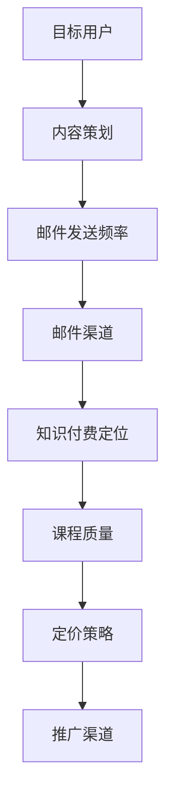

                 

关键词：电子邮件营销、知识付费、程序员、策略、案例分析、技术传播

> 摘要：在数字化时代，电子邮件营销成为知识付费的重要渠道。本文将深入探讨程序员如何通过电子邮件营销开展知识付费业务，从策略、案例分析、技术传播等多个角度，为程序员提供一整套完整的实施指南。

## 1. 背景介绍

### 1.1 电子邮件营销的发展

电子邮件营销（Email Marketing）作为一种传统的数字营销手段，其起源可以追溯到20世纪90年代。随着互联网技术的不断发展和普及，电子邮件营销逐渐成为企业推广产品和服务的有效途径。据统计，电子邮件营销的回报率是其他数字营销渠道的3至5倍，因此在商业活动中具有重要地位。

### 1.2 知识付费的概念

知识付费是指用户通过支付费用来获取专业知识和技能的服务模式。随着人们对自我提升的需求增加，知识付费逐渐成为互联网行业的新风口。知识付费平台如得到、知乎等，为专业人士提供了展示和变现的平台。

### 1.3 程序员与知识付费

程序员群体庞大，但普遍面临知识更新速度快、职业发展瓶颈等问题。通过电子邮件营销，程序员可以有效地传播自己的知识和技术，实现知识变现，提升个人品牌影响力。

## 2. 核心概念与联系

### 2.1 电子邮件营销的核心概念

**目标用户：** 明确你的目标用户是谁，例如初级程序员、项目经理、企业技术部门主管等。

**内容：** 内容是电子邮件营销的核心，包括技术文章、案例分享、免费资源等。

**频率：** 电子邮件发送的频率需要适中，过于频繁可能引起用户反感，过于稀疏则可能降低用户粘性。

**渠道：** 主要通过邮件服务提供商（ESP）如SendGrid、Mailchimp等发送。

### 2.2 知识付费的核心概念

**课程/服务定位：** 明确你的课程或服务针对哪些技术领域，例如人工智能、大数据、前端开发等。

**课程质量：** 提供高质量的课程内容，包括视频教程、文档资料、代码示例等。

**定价策略：** 根据课程质量、市场需求和竞争对手定价策略，制定合理的价格。

**推广渠道：** 除了电子邮件营销，还可以通过社交媒体、博客、知识付费平台等多渠道推广。

### 2.3 Mermaid流程图



## 3. 核心算法原理 & 具体操作步骤

### 3.1 算法原理概述

电子邮件营销的核心算法主要包括用户数据分析、内容推荐、邮件优化等。

- **用户数据分析：** 通过分析用户行为数据，了解用户偏好，从而定制个性化内容。
- **内容推荐：** 根据用户行为数据，推荐相关的高质量内容。
- **邮件优化：** 通过A/B测试等手段，优化邮件内容、标题和发送时间，提高打开率和点击率。

### 3.2 算法步骤详解

1. **用户数据分析：**
   - 收集用户行为数据，如邮件打开率、点击率、浏览时长等。
   - 对数据进行分析，识别用户偏好。

2. **内容策划：**
   - 根据用户偏好，策划相关内容。
   - 内容形式包括技术文章、案例分享、视频教程等。

3. **邮件发送频率：**
   - 根据用户行为数据，确定合适的邮件发送频率。
   - 避免频繁发送造成用户反感，也要保证信息的及时性。

4. **邮件渠道选择：**
   - 选择可靠的邮件服务提供商，如SendGrid、Mailchimp等。
   - 设置邮件模板，确保邮件内容统一、美观。

5. **知识付费推广：**
   - 在邮件内容中嵌入知识付费的推广信息。
   - 提供优惠码、限时优惠等激励措施，吸引用户购买。

### 3.3 算法优缺点

**优点：**
- 高度个性化，提高用户粘性。
- 成本较低，适用于中小型知识付费项目。

**缺点：**
- 需要大量数据分析和内容策划工作。
- 邮件营销效果受到用户邮箱服务商过滤的影响。

### 3.4 算法应用领域

- **技术博客：** 通过邮件营销，推广技术文章和视频教程。
- **在线教育：** 推广在线课程和学习资源。
- **技术咨询：** 推广技术咨询服务。

## 4. 数学模型和公式 & 详细讲解 & 举例说明

### 4.1 数学模型构建

电子邮件营销的数学模型主要包括用户行为分析模型、内容推荐模型和邮件发送优化模型。

- **用户行为分析模型：**
  $$ \text{用户偏好} = f(\text{历史行为}, \text{社会关系}, \text{环境因素}) $$

- **内容推荐模型：**
  $$ \text{推荐内容} = \text{用户偏好} \times \text{内容特征} $$

- **邮件发送优化模型：**
  $$ \text{最优发送时间} = \text{用户行为模式} + \text{节假日因素} + \text{季节性因素} $$

### 4.2 公式推导过程

**用户偏好分析：**

用户偏好是通过历史行为数据、社会关系和环境因素共同作用的结果。其中，历史行为数据可以通过以下公式进行计算：

$$ \text{行为权重} = \frac{\text{行为频率}}{\sum_{i=1}^{n}\text{行为频率}} $$

$$ \text{用户偏好} = \sum_{i=1}^{n} \text{行为权重} \times \text{行为特征} $$

**内容推荐：**

内容推荐是基于用户偏好和内容特征的相似度计算。假设用户偏好向量为 \( \textbf{u} \)，内容特征向量为 \( \textbf{v} \)，则推荐分数可以通过余弦相似度计算：

$$ \text{推荐分数} = \frac{\textbf{u} \cdot \textbf{v}}{||\textbf{u}|| \times ||\textbf{v}||} $$

**邮件发送优化：**

邮件发送优化考虑多个因素，包括用户行为模式、节假日因素和季节性因素。假设用户行为模式为 \( \textbf{p} \)，节假日因素为 \( \textbf{h} \)，季节性因素为 \( \textbf{s} \)，则最优发送时间为：

$$ \text{最优发送时间} = \textbf{p} + \textbf{h} + \textbf{s} $$

### 4.3 案例分析与讲解

假设我们有一个程序员用户，他的行为模式是每周一、三、五晚上8点活跃，且节假日更活跃。我们通过以下步骤为他推荐内容：

1. 收集用户行为数据，计算行为权重。
2. 根据行为权重，推荐相关技术文章。
3. 考虑节假日和季节性因素，确定最佳发送时间。

通过以上分析，我们为该用户推荐了关于前端开发的技术文章，并在下周一的晚上8点发送邮件。

## 5. 项目实践：代码实例和详细解释说明

### 5.1 开发环境搭建

为了实现电子邮件营销，我们选择以下工具：

- Python 3.8
- Flask 2.0
- SendGrid API

安装Python和Flask：

```bash
pip install python
pip install flask
```

获取SendGrid API Key：

1. 注册SendGrid账户。
2. 在账户设置中获取API Key。

### 5.2 源代码详细实现

以下是一个简单的电子邮件营销服务器的示例代码：

```python
from flask import Flask, request, jsonify
import sendgrid
import sg

app = Flask(__name__)

# SendGrid API设置
sendgrid SG_API_KEY
client = sendgrid.Client(api_key=SG_API_KEY)

@app.route('/send_email', methods=['POST'])
def send_email():
    data = request.get_json()
    email_to = data['email_to']
    subject = data['subject']
    content = data['content']
    
    message = sg.Mail(
        from_email='you@example.com',
        to_emails=email_to,
        subject=subject,
        html_content=content
    )
    
    try:
        response = client.send(message)
        return jsonify({'status': 'success'})
    except Exception as e:
        return jsonify({'status': 'error', 'message': str(e)})

if __name__ == '__main__':
    app.run()
```

### 5.3 代码解读与分析

1. **Flask Web应用搭建：** 使用Flask搭建简单的Web应用，用于接收和处理邮件请求。
2. **SendGrid API调用：** 使用SendGrid API发送邮件。通过POST请求，接收邮件发送参数，如收件人、主题和邮件内容。
3. **异常处理：** 在发送邮件时，捕获异常并返回错误信息。

### 5.4 运行结果展示

通过以下命令运行服务器：

```bash
python app.py
```

然后通过Postman或其他工具发送POST请求：

```json
{
    "email_to": "receiver@example.com",
    "subject": "技术分享",
    "content": "这是一篇关于前端开发的技术文章。"
}
```

服务器返回成功响应：

```json
{
    "status": "success"
}
```

## 6. 实际应用场景

### 6.1 技术博客

程序员可以通过电子邮件营销，推广自己的技术博客。定期向订阅者发送最新文章，提升博客的访问量和影响力。

### 6.2 在线教育

在线教育平台可以通过电子邮件营销，推广自己的课程和资源。发送课程通知、优惠信息和学习资源，吸引更多学员报名。

### 6.3 技术咨询

技术顾问可以通过电子邮件营销，推广自己的咨询服务。发送技术文章、案例分析等，展示专业能力，吸引潜在客户。

## 6.4 未来应用展望

随着人工智能技术的发展，电子邮件营销将更加智能化。利用机器学习和自然语言处理技术，可以实现更精准的内容推荐和个性化服务。

## 7. 工具和资源推荐

### 7.1 学习资源推荐

- 《Python核心编程》
- 《深度学习》
- 《GitHub实战：从入门到精通》

### 7.2 开发工具推荐

- Flask
- SendGrid
- Jupyter Notebook

### 7.3 相关论文推荐

- "Recommender Systems Handbook"
- "A Content-Based Email Recommendation System for Personalized Marketing"
- "User Modeling for Personalized Email Campaigns"

## 8. 总结：未来发展趋势与挑战

### 8.1 研究成果总结

电子邮件营销在知识付费领域取得了显著成果，通过个性化推荐和精准营销，提升了用户满意度和转化率。

### 8.2 未来发展趋势

未来，电子邮件营销将更加智能化，借助人工智能和大数据技术，实现更精准的内容推荐和个性化服务。

### 8.3 面临的挑战

电子邮件营销面临的主要挑战包括数据隐私保护、垃圾邮件过滤和用户信任度等。

### 8.4 研究展望

未来，研究方向包括智能邮件生成、行为预测和个性化服务，以提高电子邮件营销的效果和用户体验。

## 9. 附录：常见问题与解答

### 9.1 如何收集用户数据？

通过网站分析工具（如Google Analytics）、用户反馈和订阅功能，收集用户行为数据。

### 9.2 如何避免邮件被过滤为垃圾邮件？

优化邮件内容、标题和发送时间，使用可靠的邮件服务提供商，遵循反垃圾邮件规则。

### 9.3 如何提高用户参与度？

提供高质量的内容，定期互动，通过问卷调查、抽奖等方式提高用户参与度。

---

作者：禅与计算机程序设计艺术 / Zen and the Art of Computer Programming
----------------------------------------------------------------

