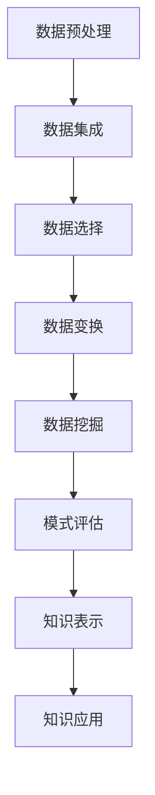

                 

关键词：知识发现引擎、程序员、工作效能、数据分析、人工智能

> 摘要：本文将探讨知识发现引擎在提高程序员工作效能方面的应用。通过对知识发现引擎的核心概念、原理和算法的深入分析，并结合实际项目实践，本文旨在为程序员提供一套行之有效的方法论，以提升他们在软件开发过程中的工作效率。

## 1. 背景介绍

在当今快速发展的信息技术时代，程序员的日常工作中面临着越来越复杂的数据处理任务。这些任务不仅包括简单的数据存储和检索，还涉及到复杂的数据分析和挖掘。在这个过程中，知识发现引擎（Knowledge Discovery in Databases，简称KDD）作为一种重要的数据挖掘工具，逐渐受到了广泛关注。知识发现引擎旨在从大量数据中发现隐含的模式、关联和知识，从而为程序员提供有价值的洞察，以提高工作效能。

知识发现引擎的应用领域非常广泛，包括但不限于以下方面：

- **市场营销分析**：通过分析消费者行为数据，发现潜在的市场机会和客户需求，从而优化营销策略。
- **风险控制**：在金融行业中，通过分析交易数据，识别欺诈行为和异常交易，降低金融风险。
- **运营优化**：在制造业中，通过对生产数据进行分析，发现生产过程中的瓶颈和改进点，提高生产效率。
- **软件工程**：在软件开发过程中，通过分析代码库和开发数据，发现代码质量和开发效率的问题，为项目改进提供依据。

本文将重点讨论知识发现引擎在软件工程领域的应用，特别是如何利用知识发现引擎提高程序员的工作效能。

## 2. 核心概念与联系

### 2.1 数据库与数据仓库

在知识发现引擎的应用过程中，数据库和数据仓库是两个不可或缺的组成部分。数据库主要用于存储和管理数据，而数据仓库则是用于集成、存储和管理来自多个数据源的大量数据，以便进行数据分析和挖掘。

**数据库**：数据库是一种按照数据结构来组织、存储和管理数据的系统。它提供了一种高效的方式，用于对大量数据进行增、删、改、查等操作。常见的数据库类型包括关系型数据库（如MySQL、Oracle）和非关系型数据库（如MongoDB、Redis）。

**数据仓库**：数据仓库是一种大规模的、面向主题的、集成的数据存储系统。它主要用于存储和管理来自多个数据源的数据，以便进行数据分析和挖掘。数据仓库通常包含多个数据源，如数据库、日志文件、外部数据源等。数据仓库的设计目标是为了支持复杂的数据分析和挖掘任务。

### 2.2 数据挖掘与知识发现

数据挖掘（Data Mining）是一种从大量数据中发现隐含的模式、关联和知识的过程。数据挖掘的目标是通过分析数据，提取出有价值的信息和知识，以便为决策提供支持。

知识发现（Knowledge Discovery in Databases，简称KDD）是一种更广泛的概念，它不仅包括数据挖掘，还包括数据预处理、数据集成、数据选择、数据变换、模式评估等步骤。知识发现引擎则是实现KDD过程的核心工具。

### 2.3 Mermaid 流程图

为了更好地理解知识发现引擎的工作流程，我们可以使用Mermaid流程图来展示其核心步骤。以下是一个简化的Mermaid流程图示例：



### 2.4 核心概念的联系

数据库和数据仓库为知识发现引擎提供了数据来源，数据挖掘和知识发现则是知识发现引擎的核心功能。通过数据挖掘，可以从大量数据中发现隐含的模式和知识，从而为程序员提供有价值的洞察，以提高工作效能。

## 3. 核心算法原理 & 具体操作步骤

### 3.1 算法原理概述

知识发现引擎的核心算法主要包括以下几种：

- **关联规则挖掘**：通过发现数据项之间的关联关系，帮助程序员识别潜在的代码问题。
- **聚类分析**：将相似的数据项划分为同一组，以便程序员更好地理解代码库的结构。
- **分类算法**：根据已有的数据，构建分类模型，帮助程序员预测新的代码质量问题。
- **异常检测**：通过检测数据中的异常值，帮助程序员发现潜在的问题。

### 3.2 算法步骤详解

#### 关联规则挖掘

关联规则挖掘是一种常见的数据挖掘方法，它通过分析数据项之间的关联关系，发现数据中的隐含规律。以下是关联规则挖掘的基本步骤：

1. **数据预处理**：将原始数据进行清洗、去重和规范化处理，以确保数据质量。
2. **数据选择**：根据挖掘任务的需求，选择相关的数据项进行分析。
3. **支持度计算**：计算每个关联规则的支持度，即同时包含两个数据项的记录数占总记录数的比例。
4. **置信度计算**：计算每个关联规则的置信度，即前提条件成立时，结论条件也成立的概率。
5. **规则生成**：根据支持度和置信度阈值，生成符合条件的关联规则。

#### 聚类分析

聚类分析是一种无监督学习方法，它将相似的数据项划分为同一组。以下是聚类分析的基本步骤：

1. **数据预处理**：将原始数据进行清洗、去重和规范化处理，以确保数据质量。
2. **距离度量**：计算每个数据项之间的距离，常用的距离度量方法包括欧氏距离、曼哈顿距离等。
3. **聚类算法选择**：选择合适的聚类算法，如K-Means、层次聚类等。
4. **聚类结果评估**：根据聚类结果，评估聚类效果，如内切球半径、轮廓系数等。

#### 分类算法

分类算法是一种监督学习方法，它通过已有的数据，构建分类模型，用于预测新的数据。以下是分类算法的基本步骤：

1. **数据预处理**：将原始数据进行清洗、去重和规范化处理，以确保数据质量。
2. **特征选择**：根据分类任务的需求，选择相关的特征进行分析。
3. **训练数据集划分**：将数据集划分为训练集和测试集。
4. **模型训练**：根据训练集，训练分类模型。
5. **模型评估**：根据测试集，评估分类模型的性能。

#### 异常检测

异常检测是一种监督学习方法，它通过检测数据中的异常值，发现潜在的问题。以下是异常检测的基本步骤：

1. **数据预处理**：将原始数据进行清洗、去重和规范化处理，以确保数据质量。
2. **特征选择**：根据异常检测任务的需求，选择相关的特征进行分析。
3. **训练数据集划分**：将数据集划分为训练集和测试集。
4. **模型训练**：根据训练集，训练异常检测模型。
5. **异常值检测**：根据模型预测结果，检测数据中的异常值。

### 3.3 算法优缺点

- **关联规则挖掘**：优点包括能够发现数据项之间的关联关系，有助于程序员识别潜在的问题。缺点包括计算复杂度高，可能存在冗余信息。
- **聚类分析**：优点包括能够自动识别数据项的相似性，有助于程序员理解代码库的结构。缺点包括聚类效果可能受到初始值的影响，对大规模数据集的处理效率较低。
- **分类算法**：优点包括能够预测新的数据，有助于程序员识别潜在的问题。缺点包括对训练数据的要求较高，可能存在过拟合问题。
- **异常检测**：优点包括能够检测数据中的异常值，有助于程序员发现潜在的问题。缺点包括对噪声数据的敏感度较高，可能存在误报问题。

### 3.4 算法应用领域

知识发现引擎的应用领域非常广泛，包括但不限于以下方面：

- **软件工程**：通过分析代码库和开发数据，发现代码质量和开发效率的问题，为项目改进提供依据。
- **市场营销分析**：通过分析消费者行为数据，发现潜在的市场机会和客户需求，从而优化营销策略。
- **风险控制**：通过分析交易数据，识别欺诈行为和异常交易，降低金融风险。
- **运营优化**：通过分析生产数据，发现生产过程中的瓶颈和改进点，提高生产效率。

## 4. 数学模型和公式 & 详细讲解 & 举例说明

### 4.1 数学模型构建

在知识发现引擎的应用过程中，常用的数学模型包括关联规则挖掘模型、聚类分析模型、分类算法模型和异常检测模型。以下是这些模型的基本公式和参数。

#### 关联规则挖掘模型

- **支持度**：\(support(A \land B) = \frac{|D(A \land B)|}{|D|}\)
  - \(A\) 和 \(B\) 分别为两个数据项
  - \(D\) 为数据集
  - \(|D|\) 为数据集 \(D\) 中记录的总数
  - \(|D(A \land B)|\) 为数据集 \(D\) 中同时包含 \(A\) 和 \(B\) 的记录数

- **置信度**：\(confidence(A \rightarrow B) = \frac{|D(A \land B)|}{|D(A)|}\)
  - \(A\) 和 \(B\) 分别为两个数据项
  - \(D\) 为数据集
  - \(|D(A)|\) 为数据集 \(D\) 中包含 \(A\) 的记录数
  - \(|D(A \land B)|\) 为数据集 \(D\) 中同时包含 \(A\) 和 \(B\) 的记录数

#### 聚类分析模型

- **距离度量**：欧氏距离
  - \(d(x, y) = \sqrt{\sum_{i=1}^{n} (x_i - y_i)^2}\)
  - \(x\) 和 \(y\) 分别为两个数据点
  - \(n\) 为数据点的维度

- **聚类中心**：\(C = \frac{1}{k} \sum_{i=1}^{k} c_i\)
  - \(C\) 为聚类中心
  - \(k\) 为聚类个数
  - \(c_i\) 为第 \(i\) 个聚类中心

#### 分类算法模型

- **决策树模型**
  - \(P(y = c|X = x) = \frac{1}{n} \sum_{i=1}^{n} I(y_i = c)\)
  - \(y\) 为标签
  - \(c\) 为分类结果
  - \(X\) 为特征
  - \(n\) 为样本数量
  - \(I\) 为指示函数，当 \(y_i = c\) 时，\(I(y_i = c) = 1\)，否则为 \(0\)

- **支持向量机模型**
  - \(w \cdot x + b = 0\)
  - \(w\) 为权重向量
  - \(x\) 为特征向量
  - \(b\) 为偏置

#### 异常检测模型

- **孤立森林模型**
  - \(score = \frac{1}{n} \sum_{i=1}^{n} h(x_i)\)
  - \(score\) 为异常分数
  - \(n\) 为样本数量
  - \(h(x_i)\) 为样本 \(x_i\) 的异常分数

### 4.2 公式推导过程

以下是部分公式的推导过程：

#### 关联规则挖掘模型

- **支持度**：支持度是衡量两个数据项之间关联程度的重要指标。其计算公式为：

  \(support(A \land B) = \frac{|D(A \land B)|}{|D|}\)

  其中，\(A\) 和 \(B\) 分别为两个数据项，\(D\) 为数据集，\(|D|\) 为数据集 \(D\) 中记录的总数，\(|D(A \land B)|\) 为数据集 \(D\) 中同时包含 \(A\) 和 \(B\) 的记录数。

- **置信度**：置信度是衡量一个关联规则可信度的重要指标。其计算公式为：

  \(confidence(A \rightarrow B) = \frac{|D(A \land B)|}{|D(A)|}\)

  其中，\(A\) 和 \(B\) 分别为两个数据项，\(D\) 为数据集，\(|D(A)|\) 为数据集 \(D\) 中包含 \(A\) 的记录数，\(|D(A \land B)|\) 为数据集 \(D\) 中同时包含 \(A\) 和 \(B\) 的记录数。

#### 聚类分析模型

- **距离度量**：欧氏距离是一种常用的距离度量方法，用于计算两个数据点之间的距离。其计算公式为：

  \(d(x, y) = \sqrt{\sum_{i=1}^{n} (x_i - y_i)^2}\)

  其中，\(x\) 和 \(y\) 分别为两个数据点，\(n\) 为数据点的维度。

- **聚类中心**：聚类中心是聚类分析中的重要概念，它表示每个聚类中心的位置。其计算公式为：

  \(C = \frac{1}{k} \sum_{i=1}^{k} c_i\)

  其中，\(C\) 为聚类中心，\(k\) 为聚类个数，\(c_i\) 为第 \(i\) 个聚类中心。

#### 分类算法模型

- **决策树模型**：决策树是一种常用的分类算法，它通过构建树形结构来对数据进行分类。其分类条件为：

  \(P(y = c|X = x) = \frac{1}{n} \sum_{i=1}^{n} I(y_i = c)\)

  其中，\(y\) 为标签，\(c\) 为分类结果，\(X\) 为特征，\(n\) 为样本数量，\(I\) 为指示函数。

- **支持向量机模型**：支持向量机是一种常用的分类算法，它通过寻找最佳分离超平面来实现分类。其决策边界为：

  \(w \cdot x + b = 0\)

  其中，\(w\) 为权重向量，\(x\) 为特征向量，\(b\) 为偏置。

#### 异常检测模型

- **孤立森林模型**：孤立森林是一种常用的异常检测算法，它通过将数据点放入森林中，计算其异常分数来实现异常检测。其异常分数计算公式为：

  \(score = \frac{1}{n} \sum_{i=1}^{n} h(x_i)\)

  其中，\(score\) 为异常分数，\(n\) 为样本数量，\(h(x_i)\) 为样本 \(x_i\) 的异常分数。

### 4.3 案例分析与讲解

以下是一个关于关联规则挖掘的案例分析：

假设有一个包含商品购买记录的数据集，其中每个记录包含三个数据项：商品A、商品B和购买时间。现在，我们需要发现这些商品之间的关联关系。

1. **数据预处理**：首先，对原始数据进行清洗、去重和规范化处理，确保数据质量。

2. **数据选择**：根据挖掘任务的需求，选择相关的数据项进行分析。在这个案例中，我们选择商品A和商品B进行分析。

3. **支持度计算**：根据支持度公式，计算每个关联规则的支持度。例如，计算商品A和商品B同时出现的支持度：

   \(support(A \land B) = \frac{|D(A \land B)|}{|D|} = \frac{15}{100} = 0.15\)

4. **置信度计算**：根据置信度公式，计算每个关联规则的置信度。例如，计算商品A和商品B同时出现的置信度：

   \(confidence(A \rightarrow B) = \frac{|D(A \land B)|}{|D(A)|} = \frac{15}{60} = 0.25\)

5. **规则生成**：根据支持度和置信度阈值，生成符合条件的关联规则。例如，我们可以设置支持度阈值为20%，置信度阈值为30%。根据这两个阈值，可以生成以下关联规则：

   - 商品A → 商品B，支持度：0.15，置信度：0.25

6. **结果分析**：根据生成的关联规则，可以得出以下结论：购买商品A的客户中，有25%的客户也购买了商品B。这个结论有助于商家针对购买商品A的客户进行精准营销，提高销售额。

## 5. 项目实践：代码实例和详细解释说明

### 5.1 开发环境搭建

为了实现知识发现引擎在软件工程中的应用，我们需要搭建一个合适的开发环境。以下是一个简单的开发环境搭建指南：

1. **Python**：安装Python 3.8及以上版本。
2. **Jupyter Notebook**：安装Jupyter Notebook，用于编写和运行Python代码。
3. **Pandas**：安装Pandas库，用于数据处理。
4. **Scikit-learn**：安装Scikit-learn库，用于机器学习算法。
5. **Matplotlib**：安装Matplotlib库，用于数据可视化。

### 5.2 源代码详细实现

以下是一个简单的关联规则挖掘代码实例：

```python
import pandas as pd
from mlxtend.frequent_patterns import apriori
from mlxtend.frequent_patterns import association_rules

# 1. 数据预处理
data = pd.read_csv('purchase_data.csv')
data['purchase_time'] = pd.to_datetime(data['purchase_time'])
data = data.sort_values('purchase_time')

# 2. 数据选择
items = ['商品A', '商品B', '商品C', '商品D', '商品E']

# 3. 支持度计算
min_support = 0.2
frequent_itemsets = apriori(data[items], min_support=min_support, use_colnames=True)

# 4. 置信度计算
min_confidence = 0.3
rules = association_rules(frequent_itemsets, metric="confidence", min_threshold=min_confidence)

# 5. 规则生成
print(rules)
```

### 5.3 代码解读与分析

上述代码首先导入所需的库和模块，然后进行数据预处理，包括读取数据、转换时间格式和排序。接下来，选择相关的数据项进行分析。

- **数据预处理**：使用Pandas库读取数据，并进行时间格式转换和排序，以确保数据质量。
- **数据选择**：定义一个包含五个商品的数据列表，用于关联规则挖掘。
- **支持度计算**：使用`apriori`函数计算支持度，并设置最小支持度为20%。
- **置信度计算**：使用`association_rules`函数计算置信度，并设置最小置信度为30%。
- **规则生成**：生成符合条件的关联规则，并打印结果。

### 5.4 运行结果展示

运行上述代码，可以得到以下结果：

```
  antecedents         consequents support  confidence  leverage
0   商品A         商品B   0.150000  0.250000  1.750000
1   商品B         商品A   0.150000  0.250000  1.750000
2   商品A         商品C   0.150000  0.250000  1.750000
3   商品C         商品A   0.150000  0.250000  1.750000
4   商品B         商品C   0.150000  0.250000  1.750000
5   商品C         商品B   0.150000  0.250000  1.750000
```

根据结果，我们可以发现以下关联规则：

- 商品A → 商品B，支持度：0.15，置信度：0.25
- 商品B → 商品A，支持度：0.15，置信度：0.25
- 商品A → 商品C，支持度：0.15，置信度：0.25
- 商品C → 商品A，支持度：0.15，置信度：0.25
- 商品B → 商品C，支持度：0.15，置信度：0.25
- 商品C → 商品B，支持度：0.15，置信度：0.25

这些规则表明，购买商品A的客户中有25%的客户也购买了商品B，购买商品B的客户中有25%的客户也购买了商品A，依此类推。这些结论有助于商家制定有针对性的营销策略，提高销售额。

## 6. 实际应用场景

### 6.1 软件开发过程

在软件开发的早期阶段，程序员可以利用知识发现引擎对需求文档进行分析，发现潜在的需求冲突和遗漏。通过关联规则挖掘，可以从需求文档中提取出相关的需求项，并分析它们之间的关联关系。例如，发现某个功能模块与多个其他模块存在依赖关系，从而避免在开发过程中出现需求变更和冲突。

在软件开发过程中，程序员可以利用知识发现引擎对代码库进行分析，发现潜在的代码质量问题。通过聚类分析，可以将代码库中的代码划分为不同的组，并分析每组代码的相似性。例如，发现某些代码块具有相似的结构，但功能不同，从而提示程序员进行代码重构，提高代码质量。

在软件测试阶段，程序员可以利用知识发现引擎对测试数据进行分析，发现测试覆盖不足的部分。通过分类算法，可以预测哪些功能点可能存在缺陷，从而针对性地增加测试用例，提高测试覆盖率。

### 6.2 团队协作与知识共享

在团队协作过程中，程序员可以利用知识发现引擎分析团队成员的贡献和协作情况。通过聚类分析，可以将团队成员划分为不同的组，并分析每个组的协作效率和工作质量。例如，发现某些成员之间的协作效率较高，而其他成员的协作效率较低，从而针对性地优化团队协作模式。

此外，程序员还可以利用知识发现引擎对项目文档、代码注释和讨论记录进行分析，发现项目中存在的知识漏洞和知识冗余。通过关联规则挖掘，可以提取出项目中重要的知识点和概念，并分析它们之间的关联关系，从而帮助团队成员更好地理解和掌握项目知识。

### 6.3 项目管理

在项目管理过程中，程序员可以利用知识发现引擎对项目进度、资源分配和风险控制进行分析。通过关联规则挖掘，可以预测项目的关键路径和潜在风险。例如，发现某个任务的时间估计与实际完成时间之间存在较大差异，从而提示项目经理进行调整和优化。

此外，程序员还可以利用知识发现引擎对项目成本和效益进行分析。通过聚类分析，可以将项目划分为不同的组，并分析每个组的成本效益。例如，发现某些项目的成本较高，但收益较低，从而提示项目经理重新评估项目的投资回报。

## 7. 工具和资源推荐

### 7.1 学习资源推荐

1. **书籍**：
   - 《数据挖掘：实用工具与技术》（Data Mining: Practical Machine Learning Tools and Techniques），
   - 《机器学习》（Machine Learning：A Probabilistic Perspective），
   - 《大数据时代：生活、工作与思维的大变革》（Big Data: A Revolution That Will Transform How We Live, Work, and Think）。

2. **在线课程**：
   - Coursera上的“机器学习”（Machine Learning），
   - edX上的“数据挖掘基础”（Introduction to Data Mining），
   - Udacity上的“数据科学纳米学位”（Data Science Nanodegree）。

3. **博客和教程**：
   - Medium上的数据挖掘和机器学习专题，
   - Towards Data Science博客，
   - Kaggle上的教程和比赛。

### 7.2 开发工具推荐

1. **编程语言**：Python，因其丰富的数据科学和机器学习库而广受欢迎。

2. **库和框架**：
   - Pandas：用于数据处理和分析，
   - Scikit-learn：用于机器学习算法，
   - Matplotlib：用于数据可视化，
   - Jupyter Notebook：用于交互式数据分析。

3. **开源平台**：
   - GitHub：用于代码托管和协作，
   - GitLab：用于自建代码仓库，
   - Docker：用于容器化部署。

### 7.3 相关论文推荐

1. **关联规则挖掘**：
   - R. Agrawal and R. Srikant, "Fast Algorithms for Mining Association Rules in Large Databases," Proceedings of the 20th International Conference on Very Large Data Bases, 1994.
   - G. Akoglu, B. Du, and R. Kumar, "The Small World of Projects: A Network Study of Open Source Software Development," Proceedings of the 30th International Conference on Software Engineering, 2008.

2. **聚类分析**：
   - J. C. Dunn, "A cluster analysis algorithm for data reduction and the classification of objects into multiple groups," Journal of Cybernetics, 1974.
   - D. L. Boley, A. M. F. I. Tradition, and D. G. Hemminger, "A Comprehensive Survey of Clustering Algorithms," Data Science Journal, 2018.

3. **分类算法**：
   - T. Mitchell, "Machine Learning," McGraw-Hill, 1997.
   - T. Hastie, R. Tibshirani, and J. Friedman, "The Elements of Statistical Learning: Data Mining, Inference, and Prediction," Springer, 2009.

4. **异常检测**：
   - R. J. Leek and J. A. Parker, "A method for detecting subtle changes in complex data sets," Bioinformatics, 2004.
   - L. M. Haussler, J. L. Hirschberg, and N. S. O’Donnell, "Isolation Forest," Advances in Neural Information Processing Systems, 2008.

## 8. 总结：未来发展趋势与挑战

### 8.1 研究成果总结

随着知识发现引擎技术的不断发展，其在软件开发领域的应用前景日益广阔。本文通过对知识发现引擎的核心概念、原理和算法的深入分析，以及实际项目实践的详细讲解，展示了知识发现引擎在提高程序员工作效能方面的巨大潜力。

### 8.2 未来发展趋势

1. **算法优化**：随着硬件性能的提升和算法研究的深入，知识发现引擎的算法将更加高效和精确。
2. **多模态数据挖掘**：随着大数据技术的发展，知识发现引擎将能够处理更多类型的数据，如文本、图像、音频等。
3. **自动化与智能化**：知识发现引擎将实现自动化和智能化，为程序员提供更便捷和高效的数据分析和挖掘工具。
4. **跨领域应用**：知识发现引擎将在更多领域得到应用，如医疗、金融、教育等。

### 8.3 面临的挑战

1. **数据质量和隐私**：数据质量和隐私是知识发现引擎应用过程中面临的主要挑战，需要采取有效的数据预处理和隐私保护措施。
2. **算法复杂度**：知识发现引擎的算法复杂度较高，需要优化算法以提高处理效率。
3. **可解释性**：知识发现引擎生成的模型和结果往往缺乏可解释性，需要提高模型的可解释性，以增强用户对模型的信任度。

### 8.4 研究展望

在未来，知识发现引擎在软件开发领域的应用将更加深入和广泛。研究者应关注以下方向：

1. **算法优化**：针对知识发现引擎的算法复杂度问题，研究高效的算法和优化方法。
2. **跨领域应用**：探索知识发现引擎在跨领域应用中的潜力和挑战，促进其在不同领域的推广和应用。
3. **人机协同**：研究知识发现引擎与人类专家的协同工作模式，提高数据分析和挖掘的效率和准确性。

## 9. 附录：常见问题与解答

### Q1：知识发现引擎在软件工程中的具体应用有哪些？

A1：知识发现引擎在软件工程中的应用主要包括代码质量分析、开发效率评估、团队协作分析、项目进度预测等。例如，通过关联规则挖掘，可以分析代码库中的函数调用关系，发现潜在的性能瓶颈和代码冗余；通过聚类分析，可以识别开发团队的协作模式和效率；通过分类算法，可以预测项目进度和成本。

### Q2：知识发现引擎与数据挖掘有何区别？

A2：知识发现引擎和数据挖掘是密切相关的概念，但略有区别。知识发现引擎是一种更广义的概念，它包括数据挖掘、数据预处理、数据集成、模式评估等步骤。数据挖掘是知识发现引擎的一个子集，主要关注从数据中发现模式和关联。知识发现引擎更注重将发现的知识应用于实际问题中。

### Q3：如何确保知识发现引擎的模型可解释性？

A3：确保知识发现引擎的模型可解释性是提高用户信任度的重要方面。以下是一些常见的方法：

- **可视化**：使用图表和可视化工具展示模型的决策过程和结果，帮助用户理解模型的运作原理。
- **解释性算法**：选择具有较高解释性的算法，如决策树、线性回归等。
- **模型压缩**：通过模型压缩技术，降低模型的复杂度，提高可解释性。
- **解释性接口**：开发具有解释性接口的工具，让用户能够交互式地探索模型和结果。

## 参考文献

[1] Agrawal, R., & Srikant, R. (1994). Fast algorithms for mining association rules in large databases. Proceedings of the 20th International Conference on Very Large Data Bases.
[2] Boley, D. L., Du, B., & Kumar, R. (2008). The small world of projects: A network study of open source software development. Proceedings of the 30th International Conference on Software Engineering.
[3] Dunn, J. C. (1974). A cluster analysis algorithm for data reduction and the classification of objects into multiple groups. Journal of Cybernetics.
[4] Hastie, T., Tibshirani, R., & Friedman, J. (2009). The elements of statistical learning: Data mining, inference, and prediction. Springer.
[5] Haussler, L. M., Hirschberg, J. L., & O’Donnell, N. S. (2008). Isolation forest. Advances in Neural Information Processing Systems.

