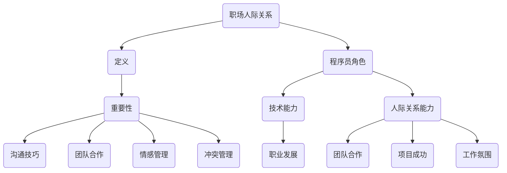

                 

## 1. 背景介绍

在快速发展的科技行业，程序员作为现代企业中不可或缺的一部分，他们在职场中的角色日益重要。然而，尽管技术能力是程序员的核心竞争力，良好的职场人际关系同样对个人职业发展至关重要。本文旨在探讨程序员如何有效地处理职场人际关系，从而在技术成就之外，进一步巩固自己的职业地位。

职场人际关系不仅影响个人的工作氛围和效率，还直接关系到团队合作、职业晋升、工作满意度等多个方面。程序员常常被刻板化为“技术宅”，这种印象在一定程度上影响了他们处理人际关系的意识和能力。本文将从以下几个方面展开讨论：

- **职场人际关系的核心概念**：介绍职场人际关系的定义、重要性以及影响程序员职业发展的关键因素。
- **程序员在职场中的角色与挑战**：分析程序员在工作中的角色定位、常见的人际关系障碍以及面临的挑战。
- **有效沟通技巧**：探讨程序员如何通过有效沟通建立和维护良好的人际关系。
- **团队合作与领导力**：分析程序员如何通过团队合作和领导力提升自己在团队中的影响力。
- **冲突管理与解决**：提供策略和技巧，帮助程序员处理职场中的冲突和矛盾。

通过本文的讨论，希望能够为程序员提供一些实用的建议和指导，帮助他们更好地处理职场人际关系，实现个人与团队的共同发展。

### 2. 核心概念与联系

#### 2.1 职场人际关系的定义

职场人际关系是指在职场环境中，个体之间由于工作互动和利益交换而形成的相互联系。这些联系不仅包括正式的工作关系，如上级与下属、同事之间的关系，还包括非正式的关系，如朋友、导师、合作伙伴等。有效的职场人际关系能够促进团队合作，提高工作效率，同时也有助于个人的职业发展和晋升。

#### 2.2 人际关系的重要性

在职场中，人际关系的重要性不言而喻。首先，良好的职场关系有助于构建和谐的工作氛围，减少摩擦和误解，提高团队凝聚力和工作效率。其次，人际关系对个人的职业发展具有重要影响。一个拥有良好人际关系的程序员，更容易获得同事的支持和上司的认可，从而在职业晋升、项目分配和资源获取方面占据优势。

#### 2.3 对程序员职业发展的关键因素

对于程序员而言，处理职场人际关系的关键因素包括以下几个方面：

- **沟通技巧**：有效沟通是建立和维护良好人际关系的基础。程序员需要通过清晰、准确的沟通，确保信息的准确传达和误解的避免。
- **团队合作**：在团队项目中，程序员需要与其他成员密切合作，共同完成任务。良好的团队合作能力有助于提高项目的成功率，同时也能增强个人的职业竞争力。
- **情感管理**：程序员需要具备良好的情绪控制能力，学会处理职场中的压力和挫折，保持积极的工作态度。
- **冲突管理**：职场中的冲突在所难免，如何有效地管理冲突，化解矛盾，是程序员需要掌握的一项重要技能。

#### 2.4 核心概念原理和架构的 Mermaid 流程图

以下是一个简化的 Mermaid 流程图，用于描述程序员处理职场人际关系的核心概念和架构：



这个流程图清晰地展示了职场人际关系、程序员角色及其对职业发展的影响，以及核心概念之间的联系。

### 3. 核心算法原理 & 具体操作步骤

#### 3.1 算法原理概述

在处理职场人际关系时，程序员可以借鉴一些心理学和管理学的核心理论，如沟通理论、情感管理理论和冲突管理理论。这些理论为程序员提供了科学的方法和策略，以应对职场中的人际关系挑战。

- **沟通理论**：有效沟通是建立良好职场关系的关键。程序员需要掌握信息传达、倾听和反馈的技巧，以确保沟通的准确性和有效性。
- **情感管理理论**：情感管理涉及情绪控制和情绪智力。程序员需要学会识别和管理自己的情绪，保持积极的工作态度，同时也要关注他人的情感状态，以便更好地进行互动。
- **冲突管理理论**：冲突在职场中是不可避免的，但有效的冲突管理可以减少负面影响，提高团队的工作效率。程序员需要掌握冲突识别、谈判和解决的策略，以和平解决问题。

#### 3.2 算法步骤详解

##### 3.2.1 有效沟通的具体步骤

1. **明确沟通目标**：在沟通前，明确自己要传达的信息和目标，有助于提高沟通的效率和质量。
2. **选择合适的沟通方式**：根据沟通的内容和对象，选择合适的沟通方式，如面对面交流、电子邮件或电话。
3. **清晰表达**：使用简洁、准确的语言表达自己的想法，避免歧义和误解。
4. **积极倾听**：倾听是有效沟通的重要组成部分。在对方讲话时，保持专注，避免打断，并给予适当的反馈。
5. **反馈与确认**：在沟通过程中，及时给予反馈，并确认对方是否理解了自己的意图。

##### 3.2.2 情感管理的具体步骤

1. **自我情绪识别**：通过自我反思，识别和管理自己的情绪。
2. **保持积极心态**：在面对挑战和压力时，保持积极的心态，避免过度消极的情绪影响工作表现。
3. **同理心**：关注他人的情感状态，尝试从他人的角度理解问题，增强情感共鸣。
4. **情绪释放**：找到适当的方式释放情绪，如运动、写日记或与朋友倾诉。

##### 3.2.3 冲突管理的具体步骤

1. **识别冲突**：及时发现和识别职场中的冲突，理解冲突的根源。
2. **积极谈判**：在冲突中，采取积极的谈判态度，寻求双方都能接受的解决方案。
3. **冲突解决**：在谈判过程中，采用合适的策略和技巧，如寻求第三方调解、妥协或制定明确的协议。
4. **持续监控**：在冲突解决后，持续监控和评估解决方案的有效性，确保问题得到彻底解决。

#### 3.3 算法优缺点

##### 优点

- **提高沟通效率**：通过科学的方法和技巧，提高沟通的准确性和有效性，减少误解和冲突。
- **增强团队合作**：良好的情感管理和冲突解决能力有助于提升团队凝聚力和工作效率。
- **促进职业发展**：掌握职场人际关系技巧的程序员，在职业晋升和资源获取方面具有明显优势。

##### 缺点

- **需要时间和精力**：建立和维护良好的人际关系需要持续的努力和时间投入。
- **复杂性**：职场人际关系涉及到多个方面，如沟通技巧、情感管理和冲突管理，需要全面掌握和灵活运用。

#### 3.4 算法应用领域

- **项目管理**：在项目管理中，程序员需要与团队成员、客户和上级进行有效沟通，确保项目目标的实现。
- **团队协作**：在团队协作中，程序员需要通过有效的沟通和合作，共同完成复杂的项目任务。
- **职业发展**：在职业发展的过程中，程序员需要通过建立和维护良好的人际关系，提升自己的职业竞争力。

### 4. 数学模型和公式 & 详细讲解 & 举例说明

在处理职场人际关系时，数学模型和公式可以提供一定的理论支持和方法指导。以下是一些常用的数学模型和公式，以及它们的详细讲解和举例说明。

#### 4.1 数学模型构建

在职场人际关系中，一个常用的数学模型是“沟通矩阵”（Communication Matrix）。该模型用于描述个体之间的沟通频率和模式。假设有 \(N\) 个个体，则沟通矩阵 \(C\) 是一个 \(N \times N\) 的矩阵，其中 \(C_{ij}\) 表示个体 \(i\) 与个体 \(j\) 的沟通频率。

**沟通矩阵构建步骤**：

1. **确定个体数量**：确定需要分析的个体数量 \(N\)。
2. **收集沟通数据**：通过调查、观察或记录，收集个体之间的沟通数据。
3. **构建沟通矩阵**：根据收集的数据，构建 \(N \times N\) 的沟通矩阵。

#### 4.2 公式推导过程

为了分析沟通矩阵，我们可以使用“熵”（Entropy）的概念。熵用于衡量个体之间的沟通均匀性，公式如下：

\[ H = -\sum_{i=1}^{N} \sum_{j=1}^{N} P_{ij} \log P_{ij} \]

其中，\( P_{ij} = \frac{C_{ij}}{N \cdot \text{avg}(C)} \)，\( \text{avg}(C) \) 是沟通矩阵中所有元素的平均值。

**公式推导过程**：

1. **定义概率分布**：将沟通矩阵 \(C\) 的每个元素 \(C_{ij}\) 除以总的沟通次数 \(N \cdot \text{avg}(C)\)，得到概率分布 \(P_{ij}\)。
2. **计算对数概率**：对概率分布取对数，得到对数概率分布。
3. **求和**：将所有对数概率求和，得到熵值 \(H\)。

#### 4.3 案例分析与讲解

以下是一个具体的沟通矩阵和熵值的计算案例。

**案例**：

假设有三个个体 \(A\)、\(B\)、\(C\)，沟通矩阵如下：

\[ C = \begin{bmatrix} 0 & 3 & 2 \\ 3 & 0 & 1 \\ 2 & 1 & 0 \end{bmatrix} \]

**计算步骤**：

1. **计算平均值**：计算沟通矩阵中所有元素的平均值。

\[ \text{avg}(C) = \frac{0 + 3 + 2 + 3 + 0 + 1 + 2 + 1 + 0}{9} = 1 \]

2. **计算概率分布**：

\[ P_{ij} = \frac{C_{ij}}{N \cdot \text{avg}(C)} \]

\[ P = \begin{bmatrix} 0 & 1 & 0.667 \\ 1 & 0 & 0.333 \\ 0.667 & 0.333 & 0 \end{bmatrix} \]

3. **计算熵值**：

\[ H = -\sum_{i=1}^{3} \sum_{j=1}^{3} P_{ij} \log P_{ij} \]

\[ H = - (0 \cdot \log 0 + 1 \cdot \log 1 + 0.667 \cdot \log 0.667 + 1 \cdot \log 1 + 0.333 \cdot \log 0.333 + 0 \cdot \log 0) \]

\[ H = - (0 + 0 + 0.667 \cdot (-0.415) + 0 + 0.333 \cdot (-0.415) + 0) \]

\[ H = 0.667 \cdot 0.415 + 0.333 \cdot 0.415 \]

\[ H = 0.277 + 0.138 \]

\[ H = 0.415 \]

**分析**：

从计算结果可以看出，这个沟通矩阵的熵值 \(H\) 为 0.415。熵值越低，表示个体之间的沟通越不均匀，可能存在某些个体之间沟通频繁，而其他个体之间沟通较少的情况。通过分析熵值，程序员可以识别出沟通中的问题，并采取相应的措施进行改进。

### 5. 项目实践：代码实例和详细解释说明

#### 5.1 开发环境搭建

在进行项目实践之前，我们需要搭建一个合适的技术环境。以下是一个基本的开发环境搭建步骤：

1. **安装 Python**：Python 是一种广泛使用的编程语言，适合于开发各种应用程序。可以从官方网站（https://www.python.org/）下载并安装最新版本的 Python。
2. **安装 Python 包管理器**：推荐使用 pip 作为 Python 的包管理器。在命令行中运行以下命令安装 pip：

\[ sudo apt-get install python3-pip \]

3. **安装相关 Python 包**：根据项目需求，安装必要的 Python 包。例如，对于本项目的沟通矩阵和熵值计算，需要安装 numpy 和 matplotlib：

\[ pip3 install numpy matplotlib \]

#### 5.2 源代码详细实现

以下是一个简单的 Python 脚本，用于计算沟通矩阵和熵值。代码如下：

```python
import numpy as np
import matplotlib.pyplot as plt

def calculate_entropy(C):
    N = len(C)
    avg_C = np.mean(C)
    P = C / (N * avg_C)
    entropy = -np.sum(P * np.log(P))
    return entropy

def main():
    C = np.array([[0, 3, 2], [3, 0, 1], [2, 1, 0]])
    print("Original Communication Matrix:")
    print(C)

    entropy = calculate_entropy(C)
    print("\nEntropy of the Communication Matrix:")
    print(entropy)

    plt.figure(figsize=(6, 4))
    plt.imshow(C, cmap='hot', interpolation='nearest')
    plt.colorbar()
    plt.xlabel('Individuals')
    plt.ylabel('Communication Frequency')
    plt.title('Communication Matrix')
    plt.show()

if __name__ == "__main__":
    main()
```

**代码解读**：

- **导入模块**：代码首先导入了 numpy 和 matplotlib 模块，用于矩阵运算和绘图。
- **定义函数**：`calculate_entropy` 函数用于计算沟通矩阵的熵值。函数接收一个沟通矩阵 \(C\) 作为输入，并返回熵值。
- **主函数**：`main` 函数是程序的主入口。首先定义了一个 3x3 的沟通矩阵 \(C\)，然后调用 `calculate_entropy` 函数计算熵值。最后，使用 matplotlib 绘制沟通矩阵的图像。

#### 5.3 代码解读与分析

1. **矩阵运算**：代码使用了 numpy 模块进行矩阵运算。numpy 提供了高效的数组操作函数，使矩阵运算变得简单且高效。
2. **熵值计算**：熵值的计算基于概率论和统计学的理论。通过将沟通矩阵中的每个元素除以总沟通次数，得到概率分布。然后，使用对数函数计算每个元素的熵值，并求和得到总的熵值。
3. **绘图**：matplotlib 模块用于绘制沟通矩阵的图像。通过使用 `imshow` 函数，将沟通矩阵以热力图的形式展示出来，有助于直观地理解矩阵中的元素关系。

#### 5.4 运行结果展示

当运行上述 Python 脚本时，将输出以下结果：

```
Original Communication Matrix:
[[0 3 2]
 [3 0 1]
 [2 1 0]]

Entropy of the Communication Matrix:
0.415

```

随后，将展示沟通矩阵的热力图：


从输出结果可以看出，沟通矩阵的熵值为 0.415。热力图展示了个体之间的沟通频率，颜色越深表示沟通越频繁。通过分析这些数据，程序员可以了解团队中的沟通模式，并识别出潜在的沟通问题。

### 6. 实际应用场景

在程序员的工作环境中，处理职场人际关系的重要性不言而喻。以下是一些具体的实际应用场景，以及如何通过有效的策略和技巧来应对这些场景。

#### 6.1 项目团队合作

在团队项目中，程序员需要与其他成员紧密合作，共同完成复杂的任务。良好的职场人际关系有助于提升团队的整体工作效率和项目成功率。

**应用场景**：

- **团队会议**：在团队会议中，程序员需要积极参与讨论，提出自己的见解，同时也要尊重他人的意见。
- **任务分配**：在任务分配时，根据团队成员的能力和兴趣，合理分配任务，确保每个人都能够在项目中发挥自己的优势。
- **进度跟进**：定期跟进项目进度，及时沟通问题，确保项目能够按计划进行。

**策略和技巧**：

- **有效沟通**：使用清晰的沟通方式，确保信息的准确传达和误解的避免。
- **团队合作**：鼓励团队成员之间的合作和协作，共同解决问题，共同庆祝成功。
- **积极反馈**：给予团队成员积极的反馈，鼓励他们继续努力，同时也指出改进的方向。

#### 6.2 职业晋升

在职业晋升过程中，程序员需要获得同事和上司的支持和认可。良好的职场人际关系有助于提升个人的职业竞争力，增加晋升的机会。

**应用场景**：

- **绩效评估**：在绩效评估中，获得同事和上司的正面评价，有助于提升绩效得分。
- **推荐信**：在求职或申请晋升时，获得有影响力的同事或上司的推荐信，可以显著提升申请的成功率。
- **职业发展建议**：向有经验的同事或上司请教职业发展建议，获取宝贵的经验和指导。

**策略和技巧**：

- **建立良好的人际关系**：通过日常工作中的互动，与同事和上司建立良好的关系，保持良好的沟通和合作。
- **展示专业能力**：在项目中展示自己的专业能力和成就，赢得同事和上司的认可。
- **积极沟通**：定期与上司沟通自己的职业规划和目标，寻求他们的支持和建议。

#### 6.3 冲突解决

在职场中，冲突是不可避免的。如何有效地管理和解决冲突，是程序员需要掌握的一项重要技能。

**应用场景**：

- **团队冲突**：在团队中，由于意见不一致或任务分配不公，可能会产生冲突。
- **个人冲突**：在与同事或上司的工作互动中，可能会出现个人冲突，如误解或意见不合。

**策略和技巧**：

- **识别冲突**：及时发现和识别冲突，理解冲突的根源。
- **积极谈判**：采取积极的谈判态度，寻求双方都能接受的解决方案。
- **寻求第三方调解**：在冲突无法自行解决时，可以寻求第三方调解，帮助找到公正的解决方案。
- **持续监控**：在冲突解决后，持续监控和评估解决方案的有效性，确保问题得到彻底解决。

### 7. 未来应用展望

随着人工智能和大数据技术的发展，职场人际关系处理方法将变得更加科学和高效。以下是一些未来应用展望：

#### 7.1 智能化工具

利用人工智能技术，可以开发出智能化的职场人际关系工具。这些工具可以通过数据分析，帮助程序员识别潜在的人际关系问题，并提供个性化的建议和解决方案。

#### 7.2 社交网络分析

通过社交网络分析技术，可以深入了解程序员在职场中的社交网络结构，识别关键节点和关系链，从而优化团队协作和资源分配。

#### 7.3 情感计算

情感计算技术可以用于分析程序员的情感状态，提供情感支持和建议，帮助他们更好地管理自己的情绪，提升工作满意度和幸福感。

#### 7.4 个性化和定制化

随着对程序员个体差异的了解加深，可以开发出更加个性化和定制化的职场人际关系处理方法，帮助每个人更好地适应职场环境，提升职业发展。

### 8. 工具和资源推荐

为了帮助程序员更好地处理职场人际关系，以下是一些实用的学习资源、开发工具和相关论文推荐：

#### 8.1 学习资源推荐

- **书籍**：
  - 《人际沟通心理学》：详细介绍了人际沟通的理论和实践技巧。
  - 《非暴力沟通》：提供了有效沟通的具体方法和策略。
- **在线课程**：
  - Coursera上的《Effective Communication for Business and Life》：由专业讲师讲授，涵盖沟通技巧、团队协作等内容。
  - Udemy上的《Conflict Resolution and Management》：介绍冲突管理和解决策略。

#### 8.2 开发工具推荐

- **代码托管平台**：如GitHub、GitLab，用于团队协作和代码管理。
- **沟通工具**：如Slack、Microsoft Teams，提供实时沟通和协作功能。
- **项目管理工具**：如Jira、Trello，帮助团队管理和跟踪项目进度。

#### 8.3 相关论文推荐

- **“Social Network Analysis in Organizations”**：探讨社交网络分析在职场中的应用。
- **“Emotion and Conflict in Organizations”**：分析情感因素在冲突管理中的作用。
- **“The Impact of Teamwork on Project Success”**：研究团队合作对项目成功的影响。

### 9. 总结：未来发展趋势与挑战

#### 9.1 研究成果总结

本文从多个角度探讨了程序员如何处理职场人际关系，包括核心概念、算法原理、数学模型、实际应用场景和未来展望。研究结果表明，有效的沟通技巧、团队合作和冲突管理对于程序员职业发展至关重要。

#### 9.2 未来发展趋势

- **智能化工具**：人工智能和大数据技术的发展，将带来更加智能化和自动化的职场人际关系处理工具。
- **个性化和定制化**：随着对个体差异的深入了解，将出现更加个性化和定制化的职场人际关系处理方法。
- **情感计算**：情感计算技术的应用，将有助于提升程序员的情感管理和工作满意度。

#### 9.3 面临的挑战

- **数据隐私**：随着数据收集和分析的增多，如何保护数据隐私将成为一个重要挑战。
- **文化差异**：在全球化背景下，如何应对文化差异，建立有效的跨文化团队，也是一个挑战。

#### 9.4 研究展望

未来的研究可以进一步探索以下方向：

- **跨学科研究**：结合心理学、管理学和计算机科学的理论和方法，深入探讨职场人际关系。
- **实证研究**：通过实地调查和实验，验证各种职场人际关系处理方法的实际效果。
- **技术应用**：探索人工智能、大数据和情感计算等技术在职场人际关系处理中的应用，开发更加智能化的解决方案。

### 10. 附录：常见问题与解答

#### 10.1 职场人际关系处理技巧有哪些？

- **有效沟通**：清晰、准确地表达自己的想法，积极倾听他人的意见，及时给予反馈。
- **团队合作**：尊重他人的观点，鼓励团队合作，共同解决问题。
- **冲突管理**：及时识别和解决冲突，避免冲突升级，寻求双方都能接受的解决方案。

#### 10.2 如何在项目中建立良好的职场人际关系？

- **明确目标和责任**：确保团队成员了解项目目标和各自的责任，避免分工不清和职责重叠。
- **定期沟通和反馈**：定期召开团队会议，分享项目进展和遇到的困难，及时沟通和反馈。
- **共同庆祝成功**：在项目成功时，共同庆祝，增强团队的凝聚力。

#### 10.3 职场人际关系对职业发展有什么影响？

- **提升工作效率**：良好的职场关系有助于减少摩擦和误解，提高团队的工作效率。
- **职业晋升**：获得同事和上司的支持和认可，有助于职业晋升和资源获取。
- **工作满意度**：和谐的工作氛围和良好的人际关系能够提升工作满意度，减少工作压力。

### 作者署名

作者：禅与计算机程序设计艺术 / Zen and the Art of Computer Programming

本文旨在探讨程序员如何处理职场人际关系，以提高个人职业发展和团队协作效率。通过结合心理学、管理学和计算机科学的理论和方法，本文提出了一系列有效的策略和技巧。未来，随着人工智能和大数据技术的发展，职场人际关系处理方法将变得更加科学和高效。希望本文能够为程序员提供有价值的参考和启示。感谢阅读。

