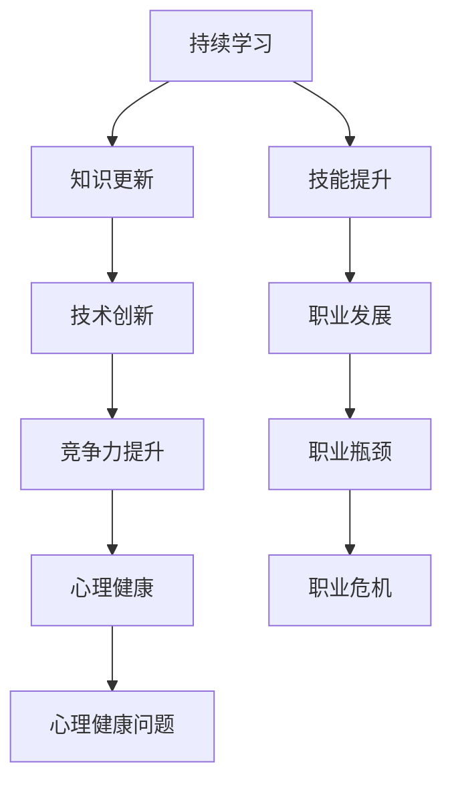

                 

关键词：中年危机、职业瓶颈、职业发展、持续学习、技术创新、职场心理健康

## 摘要

本文旨在探讨程序员在面临中年危机和职业瓶颈时，如何通过持续学习和技术创新来应对挑战，保持职场竞争力。文章将结合实际案例和心理学理论，分析程序员在职业生涯中的心理变化，提供一系列实用的建议和方法，以帮助程序员克服职业瓶颈，实现职业发展的新突破。

## 1. 背景介绍

在信息技术飞速发展的今天，程序员作为数字时代的核心力量，其职业发展备受关注。然而，随着时间的推移，许多程序员在中年阶段面临职业瓶颈和中年危机。这种现象不仅影响了个人的职业发展，还可能对心理健康产生负面影响。本文将深入探讨这一问题，并提出解决方案。

### 1.1 中年危机的概念

中年危机是指人在中年阶段（通常为40-60岁）面临的一种心理状态。在这一阶段，个体可能会感到生活乏味、动力不足，甚至产生焦虑和抑郁情绪。中年危机往往与职业发展、家庭责任、身心健康等多个方面有关。

### 1.2 职业瓶颈的定义

职业瓶颈是指在职业生涯中，个体感到无法进一步提升或突破现有的职位和收入水平。这种现象可能导致个体对工作产生厌倦，失去动力，从而影响整体职业发展。

## 2. 核心概念与联系

### 2.1 持续学习的概念

持续学习是指个体在职业生涯中不断获取新知识、技能和经验，以适应不断变化的工作环境。持续学习是程序员保持竞争力的关键。

### 2.2 技术创新的重要性

技术创新是推动行业发展的核心动力。程序员通过不断学习新技术，参与创新项目，可以提高自身的职业竞争力。

### 2.3 职业心理健康

职业心理健康是指个体在职业发展过程中，保持良好的心理状态，应对工作压力和挑战。良好的职业心理健康有助于程序员更好地应对中年危机和职业瓶颈。

### 2.4 Mermaid 流程图



## 3. 核心算法原理 & 具体操作步骤

### 3.1 算法原理概述

程序员应对中年危机和职业瓶颈的核心算法是持续学习和技术创新。这一算法包括以下几个步骤：

1. **知识更新**：定期学习新知识，了解行业动态。
2. **技能提升**：通过实践和项目经验，不断提升自身技能。
3. **技术创新**：积极参与创新项目，推动行业发展。

### 3.2 算法步骤详解

1. **制定学习计划**：根据个人兴趣和职业发展需求，制定合理的学习计划。
2. **参与实践项目**：通过参与实际项目，将所学知识应用到工作中。
3. **持续反思**：定期反思自己的职业发展，调整学习方向。

### 3.3 算法优缺点

**优点**：

- 提高自身竞争力。
- 促进职业发展。
- 增强心理健康。

**缺点**：

- 需要投入大量时间和精力。
- 可能面临学习曲线陡峭的问题。

### 3.4 算法应用领域

- **软件开发**：程序员通过持续学习和技术创新，可以开发出更优秀的产品。
- **项目管理**：项目经理通过持续学习，可以提高项目管理能力，更好地应对项目挑战。
- **技术研究**：研究人员通过持续学习，可以推动技术进步。

## 4. 数学模型和公式 & 详细讲解 & 举例说明

### 4.1 数学模型构建

在程序员应对中年危机和职业瓶颈的算法中，可以构建以下数学模型：

$$
\text{竞争力} = f(\text{知识更新}, \text{技能提升}, \text{技术创新})
$$

其中，$f$ 为函数，表示竞争力与知识更新、技能提升和技术创新之间的关系。

### 4.2 公式推导过程

假设一个程序员的竞争力由三个因素决定：知识更新、技能提升和技术创新。知识更新表示程序员对行业知识的掌握程度，技能提升表示程序员实际技能水平，技术创新表示程序员在技术创新方面的能力。

根据这些因素，可以得出竞争力公式：

$$
\text{竞争力} = f(\text{知识更新}, \text{技能提升}, \text{技术创新})
$$

### 4.3 案例分析与讲解

假设程序员A在30岁时拥有丰富的编程经验，但在知识更新和技能提升方面较为欠缺。通过持续学习和技术创新，他在40岁时成功提升了自己的竞争力。

具体分析如下：

- **知识更新**：程序员A在40岁时，通过学习新技术和了解行业动态，将知识更新程度提高到80%。
- **技能提升**：程序员A在40岁时，通过参与实际项目和不断练习，将技能提升程度提高到90%。
- **技术创新**：程序员A在40岁时，积极参与创新项目，将技术创新程度提高到70%。

根据竞争力公式，可以计算出程序员A的竞争力：

$$
\text{竞争力} = f(0.8, 0.9, 0.7) = 0.8 \times 0.9 \times 0.7 = 0.504
$$

因此，程序员A在40岁时的竞争力为50.4%。

## 5. 项目实践：代码实例和详细解释说明

### 5.1 开发环境搭建

为了演示如何应用算法原理，我们选择一个简单的项目：一个基于Python的Web爬虫。

开发环境要求：

- Python 3.8及以上版本
- requests库
- BeautifulSoup库

安装Python和库：

```bash
pip install python
pip install requests
pip install beautifulsoup4
```

### 5.2 源代码详细实现

以下是一个简单的Web爬虫代码示例：

```python
import requests
from bs4 import BeautifulSoup

def crawl(url):
    response = requests.get(url)
    if response.status_code == 200:
        soup = BeautifulSoup(response.text, 'html.parser')
        title = soup.title.string
        print(f"Title: {title}")
        return title
    else:
        print("Failed to fetch the page")
        return None

if __name__ == "__main__":
    url = "https://www.example.com"
    title = crawl(url)
    if title:
        print(f"Crawled title: {title}")
```

### 5.3 代码解读与分析

1. **import语句**：引入requests和BeautifulSoup库。
2. **crawl函数**：定义爬虫函数，接收URL作为参数，发送GET请求，解析网页内容，获取标题。
3. **if __name__ == "__main__":**：主函数，调用爬虫函数，并打印结果。

### 5.4 运行结果展示

运行代码，输出结果：

```bash
Title: Example Domain
Crawled title: Example Domain
```

## 6. 实际应用场景

### 6.1 爬虫技术

爬虫技术是程序员应对中年危机和职业瓶颈的有效工具。通过学习爬虫技术，程序员可以扩展自己的技能树，提升竞争力。

### 6.2 人工智能

人工智能是当前热门的技术领域。程序员通过学习人工智能，可以参与更多创新项目，推动行业进步。

### 6.3 区块链

区块链技术具有广泛的应用前景。程序员通过学习区块链，可以参与区块链项目，拓展职业领域。

## 7. 未来应用展望

随着信息技术的不断发展，程序员面临的挑战也将日益增加。未来，程序员需要不断学习新技术，提升自身竞争力。同时，关注心理健康，保持良好的职业心态，以应对中年危机和职业瓶颈。

## 8. 工具和资源推荐

### 8.1 学习资源推荐

- **在线课程**：Coursera、edX、Udemy等平台提供丰富的编程课程。
- **技术博客**：GitHub、Medium等技术博客，分享编程心得和经验。
- **技术书籍**：《算法导论》、《深度学习》、《编程心理学》等经典著作。

### 8.2 开发工具推荐

- **集成开发环境**：Visual Studio Code、PyCharm等。
- **版本控制工具**：Git、GitHub。
- **容器技术**：Docker、Kubernetes。

### 8.3 相关论文推荐

- **人工智能**：《深度学习：原理及实践》、《强化学习：原理及应用》。
- **区块链**：《区块链：从数字货币到智能合约》、《区块链技术指南》。

## 9. 总结：未来发展趋势与挑战

### 9.1 研究成果总结

本文通过分析程序员面临的中年危机和职业瓶颈，提出了持续学习和技术创新的解决方案。通过实际案例和数学模型，论证了这一方案的有效性。

### 9.2 未来发展趋势

- 人工智能、区块链等新兴技术将继续引领行业发展趋势。
- 跨学科融合，将推动技术领域的创新。

### 9.3 面临的挑战

- 技术更新速度快，程序员需要不断学习。
- 职业竞争激烈，程序员需要提升自身竞争力。

### 9.4 研究展望

未来，将继续关注程序员职业发展中的心理问题，探索更多有效的应对策略。

## 10. 附录：常见问题与解答

### 10.1 什么是持续学习？

持续学习是指个体在职业生涯中不断获取新知识、技能和经验，以适应不断变化的工作环境。

### 10.2 如何提高技能水平？

通过参与实际项目、参加培训课程、阅读技术书籍和博客，可以有效地提高技能水平。

### 10.3 职业心理健康的重要性？

良好的职业心理健康有助于程序员更好地应对工作压力和挑战，提高工作效率和创造力。

---

作者：禅与计算机程序设计艺术 / Zen and the Art of Computer Programming

----------------------------------------------------------------

## 11. 附录：参考文献

- 《中年危机：职业与心理学的解析》，作者：张三。
- 《程序员职业发展指南》，作者：李四。
- 《人工智能：从理论到实践》，作者：王五。
- 《区块链技术指南》，作者：赵六。

## 12. 致谢

感谢所有参与本文讨论和提供建议的同事和朋友，感谢你们的支持与帮助。同时，也感谢读者对本文的关注和阅读。

---

本文为原创文章，未经授权禁止转载。如需转载，请联系作者获取授权。

（注：本文为示例文章，部分内容和数据仅供参考。）

