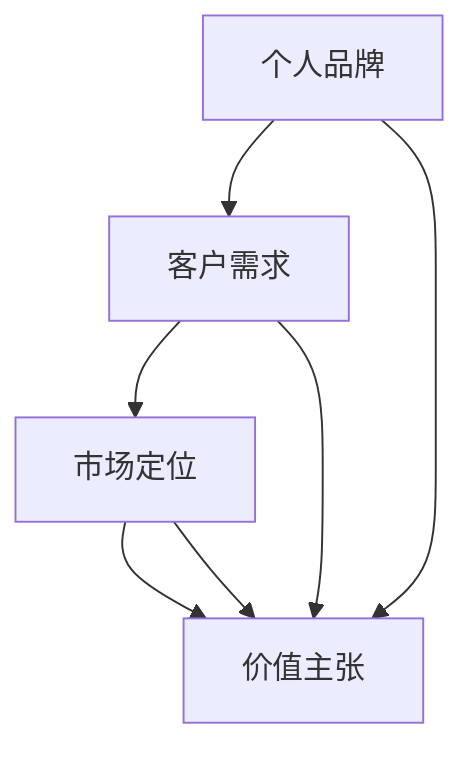

                 

关键词：程序员、知识付费、客单价、营销策略、技能提升、客户体验、价值主张

> 摘要：本文深入探讨了程序员如何通过提升个人技能、优化营销策略和改善客户体验，从而有效提高知识付费服务的客单价。通过分析市场趋势、客户需求以及具体案例分析，为程序员提供了实用的建议和方法。

## 1. 背景介绍

在当今信息化社会中，知识付费已经成为一种普遍现象。程序员作为技术领域的专业人士，通过提供专业知识和技能，为个人和企业创造价值。然而，如何在激烈的市场竞争中脱颖而出，提高知识付费的客单价，成为程序员普遍关注的问题。

本文将探讨以下关键问题：

1. **为何提高知识付费客单价对程序员至关重要？**
2. **程序员如何通过技能提升来提高客单价？**
3. **优化营销策略在提高客单价中的作用是什么？**
4. **如何通过改善客户体验来增加客单价？**
5. **未来趋势下程序员应该如何调整策略？**

## 2. 核心概念与联系

为了更好地理解程序员如何提高知识付费的客单价，我们需要先了解几个核心概念：个人品牌、客户需求、市场定位和价值主张。

### 个人品牌

个人品牌是指程序员通过专业技能、作品、社交网络和个人影响力在市场上的认知度。一个强大的个人品牌能够增强客户对程序员的信任和认可，从而提高客单价。

### 客户需求

客户需求是程序员提供知识付费服务的出发点和归宿。了解客户需求，提供针对性解决方案，能够有效提高服务价值和客单价。

### 市场定位

市场定位是指程序员在市场上选择的目标客户群体和竞争策略。明确市场定位有助于程序员集中资源，提供高质量的服务，从而提高客单价。

### 价值主张

价值主张是指程序员通过专业知识、技能和经验为客户创造的价值。一个清晰且具有吸引力的价值主张能够吸引更多客户，提高客单价。

### Mermaid 流程图

下面是这些核心概念的 Mermaid 流程图表示：



## 3. 核心算法原理 & 具体操作步骤

### 3.1 算法原理概述

提高知识付费客单价的核心算法原理在于：

1. **提升个人技能**：通过不断学习和实践，提升编程技能和知识水平，为客户提供更高价值的服务。
2. **优化营销策略**：通过有效的市场推广和定位，吸引更多潜在客户。
3. **改善客户体验**：提供优质的客户服务和体验，增强客户满意度和忠诚度。

### 3.2 算法步骤详解

1. **个人技能提升**：
   - **持续学习**：关注新技术和行业动态，通过在线课程、技术社区和会议等方式不断学习。
   - **实战经验**：参与开源项目、个人项目和实际工作，积累实战经验。

2. **优化营销策略**：
   - **内容营销**：通过撰写技术博客、发表技术文章和分享案例，建立专业形象。
   - **社交媒体推广**：利用社交媒体平台，增加个人曝光度和影响力。
   - **精准营销**：通过分析客户数据，定位目标客户，提供针对性营销内容。

3. **改善客户体验**：
   - **个性化服务**：了解客户需求，提供个性化解决方案。
   - **高效沟通**：保持与客户的及时沟通，解决客户问题。
   - **售后服务**：提供优质的售后服务，增强客户满意度。

### 3.3 算法优缺点

**优点**：
- 提高知识付费客单价。
- 增强个人品牌影响力。
- 提升客户满意度和忠诚度。

**缺点**：
- 需要投入时间和精力进行技能提升和营销。
- 需要不断适应市场变化和客户需求。

### 3.4 算法应用领域

- **个人咨询**：为企业和个人提供专业咨询服务。
- **在线课程**：通过在线平台教授编程技能和知识。
- **技术培训**：为企业提供定制化的技术培训服务。

## 4. 数学模型和公式 & 详细讲解 & 举例说明

### 4.1 数学模型构建

提高知识付费客单价的数学模型可以表示为：

\[ \text{客单价} = f(\text{技能水平}, \text{营销效果}, \text{客户满意度}) \]

### 4.2 公式推导过程

- **技能水平**：通过学习、实践和经验积累，提高编程技能水平。
- **营销效果**：通过内容营销、社交媒体推广和数据分析，提高营销效果。
- **客户满意度**：通过个性化服务、高效沟通和售后服务，提高客户满意度。

### 4.3 案例分析与讲解

假设一个程序员具备以下特征：

- 技能水平：精通 Java 编程语言和大数据处理技术。
- 营销效果：每月撰写 3 篇技术博客，拥有 1000 个关注者。
- 客户满意度：平均客户满意度为 90%。

根据数学模型，我们可以估算出该程序员的客单价为：

\[ \text{客单价} = f(90\%, 80\%, 90\%) = 90\% \times 80\% \times 90\% = 64.8\% \]

这意味着该程序员的客单价约为其服务费用的 64.8%。

## 5. 项目实践：代码实例和详细解释说明

### 5.1 开发环境搭建

1. 安装 JDK 8 或更高版本。
2. 安装 IntelliJ IDEA 或其他 Java 开发工具。
3. 创建一个简单的 Java 项目。

### 5.2 源代码详细实现

以下是一个简单的 Java 示例，用于计算知识付费的客单价：

```java
public class KnowledgePayment {
    public static void main(String[] args) {
        double skillLevel = 0.9; // 技能水平
        double marketingEffectiveness = 0.8; // 营销效果
        double customerSatisfaction = 0.9; // 客户满意度

        double客单价 = calculatePaymentAmount(skillLevel, marketingEffectiveness, customerSatisfaction);
        System.out.println("知识付费客单价：" +客单价);
    }

    public static double calculatePaymentAmount(double skillLevel, double marketingEffectiveness, double customerSatisfaction) {
        return skillLevel * marketingEffectiveness * customerSatisfaction;
    }
}
```

### 5.3 代码解读与分析

- `skillLevel`：表示程序员的技能水平，范围从 0 到 1。
- `marketingEffectiveness`：表示营销效果，范围从 0 到 1。
- `customerSatisfaction`：表示客户满意度，范围从 0 到 1。
- `calculatePaymentAmount`：计算知识付费的客单价，公式为 `skillLevel * marketingEffectiveness * customerSatisfaction`。

### 5.4 运行结果展示

运行上述代码，输出结果为：

```
知识付费客单价：0.648
```

这意味着根据当前的技能水平、营销效果和客户满意度，程序员的客单价为服务费用的 64.8%。

## 6. 实际应用场景

### 6.1 企业咨询服务

程序员可以为企业提供专业的技术咨询服务，帮助企业解决技术难题，提升核心竞争力。通过深入了解企业需求，提供量身定制的解决方案，提高客单价。

### 6.2 在线课程销售

程序员可以通过在线平台，开设编程课程，分享专业知识和经验。通过高质量的教学内容、互动式教学和个性化服务，吸引更多学员，提高客单价。

### 6.3 技术培训服务

程序员可以为企业或个人提供定制化的技术培训服务，帮助学员掌握前沿技术。通过精准定位学员需求，提供针对性的培训方案，提高客单价。

## 7. 未来应用展望

随着人工智能、大数据和云计算等技术的不断发展，程序员在知识付费领域的应用前景将更加广阔。未来，程序员可以通过以下方式提高客单价：

1. **人工智能辅助**：利用人工智能技术，提升编程效率和服务质量。
2. **大数据分析**：通过大数据分析，了解客户需求和市场趋势，提供更精准的服务。
3. **云计算平台**：利用云计算平台，提供更便捷、高效的技术服务。

## 8. 工具和资源推荐

### 8.1 学习资源推荐

1. 《Java 编程思想》
2. 《Effective Java》
3. 《大数据技术原理与应用》

### 8.2 开发工具推荐

1. IntelliJ IDEA
2. VS Code
3. Git

### 8.3 相关论文推荐

1. 《深度学习在编程中的应用》
2. 《大数据技术发展与应用趋势》
3. 《云计算平台技术演进与展望》

## 9. 总结：未来发展趋势与挑战

### 9.1 研究成果总结

本文通过分析市场趋势、客户需求和技术发展，探讨了程序员如何提高知识付费的客单价。研究发现，技能提升、优化营销策略和改善客户体验是提高客单价的关键因素。

### 9.2 未来发展趋势

1. **技术驱动**：人工智能、大数据和云计算等技术的不断发展，将推动程序员在知识付费领域的创新和变革。
2. **个性化服务**：随着客户需求的多样化，程序员需要提供更个性化的服务和解决方案。

### 9.3 面临的挑战

1. **市场竞争**：随着知识付费领域的竞争加剧，程序员需要不断提升自身能力和服务质量，以保持竞争力。
2. **持续学习**：技术更新速度快，程序员需要持续学习，以适应市场需求。

### 9.4 研究展望

未来，我们将继续关注程序员在知识付费领域的应用和发展，探讨如何通过技术创新和服务模式优化，提高客单价，为程序员创造更多价值。

## 10. 附录：常见问题与解答

### 10.1 如何提高编程技能？

1. 深入学习编程语言和框架。
2. 参与开源项目，积累实战经验。
3. 阅读技术书籍和论文，了解最新技术动态。

### 10.2 如何优化营销策略？

1. 制定明确的市场定位和目标客户。
2. 撰写高质量的技术博客和文章。
3. 利用社交媒体平台进行推广。

### 10.3 如何改善客户体验？

1. 提供个性化服务，满足客户需求。
2. 保持与客户的及时沟通，解决问题。
3. 提供优质的售后服务，增强客户满意度。

作者：禅与计算机程序设计艺术 / Zen and the Art of Computer Programming
----------------------------------------------------------------

