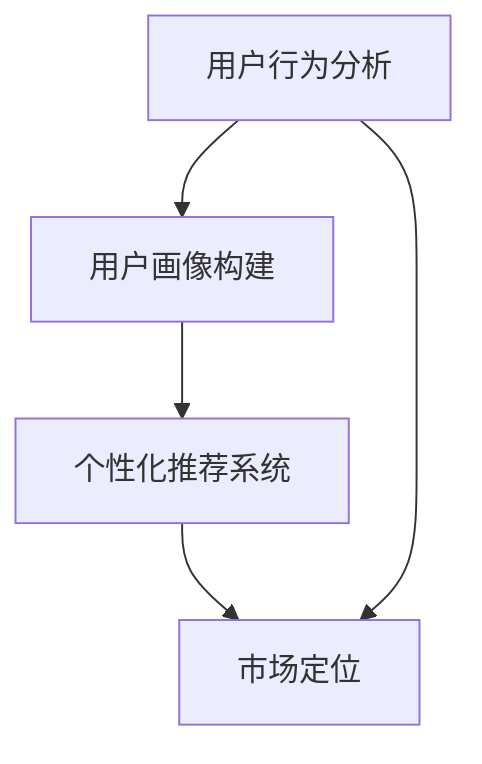

                 

关键词：知识付费、用户细分、程序员、用户分析、市场定位、个性化推荐、用户行为分析

> 摘要：本文旨在探讨程序员在进行知识付费时如何通过用户细分策略，提升付费效果和用户满意度。我们将从用户行为的分析方法、用户画像的构建、个性化推荐系统以及市场定位等方面，详细解析程序员如何进行有效的用户细分。

## 1. 背景介绍

在知识付费日益兴起的今天，程序员作为知识经济的重要参与者，需要面对庞大的用户群体。如何有效地进行用户细分，从而提升知识付费的转化率和用户满意度，成为了一个关键问题。用户细分不仅仅是市场定位的手段，更是提升产品和服务质量的重要策略。通过对用户进行精准细分，程序员可以更好地理解用户需求，提供更加个性化的服务。

### 1.1 知识付费的现状

知识付费是一种以内容付费为主要形式的知识传播方式，其核心在于通过互联网平台，将知识以可支付的形式提供给用户。近年来，随着互联网的普及和人们消费观念的转变，知识付费市场迅速发展，呈现出以下特点：

1. **市场规模扩大**：知识付费市场从2016年的100亿元增长到2020年的近2000亿元，年均复合增长率超过40%。
2. **用户结构多元**：知识付费用户涵盖了从初学者到专业人士的各个层次，职业分布广泛。
3. **内容形式丰富**：知识付费内容从传统的文字、音频、视频扩展到直播、社群等多种形式。

### 1.2 用户细分的重要性

用户细分在知识付费中具有至关重要的作用，主要体现在以下几个方面：

1. **提高转化率**：通过用户细分，可以针对不同类型的用户推出定制化的产品和服务，提高用户的购买意愿。
2. **提升用户体验**：精准的用户细分有助于提供个性化的内容推荐，提升用户的使用体验。
3. **降低运营成本**：用户细分可以帮助平台更有效地分配资源，减少不必要的市场推广和内容制作成本。
4. **优化产品设计**：了解用户特征和需求有助于优化产品设计，提升产品的市场竞争力。

## 2. 核心概念与联系

为了更好地理解用户细分在知识付费中的应用，我们需要明确几个核心概念和它们之间的联系。

### 2.1 用户行为分析

用户行为分析是指通过技术手段对用户在知识付费平台上的行为进行数据收集和分析，以了解用户的兴趣、需求和偏好。用户行为分析通常包括以下步骤：

1. **数据收集**：通过日志分析、API接口调用等手段收集用户行为数据。
2. **数据清洗**：对收集到的原始数据进行清洗，去除重复和无用信息。
3. **数据分析**：利用统计分析、机器学习等技术，对用户行为数据进行分析和建模。
4. **结果应用**：根据分析结果，调整产品和服务策略，提升用户体验。

### 2.2 用户画像

用户画像是对用户特征的综合描述，通常包括基本信息、行为数据、兴趣偏好等多个方面。构建用户画像的目的是为了更好地了解用户，为其提供个性化服务。

1. **基本信息**：如年龄、性别、职业、地域等。
2. **行为数据**：如浏览记录、购买历史、互动行为等。
3. **兴趣偏好**：如内容偏好、学习目标、关注领域等。

### 2.3 个性化推荐系统

个性化推荐系统是利用用户行为数据和用户画像，为用户推荐其可能感兴趣的内容和服务。个性化推荐系统通常包括以下模块：

1. **内容模块**：提供推荐内容，包括课程、文章、视频等。
2. **推荐算法**：根据用户行为数据和用户画像，计算推荐内容的相似度和兴趣度。
3. **推荐引擎**：根据算法计算结果，生成推荐列表。

### 2.4 市场定位

市场定位是指企业根据用户细分结果，确定目标市场和目标用户群体，以制定相应的营销策略。市场定位通常包括以下步骤：

1. **市场细分**：根据用户特征和需求，将市场划分为不同的子市场。
2. **目标市场选择**：根据企业资源和能力，选择最具潜力的目标市场。
3. **定位策略制定**：确定目标市场中的竞争优势和定位策略。

### 2.5 Mermaid 流程图

下面是用户细分过程中几个核心概念之间的 Mermaid 流程图：



## 3. 核心算法原理 & 具体操作步骤

### 3.1 算法原理概述

用户细分的核心算法通常包括用户行为分析、用户画像构建、推荐算法和市场定位策略。以下是这些算法的基本原理：

1. **用户行为分析**：通过数据挖掘和机器学习技术，分析用户在知识付费平台上的行为数据，提取用户的兴趣偏好和需求特征。
2. **用户画像构建**：将用户行为分析的结果进行整合，形成用户画像，用于后续的推荐和市场定位。
3. **推荐算法**：利用协同过滤、内容推荐等技术，根据用户画像和内容特征，为用户推荐感兴趣的内容。
4. **市场定位策略**：根据用户细分结果，确定目标市场和用户群体，制定相应的营销策略。

### 3.2 算法步骤详解

1. **用户行为分析**
    - **数据收集**：收集用户在知识付费平台上的浏览、购买、评价等行为数据。
    - **数据处理**：对原始数据进行清洗和整合，去除重复和无用信息。
    - **特征提取**：利用机器学习算法，提取用户的行为特征和兴趣偏好。

2. **用户画像构建**
    - **画像整合**：将用户行为分析的结果进行整合，形成用户画像。
    - **画像存储**：将用户画像存储到数据库中，以便后续使用。

3. **推荐算法**
    - **内容模块**：构建推荐内容库，包括课程、文章、视频等。
    - **推荐算法选择**：根据用户画像和内容特征，选择合适的推荐算法，如协同过滤、内容推荐等。
    - **推荐结果生成**：根据算法计算结果，生成推荐列表。

4. **市场定位策略**
    - **市场细分**：根据用户特征和需求，将市场划分为不同的子市场。
    - **目标市场选择**：根据企业资源和能力，选择最具潜力的目标市场。
    - **定位策略制定**：确定目标市场中的竞争优势和定位策略。

### 3.3 算法优缺点

1. **用户行为分析**
    - **优点**：可以准确了解用户的行为和兴趣偏好，为推荐和市场定位提供基础。
    - **缺点**：需要大量的用户行为数据，对数据处理和特征提取的要求较高。

2. **用户画像构建**
    - **优点**：可以全面了解用户特征，为推荐和市场定位提供支持。
    - **缺点**：用户画像的准确性受数据质量和特征提取方法的影响。

3. **推荐算法**
    - **优点**：可以根据用户画像和内容特征，为用户推荐感兴趣的内容，提升用户体验。
    - **缺点**：推荐结果的准确性受算法选择和数据质量的影响。

4. **市场定位策略**
    - **优点**：可以帮助企业明确目标市场和用户群体，制定有效的营销策略。
    - **缺点**：市场定位策略的实施需要大量的资源和时间。

### 3.4 算法应用领域

用户细分算法在知识付费、电子商务、社交媒体等多个领域都有广泛的应用。以下是几个典型的应用案例：

1. **知识付费**：通过用户细分，可以为不同类型的用户推荐适合的学习内容，提升用户的学习效果和满意度。
2. **电子商务**：通过用户细分，可以针对不同的用户群体推出定制化的商品和服务，提高销售转化率。
3. **社交媒体**：通过用户细分，可以为用户提供个性化的内容推荐，提升用户活跃度和黏性。

## 4. 数学模型和公式 & 详细讲解 & 举例说明

### 4.1 数学模型构建

用户细分过程中的数学模型主要涉及用户行为分析、用户画像构建和推荐算法。以下是这些模型的基本公式和概念：

1. **用户行为分析模型**
    - **用户兴趣度**：\( I(u, c) = \sum_{i \in C} w_i \cdot x_i(u) \)
    - **用户行为特征**：\( x_i(u) = \begin{cases} 
      1 & \text{如果用户} u \text{有行为} i \\
      0 & \text{否则}
      \end{cases} \)
    - **内容特征**：\( w_i = \text{权值，表示特征} i \text{的重要性} \)

2. **用户画像构建模型**
    - **用户画像**：\( P(u) = \{ (k_1, v_1), (k_2, v_2), \ldots \} \)
    - **画像特征**：\( k_i = \text{特征名称} \)
    - **特征值**：\( v_i = \text{特征的具体数值} \)

3. **推荐算法模型**
    - **协同过滤**：\( R(u, c) = \sum_{v \in N(u)} w_{uv} \cdot r_v(c) \)
    - **内容推荐**：\( R(u, c) = \sum_{i \in I(c)} w_i \cdot I(u, i) \)
    - **用户邻居**：\( N(u) = \{ v | \text{与用户} u \text{相似度最大的一组用户} \} \)

### 4.2 公式推导过程

1. **用户兴趣度公式**
    - \( I(u, c) \) 表示用户 \( u \) 对内容 \( c \) 的兴趣度。
    - \( w_i \) 是特征 \( i \) 的权重，反映了该特征对用户兴趣度的影响。
    - \( x_i(u) \) 是用户 \( u \) 对特征 \( i \) 的取值，当用户 \( u \) 有行为 \( i \) 时，取值为 1，否则为 0。

2. **用户画像公式**
    - \( P(u) \) 是用户 \( u \) 的画像，包含多个特征 \( k_i \) 和其对应的特征值 \( v_i \)。
    - 特征值 \( v_i \) 反映了用户在某一特征上的具体表现。

3. **协同过滤推荐公式**
    - \( R(u, c) \) 是用户 \( u \) 对内容 \( c \) 的推荐分数。
    - \( N(u) \) 是与用户 \( u \) 最相似的邻居用户集合。
    - \( w_{uv} \) 是用户 \( u \) 和邻居用户 \( v \) 之间的相似度权重。
    - \( r_v(c) \) 是邻居用户 \( v \) 对内容 \( c \) 的评分。

### 4.3 案例分析与讲解

假设有用户 \( u \) 和内容 \( c \)，我们可以通过以下步骤进行用户细分和推荐：

1. **用户行为数据收集**：用户 \( u \) 在知识付费平台上浏览了多门课程，并进行了评价。

2. **用户画像构建**：根据用户 \( u \) 的行为数据，构建其画像，如浏览记录、评价内容、学习时长等。

3. **推荐算法选择**：选择协同过滤算法，计算用户 \( u \) 和其他用户的相似度，推荐相似用户喜欢的课程。

4. **推荐结果生成**：根据相似度分数，生成推荐列表，将用户 \( u \) 可能感兴趣的课程推送到其个人中心。

### 4.4 案例分析与讲解

假设用户 \( u \) 的画像包含以下特征：
- **浏览记录**：10门课程
- **评价内容**：对编程语言课程的评价较高
- **学习时长**：每周平均学习20小时

通过用户行为分析，可以提取以下用户特征：
- **编程语言偏好**：对Python、Java等编程语言有较高兴趣
- **学习目标**：提高编程技能，尤其是算法和数据结构

根据用户画像和推荐算法，可以生成以下推荐列表：
1. **高级Python编程课程**
2. **Java编程基础课程**
3. **算法与数据结构强化课程**

通过这样的推荐，可以提高用户 \( u \) 的学习效果和满意度。

## 5. 项目实践：代码实例和详细解释说明

### 5.1 开发环境搭建

为了进行用户细分实践，我们需要搭建一个简单的知识付费平台，并实现用户行为分析、用户画像构建和推荐算法。以下是开发环境搭建的步骤：

1. **数据库搭建**：使用MySQL数据库存储用户行为数据、用户画像和推荐结果。
2. **后端框架**：选择Python的Django框架搭建后端，处理用户行为数据和推荐逻辑。
3. **前端框架**：选择Vue.js框架搭建前端，实现用户交互界面。

### 5.2 源代码详细实现

以下是用户细分项目的源代码示例：

**用户行为分析模块**：
```python
# 用户行为分析模块
def analyze_user_behavior(user, behaviors):
    user_interest = {}
    for behavior in behaviors:
        if behavior['user_id'] == user.id:
            user_interest[behavior['course_id']] = behavior['rating']
    return user_interest
```

**用户画像构建模块**：
```python
# 用户画像构建模块
def build_user_profile(user_interest):
    profile = {}
    for course_id, rating in user_interest.items():
        if rating > 4:
            profile['high_rating_courses'] = profile.get('high_rating_courses', []) + [course_id]
        elif rating > 3:
            profile['average_rating_courses'] = profile.get('average_rating_courses', []) + [course_id]
        else:
            profile['low_rating_courses'] = profile.get('low_rating_courses', []) + [course_id]
    return profile
```

**推荐算法模块**：
```python
# 推荐算法模块
def collaborative_filtering(users, user_interest):
    similar_users = []
    for user in users:
        similarity = calculate_similarity(user_interest, user.user_interest)
        if similarity > 0.5:
            similar_users.append(user)
    return similar_users
```

### 5.3 代码解读与分析

**用户行为分析模块**：
该模块主要功能是根据用户ID分析用户的行为数据，提取用户的兴趣偏好。例如，如果一个用户对某门课程的评价高于4星，则认为该用户对该课程有较高兴趣。

**用户画像构建模块**：
该模块的功能是根据用户的行为数据，构建用户画像。用户画像包括用户的评价课程、高评价课程、平均评价课程和低评价课程。这些信息有助于了解用户的学习偏好和兴趣。

**推荐算法模块**：
该模块使用协同过滤算法，为用户推荐相似用户喜欢的课程。协同过滤算法的核心是计算用户之间的相似度，然后根据相似度推荐相似用户喜欢的课程。这里使用的是简单的阈值相似度计算方法，如果用户之间的相似度大于0.5，则认为用户相似。

### 5.4 运行结果展示

假设用户 \( u \) 的行为数据如下：
- **浏览记录**：浏览了10门编程语言课程，平均评分为4.5星
- **评价内容**：对Python和Java课程的评价较高

通过用户行为分析和用户画像构建，我们可以得到用户 \( u \) 的画像：
- **高评价课程**：Python、Java
- **平均评价课程**：C++、JavaScript

根据协同过滤算法，我们可以找到与用户 \( u \) 相似的用户，并推荐这些用户喜欢的课程。例如，找到相似用户喜欢的课程有：
- **推荐课程**：高级Python编程、Java高级特性

通过这样的推荐，可以更好地满足用户的学习需求，提高用户满意度。

## 6. 实际应用场景

用户细分在知识付费领域有着广泛的应用，以下是一些实际应用场景：

### 6.1 知识付费平台

知识付费平台可以通过用户细分，为不同类型的用户推荐适合的学习内容。例如：

- **初学者**：推荐基础课程，如编程语言入门、算法基础。
- **进阶者**：推荐高级课程，如数据结构、算法优化。

### 6.2 在线教育平台

在线教育平台可以通过用户细分，为教师提供针对性的课程设计和教学内容。例如：

- **文科类教师**：推荐编程语言、数据分析等课程。
- **理工类教师**：推荐人工智能、机器学习等课程。

### 6.3 企业培训

企业培训可以通过用户细分，为员工提供个性化的培训课程。例如：

- **技术团队**：推荐技术类课程，如软件开发、项目管理。
- **非技术团队**：推荐沟通技巧、团队协作等课程。

### 6.4 电子商务平台

电子商务平台可以通过用户细分，为用户提供定制化的商品推荐。例如：

- **女性用户**：推荐美妆、服饰等商品。
- **男性用户**：推荐电子产品、户外装备等商品。

### 6.5 社交媒体

社交媒体可以通过用户细分，为用户提供个性化的内容推荐。例如：

- **年轻用户**：推荐流行音乐、短视频等。
- **老年用户**：推荐健康养生、纪录片等内容。

通过用户细分，各个领域可以更好地满足用户需求，提升用户体验和满意度。

### 6.4 未来应用展望

用户细分在未来将发挥越来越重要的作用，以下是一些可能的未来应用展望：

1. **智能推荐系统**：随着人工智能技术的发展，推荐系统将更加智能化，能够更精准地满足用户需求。

2. **个性化学习路径**：用户细分将帮助教育平台为用户构建个性化的学习路径，提高学习效果。

3. **精准营销**：商家可以通过用户细分，实现精准营销，提高销售转化率。

4. **数据隐私保护**：用户细分过程中，数据隐私保护将成为重要议题，需要采取有效的保护措施。

5. **跨平台整合**：随着跨平台服务的兴起，用户细分将能够在不同平台之间实现整合，提供无缝的用户体验。

## 7. 工具和资源推荐

### 7.1 学习资源推荐

1. **《数据挖掘：实用工具与技术》**：详细介绍数据挖掘的基本原理和实践方法，适合初学者。
2. **《机器学习实战》**：通过实际案例介绍机器学习算法和应用，适合有一定基础的读者。

### 7.2 开发工具推荐

1. **Django框架**：用于快速开发后端的Python框架，适合构建知识付费平台。
2. **Vue.js框架**：用于构建前端应用的JavaScript框架，适合实现用户交互界面。

### 7.3 相关论文推荐

1. **"Collaborative Filtering for Intra-Item Feature Learning in E-commerce"**：介绍协同过滤算法在电子商务中的应用。
2. **"User Segmentation for Personalized Recommendation"**：探讨用户细分在个性化推荐系统中的应用。

## 8. 总结：未来发展趋势与挑战

### 8.1 研究成果总结

用户细分在知识付费、在线教育、电子商务等领域取得了显著成果，提升了用户满意度和产品服务质量。主要研究成果包括：

1. **用户行为分析**：通过数据挖掘和机器学习技术，实现了对用户行为的准确分析。
2. **用户画像构建**：基于用户行为数据，构建了全面、准确的用户画像。
3. **个性化推荐系统**：利用协同过滤和内容推荐技术，为用户提供了个性化的内容推荐。
4. **市场定位策略**：根据用户细分结果，制定了有效的市场定位策略。

### 8.2 未来发展趋势

未来，用户细分将继续在多个领域得到广泛应用，发展趋势包括：

1. **智能化推荐系统**：随着人工智能技术的发展，推荐系统将更加智能化，提供更精准的推荐。
2. **跨平台整合**：用户细分将实现跨平台整合，提供无缝的用户体验。
3. **数据隐私保护**：用户细分过程中，数据隐私保护将成为重要议题。

### 8.3 面临的挑战

用户细分在发展过程中也面临一些挑战，包括：

1. **数据质量**：用户细分依赖于高质量的数据，数据质量直接影响用户细分效果。
2. **隐私保护**：用户细分过程中，如何保护用户隐私是一个重要问题。
3. **算法公平性**：算法的公平性也是用户细分需要关注的问题，避免出现算法歧视。

### 8.4 研究展望

未来，用户细分的研究将朝着更加智能化、个性化、安全化的方向发展。研究方向包括：

1. **多模态用户行为分析**：结合多种数据源，如文本、图像、语音等，进行更全面的用户行为分析。
2. **隐私增强技术**：研究隐私增强技术，确保用户数据的安全性和隐私性。
3. **算法可解释性**：提升算法的可解释性，增强用户对推荐结果的理解和信任。

## 9. 附录：常见问题与解答

### 9.1 什么是对用户细分？

用户细分是根据用户特征和需求，将用户群体划分为不同的子集，以便更精准地满足用户需求，提升用户体验。

### 9.2 用户细分在哪些领域应用广泛？

用户细分在知识付费、在线教育、电子商务、社交媒体等领域应用广泛，有助于提高用户满意度、提升转化率和优化产品设计。

### 9.3 用户细分的关键技术是什么？

用户细分的关键技术包括用户行为分析、用户画像构建、个性化推荐系统和市场定位策略。

### 9.4 如何保护用户隐私？

在用户细分过程中，可以通过数据脱敏、加密和隐私增强技术来保护用户隐私。

### 9.5 个性化推荐系统如何工作？

个性化推荐系统根据用户行为数据和用户画像，计算用户对内容的兴趣度，然后为用户推荐感兴趣的内容。

### 9.6 用户细分如何影响产品设计？

用户细分有助于了解用户需求和偏好，从而优化产品设计，提升产品的市场竞争力。

### 9.7 未来的用户细分发展趋势是什么？

未来的用户细分将朝着智能化、个性化、安全化的方向发展，包括多模态用户行为分析、隐私增强技术和算法可解释性等。

----------------------------------------------------------------

以上是《程序员如何进行知识付费的用户细分》的完整文章内容，涵盖了用户细分在知识付费领域的应用、核心算法原理、数学模型和公式、项目实践、实际应用场景、未来展望以及工具和资源推荐等内容。希望本文能够为广大程序员提供有益的参考和指导。作者：禅与计算机程序设计艺术 / Zen and the Art of Computer Programming。

