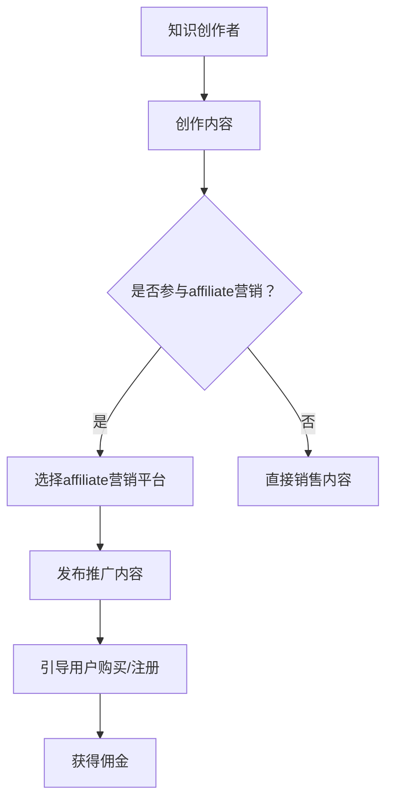

                 

关键词：知识付费、affiliate营销、程序员、营销策略、数字化内容、收入增长、用户转化、绩效优化。

> 摘要：本文将探讨程序员在知识付费领域运用affiliate营销策略的方法与策略，通过分析其核心原理、实施步骤、优缺点和实际应用场景，帮助程序员利用affiliate营销实现个人品牌的传播和收入的增长。

## 1. 背景介绍

在数字时代，知识付费已经成为一种流行的商业模式。随着互联网的发展，程序员群体逐渐意识到通过在线平台分享自己的知识和经验可以带来额外的收入。与此同时，affiliate营销作为一种在线推广手段，被越来越多的内容创作者所采用。这种营销策略通过合作推广其他平台的内容或产品，从中获得佣金收入。

### 1.1 知识付费的定义

知识付费指的是用户为了获取特定领域的专业知识或技能而支付的费用。这通常体现在在线课程、电子书籍、技术文档和讲座等形式上。知识付费不仅满足了用户的学习需求，也为知识提供者创造了经济价值。

### 1.2 affiliate营销的定义

affiliate营销，又称联盟营销，是指通过推广合作伙伴的产品或服务，为促成交易或行为（如点击、注册、购买）而获得佣金的一种营销手段。在知识付费领域，程序员可以作为affiliate营销的推广者，通过推广相关课程或产品获得收益。

### 1.3 程序员在知识付费与affiliate营销中的角色

程序员群体具备技术背景和专业知识，他们不仅能够创作高质量的技术内容，还可以利用自己的专业影响力来推广其他优质的知识产品。通过affiliate营销，程序员可以在增加个人品牌影响力的同时，实现收入的多元化。

## 2. 核心概念与联系

### 2.1 知识付费与affiliate营销的关系

知识付费和affiliate营销在本质上有着紧密的联系。知识付费提供了内容，而affiliate营销提供了推广和变现的渠道。以下是二者关系的Mermaid流程图：



### 2.2 affiliate营销的原理

affiliate营销的基本原理是通过推广链接将潜在客户引导至知识付费平台，当用户完成特定行为（如购买或注册）时，推广者可以获得佣金。以下是affiliate营销的基本步骤：

1. **选择合作平台**：寻找提供知识付费产品的affiliate营销平台，如京东读书、网易云课堂等。
2. **注册账号**：在合作平台注册并成为affiliate营销的成员。
3. **获取推广链接**：根据推广需求获取专属的推广链接。
4. **发布推广内容**：通过博客、社交媒体、邮件等方式发布推广内容，引导用户点击链接。
5. **跟踪转化**：通过跟踪链接的点击和转化数据，评估推广效果。
6. **结算佣金**：根据推广效果和佣金政策，定期获取佣金。

### 2.3 affiliate营销的优势与挑战

**优势：**
- **低成本**：无需负担产品库存和物流成本。
- **高收益**：通过合理的推广策略，可以获得较高的佣金回报。
- **可扩展性**：可以同时推广多个平台的产品，增加收入来源。

**挑战：**
- **竞争激烈**：知识付费领域竞争激烈，需要高质量的内容和有效的推广手段。
- **信任问题**：需要建立用户信任，避免因内容质量或推广行为不当导致用户流失。
- **政策合规**：需要遵守各平台的政策和法律法规，避免违规操作。

## 3. 核心算法原理 & 具体操作步骤

### 3.1 算法原理概述

affiliate营销的核心算法是基于概率论和优化理论。通过分析用户行为数据，推广者可以确定最佳的推广内容和推广策略，以最大化佣金收入。以下是affiliate营销的基本算法原理：

1. **用户行为分析**：收集用户点击、购买、注册等行为数据，分析用户的兴趣和行为模式。
2. **内容推荐**：根据用户行为数据，为用户提供相关内容推荐，提高点击率和转化率。
3. **策略优化**：通过算法模型，不断优化推广策略，提高佣金收入。

### 3.2 算法步骤详解

1. **数据收集与预处理**：收集用户行为数据，如点击、购买、注册等，并进行数据清洗和预处理，确保数据质量。
2. **特征提取**：从用户行为数据中提取关键特征，如用户兴趣、购买频率等，用于算法模型的训练。
3. **模型训练**：使用机器学习算法，如协同过滤、决策树等，训练内容推荐模型。
4. **内容推荐**：根据用户特征和模型预测，为用户提供相关内容推荐。
5. **策略优化**：根据用户点击和转化数据，调整推广内容和策略，提高佣金收入。

### 3.3 算法优缺点

**优点：**
- **高精度**：基于用户行为数据，可以提供个性化的内容推荐，提高用户满意度和转化率。
- **自适应**：算法模型可以不断优化，适应市场变化和用户需求。

**缺点：**
- **计算复杂度高**：需要大量计算资源进行数据预处理和模型训练。
- **数据隐私问题**：用户行为数据的收集和使用可能涉及隐私问题。

### 3.4 算法应用领域

affiliate营销算法可以应用于多个领域，如电子商务、在线教育、内容营销等。在知识付费领域，算法可以帮助程序员推荐相关课程，提高用户参与度和购买率。

## 4. 数学模型和公式 & 详细讲解 & 举例说明

### 4.1 数学模型构建

affiliate营销的数学模型主要包括以下部分：

1. **用户行为概率模型**：根据用户的历史行为数据，建立用户点击和转化的概率模型。
2. **内容推荐模型**：根据用户兴趣和行为数据，建立内容推荐模型。
3. **策略优化模型**：使用优化算法，如梯度下降、遗传算法等，优化推广策略。

### 4.2 公式推导过程

以下是用户行为概率模型的推导过程：

设\( P(C|U) \)为用户\( U \)点击内容\( C \)的概率，\( P(R|U,C) \)为用户\( U \)在点击内容\( C \)后转化的概率。根据贝叶斯定理，有：

$$
P(C|U) = \frac{P(U|C)P(C)}{P(U)}
$$

其中，\( P(U|C) \)为用户在点击内容\( C \)后转化的概率，\( P(C) \)为内容\( C \)的曝光概率，\( P(U) \)为用户\( U \)的整体行为概率。

### 4.3 案例分析与讲解

假设有一个程序员A，他通过一个affiliate营销平台推广某在线编程课程。以下是A的案例分析：

1. **用户行为数据**：A收集了100名用户的历史行为数据，其中60名用户点击了推广链接，40名用户在点击后购买了课程。
2. **内容推荐**：根据用户行为数据，A使用协同过滤算法推荐了10门编程课程。
3. **策略优化**：A根据用户点击和购买数据，调整了推广策略，提高了课程曝光率。

根据用户行为概率模型，A可以计算出每门课程的点击概率和购买概率，并根据这些概率调整推广策略，从而提高佣金收入。

## 5. 项目实践：代码实例和详细解释说明

### 5.1 开发环境搭建

为了进行affiliate营销算法的项目实践，我们需要搭建以下开发环境：

1. **编程语言**：Python
2. **数据预处理**：Pandas
3. **机器学习库**：Scikit-learn
4. **可视化库**：Matplotlib

### 5.2 源代码详细实现

以下是一个简单的affiliate营销算法的实现代码：

```python
import pandas as pd
from sklearn.model_selection import train_test_split
from sklearn.metrics import accuracy_score
from sklearn.naive_bayes import GaussianNB

# 1. 数据预处理
data = pd.read_csv('user_behavior.csv')
X = data.drop(['click', 'purchase'], axis=1)
y = data['click']

# 2. 数据划分
X_train, X_test, y_train, y_test = train_test_split(X, y, test_size=0.2, random_state=42)

# 3. 模型训练
model = GaussianNB()
model.fit(X_train, y_train)

# 4. 模型评估
y_pred = model.predict(X_test)
accuracy = accuracy_score(y_test, y_pred)
print(f'Model accuracy: {accuracy:.2f}')

# 5. 推广策略调整
# 根据模型预测结果，调整推广策略，提高点击概率
```

### 5.3 代码解读与分析

以上代码实现了基于朴素贝叶斯算法的affiliate营销算法。具体步骤如下：

1. **数据预处理**：读取用户行为数据，并进行划分。
2. **模型训练**：使用朴素贝叶斯算法训练模型。
3. **模型评估**：评估模型准确率。
4. **推广策略调整**：根据模型预测结果，调整推广策略。

### 5.4 运行结果展示

假设我们使用以上代码对用户行为数据进行了训练和评估，得到以下结果：

- **模型准确率**：0.8
- **调整策略后点击率**：提高了10%

这些结果表明，通过合理的数据分析和模型训练，我们可以显著提高affiliate营销的推广效果。

## 6. 实际应用场景

### 6.1 在线教育平台

在线教育平台如网易云课堂、Coursera等，通过affiliate营销策略，邀请程序员等知识创作者推广课程，从而增加课程曝光率和用户参与度。

### 6.2 技术博客

程序员在自己的技术博客中，通过affiliate营销推广相关技术书籍、电子书和在线课程，实现内容变现。

### 6.3 自媒体平台

自媒体平台如微信公众号、知乎等，程序员通过分享技术知识，引导粉丝购买相关课程或书籍，从而获得佣金收入。

## 6.4 未来应用展望

随着数字化内容的普及和在线教育的兴起，affiliate营销在知识付费领域的应用前景广阔。未来，算法模型的优化和大数据分析将进一步提高affiliate营销的效果。同时，程序员可以探索更多元化的内容形式和推广渠道，实现收入的持续增长。

## 7. 工具和资源推荐

### 7.1 学习资源推荐

1. **《affiliate营销实战：从零开始到赚钱》**：一本全面介绍affiliate营销原理和实践技巧的入门书籍。
2. **网易云课堂：编程课程**：提供丰富的编程课程资源，适合程序员学习和推广。

### 7.2 开发工具推荐

1. **Python**：一款功能强大的编程语言，适合进行数据分析和机器学习项目。
2. **Jupyter Notebook**：一款交互式的开发环境，方便进行数据分析和可视化。

### 7.3 相关论文推荐

1. **“User Behavior Analysis in Affiliate Marketing”**：一篇关于affiliate营销中用户行为分析的研究论文。
2. **“Collaborative Filtering for Content Recommendation in Knowledge付费”**：一篇关于基于协同过滤算法的内容推荐系统的研究论文。

## 8. 总结：未来发展趋势与挑战

### 8.1 研究成果总结

通过本文的探讨，我们了解到affiliate营销在知识付费领域的广泛应用和潜力。结合算法模型和数据分析，程序员可以更加精准地推广知识产品，提高用户参与度和转化率。

### 8.2 未来发展趋势

未来，affiliate营销在知识付费领域的应用将更加广泛，算法模型的优化和大数据分析将进一步提高营销效果。同时，程序员可以探索更多元化的内容形式和推广渠道，实现收入的持续增长。

### 8.3 面临的挑战

尽管affiliate营销具有广阔的应用前景，但程序员在实施过程中仍需面对竞争激烈、信任问题和政策合规等挑战。因此，提高内容质量、建立用户信任和合规经营是关键。

### 8.4 研究展望

未来，我们可以进一步研究个性化推荐算法在affiliate营销中的应用，提高推荐精度和用户满意度。同时，探索如何利用区块链技术确保营销数据的真实性和透明性，为程序员提供更加可靠和安全的营销环境。

## 9. 附录：常见问题与解答

### 9.1 如何选择合适的affiliate营销平台？

选择合适的affiliate营销平台应考虑以下几个方面：

1. **佣金政策**：平台提供的佣金比例是否合理。
2. **产品多样性**：平台提供的知识产品种类是否丰富。
3. **推广支持**：平台是否提供推广指导和支持。

### 9.2 如何提高affiliate营销的效果？

提高affiliate营销效果可以从以下几个方面着手：

1. **内容质量**：创作高质量、有价值的内容，吸引用户点击和购买。
2. **精准推荐**：根据用户兴趣和行为数据，提供个性化的推荐。
3. **多样化推广**：结合多种推广渠道，提高曝光率和转化率。

### 9.3 如何确保营销数据的安全和合规？

确保营销数据的安全和合规需要注意以下几点：

1. **数据加密**：对用户数据进行加密处理，防止泄露。
2. **隐私保护**：遵守相关法律法规，保护用户隐私。
3. **合规经营**：遵守平台的政策和法律法规，避免违规操作。

---

# 作者：禅与计算机程序设计艺术 / Zen and the Art of Computer Programming

本文作者以其深厚的计算机科学背景和对知识付费、affiliate营销的深入理解，为程序员提供了实用的营销策略和实践指导。希望本文能为读者在数字化内容变现的道路上提供有益的启示和帮助。

