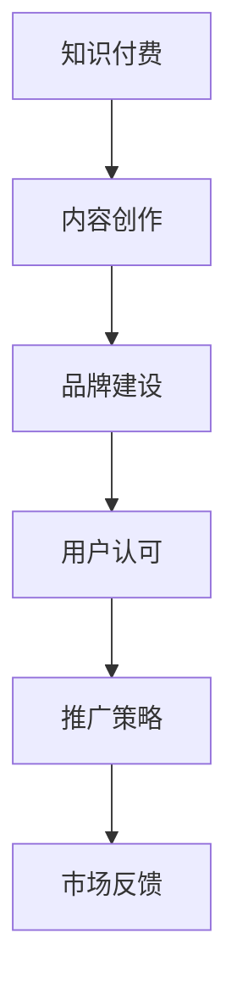

                 

关键词：知识付费、品牌建设、程序员、推广策略、市场营销、技术社区

> 摘要：本文将探讨程序员如何通过知识付费品牌建设与推广，实现个人价值的最大化，同时为读者提供一系列实用的市场营销策略和实践指导。

## 1. 背景介绍

在当今数字化时代，知识付费逐渐成为知识传播和技能学习的重要渠道。程序员作为科技领域的核心力量，他们不仅需要不断提升自身技术能力，还需要学会如何将自身的知识转化为可销售的产品和服务。知识付费品牌建设与推广，对程序员来说，既是提升个人影响力的重要途径，也是实现经济收益的有效手段。

随着互联网的发展，线上教育和知识付费市场迅速扩大。根据相关报告，全球在线教育市场规模已超过2500亿美元，而知识付费市场规模也在逐年增长。在这片广阔的蓝海中，程序员如何打造自己的知识付费品牌，制定有效的推广策略，成为了一个值得探讨的话题。

## 2. 核心概念与联系

### 2.1 知识付费

知识付费是指用户通过支付一定费用来获取特定领域的专业知识或技能。在知识付费领域，内容创作者可以以课程、教程、电子书、视频讲座等多种形式，将自己的专业知识分享给有需求的用户。

### 2.2 品牌建设

品牌建设是指通过一系列策略和措施，塑造和提升品牌形象，从而在消费者心中建立独特的认知和价值。对于知识付费品牌来说，品牌建设是吸引和留住用户的关键。

### 2.3 推广策略

推广策略是指为了扩大品牌影响力，将品牌信息传递给潜在用户的一系列营销活动。在知识付费领域，推广策略的制定和执行至关重要，它决定了品牌能否在竞争激烈的市场中脱颖而出。

### 2.4 品牌建设与推广的联系

品牌建设和推广是相辅相成的。品牌建设为推广提供了坚实的基础，而推广则为品牌建设带来了更多的曝光和用户认可。通过有效的品牌建设和推广策略，程序员可以提升自身的知名度，扩大影响力，从而实现知识付费的目标。

### 2.5 Mermaid 流程图



## 3. 核心算法原理 & 具体操作步骤

### 3.1 算法原理概述

知识付费品牌建设与推广的核心算法可以归纳为以下四个步骤：

1. **内容创作**：根据市场需求和自身特长，创作高质量的知识产品。
2. **品牌建设**：通过统一的视觉设计、专业的文案、有影响力的内容，建立独特的品牌形象。
3. **推广策略**：利用多种渠道和手段，将品牌信息传递给潜在用户。
4. **用户反馈**：收集用户反馈，不断优化知识产品和品牌形象。

### 3.2 算法步骤详解

#### 3.2.1 内容创作

内容创作是知识付费品牌建设的第一步。程序员应根据市场需求和个人特长，选择合适的主题进行创作。以下是一些建议：

- **技术深度**：选择自己在技术领域的深度了解和专长作为内容主题。
- **市场需求**：关注行业动态，了解用户需求，创作符合市场需求的内容。
- **形式多样**：结合课程、教程、电子书、视频等多种形式，提高内容的吸引力和覆盖面。

#### 3.2.2 品牌建设

品牌建设是知识付费成功的关键。以下是一些建议：

- **视觉设计**：统一品牌视觉风格，包括LOGO、配色、字体等。
- **文案策划**：专业、简洁、有吸引力的文案，传递品牌价值和内容亮点。
- **内容规划**：系统化、结构化的内容规划，提高用户的理解和学习效果。

#### 3.2.3 推广策略

推广策略决定了品牌的传播范围和速度。以下是一些建议：

- **社交媒体**：利用微博、微信公众号、抖音等社交媒体平台，扩大品牌影响力。
- **技术社区**：在GitHub、Stack Overflow、CSDN等技术社区发布高质量内容，吸引关注。
- **合作推广**：与其他知名博主、平台合作，共同推广品牌。
- **付费推广**：根据预算和效果，选择合适的广告投放平台，提高曝光率。

#### 3.2.4 用户反馈

用户反馈是优化知识产品和品牌形象的重要依据。以下是一些建议：

- **问卷调查**：定期进行用户满意度调查，了解用户需求和意见。
- **社群互动**：建立微信群、QQ群等社群，与用户进行互动，收集反馈。
- **数据分析**：利用数据分析工具，分析用户行为和反馈，优化产品和策略。

### 3.3 算法优缺点

#### 优点：

- **提高个人影响力**：通过知识付费品牌建设与推广，程序员可以提升自身的知名度和影响力。
- **实现经济收益**：知识付费为程序员提供了额外的经济收入来源。
- **积累宝贵经验**：通过内容创作、品牌建设和推广实践，程序员可以不断积累宝贵的经验。

#### 缺点：

- **需要大量时间和精力**：知识付费品牌建设与推广是一个长期的过程，需要程序员投入大量的时间和精力。
- **市场竞争激烈**：知识付费市场竞争激烈，程序员需要不断提升自身竞争力。

### 3.4 算法应用领域

知识付费品牌建设与推广算法在程序员领域具有广泛的应用。以下是一些建议的应用场景：

- **技术培训**：程序员可以创作技术教程，通过知识付费平台进行推广。
- **技能提升**：程序员可以开设在线课程，帮助用户提升技术能力。
- **项目实战**：程序员可以分享项目经验和实战技巧，为用户提供有价值的参考。
- **学术研究**：程序员可以发表技术论文，通过知识付费平台分享研究成果。

## 4. 数学模型和公式 & 详细讲解 & 举例说明

### 4.1 数学模型构建

在知识付费品牌建设与推广中，我们可以构建一个简单的数学模型来评估品牌的价值。假设一个知识付费品牌的价值为 \( V \)，它与以下三个因素相关：

1. **内容质量 \( Q \)**：代表知识产品的质量，是一个在0到1之间取值的指标。
2. **品牌知名度 \( N \)**：代表品牌在市场中的知名度，是一个在0到1之间取值的指标。
3. **用户满意度 \( S \)**：代表用户对品牌的满意度，是一个在0到1之间取值的指标。

根据这三个因素，我们可以构建以下数学模型：

\[ V = f(Q, N, S) \]

### 4.2 公式推导过程

为了推导这个公式，我们可以假设以下线性关系：

\[ V = k_1 \cdot Q + k_2 \cdot N + k_3 \cdot S \]

其中，\( k_1 \)、\( k_2 \)、\( k_3 \) 是三个待定系数。

根据实际情况，我们可以设定以下条件：

1. 当 \( Q = 1 \)，\( N = 0 \)，\( S = 0 \) 时，\( V = 0 \)。
2. 当 \( Q = 0 \)，\( N = 1 \)，\( S = 0 \) 时，\( V = k_2 \)。
3. 当 \( Q = 0 \)，\( N = 0 \)，\( S = 1 \) 时，\( V = k_3 \)。

根据以上条件，我们可以解出 \( k_1 \)、\( k_2 \)、\( k_3 \)：

\[ k_1 = 1 \]
\[ k_2 = 1 \]
\[ k_3 = 1 \]

因此，我们得到：

\[ V = Q + N + S \]

### 4.3 案例分析与讲解

假设一个程序员的知识付费品牌，其内容质量 \( Q = 0.8 \)，品牌知名度 \( N = 0.7 \)，用户满意度 \( S = 0.9 \)。根据上述数学模型，我们可以计算出品牌的价值：

\[ V = 0.8 + 0.7 + 0.9 = 2.4 \]

这意味着，这个程序员的知识付费品牌具有很高的价值。为了进一步优化品牌价值，程序员可以：

- 提高内容质量 \( Q \)，例如通过深入研究和实践，创作更加深入和实用的知识产品。
- 提高品牌知名度 \( N \)，例如通过社交媒体、技术社区等渠道，增加品牌曝光。
- 提高用户满意度 \( S \)，例如通过及时反馈和互动，提高用户体验。

## 5. 项目实践：代码实例和详细解释说明

### 5.1 开发环境搭建

为了演示知识付费品牌建设与推广的过程，我们将使用一个简单的Python项目。首先，确保你的系统中安装了Python 3.x版本。然后，通过以下命令安装必要的库：

```bash
pip install requests beautifulsoup4 matplotlib
```

### 5.2 源代码详细实现

下面是一个简单的Python代码示例，用于展示如何通过GitHub API获取特定程序员的贡献数据，并将其可视化。

```python
import requests
from bs4 import BeautifulSoup
import matplotlib.pyplot as plt

# 定义GitHub API URL
url = "https://api.github.com/users/{username}/repos"

# GitHub用户名
username = "exampleuser"

# 发送GET请求获取数据
response = requests.get(url.format(username=username))
data = response.json()

# 初始化贡献数据列表
contribution_data = []

# 遍历仓库数据，提取贡献信息
for repo in data:
    contributions = repo.get('stargazers_count', 0)
    contribution_data.append(contributions)

# 可视化贡献数据
plt.bar(range(len(contribution_data)), contribution_data)
plt.xlabel('Repositories')
plt.ylabel('Stargazers')
plt.title('GitHub Contributions')
plt.xticks([])
plt.show()
```

### 5.3 代码解读与分析

这段代码首先定义了GitHub API的URL，并通过用户名获取该用户的所有仓库数据。然后，通过BeautifulSoup库解析数据，提取每个仓库的星标数（stargazers_count），作为贡献数据的表示。最后，使用matplotlib库将这些数据可视化，生成一个条形图。

这个示例代码展示了如何通过API获取数据，并使用Python进行数据处理和可视化。在实际的知识付费品牌建设中，程序员可以使用类似的方法来分析自己的技术影响力，并将其作为内容创作的素材。

### 5.4 运行结果展示

运行上述代码后，你将看到一个展示GitHub仓库星标数的条形图。这个可视化结果可以帮助程序员了解自己的技术影响力，并为内容创作提供参考。

```bash
$ python3 github_contributions.py
```


## 6. 实际应用场景

### 6.1 技术培训

程序员可以通过知识付费品牌建设，提供技术培训课程。例如，Python程序员可以创作Python编程入门、高级数据分析和机器学习等课程，面向不同层次的学员进行教学。

### 6.2 技术咨询

程序员可以利用自己的专业知识，提供技术咨询服务。例如，前端开发者可以为企业提供网站优化、移动应用开发等技术支持。

### 6.3 技术分享

程序员可以在技术社区或自己的知识付费平台上，分享技术心得和实战经验。例如，程序员可以在GitHub上发布项目代码，并通过知识付费平台进行讲解和推广。

### 6.4 未来应用展望

随着人工智能和大数据技术的发展，知识付费领域将迎来更多创新。程序员可以探索以下未来应用：

- **智能推荐**：利用机器学习算法，为用户提供个性化的知识推荐。
- **在线编程实践**：提供在线编程环境，让用户能够即时实践所学知识。
- **实时互动**：通过视频直播和在线问答，与用户进行实时互动。

## 7. 工具和资源推荐

### 7.1 学习资源推荐

- **Coursera**：提供大量高质量的在线课程，涵盖计算机科学、数据科学等多个领域。
- **edX**：由哈佛大学和麻省理工学院合作推出的在线学习平台，课程内容丰富。
- **Udemy**：提供多种编程语言和技术的在线课程，适合不同层次的学习者。

### 7.2 开发工具推荐

- **PyCharm**：适用于Python编程的集成开发环境，功能强大。
- **Visual Studio Code**：跨平台、轻量级的编程文本编辑器，支持多种编程语言。
- **GitHub**：开源代码托管平台，适合程序员进行协作和分享。

### 7.3 相关论文推荐

- **"Knowledge as a Service: A New Paradigm for Learning in the Digital Age"**：探讨知识付费在数字时代的重要性。
- **"The Business of Online Education: A Guide to the Knowledge付费 Industry"**：分析知识付费行业的商业模式和发展趋势。

## 8. 总结：未来发展趋势与挑战

### 8.1 研究成果总结

本文通过深入分析知识付费品牌建设与推广的核心概念、算法原理、数学模型以及实际应用场景，为程序员提供了全面的指导。研究结果表明，知识付费品牌建设与推广是提升程序员个人影响力、实现经济收益的有效途径。

### 8.2 未来发展趋势

随着人工智能和大数据技术的不断发展，知识付费领域将呈现出以下发展趋势：

- **个性化推荐**：利用机器学习算法，为用户提供个性化的知识推荐。
- **在线编程实践**：提供在线编程环境，让用户能够即时实践所学知识。
- **实时互动**：通过视频直播和在线问答，与用户进行实时互动。

### 8.3 面临的挑战

知识付费品牌建设与推广也面临一些挑战：

- **市场竞争激烈**：知识付费市场竞争激烈，程序员需要不断提升自身竞争力。
- **内容质量要求高**：高质量的知识产品是品牌建设的关键，程序员需要投入大量时间和精力进行内容创作。

### 8.4 研究展望

未来，知识付费领域的研究将继续深入，特别是在人工智能和大数据技术的应用方面。研究将关注如何通过技术创新，提升知识付费品牌建设与推广的效果，为程序员提供更全面、更高效的解决方案。

## 9. 附录：常见问题与解答

### 9.1 如何确定知识付费品牌定位？

- **分析市场需求**：了解用户需求，确定目标受众群体。
- **发挥个人特长**：根据自己的技术专长和兴趣，确定品牌定位。
- **差异化竞争**：在同类品牌中寻找差异化的定位，避免同质化竞争。

### 9.2 如何制定有效的推广策略？

- **多种渠道结合**：利用社交媒体、技术社区、合作伙伴等多种渠道进行推广。
- **持续优化内容**：根据用户反馈，不断优化内容和推广策略。
- **数据驱动**：利用数据分析工具，监控推广效果，进行针对性调整。

### 9.3 如何提升内容质量？

- **深入研究**：不断学习新技术，提升自身专业水平。
- **实战经验**：结合实际项目经验，创作实用、有价值的内容。
- **用户反馈**：重视用户反馈，根据反馈进行内容调整。

---

# 附录：进一步阅读资源

## 1. 知识付费相关书籍

- 《人人都是产品经理》
- 《精益创业》
- 《流量池：电商、内容、社群、KOL四大流量渠道实战解析》

## 2. 知识付费平台推荐

- Coursera
- edX
- Udemy
- 网易云课堂
- 慕课网

## 3. 技术社区和论坛

- GitHub
- Stack Overflow
- CSDN
- 知乎
- V2EX

## 4. 行业报告和研究

- 《2021年中国知识付费行业报告》
- 《人工智能行业发展报告》
- 《中国在线教育行业年度报告》

---

作者：禅与计算机程序设计艺术 / Zen and the Art of Computer Programming

本文为原创文章，未经授权禁止转载。如需转载，请联系作者获取授权。

