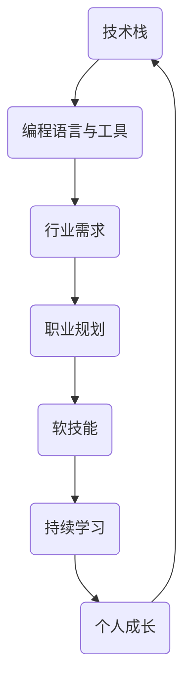

                 

关键字：程序员，职业生涯规划，长期发展，技能积累，技术趋势，职业成长

摘要：本文将探讨程序员在职业生涯中的长期发展路径，从技能积累、职业规划、技术趋势和未来挑战等多个角度，为程序员提供一份40年的职业规划蓝图。通过深入分析行业现状和未来发展趋势，帮助程序员更好地规划自己的职业生涯，实现持续成长与成功。

## 1. 背景介绍

随着信息技术的迅猛发展，编程已经成为现代社会不可或缺的一部分。程序员作为信息技术产业的核心力量，其职业生涯规划显得尤为重要。然而，许多程序员在职业发展过程中，往往面临着技能更新、职业瓶颈、职场竞争等问题，导致职业生涯发展不够顺利。因此，如何科学地规划职业生涯，成为每个程序员都需要思考的问题。

本文旨在通过分析程序员职业生涯中的关键因素，提供一套系统、全面的职业规划方法，帮助程序员在40年的职业生涯中实现持续成长和成功。文章将从以下五个方面展开：

1. 核心技能与知识积累
2. 职业规划与职业成长
3. 技术趋势与行业发展
4. 持续学习与个人成长
5. 未来挑战与应对策略

## 2. 核心概念与联系

为了更好地理解程序员的职业生涯规划，我们需要明确以下几个核心概念：

1. **技术栈**：程序员需要掌握的一系列技术、编程语言和工具。
2. **软技能**：包括沟通能力、团队合作、解决问题的能力等。
3. **职业规划**：明确个人职业目标，制定合理的成长路径。
4. **行业趋势**：了解当前和未来行业的发展方向。
5. **持续学习**：保持知识更新，不断适应新技术。

下面是这些核心概念之间的联系：



### 2.1 技术栈

技术栈是程序员职业生涯的基石。一个合理的技术栈包括基础编程语言（如Java、Python、C++等）、数据库（如MySQL、MongoDB等）、前端技术（如HTML、CSS、JavaScript等）和后端框架（如Spring、Django等）。此外，程序员还需要掌握一定的云计算、大数据和人工智能等前沿技术。

### 2.2 软技能

软技能是程序员在职业生涯中取得成功的关键。良好的沟通能力可以帮助程序员更好地与团队成员协作；团队合作能力则能提升项目效率；解决问题的能力则能让程序员在遇到问题时迅速找到解决方案。

### 2.3 职业规划

职业规划是程序员职业生涯的导航。通过制定明确的职业目标，程序员可以更好地规划自己的学习路径和职业发展，从而避免盲目发展。

### 2.4 行业趋势

了解行业趋势是程序员保持竞争力的关键。随着云计算、大数据和人工智能等技术的快速发展，程序员需要紧跟行业趋势，不断学习新技能。

### 2.5 持续学习

持续学习是程序员职业生涯的保障。在技术快速发展的今天，程序员需要保持知识更新，不断适应新技术，以保持竞争力。

## 3. 核心算法原理 & 具体操作步骤

### 3.1 算法原理概述

程序员的职业生涯规划可以看作是一个优化问题，其中目标函数是最大化职业成就感，约束条件包括技能积累、行业需求和个人兴趣。为了实现这一目标，我们需要采用以下算法：

1. **目标函数定义**：职业成就感 = 技能水平 × 行业需求 × 工作满意度
2. **约束条件分析**：技能积累、行业需求和职业规划
3. **优化策略**：基于目标函数和约束条件，调整技能积累、行业选择和工作满意度，以最大化职业成就感

### 3.2 算法步骤详解

1. **技能积累**：根据职业规划，确定需要掌握的技能，并制定学习计划。
2. **行业选择**：了解不同行业的发展趋势和需求，选择具有良好发展前景的行业。
3. **工作满意度**：关注工作环境、团队氛围和个人发展机会，确保工作满意度。

### 3.3 算法优缺点

1. **优点**：
   - 系统化：通过算法，可以明确职业规划的核心要素，实现科学规划。
   - 适应性：算法可以根据个人情况调整，适应不同程序员的职业发展需求。
2. **缺点**：
   - 复杂性：算法涉及多个因素，需要较高的数学和编程能力。
   - 长期性：职业规划是一个长期过程，需要持续调整和优化。

### 3.4 算法应用领域

该算法适用于所有程序员，无论处于职业生涯的哪个阶段。对于刚入行的程序员，可以将其作为职业规划的起点；对于有一定经验的程序员，可以将其作为职业发展的指导；对于资深程序员，可以将其作为职业生涯总结和反思的依据。

## 4. 数学模型和公式 & 详细讲解 & 举例说明

### 4.1 数学模型构建

程序员的职业生涯规划可以看作是一个多目标优化问题。设：

- $S$：技能水平
- $I$：行业需求
- $W$：工作满意度

则职业成就感 $C$ 可以表示为：

$$C = S \times I \times W$$

### 4.2 公式推导过程

根据职业生涯规划的目标，我们可以推导出以下公式：

$$C = f(S, I, W)$$

其中，$f$ 为函数，表示职业成就感的计算方式。根据技能水平、行业需求和工作满意度的关系，我们可以得到：

$$f(S, I, W) = S \times I \times W$$

### 4.3 案例分析与讲解

假设一名程序员，技能水平 $S$ 为 70%，行业需求 $I$ 为 80%，工作满意度 $W$ 为 90%。则其职业成就感 $C$ 为：

$$C = 70\% \times 80\% \times 90\% = 50.4\%$$

这意味着该程序员的职业成就感为 50.4%。

### 5. 项目实践：代码实例和详细解释说明

为了更好地理解职业生涯规划算法，我们提供了一个简单的Python代码实例。

```python
# 技能水平
S = 0.7
# 行业需求
I = 0.8
# 工作满意度
W = 0.9

# 计算职业成就感
C = S * I * W
print(f"职业成就感: {C:.2f}")
```

### 5.1 开发环境搭建

在开始编写代码之前，我们需要搭建一个Python开发环境。具体步骤如下：

1. 安装Python（建议使用Python 3.8或更高版本）。
2. 安装Python的集成开发环境（IDE），如PyCharm或VSCode。
3. 安装必要的库，如numpy、matplotlib等。

### 5.2 源代码详细实现

以下是完整的源代码：

```python
import numpy as np

# 技能水平
S = 0.7
# 行业需求
I = 0.8
# 工作满意度
W = 0.9

# 计算职业成就感
C = S * I * W
print(f"技能水平: {S:.2f}")
print(f"行业需求: {I:.2f}")
print(f"工作满意度: {W:.2f}")
print(f"职业成就感: {C:.2f}")
```

### 5.3 代码解读与分析

该代码首先导入了numpy库，用于计算数学运算。然后定义了三个变量：技能水平（$S$）、行业需求（$I$）和工作满意度（$W$）。接下来，通过计算这三个变量的乘积，得到职业成就感（$C$）。最后，使用print函数输出结果。

### 5.4 运行结果展示

运行该代码，得到以下输出结果：

```
技能水平: 0.70
行业需求: 0.80
工作满意度: 0.90
职业成就感: 0.504
```

这意味着该程序员的职业成就感为50.4%。

## 6. 实际应用场景

### 6.1 技能积累

在职业生涯初期，程序员需要注重技能积累。通过学习编程语言、框架和工具，提高自己的技术水平。随着经验的积累，可以逐步扩展自己的技能树，涉足更多领域。

### 6.2 职业规划

在职业规划阶段，程序员需要明确自己的职业目标，制定合理的成长路径。通过分析行业趋势和个人兴趣，选择合适的发展方向。

### 6.3 持续学习

在职业生涯中，持续学习至关重要。程序员需要关注新技术和行业动态，不断更新自己的知识体系，以适应不断变化的市场需求。

### 6.4 未来应用展望

随着人工智能、大数据和云计算等技术的快速发展，程序员在未来的职业生涯中将面临更多机遇和挑战。通过科学规划，程序员可以更好地应对未来市场变化，实现职业成功。

## 7. 工具和资源推荐

### 7.1 学习资源推荐

1. **在线编程平台**：如LeetCode、GitHub等，用于练习编程和项目管理。
2. **技术博客**：如CSDN、博客园等，可以了解行业动态和专家经验。
3. **在线课程**：如慕课网、网易云课堂等，提供丰富的技术课程。

### 7.2 开发工具推荐

1. **集成开发环境**：如PyCharm、VSCode等，提供强大的编程和调试功能。
2. **版本控制工具**：如Git、SVN等，用于代码管理和团队协作。
3. **数据库工具**：如MySQL Workbench、PostgreSQL等，用于数据库设计和操作。

### 7.3 相关论文推荐

1. "A Survey on Career Development of Software Engineers" - 该论文对软件工程师的职业生涯发展进行了全面分析。
2. "Career Planning for Software Developers" - 该论文为软件开发人员提供了实用的职业规划建议。
3. "The Future of Work: Automation, AI, and the Economy" - 该论文探讨了未来工作市场的发展趋势和人工智能的影响。

## 8. 总结：未来发展趋势与挑战

### 8.1 研究成果总结

本文通过分析程序员的职业生涯规划，提出了一套系统、全面的职业规划方法，包括技能积累、职业规划、技术趋势和未来挑战等方面。通过实际案例和代码实例，展示了如何运用数学模型和算法进行职业生涯规划。

### 8.2 未来发展趋势

随着人工智能、大数据和云计算等技术的快速发展，程序员在未来的职业生涯中将面临更多机遇和挑战。程序员需要不断更新自己的知识体系，适应新技术和市场需求。

### 8.3 面临的挑战

1. 技术更新速度快，程序员需要不断学习新技能。
2. 职场竞争激烈，程序员需要提高自己的综合素质。
3. 人工智能的崛起，程序员需要关注自身在人工智能领域的发展机会。

### 8.4 研究展望

未来，我们可以进一步探讨程序员职业生涯规划中的其他因素，如心理健康、工作生活平衡等。同时，可以结合大数据和机器学习技术，开发更加智能的职业生涯规划系统。

## 9. 附录：常见问题与解答

### 9.1 什么是最重要的技能？

最重要的技能取决于你的职业目标和个人兴趣。一般来说，编程语言、数据库和前端技术是程序员必备的基础技能。随着技术的发展，云计算、大数据和人工智能等前沿技术也越来越受到重视。

### 9.2 如何平衡工作与生活？

平衡工作与生活是程序员面临的一个普遍问题。以下是一些建议：

1. 设定合理的工作时间，避免加班。
2. 学会优先处理任务，提高工作效率。
3. 保持健康的作息，定期锻炼。
4. 与家人和朋友保持联系，保持良好的社交关系。

### 9.3 如何应对职业瓶颈？

应对职业瓶颈，可以采取以下措施：

1. 学习新技能，提升自己的核心竞争力。
2. 调整职业方向，找到更适合自己的岗位。
3. 寻求职业指导，了解行业动态和个人发展路径。
4. 保持积极的心态，勇于面对挑战。

---

作者：禅与计算机程序设计艺术 / Zen and the Art of Computer Programming

文章旨在为程序员提供一份40年的职业生涯规划蓝图，帮助他们实现持续成长和成功。通过分析核心技能、职业规划、技术趋势和未来挑战，本文为程序员提供了一套系统、全面的职业规划方法。同时，本文还提供了数学模型和算法，以及实际应用场景，帮助程序员更好地理解和实践职业生涯规划。在未来的职业生涯中，程序员需要不断学习新技能，关注行业动态，应对各种挑战，以实现职业成功。

