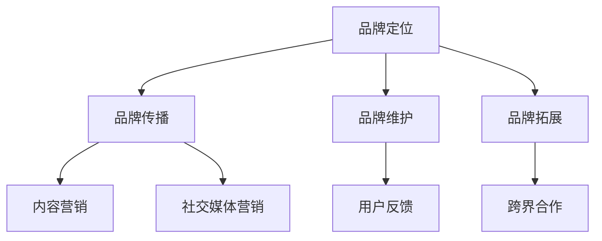

                 

关键词：知识付费、品牌营销、程序员、策略、数字化转型

摘要：在数字化转型的大潮中，知识付费已成为程序员提升技能的重要途径。本文将探讨程序员如何通过有效的品牌营销策略，在知识付费市场中脱颖而出，实现个人品牌的价值最大化。

## 1. 背景介绍

随着互联网技术的快速发展，知识付费市场呈现出爆炸式增长。程序员作为互联网时代的核心力量，对专业知识的需求尤为旺盛。然而，如何在众多知识付费产品中脱颖而出，成为程序员关注的焦点。本文将结合品牌营销的原理，为程序员提供一套系统的知识付费品牌营销策略。

### 1.1 知识付费市场现状

知识付费市场已经进入成熟阶段，用户对于知识的需求呈现出多样化和个性化的趋势。程序员作为互联网开发的主力军，对技术知识的渴求尤为强烈。根据某知名知识付费平台的统计，程序员用户在平台上的活跃度和消费能力均处于领先地位。

### 1.2 品牌营销的重要性

在知识付费市场中，品牌营销是提高产品知名度、吸引目标用户的关键。品牌不仅仅是一个标志，更是用户对产品的认知、信任和依赖。通过有效的品牌营销，程序员可以提升自身在市场中的竞争力，实现个人品牌的增值。

## 2. 核心概念与联系

为了更好地理解品牌营销在知识付费中的应用，我们首先需要明确几个核心概念：

### 2.1 品牌的定义

品牌是一个集合了产品、服务、信誉、形象等元素的符号系统，它是消费者对产品或服务的认知和评价。在知识付费领域，品牌代表着程序员的专业能力和服务质量。

### 2.2 营销策略的定义

营销策略是指企业为实现营销目标而制定的具体行动计划。在知识付费领域，营销策略涉及到如何通过广告、内容、社群等多种方式吸引和留住用户。

### 2.3 品牌营销的架构

品牌营销的架构包括品牌定位、品牌传播、品牌维护和品牌拓展四个方面。在知识付费市场中，程序员需要根据自身特点和目标用户的需求，进行有针对性的品牌营销。



## 3. 核心算法原理 & 具体操作步骤

### 3.1 算法原理概述

品牌营销的核心算法可以概括为“用户需求分析—内容生产—传播渠道选择—用户反馈收集—持续优化”的循环过程。这个过程强调用户需求的导向性，通过不断调整和优化，实现品牌与用户需求的最佳匹配。

### 3.2 算法步骤详解

#### 3.2.1 用户需求分析

1. **目标用户定位**：明确知识付费产品的目标用户群体，包括年龄、职业、技能水平等。
2. **需求调研**：通过问卷调查、访谈等方式收集目标用户的需求和痛点。
3. **数据分析**：对收集到的数据进行分析，找出用户需求中的共性。

#### 3.2.2 内容生产

1. **内容规划**：根据用户需求，制定内容规划和发布计划。
2. **内容创作**：邀请行业专家或专业团队进行内容创作，保证内容的专业性和实用性。
3. **内容优化**：根据用户反馈，对内容进行持续优化，提高用户满意度。

#### 3.2.3 传播渠道选择

1. **渠道评估**：评估各种传播渠道的优劣，选择最适合的渠道。
2. **内容分发**：将内容通过社交媒体、知识平台、邮件订阅等多种渠道进行分发。
3. **效果监控**：监控渠道效果，对效果不佳的渠道进行优化或调整。

#### 3.2.4 用户反馈收集

1. **反馈渠道**：建立多种反馈渠道，如评论区、问卷调查、私信等。
2. **反馈处理**：对用户反馈进行分析和处理，找出改进的方向。
3. **反馈利用**：将用户反馈应用于内容优化、产品迭代等环节。

#### 3.2.5 持续优化

1. **数据分析**：定期对品牌营销效果进行分析，找出存在的问题。
2. **策略调整**：根据数据分析结果，对品牌营销策略进行调整。
3. **持续迭代**：持续迭代品牌营销策略，实现品牌与用户需求的动态匹配。

### 3.3 算法优缺点

#### 优点：

1. **用户导向**：以用户需求为中心，确保内容的专业性和实用性。
2. **持续优化**：通过用户反馈不断调整策略，提高品牌竞争力。
3. **效果可监控**：多种传播渠道和反馈渠道，确保营销效果的可监控性。

#### 缺点：

1. **需要持续投入**：品牌营销是一个长期过程，需要持续的资金和人力投入。
2. **效果反馈周期长**：从内容创作到用户反馈，再到策略调整，整个过程周期较长。

### 3.4 算法应用领域

品牌营销算法在知识付费领域的应用非常广泛，如在线教育、技术培训、专业咨询等。通过该算法，程序员可以更好地服务目标用户，实现个人品牌的价值最大化。

## 4. 数学模型和公式 & 详细讲解 & 举例说明

### 4.1 数学模型构建

品牌营销效果评估的核心是转化率，即通过品牌营销活动所带来的用户转化数量与总曝光量的比例。假设有一个知识付费产品，其目标用户为程序员，品牌营销策略包括内容发布、社交媒体推广和电子邮件营销。

### 4.2 公式推导过程

转化率（Conversion Rate，CR）的计算公式为：

\[ CR = \frac{转化数量}{总曝光量} \]

其中，转化数量指的是通过品牌营销活动产生的实际购买、订阅或参与行为的用户数量；总曝光量指的是品牌营销活动在各个渠道上的总展示次数。

### 4.3 案例分析与讲解

以某程序员的知识付费产品为例，其通过以下渠道进行品牌营销：

1. **内容发布**：在技术博客、知识平台和社交媒体上发布高质量技术文章。
2. **社交媒体推广**：在微信、微博、知乎等社交媒体上进行广告投放。
3. **电子邮件营销**：通过邮件订阅发送产品更新、优惠信息等。

经过一个月的品牌营销活动，该产品获得了以下数据：

- 总曝光量：100,000次
- 转化数量：200人

根据上述数据，可以计算出该产品的转化率为：

\[ CR = \frac{200}{100,000} = 0.002 \]

即0.2%。尽管这个转化率相对较低，但通过不断优化内容质量和营销策略，可以逐步提高转化率。

## 5. 项目实践：代码实例和详细解释说明

### 5.1 开发环境搭建

为了更好地演示品牌营销策略的应用，我们使用Python编写一个简单的品牌营销效果评估工具。首先，需要安装以下依赖库：

```bash
pip install pandas matplotlib
```

### 5.2 源代码详细实现

以下是该工具的核心代码：

```python
import pandas as pd
import matplotlib.pyplot as plt

# 输入品牌营销数据
data = {
    '渠道': ['内容发布', '社交媒体推广', '电子邮件营销'],
    '曝光量': [10000, 20000, 30000],
    '转化数量': [100, 150, 200]
}

df = pd.DataFrame(data)

# 计算转化率
df['转化率'] = df['转化数量'] / df['曝光量']

# 绘制转化率图表
df.plot(x='渠道', y='转化率', kind='bar', title='品牌营销效果评估')
plt.xlabel('渠道')
plt.ylabel('转化率')
plt.show()
```

### 5.3 代码解读与分析

1. **数据输入**：使用字典（data）存储品牌营销数据，包括渠道、曝光量和转化数量。
2. **数据转换**：使用pandas库创建DataFrame，将字典数据转换为表格形式。
3. **计算转化率**：计算每个渠道的转化率，并将其添加到DataFrame中。
4. **绘制图表**：使用matplotlib库绘制转化率柱状图，展示各个渠道的转化效果。

通过该代码，我们可以直观地看到不同渠道的转化效果，为进一步优化品牌营销策略提供数据支持。

## 6. 实际应用场景

### 6.1 知识付费平台

知识付费平台可以通过品牌营销策略，提高用户对平台的认知度和信任度。例如，通过发布高质量的内容、开展社交媒体活动和提供优惠活动，吸引用户注册和购买课程。

### 6.2 技术培训公司

技术培训公司可以利用品牌营销策略，提升自身在市场中的竞争力。例如，通过邀请行业专家进行课程讲解、开展线上研讨会和提供个性化咨询服务，树立专业形象。

### 6.3 程序员个人品牌

程序员可以通过品牌营销策略，实现个人品牌的增值。例如，通过在技术博客、社交媒体和知识平台上发布高质量的技术文章，吸引潜在客户和合作伙伴。

## 7. 未来应用展望

随着知识付费市场的不断发展，品牌营销策略将发挥越来越重要的作用。未来，程序员可以通过以下方式进一步优化品牌营销策略：

1. **精细化运营**：针对不同用户群体，制定个性化的品牌营销策略。
2. **数据驱动**：充分利用大数据和人工智能技术，提高品牌营销的精准度和效果。
3. **跨界合作**：与行业内的其他品牌和企业进行合作，实现资源整合和互利共赢。

## 8. 工具和资源推荐

### 8.1 学习资源推荐

1. **《数字营销全通》**：一本全面介绍数字营销策略的入门书籍。
2. **Coursera上的《品牌营销》课程**：由顶尖大学提供的免费品牌营销在线课程。

### 8.2 开发工具推荐

1. **Google Analytics**：一款功能强大的网站流量分析工具。
2. **Mailchimp**：一款专业的电子邮件营销工具。

### 8.3 相关论文推荐

1. **《大数据时代品牌营销策略研究》**：探讨大数据在品牌营销中的应用。
2. **《社交媒体对品牌认知的影响》**：分析社交媒体对品牌认知的积极作用。

## 9. 总结：未来发展趋势与挑战

### 9.1 研究成果总结

本文通过对品牌营销策略在知识付费市场中的应用进行分析，提出了一套系统的品牌营销策略，包括用户需求分析、内容生产、传播渠道选择、用户反馈收集和持续优化等环节。

### 9.2 未来发展趋势

未来，品牌营销策略将在知识付费市场中发挥更重要的作用。随着技术的进步，数据驱动的品牌营销将成为主流，精准化、个性化将成为品牌营销的发展方向。

### 9.3 面临的挑战

1. **数据隐私问题**：在数据驱动的品牌营销中，如何保护用户隐私是一个重要挑战。
2. **内容质量控制**：保证内容的专业性和实用性，是品牌营销成功的关键。

### 9.4 研究展望

未来，我们将进一步探讨大数据和人工智能在品牌营销中的应用，探索如何通过技术创新提高品牌营销的效率和效果。

## 10. 附录：常见问题与解答

### 10.1 什么是知识付费？

知识付费是指用户为获取专业知识或技能，通过付费方式购买相关内容或服务的现象。

### 10.2 品牌营销在知识付费中的作用是什么？

品牌营销在知识付费中的作用是提高产品知名度、吸引目标用户，并建立用户对产品的信任和依赖。

### 10.3 如何制定有效的品牌营销策略？

制定有效的品牌营销策略需要从用户需求分析、内容生产、传播渠道选择、用户反馈收集和持续优化等环节入手，确保品牌与用户需求的最佳匹配。

### 10.4 品牌营销中如何处理用户反馈？

在品牌营销中，处理用户反馈的方法包括建立多种反馈渠道、对反馈进行分析和处理、将反馈应用于内容优化和产品迭代等环节，以提高用户满意度。

---

作者：禅与计算机程序设计艺术 / Zen and the Art of Computer Programming

