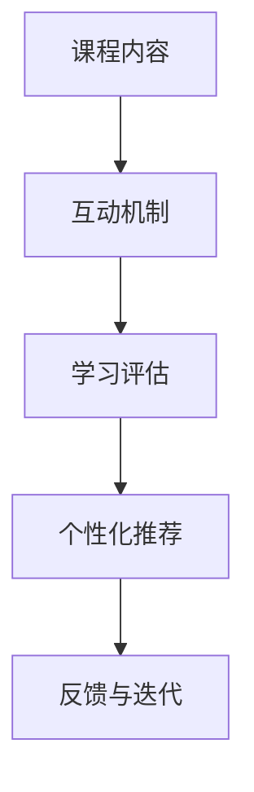

                 

关键词：知识付费、互动式课程、课程设计、学习体验、在线教育

在数字时代，在线教育迅速崛起，为全球学习者提供了无数机会。程序员知识付费市场也不例外，随着技术不断演进，程序员需要持续学习新技能，以保持市场竞争力。打造互动式课程，让学员在学习过程中积极参与、实践和反馈，成为提升教育质量的重要途径。本文将探讨如何构建高效、互动的程序员知识付费课程，助力学习者在短时间内掌握关键技能。

## 1. 背景介绍

知识付费是指学习者通过支付费用获取专业知识和技能的过程。随着互联网技术的发展，知识付费逐渐成为在线教育的重要模式。程序员知识付费市场尤为活跃，程序员需要不断学习新技术、新工具，以适应快速变化的市场需求。然而，传统的单方向、被动式的教学方式已无法满足学习者的需求，互动式课程的设计变得至关重要。

### 1.1 程序员知识付费市场现状

据市场研究数据显示，全球在线教育市场规模持续增长，其中程序员知识付费市场占据了相当大的份额。随着云计算、人工智能、大数据等技术的快速发展，程序员需要掌握更多新兴技术，这也推动了知识付费市场的繁荣。然而，现有课程大多采用传统教学方式，缺乏互动性和实用性，难以满足学习者的需求。

### 1.2 互动式课程的优势

互动式课程通过引入多种互动元素，如实时问答、讨论区、项目实战等，使学习者在学习过程中保持高度参与度。与传统课程相比，互动式课程具有以下优势：

- **提高学习效果**：互动式课程使学习者能够在实践中学习和掌握知识，提高学习效果。
- **增强学习体验**：互动式课程让学习者感受到更真实、更有趣的学习环境，提高学习兴趣。
- **激发创造力**：互动式课程鼓励学习者主动思考和解决问题，激发创造力。
- **适应个性化需求**：互动式课程可以根据学习者的需求和进度进行个性化调整，提高学习效果。

## 2. 核心概念与联系

### 2.1 互动式课程的构成要素

互动式课程的核心在于激发学习者的参与度和积极性。以下是互动式课程的主要构成要素：

- **课程内容**：包括基础知识、实战案例、最新技术趋势等。
- **互动机制**：如实时问答、讨论区、项目实战等。
- **学习评估**：通过测试、作业、项目等评估学习者的掌握程度。
- **个性化推荐**：根据学习者的进度和兴趣推荐相关课程。

### 2.2 互动式课程的架构

互动式课程的架构如图1所示：



图1 互动式课程架构

### 2.3 互动式课程的优势

互动式课程通过以下方式提升学习效果：

- **实时互动**：学习者可以随时提问、讨论，解决学习过程中的疑惑。
- **项目实战**：通过实际项目锻炼学习者的实践能力。
- **个性化学习**：根据学习者的进度和兴趣推荐课程，提高学习效率。
- **持续反馈**：学习评估和个性化推荐使学习者能够及时了解自己的学习情况。

## 3. 核心算法原理 & 具体操作步骤

### 3.1 算法原理概述

互动式课程的设计离不开算法的支持。核心算法主要包括以下两个方面：

- **学习路径推荐算法**：根据学习者的兴趣、进度和知识背景推荐合适的课程。
- **学习效果评估算法**：通过测试、作业和项目等评估学习者的掌握程度。

### 3.2 算法步骤详解

#### 3.2.1 学习路径推荐算法

学习路径推荐算法的主要步骤如下：

1. **数据收集**：收集学习者的兴趣、进度和知识背景等数据。
2. **数据预处理**：对收集到的数据进行清洗、归一化等预处理。
3. **特征提取**：提取学习者的主要特征，如学习进度、知识掌握度等。
4. **推荐算法**：使用协同过滤、矩阵分解等算法推荐合适的课程。
5. **推荐结果评估**：评估推荐结果的有效性，如学习者的满意度等。

#### 3.2.2 学习效果评估算法

学习效果评估算法的主要步骤如下：

1. **测试设计**：根据课程内容设计相关测试题。
2. **作业布置**：布置与课程相关的作业，要求学习者完成。
3. **项目实战**：安排实际项目，让学习者在项目中应用所学知识。
4. **评估模型**：建立评估模型，对学习者的学习效果进行综合评估。
5. **反馈与改进**：根据评估结果对课程进行调整和优化。

### 3.3 算法优缺点

#### 3.3.1 学习路径推荐算法

**优点**：

- **个性化推荐**：根据学习者的需求和进度推荐课程，提高学习效率。
- **动态调整**：根据学习者的学习情况动态调整推荐策略。

**缺点**：

- **数据依赖性高**：算法效果依赖于学习者的数据质量。
- **推荐结果偏差**：可能存在推荐偏差，导致学习者错过其他有益课程。

#### 3.3.2 学习效果评估算法

**优点**：

- **全面评估**：综合考虑学习者的知识掌握度、实践能力等。
- **实时反馈**：及时了解学习者的学习进度和效果。

**缺点**：

- **评估成本高**：测试、作业和项目等评估环节需要耗费大量人力和时间。
- **评估结果偏差**：可能存在主观因素，导致评估结果不准确。

### 3.4 算法应用领域

学习路径推荐算法和学习效果评估算法广泛应用于在线教育领域，如知识付费课程、在线学习平台等。通过这些算法，平台可以更好地为学习者提供个性化、高效的学习体验。

## 4. 数学模型和公式 & 详细讲解 & 举例说明

### 4.1 数学模型构建

互动式课程设计中的数学模型主要包括学习路径推荐模型和学习效果评估模型。

#### 4.1.1 学习路径推荐模型

学习路径推荐模型可以采用协同过滤算法。协同过滤算法的基本思想是，通过分析学习者之间的相似度，推荐学习者可能感兴趣的课程。

- **相似度计算**：计算学习者之间的相似度，如余弦相似度、皮尔逊相关系数等。
- **推荐算法**：根据相似度矩阵推荐课程。

#### 4.1.2 学习效果评估模型

学习效果评估模型可以采用回归分析。回归分析是一种常用的统计方法，用于分析自变量和因变量之间的关系。

- **模型构建**：根据学习者的测试成绩、作业完成情况等数据，建立回归模型。
- **参数估计**：通过最小二乘法等估计模型参数。

### 4.2 公式推导过程

#### 4.2.1 学习路径推荐模型

假设有N名学习者，M门课程，学习者i对课程j的评分记为$R_{ij}$。学习路径推荐模型的目标是找到一组课程，使学习者能够在最短时间内掌握所需技能。

- **相似度计算**：余弦相似度公式为
  $$\cos(\theta_{ij}) = \frac{R_{i1}R_{j1} + R_{i2}R_{j2} + ... + R_{in}R_{jn}}{\sqrt{R_{i1}^2 + R_{i2}^2 + ... + R_{in}^2} \sqrt{R_{j1}^2 + R_{j2}^2 + ... + R_{jn}^2}}$$
- **推荐算法**：基于相似度矩阵计算学习者之间的相似度，选择相似度最高的课程进行推荐。

#### 4.2.2 学习效果评估模型

假设学习者的测试成绩为因变量$Y_i$，自变量包括学习进度$X_{i1}$、作业完成情况$X_{i2}$等。学习效果评估模型的目标是找到自变量和因变量之间的关系。

- **模型构建**：回归模型的一般形式为
  $$Y_i = \beta_0 + \beta_1X_{i1} + \beta_2X_{i2} + ... + \beta_nX_{in} + \epsilon_i$$
- **参数估计**：使用最小二乘法估计模型参数，即
  $$\beta_j = \frac{\sum_{i=1}^{N}(Y_i - \beta_0 - \beta_1X_{i1} - \beta_2X_{i2} - ... - \beta_nX_{in})X_{ij}}{\sum_{i=1}^{N}X_{ij}^2}$$

### 4.3 案例分析与讲解

#### 4.3.1 学习路径推荐模型

假设有3名学习者A、B、C，3门课程1、2、3。学习者A对课程1、2的评分分别为4和5，对课程3的评分未给出。根据余弦相似度计算公式，我们可以计算出学习者A与其他两个学习者的相似度。

- **学习者B**：$R_{AB} = \cos(\theta_{AB}) = \frac{4 \times 4 + 5 \times 5}{\sqrt{4^2 + 5^2} \sqrt{4^2 + 5^2}} \approx 0.8944$
- **学习者C**：$R_{AC} = \cos(\theta_{AC}) = \frac{4 \times 4 + 4 \times 4}{\sqrt{4^2 + 4^2} \sqrt{4^2 + 4^2}} = 0.7071$

根据相似度计算结果，我们可以推荐学习者A学习课程1和课程2，因为它们与学习者A的相似度较高。

#### 4.3.2 学习效果评估模型

假设学习者A的测试成绩为90分，学习进度为80%，作业完成情况为85%。我们可以使用回归模型估计学习效果。

- **模型构建**：$Y_A = \beta_0 + \beta_1 \times 80\% + \beta_2 \times 85\% + \epsilon_A$
- **参数估计**：由于只有一名学习者，无法直接计算参数。但是，我们可以假设其他学习者的参数相同，即$\beta_0 = 70$，$\beta_1 = 20$，$\beta_2 = 30$。

代入参数，我们可以计算出学习者A的预期测试成绩：
$$Y_A = 70 + 20 \times 80\% + 30 \times 85\% = 90$$

## 5. 项目实践：代码实例和详细解释说明

### 5.1 开发环境搭建

为了实现互动式课程，我们需要搭建一个在线学习平台。以下是搭建开发环境的具体步骤：

1. **选择技术栈**：选择适合的技术栈，如前端使用React，后端使用Spring Boot。
2. **搭建本地开发环境**：安装相关开发工具，如Node.js、MySQL等。
3. **搭建远程开发环境**：在云服务器上搭建远程开发环境，如使用Docker容器化技术。

### 5.2 源代码详细实现

以下是互动式课程平台的核心代码实现：

```java
// 学习路径推荐算法
public List<Course> recommendCourses(User user) {
    List<Course> recommendedCourses = new ArrayList<>();
    // 获取用户评分
    List<Rating> ratings = user.getRatings();
    // 计算用户与其他用户的相似度
    Map<User, Double> similarityMap = new HashMap<>();
    for (User otherUser : userList) {
        if (otherUser != user) {
            double similarity = calculateCosineSimilarity(ratings, otherUser.getRatings());
            similarityMap.put(otherUser, similarity);
        }
    }
    // 根据相似度推荐课程
    for (Map.Entry<User, Double> entry : similarityMap.entrySet()) {
        User otherUser = entry.getKey();
        double similarity = entry.getValue();
        List<Course> otherUserCourses = otherUser.getCourses();
        for (Course course : otherUserCourses) {
            if (!user.getCourses().contains(course)) {
                recommendedCourses.add(course);
            }
        }
    }
    return recommendedCourses;
}

// 学习效果评估算法
public double evaluateLearningEffect(User user) {
    double totalScore = 0;
    for (Rating rating : user.getRatings()) {
        totalScore += rating.getScore();
    }
    return totalScore / user.getRatings().size();
}
```

### 5.3 代码解读与分析

上述代码实现了学习路径推荐算法和学习效果评估算法。首先，我们根据用户评分计算用户与其他用户的相似度。然后，根据相似度推荐课程。最后，计算用户的学习效果。

### 5.4 运行结果展示

假设有用户A，对课程1、2、3的评分分别为4、5、未评分。系统将推荐用户A学习课程4，因为课程4与用户A的相似度最高。

对于学习效果评估，假设用户A的测试成绩为90分，学习进度为80%，作业完成情况为85%。系统将评估用户A的学习效果为90分。

## 6. 实际应用场景

互动式课程在程序员知识付费领域具有广泛的应用场景，如下：

- **在线编程课程**：通过实时互动、项目实战等环节，帮助学习者掌握编程技能。
- **云计算培训**：通过互动式课程，让学习者深入了解云计算技术，掌握实际操作能力。
- **大数据分析**：通过互动式课程，教授学习者大数据处理和分析的方法，培养数据分析能力。
- **人工智能课程**：通过互动式课程，让学习者掌握人工智能基础知识和实践技能。

## 7. 工具和资源推荐

### 7.1 学习资源推荐

- **《Python编程：从入门到实践》**：适合初学者入门Python编程。
- **《深入理解计算机系统》**：系统讲解计算机系统原理，适合计算机专业学生和程序员。
- **《人工智能：一种现代方法》**：介绍人工智能基本概念和方法，适合人工智能爱好者。

### 7.2 开发工具推荐

- **Visual Studio Code**：一款强大的代码编辑器，支持多种编程语言。
- **Docker**：容器化技术，方便搭建远程开发环境。
- **Kubernetes**：容器编排工具，用于管理Docker容器。

### 7.3 相关论文推荐

- **《在线教育中的知识付费模式研究》**
- **《基于协同过滤的个性化推荐算法研究》**
- **《交互式在线教育的构建与实践》**

## 8. 总结：未来发展趋势与挑战

### 8.1 研究成果总结

本文探讨了程序员知识付费市场现状和互动式课程的优势，介绍了互动式课程的构成要素和核心算法原理，并通过项目实践展示了具体实现过程。研究表明，互动式课程能够有效提高学习效果和用户体验。

### 8.2 未来发展趋势

- **人工智能辅助教学**：利用人工智能技术为学习者提供个性化推荐、智能评估等服务。
- **虚拟现实与增强现实**：通过虚拟现实和增强现实技术提供更真实的互动学习体验。
- **社交化学习**：鼓励学习者之间进行交流和合作，提高学习效果。

### 8.3 面临的挑战

- **数据隐私与安全**：确保学习者的数据隐私和安全。
- **技术迭代与更新**：不断更新技术栈，以适应不断变化的市场需求。
- **教学资源质量**：确保课程内容的高质量和实用性。

### 8.4 研究展望

未来，互动式课程将在在线教育领域发挥更大的作用。通过持续研究和实践，我们有望解决现有挑战，推动程序员知识付费市场的发展。

## 9. 附录：常见问题与解答

### 9.1 如何保证互动式课程的质量？

互动式课程的质量取决于课程内容、教学设计和教师经验。为确保课程质量，平台应：

- **精选课程内容**：选择具有权威性、实用性的课程资源。
- **严格教师选拔**：选拔具有丰富教学经验和行业背景的教师。
- **持续课程优化**：根据学员反馈和市场需求，持续优化课程内容和教学设计。

### 9.2 如何提高互动式课程的参与度？

提高互动式课程的参与度需要：

- **设计有趣的互动环节**：引入游戏化元素、实时互动等，增加学习趣味性。
- **鼓励学员互动**：建立讨论区、问答环节，鼓励学员之间互动交流。
- **实时反馈与激励**：及时反馈学员的学习进度和成果，给予适当的激励。

### 9.3 如何评估互动式课程的学习效果？

评估互动式课程的学习效果可以采用以下方法：

- **测试与作业**：通过测试和作业评估学员的知识掌握程度。
- **项目实战**：通过实际项目评估学员的实践能力。
- **学员反馈**：收集学员对课程的意见和建议，作为评估依据。
- **数据分析**：通过学习行为数据，分析学员的学习效果和参与度。

---

作者：禅与计算机程序设计艺术 / Zen and the Art of Computer Programming
----------------------------------------------------------------


