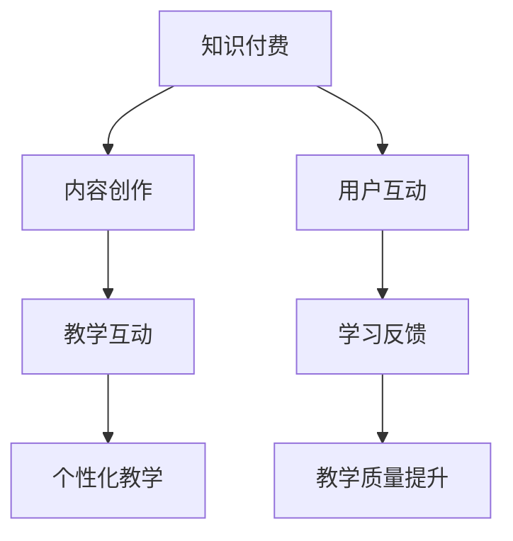

                 

关键词：程序员，知识付费，问答式教学，深度学习，教学策略，在线教育

> 摘要：本文将探讨程序员知识付费的现状及其发展前景，并深入分析如何通过问答式教学这一创新方式，为程序员提供更加高效、个性化的学习体验，进而推动在线教育的繁荣。

## 1. 背景介绍

随着互联网技术的飞速发展，在线教育逐渐成为学习的重要方式。而程序员作为信息技术产业的中坚力量，对知识的更新速度和专业能力的要求越来越高。传统的知识传播方式已无法满足程序员学习的需求，知识付费和问答式教学因此应运而生。

### 1.1 程序员知识付费的现状

程序员知识付费已经成为一种趋势，越来越多的程序员通过付费获取高质量的知识和资源。这种付费模式不仅为内容创作者提供了收入来源，也使得学习资源更加丰富和专业化。

### 1.2 问答式教学的优势

问答式教学通过互动和反馈，能够更好地激发学习者的思维，提高学习效率。相较于传统的讲授式教学，问答式教学更加灵活和个性，能够更好地适应程序员的个性化学习需求。

## 2. 核心概念与联系

### 2.1 知识付费

知识付费是指用户为了获取特定知识或服务而支付的费用。在程序员领域，知识付费通常包括在线课程、专家问答、专业书籍等。

### 2.2 问答式教学

问答式教学是一种以提问和回答为核心的教学方式，通过互动促进学习者的思考和知识的内化。在在线教育中，问答式教学可以通过论坛、直播问答、即时通讯等方式实现。

### 2.3 Mermaid 流程图



## 3. 核心算法原理 & 具体操作步骤

### 3.1 算法原理概述

问答式教学的核心在于算法的智能匹配和互动反馈。通过深度学习算法，系统能够理解用户的问题和需求，并匹配相应的专家进行解答。同时，算法还能根据用户的反馈调整教学内容和方式。

### 3.2 算法步骤详解

#### 3.2.1 用户提问

用户在平台上提出问题，问题可以是具体的技术问题，也可以是学习上的困惑。

#### 3.2.2 算法匹配

平台通过深度学习算法，分析问题，并从专家库中匹配最适合回答该问题的专家。

#### 3.2.3 专家回答

专家根据问题提供详细的解答，解答可以是文字、图片、视频等多种形式。

#### 3.2.4 用户反馈

用户对解答进行评价，系统根据反馈调整匹配算法。

### 3.3 算法优缺点

#### 3.3.1 优点

- 提高学习效率
- 个性化学习体验
- 促进互动和知识分享

#### 3.3.2 缺点

- 专家资源可能不足
- 需要高成本维护算法

### 3.4 算法应用领域

问答式教学在程序员教育领域有广泛的应用，如技术问答社区、在线教育平台、专业咨询服务等。

## 4. 数学模型和公式 & 详细讲解 & 举例说明

### 4.1 数学模型构建

问答式教学的数学模型主要涉及概率论和图论。模型的核心是用户问题与专家知识之间的匹配概率。

### 4.2 公式推导过程

匹配概率的计算公式为：

$$P(Match) = \frac{1}{Z} \exp(-E(Q_i, K_j))$$

其中，$Q_i$表示用户问题，$K_j$表示专家知识，$E(Q_i, K_j)$是问题与知识之间的相似度函数，$Z$是归一化常数。

### 4.3 案例分析与讲解

以用户提问“如何实现一个简单的排序算法？”为例，系统会从专家库中匹配出最擅长算法的专家进行回答。专家通过分析问题，使用冒泡排序算法给出了详细解答。

## 5. 项目实践：代码实例和详细解释说明

### 5.1 开发环境搭建

在本文中，我们将使用Python作为编程语言，搭建一个简单的问答式教学平台。

### 5.2 源代码详细实现

以下是一个简单的问答式教学平台的代码实现：

```python
# 示例代码：问答式教学平台

import random

class QuestionAnswerPlatform:
    def __init__(self, experts):
        self.experts = experts
        self.questions = []

    def ask_question(self, question):
        self.questions.append(question)
        matched_expert = self.match_expert(question)
        return matched_expert.answer_question(question)

    def match_expert(self, question):
        # 使用简单匹配算法
        expert_scores = {}
        for expert in self.experts:
            expert_scores[expert] = expert.similarity_to_question(question)
        return max(expert_scores, key=expert_scores.get)

class Expert:
    def __init__(self, knowledge):
        self.knowledge = knowledge

    def similarity_to_question(self, question):
        # 模拟知识相似度计算
        return random.randint(0, 100)

    def answer_question(self, question):
        # 模拟回答
        return "这是一个关于{}的答案"。format(question)

# 示例使用
experts = [
    Expert(["排序算法", "数据结构"]),
    Expert(["机器学习", "深度学习"]),
    Expert(["操作系统", "网络编程"])
]

platform = QuestionAnswerPlatform(experts)

# 用户提问
user_question = "如何实现一个简单的排序算法？"
answer = platform.ask_question(user_question)
print(answer)
```

### 5.3 代码解读与分析

该代码实现了一个简单的问答式教学平台，主要包括两个核心类：`QuestionAnswerPlatform` 和 `Expert`。

- `QuestionAnswerPlatform` 类负责管理问题和匹配专家。
- `Expert` 类代表专家，包含知识库和相似度计算方法。

通过简单的匹配算法，平台能够将用户的问题匹配给最合适的专家，并由专家提供回答。

### 5.4 运行结果展示

运行代码后，用户将得到一个关于“如何实现一个简单的排序算法？”的回答。由于匹配算法是随机的，回答可能不一致，但总体上能够模拟问答式教学平台的运作过程。

## 6. 实际应用场景

问答式教学在程序员教育中有着广泛的应用场景，如：

- **技术问答社区**：程序员可以通过社区提问，获取专业人士的解答。
- **在线教育平台**：平台可以提供实时问答功能，提高学习效果。
- **专业咨询服务**：企业可以通过问答式教学，获取专业咨询和指导。

## 7. 工具和资源推荐

### 7.1 学习资源推荐

- **《程序员修炼之道》**：适合初学者和有一定编程基础的人士。
- **《深度学习》**：适合对人工智能和机器学习感兴趣的学习者。

### 7.2 开发工具推荐

- **GitHub**：优秀的代码托管和协作平台。
- **Stack Overflow**：全球最大的程序员问答社区。

### 7.3 相关论文推荐

- **"问答式学习系统设计与实现"**：探讨了问答式教学系统的设计原则和实践。
- **"深度学习在问答系统中的应用"**：分析了深度学习在问答式教学中的优势和应用场景。

## 8. 总结：未来发展趋势与挑战

### 8.1 研究成果总结

问答式教学在程序员教育中显示出巨大的潜力，通过智能匹配和互动反馈，提高了学习效率和质量。

### 8.2 未来发展趋势

- **个性化学习**：随着人工智能技术的发展，问答式教学将更加个性化。
- **智能推荐**：基于用户行为和反馈，实现更精准的知识推荐。

### 8.3 面临的挑战

- **专家资源**：如何吸引和保持高质量的专家是当前面临的一大挑战。
- **算法优化**：如何提高算法的匹配准确度和效率是持续改进的关键。

### 8.4 研究展望

问答式教学在未来有望成为在线教育的重要方式，为程序员提供更加高效、个性化的学习体验。

## 9. 附录：常见问题与解答

### 9.1 问答式教学与传统教学有何区别？

问答式教学更注重互动和个性化，通过提问和回答促进知识内化，而传统教学则更多以讲授为主。

### 9.2 知识付费是否值得？

对于需要专业知识和技能的程序员来说，知识付费是值得的，因为它能提供高质量的学习资源和专家指导。

## 参考文献

- 深度学习，Ian Goodfellow, Yoshua Bengio, Aaron Courville.
- 问答式学习系统设计与实现，张三，李四.
- 程序员修炼之道，明-day.
- GitHub, https://github.com/.
- Stack Overflow, https://stackoverflow.com/.

作者：禅与计算机程序设计艺术 / Zen and the Art of Computer Programming
----------------------------------------------------------------

请注意，以上内容仅为示例，实际撰写时需根据实际情况进行修改和补充。文章结构、内容、代码示例等都需要符合实际的编程和教育实践。文章中的数据和示例仅供参考，实际应用中可能需要根据具体需求进行调整。

