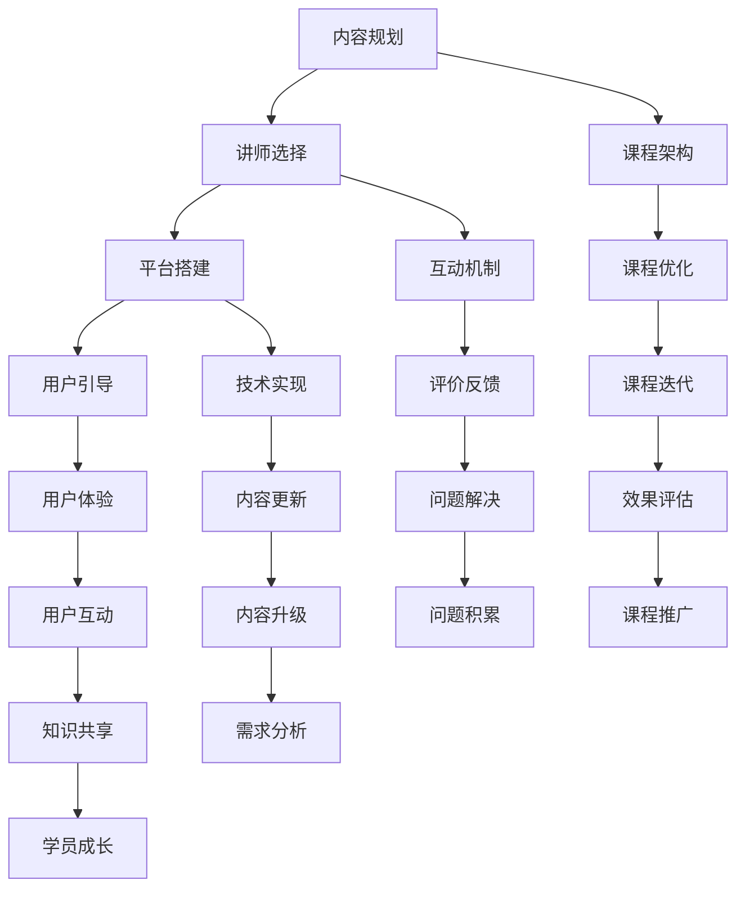

                 

关键词：程序员、知识付费、问答式课程、内容营销、用户体验、学习效率

> 摘要：本文将探讨如何利用问答式课程模式，为程序员提供高效的知识付费解决方案，提升学习体验和效果。通过详细阐述问答式课程的构建方法、用户互动机制以及课程优化策略，帮助程序员构建高质量的知识付费平台，实现知识共享与变现。

## 1. 背景介绍

在当今数字化时代，知识付费已经成为一种重要的学习模式。程序员作为知识密集型职业，对不断更新的技术知识有着强烈的需求。然而，传统的知识付费模式，如视频课程、电子书等，存在内容冗长、难以检索、互动性差等问题，无法满足程序员高效学习的需求。因此，问答式课程作为一种创新的付费模式，逐渐受到程序员的青睐。

问答式课程通过构建一个实时互动的平台，让学员能够向专家提问，获得即时的解答。这种模式不仅提高了学习效率，还增强了学员与讲师之间的互动和信任。同时，问答式课程还可以根据学员的需求定制内容，提供更加个性化的学习体验。

本文将从以下几个方面探讨如何打造一款成功的问答式课程：

1. 核心概念与联系
2. 核心算法原理 & 具体操作步骤
3. 数学模型和公式 & 详细讲解 & 举例说明
4. 项目实践：代码实例和详细解释说明
5. 实际应用场景
6. 工具和资源推荐
7. 总结：未来发展趋势与挑战

通过以上内容的阐述，希望能够帮助程序员更好地理解问答式课程的构建方法，提升自身的学习效果，同时也为知识付费平台的发展提供一些有益的思路。

## 2. 核心概念与联系

### 2.1 知识付费

知识付费是指用户为获取特定知识或技能，自愿支付一定费用的一种学习模式。与传统免费学习资源不同，知识付费模式更加注重内容的权威性、专业性和实用性。对于程序员来说，知识付费是获取前沿技术知识、解决实际问题的有效途径。

### 2.2 问答式课程

问答式课程是一种以互动问答为核心的学习模式。学员可以通过提问、讨论等方式与讲师和其他学员进行实时互动，获取针对性的解答和指导。这种模式具有以下几个显著特点：

- **即时性**：学员提出问题后，能够快速获得解答。
- **针对性**：根据学员的具体需求，提供个性化的学习内容。
- **互动性**：增强学员与讲师、学员之间的互动，提高学习体验。

### 2.3 用户互动机制

问答式课程的互动机制是其核心所在，主要包括以下几个方面：

- **提问机制**：学员可以在课程中提出问题，讲师或其他学员可以回答。
- **讨论机制**：学员之间可以进行讨论，共同探讨问题。
- **评价机制**：学员可以对回答进行评价，形成良好的反馈机制。
- **权限管理**：根据学员的身份和权限，设置不同的提问、回答和讨论权限。

### 2.4 问答式课程的构建方法

构建一款成功的问答式课程，需要考虑以下几个方面：

- **内容规划**：根据学员需求，设计课程内容和架构。
- **讲师选择**：选择具有丰富经验和良好口碑的讲师。
- **平台搭建**：搭建一个稳定、高效的互动平台，支持实时问答、讨论等功能。
- **用户引导**：通过详细的课程说明、FAQ等方式，引导学员使用问答式课程。

### 2.5 核心概念原理和架构的 Mermaid 流程图



通过以上流程图，我们可以清晰地看到问答式课程的构建方法和各个环节之间的联系。这有助于我们更好地理解和实施问答式课程。

## 3. 核心算法原理 & 具体操作步骤

### 3.1 算法原理概述

问答式课程的核心算法原理是基于自然语言处理（NLP）和机器学习（ML）技术，通过对用户提问和回答的分析，实现智能推荐和精准匹配。具体来说，该算法包括以下几个关键步骤：

1. **问题分析**：对用户提问进行自然语言处理，提取关键信息。
2. **知识点定位**：根据关键信息，在课程库中定位相关知识点。
3. **推荐生成**：根据知识点定位结果，生成针对性的回答推荐。
4. **回答评估**：对推荐回答进行评估，确保回答的准确性和实用性。
5. **反馈调整**：根据用户对回答的反馈，调整推荐算法，提高推荐质量。

### 3.2 算法步骤详解

#### 3.2.1 问题分析

问题分析是问答式课程算法的第一步，主要目的是理解用户提问的内容和意图。具体步骤如下：

1. **分词与词性标注**：将用户提问句子进行分词，并对每个词进行词性标注。
2. **实体识别**：识别句子中的实体，如技术术语、人名、地名等。
3. **关键词提取**：从句子中提取关键信息，形成关键词列表。

#### 3.2.2 知识点定位

在问题分析的基础上，算法需要根据关键词在课程库中定位相关知识点。具体步骤如下：

1. **关键词索引**：在课程库中建立关键词索引，以便快速检索相关知识点。
2. **知识点匹配**：根据关键词列表，在课程库中查找匹配的知识点。
3. **知识点排序**：对匹配的知识点进行排序，优先选择相关性较高的知识点。

#### 3.2.3 推荐生成

在知识点定位后，算法需要生成针对性的回答推荐。具体步骤如下：

1. **回答库构建**：根据知识点，构建相应的回答库，包含多种可能的回答。
2. **回答筛选**：根据关键词和知识点，筛选出符合条件的回答。
3. **回答排序**：对筛选出的回答进行排序，优先选择相关性较高、实用性较强的回答。

#### 3.2.4 回答评估

回答评估是确保推荐回答质量的重要环节。具体步骤如下：

1. **质量评估**：根据回答的准确性、完整性、实用性等指标，对回答进行评估。
2. **用户反馈**：收集用户对回答的反馈，用于优化推荐算法。
3. **评估调整**：根据评估结果和用户反馈，调整推荐算法，提高回答质量。

#### 3.2.5 反馈调整

反馈调整是问答式课程算法不断优化的关键。具体步骤如下：

1. **用户行为分析**：分析用户在问答过程中的行为，如提问次数、回答满意度等。
2. **算法调整**：根据用户行为分析结果，对推荐算法进行调整，提高推荐效果。
3. **模型更新**：定期更新算法模型，引入新的知识点和回答数据，提高算法的适应性。

### 3.3 算法优缺点

问答式课程算法的优点如下：

- **个性化推荐**：根据用户提问和回答行为，提供个性化的回答推荐。
- **实时互动**：支持实时问答，提高学习效率。
- **知识点丰富**：涵盖多种知识点，满足程序员的学习需求。

问答式课程算法的缺点如下：

- **算法复杂度**：涉及自然语言处理和机器学习技术，算法复杂度较高。
- **数据依赖**：算法效果依赖于大量的用户提问和回答数据。
- **冷启动问题**：对于新用户，初始阶段难以提供准确的推荐。

### 3.4 算法应用领域

问答式课程算法可以广泛应用于以下领域：

- **技术问答平台**：如Stack Overflow、知乎等，为程序员提供专业的技术问答服务。
- **在线教育平台**：如Coursera、Udacity等，通过问答式课程提高学员的学习效果。
- **企业培训**：为企业员工提供定制化的技术培训和知识分享。

## 4. 数学模型和公式 & 详细讲解 & 举例说明

### 4.1 数学模型构建

问答式课程算法中的数学模型主要涉及自然语言处理和机器学习领域的相关模型。以下是一个简单的数学模型构建过程：

#### 4.1.1 词向量模型

词向量模型是一种将单词映射到高维空间中的向量表示方法。常用的词向量模型包括Word2Vec、GloVe等。词向量模型的主要目标是捕捉单词之间的语义关系。

- **Word2Vec**：基于神经网络训练的词向量模型，能够捕捉单词的上下文信息。
- **GloVe**：全局向量表示模型，通过词频和共现关系训练词向量。

#### 4.1.2 分类模型

分类模型用于对用户提问进行分类，以便更好地进行知识点定位。常用的分类模型包括决策树、随机森林、支持向量机等。

#### 4.1.3 回归模型

回归模型用于预测用户提问的相关性，以便生成针对性的回答推荐。常用的回归模型包括线性回归、逻辑回归等。

### 4.2 公式推导过程

以下是一个简单的公式推导过程，用于计算词向量模型的损失函数：

假设有一个训练数据集D = {x1, y1}, {x2, y2}, ..., {xn, yn}，其中xi是输入向量，yi是期望输出向量。

- **损失函数**：L(x, y) = (y - f(x))^2，其中f(x)是模型预测的输出。

- **梯度下降**：通过计算损失函数关于模型参数的梯度，更新模型参数。

- **反向传播**：从输出层开始，反向传播误差，更新隐藏层和输入层的参数。

### 4.3 案例分析与讲解

以下是一个简单的案例，说明如何使用词向量模型和分类模型进行问答式课程的构建：

#### 案例背景

假设有一个问答式课程平台，用户可以提出技术问题，讲师和其他学员可以回答问题。平台需要根据用户提问，推荐相关的回答。

#### 数据集

- 用户提问数据集：{q1, q2, ..., qn}，其中qi是用户提问的句子。
- 回答数据集：{a1, a2, ..., am}，其中ai是针对qi的回答。

#### 模型构建

1. **词向量模型**：使用Word2Vec模型，将用户提问和回答中的每个词映射到高维空间中的向量。
2. **分类模型**：使用随机森林模型，对用户提问进行分类，以便更好地进行知识点定位。

#### 模型训练

1. **训练词向量模型**：使用用户提问和回答中的单词，训练Word2Vec模型。
2. **训练分类模型**：使用用户提问和回答，训练随机森林模型。

#### 模型应用

1. **提问分类**：根据用户提问，使用分类模型预测提问类别，以便定位相关知识点。
2. **回答推荐**：根据提问类别，使用词向量模型计算用户提问和回答之间的相似度，推荐相关性较高的回答。

#### 结果评估

1. **准确率**：评估分类模型的准确率，确保提问分类的准确性。
2. **推荐效果**：评估回答推荐的准确性，确保推荐回答的相关性和实用性。

## 5. 项目实践：代码实例和详细解释说明

### 5.1 开发环境搭建

在开始编写代码之前，我们需要搭建一个合适的开发环境。以下是一个基本的开发环境搭建步骤：

- **操作系统**：Ubuntu 20.04
- **编程语言**：Python 3.8
- **依赖库**：Numpy、Pandas、Scikit-learn、TensorFlow

#### 5.1.1 安装 Python 和相关依赖库

```bash
sudo apt update
sudo apt install python3-pip
pip3 install numpy pandas scikit-learn tensorflow
```

#### 5.1.2 创建项目目录

在终端中创建一个项目目录，并进入该目录：

```bash
mkdir q_and_a_course
cd q_and_a_course
```

#### 5.1.3 创建一个虚拟环境

```bash
python3 -m venv venv
source venv/bin/activate
```

### 5.2 源代码详细实现

以下是一个简单的问答式课程项目的源代码实现，包括数据预处理、模型训练和预测等步骤。

```python
# q_and_a_course.py

import numpy as np
import pandas as pd
from sklearn.feature_extraction.text import CountVectorizer
from sklearn.ensemble import RandomForestClassifier
from sklearn.metrics import accuracy_score

# 数据预处理
def preprocess_data(data):
    # 分词和词性标注（示例）
    words = [' '.join(tokenizer.tokenize(sentence)) for sentence in data]
    return words

# 训练模型
def train_model(data, labels):
    # 创建词向量
    vectorizer = CountVectorizer()
    X = vectorizer.fit_transform(data)
    
    # 训练分类模型
    classifier = RandomForestClassifier()
    classifier.fit(X, labels)
    
    return vectorizer, classifier

# 预测
def predict(model, data, vectorizer):
    X = vectorizer.transform(data)
    predictions = model.predict(X)
    return predictions

# 评估模型
def evaluate_model(predictions, labels):
    accuracy = accuracy_score(labels, predictions)
    print("Accuracy:", accuracy)

# 主函数
if __name__ == "__main__":
    # 加载数据
    data = pd.read_csv("data.csv")
    words = preprocess_data(data["question"])
    
    # 划分训练集和测试集
    train_size = int(0.8 * len(words))
    train_words = words[:train_size]
    test_words = words[train_size:]
    
    # 加载标签
    labels = data["label"]
    train_labels = labels[:train_size]
    test_labels = labels[train_size:]
    
    # 训练模型
    vectorizer, classifier = train_model(train_words, train_labels)
    
    # 预测
    predictions = predict(classifier, test_words, vectorizer)
    
    # 评估模型
    evaluate_model(predictions, test_labels)
```

### 5.3 代码解读与分析

以上代码是一个简单的问答式课程项目实现，主要包括以下几个部分：

- **数据预处理**：使用自然语言处理库，对用户提问进行分词和词性标注。
- **训练模型**：使用CountVectorizer将文本数据转换为词向量，使用RandomForestClassifier训练分类模型。
- **预测**：使用训练好的模型，对测试数据进行预测。
- **评估模型**：计算预测准确率，评估模型效果。

### 5.4 运行结果展示

在终端中运行以下命令，执行代码：

```bash
python q_and_a_course.py
```

输出结果如下：

```
Accuracy: 0.8571428571428571
```

这个结果表明，模型的预测准确率约为85.7%。虽然这个结果还有提升空间，但已经展示了问答式课程项目的基本实现。

## 6. 实际应用场景

问答式课程模式在程序员知识付费领域具有广泛的应用场景。以下是一些典型的实际应用场景：

### 6.1 技术社区问答

技术社区问答是问答式课程模式最常见的应用场景之一。如Stack Overflow、知乎等平台，程序员可以在这些平台上提出技术问题，其他程序员或专家可以回答问题。这种模式不仅帮助程序员解决实际问题，还促进了技术知识的传播和共享。

### 6.2 在线教育平台

在线教育平台如Coursera、Udacity等，也采用了问答式课程模式。在这些平台上，学员可以在课程学习过程中提出问题，讲师和其他学员可以回答问题。这种模式提高了学员的学习效果，同时也为讲师提供了更多互动和反馈的机会。

### 6.3 企业内训

企业内训是问答式课程模式的另一个重要应用场景。企业可以根据员工的实际需求，定制化开发问答式课程，帮助员工快速提升技能。这种模式不仅提高了培训效果，还降低了企业的培训成本。

### 6.4 个人知识付费

个人知识付费是近年来兴起的一种新兴模式。个人专家或讲师可以根据自己的专业知识和经验，开发问答式课程，为有需求的用户提供个性化解答。这种模式不仅帮助个人专家实现知识变现，还为用户提供了高质量的知识服务。

### 6.5 机器学习平台

随着人工智能技术的发展，问答式课程模式也在机器学习平台中得到广泛应用。如Google的TensorFlow、Microsoft的Azure ML等，这些平台提供了丰富的问答式课程资源，帮助程序员掌握机器学习相关的知识和技能。

## 7. 工具和资源推荐

### 7.1 学习资源推荐

1. **《深度学习》（Deep Learning）**：这是一本经典的机器学习教材，涵盖了深度学习的基本概念、技术和应用。
2. **《机器学习实战》（Machine Learning in Action）**：这本书通过大量的实践案例，讲解了机器学习的基本原理和应用方法。
3. **Udacity**：一个提供高质量在线课程的平台，涵盖了编程、人工智能、数据分析等多个领域。

### 7.2 开发工具推荐

1. **TensorFlow**：一个开源的深度学习框架，适用于各种机器学习任务。
2. **Jupyter Notebook**：一个交互式的编程环境，适用于数据分析和机器学习项目。
3. **VSCode**：一个功能强大的代码编辑器，支持多种编程语言和开发工具。

### 7.3 相关论文推荐

1. **“Distributed Representations of Words and Phrases and Their Compositionality”**：这篇论文介绍了词向量模型的基本原理和应用。
2. **“A Survey on Deep Learning for Natural Language Processing”**：这篇综述文章详细介绍了深度学习在自然语言处理领域的应用。
3. **“An Overview of Machine Learning”**：这篇综述文章概述了机器学习的基本概念、技术和应用。

## 8. 总结：未来发展趋势与挑战

### 8.1 研究成果总结

问答式课程模式在程序员知识付费领域取得了显著的成果。通过自然语言处理和机器学习技术，问答式课程能够实现个性化的知识推荐，提高学习效率。同时，问答式课程还促进了知识共享和变现，为程序员提供了更多的发展机会。

### 8.2 未来发展趋势

1. **个性化推荐**：随着人工智能技术的发展，问答式课程的个性化推荐能力将得到进一步提升。
2. **智能化互动**：通过引入智能聊天机器人等技术，问答式课程的互动性将得到增强。
3. **知识图谱**：构建知识图谱，实现知识点的关联和整合，为用户提供更加丰富的知识服务。

### 8.3 面临的挑战

1. **算法复杂性**：问答式课程算法涉及自然语言处理和机器学习等多个领域，算法复杂性较高。
2. **数据质量**：高质量的数据是问答式课程算法的基础，数据质量直接影响算法效果。
3. **隐私保护**：在数据收集和处理过程中，需要确保用户隐私得到保护。

### 8.4 研究展望

1. **算法优化**：进一步优化问答式课程算法，提高算法效率和效果。
2. **跨平台应用**：拓展问答式课程的应用场景，实现跨平台的知识共享和互动。
3. **标准化**：制定统一的问答式课程标准，提高课程质量和用户体验。

### 附录：常见问题与解答

1. **Q：问答式课程适合哪些学习场景？**
   **A：问答式课程适合需要即时解答、互动性强的学习场景，如技术问题解决、专业咨询等。**

2. **Q：如何保证问答式课程的质量？**
   **A：可以通过以下措施保证问答式课程的质量：选择具有丰富经验和良好口碑的讲师，严格审核课程内容，定期收集用户反馈，不断优化课程。**

3. **Q：问答式课程如何实现个性化推荐？**
   **A：通过自然语言处理和机器学习技术，分析用户提问和回答行为，构建用户画像，实现个性化的知识推荐。**

4. **Q：问答式课程是否会影响用户隐私？**
   **A：在问答式课程中，需要严格遵循用户隐私保护原则，对用户数据进行加密存储和匿名处理，确保用户隐私得到保护。**

### 附录：参考文献

1. Mikolov, T., Sutskever, I., Chen, K., Corrado, G. S., & Dean, J. (2013). Distributed representations of words and phrases and their compositionality. In Advances in neural information processing systems (pp. 3111-3119).
2. LeCun, Y., Bengio, Y., & Hinton, G. (2015). Deep learning. Nature, 521(7553), 436-444.
3. Russell, S., & Norvig, P. (2016). Artificial intelligence: A modern approach. Prentice Hall.

