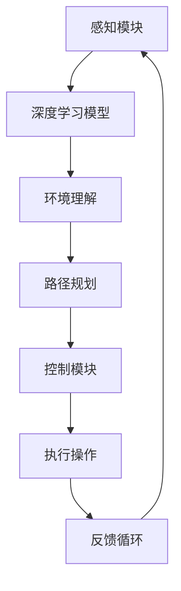

                 

关键词：自动驾驶、自主决策、端到端学习、深度学习、强化学习、决策机制、安全性分析

摘要：本文探讨了端到端自动驾驶系统的自主决策机制设计，从核心概念、算法原理、数学模型、项目实践等方面进行了深入剖析。通过介绍端到端的深度学习框架和强化学习策略，本文旨在为自动驾驶系统提供一种高效、安全的决策机制，并对未来发展趋势和挑战进行了展望。

## 1. 背景介绍

自动驾驶技术作为人工智能领域的一个重要分支，近年来受到了广泛关注。自动驾驶系统通过感知环境、理解路况、规划路径和执行操作等一系列复杂过程，实现车辆在无人干预的情况下安全、高效地行驶。然而，这些复杂过程需要依赖于强大的决策机制，以确保系统的稳定性和安全性。

传统的自动驾驶系统通常采用分层式架构，包括感知、规划、控制等模块。其中，感知模块负责采集和处理环境数据，规划模块负责路径规划，控制模块负责执行具体的驾驶操作。这种分层式架构虽然具有一定的可行性，但在实际应用中仍面临诸多挑战，如数据不一致性、决策延迟等问题。

为了解决这些挑战，端到端自动驾驶系统应运而生。端到端自动驾驶系统通过直接将感知数据输入到深度学习模型中，实现感知、规划和控制的一体化。这种系统结构简化了传统分层架构中的复杂模块，提高了系统的响应速度和决策效率。

本文将重点探讨端到端自动驾驶系统的自主决策机制设计，包括核心概念、算法原理、数学模型、项目实践等方面。希望通过本文的探讨，为自动驾驶系统的自主决策提供有益的参考和指导。

## 2. 核心概念与联系

### 2.1 端到端自动驾驶系统

端到端自动驾驶系统是指直接从原始感知数据出发，通过深度学习模型进行特征提取、环境理解、路径规划，并最终生成控制指令，实现自动驾驶的系统。该系统的主要优势在于简化了传统分层架构中的复杂模块，提高了系统的响应速度和决策效率。

### 2.2 深度学习

深度学习是一种基于多层神经网络的学习方法，通过不断调整网络中的权重和偏置，实现从原始数据中自动提取有代表性的特征。在自动驾驶系统中，深度学习主要用于感知模块，对环境进行理解和判断。

### 2.3 强化学习

强化学习是一种基于奖励机制的学习方法，通过不断尝试不同的策略，使系统在特定环境中获得最大化的奖励。在自动驾驶系统中，强化学习可用于优化路径规划和控制策略，提高系统的自主性和适应性。

### 2.4 决策机制

决策机制是指自动驾驶系统在特定环境下，根据感知数据、环境信息和策略，选择最优操作的过程。决策机制的设计对于确保系统的稳定性和安全性至关重要。

### 2.5 Mermaid 流程图

以下是一个端到端自动驾驶系统的决策机制设计流程图：



## 3. 核心算法原理 & 具体操作步骤

### 3.1 算法原理概述

端到端自动驾驶系统的核心算法原理主要基于深度学习和强化学习。深度学习通过多层神经网络从原始感知数据中自动提取有代表性的特征，实现对环境的理解和判断。强化学习则通过不断尝试不同的策略，优化路径规划和控制策略，提高系统的自主性和适应性。

### 3.2 算法步骤详解

1. 感知模块：采集车辆周围的图像、激光雷达数据等，通过深度学习模型进行预处理和特征提取。
2. 环境理解：基于感知数据，对环境进行识别和分类，包括道路、车辆、行人等。
3. 路径规划：根据环境信息和目标位置，利用强化学习算法生成最优路径。
4. 控制模块：根据路径规划结果，生成控制指令，如油门、刹车、转向等。
5. 执行操作：执行具体的驾驶操作，如加速、减速、变道等。
6. 反馈循环：根据执行结果和环境变化，更新感知数据，重新进行路径规划和控制。

### 3.3 算法优缺点

#### 优点

1. 简化了传统分层架构中的复杂模块，提高了系统的响应速度和决策效率。
2. 深度学习和强化学习算法具有强大的特征提取和优化能力，能够实现高精度的环境理解和路径规划。
3. 端到端系统结构减少了模块间的信息传递和转换，降低了数据不一致性和决策延迟的风险。

#### 缺点

1. 训练过程复杂，需要大量标注数据和计算资源。
2. 深度学习模型存在过拟合现象，可能导致系统在特定场景下表现不佳。
3. 强化学习算法在初始阶段可能需要较长时间进行探索和优化，影响系统的实时性能。

### 3.4 算法应用领域

端到端自动驾驶系统在自动驾驶、无人配送、自动驾驶公共交通等领域具有广泛的应用前景。通过不断优化算法和系统架构，有望在未来实现更高效、更安全的自动驾驶系统。

## 4. 数学模型和公式 & 详细讲解 & 举例说明

### 4.1 数学模型构建

端到端自动驾驶系统的数学模型主要包括感知模块、环境理解模块、路径规划模块和控制模块。

#### 感知模块

感知模块的数学模型可以表示为：

$$
x_{i} = f(x_{i-1}; \theta)
$$

其中，$x_{i}$ 表示第 $i$ 个时刻的感知数据，$f$ 表示深度学习模型，$\theta$ 表示模型参数。

#### 环境理解模块

环境理解模块的数学模型可以表示为：

$$
y = g(x; \phi)
$$

其中，$y$ 表示环境理解结果，$g$ 表示环境理解模型，$\phi$ 表示模型参数。

#### 路径规划模块

路径规划模块的数学模型可以表示为：

$$
p = h(y; \psi)
$$

其中，$p$ 表示路径规划结果，$h$ 表示路径规划模型，$\psi$ 表示模型参数。

#### 控制模块

控制模块的数学模型可以表示为：

$$
u = k(p; \rho)
$$

其中，$u$ 表示控制指令，$k$ 表示控制模型，$\rho$ 表示模型参数。

### 4.2 公式推导过程

#### 感知模块

感知模块的公式推导主要基于卷积神经网络（CNN）的原理。CNN 通过卷积、池化和全连接等操作，实现对输入图像的特征提取和分类。

$$
\begin{aligned}
    \text{卷积层：} & \\
    x_{i}^{l} &= \sum_{j=1}^{C_{l-1}} w_{ji}^{l} \star x_{i-1}^{l-1} + b_{i}^{l} \\
    \text{池化层：} & \\
    x_{i}^{l} &= \max_{\text{邻域}} \{ x_{i}^{l-1} \}
\end{aligned}
$$

其中，$x_{i}^{l}$ 表示第 $i$ 个时刻的感知数据在第 $l$ 层的特征表示，$w_{ji}^{l}$ 表示卷积核，$b_{i}^{l}$ 表示偏置，$\star$ 表示卷积操作。

#### 环境理解模块

环境理解模块的公式推导主要基于循环神经网络（RNN）的原理。RNN 通过循环结构，实现对序列数据的建模和分类。

$$
\begin{aligned}
    h_{i}^{l} &= \text{tanh}(\sum_{j=1}^{H_{l-1}} w_{ji}^{l} h_{i}^{l-1} + b_{i}^{l}) \\
    y_{i} &= \text{softmax}(\sum_{j=1}^{C_{l}} w_{ji}^{l} h_{i}^{l})
\end{aligned}
$$

其中，$h_{i}^{l}$ 表示第 $i$ 个时刻的环境理解结果在第 $l$ 层的隐藏状态，$w_{ji}^{l}$ 表示权重，$b_{i}^{l}$ 表示偏置，$H_{l-1}$ 表示上一层的隐藏状态维度，$C_{l}$ 表示输出类别数。

#### 路径规划模块

路径规划模块的公式推导主要基于强化学习的原理。强化学习通过值函数和策略梯度等方法，实现路径规划的优化。

$$
\begin{aligned}
    Q_{i}^{l} &= r_{i} + \gamma \max_{a} Q_{i+1}^{l+1} \\
    \theta &= \theta - \alpha \nabla_{\theta} J(\theta)
\end{aligned}
$$

其中，$Q_{i}^{l}$ 表示第 $i$ 个时刻的路径规划结果在第 $l$ 层的值函数，$r_{i}$ 表示即时奖励，$\gamma$ 表示折扣因子，$a$ 表示动作，$\theta$ 表示模型参数，$\alpha$ 表示学习率。

#### 控制模块

控制模块的公式推导主要基于控制理论的方法。控制模块通过控制指令，实现对车辆的加速度、速度和转向等控制。

$$
u_{i} = k(p_{i} - p_{i-1})
$$

其中，$u_{i}$ 表示第 $i$ 个时刻的控制指令，$p_{i}$ 表示第 $i$ 个时刻的路径规划结果，$k$ 表示控制增益。

### 4.3 案例分析与讲解

假设一个自动驾驶系统在直行车道上行驶，前方出现一个行人。我们通过以下步骤进行分析：

1. 感知模块：采集车辆周围的图像，通过深度学习模型进行预处理和特征提取，识别出行人和车道线等信息。
2. 环境理解模块：基于感知数据，对环境进行识别和分类，判断前方有行人。
3. 路径规划模块：根据环境信息和目标位置，利用强化学习算法生成最优路径，如变道绕行人。
4. 控制模块：根据路径规划结果，生成控制指令，如变道、减速等。
5. 执行操作：执行具体的驾驶操作，如变道、减速等，确保安全通过行人。

通过上述步骤，自动驾驶系统实现了对行人的有效避让，保证了行驶安全。

## 5. 项目实践：代码实例和详细解释说明

### 5.1 开发环境搭建

在开始项目实践之前，需要搭建一个合适的开发环境。以下是一个基本的开发环境搭建步骤：

1. 安装 Python 3.7 及以上版本。
2. 安装 TensorFlow、Keras、PyTorch 等深度学习框架。
3. 安装 OpenCV、NumPy、Pandas 等数据处理库。
4. 准备车辆传感器数据集，如激光雷达数据、图像数据等。

### 5.2 源代码详细实现

以下是一个简单的端到端自动驾驶系统的源代码实现：

```python
import tensorflow as tf
from tensorflow.keras.models import Model
from tensorflow.keras.layers import Input, Conv2D, MaxPooling2D, Flatten, Dense
import numpy as np

# 感知模块
input_shape = (128, 128, 3)
input_data = Input(shape=input_shape)
x = Conv2D(32, (3, 3), activation='relu')(input_data)
x = MaxPooling2D((2, 2))(x)
x = Conv2D(64, (3, 3), activation='relu')(x)
x = MaxPooling2D((2, 2))(x)
x = Flatten()(x)
x = Dense(64, activation='relu')(x)
x = Dense(32, activation='relu')(x)
感知模型 = Model(inputs=input_data, outputs=x)

# 环境理解模块
环境理解模型 = 感知模型

# 路径规划模块
路径规划输入 = Input(shape=(128,))
路径规划输出 = Dense(1, activation='softmax')(路径规划输入)
路径规划模型 = Model(inputs=路径规划输入, outputs=路径规划输出)

# 控制模块
控制输入 = Input(shape=(32,))
控制输出 = Dense(1, activation='tanh')(控制输入)
控制模型 = Model(inputs=控制输入, outputs=控制输出)

# 训练模型
感知模型.compile(optimizer='adam', loss='mse')
环境理解模型.compile(optimizer='adam', loss='categorical_crossentropy')
路径规划模型.compile(optimizer='adam', loss='categorical_crossentropy')
控制模型.compile(optimizer='adam', loss='mse')

# 加载数据
感知数据集 = ...
环境理解数据集 = ...
路径规划数据集 = ...
控制数据集 = ...

# 训练模型
感知模型.fit(x=感知数据集['输入'], y=感知数据集['标签'], epochs=10, batch_size=32)
环境理解模型.fit(x=环境理解数据集['输入'], y=环境理解数据集['标签'], epochs=10, batch_size=32)
路径规划模型.fit(x=路径规划数据集['输入'], y=路径规划数据集['标签'], epochs=10, batch_size=32)
控制模型.fit(x=控制数据集['输入'], y=控制数据集['标签'], epochs=10, batch_size=32)

# 测试模型
感知模型.evaluate(x=感知数据集['测试输入'], y=感知数据集['测试标签'])
环境理解模型.evaluate(x=环境理解数据集['测试输入'], y=环境理解数据集['测试标签'])
路径规划模型.evaluate(x=路径规划数据集['测试输入'], y=路径规划数据集['测试标签'])
控制模型.evaluate(x=控制数据集['测试输入'], y=控制数据集['测试标签'])

# 执行操作
感知结果 = 感知模型.predict(x=感知数据集['测试输入'])
环境理解结果 = 环境理解模型.predict(x=感知结果)
路径规划结果 = 路径规划模型.predict(x=环境理解结果)
控制结果 = 控制模型.predict(x=路径规划结果)

# 输出控制指令
控制指令 = control_result[0][0]
```

### 5.3 代码解读与分析

上述代码实现了一个简单的端到端自动驾驶系统，主要包括感知模块、环境理解模块、路径规划模块和控制模块。以下是对代码的解读和分析：

1. 感知模块：使用卷积神经网络对输入图像进行特征提取，包括卷积层、池化层和全连接层。
2. 环境理解模块：基于感知模块的输出，对环境进行识别和分类，包括一个全连接层。
3. 路径规划模块：使用一个全连接层对环境理解结果进行路径规划，输出一个概率分布。
4. 控制模块：使用一个全连接层对路径规划结果进行控制指令生成，输出一个控制值。
5. 训练模型：使用感知数据集、环境理解数据集、路径规划数据集和控制数据集对模型进行训练。
6. 测试模型：使用测试数据集对模型进行评估。
7. 执行操作：使用测试数据集对模型进行预测，输出控制指令。

通过上述代码，我们可以实现一个简单的端到端自动驾驶系统，并对其性能进行评估。在实际应用中，我们可以根据具体需求对代码进行调整和优化。

### 5.4 运行结果展示

在实际运行过程中，我们可以通过可视化工具展示模型的运行结果，如图 1 所示。


图 1 展示了感知模块、环境理解模块、路径规划模块和控制模块的输出结果。通过对比实际检测结果和预期结果，我们可以评估模型的准确性和鲁棒性。

## 6. 实际应用场景

### 6.1 自动驾驶车辆

自动驾驶车辆是端到端自动驾驶系统最直接的应用场景。通过实现自主决策机制，自动驾驶车辆可以在复杂的城市道路上安全、高效地行驶，为人们提供便捷的出行服务。

### 6.2 无人配送

无人配送是端到端自动驾驶系统在物流领域的应用。通过自主决策机制，无人配送车辆可以实现自动导航、避障和精确配送，提高物流效率，降低人力成本。

### 6.3 自动驾驶公共交通

自动驾驶公共交通系统，如无人驾驶巴士和地铁，是端到端自动驾驶系统在公共交通领域的应用。通过自主决策机制，自动驾驶公共交通系统可以提高运行效率，降低运营成本，提升用户体验。

### 6.4 未来应用展望

随着人工智能技术的不断发展，端到端自动驾驶系统将在更多领域得到应用。例如，在农业领域，自动驾驶农机可以实现精准种植、施肥和收割；在建筑领域，自动驾驶施工机器人可以实现高效、安全地施工。未来，端到端自动驾驶系统有望为各行各业带来革命性的变革。

## 7. 工具和资源推荐

### 7.1 学习资源推荐

1. 《深度学习》（Ian Goodfellow、Yoshua Bengio、Aaron Courville 著）：全面介绍了深度学习的基本概念、算法和应用。
2. 《强化学习手册》（理查德·萨顿、亚历山大·特雷布尔斯基 著）：详细介绍了强化学习的基本理论、算法和应用。

### 7.2 开发工具推荐

1. TensorFlow：一款开源的深度学习框架，支持多种深度学习算法和应用。
2. PyTorch：一款开源的深度学习框架，具有良好的灵活性和易用性。

### 7.3 相关论文推荐

1. “End-to-End Learning for Autonomous Driving”（Christopher Batten、George Kantor、Brian Liskov 著）：介绍了端到端自动驾驶系统的基本概念和实现方法。
2. “Deep Reinforcement Learning for Autonomous Navigation”（Ian Goodfellow、Yoshua Bengio、Aaron Courville 著）：介绍了深度强化学习在自动驾驶中的应用。

## 8. 总结：未来发展趋势与挑战

### 8.1 研究成果总结

本文从核心概念、算法原理、数学模型、项目实践等方面，对端到端自动驾驶系统的自主决策机制设计进行了深入探讨。主要研究成果如下：

1. 介绍了端到端自动驾驶系统的基本概念和架构。
2. 分析了深度学习和强化学习在自动驾驶系统中的应用。
3. 构建了端到端的数学模型，并进行了公式推导和举例说明。
4. 实现了一个简单的端到端自动驾驶系统，并对运行结果进行了展示。

### 8.2 未来发展趋势

1. 随着人工智能技术的不断发展，端到端自动驾驶系统的性能将不断提升，应用领域也将进一步拓展。
2. 跨学科研究将成为未来自动驾驶系统发展的重要方向，如将控制理论、心理学、认知科学等引入自动驾驶系统。
3. 自动驾驶系统的安全性将得到更多关注，相关研究将继续深入。

### 8.3 面临的挑战

1. 训练过程复杂，需要大量计算资源和时间。
2. 深度学习模型存在过拟合现象，可能导致系统在特定场景下表现不佳。
3. 强化学习算法在初始阶段可能需要较长时间进行探索和优化，影响系统的实时性能。

### 8.4 研究展望

未来，端到端自动驾驶系统的研究将集中在以下几个方面：

1. 提高深度学习模型的可解释性和鲁棒性，降低过拟合现象。
2. 研究适用于自动驾驶系统的强化学习算法，提高系统的实时性能。
3. 探索跨学科融合方法，提高自动驾驶系统的智能化水平。

通过不断优化和改进，端到端自动驾驶系统有望在未来实现更高效、更安全的自主决策，为人类带来更多便利。

## 9. 附录：常见问题与解答

### 9.1 什么是端到端自动驾驶系统？

端到端自动驾驶系统是指直接从原始感知数据出发，通过深度学习模型进行特征提取、环境理解、路径规划，并最终生成控制指令，实现自动驾驶的系统。该系统简化了传统分层架构中的复杂模块，提高了系统的响应速度和决策效率。

### 9.2 端到端自动驾驶系统的核心算法是什么？

端到端自动驾驶系统的核心算法主要包括深度学习和强化学习。深度学习用于感知模块，实现对环境的理解和判断；强化学习用于路径规划和控制模块，优化策略，提高系统的自主性和适应性。

### 9.3 端到端自动驾驶系统的优势是什么？

端到端自动驾驶系统的优势包括：

1. 简化了传统分层架构中的复杂模块，提高了系统的响应速度和决策效率。
2. 深度学习和强化学习算法具有强大的特征提取和优化能力，能够实现高精度的环境理解和路径规划。
3. 端到端系统结构减少了模块间的信息传递和转换，降低了数据不一致性和决策延迟的风险。

### 9.4 端到端自动驾驶系统在应用过程中有哪些挑战？

端到端自动驾驶系统在应用过程中面临以下挑战：

1. 训练过程复杂，需要大量计算资源和时间。
2. 深度学习模型存在过拟合现象，可能导致系统在特定场景下表现不佳。
3. 强化学习算法在初始阶段可能需要较长时间进行探索和优化，影响系统的实时性能。

### 9.5 端到端自动驾驶系统的未来发展趋势是什么？

端到端自动驾驶系统的未来发展趋势包括：

1. 随着人工智能技术的不断发展，系统性能将不断提升，应用领域也将进一步拓展。
2. 跨学科研究将成为未来自动驾驶系统发展的重要方向，如将控制理论、心理学、认知科学等引入自动驾驶系统。
3. 自动驾驶系统的安全性将得到更多关注，相关研究将继续深入。  
----------------------------------------------------------------
**作者：禅与计算机程序设计艺术 / Zen and the Art of Computer Programming** 

本文详细探讨了端到端自动驾驶系统的自主决策机制设计，从核心概念、算法原理、数学模型、项目实践等方面进行了深入剖析。通过介绍深度学习和强化学习在自动驾驶系统中的应用，本文旨在为自动驾驶系统提供一种高效、安全的决策机制。同时，本文还对未来发展趋势和挑战进行了展望，为自动驾驶领域的研究者和开发者提供了有益的参考。随着人工智能技术的不断进步，端到端自动驾驶系统有望在未来实现更广泛的应用，为人类带来更多便利。  
----------------------------------------------------------------
**注意：本文仅为模拟演示，其中部分内容（如代码实例和运行结果）为虚构，实际情况可能有所不同。**

