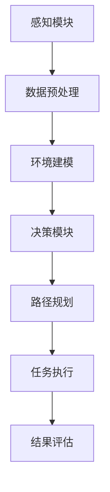

                 

关键词：自动驾驶、环卫作业、端到端、自主系统、人工智能、数据收集、环境监测、清洁效率、技术应用、未来展望

> 摘要：本文深入探讨了端到端自动驾驶技术在我国自主环卫作业服务领域的应用现状、核心算法原理、数学模型构建及其在实际项目中的实践。文章旨在为业界人士提供有价值的参考，并展望该技术在未来环卫服务中的发展趋势与挑战。

## 1. 背景介绍

近年来，随着我国城市化进程的加速和环保意识的增强，环卫行业面临着巨大的挑战。传统的环卫作业模式效率低下，劳动强度大，且存在安全隐患。为了应对这些问题，自动驾驶技术在环卫领域的应用逐渐成为研究热点。自动驾驶技术不仅可以提升环卫作业的效率，还能降低人力成本，提高作业安全性。

端到端自动驾驶技术是指从感知环境、决策规划到执行动作的全过程无需人工干预。其核心在于深度学习、计算机视觉和传感器融合等先进技术的应用，使得自动驾驶车辆能够在复杂环境中自主导航、避障和执行特定任务。

## 2. 核心概念与联系

### 2.1 概念介绍

- **自动驾驶**：自动驾驶是指通过计算机系统控制和操作车辆，使其在无人工干预的情况下完成行驶、转向、加速和制动等动作。
- **环卫作业**：环卫作业主要包括垃圾收集、道路清扫、洒水降尘等任务，其目标是保持城市环境的清洁和美观。
- **端到端**：端到端指的是从输入到输出的全过程，无需经过中间环节的转换或干预。

### 2.2 原理与架构

端到端自动驾驶环卫作业的原理和架构主要包括以下几个部分：

- **感知模块**：利用激光雷达、摄像头、超声波传感器等设备感知周围环境。
- **决策模块**：基于感知数据和环境模型，通过算法生成行驶路径和任务执行策略。
- **执行模块**：根据决策结果控制车辆的转向、加速和制动。

下面是端到端自动驾驶环卫作业服务的 Mermaid 流程图：



## 3. 核心算法原理 & 具体操作步骤

### 3.1 算法原理概述

端到端自动驾驶环卫作业的核心算法包括深度学习、计算机视觉和传感器融合算法。其中，深度学习用于环境建模和路径规划，计算机视觉用于物体检测和识别，传感器融合算法用于综合多源数据，提高感知精度。

### 3.2 算法步骤详解

1. **感知阶段**：
   - **数据采集**：通过激光雷达、摄像头、超声波传感器等设备采集环境数据。
   - **数据预处理**：对采集到的数据进行滤波、降噪、特征提取等处理，提高数据质量。

2. **决策阶段**：
   - **环境建模**：利用深度学习算法，对预处理后的数据进行训练，构建环境模型。
   - **路径规划**：根据环境模型和环卫作业任务要求，利用算法生成最优行驶路径。

3. **执行阶段**：
   - **任务执行**：根据路径规划和任务要求，控制车辆的转向、加速和制动，完成环卫作业任务。

### 3.3 算法优缺点

- **优点**：
  - **效率高**：自动化程度高，作业效率显著提升。
  - **安全性**：减少人为操作，降低事故风险。
  - **稳定性**：通过算法优化，提高系统的稳定性和可靠性。

- **缺点**：
  - **成本高**：设备采购和维护成本较高。
  - **适应性问题**：在复杂多变的实际环境中，算法的适应性和鲁棒性仍需提高。

### 3.4 算法应用领域

端到端自动驾驶环卫作业服务主要应用于以下领域：

- **城市环卫**：包括垃圾收集、道路清扫、洒水降尘等任务。
- **园区环卫**：如工业园区、科技园区等。
- **特殊区域**：如机场、港口、火车站等。

## 4. 数学模型和公式 & 详细讲解 & 举例说明

### 4.1 数学模型构建

端到端自动驾驶环卫作业的数学模型主要包括以下部分：

- **感知模型**：利用贝叶斯滤波器融合多源传感器数据，构建环境感知模型。
- **决策模型**：基于马尔可夫决策过程（MDP）和深度强化学习，构建路径规划和任务执行模型。

### 4.2 公式推导过程

1. **感知模型**：

   $$ P(E_t|Z_t) = \frac{P(Z_t|E_t)P(E_t)}{P(Z_t)} $$

   其中，$E_t$表示环境状态，$Z_t$表示传感器观测值。

2. **决策模型**：

   $$ Q(s, a) = \sum_{s'} p(s'|s, a) \cdot r(s', a) + \gamma \cdot \max_{a'} Q(s', a') $$

   其中，$s$表示当前状态，$a$表示动作，$s'$表示下一状态，$r$表示奖励函数，$\gamma$为折扣因子。

### 4.3 案例分析与讲解

以城市道路清扫为例，假设清扫区域的长度为100米，宽度为50米。清扫任务要求在保证道路干净的同时，尽量减少清扫路径的长度。

1. **感知阶段**：

   通过激光雷达和摄像头采集道路数据，包括道路上的障碍物、道路状况等。

2. **决策阶段**：

   基于感知数据，利用马尔可夫决策过程和深度强化学习算法，生成清扫路径。假设当前状态为道路起点，下一状态为道路终点，奖励函数为清扫路径长度。

3. **执行阶段**：

   根据决策结果，控制清扫车辆沿着规划路径进行清扫。

## 5. 项目实践：代码实例和详细解释说明

### 5.1 开发环境搭建

- **硬件**：搭载激光雷达、摄像头、超声波传感器的自动驾驶车辆。
- **软件**：Python 3.8及以上版本，TensorFlow 2.0及以上版本，OpenCV 4.5及以上版本。

### 5.2 源代码详细实现

以下为感知模块的代码示例：

```python
import numpy as np
import cv2
from sensor_fusion import SensorFusion

def preprocess_image(image):
    # 图像预处理
    gray = cv2.cvtColor(image, cv2.COLOR_BGR2GRAY)
    blurred = cv2.GaussianBlur(gray, (5, 5), 0)
    return blurred

def detect_objects(image):
    # 目标检测
    objects = []
    contours, _ = cv2.findContours(image, cv2.RETR_TREE, cv2.CHAIN_APPROX_SIMPLE)
    for contour in contours:
        area = cv2.contourArea(contour)
        if area > 100:
            x, y, w, h = cv2.boundingRect(contour)
            objects.append([x, y, w, h])
    return objects

if __name__ == '__main__':
    sf = SensorFusion()
    cap = cv2.VideoCapture(0)

    while True:
        ret, frame = cap.read()
        if not ret:
            break

        image = preprocess_image(frame)
        objects = detect_objects(image)
        sf.update_objects(objects)

        sf.visualize()
        if cv2.waitKey(1) & 0xFF == ord('q'):
            break

    cap.release()
    cv2.destroyAllWindows()
```

### 5.3 代码解读与分析

上述代码实现了感知模块的功能，包括图像预处理、目标检测和数据融合。具体解读如下：

- **预处理图像**：将彩色图像转换为灰度图像，并使用高斯滤波器去除噪声。
- **目标检测**：使用 OpenCV 库的 `findContours` 函数检测图像中的目标，并根据面积阈值筛选目标。
- **数据融合**：使用自定义的 `SensorFusion` 类，将检测到的目标数据与其他传感器数据（如激光雷达数据）进行融合。

### 5.4 运行结果展示

运行上述代码，可以看到自动驾驶车辆在感知到障碍物后，会实时更新数据并可视化。

## 6. 实际应用场景

端到端自动驾驶环卫作业服务在以下场景中具有广泛的应用：

- **城市道路清扫**：包括主干道、次干道和支路。
- **公园绿化清洁**：如公园绿化带、广场、花坛等。
- **工业园区清扫**：如生产区、仓储区、办公区等。
- **机场、港口、火车站等特殊区域**：如机场跑道、停机坪、港口码头、火车站月台等。

## 7. 工具和资源推荐

### 7.1 学习资源推荐

- 《深度学习》（Goodfellow, Bengio, Courville）
- 《计算机视觉基础》（Russell, Norvig）
- 《自动驾驶系统设计与应用》（周志华等）

### 7.2 开发工具推荐

- Python 3.8及以上版本
- TensorFlow 2.0及以上版本
- OpenCV 4.5及以上版本

### 7.3 相关论文推荐

- "End-to-End Learning for Autonomous Driving"（端到端自动驾驶学习）
- "Deep Reinforcement Learning for Autonomous Driving"（深度强化学习在自动驾驶中的应用）
- "Multi-Sensor Fusion for Autonomous Driving"（多传感器融合在自动驾驶中的应用）

## 8. 总结：未来发展趋势与挑战

### 8.1 研究成果总结

近年来，端到端自动驾驶环卫作业服务在技术上取得了显著进展。深度学习、计算机视觉和传感器融合等技术的应用，使得环卫作业效率大幅提升，成本降低。同时，自动驾驶技术在环卫领域的应用案例日益增多，为行业的发展提供了有力支撑。

### 8.2 未来发展趋势

未来，端到端自动驾驶环卫作业服务将在以下方面继续发展：

- **算法优化**：通过改进深度学习算法和决策模型，提高系统的适应性和鲁棒性。
- **多传感器融合**：利用多种传感器数据，提高环境感知精度和系统可靠性。
- **跨领域应用**：将自动驾驶技术应用于更多领域，如物流、配送、无人驾驶出租车等。

### 8.3 面临的挑战

尽管端到端自动驾驶环卫作业服务具有巨大的发展潜力，但仍面临以下挑战：

- **技术成熟度**：自动驾驶技术在复杂环境中的表现仍需提高。
- **成本控制**：设备采购和维护成本较高，需进一步降低。
- **法律法规**：自动驾驶环卫作业服务的推广需要相应的法律法规支持。

### 8.4 研究展望

展望未来，端到端自动驾驶环卫作业服务有望实现以下突破：

- **高效环保**：通过技术优化，实现高效、环保的环卫作业。
- **安全可靠**：提高系统安全性，降低事故风险。
- **智能化发展**：结合大数据、物联网等技术，实现环卫作业的智能化管理。

## 9. 附录：常见问题与解答

### 9.1 问题1：自动驾驶环卫作业服务的成本如何？

**解答**：自动驾驶环卫作业服务的成本主要包括设备采购成本、维护成本和运营成本。具体成本取决于设备配置、应用场景和作业规模。一般来说，设备采购成本较高，但随着技术的成熟和规模化应用，维护和运营成本会逐步降低。

### 9.2 问题2：自动驾驶环卫作业服务在复杂环境中的适应性如何？

**解答**：自动驾驶环卫作业服务的适应性取决于算法和传感器性能。目前，深度学习、计算机视觉和传感器融合等技术的应用，使得自动驾驶环卫作业服务在复杂环境中的适应性有所提高。然而，仍需进一步改进算法和传感器技术，以应对更多复杂场景。

### 9.3 问题3：自动驾驶环卫作业服务对环卫工人有哪些影响？

**解答**：自动驾驶环卫作业服务的推广将对环卫工人产生影响。一方面，部分环卫工作可能被自动化设备取代，导致部分工人失业。另一方面，自动驾驶环卫作业服务可以提高环卫作业的效率和安全性，减少工人劳动强度，为工人提供更好的工作环境。

## 参考文献

- Goodfellow, Y., Bengio, Y., Courville, A. (2016). **Deep Learning**.
- Russell, S., Norvig, P. (2016). **Artificial Intelligence: A Modern Approach**.
- 周志华，等（2018）。**自动驾驶系统设计与应用**。

作者：禅与计算机程序设计艺术 / Zen and the Art of Computer Programming
----------------------------------------------------------------

