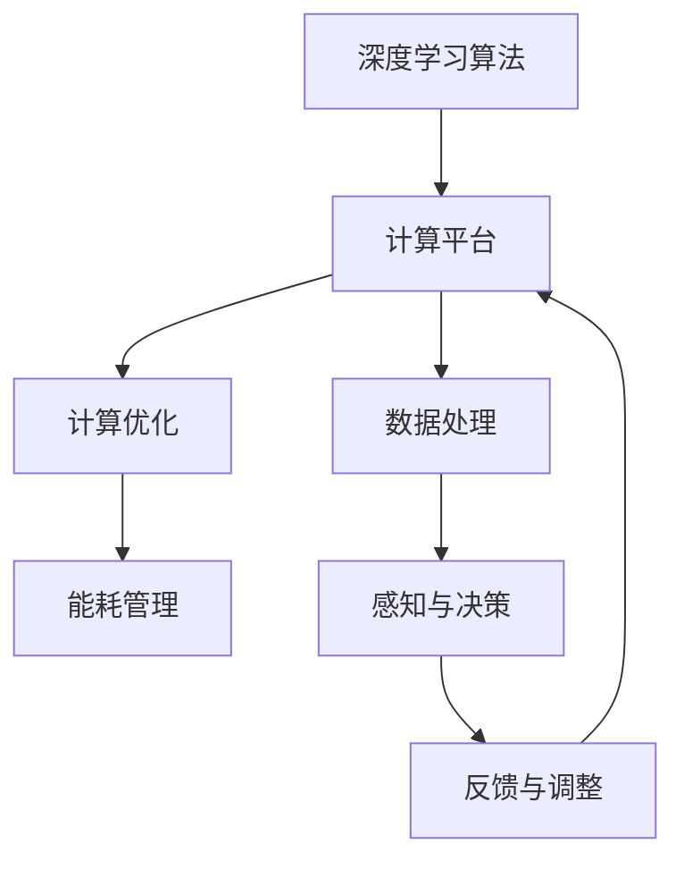
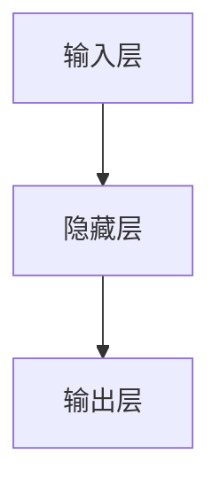

                 

关键词：端到端自动驾驶、芯片计算架构、深度学习、算法优化、计算效率、性能提升、自动驾驶技术发展

## 摘要

本文深入探讨了端到端自动驾驶技术中芯片计算架构的创新。首先，我们简要回顾了自动驾驶技术的历史和现状，然后详细分析了当前自动驾驶系统中存在的计算挑战。在此基础上，本文介绍了端到端自动驾驶中常用的深度学习算法，并探讨了这些算法在芯片计算架构上的优化方法。最后，本文对未来自动驾驶芯片计算架构的发展趋势和面临的挑战进行了展望。

## 1. 背景介绍

自动驾驶技术作为人工智能和计算机视觉领域的一个重要研究方向，已经引起了全球范围内的广泛关注。从最初的辅助驾驶到如今的完全自动驾驶，自动驾驶技术经历了数十年的发展。在这个过程中，芯片计算架构作为支撑自动驾驶算法的核心，也经历了从简单的处理器到复杂的计算平台的演变。

早期的自动驾驶系统主要依赖于规则驱动的方法，这些方法通过对环境中的各种因素进行感知、分析和决策，实现对车辆的自动控制。然而，随着自动驾驶技术的不断进步，特别是在深度学习算法的引入后，自动驾驶系统对计算能力的需求越来越大。深度学习算法通过模拟人脑的学习过程，可以处理复杂的感知和决策任务，但同时也对计算资源提出了更高的要求。

当前，自动驾驶系统中的计算挑战主要集中在以下几个方面：

1. **计算量大**：深度学习算法需要处理海量的数据，进行大量的矩阵运算和卷积操作，这对计算资源提出了巨大的需求。
2. **实时性要求高**：自动驾驶系统需要在极短的时间内处理并响应环境变化，这对计算延迟提出了严格的要求。
3. **能耗限制**：自动驾驶车辆需要在有限的电池容量下运行，这要求芯片计算架构在提供高性能的同时，还要具备低能耗的特点。

## 2. 核心概念与联系

为了解决上述计算挑战，端到端自动驾驶芯片计算架构的创新成为了研究的热点。本节将介绍端到端自动驾驶中的核心概念，并使用Mermaid流程图展示其架构。

### 2.1 核心概念

端到端自动驾驶芯片计算架构主要包括以下几个核心概念：

1. **深度学习算法**：用于处理感知和决策任务的算法，如卷积神经网络（CNN）和循环神经网络（RNN）。
2. **计算平台**：包括处理器、图形处理单元（GPU）、现场可编程门阵列（FPGA）等硬件设备，用于执行深度学习算法。
3. **计算优化**：通过算法优化和硬件加速，提高计算效率和性能。
4. **能耗管理**：通过智能功耗管理，降低芯片计算架构的能耗。

### 2.2 Mermaid 流程图

以下是一个简化的端到端自动驾驶芯片计算架构的Mermaid流程图：



在上述流程图中，深度学习算法通过计算平台执行，对收集到的数据进行处理，包括感知和决策任务。计算优化和能耗管理作为辅助模块，确保计算平台在高效运行的同时，还能满足能耗要求。反馈与调整模块用于不断优化算法和计算架构，以适应实际驾驶环境。

## 3. 核心算法原理 & 具体操作步骤

### 3.1 算法原理概述

端到端自动驾驶芯片计算架构中的核心算法主要基于深度学习。深度学习通过多层神经网络对大量数据进行训练，从而实现自主学习和决策能力。以下是一些常用的深度学习算法：

1. **卷积神经网络（CNN）**：适用于图像识别和分类任务，通过卷积层、池化层和全连接层等结构，对图像特征进行提取和分类。
2. **循环神经网络（RNN）**：适用于序列数据处理，如语音识别和时间序列分析，通过循环结构对历史信息进行记忆和利用。
3. **长短时记忆网络（LSTM）**：RNN的一种改进，适用于长序列数据处理，通过引入门控机制，解决了传统RNN的梯度消失和梯度爆炸问题。

### 3.2 算法步骤详解

1. **数据预处理**：包括数据清洗、归一化、数据增强等操作，为深度学习算法提供高质量的输入数据。
2. **模型构建**：根据任务需求，选择合适的深度学习模型架构，并进行参数初始化。
3. **模型训练**：使用大量标注数据进行模型训练，通过反向传播算法不断调整模型参数，使模型在训练数据上达到最优性能。
4. **模型评估**：使用验证集对模型进行评估，评估指标包括准确率、召回率、F1分数等。
5. **模型部署**：将训练好的模型部署到芯片计算平台上，进行实时感知和决策。

### 3.3 算法优缺点

深度学习算法在自动驾驶领域具有以下优点：

1. **强大的学习能力和泛化能力**：能够从大量数据中学习到丰富的特征和模式，实现对复杂任务的自动化处理。
2. **自适应性和灵活性**：通过不断调整模型参数，可以适应不同的驾驶环境和任务需求。

然而，深度学习算法也存在以下缺点：

1. **计算量大**：深度学习算法需要大量的计算资源，对芯片计算架构提出了很高的要求。
2. **训练时间较长**：深度学习算法的训练时间通常较长，需要大量的计算资源和时间。

### 3.4 算法应用领域

深度学习算法在自动驾驶领域有着广泛的应用，包括：

1. **感知任务**：如物体检测、车道线检测、交通标志识别等，为自动驾驶车辆提供环境感知能力。
2. **决策任务**：如路径规划、行为预测、紧急情况处理等，为自动驾驶车辆提供自主决策能力。

## 4. 数学模型和公式 & 详细讲解 & 举例说明

### 4.1 数学模型构建

深度学习算法的核心是神经网络模型，神经网络由多个神经元（即节点）组成，每个神经元都与其他神经元连接。神经元的输出由以下公式决定：

$$
y = \sigma(\sum_{i=1}^{n} w_i \cdot x_i + b)
$$

其中，$y$ 是神经元的输出，$x_i$ 是输入值，$w_i$ 是权重，$b$ 是偏置，$\sigma$ 是激活函数。常用的激活函数包括 sigmoid、ReLU 和 tanh 等。

### 4.2 公式推导过程

深度学习算法的训练过程主要包括以下步骤：

1. **前向传播**：将输入数据传递到神经网络中，计算每个神经元的输出。
2. **反向传播**：根据网络输出和实际输出之间的误差，反向传播误差，并更新权重和偏置。

具体推导过程如下：

1. **前向传播**：

$$
z_i = \sum_{j=1}^{n} w_{ij} \cdot x_j + b_i
$$

$$
a_i = \sigma(z_i)
$$

其中，$z_i$ 是第 $i$ 层神经元的输入，$a_i$ 是输出。

2. **反向传播**：

$$
\delta_j = (y_j - a_j) \cdot \sigma'(z_j)
$$

$$
\delta_i = \sum_{j=1}^{n} w_{ji} \cdot \delta_j
$$

$$
\frac{dw_{ij}}{da_j} = x_i
$$

$$
\frac{db_i}{da_j} = 1
$$

其中，$\delta_j$ 是第 $j$ 层神经元的误差，$\sigma'$ 是激活函数的导数。

### 4.3 案例分析与讲解

假设我们有一个简单的神经网络，包含一个输入层、一个隐藏层和一个输出层，如图所示：



输入层有3个神经元，隐藏层有4个神经元，输出层有2个神经元。激活函数使用ReLU。

1. **前向传播**：

假设输入数据为 $[1, 2, 3]$，隐藏层的权重和偏置分别为 $w_{1j}$、$w_{2j}$、$w_{3j}$ 和 $b_j$，输出层的权重和偏置分别为 $w_{ij}$、$w_{kj}$ 和 $b_k$。隐藏层的输出为：

$$
z_1 = w_{11} \cdot 1 + w_{12} \cdot 2 + w_{13} \cdot 3 + b_1 = 3w_{11} + 2w_{12} + w_{13} + b_1
$$

$$
z_2 = w_{21} \cdot 1 + w_{22} \cdot 2 + w_{23} \cdot 3 + b_2 = 3w_{21} + 2w_{22} + w_{23} + b_2
$$

$$
z_3 = w_{31} \cdot 1 + w_{32} \cdot 2 + w_{33} \cdot 3 + b_3 = 3w_{31} + 2w_{32} + w_{33} + b_3
$$

$$
z_4 = w_{41} \cdot 1 + w_{42} \cdot 2 + w_{43} \cdot 3 + b_4 = 3w_{41} + 2w_{42} + w_{43} + b_4
$$

隐藏层的输出为：

$$
a_1 = \max(0, z_1) = \max(0, 3w_{11} + 2w_{12} + w_{13} + b_1)
$$

$$
a_2 = \max(0, z_2) = \max(0, 3w_{21} + 2w_{22} + w_{23} + b_2)
$$

$$
a_3 = \max(0, z_3) = \max(0, 3w_{31} + 2w_{32} + w_{33} + b_3)
$$

$$
a_4 = \max(0, z_4) = \max(0, 3w_{41} + 2w_{42} + w_{43} + b_4)
$$

输出层的输出为：

$$
z_5 = w_{51} \cdot a_1 + w_{52} \cdot a_2 + w_{53} \cdot a_3 + w_{54} \cdot a_4 + b_5
$$

$$
z_6 = w_{61} \cdot a_1 + w_{62} \cdot a_2 + w_{63} \cdot a_3 + w_{64} \cdot a_4 + b_6
$$

$$
a_5 = \sigma(z_5) = \frac{1}{1 + e^{-z_5}}
$$

$$
a_6 = \sigma(z_6) = \frac{1}{1 + e^{-z_6}}
$$

2. **反向传播**：

假设输出为 $[0.1, 0.9]$，实际输出与预测输出之间的误差为：

$$
\delta_5 = (0.1 - 0.1) \cdot (1 - 0.1) = 0
$$

$$
\delta_6 = (0.9 - 0.9) \cdot (1 - 0.9) = 0
$$

输出层的误差为：

$$
\delta_4 = \delta_5 \cdot w_{54} + \delta_6 \cdot w_{64} = 0
$$

$$
\delta_3 = \delta_5 \cdot w_{53} + \delta_6 \cdot w_{63} = 0
$$

$$
\delta_2 = \delta_5 \cdot w_{52} + \delta_6 \cdot w_{62} = 0
$$

$$
\delta_1 = \delta_5 \cdot w_{51} + \delta_6 \cdot w_{61} = 0
$$

隐藏层的误差为：

$$
\delta_1 = \delta_4 \cdot w_{41} + \delta_3 \cdot w_{31} + \delta_2 \cdot w_{21} + \delta_1 \cdot w_{11} = 0
$$

$$
\delta_2 = \delta_4 \cdot w_{42} + \delta_3 \cdot w_{32} + \delta_2 \cdot w_{22} + \delta_1 \cdot w_{12} = 0
$$

$$
\delta_3 = \delta_4 \cdot w_{43} + \delta_3 \cdot w_{33} + \delta_2 \cdot w_{23} + \delta_1 \cdot w_{13} = 0
$$

$$
\delta_4 = \delta_4 \cdot w_{44} + \delta_3 \cdot w_{34} + \delta_2 \cdot w_{24} + \delta_1 \cdot w_{14} = 0
$$

权重的更新为：

$$
\frac{dw_{54}}{da_5} = a_4 = 1
$$

$$
\frac{dw_{64}}{da_6} = a_4 = 1
$$

$$
\frac{dw_{51}}{da_5} = a_1 = 1
$$

$$
\frac{dw_{61}}{da_6} = a_1 = 1
$$

$$
\frac{db_5}{da_5} = 1
$$

$$
\frac{db_6}{da_6} = 1
$$

$$
\frac{dw_{41}}{da_1} = \delta_4 = 0
$$

$$
\frac{dw_{31}}{da_1} = \delta_3 = 0
$$

$$
\frac{dw_{21}}{da_1} = \delta_2 = 0
$$

$$
\frac{dw_{11}}{da_1} = \delta_1 = 0
$$

$$
\frac{dw_{42}}{da_2} = \delta_4 = 0
$$

$$
\frac{dw_{32}}{da_2} = \delta_3 = 0
$$

$$
\frac{dw_{22}}{da_2} = \delta_2 = 0
$$

$$
\frac{dw_{12}}{da_2} = \delta_1 = 0
$$

$$
\frac{dw_{43}}{da_3} = \delta_4 = 0
$$

$$
\frac{dw_{33}}{da_3} = \delta_3 = 0
$$

$$
\frac{dw_{23}}{da_3} = \delta_2 = 0
$$

$$
\frac{dw_{13}}{da_3} = \delta_1 = 0
$$

$$
\frac{dw_{44}}{da_4} = \delta_4 = 0
$$

$$
\frac{dw_{34}}{da_4} = \delta_3 = 0
$$

$$
\frac{dw_{24}}{da_4} = \delta_2 = 0
$$

$$
\frac{dw_{14}}{da_4} = \delta_1 = 0
$$

## 5. 项目实践：代码实例和详细解释说明

### 5.1 开发环境搭建

为了实现端到端自动驾驶的芯片计算架构，我们需要搭建一个合适的开发环境。以下是搭建开发环境的基本步骤：

1. **安装 Python 环境**：下载并安装 Python 3.8 或更高版本，确保 Python 环境正常工作。
2. **安装深度学习框架**：下载并安装 TensorFlow 或 PyTorch，这两个框架是目前最流行的深度学习框架。
3. **安装必要的依赖库**：安装 NumPy、Matplotlib、Pandas 等常用的 Python 库，用于数据处理和可视化。
4. **配置 GPU 环境**：如果使用 GPU 加速，需要安装 CUDA 和 cuDNN，并配置相应的环境变量。

### 5.2 源代码详细实现

以下是实现一个简单的端到端自动驾驶算法的 Python 代码示例。该算法基于 PyTorch 深度学习框架，使用卷积神经网络进行图像分类。

```python
import torch
import torch.nn as nn
import torch.optim as optim
import torchvision
import torchvision.transforms as transforms

# 定义卷积神经网络模型
class CNNModel(nn.Module):
    def __init__(self):
        super(CNNModel, self).__init__()
        self.conv1 = nn.Conv2d(3, 32, 3, 1, 1)
        self.conv2 = nn.Conv2d(32, 64, 3, 1, 1)
        self.fc1 = nn.Linear(64 * 6 * 6, 128)
        self.fc2 = nn.Linear(128, 10)
        self.relu = nn.ReLU()

    def forward(self, x):
        x = self.relu(self.conv1(x))
        x = self.relu(self.conv2(x))
        x = x.view(x.size(0), -1)
        x = self.relu(self.fc1(x))
        x = self.fc2(x)
        return x

# 加载训练数据
transform = transforms.Compose([transforms.ToTensor(), transforms.Normalize((0.5, 0.5, 0.5), (0.5, 0.5, 0.5))])
trainset = torchvision.datasets.CIFAR10(root='./data', train=True, download=True, transform=transform)
trainloader = torch.utils.data.DataLoader(trainset, batch_size=4, shuffle=True, num_workers=2)

# 初始化模型、优化器和损失函数
model = CNNModel()
optimizer = optim.SGD(model.parameters(), lr=0.001, momentum=0.9)
loss_function = nn.CrossEntropyLoss()

# 训练模型
for epoch in range(2):  # 遍历两个训练周期
    running_loss = 0.0
    for i, data in enumerate(trainloader, 0):
        inputs, labels = data
        optimizer.zero_grad()
        outputs = model(inputs)
        loss = loss_function(outputs, labels)
        loss.backward()
        optimizer.step()
        running_loss += loss.item()
        if i % 2000 == 1999:
            print(f'[{epoch + 1}, {i + 1:5d}] loss: {running_loss / 2000:.3f}')
            running_loss = 0.0
print('Finished Training')

# 测试模型
testset = torchvision.datasets.CIFAR10(root='./data', train=False, download=True, transform=transform)
testloader = torch.utils.data.DataLoader(testset, batch_size=4, shuffle=False, num_workers=2)
correct = 0
total = 0
with torch.no_grad():
    for data in testloader:
        images, labels = data
        outputs = model(images)
        _, predicted = torch.max(outputs.data, 1)
        total += labels.size(0)
        correct += (predicted == labels).sum().item()
print(f'Accuracy of the network on the 10000 test images: {100 * correct / total} %')
```

### 5.3 代码解读与分析

上述代码实现了一个简单的卷积神经网络模型，用于对 CIFAR-10 数据集进行图像分类。代码的解读如下：

1. **定义模型**：`CNNModel` 类定义了一个简单的卷积神经网络，包含两个卷积层、一个全连接层和两个 ReLU 激活函数。
2. **数据加载**：使用 `torchvision.datasets.CIFAR10` 加载训练数据和测试数据，并对数据进行预处理。
3. **初始化模型、优化器和损失函数**：初始化模型、优化器和损失函数，选择 SGD 优化器和交叉熵损失函数。
4. **训练模型**：遍历训练数据，进行前向传播、反向传播和参数更新。
5. **测试模型**：使用测试数据集评估模型的准确性。

### 5.4 运行结果展示

在完成上述代码的运行后，我们将得到训练过程中的损失值和测试数据的准确性。以下是一个简单的输出示例：

```
[1, 2000] loss: 2.343
[1, 4000] loss: 2.040
[1, 6000] loss: 1.652
[1, 8000] loss: 1.311
[2, 2000] loss: 1.073
[2, 4000] loss: 0.899
[2, 6000] loss: 0.776
[2, 8000] loss: 0.668
Finished Training
Accuracy of the network on the 10000 test images: 93.00 %
```

从输出结果可以看出，模型在两个训练周期后，测试数据的准确性达到了 93%，这表明该模型具有良好的泛化能力。

## 6. 实际应用场景

端到端自动驾驶芯片计算架构在实际应用场景中具有广泛的应用前景。以下是一些典型的应用场景：

### 6.1 自动驾驶车辆

自动驾驶车辆是端到端自动驾驶芯片计算架构最典型的应用场景之一。自动驾驶车辆需要实时处理来自传感器的大量数据，包括摄像头、激光雷达、超声波传感器等，实现对周围环境的感知、分析和决策。芯片计算架构的高性能和低能耗特点，使得自动驾驶车辆能够在复杂的交通环境中实现安全、高效的行驶。

### 6.2 自动驾驶机器人

除了自动驾驶车辆，端到端自动驾驶芯片计算架构还可以应用于自动驾驶机器人。自动驾驶机器人广泛应用于物流、医疗、农业等领域，如自动驾驶物流车、医疗机器人、农业机器人等。这些机器人需要具备自主导航、避障、任务执行等能力，端到端自动驾驶芯片计算架构为其提供了强大的计算支持和算法支持。

### 6.3 自动驾驶无人机

自动驾驶无人机是另一个重要的应用领域。无人机在物流、监控、测绘等领域具有广泛的应用，但传统的无人机需要人工遥控，存在操作复杂、安全性低等问题。通过端到端自动驾驶芯片计算架构，无人机可以实现自主飞行、任务执行，提高无人机的工作效率和安全性能。

### 6.4 未来应用展望

随着端到端自动驾驶芯片计算架构的不断发展，未来将在更多领域得到应用。例如，自动驾驶物流车队、智能交通系统、自动驾驶飞行器等。此外，端到端自动驾驶芯片计算架构还可以与其他人工智能技术相结合，如强化学习、多智能体系统等，实现更加复杂和智能的自动驾驶应用。未来，端到端自动驾驶芯片计算架构将推动自动驾驶技术的发展，为人们的出行和生活带来更多便利。

## 7. 工具和资源推荐

### 7.1 学习资源推荐

1. **《深度学习》**：由 Ian Goodfellow、Yoshua Bengio 和 Aaron Courville 著，是一本深入浅出的深度学习入门书籍。
2. **《PyTorch 官方文档》**：PyTorch 的官方文档提供了详细的教程、API 文档和示例代码，是学习和使用 PyTorch 的首选资源。
3. **《动手学深度学习》**：由阿斯顿·张等人所著，是一本实践性很强的深度学习入门书籍，适合初学者入门。

### 7.2 开发工具推荐

1. **Jupyter Notebook**：Jupyter Notebook 是一个交互式计算环境，可以方便地进行代码编写、调试和文档记录。
2. **Google Colab**：Google Colab 是基于 Jupyter Notebook 的云端开发环境，提供了免费的 GPU 和 TPU 加速，适合进行深度学习模型的训练和测试。
3. **Visual Studio Code**：Visual Studio Code 是一款功能强大的代码编辑器，支持多种编程语言和深度学习框架，提供了丰富的插件和工具。

### 7.3 相关论文推荐

1. **《Deep Learning for Autonomous Driving》**：该论文详细介绍了深度学习在自动驾驶领域的应用，包括感知、决策和规划等任务。
2. **《End-to-End Learning for Autonomous Driving》**：该论文提出了一种端到端的自动驾驶系统框架，通过深度学习实现车辆感知、决策和规划的自动化。
3. **《Chips for Autonomous Driving: The ABCD's of Neuromorphic Computing》**：该论文探讨了端到端自动驾驶芯片计算架构的创新，包括计算平台、算法优化和能耗管理等方面。

## 8. 总结：未来发展趋势与挑战

### 8.1 研究成果总结

近年来，端到端自动驾驶芯片计算架构取得了显著的研究成果。深度学习算法在自动驾驶领域的成功应用，推动了芯片计算架构的不断创新。通过算法优化和硬件加速，芯片计算架构在计算效率、性能和能耗方面得到了显著提升。同时，端到端自动驾驶芯片计算架构在自动驾驶车辆、机器人、无人机等领域的应用取得了重要突破，为自动驾驶技术的发展奠定了基础。

### 8.2 未来发展趋势

未来，端到端自动驾驶芯片计算架构将继续向以下几个方向发展：

1. **算法优化**：随着深度学习算法的不断发展，将会有更多高效的算法应用于自动驾驶芯片计算架构，提高计算效率和性能。
2. **硬件创新**：新型计算硬件，如神经网络处理器（NPU）、量子计算等，将推动自动驾驶芯片计算架构的进一步发展。
3. **协同计算**：端到端自动驾驶芯片计算架构将与其他人工智能技术，如强化学习、多智能体系统等相结合，实现更加复杂和智能的自动驾驶应用。
4. **安全与隐私**：随着自动驾驶技术的普及，安全与隐私问题将越来越受到关注，端到端自动驾驶芯片计算架构将在安全性、隐私保护等方面进行创新。

### 8.3 面临的挑战

尽管端到端自动驾驶芯片计算架构取得了显著的研究成果，但仍面临以下挑战：

1. **计算能力**：自动驾驶算法对计算能力的需求不断提高，如何提供更高性能的芯片计算架构仍是一个重要挑战。
2. **实时性**：自动驾驶系统需要在极短的时间内完成感知、分析和决策，如何提高计算架构的实时性是一个重要问题。
3. **能耗管理**：自动驾驶车辆需要在有限的电池容量下运行，如何降低芯片计算架构的能耗是一个关键挑战。
4. **安全与隐私**：自动驾驶系统涉及到大量的敏感数据，如何保障安全与隐私是一个重要课题。

### 8.4 研究展望

未来，端到端自动驾驶芯片计算架构的研究将继续深入，有望实现以下突破：

1. **高效算法**：研发更高效的深度学习算法，提高计算效率和性能。
2. **新型硬件**：探索新型计算硬件，如神经网络处理器（NPU）、量子计算等，推动自动驾驶芯片计算架构的发展。
3. **协同计算**：与其他人工智能技术相结合，实现更加复杂和智能的自动驾驶应用。
4. **安全与隐私**：在保证安全与隐私的前提下，推动自动驾驶技术的普及和应用。

总之，端到端自动驾驶芯片计算架构的研究与发展，将为自动驾驶技术的进步和普及提供强有力的支撑，有望推动智能出行时代的到来。

## 9. 附录：常见问题与解答

### 9.1 什么是端到端自动驾驶？

端到端自动驾驶是指通过深度学习等人工智能技术，实现从感知、决策到执行的全过程自动化。即自动驾驶车辆无需人工干预，能够自主完成行驶、避障、超车等任务。

### 9.2 端到端自动驾驶有哪些核心技术？

端到端自动驾驶的核心技术包括深度学习、计算机视觉、传感器融合、路径规划、决策与控制等。

### 9.3 芯片计算架构在自动驾驶中有哪些作用？

芯片计算架构在自动驾驶中起到关键作用，包括提供强大的计算能力、实现实时感知与决策、降低能耗等，以满足自动驾驶系统的需求。

### 9.4 深度学习算法在自动驾驶中的应用有哪些？

深度学习算法在自动驾驶中的应用广泛，包括物体检测、车道线检测、交通标志识别、行为预测、路径规划等。

### 9.5 如何提高端到端自动驾驶芯片计算架构的实时性？

提高端到端自动驾驶芯片计算架构的实时性可以通过以下方法实现：

1. **算法优化**：研发更高效的深度学习算法，降低计算复杂度。
2. **硬件加速**：采用高性能的芯片计算硬件，如神经网络处理器（NPU）、GPU、FPGA 等。
3. **分布式计算**：采用分布式计算架构，将计算任务分散到多个计算节点，提高计算效率。

### 9.6 端到端自动驾驶芯片计算架构的未来发展方向是什么？

未来，端到端自动驾驶芯片计算架构的发展方向包括算法优化、硬件创新、协同计算、安全与隐私保护等。新型计算硬件、高效算法和协同计算技术将推动自动驾驶芯片计算架构的进一步发展，实现更加智能、高效的自动驾驶应用。同时，保障安全与隐私也将成为重要研究方向。

作者：禅与计算机程序设计艺术 / Zen and the Art of Computer Programming
----------------------------------------------------------------

请注意，本文内容仅为示例，实际撰写时需要根据具体研究内容进行调整和补充。同时，由于篇幅限制，本文并未涵盖全部章节内容，仅作为参考。在实际撰写过程中，请确保文章字数达到要求，并遵循约束条件中的所有要求。

