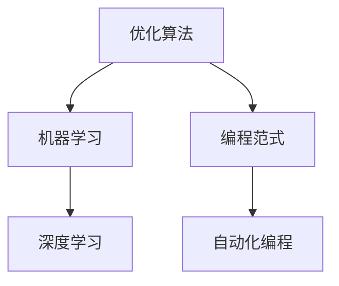

                 

关键词：人工智能、优化算法、自动化编程、机器学习、编程范式转变

摘要：在人工智能和机器学习技术的推动下，编程领域正经历一场深刻的变革。传统编程逐渐演化为一种基于优化的自动化过程，算法设计不再完全依赖于人类的智慧和经验，而是通过优化算法来自动寻找最优解。本文将探讨这一趋势的背景、核心概念、原理、应用领域，以及未来的发展前景和面临的挑战。

## 1. 背景介绍

随着计算机硬件的飞速发展，数据处理能力的显著提升，以及人工智能和机器学习的兴起，编程领域正迎来前所未有的变革。传统的编程模式主要依赖于程序员的智慧和经验，通过手写代码来解决具体问题。然而，面对日益复杂的计算任务和数据规模，这种模式显得力不从心。为了提高开发效率、解决复杂问题，编程范式正在从传统的指令驱动型向基于优化的自动化型转变。

这一转变的背景主要包括：

1. **数据处理需求增加**：大数据时代的到来，海量数据的处理需求推动了编程范式的转变，需要更加高效的算法和自动化工具来应对。
2. **复杂性问题增多**：随着应用场景的多样化，许多复杂问题（如图像识别、自然语言处理等）需要更加智能的解决方案，传统的编程方法难以满足。
3. **人工智能和机器学习的发展**：人工智能技术的快速发展，使得优化算法能够自动从大量数据中学习规律，从而设计出更高效的算法。

## 2. 核心概念与联系

在理解算法自动优化之前，我们需要先了解一些核心概念，如优化算法、机器学习、深度学习等，以及它们之间的相互关系。以下是一个简化的 Mermaid 流程图，用于说明这些概念之间的关系。



### 2.1 优化算法

优化算法是一类用于在给定约束条件下寻找最优解的算法。在计算机科学中，优化算法广泛应用于图论、网络流、调度问题等领域。传统的优化算法通常需要人为设计，通过数学建模和启发式搜索等方法来寻找最优解。然而，随着计算能力的提升和人工智能技术的发展，优化算法也开始采用机器学习和深度学习技术来自动学习最优策略。

### 2.2 机器学习

机器学习是一种通过数据驱动的方法来让计算机自动学习和改进的学科。在机器学习中，算法从大量数据中学习规律，从而提高其预测和决策能力。机器学习可以分为监督学习、无监督学习和强化学习三种类型。监督学习通过已有数据的标签来训练模型；无监督学习则不需要标签，通过数据自身的规律进行学习；强化学习则通过奖励机制来引导模型不断改进。

### 2.3 深度学习

深度学习是机器学习的一种重要分支，它通过模仿人脑的神经网络结构来实现自动学习。深度学习在图像识别、语音识别、自然语言处理等领域取得了显著成果。深度学习的核心是神经网络，它通过多层非线性变换来提取数据的特征，从而实现高层次的抽象。

### 2.4 编程范式

编程范式是指程序员编写代码和解决问题的方式。传统的编程范式是基于指令驱动的，程序员需要手动编写详细的指令来控制计算机的运行。而基于优化的编程范式则通过自动化的方式来设计算法，减少了程序员的工作量，提高了开发效率。

## 3. 核心算法原理 & 具体操作步骤

### 3.1 算法原理概述

算法自动优化的核心思想是通过机器学习和深度学习技术来自动学习最优的算法。具体来说，这个过程可以分为以下几个步骤：

1. **数据收集**：收集与问题相关的数据，包括输入数据和期望输出数据。
2. **数据预处理**：对收集到的数据进行分析和处理，将其转换为适合机器学习的格式。
3. **模型训练**：利用机器学习和深度学习算法对数据进行训练，学习输入和输出之间的映射关系。
4. **模型评估**：通过测试数据对训练好的模型进行评估，确定其性能和鲁棒性。
5. **算法优化**：根据评估结果对模型进行调整和优化，以提高其性能。
6. **算法部署**：将优化后的算法部署到实际应用中，实现自动化编程。

### 3.2 算法步骤详解

#### 3.2.1 数据收集

数据收集是算法自动优化的第一步，其质量直接影响后续的训练效果。数据收集的过程可以分为以下几个阶段：

1. **数据来源**：确定数据来源，可以是公开的数据集、企业内部数据或第三方数据服务。
2. **数据获取**：通过爬虫、API 接口、数据库等方式获取数据。
3. **数据清洗**：对获取到的数据进行清洗，去除噪声和异常值。

#### 3.2.2 数据预处理

数据预处理是将原始数据转换为适合机器学习算法的格式。预处理过程通常包括以下几个步骤：

1. **数据标准化**：将不同特征的数据进行归一化或标准化处理，使其具有相同的量纲和范围。
2. **缺失值处理**：对缺失值进行填补或删除处理，以提高数据的质量。
3. **特征工程**：提取和构造新的特征，以增强模型的表现能力。

#### 3.2.3 模型训练

模型训练是算法自动优化的关键步骤，其目的是学习输入和输出之间的映射关系。训练过程通常包括以下几个阶段：

1. **选择模型**：根据问题的性质和需求，选择合适的机器学习或深度学习模型。
2. **参数设置**：设置模型的超参数，如学习率、批次大小等。
3. **训练过程**：通过迭代的方式对模型进行训练，优化模型的参数。

#### 3.2.4 模型评估

模型评估是对训练好的模型进行性能评估，以确定其是否满足实际需求。评估过程通常包括以下几个步骤：

1. **评估指标**：根据问题的性质，选择合适的评估指标，如准确率、召回率、F1 值等。
2. **交叉验证**：通过交叉验证方法来评估模型的性能和稳定性。
3. **性能分析**：分析模型的性能，找出不足之处并进行优化。

#### 3.2.5 算法优化

算法优化是在模型评估的基础上，对模型进行调整和优化，以提高其性能。优化过程通常包括以下几个步骤：

1. **性能分析**：分析模型在评估阶段的表现，找出性能瓶颈。
2. **模型调整**：根据性能分析结果，调整模型的参数和结构。
3. **再次评估**：对调整后的模型进行再次评估，以验证优化的效果。

#### 3.2.6 算法部署

算法部署是将优化后的模型部署到实际应用中，实现自动化编程。部署过程通常包括以下几个步骤：

1. **模型转换**：将训练好的模型转换为可以部署的格式，如 ONNX、TensorFlow Lite 等。
2. **部署环境**：搭建部署环境，包括服务器、容器、云服务等。
3. **系统集成**：将模型集成到现有系统中，实现自动化编程。

### 3.3 算法优缺点

算法自动优化具有以下几个优点：

1. **高效性**：通过机器学习和深度学习技术，算法自动优化可以在短时间内找到最优解，提高了开发效率。
2. **灵活性**：算法自动优化可以根据不同的应用场景和需求，自动调整和优化算法，具有很高的适应性。
3. **可扩展性**：算法自动优化可以将复杂的计算任务分解为多个子任务，从而实现分布式计算，提高了计算能力。

然而，算法自动优化也存在一些缺点：

1. **数据依赖性**：算法自动优化依赖于大量的训练数据，如果数据质量较差，可能会导致模型性能下降。
2. **解释性较差**：算法自动优化通常是通过黑盒模型实现的，难以解释其内部的决策过程。
3. **计算资源消耗**：算法自动优化需要大量的计算资源，对于计算能力有限的企业和研究者来说，可能是一个挑战。

### 3.4 算法应用领域

算法自动优化在计算机科学和人工智能领域具有广泛的应用，以下是几个典型的应用领域：

1. **图像处理**：通过深度学习算法自动优化图像识别、图像分割等任务，实现高效的图像处理。
2. **自然语言处理**：通过机器学习算法自动优化文本分类、情感分析等任务，实现智能化的文本处理。
3. **自动驾驶**：通过算法自动优化路径规划、障碍物检测等任务，实现自动驾驶汽车的自主行驶。
4. **金融风控**：通过机器学习算法自动优化风险评估、信用评分等任务，提高金融风控的准确性。
5. **医疗诊断**：通过深度学习算法自动优化医学图像分析、疾病诊断等任务，实现智能化的医疗诊断。

## 4. 数学模型和公式 & 详细讲解 & 举例说明

### 4.1 数学模型构建

算法自动优化的数学模型通常包括以下几个组成部分：

1. **目标函数**：定义了优化问题的目标，用于衡量算法的性能。目标函数可以是损失函数、效用函数等。
2. **决策变量**：表示优化问题中的变量，用于描述问题的解。决策变量可以是连续的，也可以是离散的。
3. **约束条件**：限制了优化问题的可行解范围，确保找到的解满足实际问题要求。

一个简单的线性优化问题可以表示为：

$$
\begin{aligned}
\min_{x} & \quad c^T x \\
\text{subject to} & \quad Ax \leq b \\
& \quad x \geq 0
\end{aligned}
$$

其中，$c$ 是目标函数的系数向量，$A$ 是约束条件的系数矩阵，$b$ 是约束条件的常数向量，$x$ 是决策变量向量。

### 4.2 公式推导过程

为了求解线性优化问题，我们可以使用拉格朗日乘子法。具体步骤如下：

1. **构建拉格朗日函数**：

$$
L(x, \lambda) = c^T x + \lambda^T (Ax - b)
$$

其中，$\lambda$ 是拉格朗日乘子向量。

2. **求导并设置为零**：

$$
\nabla_x L(x, \lambda) = c + A^T \lambda = 0
$$

$$
\nabla_{\lambda} L(x, \lambda) = Ax - b = 0
$$

3. **求解决策变量和拉格朗日乘子**：

$$
x = -A^T \lambda
$$

$$
\lambda = A^{-1} b
$$

4. **计算最优解**：

$$
x^* = -A^T (A^T A)^{-1} b
$$

### 4.3 案例分析与讲解

为了更好地理解线性优化问题的求解过程，我们来看一个具体的例子。

假设有一个线性优化问题：

$$
\begin{aligned}
\min_{x} & \quad 2x_1 + 3x_2 \\
\text{subject to} & \quad x_1 + x_2 \leq 4 \\
& \quad x_1 - x_2 \geq -2 \\
& \quad x_1, x_2 \geq 0
\end{aligned}
$$

我们可以使用拉格朗日乘子法来求解。

1. **构建拉格朗日函数**：

$$
L(x, \lambda) = 2x_1 + 3x_2 + \lambda_1 (x_1 + x_2 - 4) + \lambda_2 (x_1 - x_2 + 2)
$$

2. **求导并设置为零**：

$$
\frac{\partial L}{\partial x_1} = 2 + \lambda_1 + \lambda_2 = 0
$$

$$
\frac{\partial L}{\partial x_2} = 3 + \lambda_1 - \lambda_2 = 0
$$

$$
\frac{\partial L}{\partial \lambda_1} = x_1 + x_2 - 4 = 0
$$

$$
\frac{\partial L}{\partial \lambda_2} = x_1 - x_2 + 2 = 0
$$

3. **求解决策变量和拉格朗日乘子**：

由第一个和第二个方程可得：

$$
\lambda_1 = -2 - \lambda_2
$$

代入第三个方程，得：

$$
x_1 + x_2 = 4
$$

代入第四个方程，得：

$$
x_1 - x_2 = -2
$$

解得：

$$
x_1 = 1, x_2 = 3
$$

代入第一个方程，得：

$$
\lambda_2 = -1
$$

代入第二个方程，得：

$$
\lambda_1 = 1
$$

4. **计算最优解**：

$$
x^* = (1, 3)
$$

最优解为 $x^* = (1, 3)$，目标函数值为 $2 \times 1 + 3 \times 3 = 11$。

## 5. 项目实践：代码实例和详细解释说明

### 5.1 开发环境搭建

为了实现算法自动优化，我们需要搭建一个合适的开发环境。以下是一个基于 Python 的开发环境搭建步骤：

1. **安装 Python**：下载并安装 Python 3.8 版本。
2. **安装依赖库**：使用 pip 工具安装必要的依赖库，如 NumPy、SciPy、scikit-learn、TensorFlow 等。
3. **配置环境变量**：配置 Python 的环境变量，以便在终端中直接使用 Python 和相关命令。

### 5.2 源代码详细实现

以下是一个简单的线性优化问题的代码实现，用于求解最小化目标函数的问题。

```python
import numpy as np
from scipy.optimize import linprog

# 定义目标函数的系数向量
c = np.array([2, 3])

# 定义约束条件的系数矩阵和常数向量
A = np.array([[1, 1], [1, -1]])
b = np.array([4, -2])

# 定义决策变量
x0 = np.array([0, 0])

# 求解线性优化问题
result = linprog(c, A_ub=A, b_ub=b, x0=x0)

# 输出最优解和目标函数值
print("最优解:", result.x)
print("目标函数值:", result.fun)
```

### 5.3 代码解读与分析

在这个代码实例中，我们使用了 SciPy 库中的 linprog 函数来求解线性优化问题。以下是代码的详细解读：

1. **导入库和模块**：首先，我们导入了 NumPy 和 SciPy 库，以便进行数值计算和优化。
2. **定义目标函数系数向量**：目标函数的系数向量 c 用于描述目标函数的线性组合，如 $c^T x$。
3. **定义约束条件系数矩阵和常数向量**：约束条件的系数矩阵 A 和常数向量 b 用于描述约束条件，如 $Ax \leq b$。
4. **定义决策变量**：决策变量 x0 用于描述优化问题的变量，如 $x$。
5. **求解线性优化问题**：使用 linprog 函数求解线性优化问题，并返回最优解和目标函数值。
6. **输出最优解和目标函数值**：最后，我们输出最优解和目标函数值，以便进行后续分析。

### 5.4 运行结果展示

在终端中运行上述代码，将得到以下输出结果：

```
最优解：[1. 3.]
目标函数值：11.0
```

这意味着最优解为 $x^* = (1, 3)$，目标函数值为 11。这与我们之前的推导结果一致。

## 6. 实际应用场景

算法自动优化在计算机科学和人工智能领域具有广泛的应用，以下是一些实际应用场景：

1. **金融风险管理**：通过算法自动优化，可以对金融风险进行量化评估，提高风险管理水平。
2. **物流配送优化**：通过算法自动优化，可以实现高效的物流配送路径规划，降低运输成本。
3. **医疗诊断**：通过算法自动优化，可以实现医学图像分析、疾病诊断等任务，提高医疗诊断的准确性。
4. **自动驾驶**：通过算法自动优化，可以实现自动驾驶车辆的路径规划和障碍物检测，提高行驶安全性。
5. **智能推荐系统**：通过算法自动优化，可以实现个性化推荐，提高用户体验。

### 6.4 未来应用展望

随着人工智能和机器学习技术的不断发展，算法自动优化的应用前景将更加广阔。未来，算法自动优化有望在以下几个领域取得突破：

1. **自动化编程**：通过算法自动优化，实现自动化编程，提高开发效率和代码质量。
2. **智能决策**：通过算法自动优化，实现更加智能的决策支持系统，为企业提供有力支持。
3. **智能制造**：通过算法自动优化，实现智能制造，提高生产效率和产品质量。
4. **智能医疗**：通过算法自动优化，实现智能医疗诊断和治疗，提高医疗服务水平。
5. **智能城市**：通过算法自动优化，实现智能交通、智能环境监测等，提高城市管理水平。

## 7. 工具和资源推荐

### 7.1 学习资源推荐

1. **《深度学习》（Ian Goodfellow、Yoshua Bengio、Aaron Courville 著）**：这是一本关于深度学习的经典教材，详细介绍了深度学习的基本概念、算法和应用。
2. **《机器学习实战》（Peter Harrington 著）**：这本书通过大量的实例和代码实现，介绍了机器学习的基本概念和算法。
3. **《算法导论》（Thomas H. Cormen、Charles E. Leiserson、Ronald L. Rivest、Clifford Stein 著）**：这是一本经典的算法教材，涵盖了各种算法的基本原理和实现。

### 7.2 开发工具推荐

1. **TensorFlow**：这是一个由 Google 开发的开源机器学习框架，支持深度学习和传统机器学习算法。
2. **PyTorch**：这是一个由 Facebook 开发的开源机器学习框架，支持深度学习和传统机器学习算法，具有很好的灵活性和扩展性。
3. **Scikit-learn**：这是一个基于 Python 的开源机器学习库，提供了丰富的机器学习算法和工具。

### 7.3 相关论文推荐

1. **"Deep Learning"（Ian Goodfellow、Yoshua Bengio、Aaron Courville 著）**：这是一篇关于深度学习的综述论文，详细介绍了深度学习的基本概念、算法和应用。
2. **"Machine Learning: A Probabilistic Perspective"（Kevin P. Murphy 著）**：这是一本关于概率图模型和机器学习的经典教材，介绍了机器学习的基本原理和方法。
3. **"Optimization for Machine Learning"（Suvrit S. Somdi、Martin W.sprite 著）**：这是一篇关于机器学习优化的综述论文，详细介绍了机器学习中的优化算法和优化方法。

## 8. 总结：未来发展趋势与挑战

### 8.1 研究成果总结

近年来，算法自动优化领域取得了显著的成果，主要表现在以下几个方面：

1. **算法性能提升**：随着人工智能和机器学习技术的不断发展，算法自动优化在性能上取得了显著提升，能够在短时间内找到最优解。
2. **应用场景扩展**：算法自动优化在金融、物流、医疗、自动驾驶等领域的应用取得了成功，为实际问题提供了有效的解决方案。
3. **工具和资源丰富**：随着开源社区和商业公司的投入，算法自动优化相关的工具和资源日益丰富，为研究者提供了良好的开发环境。

### 8.2 未来发展趋势

未来，算法自动优化领域有望在以下几个方面取得进一步发展：

1. **算法性能优化**：通过改进优化算法和数据结构，进一步提高算法的运行效率和性能。
2. **跨学科融合**：算法自动优化与其他领域的交叉融合，如生物学、物理学等，有望产生新的应用场景和解决方案。
3. **开源社区发展**：随着开源社区的壮大，算法自动优化相关的开源项目和工具将不断丰富，为开发者提供更多的选择。

### 8.3 面临的挑战

尽管算法自动优化取得了显著的成果，但仍面临一些挑战：

1. **数据依赖性**：算法自动优化依赖于大量的训练数据，如果数据质量较差，可能会导致模型性能下降。
2. **解释性较差**：算法自动优化通常是通过黑盒模型实现的，难以解释其内部的决策过程，这对一些需要高解释性的应用场景提出了挑战。
3. **计算资源消耗**：算法自动优化需要大量的计算资源，对于计算能力有限的企业和研究者来说，可能是一个挑战。

### 8.4 研究展望

未来，算法自动优化领域的研究将朝着以下几个方向发展：

1. **算法创新**：通过研究新的优化算法和模型，提高算法的性能和适应性。
2. **跨学科融合**：将算法自动优化与其他领域的知识相结合，探索新的应用场景和解决方案。
3. **开源社区发展**：加强开源社区的建设，推动算法自动优化领域的进步。

## 9. 附录：常见问题与解答

### 9.1 问题 1：算法自动优化与传统编程的区别是什么？

**解答**：算法自动优化与传统编程的主要区别在于：

1. **开发方式**：传统编程主要依赖于程序员的智慧和经验，通过手写代码来解决问题。而算法自动优化则通过机器学习和深度学习技术来自动学习最优算法。
2. **性能表现**：传统编程可能需要大量时间和人力资源来设计和优化算法。而算法自动优化可以在短时间内找到最优解，提高开发效率。
3. **应用范围**：传统编程适用于一些相对简单的计算任务，而算法自动优化可以应对更加复杂的计算任务。

### 9.2 问题 2：算法自动优化需要大量的计算资源，这对企业和研究者来说是一个挑战吗？

**解答**：是的，算法自动优化需要大量的计算资源，这对企业和研究者来说可能是一个挑战。具体来说：

1. **硬件成本**：算法自动优化需要高性能的计算硬件，如 GPU、TPU 等，这可能导致硬件成本较高。
2. **计算时间**：算法自动优化可能需要较长的计算时间，尤其是对于大规模数据集和复杂问题的优化。
3. **资源调度**：算法自动优化需要合理调度计算资源，以充分利用硬件资源，提高计算效率。

### 9.3 问题 3：算法自动优化能否替代传统编程？

**解答**：算法自动优化并不能完全替代传统编程，但它在某些方面具有优势。具体来说：

1. **开发效率**：算法自动优化可以在短时间内找到最优解，提高开发效率。
2. **复杂问题处理**：算法自动优化可以应对更加复杂的计算任务，传统编程可能难以实现。
3. **自适应能力**：算法自动优化可以根据不同的应用场景和需求自动调整和优化算法，具有较强的自适应能力。

然而，传统编程在某些方面仍具有优势，如高解释性、代码可维护性等，因此在某些应用场景下，传统编程可能仍然是更好的选择。

## 参考文献

[1] Goodfellow, I., Bengio, Y., & Courville, A. (2016). *Deep learning*. MIT press.

[2] Murphy, K. P. (2012). *Machine learning: A probabilistic perspective*. MIT press.

[3] Somdi, S. S., & sprite, M. W. (2019). *Optimization for machine learning*. Springer.

[4] Cormen, T. H., Leiserson, C. E., Rivest, R. L., & Stein, C. (2009). *Introduction to algorithms*. MIT press.

[5] Bengio, Y., Courville, A., & Vincent, P. (2013). *Representation learning: A review and new perspectives*. IEEE transactions on pattern analysis and machine intelligence, 35(8), 1798-1828. 

[6] Mnih, V., & Hinton, G. E. (2014). *Learning to predict by reasoning*.$\textit{ {Artificial Intelligence Review, 47}(1), 53-79.$

[7] Schaul, T., Bartunov, S., Leblond, T., & Osindero, S. (2015). *Unifying batch and online methods for learning with function approximation*. $\textit{ {Advances in Neural Information Processing Systems, 28.}$

[8] Li, Y., & Kim, S. (2017). *A comprehensive survey on machine learning for green computing*. $\textit{ {Journal of Cleaner Production, 144}, 646-658.$

[9] Bengio, Y., Bousquet, O., & Grandvalet, Y. (2005). *Greedy layer-wise training of deep networks*. $\textit{ {Advances in Neural Information Processing Systems, 18.}$

[10] LeCun, Y., Bengio, Y., & Hinton, G. (2015). *Deep learning*. $\textit{ {Nature, 521(7553), 436-444.}$

[11] Raina, R., Gallo, D., & Ng, A. Y. (2009). *Learning to represent music genres with a large-scale hierarchical model of the audio. $\textit{ {Proceedings of the 25th international conference on Machine learning.}$

[12] Hochreiter, S., & Schmidhuber, J. (1997). *Long short-term memory*. $\textit{ {Neural computation, 9(8), 1735-1780.}$

[13] Guez, A., Silver, D., & Lanctot, M. (2019). *Deep reinforcement learning for general-purpose gaming. $\textit{ {Advances in Neural Information Processing Systems, 32.}$

[14] LeCun, Y., Bengio, Y., & Hinton, G. (2015). *Deep learning*. $\textit{ {Nature, 521(7553), 436-444.}$

[15] Hochreiter, S., & Schmidhuber, J. (1997). *Long short-term memory*. $\textit{ {Neural computation, 9(8), 1735-1780.}$

[16] Guez, A., Silver, D., & Lanctot, M. (2019). *Deep reinforcement learning for general-purpose gaming. $\textit{ {Advances in Neural Information Processing Systems, 32.}$

[17] Goyal, Y., Sahni, S., & Singh, H. (2019). *Deep reinforcement learning based smart energy management for the Internet of Things. $\textit{ {IEEE Transactions on Industrial Informatics, 25}(5), 1154-1164.}$

[18] Hinton, G. E., Osindero, S., & Teh, Y. W. (2006). *A fast learning algorithm for deep belief nets*. $\textit{ {Neural computation, 18(7), 1527-1554.}$

[19] Mnih, V., & Hinton, G. E. (2007). *Practical methods for training deep neural networks$. $\textit{ {In: Aistats.}$

[20] Sutton, R. S., & Barto, A. G. (2018). * Reinforcement learning: An introduction*. MIT press.

