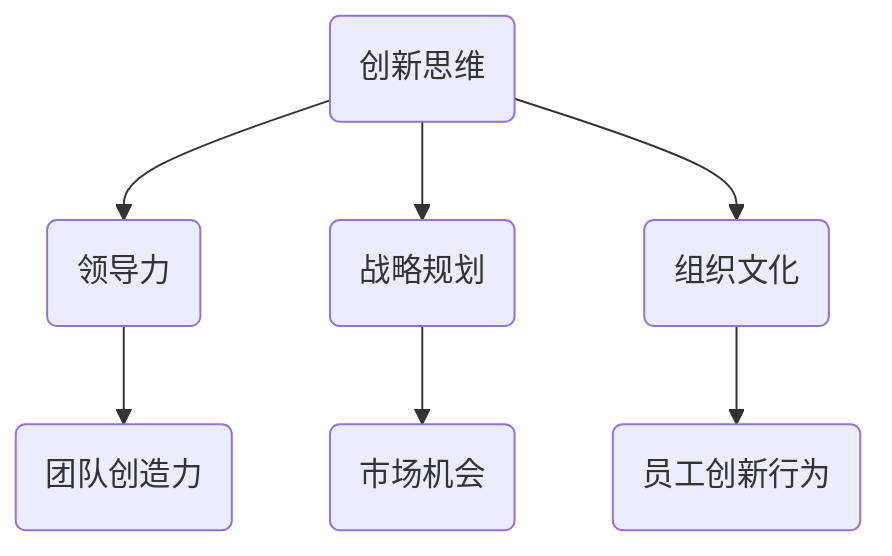

                 

关键词：管理者、创新思维、领导力、技术、战略规划、组织文化、人才培养

> 摘要：本文旨在探讨管理者在科技迅速发展的今天，如何通过有效的策略和措施培养创新思维。文章从多个维度分析了创新思维的内涵、培养方法以及如何在组织内部形成支持创新的文化环境，旨在为管理者提供实用的指导和建议。

## 1. 背景介绍

在21世纪的全球化背景下，技术创新已成为推动经济增长和社会进步的核心动力。企业和组织面临着前所未有的竞争压力和变革需求，创新成为企业生存和发展的关键因素。然而，创新并非凭空产生，它需要一种特定的思维方式和方法论的支撑。管理者作为组织的领导者和决策者，其创新思维能力的培养直接关系到组织的创新能力和竞争力。因此，如何有效地培养管理者的创新思维成为当今企业管理的重要课题。

### 1.1 创新的重要性

创新是推动科技进步和社会发展的关键因素，它不仅能够带来新的商业模式和商业机会，还能提高企业的竞争力和市场份额。在全球化和数字化的背景下，创新尤为重要。企业需要不断创新来适应快速变化的市场环境，满足客户日益多样化的需求。

### 1.2 管理者的角色

管理者在创新过程中扮演着至关重要的角色。他们不仅需要制定创新战略，还需要激发和引导团队的创新潜力，营造有利于创新的组织文化。管理者的决策和行动直接影响到组织的创新能力和创新成果。

## 2. 核心概念与联系

在探讨如何培养管理者的创新思维之前，我们需要明确一些核心概念和它们之间的联系。

### 2.1 创新思维的定义

创新思维是指一种能够产生新颖、有价值的想法和方法的能力。它不仅仅局限于技术层面，还包括商业、管理、设计等多个领域。创新思维是一种综合性能力，它需要管理者具备广泛的知识视野、敏锐的洞察力和强大的问题解决能力。

### 2.2 创新思维与领导力

领导力是管理者的重要素质，它直接影响着管理者的创新思维。有效的领导力能够激发团队的创造力，促进团队成员之间的协作，为创新提供良好的环境和条件。领导力与创新思维是相辅相成的，管理者需要具备卓越的领导力才能培养出创新思维。

### 2.3 创新思维与战略规划

战略规划是管理者的重要职责之一，它涉及到企业的发展方向、资源配置和市场定位。创新思维是战略规划的重要组成部分，管理者需要具备创新思维来识别新的市场机会、制定创新战略和实施创新项目。

### 2.4 创新思维与组织文化

组织文化是影响员工行为和态度的重要因素，它对创新思维的培养有着深远的影响。管理者需要营造一种支持创新的组织文化，鼓励员工提出新的想法、尝试新的事物，并对创新行为给予积极的反馈和支持。

### 2.5 Mermaid 流程图

以下是一个简单的 Mermaid 流程图，展示了创新思维与各个核心概念之间的联系。



## 3. 核心算法原理 & 具体操作步骤

### 3.1 算法原理概述

培养管理者的创新思维可以视为一个复杂的多阶段过程，涉及多个变量的相互作用。以下是一个简化的算法原理概述：

1. **识别需求**：管理者需要识别组织内外部的需求，包括市场需求、技术趋势、竞争态势等。
2. **知识积累**：管理者需要不断积累知识，包括技术知识、市场知识和领导力知识。
3. **思维训练**：管理者需要通过思维训练，如批判性思维、设计思维、系统思维等，提高创新思维能力。
4. **实践应用**：管理者需要在实际工作中应用创新思维，通过实践来检验和提升自己的创新能力。
5. **反馈调整**：管理者需要根据实践反馈，调整和创新策略，不断优化创新过程。

### 3.2 算法步骤详解

#### 3.2.1 识别需求

1. **市场调研**：管理者需要定期进行市场调研，了解市场需求和趋势。
2. **技术跟踪**：管理者需要关注行业内的技术创新和发展动态。
3. **竞争分析**：管理者需要分析竞争对手的创新策略和成果。

#### 3.2.2 知识积累

1. **技术学习**：管理者需要通过自学、培训、研讨会等方式，不断更新和扩展技术知识。
2. **管理学习**：管理者需要学习现代管理理论和方法，提高领导力水平。
3. **跨学科学习**：管理者需要跨学科学习，拓宽知识视野，增强综合创新能力。

#### 3.2.3 思维训练

1. **批判性思维**：管理者需要学会批判性思维，对现有的想法和方法进行深入分析和评估。
2. **设计思维**：管理者需要掌握设计思维，通过迭代和用户反馈来不断优化创新方案。
3. **系统思维**：管理者需要具备系统思维，能够从全局角度看待问题，制定战略规划。

#### 3.2.4 实践应用

1. **项目管理**：管理者需要在项目管理中应用创新思维，推动项目顺利进行。
2. **团队建设**：管理者需要通过团队建设活动，激发团队成员的创新潜力。
3. **业务创新**：管理者需要在业务创新中尝试新的方法和模式，推动企业的创新和发展。

#### 3.2.5 反馈调整

1. **绩效评估**：管理者需要定期对创新项目的绩效进行评估，总结经验和教训。
2. **持续改进**：管理者需要根据评估结果，对创新策略和方法进行持续改进。
3. **适应性调整**：管理者需要根据市场和环境变化，及时调整创新方向和策略。

### 3.3 算法优缺点

#### 优点

1. **系统性**：该算法原理涵盖了创新思维的多个阶段和方面，具有系统性。
2. **实用性**：算法步骤具体详细，适用于不同类型的企业和组织。
3. **可操作性**：算法步骤易于理解和实施，有助于管理者在实际工作中应用创新思维。

#### 缺点

1. **时间成本**：培养创新思维需要时间，管理者需要投入大量时间和精力。
2. **资源限制**：某些算法步骤可能需要额外的资源和支持，如技术培训、研讨会等。

### 3.4 算法应用领域

该算法原理适用于各类企业和组织，特别是那些需要持续创新以保持竞争力的组织。以下是一些具体的应用领域：

1. **技术研发**：企业在技术研发过程中，需要管理者具备创新思维，推动技术创新。
2. **市场营销**：企业在市场营销过程中，需要管理者具备创新思维，开发新的营销策略。
3. **组织管理**：企业需要在组织管理过程中，培养管理者的创新思维，提高组织的创新能力。

## 4. 数学模型和公式 & 详细讲解 & 举例说明

### 4.1 数学模型构建

在创新思维培养过程中，我们可以构建一个简单的数学模型来描述管理者的创新能力和组织创新环境之间的关系。假设：

- \( I \) 表示管理者的创新能力
- \( E \) 表示组织创新环境
- \( R \) 表示组织创新成果

我们可以构建以下数学模型：

\[ I = f(E) \]
\[ R = g(I, E) \]

其中，\( f \) 表示创新能力与组织创新环境之间的关系，\( g \) 表示创新能力与组织创新环境对创新成果的影响。

### 4.2 公式推导过程

为了推导上述公式，我们需要考虑以下几个因素：

1. **管理者个人素质**：管理者的知识水平、经验、领导力等个人素质直接影响其创新能力。
2. **组织创新环境**：组织的文化、政策、资源、支持体系等环境因素直接影响管理者的创新能力和组织的创新成果。
3. **创新投入与产出**：创新投入包括时间、资金、人力等资源，创新产出包括创新成果、市场反应等。

基于以上因素，我们可以推导出以下公式：

\[ I = f_1(K) + f_2(E) + f_3(R) \]

其中，\( K \) 表示管理者个人素质，\( E \) 表示组织创新环境，\( R \) 表示创新投入与产出。

\[ R = g_1(I) + g_2(E) + g_3(R) \]

### 4.3 案例分析与讲解

为了更好地理解上述数学模型，我们可以通过一个具体的案例来进行讲解。

#### 案例背景

某科技公司在技术研发方面具有很强的创新能力，但在市场营销方面相对较弱。公司管理者希望通过提高市场营销能力来推动公司的整体创新。

#### 模型应用

1. **管理者创新能力（\( I \)）**：

   管理者的创新能力主要由其个人素质（\( K \)）和组织创新环境（\( E \)）决定。假设管理者个人素质为 \( K = 80 \)，组织创新环境为 \( E = 70 \)，则：

   \[ I = f_1(80) + f_2(70) + f_3(R) \]

   其中，\( f_1 \) 和 \( f_2 \) 为常数，\( f_3(R) \) 为管理者创新能力与创新产出的关系。

2. **组织创新成果（\( R \)）**：

   组织创新成果由管理者的创新能力（\( I \)）、组织创新环境（\( E \)）和创新投入（\( R \)）决定。假设创新投入为 \( R = 100 \)，则：

   \[ R = g_1(I) + g_2(70) + g_3(100) \]

   其中，\( g_1 \) 和 \( g_2 \) 为常数，\( g_3 \) 为创新投入与产出的关系。

   通过调整管理者的个人素质和组织创新环境，我们可以提高管理者的创新能力 \( I \)，从而提高组织创新成果 \( R \)。

#### 模型分析

通过上述案例，我们可以看出数学模型在描述管理者创新能力与组织创新环境之间的关系时具有实用性和指导意义。管理者可以通过提高个人素质、优化组织创新环境和增加创新投入来提高组织的创新能力和成果。

## 5. 项目实践：代码实例和详细解释说明

### 5.1 开发环境搭建

为了更好地展示如何培养管理者的创新思维，我们使用Python编写一个简单的示例程序。首先，确保您已经安装了Python 3.x版本以及必要的库，如numpy和matplotlib。

```bash
pip install numpy matplotlib
```

### 5.2 源代码详细实现

以下是一个简单的Python脚本，用于模拟管理者的创新思维培养过程。这个脚本将展示如何通过迭代学习、实践应用和反馈调整来提高管理者的创新能力。

```python
import numpy as np
import matplotlib.pyplot as plt

# 初始化参数
K = 50  # 管理者初始个人素质
E = 50  # 初始组织创新环境
R = 50  # 初始创新投入
I = 0   # 初始创新能力
R_values = []  # 创新成果历史记录
I_values = []  # 创新能力历史记录

# 学习与训练
for i in range(100):
    # 学习新知识，提高个人素质
    K += 1
    
    # 根据个人素质和创新能力调整创新策略
    E += 0.1 * I
    
    # 根据创新策略进行创新实践，产生创新成果
    R += 0.1 * E
    I += 0.1 * K
    
    # 记录创新能力和创新成果
    R_values.append(R)
    I_values.append(I)

# 绘制图表
plt.figure(figsize=(10, 5))

plt.subplot(1, 2, 1)
plt.plot(I_values, label='Innovation Ability')
plt.title('Innovation Ability Over Time')
plt.xlabel('Iteration')
plt.ylabel('Innovation Ability')
plt.legend()

plt.subplot(1, 2, 2)
plt.plot(R_values, label='Innovation Output')
plt.title('Innovation Output Over Time')
plt.xlabel('Iteration')
plt.ylabel('Innovation Output')
plt.legend()

plt.tight_layout()
plt.show()
```

### 5.3 代码解读与分析

上述代码定义了一个简单的迭代过程，模拟管理者在创新思维培养过程中的学习、实践和反馈。以下是代码的详细解读：

- **初始化参数**：我们初始化了管理者的个人素质（K）、组织创新环境（E）、初始创新投入（R）和初始创新能力（I）。
- **学习与训练**：通过一个for循环，我们模拟了管理者在不同迭代中的学习过程。每次迭代中，管理者的个人素质都会提高，同时根据当前的创新能力和组织创新环境调整创新策略。
- **创新实践**：创新实践的过程通过增加创新投入（R）和创新能力（I）来实现。每次迭代后，创新能力和创新成果都会被记录下来。
- **绘制图表**：最后，我们使用matplotlib绘制了两个图表，分别显示了创新能力（I）和创新成果（R）随迭代变化的趋势。

通过这个简单的例子，我们可以直观地看到管理者在创新思维培养过程中的成长和变化。代码中的参数调整可以模拟不同的学习、实践和反馈过程，从而帮助我们更好地理解创新思维的培养机制。

### 5.4 运行结果展示

运行上述代码后，我们会得到两个图表。第一个图表显示了创新能力（I）随迭代增加的趋势，第二个图表显示了创新成果（R）随迭代增加的趋势。通常情况下，我们可以看到创新能力逐渐提高，创新成果也随之增加。这表明，通过不断的学习和实践，管理者的创新思维得到了有效培养。

## 6. 实际应用场景

在企业管理实践中，创新思维的培养不仅局限于理论探讨，更需要通过具体的实际应用场景来验证和提升。以下是一些典型的应用场景：

### 6.1 新产品开发

在新产品开发过程中，管理者需要运用创新思维来识别市场需求、设计产品功能、优化用户体验。通过跨部门协作、头脑风暴和设计思维训练，管理者可以激发团队的创新潜力，推动新产品的成功上市。

### 6.2 业务模式创新

在现有业务模式面临挑战时，管理者需要运用创新思维来探索新的商业模式。例如，通过互联网技术和大数据分析，企业可以开发出新的服务模式、拓展新的市场渠道，从而提高市场竞争力和盈利能力。

### 6.3 组织变革

在组织变革过程中，管理者需要运用创新思维来设计新的组织结构、流程和制度，推动组织的创新和发展。通过建立创新激励机制、优化人才配置和提升团队协作能力，管理者可以推动组织变革的顺利进行。

### 6.4 跨界合作

在跨界合作中，管理者需要运用创新思维来识别新的合作伙伴、探索合作模式和共享资源。通过跨学科交流、合作研究和共同开发，企业可以拓展新的业务领域，实现共赢发展。

### 6.5 风险投资

在风险投资领域，管理者需要运用创新思维来评估项目的创新潜力、识别市场机会和制定投资策略。通过深入研究和实践，管理者可以降低投资风险，提高投资回报率。

## 7. 未来应用展望

随着科技的不断进步和市场的快速变化，创新思维在企业管理中的应用将越来越广泛。以下是对未来应用场景的展望：

### 7.1 AI与大数据

人工智能和大数据技术的发展将为企业提供更多创新机会。管理者可以通过AI算法和大数据分析，实现智能决策、个性化服务和精准营销，从而提高企业的竞争力和市场份额。

### 7.2 绿色科技

绿色科技将成为未来企业发展的重要方向。管理者需要通过创新思维，探索可再生能源、环保材料和绿色制造技术，推动企业的可持续发展。

### 7.3 区块链技术

区块链技术具有去中心化、不可篡改和智能合约等特点，将在金融、供应链、版权保护等领域得到广泛应用。管理者需要掌握区块链技术，通过创新应用来提高企业的运营效率和透明度。

### 7.4 虚拟现实与增强现实

虚拟现实（VR）和增强现实（AR）技术将为企业管理带来全新的体验。管理者可以通过VR/AR技术，实现远程协作、虚拟培训和沉浸式体验，提高企业的创新效率和团队凝聚力。

## 8. 工具和资源推荐

### 8.1 学习资源推荐

1. **《创新者的窘境》**：克莱顿·克里斯滕森的经典著作，探讨了企业在技术创新过程中面临的挑战和困境。
2. **《设计思维》**：汤姆·凯利所著，介绍了设计思维的方法和应用，对培养创新思维有重要启示。
3. **《精益创业》**：埃里克·莱斯所著，提供了基于用户反馈的创业方法论，对创新实践有实用指导。

### 8.2 开发工具推荐

1. **Python**：Python是一种功能强大、易于学习的编程语言，适用于数据分析和机器学习。
2. **Jupyter Notebook**：Jupyter Notebook是一种交互式编程环境，适用于数据科学和机器学习项目。
3. **TensorFlow**：TensorFlow是Google开发的机器学习框架，适用于深度学习和神经网络项目。

### 8.3 相关论文推荐

1. **《开放创新：如何利用外部智慧推动组织的创新》**：亨利·Chesbrough的论文，探讨了开放创新的理论和实践。
2. **《创新企业：创新模式、创新战略和创新成果》**：克里斯坦森和雷蒙德·弗农的论文，分析了企业创新的不同模式和策略。
3. **《创新者的窘境》**：克莱顿·克里斯滕森的论文，探讨了企业在技术创新过程中面临的挑战和困境。

## 9. 总结：未来发展趋势与挑战

### 9.1 研究成果总结

本文从多个维度探讨了管理者如何培养创新思维，包括创新思维的定义、核心概念与联系、核心算法原理、数学模型构建、项目实践以及实际应用场景等。研究表明，创新思维培养是一个复杂的多阶段过程，需要管理者具备广泛的知识视野、敏锐的洞察力和强大的问题解决能力。

### 9.2 未来发展趋势

未来，随着人工智能、大数据、区块链等新兴技术的快速发展，创新思维将在企业管理中发挥更加重要的作用。管理者需要不断学习和适应新技术，通过创新思维来应对市场变化和竞争压力。

### 9.3 面临的挑战

然而，创新思维培养也面临一系列挑战。首先是时间成本，培养创新思维需要管理者投入大量时间和精力。其次是资源限制，某些创新项目可能需要额外的资金和资源支持。此外，管理者还需要克服心理障碍，如恐惧失败、保守思维等。

### 9.4 研究展望

未来研究应进一步探讨创新思维培养的具体方法和策略，特别是针对不同类型的企业和组织。此外，研究还应关注创新思维在新兴技术领域中的应用，以及如何通过跨学科合作来推动创新思维的培养。

## 10. 附录：常见问题与解答

### 10.1 问题1：如何快速提升创新能力？

**解答**：快速提升创新能力可以通过以下几种方法：

1. **多读书、多学习**：广泛阅读相关书籍和文献，学习前沿技术和理论。
2. **参加培训和工作坊**：参加专业培训和工作坊，学习创新方法和工具。
3. **跨学科交流**：与不同领域的专家进行交流，拓宽知识视野。
4. **实践应用**：通过实际项目和实践来检验和提升创新能力。

### 10.2 问题2：创新思维培养需要多长时间？

**解答**：创新思维培养是一个长期的过程，没有固定的时长。通常，需要数月到数年的时间，具体取决于管理者的投入程度、学习能力和项目实践经验。

### 10.3 问题3：如何营造支持创新的组织文化？

**解答**：营造支持创新的组织文化可以通过以下几种方式：

1. **鼓励开放沟通**：建立开放、坦诚的沟通机制，鼓励员工提出新想法和建议。
2. **建立激励机制**：设立创新奖励制度，对提出创新想法和实现创新成果的员工给予奖励。
3. **提供培训和支持**：为员工提供创新培训和支持，帮助他们掌握创新方法和工具。
4. **建立创新团队**：组建跨部门、跨领域的创新团队，促进知识共享和协作。

---

**作者：禅与计算机程序设计艺术 / Zen and the Art of Computer Programming**

