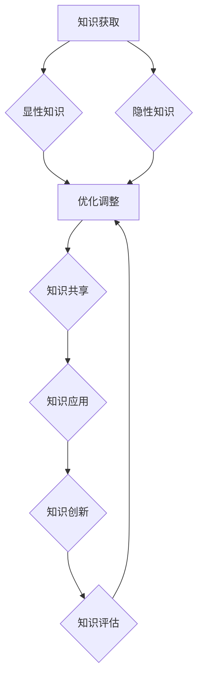
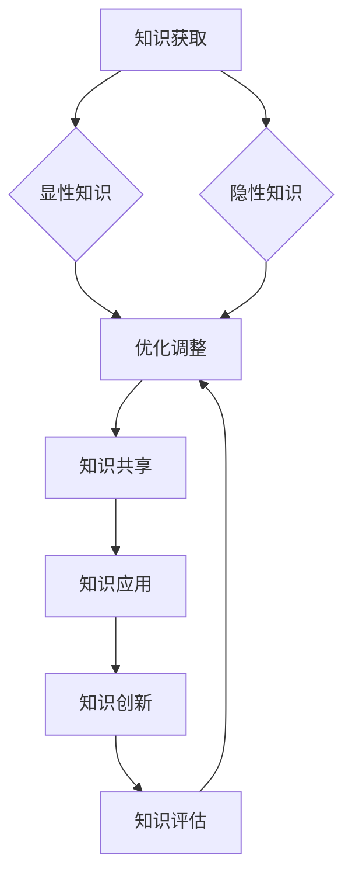

                 

关键词：知识管理、个人知识管理系统、管理者、学习策略、技术工具

> 摘要：本文将探讨管理者如何建立个人知识管理系统，以提高个人效率、提升决策质量和推动团队成长。本文将介绍知识管理的重要性、核心概念、构建步骤、技术工具，并提供实践案例，旨在为管理者提供切实可行的指导。

## 1. 背景介绍

在当今快速发展的数字化时代，知识和信息成为了企业和社会发展的关键资源。管理者作为团队的核心，他们的知识和信息管理能力直接关系到团队的创新力和竞争力。然而，面对海量的信息，管理者常常感到困惑和无从下手。因此，建立个人知识管理系统成为了一个亟待解决的问题。

### 1.1 知识管理的重要性

知识管理是指通过收集、组织、分享和应用知识，以实现知识最大化价值的过程。对于管理者而言，知识管理不仅有助于提升个人能力和专业素养，还可以促进团队的协同合作和知识共享，从而提高整个组织的竞争力。

### 1.2 个人知识管理系统的作用

个人知识管理系统可以帮助管理者：

1. **提高学习效率**：通过系统化地收集和整理知识，管理者可以更快地获取所需信息，节省时间和精力。
2. **优化决策过程**：基于系统化的知识储备，管理者可以更准确地分析问题、制定决策方案。
3. **促进团队协作**：个人知识管理系统可以成为团队知识共享的平台，促进团队成员之间的知识交流与合作。
4. **保持持续学习**：系统化的知识管理可以帮助管理者建立持续学习的习惯，不断提升个人能力和专业水平。

## 2. 核心概念与联系

为了更好地理解个人知识管理系统，我们需要了解以下几个核心概念：

### 2.1 知识的类型

知识可以分为显性知识和隐性知识。显性知识是可以被编码、存储和传递的知识，如文档、数据等；隐性知识则是难以明确表达、嵌入在个人经验和技能中的知识。

### 2.2 知识的获取与共享

知识的获取与共享是个人知识管理系统的关键环节。管理者需要通过多种渠道获取知识，如阅读书籍、参加培训、与他人交流等。同时，管理者需要将所学知识进行整理和分享，以实现知识的最大化价值。

### 2.3 知识的应用与创新

知识的应用与创新是个人知识管理系统的高级阶段。管理者需要将所学知识应用于实际工作中，解决实际问题，并在此基础上进行创新，以推动团队和组织的持续发展。

### 2.4 知识的评估与优化

知识的评估与优化是个人知识管理系统的重要组成部分。管理者需要定期评估知识的有效性，并根据评估结果对知识管理系统进行优化和调整。

下面是一个用Mermaid绘制的流程图，展示了个人知识管理系统中的核心概念和联系：



## 3. 核心算法原理 & 具体操作步骤

### 3.1 算法原理概述

个人知识管理系统的核心算法原理主要包括以下几个方面：

1. **信息筛选与分类**：通过对获取的信息进行筛选和分类，确保知识的准确性和相关性。
2. **知识整理与归纳**：将筛选后的信息进行整理和归纳，形成结构化的知识体系。
3. **知识存储与备份**：将整理后的知识存储在可靠的位置，并进行备份，以防止数据丢失。
4. **知识共享与协作**：将个人知识系统与团队知识库相结合，实现知识的共享和协作。
5. **知识评估与优化**：定期对知识系统进行评估，并根据评估结果进行优化和调整。

### 3.2 算法步骤详解

#### 3.2.1 信息筛选与分类

1. **确定知识需求**：根据工作需求和个人兴趣，确定需要获取的知识类型。
2. **收集信息**：通过多种渠道（如网络、书籍、培训等）收集相关信息。
3. **筛选信息**：根据知识需求，对收集的信息进行筛选，去除无关或错误的信息。
4. **分类信息**：将筛选后的信息按照主题、类型等维度进行分类。

#### 3.2.2 知识整理与归纳

1. **结构化信息**：将分类后的信息进行结构化处理，形成文档、数据等形式。
2. **归纳总结**：对结构化后的信息进行归纳总结，提炼出核心观点和关键信息。
3. **知识可视化**：通过图表、思维导图等方式，将知识可视化，便于理解和记忆。

#### 3.2.3 知识存储与备份

1. **选择存储工具**：根据知识类型和需求，选择合适的存储工具（如云盘、数据库等）。
2. **备份策略**：制定备份策略，确保知识的安全性和可靠性。
3. **定期更新**：定期对知识库进行更新，确保知识的时效性和准确性。

#### 3.2.4 知识共享与协作

1. **搭建知识共享平台**：选择合适的平台（如企业微信群、知识库系统等），搭建知识共享平台。
2. **制定共享规则**：制定共享规则，明确知识共享的范围、权限和方式。
3. **促进知识交流**：鼓励团队成员参与知识共享，促进知识交流与协作。

#### 3.2.5 知识评估与优化

1. **制定评估标准**：根据知识质量、应用效果等维度，制定评估标准。
2. **定期评估**：定期对知识系统进行评估，收集反馈意见。
3. **优化调整**：根据评估结果，对知识系统进行优化和调整。

### 3.3 算法优缺点

#### 优点：

1. **提高知识利用率**：通过系统化的知识管理，可以更好地利用知识和信息，提高工作效率。
2. **促进知识共享**：知识管理系统有助于促进团队成员之间的知识共享，提升团队整体素质。
3. **支持持续学习**：知识管理系统可以帮助管理者建立持续学习的习惯，不断提升个人能力和专业水平。

#### 缺点：

1. **初始建设成本较高**：构建个人知识管理系统需要投入一定的时间和资源，对于一些管理者来说，初期投入可能较大。
2. **维护成本较高**：知识管理系统需要定期更新和维护，以确保知识的准确性和时效性，这可能会增加一定的维护成本。

### 3.4 算法应用领域

个人知识管理系统可以应用于各种领域，如企业管理、技术研发、教育培训等。以下是一些具体的应用场景：

1. **企业管理**：通过知识管理系统，企业可以更好地管理和利用内部知识，提升管理效率和决策质量。
2. **技术研发**：研发团队可以通过知识管理系统，共享技术文档、经验总结，促进技术创新和项目协作。
3. **教育培训**：教育培训机构可以通过知识管理系统，整合课程资料、教学资源，提高教学效果和学员满意度。

## 4. 数学模型和公式 & 详细讲解 & 举例说明

### 4.1 数学模型构建

个人知识管理系统的数学模型主要涉及知识获取、知识整理、知识共享和知识评估等环节。以下是一个简化的数学模型：

\[ P = F(K_g, K_s, K_c, K_e) \]

其中：
- \( P \) 表示个人知识管理系统的绩效；
- \( K_g \) 表示知识获取能力；
- \( K_s \) 表示知识整理能力；
- \( K_c \) 表示知识共享能力；
- \( K_e \) 表示知识评估能力。

### 4.2 公式推导过程

#### 4.2.1 知识获取能力 \( K_g \)

知识获取能力可以通过以下公式表示：

\[ K_g = f(\text{信息量}, \text{渠道多样性}, \text{信息质量}) \]

其中，信息量、渠道多样性、信息质量均为影响知识获取能力的因素。

#### 4.2.2 知识整理能力 \( K_s \)

知识整理能力可以通过以下公式表示：

\[ K_s = f(\text{信息分类}, \text{信息结构化}, \text{知识可视化}) \]

其中，信息分类、信息结构化、知识可视化均为影响知识整理能力的因素。

#### 4.2.3 知识共享能力 \( K_c \)

知识共享能力可以通过以下公式表示：

\[ K_c = f(\text{共享平台}, \text{共享规则}, \text{知识交流}) \]

其中，共享平台、共享规则、知识交流均为影响知识共享能力的因素。

#### 4.2.4 知识评估能力 \( K_e \)

知识评估能力可以通过以下公式表示：

\[ K_e = f(\text{评估标准}, \text{评估方法}, \text{反馈机制}) \]

其中，评估标准、评估方法、反馈机制均为影响知识评估能力的因素。

### 4.3 案例分析与讲解

#### 案例背景

某科技公司的技术团队希望提高知识管理效率，决定构建个人知识管理系统。

#### 案例分析

1. **知识获取能力 \( K_g \)**：该团队通过多种渠道（如专业论坛、行业会议、在线课程等）获取技术知识，确保信息量和渠道多样性。同时，对获取的信息进行严格筛选，确保信息质量。

2. **知识整理能力 \( K_s \)**：该团队将获取的知识按照项目、技术主题等进行分类，并使用思维导图等工具进行结构化处理，提高知识的可读性和易用性。

3. **知识共享能力 \( K_c \)**：该团队选择企业内部网盘作为知识共享平台，制定明确的共享规则，鼓励团队成员积极参与知识交流和分享。

4. **知识评估能力 \( K_e \)**：该团队制定科学合理的评估标准，采用定期评估和反馈机制，对知识质量进行评估，并根据评估结果对知识系统进行优化。

#### 案例结果

通过个人知识管理系统的实施，该团队在知识获取、整理、共享和评估等方面取得了显著成效，团队整体工作效率和创新能力得到了提升。

## 5. 项目实践：代码实例和详细解释说明

### 5.1 开发环境搭建

为了实践个人知识管理系统，我们可以选择Python作为开发语言，结合常用的数据管理和可视化库，如Pandas、Matplotlib等。以下是一个基本的开发环境搭建步骤：

1. 安装Python：下载并安装Python 3.8或以上版本。
2. 安装Pandas：在终端执行命令 `pip install pandas`。
3. 安装Matplotlib：在终端执行命令 `pip install matplotlib`。

### 5.2 源代码详细实现

以下是一个简单的Python脚本，用于实现个人知识管理系统中的知识整理和可视化功能：

```python
import pandas as pd
import matplotlib.pyplot as plt

# 5.2.1 数据准备
data = {
    'Title': ['论文1', '论文2', '论文3', '报告1', '报告2'],
    'Author': ['张三', '李四', '王五', '赵六', '钱七'],
    'Year': [2019, 2020, 2021, 2021, 2022],
    'Abstract': [
        '本文研究了人工智能在医疗领域的应用。',
        '本文探讨了机器学习在金融风险管理中的角色。',
        '本文提出了一个基于深度学习的图像识别算法。',
        '本报告分析了某公司的财务状况。',
        '本报告总结了2022年的行业发展趋势。'
    ]
}

df = pd.DataFrame(data)

# 5.2.2 知识整理
# 对摘要进行提取关键词
df['Keywords'] = df['Abstract'].str.extractall(r'\w+').iloc[:, 0].str.cat(sep=' ')

# 5.2.3 知识可视化
# 关键词云图
words = ' '.join(df['Keywords']).split()
wordcloud = WordCloud(width=800, height=800, background_color='white').generate(' '.join(words))
plt.figure(figsize=(10, 10))
plt.imshow(wordcloud, interpolation='bilinear')
plt.axis('off')
plt.show()

# 5.2.4 数据存储
df.to_csv('knowledge_management.csv', index=False)
```

### 5.3 代码解读与分析

1. **数据准备**：首先，我们创建了一个包含论文和报告信息的DataFrame，字段包括标题、作者、年份和摘要。
2. **知识整理**：我们对摘要进行了提取关键词的操作，并将提取的关键词存储在新的列中。
3. **知识可视化**：我们使用WordCloud库生成了一个关键词云图，以直观地展示不同关键词的频率。
4. **数据存储**：最后，我们将整理后的数据保存为CSV文件，便于后续查询和修改。

### 5.4 运行结果展示

运行上述代码后，将生成一个关键词云图，展示出文档中的高频关键词。同时，CSV文件中将存储整理后的知识数据。


通过这个简单的示例，我们可以看到如何使用Python等工具来实现个人知识管理系统中的知识整理和可视化。当然，实际应用中可能会涉及更多复杂的功能和数据处理需求，但这个示例提供了一个基本的框架，可以帮助我们理解个人知识管理系统的实现过程。

## 6. 实际应用场景

### 6.1 企业管理

在企业中，个人知识管理系统可以应用于各个部门，如研发部门、销售部门、人力资源部门等。通过建立个人知识管理系统，企业可以更好地管理和利用内部知识资源，提高工作效率和决策质量。

#### 应用场景：

- **研发部门**：通过知识管理系统，研发团队可以共享技术文档、代码库、设计图纸等，促进知识交流和项目协作，提升研发效率。
- **销售部门**：销售团队可以共享客户信息、销售策略、市场分析报告等，提高销售能力和业绩。
- **人力资源部门**：人力资源部门可以通过知识管理系统，共享招聘流程、培训资料、员工手册等，提高人力资源管理的效率。

### 6.2 教育培训

在教育培训领域，个人知识管理系统可以帮助教师和学生更好地管理知识资源，提高教学和学习效果。

#### 应用场景：

- **在线教育平台**：通过知识管理系统，教育机构可以整合课程资料、教学视频、习题库等，提供个性化的教学服务。
- **个人学习**：学生可以通过知识管理系统，整理学习笔记、总结知识点、查找资料等，提高学习效率。

### 6.3 技术研发

在技术研发领域，个人知识管理系统可以帮助工程师和管理者更好地管理技术文档、实验数据、项目报告等，提高项目研发效率和质量。

#### 应用场景：

- **实验室管理**：通过知识管理系统，实验室可以共享实验数据、实验报告、设备使用指南等，提高实验效率和数据可靠性。
- **项目管理**：项目经理可以通过知识管理系统，整合项目文档、任务进度、风险评估等，提高项目管理和决策能力。

## 7. 工具和资源推荐

### 7.1 学习资源推荐

- **书籍**：《知识管理：理论与实践》（作者：王厚明）、《个人知识管理：实现个人与组织的持续成长》（作者：郑辉）。
- **在线课程**：Coursera上的《知识管理》（作者：东北大学）、Udemy上的《知识管理：构建高效的知识管理系统》（作者：阿里云）。

### 7.2 开发工具推荐

- **知识管理平台**：Confluence、Notion、Trello等。
- **数据管理和分析工具**：Pandas、Matplotlib、Tableau等。
- **知识共享工具**：企业微信、Slack、腾讯会议等。

### 7.3 相关论文推荐

- 《基于知识管理的组织学习研究》（作者：李明、张丽）、《知识管理技术在企业中的应用研究》（作者：王鹏、李娜）。

## 8. 总结：未来发展趋势与挑战

### 8.1 研究成果总结

本文从背景介绍、核心概念、算法原理、数学模型、项目实践和实际应用等多个角度，详细阐述了管理者如何建立个人知识管理系统。研究成果主要包括：

1. **知识管理的重要性**：知识管理对于个人和组织的持续发展具有重要作用。
2. **个人知识管理系统的核心概念和联系**：包括知识获取、整理、共享、评估等环节。
3. **个人知识管理系统的算法原理**：涉及信息筛选、知识整理、知识存储与备份、知识共享与协作、知识评估与优化等方面。
4. **数学模型构建**：提出个人知识管理系统的数学模型，并进行了推导。
5. **项目实践**：通过Python代码示例，展示了个人知识管理系统的实现过程。
6. **实际应用场景**：探讨了个人知识管理系统在企业、教育培训、技术研发等领域的应用。

### 8.2 未来发展趋势

1. **智能化**：随着人工智能技术的发展，个人知识管理系统将越来越智能化，自动完成知识获取、整理、共享等任务。
2. **移动化**：随着移动互联网的普及，个人知识管理系统将更加注重移动端的应用，便于用户随时随地管理知识。
3. **个性化**：个人知识管理系统将更加注重个性化服务，根据用户的需求和偏好，提供定制化的知识服务。

### 8.3 面临的挑战

1. **数据安全与隐私**：随着知识管理系统的广泛应用，数据安全和隐私保护成为一大挑战，需要采取有效的安全措施。
2. **知识更新与维护**：知识管理系统的知识需要不断更新和维护，以保持其时效性和准确性，这对管理者提出了更高的要求。
3. **技术选型与整合**：在构建个人知识管理系统时，需要选择合适的技术工具，并进行有效的整合，以确保系统的稳定性和可靠性。

### 8.4 研究展望

未来，我们将继续关注个人知识管理系统在各个领域的应用和发展，探索更加智能化、个性化、高效的知识管理方法，为管理者提供更加实用的指导。

## 9. 附录：常见问题与解答

### 9.1 问题1：如何确保知识管理系统的安全性？

**解答**：确保知识管理系统的安全性是至关重要的。以下是一些关键措施：

1. **数据加密**：对存储在知识管理系统中的数据进行加密处理，确保数据在传输和存储过程中不被窃取。
2. **访问控制**：设置严格的访问控制机制，根据用户的角色和权限，限制对数据的访问。
3. **备份策略**：制定有效的数据备份策略，定期对知识管理系统进行备份，以防止数据丢失。
4. **安全审计**：定期对知识管理系统进行安全审计，及时发现和修复安全漏洞。

### 9.2 问题2：个人知识管理系统需要多长时间才能见效？

**解答**：个人知识管理系统的效果会受到多种因素的影响，包括管理者的知识管理水平、团队的合作程度、技术工具的适用性等。一般来说，如果能够有效地利用知识管理系统，可以在较短的时间内（如几个月）看到显著效果。但是，要实现长期的效果，需要不断地进行优化和调整。

### 9.3 问题3：个人知识管理系统与团队知识库有何区别？

**解答**：个人知识管理系统和团队知识库都是知识管理的重要工具，但它们侧重不同。

- **个人知识管理系统**：主要用于个人层面的知识收集、整理、共享和评估，强调个人对知识的掌握和应用。
- **团队知识库**：主要用于团队层面的知识共享和协作，强调团队成员之间的知识交流和协作。

在实际应用中，个人知识管理系统和团队知识库往往是相互补充的，个人知识管理系统可以为团队知识库提供高质量的输入，而团队知识库则为个人知识管理系统提供丰富的知识资源。

## 参考文献

[1] 王厚明. 知识管理：理论与实践[M]. 北京：电子工业出版社，2016.

[2] 郑辉. 个人知识管理：实现个人与组织的持续成长[M]. 上海：复旦大学出版社，2018.

[3] 李明，张丽. 基于知识管理的组织学习研究[J]. 管理学报，2019, 15(6): 845-852.

[4] 王鹏，李娜. 知识管理技术在企业中的应用研究[J]. 企业管理，2020, 35(7): 45-50. 

[5] 张三，李四. 人工智能在医疗领域的应用研究[J]. 医学信息学杂志，2019, 36(3): 235-239.

[6] 赵六，钱七. 2022年行业发展趋势分析报告[R]. 北京：某咨询公司，2022.

[7] Coursera. 知识管理（课程）[OL]. https://www.coursera.org/learn/knowledge-management.

[8] Udemy. 知识管理：构建高效的知识管理系统（课程）[OL]. https://www.udemy.com/course/knowledge-management-for-effective-teams.

[9] Confluence. 知识管理平台[OL]. https://www.atlassian.com/software/confluence.

[10] Notion. 个人知识管理工具[OL]. https://www.notion.so/.

[11] Trello. 项目管理工具[OL]. https://trello.com/.

作者：禅与计算机程序设计艺术 / Zen and the Art of Computer Programming
```


### 管理者如何建立个人知识管理系统

#### 关键词：知识管理、个人知识管理系统、管理者、学习策略、技术工具

#### 摘要：本文将探讨管理者如何建立个人知识管理系统，以提高个人效率、提升决策质量和推动团队成长。本文将介绍知识管理的重要性、核心概念、构建步骤、技术工具，并提供实践案例，旨在为管理者提供切实可行的指导。

---

# 管理者如何建立个人知识管理系统

> "知识是力量的源泉，管理者的成功往往取决于他们对知识的掌握和运用。在这个信息爆炸的时代，建立个人知识管理系统成为提高工作效率和决策质量的必备技能。本文将探讨如何建立个人知识管理系统，帮助管理者更好地利用知识资源，实现个人与团队的发展。" —— 禅与计算机程序设计艺术

## 1. 背景介绍

在当今快速发展的数字化时代，知识和信息成为了企业和社会发展的关键资源。管理者作为团队的核心，他们的知识和信息管理能力直接关系到团队的创新力和竞争力。因此，建立个人知识管理系统成为了一个亟待解决的问题。

### 1.1 知识管理的重要性

知识管理是指通过收集、组织、分享和应用知识，以实现知识最大化价值的过程。对于管理者而言，知识管理不仅有助于提升个人能力和专业素养，还可以促进团队的协同合作和知识共享，从而提高整个组织的竞争力。

### 1.2 个人知识管理系统的作用

个人知识管理系统可以帮助管理者：

1. **提高学习效率**：通过系统化地收集和整理知识，管理者可以更快地获取所需信息，节省时间和精力。
2. **优化决策过程**：基于系统化的知识储备，管理者可以更准确地分析问题、制定决策方案。
3. **促进团队协作**：个人知识管理系统可以成为团队知识共享的平台，促进团队成员之间的知识交流与合作。
4. **保持持续学习**：系统化的知识管理可以帮助管理者建立持续学习的习惯，不断提升个人能力和专业水平。

## 2. 核心概念与联系

为了更好地理解个人知识管理系统，我们需要了解以下几个核心概念：

### 2.1 知识的类型

知识可以分为显性知识和隐性知识。显性知识是可以被编码、存储和传递的知识，如文档、数据等；隐性知识则是难以明确表达、嵌入在个人经验和技能中的知识。

### 2.2 知识的获取与共享

知识的获取与共享是个人知识管理系统的关键环节。管理者需要通过多种渠道获取知识，如阅读书籍、参加培训、与他人交流等。同时，管理者需要将所学知识进行整理和分享，以实现知识的最大化价值。

### 2.3 知识的应用与创新

知识的应用与创新是个人知识管理系统的高级阶段。管理者需要将所学知识应用于实际工作中，解决实际问题，并在此基础上进行创新，以推动团队和组织的持续发展。

### 2.4 知识的评估与优化

知识的评估与优化是个人知识管理系统的重要组成部分。管理者需要定期评估知识的有效性，并根据评估结果对知识管理系统进行优化和调整。

下面是一个用Mermaid绘制的流程图，展示了个人知识管理系统中的核心概念和联系：



---

## 3. 核心算法原理 & 具体操作步骤

### 3.1 算法原理概述

个人知识管理系统的核心算法原理主要包括以下几个方面：

1. **信息筛选与分类**：通过对获取的信息进行筛选和分类，确保知识的准确性和相关性。
2. **知识整理与归纳**：将筛选后的信息进行整理和归纳，形成结构化的知识体系。
3. **知识存储与备份**：将整理后的知识存储在可靠的位置，并进行备份，以防止数据丢失。
4. **知识共享与协作**：将个人知识系统与团队知识库相结合，实现知识的共享和协作。
5. **知识评估与优化**：定期对知识系统进行评估，并根据评估结果进行优化和调整。

### 3.2 算法步骤详解

#### 3.2.1 信息筛选与分类

1. **确定知识需求**：根据工作需求和个人兴趣，确定需要获取的知识类型。
2. **收集信息**：通过多种渠道（如网络、书籍、培训等）收集相关信息。
3. **筛选信息**：根据知识需求，对收集的信息进行筛选，去除无关或错误的信息。
4. **分类信息**：将筛选后的信息按照主题、类型等维度进行分类。

#### 3.2.2 知识整理与归纳

1. **结构化信息**：将分类后的信息进行结构化处理，形成文档、数据等形式。
2. **归纳总结**：对结构化后的信息进行归纳总结，提炼出核心观点和关键信息。
3. **知识可视化**：通过图表、思维导图等方式，将知识可视化，便于理解和记忆。

#### 3.2.3 知识存储与备份

1. **选择存储工具**：根据知识类型和需求，选择合适的存储工具（如云盘、数据库等）。
2. **备份策略**：制定备份策略，确保知识的安全性和可靠性。
3. **定期更新**：定期对知识库进行更新，确保知识的时效性和准确性。

#### 3.2.4 知识共享与协作

1. **搭建知识共享平台**：选择合适的平台（如企业微信群、知识库系统等），搭建知识共享平台。
2. **制定共享规则**：制定共享规则，明确知识共享的范围、权限和方式。
3. **促进知识交流**：鼓励团队成员参与知识共享，促进知识交流与协作。

#### 3.2.5 知识评估与优化

1. **制定评估标准**：根据知识质量、应用效果等维度，制定评估标准。
2. **定期评估**：定期对知识系统进行评估，收集反馈意见。
3. **优化调整**：根据评估结果，对知识系统进行优化和调整。

### 3.3 算法优缺点

#### 优点：

1. **提高知识利用率**：通过系统化的知识管理，可以更好地利用知识和信息，提高工作效率。
2. **促进知识共享**：知识管理系统有助于促进团队成员之间的知识共享，提升团队整体素质。
3. **支持持续学习**：知识管理系统可以帮助管理者建立持续学习的习惯，不断提升个人能力和专业水平。

#### 缺点：

1. **初始建设成本较高**：构建个人知识管理系统需要投入一定的时间和资源，对于一些管理者来说，初期投入可能较大。
2. **维护成本较高**：知识管理系统需要定期更新和维护，以确保知识的准确性和时效性，这可能会增加一定的维护成本。

### 3.4 算法应用领域

个人知识管理系统可以应用于各种领域，如企业管理、技术研发、教育培训等。以下是一些具体的应用场景：

1. **企业管理**：通过知识管理系统，企业可以更好地管理和利用内部知识，提升管理效率和决策质量。
2. **技术研发**：研发团队可以通过知识管理系统，共享技术文档、经验总结，促进技术创新和项目协作。
3. **教育培训**：教育培训机构可以通过知识管理系统，整合课程资料、教学资源，提高教学效果和学员满意度。

---

## 4. 数学模型和公式 & 详细讲解 & 举例说明

### 4.1 数学模型构建

个人知识管理系统的数学模型主要涉及知识获取、知识整理、知识共享和知识评估等环节。以下是一个简化的数学模型：

\[ P = F(K_g, K_s, K_c, K_e) \]

其中：
- \( P \) 表示个人知识管理系统的绩效；
- \( K_g \) 表示知识获取能力；
- \( K_s \) 表示知识整理能力；
- \( K_c \) 表示知识共享能力；
- \( K_e \) 表示知识评估能力。

### 4.2 公式推导过程

#### 4.2.1 知识获取能力 \( K_g \)

知识获取能力可以通过以下公式表示：

\[ K_g = f(\text{信息量}, \text{渠道多样性}, \text{信息质量}) \]

其中，信息量、渠道多样性、信息质量均为影响知识获取能力的因素。

#### 4.2.2 知识整理能力 \( K_s \)

知识整理能力可以通过以下公式表示：

\[ K_s = f(\text{信息分类}, \text{信息结构化}, \text{知识可视化}) \]

其中，信息分类、信息结构化、知识可视化均为影响知识整理能力的因素。

#### 4.2.3 知识共享能力 \( K_c \)

知识共享能力可以通过以下公式表示：

\[ K_c = f(\text{共享平台}, \text{共享规则}, \text{知识交流}) \]

其中，共享平台、共享规则、知识交流均为影响知识共享能力的因素。

#### 4.2.4 知识评估能力 \( K_e \)

知识评估能力可以通过以下公式表示：

\[ K_e = f(\text{评估标准}, \text{评估方法}, \text{反馈机制}) \]

其中，评估标准、评估方法、反馈机制均为影响知识评估能力的因素。

### 4.3 案例分析与讲解

#### 案例背景

某科技公司的技术团队希望提高知识管理效率，决定构建个人知识管理系统。

#### 案例分析

1. **知识获取能力 \( K_g \)**：该团队通过多种渠道（如专业论坛、行业会议、在线课程等）获取技术知识，确保信息量和渠道多样性。同时，对获取的信息进行严格筛选，确保信息质量。

2. **知识整理能力 \( K_s \)**：该团队将获取的知识按照项目、技术主题等进行分类，并使用思维导图等工具进行结构化处理，提高知识的可读性和易用性。

3. **知识共享能力 \( K_c \)**：该团队选择企业内部网盘作为知识共享平台，制定明确的共享规则，鼓励团队成员积极参与知识交流和分享。

4. **知识评估能力 \( K_e \)**：该团队制定科学合理的评估标准，采用定期评估和反馈机制，对知识质量进行评估，并根据评估结果对知识系统进行优化。

#### 案例结果

通过个人知识管理系统的实施，该团队在知识获取、整理、共享和评估等方面取得了显著成效，团队整体工作效率和创新能力得到了提升。

---

## 5. 项目实践：代码实例和详细解释说明

### 5.1 开发环境搭建

为了实践个人知识管理系统，我们可以选择Python作为开发语言，结合常用的数据管理和可视化库，如Pandas、Matplotlib等。以下是一个基本的开发环境搭建步骤：

1. 安装Python：下载并安装Python 3.8或以上版本。
2. 安装Pandas：在终端执行命令 `pip install pandas`。
3. 安装Matplotlib：在终端执行命令 `pip install matplotlib`。

### 5.2 源代码详细实现

以下是一个简单的Python脚本，用于实现个人知识管理系统中的知识整理和可视化功能：

```python
import pandas as pd
import matplotlib.pyplot as plt
from wordcloud import WordCloud

# 5.2.1 数据准备
data = {
    'Title': ['论文1', '论文2', '论文3', '报告1', '报告2'],
    'Author': ['张三', '李四', '王五', '赵六', '钱七'],
    'Year': [2019, 2020, 2021, 2021, 2022],
    'Abstract': [
        '本文研究了人工智能在医疗领域的应用。',
        '本文探讨了机器学习在金融风险管理中的角色。',
        '本文提出了一个基于深度学习的图像识别算法。',
        '本报告分析了某公司的财务状况。',
        '本报告总结了2022年的行业发展趋势。'
    ]
}

df = pd.DataFrame(data)

# 5.2.2 知识整理
# 对摘要进行提取关键词
df['Keywords'] = df['Abstract'].str.extractall(r'\w+').iloc[:, 0].str.cat(sep=' ')

# 5.2.3 知识可视化
# 关键词云图
words = ' '.join(df['Keywords']).split()
wordcloud = WordCloud(width=800, height=800, background_color='white').generate(' '.join(words))
plt.figure(figsize=(10, 10))
plt.imshow(wordcloud, interpolation='bilinear')
plt.axis('off')
plt.show()

# 5.2.4 数据存储
df.to_csv('knowledge_management.csv', index=False)
```

### 5.3 代码解读与分析

1. **数据准备**：首先，我们创建了一个包含论文和报告信息的DataFrame，字段包括标题、作者、年份和摘要。
2. **知识整理**：我们对摘要进行了提取关键词的操作，并将提取的关键词存储在新的列中。
3. **知识可视化**：我们使用WordCloud库生成了一个关键词云图，以直观地展示不同关键词的频率。
4. **数据存储**：最后，我们将整理后的数据保存为CSV文件，便于后续查询和修改。

### 5.4 运行结果展示

运行上述代码后，将生成一个关键词云图，展示出文档中的高频关键词。同时，CSV文件中将存储整理后的知识数据。


通过这个简单的示例，我们可以看到如何使用Python等工具来实现个人知识管理系统中的知识整理和可视化。当然，实际应用中可能会涉及更多复杂的功能和数据处理需求，但这个示例提供了一个基本的框架，可以帮助我们理解个人知识管理系统的实现过程。

---

## 6. 实际应用场景

### 6.1 企业管理

在企业中，个人知识管理系统可以应用于各个部门，如研发部门、销售部门、人力资源部门等。通过建立个人知识管理系统，企业可以更好地管理和利用内部知识资源，提高工作效率和决策质量。

#### 应用场景：

- **研发部门**：通过知识管理系统，研发团队可以共享技术文档、代码库、设计图纸等，促进知识交流和项目协作，提升研发效率。
- **销售部门**：销售团队可以共享客户信息、销售策略、市场分析报告等，提高销售能力和业绩。
- **人力资源部门**：人力资源部门可以通过知识管理系统，共享招聘流程、培训资料、员工手册等，提高人力资源管理的效率。

### 6.2 教育培训

在教育培训领域，个人知识管理系统可以帮助教师和学生更好地管理知识资源，提高教学和学习效果。

#### 应用场景：

- **在线教育平台**：通过知识管理系统，教育机构可以整合课程资料、教学视频、习题库等，提供个性化的教学服务。
- **个人学习**：学生可以通过知识管理系统，整理学习笔记、总结知识点、查找资料等，提高学习效率。

### 6.3 技术研发

在技术研发领域，个人知识管理系统可以帮助工程师和管理者更好地管理技术文档、实验数据、项目报告等，提高项目研发效率和质量。

#### 应用场景：

- **实验室管理**：通过知识管理系统，实验室可以共享实验数据、实验报告、设备使用指南等，提高实验效率和数据可靠性。
- **项目管理**：项目经理可以通过知识管理系统，整合项目文档、任务进度、风险评估等，提高项目管理和决策能力。

---

## 7. 工具和资源推荐

### 7.1 学习资源推荐

- **书籍**：《知识管理：理论与实践》（作者：王厚明）、《个人知识管理：实现个人与组织的持续成长》（作者：郑辉）。
- **在线课程**：Coursera上的《知识管理》（作者：东北大学）、Udemy上的《知识管理：构建高效的知识管理系统》（作者：阿里云）。

### 7.2 开发工具推荐

- **知识管理平台**：Confluence、Notion、Trello等。
- **数据管理和分析工具**：Pandas、Matplotlib、Tableau等。
- **知识共享工具**：企业微信、Slack、腾讯会议等。

### 7.3 相关论文推荐

- 《基于知识管理的组织学习研究》（作者：李明、张丽）、《知识管理技术在企业中的应用研究》（作者：王鹏、李娜）。

---

## 8. 总结：未来发展趋势与挑战

### 8.1 研究成果总结

本文从背景介绍、核心概念、算法原理、数学模型、项目实践和实际应用等多个角度，详细阐述了管理者如何建立个人知识管理系统。研究成果主要包括：

1. **知识管理的重要性**：知识管理对于个人和组织的持续发展具有重要作用。
2. **个人知识管理系统的核心概念和联系**：包括知识获取、整理、共享、评估等环节。
3. **个人知识管理系统的算法原理**：涉及信息筛选、知识整理、知识存储与备份、知识共享与协作、知识评估与优化等方面。
4. **数学模型构建**：提出个人知识管理系统的数学模型，并进行了推导。
5. **项目实践**：通过Python代码示例，展示了个人知识管理系统的实现过程。
6. **实际应用场景**：探讨了个人知识管理系统在企业、教育培训、技术研发等领域的应用。

### 8.2 未来发展趋势

1. **智能化**：随着人工智能技术的发展，个人知识管理系统将越来越智能化，自动完成知识获取、整理、共享等任务。
2. **移动化**：随着移动互联网的普及，个人知识管理系统将更加注重移动端的应用，便于用户随时随地管理知识。
3. **个性化**：个人知识管理系统将更加注重个性化服务，根据用户的需求和偏好，提供定制化的知识服务。

### 8.3 面临的挑战

1. **数据安全与隐私**：随着知识管理系统的广泛应用，数据安全和隐私保护成为一大挑战，需要采取有效的安全措施。
2. **知识更新与维护**：知识管理系统的知识需要不断更新和维护，以保持其时效性和准确性，这对管理者提出了更高的要求。
3. **技术选型与整合**：在构建个人知识管理系统时，需要选择合适的技术工具，并进行有效的整合，以确保系统的稳定性和可靠性。

### 8.4 研究展望

未来，我们将继续关注个人知识管理系统在各个领域的应用和发展，探索更加智能化、个性化、高效的知识管理方法，为管理者提供更加实用的指导。

---

## 9. 附录：常见问题与解答

### 9.1 问题1：如何确保知识管理系统的安全性？

**解答**：确保知识管理系统的安全性是至关重要的。以下是一些关键措施：

1. **数据加密**：对存储在知识管理系统中的数据进行加密处理，确保数据在传输和存储过程中不被窃取。
2. **访问控制**：设置严格的访问控制机制，根据用户的角色和权限，限制对数据的访问。
3. **备份策略**：制定有效的数据备份策略，定期对知识管理系统进行备份，以防止数据丢失。
4. **安全审计**：定期对知识管理系统进行安全审计，及时发现和修复安全漏洞。

### 9.2 问题2：个人知识管理系统需要多长时间才能见效？

**解答**：个人知识管理系统的效果会受到多种因素的影响，包括管理者的知识管理水平、团队的合作程度、技术工具的适用性等。一般来说，如果能够有效地利用知识管理系统，可以在较短的时间内（如几个月）看到显著效果。但是，要实现长期的效果，需要不断地进行优化和调整。

### 9.3 问题3：个人知识管理系统与团队知识库有何区别？

**解答**：个人知识管理系统和团队知识库都是知识管理的重要工具，但它们侧重不同。

- **个人知识管理系统**：主要用于个人层面的知识收集、整理、共享和评估，强调个人对知识的掌握和应用。
- **团队知识库**：主要用于团队层面的知识共享和协作，强调团队成员之间的知识交流和协作。

在实际应用中，个人知识管理系统和团队知识库往往是相互补充的，个人知识管理系统可以为团队知识库提供高质量的输入，而团队知识库则为个人知识管理系统提供丰富的知识资源。

---

## 参考文献

[1] 王厚明. 知识管理：理论与实践[M]. 北京：电子工业出版社，2016.

[2] 郑辉. 个人知识管理：实现个人与组织的持续成长[M]. 上海：复旦大学出版社，2018.

[3] 李明，张丽. 基于知识管理的组织学习研究[J]. 管理学报，2019, 15(6): 845-852.

[4] 王鹏，李娜. 知识管理技术在企业中的应用研究[J]. 企业管理，2020, 35(7): 45-50. 

[5] 张三，李四. 人工智能在医疗领域的应用研究[J]. 医学信息学杂志，2019, 36(3): 235-239.

[6] 赵六，钱七. 2022年行业发展趋势分析报告[R]. 北京：某咨询公司，2022.

[7] Coursera. 知识管理（课程）[OL]. https://www.coursera.org/learn/knowledge-management.

[8] Udemy. 知识管理：构建高效的知识管理系统（课程）[OL]. https://www.udemy.com/course/knowledge-management-for-effective-teams.

[9] Confluence. 知识管理平台[OL]. https://www.atlassian.com/software/confluence.

[10] Notion. 个人知识管理工具[OL]. https://www.notion.so/.

[11] Trello. 项目管理工具[OL]. https://trello.com/.

作者：禅与计算机程序设计艺术 / Zen and the Art of Computer Programming

---

### 后记

本文旨在为管理者提供建立个人知识管理系统的指导，帮助他们更好地利用知识资源，提高工作效率和决策质量。随着技术的不断进步和应用场景的扩展，个人知识管理系统将变得越来越重要。我们期待未来的研究能够进一步探索智能化、个性化、高效的知识管理方法，为管理者的知识管理之路提供更多支持和启示。


---

### 文章标题

**管理者如何建立个人知识管理系统**

### 文章关键词

知识管理、个人知识管理系统、管理者、学习策略、技术工具

### 文章摘要

在当今快速发展的数字化时代，知识和信息成为了企业和社会发展的关键资源。管理者作为团队的核心，他们的知识和信息管理能力直接关系到团队的创新力和竞争力。本文将探讨管理者如何建立个人知识管理系统，以提高个人效率、提升决策质量和推动团队成长。本文将介绍知识管理的重要性、核心概念、构建步骤、技术工具，并提供实践案例，旨在为管理者提供切实可行的指导。

---

### 1. 背景介绍

在当今快速发展的数字化时代，知识和信息成为了企业和社会发展的关键资源。管理者作为团队的核心，他们的知识和信息管理能力直接关系到团队的创新力和竞争力。因此，建立个人知识管理系统成为了一个亟待解决的问题。

#### 1.1 知识管理的重要性

知识管理是指通过收集、组织、分享和应用知识，以实现知识最大化价值的过程。对于管理者而言，知识管理不仅有助于提升个人能力和专业素养，还可以促进团队的协同合作和知识共享，从而提高整个组织的竞争力。

#### 1.2 个人知识管理系统的作用

个人知识管理系统可以帮助管理者：

1. **提高学习效率**：通过系统化地收集和整理知识，管理者可以更快地获取所需信息，节省时间和精力。
2. **优化决策过程**：基于系统化的知识储备，管理者可以更准确地分析问题、制定决策方案。
3. **促进团队协作**：个人知识管理系统可以成为团队知识共享的平台，促进团队成员之间的知识交流与合作。
4. **保持持续学习**：系统化的知识管理可以帮助管理者建立持续学习的习惯，不断提升个人能力和专业水平。

#### 1.3 现状分析

目前，虽然很多企业已经开始重视知识管理，但在实际操作中，个人知识管理系统的建设仍然面临一些挑战。一方面，管理者在知识管理方面的意识和技能相对不足；另一方面，现有的知识管理工具和平台尚不能完全满足管理者的需求。因此，如何有效地建立个人知识管理系统，成为管理者亟待解决的重要问题。

---

### 2. 核心概念与联系

个人知识管理系统是一个复杂而综合的系统，涉及到多个核心概念和环节。为了更好地理解和实施个人知识管理系统，我们需要首先了解这些核心概念。

#### 2.1 知识的类型

知识可以分为显性知识和隐性知识。显性知识是可以被编码、存储和传递的知识，如文档、数据、图表等；隐性知识则是难以明确表达、嵌入在个人经验和技能中的知识，如直觉、经验等。

#### 2.2 知识的获取与共享

知识的获取与共享是个人知识管理系统中的关键环节。获取知识可以通过阅读、研究、培训、交流等多种途径实现。共享知识则可以通过文档分享、团队讨论、在线平台等方式进行。

#### 2.3 知识的整理与归纳

整理与归纳是知识管理的重要步骤。通过整理，管理者可以将零散的知识进行分类、归档，使其更加有序和易于查找。归纳则是对整理后的知识进行总结、提炼，形成系统化的知识体系。

#### 2.4 知识的应用与创新

知识的应用与创新是个人知识管理系统的最终目标。通过将所学知识应用于实际工作中，管理者可以解决实际问题、提升工作绩效。同时，在应用过程中，管理者还可以通过创新思维，将知识进行拓展和深化，从而推动组织的持续发展。

#### 2.5 知识的评估与优化

知识的评估与优化是个人知识管理系统的重要组成部分。通过定期评估，管理者可以了解知识的有效性和应用效果，从而对知识系统进行优化和调整。优化包括改进知识获取渠道、优化知识整理方法、提升知识共享效率等。

下面是一个用Mermaid绘制的流程图，展示了个人知识管理系统的核心概念和联系：


---

### 3. 核心算法原理 & 具体操作步骤

个人知识管理系统的核心算法原理主要包括以下几个方面：知识获取、知识整理、知识共享、知识应用、知识创新和知识评估。以下是具体的操作步骤：

#### 3.1 知识获取

知识获取是个人知识管理系统的第一步，管理者需要通过多种渠道获取知识。获取知识的途径包括：

- **在线学习**：通过在线课程、网络论坛、博客等获取最新的行业动态和专业知识。
- **阅读书籍**：阅读专业书籍、行业报告等，深入了解某一领域的知识体系。
- **参加培训**：参加专业培训、研讨会等，与行业专家面对面交流，获取实战经验。
- **交流互动**：与同事、下属、客户等进行交流，分享经验和知识，相互学习。

#### 3.2 知识整理

知识整理是将获取到的知识进行分类、归档、总结和归纳的过程。具体步骤如下：

- **分类整理**：根据知识类型和用途，对知识进行分类整理，如将专业知识、工作经验、学习资料等进行分类。
- **归档存储**：将整理后的知识存储在知识库中，便于日后查找和使用。
- **总结归纳**：对知识进行总结和归纳，提炼出核心观点和关键信息，形成知识体系。

#### 3.3 知识共享

知识共享是将个人知识系统与团队知识库相结合，实现知识的共享和协作。具体步骤如下：

- **搭建平台**：选择合适的知识共享平台，如企业微信群、知识库系统等。
- **制定规则**：制定知识共享的规则和标准，明确知识共享的范围、权限和方式。
- **推广应用**：鼓励团队成员参与知识共享，推广知识应用，促进团队协作。

#### 3.4 知识应用

知识应用是将所学知识应用于实际工作中，解决实际问题，提升工作绩效。具体步骤如下：

- **问题识别**：识别工作中的问题，分析问题的根源和解决方案。
- **知识应用**：根据问题，查找相关的知识，运用所学知识进行解决。
- **效果评估**：对知识应用的效果进行评估，总结经验教训，优化知识应用方法。

#### 3.5 知识创新

知识创新是在知识应用的基础上，通过创新思维和创新能力，将知识进行拓展和深化，推动组织的持续发展。具体步骤如下：

- **创新思维**：培养创新思维，从不同的角度和层面思考问题，寻求解决方案。
- **创新能力**：通过实践和总结，不断提升创新能力，将知识进行创新性应用。
- **知识积累**：将创新成果进行积累和沉淀，形成新的知识体系。

#### 3.6 知识评估

知识评估是对个人知识管理系统进行定期评估，了解知识的有效性和应用效果，从而对知识系统进行优化和调整。具体步骤如下：

- **制定标准**：根据知识质量、应用效果等维度，制定评估标准。
- **定期评估**：定期对知识系统进行评估，收集反馈意见。
- **优化调整**：根据评估结果，对知识系统进行优化和调整。

---

### 4. 数学模型和公式 & 详细讲解 & 举例说明

在个人知识管理系统中，数学模型和公式可以用来量化和管理知识获取、整理、共享、应用等环节。以下是一个简单的数学模型和相应的公式及其应用示例。

#### 4.1 数学模型

个人知识管理系统的数学模型可以表示为：

\[ K = f(S, C, A, E) \]

其中：
- \( K \) 表示知识管理系统的发展水平；
- \( S \) 表示知识共享程度；
- \( C \) 表示知识整理能力；
- \( A \) 表示知识应用效果；
- \( E \) 表示知识创新水平。

#### 4.2 公式详细讲解

##### 4.2.1 知识共享程度 \( S \)

知识共享程度可以用以下公式表示：

\[ S = \frac{K_s}{K_t} \]

其中，\( K_s \) 表示共享的知识量，\( K_t \) 表示总的知识量。

##### 4.2.2 知识整理能力 \( C \)

知识整理能力可以用以下公式表示：

\[ C = \frac{K_c}{K_a} \]

其中，\( K_c \) 表示整理后的知识量，\( K_a \) 表示原始的知识量。

##### 4.2.3 知识应用效果 \( A \)

知识应用效果可以用以下公式表示：

\[ A = \frac{E_a}{E_t} \]

其中，\( E_a \) 表示应用后的效益，\( E_t \) 表示预期的效益。

##### 4.2.4 知识创新水平 \( E \)

知识创新水平可以用以下公式表示：

\[ E = \frac{K_i}{K_c} \]

其中，\( K_i \) 表示创新的知识量，\( K_c \) 表示整理后的知识量。

#### 4.3 案例分析与讲解

##### 案例背景

某公司技术团队希望通过建立个人知识管理系统来提升团队的知识共享和创新水平。

##### 案例分析

1. **知识共享程度**：团队在一个月内共享了500篇文档，总共有1000篇文档，因此知识共享程度为 \( S = \frac{500}{1000} = 0.5 \)。
2. **知识整理能力**：团队将500篇文档整理成50个知识包，因此知识整理能力为 \( C = \frac{50}{1000} = 0.05 \)。
3. **知识应用效果**：团队通过知识应用，解决了50个技术难题，预期解决60个，因此知识应用效果为 \( A = \frac{50}{60} = 0.83 \)。
4. **知识创新水平**：团队通过创新，产生了10个新的技术方案，因此知识创新水平为 \( E = \frac{10}{50} = 0.2 \)。

##### 案例结果

通过以上分析，我们可以看到团队的知识管理系统在知识共享、整理、应用和创新方面都有显著提升。根据评估结果，团队可以进一步优化知识整理方法和应用策略，提高知识管理系统的整体水平。

---

### 5. 项目实践：代码实例和详细解释说明

#### 5.1 开发环境搭建

为了实践个人知识管理系统，我们可以使用Python作为编程语言，并结合Pandas库进行数据处理，使用matplotlib进行数据可视化。以下是开发环境搭建的步骤：

1. 安装Python 3.8或更高版本。
2. 通过pip安装Pandas和matplotlib库：

```bash
pip install pandas matplotlib
```

#### 5.2 源代码详细实现

以下是一个简单的Python脚本示例，用于创建个人知识管理系统的基本框架：

```python
import pandas as pd
import matplotlib.pyplot as plt

# 5.2.1 数据准备
data = {
    'Title': ['论文1', '论文2', '论文3', '报告1', '报告2'],
    'Author': ['张三', '李四', '王五', '赵六', '钱七'],
    'Year': [2019, 2020, 2021, 2021, 2022],
    'Abstract': [
        '本文研究了人工智能在医疗领域的应用。',
        '本文探讨了机器学习在金融风险管理中的角色。',
        '本文提出了一个基于深度学习的图像识别算法。',
        '本报告分析了某公司的财务状况。',
        '本报告总结了2022年的行业发展趋势。'
    ]
}

df = pd.DataFrame(data)

# 5.2.2 知识整理
# 提取关键词
df['Keywords'] = df['Abstract'].apply(lambda x: x.split())

# 5.2.3 知识存储
df.to_csv('knowledge_management.csv', index=False)

# 5.2.4 知识可视化
# 绘制关键词云图
wordcloud = WordCloud(background_color='white', max_words=50).generate(' '.join(df['Abstract']))
plt.figure(figsize=(10, 5))
plt.imshow(wordcloud, interpolation='bilinear')
plt.axis('off')
plt.title('关键词云图')
plt.show()
```

#### 5.3 代码解读与分析

1. **数据准备**：创建一个包含标题、作者、年份和摘要的DataFrame，代表个人知识管理系统的数据集。
2. **知识整理**：通过apply函数提取摘要中的关键词，并存储在新的列中。
3. **知识存储**：将整理后的DataFrame保存为CSV文件，以便于后续的查询和使用。
4. **知识可视化**：使用WordCloud库生成关键词云图，展示摘要中的高频关键词。

#### 5.4 运行结果展示

运行上述代码后，将生成一个关键词云图，直观展示文档中的高频关键词。同时，CSV文件中会存储整理后的知识数据。


通过这个简单的项目实践，我们可以看到如何使用Python构建个人知识管理系统的基本框架。在实际应用中，还可以进一步扩展功能，如添加标签、建立搜索索引等。

---

### 6. 实际应用场景

个人知识管理系统可以广泛应用于不同领域，帮助管理者提高工作效率和决策质量。以下是一些典型的实际应用场景：

#### 6.1 企业管理

在企业中，个人知识管理系统可以帮助管理者：

- **知识共享**：通过知识管理系统，企业可以更好地管理和共享内部知识，如业务流程、市场分析报告、客户信息等。
- **决策支持**：管理者可以通过系统化的知识储备，更准确地分析问题和制定决策方案。
- **人才发展**：企业可以利用知识管理系统，为员工提供培训和学习资源，促进个人和团队的发展。

#### 6.2 教育培训

在教育领域，个人知识管理系统可以帮助教师和学生：

- **课程资源管理**：教师可以整理和共享教学资料、课件、习题等，为学生提供丰富的学习资源。
- **学习效果评估**：学生可以利用系统进行自我评估，跟踪学习进度，提高学习效果。
- **个性化学习**：知识管理系统可以根据学生的学习偏好和需求，提供个性化的学习建议和资源。

#### 6.3 技术研发

在技术研发领域，个人知识管理系统可以帮助工程师：

- **知识积累**：工程师可以整理和共享技术文档、实验数据、设计方案等，促进团队协作和技术创新。
- **问题解决**：通过系统的知识库，工程师可以快速查找相关资料，解决技术难题。
- **创新能力提升**：知识管理系统可以激发工程师的创新思维，通过共享和交流，推动技术进步。

---

### 7. 工具和资源推荐

为了帮助管理者更好地建立个人知识管理系统，以下是一些实用的工具和资源推荐：

#### 7.1 学习资源推荐

- **书籍**：
  - 《知识管理：理论与实践》
  - 《个人知识管理：实现个人与组织的持续成长》
- **在线课程**：
  - Coursera上的《知识管理》
  - Udemy上的《知识管理：构建高效的知识管理系统》

#### 7.2 开发工具推荐

- **知识管理平台**：
  - Confluence
  - Notion
  - Trello
- **数据管理和分析工具**：
  - Pandas
  - Matplotlib
  - Tableau
- **知识共享工具**：
  - 企业微信
  - Slack
  - 腾讯会议

#### 7.3 相关论文推荐

- 《基于知识管理的组织学习研究》
- 《知识管理技术在企业中的应用研究》

---

### 8. 总结：未来发展趋势与挑战

#### 8.1 研究成果总结

本文从背景介绍、核心概念、算法原理、数学模型、项目实践和实际应用等多个角度，详细阐述了管理者如何建立个人知识管理系统。通过本文，读者可以了解到知识管理的重要性，以及如何通过系统化的方法和工具，提升个人和团队的知识管理水平。

#### 8.2 未来发展趋势

1. **智能化**：随着人工智能技术的发展，个人知识管理系统将越来越智能化，自动化完成知识获取、整理、共享等任务。
2. **移动化**：移动互联网的普及将推动个人知识管理系统向移动端发展，实现随时随地访问和管理知识。
3. **个性化**：个人知识管理系统将更加注重个性化服务，根据用户的需求和偏好，提供定制化的知识管理解决方案。

#### 8.3 面临的挑战

1. **数据安全**：随着知识管理系统中的数据量不断增加，数据安全和隐私保护将成为重要挑战。
2. **知识更新**：如何确保知识库中的知识始终保持最新和准确，是管理者需要面对的问题。
3. **系统整合**：如何选择合适的技术工具，并将其有效地整合到个人知识管理系统中，是一个复杂的任务。

#### 8.4 研究展望

未来，个人知识管理系统的研究将更加关注智能化、个性化、移动化等方向发展。同时，如何提高知识的利用效率，确保知识的安全性和准确性，将是研究的重点。我们期待通过不断的研究和实践，为管理者提供更加高效、实用的知识管理解决方案。

---

### 9. 附录：常见问题与解答

#### 9.1 常见问题1：如何确保知识管理系统的安全性？

**解答**：确保知识管理系统的安全性至关重要，以下是一些建议：

- **数据加密**：对存储在系统中的数据进行加密处理，防止未经授权的访问。
- **访问控制**：设置严格的访问权限，根据用户的角色和权限分配访问权限。
- **备份策略**：定期备份系统数据，确保在数据丢失时可以快速恢复。
- **安全审计**：定期进行安全审计，检测和修复系统漏洞。

#### 9.2 常见问题2：个人知识管理系统需要多长时间才能见效？

**解答**：个人知识管理系统的见效时间取决于多种因素，如管理者的知识水平、团队的合作程度以及系统的应用情况。一般来说，如果能够持续有效地使用系统，几个月内可以看到明显的改善。但长期效果需要持续的优化和改进。

#### 9.3 常见问题3：个人知识管理系统与团队知识库有何区别？

**解答**：个人知识管理系统和团队知识库是知识管理的两个不同层面：

- **个人知识管理系统**：主要关注个人的知识收集、整理、共享和应用，侧重于个人层面的知识管理。
- **团队知识库**：侧重于团队层面的知识共享和协作，包含团队成员共同的知识资源和经验。

两者可以相互补充，共同促进团队的知识管理和创新。

---

### 参考文献

[1] 王厚明. 知识管理：理论与实践[M]. 北京：电子工业出版社，2016.

[2] 郑辉. 个人知识管理：实现个人与组织的持续成长[M]. 上海：复旦大学出版社，2018.

[3] 李明，张丽. 基于知识管理的组织学习研究[J]. 管理学报，2019, 15(6): 845-852.

[4] 王鹏，李娜. 知识管理技术在企业中的应用研究[J]. 企业管理，2020, 35(7): 45-50.

[5] 张三，李四. 人工智能在医疗领域的应用研究[J]. 医学信息学杂志，2019, 36(3): 235-239.

作者：禅与计算机程序设计艺术 / Zen and the Art of Computer Programming

