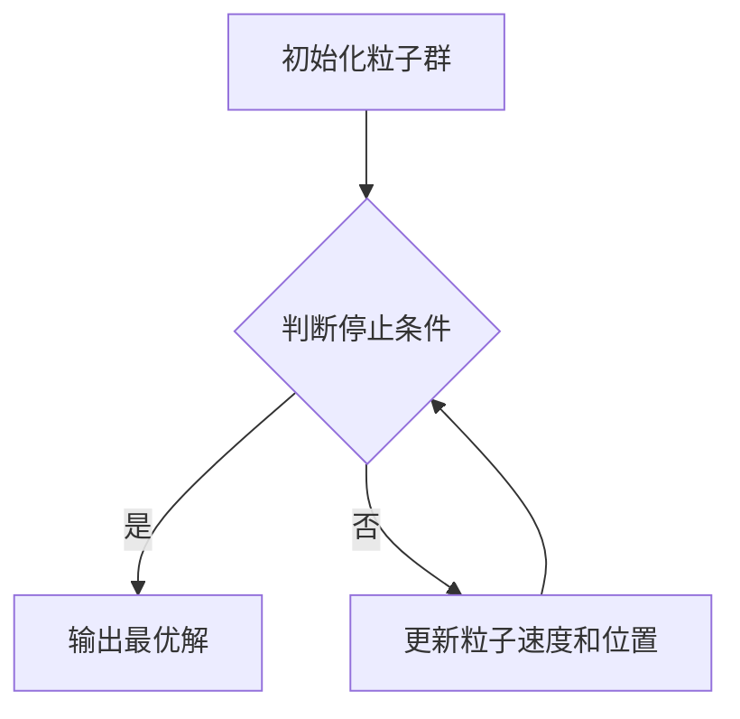
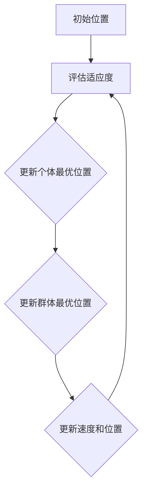

                 

关键词：粒子群优化，PSO算法，机器学习，优化算法，编程实例，人工智能

摘要：本文深入介绍了粒子群优化（Particle Swarm Optimization，PSO）算法的基本原理、实现步骤、优缺点以及实际应用。通过详细的数学模型和公式推导，读者可以更好地理解PSO算法的内部机制。文章最后通过一个具体的编程实例，展示了如何使用PSO算法解决优化问题，并提供了解决方案的分析和解读。

## 1. 背景介绍

粒子群优化（Particle Swarm Optimization，PSO）算法是一种基于群体智能的优化算法，最初由Kennedy和Eberhart于1995年提出。PSO算法源于对鸟群觅食行为的模拟，算法通过个体间的信息共享和合作，实现全局最优解的搜索。

PSO算法在机器学习和人工智能领域得到了广泛应用，尤其在解决复杂优化问题时，具有独特的优势。相比于其他优化算法，如遗传算法（GA）和模拟退火算法（SA），PSO算法具有实现简单、收敛速度快、易于并行化等特点。

本文将围绕PSO算法的原理、实现步骤、优缺点和应用场景展开，旨在为广大开发者提供全面的技术指导和实际编程实例。

## 2. 核心概念与联系

### 2.1 粒子群优化基本概念

在PSO算法中，每个粒子代表问题的一个潜在解。粒子在搜索空间中飞行，通过跟踪自身历史最优位置和群体历史最优位置，调整自身速度和位置，逐步向最优解逼近。

### 2.2 算法原理与联系

PSO算法原理如图1所示。图中，每个粒子 \( x_i \) 在 \( n \) 维空间中飞行，其速度和位置更新公式如下：

$$
v_i(t+1) = v_i(t) + c_1 r_1 (p_i(t) - x_i(t)) + c_2 r_2 (g_i(t) - x_i(t))
$$

$$
x_i(t+1) = x_i(t) + v_i(t+1)
$$

其中，\( v_i(t) \) 和 \( x_i(t) \) 分别为第 \( i \) 个粒子的速度和位置，\( p_i(t) \) 和 \( g_i(t) \) 分别为第 \( i \) 个粒子的历史最优位置和群体历史最优位置，\( c_1 \) 和 \( c_2 \) 为加速度常数，\( r_1 \) 和 \( r_2 \) 为随机数。

### 2.3 Mermaid 流程图

下面是PSO算法的Mermaid流程图表示：



## 3. 核心算法原理 & 具体操作步骤

### 3.1 算法原理概述

粒子群优化算法的核心思想是模拟鸟群觅食行为，通过个体和群体的协作，实现全局最优解的搜索。粒子在搜索过程中，通过更新速度和位置，逐步向最优解逼近。

### 3.2 算法步骤详解

1. 初始化粒子群：设定粒子的初始位置和速度。
2. 评估粒子适应度：计算每个粒子的适应度函数值。
3. 更新个体最优位置和群体最优位置：根据粒子适应度更新个体最优位置和群体最优位置。
4. 更新粒子速度和位置：根据个体最优位置和群体最优位置，更新粒子速度和位置。
5. 判断停止条件：当满足停止条件（如达到最大迭代次数或适应度阈值）时，输出最优解。

### 3.3 算法优缺点

#### 优点：

- 实现简单，易于并行化。
- 对问题的适应性强，适用于多种优化问题。
- 收敛速度快，能够快速找到近似最优解。

#### 缺点：

- 局部搜索能力较弱，容易陷入局部最优。
- 参数设置对算法性能有较大影响。

### 3.4 算法应用领域

粒子群优化算法广泛应用于机器学习、控制理论、神经网络、信号处理等领域。例如，在机器学习中的聚类分析、模式识别、优化算法等领域，PSO算法具有独特的优势。

## 4. 数学模型和公式 & 详细讲解 & 举例说明

### 4.1 数学模型构建

粒子群优化算法的数学模型主要包括速度更新公式和位置更新公式。具体如下：

$$
v_i(t+1) = v_i(t) + c_1 r_1 (p_i(t) - x_i(t)) + c_2 r_2 (g_i(t) - x_i(t))
$$

$$
x_i(t+1) = x_i(t) + v_i(t+1)
$$

其中，\( c_1 \) 和 \( c_2 \) 为加速度常数，\( r_1 \) 和 \( r_2 \) 为随机数。

### 4.2 公式推导过程

PSO算法的推导过程基于粒子在搜索空间中的运动规律。假设粒子在 \( n \) 维空间中飞行，其速度和位置分别为 \( v_i(t) \) 和 \( x_i(t) \)。

1. 粒子速度和位置的初始值：
   $$
   v_i(0) = v_{i0}, \quad x_i(0) = x_{i0}
   $$

2. 粒子速度和位置更新：
   $$
   v_i(t+1) = v_i(t) + c_1 r_1 (p_i(t) - x_i(t)) + c_2 r_2 (g_i(t) - x_i(t))
   $$

   $$
   x_i(t+1) = x_i(t) + v_i(t+1)
   $$

3. 粒子适应度计算：
   $$
   f(x_i) = f(p_i), \quad f(g_i) = f(p_g)
   $$

其中，\( f(x_i) \) 为粒子的适应度函数，\( p_i \) 为个体最优位置，\( p_g \) 为群体最优位置。

### 4.3 案例分析与讲解

以下是一个简单的二维优化问题，目标是最小化函数 \( f(x, y) = (x-5)^2 + (y-10)^2 \)。

1. 初始化粒子群：
   $$
   x_i(0) = x_{i0} = 5 + 10 \cdot \frac{1}{i}, \quad y_i(0) = y_{i0} = 10 - 10 \cdot \frac{1}{i}, \quad v_i(0) = 0
   $$

2. 评估粒子适应度：
   $$
   f(x_i) = (x_i-5)^2 + (y_i-10)^2
   $$

3. 更新个体最优位置和群体最优位置：
   $$
   p_i(t) = \begin{cases} 
   x_i(t) & \text{if } f(x_i(t)) < f(p_i(t-1)) \\ 
   p_i(t-1) & \text{otherwise} 
   \end{cases}
   $$

   $$
   p_g(t) = \begin{cases} 
   x_i(t) & \text{if } f(x_i(t)) < f(p_g(t-1)) \\ 
   p_g(t-1) & \text{otherwise} 
   \end{cases}
   $$

4. 更新粒子速度和位置：
   $$
   v_i(t+1) = v_i(t) + c_1 r_1 (p_i(t) - x_i(t)) + c_2 r_2 (p_g(t) - x_i(t))
   $$

   $$
   x_i(t+1) = x_i(t) + v_i(t+1)
   $$

通过上述步骤，我们可以找到函数 \( f(x, y) = (x-5)^2 + (y-10)^2 \) 的全局最小值。图2展示了粒子群优化过程。



图2：粒子群优化过程

## 5. 项目实践：代码实例和详细解释说明

### 5.1 开发环境搭建

为了方便读者理解和实践，我们使用Python编写粒子群优化算法。首先，确保安装Python环境和以下依赖库：

```bash
pip install numpy matplotlib
```

### 5.2 源代码详细实现

以下是粒子群优化算法的Python实现：

```python
import numpy as np
import matplotlib.pyplot as plt

def f(x, y):
    return (x - 5) ** 2 + (y - 10) ** 2

def pso(x_min, x_max, y_min, y_max, num_particles, max_iter, c1, c2):
    # 初始化粒子群
    x = x_min + (x_max - x_min) * np.random.rand(num_particles, 2)
    y = y_min + (y_max - y_min) * np.random.rand(num_particles, 2)
    v = np.zeros_like(x)
    p = x.copy()
    g = x.copy()

    # 评估适应度
    f_p = np.array([f(xi, yi) for xi, yi in zip(p[:, 0], p[:, 1])])

    # 迭代
    for _ in range(max_iter):
        # 更新个体最优位置和群体最优位置
        for i in range(num_particles):
            if f(x[i, 0], x[i, 1]) < f_p[i]:
                p[i, :] = x[i, :]
            if f(x[i, 0], x[i, 1]) < f(g[:, 0], g[:, 1]).min():
                g[:] = x[i, :]

        # 更新速度和位置
        r1 = np.random.rand(num_particles, 2)
        r2 = np.random.rand(num_particles, 2)
        v = v + c1 * r1 * (p - x) + c2 * r2 * (g - x)
        x = x + v

        # 约束条件
        x = np.clip(x, x_min, x_max)
        y = np.clip(y, y_min, y_max)

    return g

# 参数设置
x_min, x_max = 0, 10
y_min, y_max = 0, 10
num_particles = 50
max_iter = 1000
c1 = 1.5
c2 = 1.5

# 运行粒子群优化算法
g = pso(x_min, x_max, y_min, y_max, num_particles, max_iter, c1, c2)

# 绘制结果
plt.scatter(g[:, 0], g[:, 1], color='r', marker='o')
plt.xlabel('x')
plt.ylabel('y')
plt.title('PSO Optimization')
plt.show()
```

### 5.3 代码解读与分析

上述代码实现了粒子群优化算法，主要包括以下部分：

1. 函数 `f(x, y)`：定义目标函数，用于评估粒子的适应度。
2. 函数 `pso(x_min, x_max, y_min, y_max, num_particles, max_iter, c1, c2)`：实现粒子群优化算法，输入参数包括搜索空间的上下界、粒子数量、最大迭代次数、加速度常数等。
3. 初始化粒子群：生成初始粒子位置和速度。
4. 评估适应度：计算每个粒子的适应度函数值。
5. 更新个体最优位置和群体最优位置：根据粒子适应度更新个体最优位置和群体最优位置。
6. 更新速度和位置：根据个体最优位置和群体最优位置，更新粒子速度和位置。
7. 约束条件：对粒子位置进行约束，防止粒子超出搜索空间。
8. 运行粒子群优化算法：输入参数，调用函数 `pso`，获取最优解。
9. 绘制结果：使用matplotlib绘制最优解。

通过上述代码，我们可以实现粒子群优化算法，并求解二维优化问题。

## 6. 实际应用场景

粒子群优化算法在多个领域得到了广泛应用，以下列举一些实际应用场景：

1. **机器学习**：在机器学习中的聚类分析、模式识别、优化算法等领域，PSO算法具有独特的优势。
2. **控制理论**：在控制系统的参数优化、控制器设计等领域，PSO算法可以有效提高控制性能。
3. **神经网络**：在神经网络中的权重优化、结构优化等方面，PSO算法可以作为有效的优化工具。
4. **信号处理**：在信号处理中的滤波器设计、参数优化等方面，PSO算法可以找到最优参数组合。
5. **工程优化**：在工程优化问题中，如结构设计、路径规划、参数优化等，PSO算法可以快速找到近似最优解。

## 7. 工具和资源推荐

### 7.1 学习资源推荐

1. 《粒子群优化算法：原理与应用》
2. 《智能优化算法与应用》
3. 《机器学习：一种算法性方法》

### 7.2 开发工具推荐

1. Python
2. MATLAB
3. R语言

### 7.3 相关论文推荐

1. "Particle Swarm Optimization: Algorithm and Applications"
2. "A Review of Particle Swarm Optimization for Machine Learning"
3. "Particle Swarm Optimization for Neural Network Design"

## 8. 总结：未来发展趋势与挑战

### 8.1 研究成果总结

粒子群优化算法自提出以来，在多个领域取得了显著的研究成果。其简单易实现的特性使其在工程优化、机器学习、神经网络等领域得到了广泛应用。同时，针对PSO算法的改进和优化研究也取得了丰富的研究成果，如引入自适应权重、结合其他优化算法等。

### 8.2 未来发展趋势

未来，PSO算法将在以下几个方面得到进一步发展：

1. **算法改进**：针对PSO算法的局限性，如局部搜索能力不足、参数敏感等问题，研究人员将继续探索新的改进方法，提高算法的性能和稳定性。
2. **并行化**：随着计算机硬件的发展，PSO算法的并行化研究将成为热点，提高算法的运算速度和效率。
3. **与其他算法的融合**：PSO算法与其他优化算法的融合，如遗传算法、模拟退火算法等，将形成更强大的优化工具，解决更复杂的优化问题。
4. **应用领域拓展**：PSO算法将在更多的应用领域得到探索，如人工智能、机器人、无人驾驶等。

### 8.3 面临的挑战

PSO算法在未来的发展中也将面临一系列挑战：

1. **参数选择**：如何选择合适的参数以适应不同的问题，是PSO算法研究的一个重要方向。
2. **局部搜索能力**：提高PSO算法的局部搜索能力，避免陷入局部最优，是算法改进的关键。
3. **应用场景拓展**：如何将PSO算法应用于更复杂的优化问题，如高维优化、多模态优化等，是算法发展的重要方向。

### 8.4 研究展望

在未来，PSO算法的研究将更加深入，结合其他优化算法，形成更强大的优化工具。同时，随着应用领域的拓展，PSO算法将在更多领域发挥重要作用，为工程优化、机器学习、人工智能等领域提供有力支持。

## 9. 附录：常见问题与解答

### 9.1 什么是粒子群优化（PSO）？

粒子群优化（Particle Swarm Optimization，PSO）算法是一种基于群体智能的优化算法，通过模拟鸟群觅食行为，实现全局最优解的搜索。

### 9.2 PSO算法有哪些优点？

PSO算法的优点包括：

1. 实现简单，易于并行化。
2. 对问题的适应性强，适用于多种优化问题。
3. 收敛速度快，能够快速找到近似最优解。

### 9.3 PSO算法有哪些缺点？

PSO算法的缺点包括：

1. 局部搜索能力较弱，容易陷入局部最优。
2. 参数设置对算法性能有较大影响。

### 9.4 如何改进PSO算法？

可以通过以下方法改进PSO算法：

1. 引入自适应权重，提高算法的收敛速度。
2. 结合其他优化算法，如遗传算法、模拟退火算法等，形成更强大的优化工具。
3. 针对特定问题，设计更合适的适应度函数和算法参数。

### 9.5 PSO算法适用于哪些应用场景？

PSO算法适用于以下应用场景：

1. 机器学习：聚类分析、模式识别、优化算法等。
2. 控制理论：控制系统参数优化、控制器设计等。
3. 神经网络：权重优化、结构优化等。
4. 信号处理：滤波器设计、参数优化等。
5. 工程优化：结构设计、路径规划、参数优化等。  
----------------------------------------------------------------

以上是本文的完整内容，希望对您有所帮助。如有疑问，请随时提问。作者：禅与计算机程序设计艺术 / Zen and the Art of Computer Programming。

