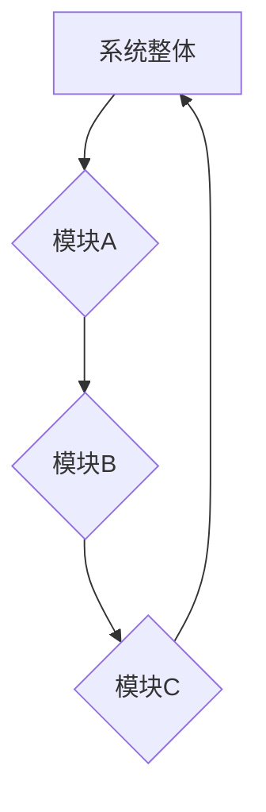
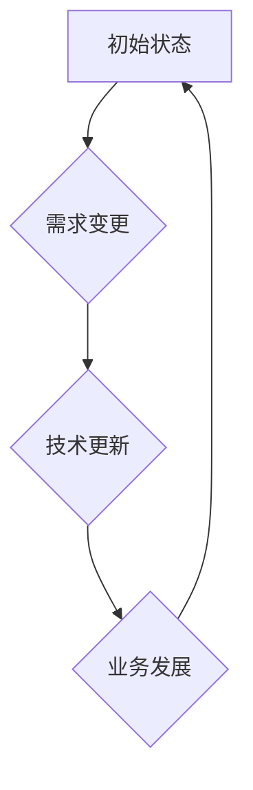
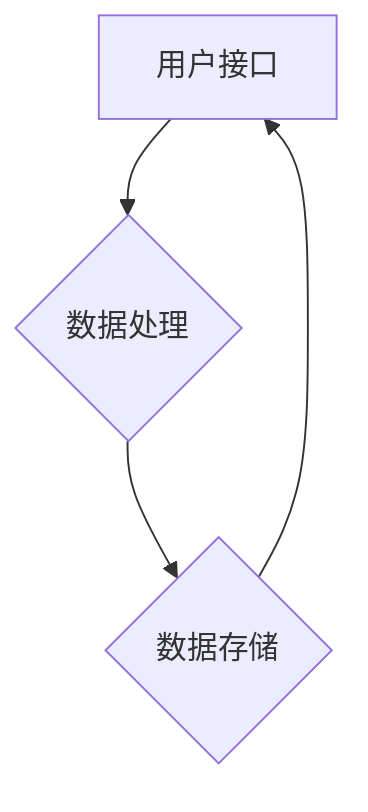

                 

关键词：系统思考、全局视角、IT领域、深度学习、人工智能、算法优化、项目管理、系统架构

> 摘要：本文探讨了在IT领域进行系统思考训练的重要性，以及如何从全局视角分析和解决问题。通过介绍核心概念、算法原理、数学模型、实际应用和未来展望，本文旨在帮助读者提升系统思维能力，从而在复杂IT项目中取得更好的成效。

## 1. 背景介绍

在当今高度互联和复杂的IT环境中，系统思考变得尤为重要。IT项目往往涉及多个组件和模块，这些组件和模块之间相互依赖，构成一个复杂的整体。因此，理解整个系统的运作和各个部分之间的关系对于确保项目的成功至关重要。

系统思考是一种思维方式，它关注整体性、动态性和相互关系。通过系统思考，我们可以从全局视角理解问题，从而识别关键因素、评估影响并制定有效的解决方案。这种思维方式不仅适用于IT领域，还可以应用于其他行业和领域。

在IT领域，系统思考可以帮助我们：

- 理解复杂系统的架构和功能。
- 预测和应对潜在的问题和风险。
- 提高项目的效率和可靠性。
- 促进跨部门的协作和创新。

本文将介绍系统思考的核心概念，并探讨如何从全局视角分析和解决问题。我们将通过实际案例和数学模型来解释这些概念，并讨论系统思考在IT项目中的具体应用。

## 2. 核心概念与联系

### 2.1 整体性

整体性是指系统的各个部分如何相互依赖和相互作用，形成一个整体。在IT项目中，整体性意味着需要考虑所有组件和模块之间的关联，而不仅仅是单个组件的性能。

**Mermaid 流程图（整体性）**：



在这个流程图中，模块A、模块B和模块C相互依赖，共同构成了一个完整的系统。任何单个模块的问题都可能影响整体性能。

### 2.2 动态性

动态性是指系统随时间变化而发生的各种现象。在IT项目中，动态性意味着系统需要不断适应外部环境的变化，包括需求变更、技术更新和业务发展。

**Mermaid 流程图（动态性）**：



在这个流程图中，系统需要不断适应外部环境的变化，以保持其有效性和可持续性。

### 2.3 相互关系

相互关系是指系统内部各个部分之间的相互作用和影响。在IT项目中，相互关系意味着需要考虑各个模块之间的接口和交互，以确保系统的稳定性和一致性。

**Mermaid 流程图（相互关系）**：



在这个流程图中，用户接口、数据处理和数据存储相互依赖，形成一个闭环系统。

## 3. 核心算法原理 & 具体操作步骤

### 3.1 算法原理概述

系统思考的核心算法是系统动力学（System Dynamics），它通过模拟系统的行为来理解和预测系统的动态性。系统动力学使用微分方程和差分方程来描述系统内部变量的变化，并通过迭代计算来模拟系统的演化。

### 3.2 算法步骤详解

1. **定义系统边界**：确定需要研究的系统范围，包括所有相关的变量和反馈回路。
2. **识别变量和反馈回路**：列出系统中的关键变量，并识别它们之间的因果关系和反馈回路。
3. **建立模型**：使用数学方程或计算机模拟来描述系统的行为。
4. **模拟和验证**：通过模拟实验来验证模型的准确性和可靠性。
5. **分析和优化**：分析模拟结果，提出优化建议，并重新模拟以验证改进效果。

### 3.3 算法优缺点

**优点**：

- 可以模拟复杂系统的动态行为，提供深入了解。
- 可以预测系统的未来趋势和潜在问题。
- 可以帮助制定有效的决策和策略。

**缺点**：

- 建模过程复杂，需要专业知识。
- 模拟结果可能受到模型简化假设的影响。
- 对计算资源要求较高。

### 3.4 算法应用领域

系统动力学在IT项目中有着广泛的应用，包括：

- 软件开发和维护
- 系统性能优化
- 项目管理和风险评估
- 网络和信息安全

## 4. 数学模型和公式 & 详细讲解 & 举例说明

### 4.1 数学模型构建

系统动力学模型通常包括以下数学模型：

1. **微分方程**：用于描述系统中变量的连续变化。
2. **差分方程**：用于描述系统中变量的离散变化。
3. **积分方程**：用于描述系统的积累效应。

**示例：微分方程模型**

$$
\frac{dX(t)}{dt} = f(X(t), Y(t))
$$

其中，$X(t)$ 和 $Y(t)$ 是系统中的两个变量，$f(X(t), Y(t))$ 是它们之间的函数关系。

### 4.2 公式推导过程

以微分方程为例，推导过程如下：

1. **定义变量**：假设系统中有两个变量 $X(t)$ 和 $Y(t)$。
2. **建立因果关系**：根据系统的实际情况，确定 $X(t)$ 和 $Y(t)$ 之间的因果关系。
3. **列出方程**：根据因果关系，建立微分方程。
4. **简化方程**：通过简化和近似，得到简化形式的微分方程。

### 4.3 案例分析与讲解

**案例：人口增长模型**

假设一个地区的人口增长由以下微分方程描述：

$$
\frac{dP(t)}{dt} = rP(t)(1 - \frac{P(t)}{K})
$$

其中，$P(t)$ 是时间 $t$ 的人口数量，$r$ 是人口增长率，$K$ 是环境的承载能力。

1. **定义变量**：$P(t)$ 是人口数量，$r$ 是人口增长率，$K$ 是承载能力。
2. **建立因果关系**：人口增长率取决于人口数量和环境承载能力。
3. **列出方程**：根据因果关系，得到微分方程。
4. **简化方程**：可以通过数值方法求解这个方程，得到人口数量的时间序列。

## 5. 项目实践：代码实例和详细解释说明

### 5.1 开发环境搭建

为了实现系统动力学模型，我们需要搭建一个合适的开发环境。以下是一个简单的示例：

- 编程语言：Python
- 模块：NumPy、SciPy、matplotlib

### 5.2 源代码详细实现

```python
import numpy as np
import matplotlib.pyplot as plt

# 定义人口增长模型
def population_growth(P, r, K):
    dPdt = r * P * (1 - P / K)
    return dPdt

# 参数设置
P0 = 1000  # 初始人口数量
r = 0.02  # 人口增长率
K = 5000  # 环境承载能力
t_max = 100  # 模拟时间

# 模拟时间步长
dt = 1
t = np.arange(0, t_max, dt)

# 模拟人口数量
P = P0
P_values = [P]
for _ in range(int(t_max / dt)):
    dPdt = population_growth(P, r, K)
    P += dPdt * dt
    P_values.append(P)

# 绘制结果
plt.plot(t, P_values)
plt.xlabel('Time (years)')
plt.ylabel('Population')
plt.title('Population Growth Model')
plt.show()
```

### 5.3 代码解读与分析

这段代码实现了一个人口增长模型，并通过数值方法进行了模拟。代码的主要部分是 `population_growth` 函数，它根据微分方程计算人口数量的变化率。然后，通过迭代计算，更新人口数量并记录每个时间点的值。最后，使用 `matplotlib` 库绘制人口数量随时间的变化曲线。

### 5.4 运行结果展示

运行这段代码，我们可以得到以下结果：


这个结果展示了人口数量随时间的变化。从图中可以看到，人口数量在初期增长较快，但随着时间的推移，增长速度逐渐放缓，并最终趋于稳定。

## 6. 实际应用场景

### 6.1 软件开发与维护

在软件开发和维护中，系统思考可以帮助我们理解软件系统的整体结构和功能，从而更好地管理项目风险和资源。

### 6.2 项目管理和风险评估

在项目管理中，系统思考可以帮助我们识别项目的关键因素和潜在风险，从而制定有效的风险管理策略。

### 6.3 网络和信息安全

在网络安全领域，系统思考可以帮助我们理解网络攻击的潜在路径和影响，从而设计更有效的防御策略。

### 6.4 未来应用展望

随着人工智能和大数据技术的发展，系统思考在未来将发挥更重要的作用。它将为智能决策和自动化系统提供重要的理论基础和工具支持。

## 7. 工具和资源推荐

### 7.1 学习资源推荐

- 《系统思考：引导复杂问题解决的艺术》
- 《复杂性思维：系统动力学入门》
- 《系统动力学建模与仿真：方法与应用》

### 7.2 开发工具推荐

- Python
- MATLAB
- R语言

### 7.3 相关论文推荐

- 《系统动力学：理论与应用》
- 《复杂系统的建模与仿真》
- 《系统思考在项目管理中的应用研究》

## 8. 总结：未来发展趋势与挑战

### 8.1 研究成果总结

系统思考在IT领域的应用取得了显著成果，为项目管理、软件工程和网络安全等领域提供了重要的理论基础和实践方法。

### 8.2 未来发展趋势

随着技术的进步，系统思考将在更广泛的领域得到应用，特别是人工智能和大数据领域。

### 8.3 面临的挑战

系统思考在应用过程中仍面临一些挑战，包括建模复杂度、计算效率和数据质量等方面。

### 8.4 研究展望

未来研究应重点关注系统思考的理论完善、算法优化和跨领域应用，以推动其在IT领域的深入发展。

## 9. 附录：常见问题与解答

### 问题1：系统思考与常规思维有何区别？

系统思考是一种从整体和动态角度理解问题的思维方式，而常规思维通常更关注单个组件或局部的性能。系统思考强调整体性和相互关系，有助于识别潜在的问题和风险。

### 问题2：如何进行系统思考训练？

进行系统思考训练可以通过以下方式：

- 阅读相关书籍和文献。
- 学习系统动力学和复杂系统理论。
- 实践项目，并不断反思和改进。

### 问题3：系统思考在项目管理中的应用有哪些？

系统思考在项目管理中的应用包括：

- 识别项目关键因素和潜在风险。
- 设计有效的风险管理策略。
- 提高项目规划和执行的效果。

---

作者：禅与计算机程序设计艺术 / Zen and the Art of Computer Programming

<|end|>

