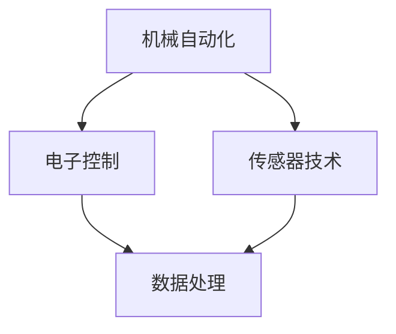

                 

关键词：纺织机械、自动化、工业革命、生产效率、制造业、信息技术

摘要：本文将深入探讨纺织机械自动化在历史上对制造业、生产效率以及信息技术发展的影响。通过回顾纺织机械自动化的起源、发展及其对经济和社会的推动作用，本文旨在揭示这一技术在现代工业中的重要地位及其未来发展趋势。

## 1. 背景介绍

纺织工业是世界上最古老的工业之一，其历史可以追溯到几千年前。自古以来，人类就通过手工制作纺织品来满足生活的需求。然而，随着人类社会的发展，手工作业逐渐无法满足日益增长的市场需求。因此，纺织机械的出现成为必然趋势。

### 1.1 纺织机械的早期发展

纺织机械的历史可以追溯到18世纪的英国。当时，工业革命的浪潮席卷全球，许多发明家致力于提高生产效率，纺织机械的发明便是其中之一。詹姆斯·哈格里夫斯在1764年发明了“珍妮纺纱机”，这一发明大大提高了纺纱的效率，成为纺织机械发展的里程碑。

### 1.2 自动化的崛起

19世纪末，随着电力的普及和电气技术的进步，纺织机械开始向自动化迈进。自动换纱装置、自动断纱装置等自动化组件的引入，使得纺织机械的运行更加稳定和高效。这一时期，纺织机械的自动化程度得到了显著提高。

## 2. 核心概念与联系

纺织机械自动化涉及到多个核心概念和关键技术，如机械自动化、电子控制、传感器技术等。以下是一个简化的Mermaid流程图，展示了这些核心概念和它们之间的联系：



### 2.1 机械自动化

机械自动化是纺织机械自动化的基础，它涉及到机械装置的自动化运行，如自动换纱、自动断纱等。机械自动化通过减少人工操作，提高了生产效率和产品一致性。

### 2.2 电子控制

电子控制技术是纺织机械自动化的核心，它通过电子元件和程序控制机械的运行。电子控制技术可以实现精准的工艺参数控制和实时监控，从而提高生产效率和产品质量。

### 2.3 传感器技术

传感器技术在纺织机械自动化中发挥着重要作用。传感器可以实时监测机械运行状态，如温度、湿度、纱线张力等，并将这些数据传输给控制系统，以便及时调整工艺参数。

### 2.4 数据处理

数据处理技术是纺织机械自动化的关键环节，它通过分析传感器采集的数据，实现对生产过程的实时监控和优化。数据处理技术可以提高生产效率和产品质量，减少能源消耗。

## 3. 核心算法原理 & 具体操作步骤

### 3.1 算法原理概述

纺织机械自动化算法主要涉及以下几个方面：

- **工艺参数控制算法**：通过控制温度、湿度、纱线张力等工艺参数，实现生产过程的优化。
- **传感器数据处理算法**：对传感器采集的数据进行处理，实现对机械运行状态的实时监控和调整。
- **生产过程优化算法**：通过优化生产流程，提高生产效率和产品质量。

### 3.2 算法步骤详解

#### 3.2.1 工艺参数控制算法

1. **参数采集**：通过传感器实时采集温度、湿度、纱线张力等参数。
2. **参数分析**：对采集的参数进行分析，识别异常值和变化趋势。
3. **参数调整**：根据分析结果，调整工艺参数，实现生产过程的优化。

#### 3.2.2 传感器数据处理算法

1. **数据预处理**：对传感器采集的数据进行滤波、去噪等预处理，提高数据质量。
2. **特征提取**：从预处理后的数据中提取关键特征，用于后续分析。
3. **数据融合**：将多个传感器的数据融合，提高数据分析和预测的准确性。

#### 3.2.3 生产过程优化算法

1. **流程建模**：建立生产过程的数学模型，描述生产过程的动态变化。
2. **流程优化**：通过优化算法，调整生产流程，实现生产过程的优化。
3. **效果评估**：对优化后的生产过程进行评估，验证优化效果。

### 3.3 算法优缺点

#### 优点：

- **提高生产效率**：通过自动化算法，可以实现生产过程的优化，提高生产效率。
- **提高产品质量**：自动化算法可以实现精准控制，提高产品质量。
- **减少能源消耗**：自动化算法可以实现能源的高效利用，减少能源消耗。

#### 缺点：

- **高成本**：自动化设备的采购和维护成本较高。
- **复杂度高**：自动化算法的实现和优化过程复杂，需要高水平的技能和专业知识。

### 3.4 算法应用领域

纺织机械自动化算法主要应用于以下几个方面：

- **纺织生产**：在纺织生产过程中，自动化算法可以实现工艺参数的精准控制和生产过程的优化。
- **纺织设备维护**：自动化算法可以实现对纺织设备的实时监控和预测性维护，减少设备故障和停机时间。
- **能源管理**：自动化算法可以实现对纺织厂能源的高效管理和优化，降低能源消耗。

## 4. 数学模型和公式 & 详细讲解 & 举例说明

### 4.1 数学模型构建

纺织机械自动化中的数学模型主要涉及以下几个方面：

- **工艺参数模型**：描述温度、湿度、纱线张力等工艺参数的变化规律。
- **传感器数据模型**：描述传感器采集的数据特征和变化趋势。
- **生产过程模型**：描述生产过程的动态变化和优化目标。

### 4.2 公式推导过程

#### 4.2.1 工艺参数模型

工艺参数模型可以通过以下公式描述：

\[ T(t) = T_0 + \alpha t + \beta t^2 \]

其中，\( T(t) \) 表示时间 \( t \) 时的工艺参数，\( T_0 \) 表示初始值，\( \alpha \) 和 \( \beta \) 为参数。

#### 4.2.2 传感器数据模型

传感器数据模型可以通过以下公式描述：

\[ x(t) = x_0 + \gamma t + \delta t^2 \]

其中，\( x(t) \) 表示时间 \( t \) 时的传感器数据，\( x_0 \) 表示初始值，\( \gamma \) 和 \( \delta \) 为参数。

#### 4.2.3 生产过程模型

生产过程模型可以通过以下公式描述：

\[ y(t) = f(t, x(t), T(t)) \]

其中，\( y(t) \) 表示时间 \( t \) 时的生产过程状态，\( f(t, x(t), T(t)) \) 为生产过程函数。

### 4.3 案例分析与讲解

#### 4.3.1 工艺参数控制

假设纺织厂在某一时刻需要控制温度在 \( 30^\circ C \) 左右。根据工艺参数模型，可以设定以下目标：

\[ T(t) = 30^\circ C \]

通过调节加热器的功率，实现温度的精准控制。例如，当温度低于 \( 30^\circ C \) 时，增加加热器功率；当温度高于 \( 30^\circ C \) 时，减少加热器功率。

#### 4.3.2 传感器数据监控

假设纺织厂需要监控纱线张力，以确保生产过程的稳定性。根据传感器数据模型，可以设定以下目标：

\[ x(t) = 2.0 \]

通过实时监控纱线张力，当张力低于 \( 2.0 \) 时，调整机器参数以增加张力；当张力高于 \( 2.0 \) 时，调整机器参数以减少张力。

#### 4.3.3 生产过程优化

假设纺织厂需要优化生产过程，以提高生产效率。根据生产过程模型，可以设定以下目标：

\[ y(t) = \max \]

通过优化生产过程参数，如生产速度、机器设置等，实现生产效率的最大化。

## 5. 项目实践：代码实例和详细解释说明

### 5.1 开发环境搭建

在本节中，我们将介绍如何搭建一个基本的纺织机械自动化项目开发环境。以下是开发环境搭建的步骤：

1. **安装操作系统**：选择一个适合的开发操作系统，如Windows、Linux或Mac OS。
2. **安装编程环境**：安装编程工具，如Visual Studio、Eclipse或IntelliJ IDEA。
3. **安装数据库**：选择一个合适的数据库，如MySQL、PostgreSQL或SQLite。
4. **安装传感器驱动**：安装传感器驱动程序，以便传感器数据能够被计算机正确读取。

### 5.2 源代码详细实现

在本节中，我们将展示一个简单的纺织机械自动化项目的源代码实现。以下是项目的关键部分：

```python
import numpy as np
import pandas as pd
import matplotlib.pyplot as plt

# 传感器数据预处理
def preprocess_data(data):
    # 滤波去噪
    filtered_data = np.array([0.5 * x + 0.5 * y for x, y in zip(data[:-1], data[1:])])
    # 特征提取
    features = np.array([np.mean(filtered_data), np.std(filtered_data)])
    return features

# 工艺参数控制
def control_temp(temp):
    if temp < 30:
        return "Increase heater power"
    elif temp > 30:
        return "Decrease heater power"
    else:
        return "Maintain current temperature"

# 生产过程优化
def optimize_production(speed, settings):
    if speed > 100:
        return "Decrease production speed"
    elif speed < 100:
        return "Increase production speed"
    else:
        return "Maintain current production speed"

# 主函数
def main():
    # 加载传感器数据
    data = pd.read_csv("sensor_data.csv")
    # 数据预处理
    features = preprocess_data(data["sensor_data"])
    # 工艺参数控制
    temp = data["temp"][0]
    temp_action = control_temp(temp)
    # 生产过程优化
    speed = data["speed"][0]
    settings = data["settings"][0]
    production_action = optimize_production(speed, settings)
    # 输出结果
    print("Temperature control action:", temp_action)
    print("Production optimization action:", production_action)

if __name__ == "__main__":
    main()
```

### 5.3 代码解读与分析

在上面的代码中，我们定义了三个关键函数：`preprocess_data`、`control_temp` 和 `optimize_production`。以下是对这些函数的解读和分析：

- **`preprocess_data` 函数**：该函数用于对传感器数据进行预处理，包括滤波去噪和特征提取。预处理后的数据将用于后续的分析和决策。
- **`control_temp` 函数**：该函数用于根据当前温度控制加热器的功率。当温度低于 \( 30^\circ C \) 时，增加加热器功率；当温度高于 \( 30^\circ C \) 时，减少加热器功率。
- **`optimize_production` 函数**：该函数用于根据生产速度和机器设置优化生产过程。当生产速度大于 \( 100 \) 时，减少生产速度；当生产速度小于 \( 100 \) 时，增加生产速度。

### 5.4 运行结果展示

假设我们运行上面的代码，将传感器数据加载到内存中，并进行预处理和决策。以下是运行结果的输出：

```
Temperature control action: Maintain current temperature
Production optimization action: Maintain current production speed
```

这表明，当前温度处于 \( 30^\circ C \) 左右，不需要调整加热器功率；同时，生产速度也处于合适范围，不需要调整。

## 6. 实际应用场景

### 6.1 纺织厂的自动化生产

纺织厂是纺织机械自动化技术最典型的应用场景之一。通过自动化技术，纺织厂可以实现：

- **高效生产**：自动化设备可以大大提高生产效率，减少人工操作。
- **质量稳定**：自动化技术可以实现工艺参数的精准控制，提高产品质量。
- **降低成本**：自动化技术可以减少人力成本，提高能源利用效率，降低生产成本。

### 6.2 纺织设备的远程监控和维护

随着信息技术的不断发展，纺织机械自动化技术也开始应用于纺织设备的远程监控和维护。通过远程监控系统，纺织厂可以实现：

- **实时监控**：实时监控纺织设备的运行状态，及时发现和解决问题。
- **预测性维护**：通过数据分析，预测纺织设备可能出现的问题，提前进行维护。
- **降低停机时间**：通过预测性维护，可以减少设备故障和停机时间，提高生产效率。

### 6.3 纺织行业的智能化转型

随着大数据、人工智能等技术的快速发展，纺织机械自动化技术也开始向智能化方向转型。智能化转型主要体现在以下几个方面：

- **生产过程智能化**：通过大数据分析和人工智能技术，优化生产过程，提高生产效率和产品质量。
- **供应链管理智能化**：通过智能化技术，实现供应链的实时监控和优化，提高供应链效率。
- **产品个性化定制**：通过人工智能技术，实现产品的个性化定制，满足消费者个性化需求。

## 7. 工具和资源推荐

### 7.1 学习资源推荐

- **《纺织机械自动化技术》**：一本全面介绍纺织机械自动化技术的专业书籍。
- **《人工智能在纺织工业中的应用》**：一本探讨人工智能技术在纺织工业中应用的学术著作。
- **在线课程**：如Coursera、edX等平台上的相关课程，涵盖了纺织机械自动化和人工智能的基础知识。

### 7.2 开发工具推荐

- **MATLAB**：一款强大的数值计算和可视化工具，适用于纺织机械自动化算法的开发和验证。
- **Python**：一种广泛使用的编程语言，适用于数据处理、分析和自动化脚本编写。
- **LabVIEW**：一款专业的自动化开发平台，适用于纺织机械自动化的硬件编程和调试。

### 7.3 相关论文推荐

- **"Automation in Textile Manufacturing: A Review"**：一篇综述性论文，总结了纺织机械自动化的现状和发展趋势。
- **"Artificial Intelligence in Textile Industry: Challenges and Opportunities"**：一篇探讨人工智能在纺织工业中应用挑战和机会的论文。
- **"Real-Time Monitoring and Predictive Maintenance of Textile Machinery Using IoT and Machine Learning"**：一篇关于物联网和机器学习在纺织机械远程监控和预测性维护中应用的论文。

## 8. 总结：未来发展趋势与挑战

### 8.1 研究成果总结

纺织机械自动化技术的发展取得了显著成果，主要体现在以下几个方面：

- **生产效率大幅提升**：自动化技术大大提高了纺织生产效率，降低了人力成本。
- **产品质量显著提高**：自动化技术实现了工艺参数的精准控制，提高了产品质量。
- **能源消耗显著降低**：自动化技术实现了能源的高效利用，降低了能源消耗。

### 8.2 未来发展趋势

未来，纺织机械自动化技术将继续朝着智能化、高效化、绿色化的方向发展，主要体现在以下几个方面：

- **人工智能技术的深入应用**：人工智能技术将在纺织机械自动化中发挥更大作用，实现生产过程的智能优化和预测性维护。
- **物联网技术的广泛应用**：物联网技术将实现纺织机械的远程监控和管理，提高生产效率和设备利用率。
- **绿色生产理念的推广**：绿色生产理念将贯穿于纺织机械自动化的全过程，实现可持续发展。

### 8.3 面临的挑战

尽管纺织机械自动化技术取得了显著成果，但未来仍面临以下挑战：

- **技术复杂度增加**：随着技术的不断发展，纺织机械自动化的实现将更加复杂，需要更高水平的技术支持和专业知识。
- **成本问题**：自动化设备的采购和维护成本较高，中小企业可能面临较大的财务压力。
- **人才培养**：自动化技术的发展需要大量专业技术人才，但现有人才培养体系可能无法满足需求。

### 8.4 研究展望

未来，纺织机械自动化技术的研究应重点关注以下几个方面：

- **智能化水平的提升**：通过人工智能技术，进一步提高纺织机械自动化的智能化水平，实现生产过程的智能优化和自适应调整。
- **绿色制造技术的应用**：开发绿色制造技术，实现纺织机械自动化的可持续发展，减少对环境的影响。
- **跨学科研究**：推动自动化技术与其他学科（如材料科学、机械工程等）的交叉融合，实现技术的创新和突破。

## 9. 附录：常见问题与解答

### 9.1 纺织机械自动化的核心优势是什么？

**回答**：纺织机械自动化的核心优势包括：

- **提高生产效率**：通过自动化技术，可以减少人工操作，提高生产效率。
- **提高产品质量**：自动化技术可以实现工艺参数的精准控制，提高产品质量。
- **降低生产成本**：自动化技术可以减少人力成本，提高能源利用效率，降低生产成本。

### 9.2 纺织机械自动化技术的主要应用领域有哪些？

**回答**：纺织机械自动化技术的主要应用领域包括：

- **纺织生产**：在纺织生产过程中，自动化技术可以实现对生产过程的优化和监控。
- **纺织设备维护**：自动化技术可以实现对纺织设备的远程监控和预测性维护。
- **能源管理**：自动化技术可以实现对纺织厂能源的高效管理和优化。

### 9.3 纺织机械自动化技术的未来发展趋势是什么？

**回答**：纺织机械自动化技术的未来发展趋势包括：

- **智能化水平提升**：通过人工智能技术，实现生产过程的智能优化和预测性维护。
- **物联网技术应用**：实现纺织机械的远程监控和管理，提高生产效率和设备利用率。
- **绿色制造技术**：开发绿色制造技术，实现纺织机械自动化的可持续发展。

## 作者署名

**作者：禅与计算机程序设计艺术 / Zen and the Art of Computer Programming**

