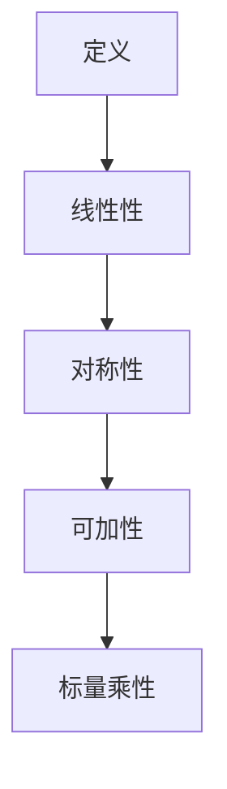

                 

### 关键词 Keywords

线性代数、双线性函数、矩阵计算、优化算法、数学建模、计算几何。

### 摘要 Abstract

本文旨在深入探讨线性代数中的双线性函数概念，通过清晰的逻辑和丰富的实例，解释其基本原理和应用。文章首先介绍了双线性函数的定义和特性，然后通过数学模型和具体操作步骤展示了其计算和应用。最后，文章讨论了双线性函数在实际应用场景中的未来展望，并提出了相关的学习资源和工具推荐。

## 1. 背景介绍

线性代数是现代数学和工程学中一个核心分支，其在计算机科学、物理学、经济学等领域有着广泛的应用。在众多线性代数概念中，双线性函数因其独特的性质和广泛的应用而备受关注。双线性函数是一种特殊的线性映射，它将两个向量映射到一个标量值，并在多个领域如优化算法、计算几何等领域发挥着重要作用。

双线性函数在数学和工程学中的重要性不言而喻。它不仅能够简化复杂问题的计算，还能够提供对问题本质的理解。例如，在优化问题中，双线性函数常常用于描述目标函数的性质，从而指导我们寻找最优解。在计算几何中，双线性函数则用于求解多个几何形状之间的关系，如求两个多面体的交点等。

本文将首先回顾一些基本的线性代数概念，如向量、矩阵和线性变换等，然后引入双线性函数的定义和性质。随后，我们将探讨双线性函数的计算方法和数学模型，并通过具体实例展示其应用。最后，我们将展望双线性函数在未来的发展趋势和面临的挑战。

### 2. 核心概念与联系

#### 2.1 向量和矩阵

在探讨双线性函数之前，我们需要了解一些基本的线性代数概念，如向量、矩阵和线性变换。向量是线性代数中的基本对象，它可以表示空间中的点或方向。矩阵则是向量的扩展，它由一系列的向量组成，可以表示线性变换。

向量可以用一个有序数组表示，如 \(\vec{v} = (v_1, v_2, \ldots, v_n)\)。矩阵可以用一个二维数组表示，如 \(A = \begin{bmatrix} a_{11} & a_{12} & \ldots & a_{1n} \\ a_{21} & a_{22} & \ldots & a_{2n} \\ \vdots & \vdots & \ddots & \vdots \\ a_{m1} & a_{m2} & \ldots & a_{mn} \end{bmatrix}\)。

线性变换是将一个向量空间映射到另一个向量空间的一种变换。矩阵可以表示线性变换，具体来说，如果有一个矩阵 \(A\) 和一个向量 \(\vec{v}\)，那么矩阵 \(A\) 和向量 \(\vec{v}\) 的乘积 \(A\vec{v}\) 就表示对向量 \(\vec{v}\) 进行线性变换的结果。

#### 2.2 线性函数和双线性函数

在线性代数中，线性函数是一种特殊的映射，它将一个向量映射到一个标量值。线性函数通常表示为 \(f(\vec{v}) = \vec{a} \cdot \vec{v}\)，其中 \(\vec{a}\) 是一个常数向量，\(\vec{v}\) 是输入向量，\(\cdot\) 表示向量的内积。

双线性函数则是一种更一般的线性映射，它将两个向量映射到一个标量值。双线性函数通常表示为 \(g(\vec{u}, \vec{v}) = \vec{b} \cdot \vec{u} + \vec{c} \cdot \vec{v}\)，其中 \(\vec{b}\) 和 \(\vec{c}\) 是常数向量，\(\vec{u}\) 和 \(\vec{v}\) 是输入向量。

#### 2.3 双线性函数的特性

双线性函数具有以下特性：

1. **线性性**：双线性函数对每个变量都是线性的，即对于任意常数 \(k\)，有 \(g(k\vec{u}, \vec{v}) = k g(\vec{u}, \vec{v})\) 和 \(g(\vec{u}, k\vec{v}) = k g(\vec{u}, \vec{v})\)。

2. **对称性**：双线性函数满足交换律，即 \(g(\vec{u}, \vec{v}) = g(\vec{v}, \vec{u})\)。

3. **可加性**：双线性函数对向量是可加的，即 \(g(\vec{u} + \vec{u'}, \vec{v}) = g(\vec{u}, \vec{v}) + g(\vec{u'}, \vec{v})\) 和 \(g(\vec{u}, \vec{v} + \vec{v'}) = g(\vec{u}, \vec{v}) + g(\vec{u}, \vec{v'})\)。

4. **标量乘性**：双线性函数对输入向量的标量乘法是可分配的，即 \(g(k\vec{u}, \vec{v}) = k g(\vec{u}, \vec{v})\) 和 \(g(\vec{u}, k\vec{v}) = k g(\vec{u}, \vec{v})\)。

这些特性使得双线性函数在许多应用中具有广泛的应用。

### 2.4 双线性函数的 Mermaid 流程图



通过以上流程图，我们可以清晰地看到双线性函数的基本特性和联系。接下来，我们将深入探讨双线性函数的计算方法和应用。

### 3. 核心算法原理 & 具体操作步骤

#### 3.1 算法原理概述

双线性函数的计算主要包括以下几个步骤：

1. **向量输入**：首先，我们需要输入两个向量 \(\vec{u}\) 和 \(\vec{v}\)。

2. **向量内积计算**：然后，我们计算向量 \(\vec{u}\) 和 \(\vec{v}\) 的内积，即 \(g(\vec{u}, \vec{v}) = \vec{b} \cdot \vec{u} + \vec{c} \cdot \vec{v}\)。

3. **结果输出**：最后，我们输出双线性函数的结果，即标量值 \(g(\vec{u}, \vec{v})\)。

#### 3.2 算法步骤详解

1. **初始化向量 \(\vec{u}\) 和 \(\vec{v}\)**：首先，我们需要初始化两个输入向量 \(\vec{u}\) 和 \(\vec{v}\)。

2. **计算向量内积**：然后，我们使用内积公式计算 \(\vec{b} \cdot \vec{u}\) 和 \(\vec{c} \cdot \vec{v}\)。

3. **求和**：接下来，我们将两个内积结果相加，得到双线性函数的结果。

4. **输出结果**：最后，我们将双线性函数的结果输出。

以下是具体的伪代码实现：

```python
# 输入向量 u 和 v
vec_u = [u1, u2, ..., un]
vec_v = [v1, v2, ..., vn]

# 初始化常数向量 b 和 c
vec_b = [b1, b2, ..., bn]
vec_c = [c1, c2, ..., cn]

# 计算内积
dot_product_u = sum([u_i * b_i for u_i, b_i in zip(vec_u, vec_b)])
dot_product_v = sum([v_i * c_i for v_i, c_i in zip(vec_v, vec_c)])

# 求和
result = dot_product_u + dot_product_v

# 输出结果
print(result)
```

#### 3.3 算法优缺点

双线性函数算法具有以下几个优点：

1. **计算效率高**：双线性函数的计算主要是向量内积，计算效率较高，适用于大规模数据处理。

2. **适用于多维空间**：双线性函数可以在多维空间中应用，适用于处理多维向量。

3. **灵活性高**：双线性函数的参数可以灵活调整，适用于不同类型的优化问题和计算几何问题。

然而，双线性函数算法也存在一些缺点：

1. **需要较多的内存**：由于需要存储两个输入向量和两个常数向量，因此算法的内存消耗较大。

2. **计算复杂度较高**：对于大规模数据，算法的计算复杂度较高，可能导致计算时间较长。

#### 3.4 算法应用领域

双线性函数在多个领域有着广泛的应用，主要包括：

1. **优化算法**：在优化问题中，双线性函数常用于描述目标函数的性质，帮助寻找最优解。

2. **计算几何**：在计算几何中，双线性函数用于求解多个几何形状之间的关系，如多面体的交点。

3. **信号处理**：在信号处理中，双线性函数用于滤波和变换，如快速傅里叶变换。

4. **数值分析**：在数值分析中，双线性函数用于求解线性方程组和优化问题。

通过以上内容，我们可以看到双线性函数在数学和工程学中的重要性，以及其具体的计算和应用。接下来，我们将进一步探讨双线性函数的数学模型和公式。

### 4. 数学模型和公式 & 详细讲解 & 举例说明

#### 4.1 数学模型构建

双线性函数的数学模型可以通过以下公式表示：

\[ g(\vec{u}, \vec{v}) = \vec{b} \cdot \vec{u} + \vec{c} \cdot \vec{v} \]

其中，\(\vec{u}\) 和 \(\vec{v}\) 是输入向量，\(\vec{b}\) 和 \(\vec{c}\) 是常数向量。

#### 4.2 公式推导过程

为了推导双线性函数的公式，我们首先考虑线性函数的一般形式：

\[ f(\vec{v}) = \vec{a} \cdot \vec{v} \]

其中，\(\vec{a}\) 是常数向量。

我们可以将这个线性函数分解为两个部分：

\[ f(\vec{v}) = (\vec{b} + \vec{c}) \cdot \vec{v} \]

其中，\(\vec{b}\) 和 \(\vec{c}\) 是常数向量。

现在，我们可以将这两个部分分别表示为：

\[ f(\vec{v}) = \vec{b} \cdot \vec{v} + \vec{c} \cdot \vec{v} \]

根据线性函数的定义，我们可以得出：

\[ g(\vec{u}, \vec{v}) = \vec{b} \cdot \vec{u} + \vec{c} \cdot \vec{v} \]

这就是双线性函数的推导过程。

#### 4.3 案例分析与讲解

为了更好地理解双线性函数，我们可以通过一个简单的例子来讲解。

假设我们有两个向量：

\[ \vec{u} = (1, 2, 3) \]
\[ \vec{v} = (4, 5, 6) \]

以及两个常数向量：

\[ \vec{b} = (1, 1, 1) \]
\[ \vec{c} = (2, 2, 2) \]

我们可以使用双线性函数的公式计算 \( g(\vec{u}, \vec{v}) \)：

\[ g(\vec{u}, \vec{v}) = \vec{b} \cdot \vec{u} + \vec{c} \cdot \vec{v} \]
\[ = (1, 1, 1) \cdot (1, 2, 3) + (2, 2, 2) \cdot (4, 5, 6) \]
\[ = 1 \cdot 1 + 1 \cdot 2 + 1 \cdot 3 + 2 \cdot 4 + 2 \cdot 5 + 2 \cdot 6 \]
\[ = 1 + 2 + 3 + 8 + 10 + 12 \]
\[ = 34 \]

因此，\( g(\vec{u}, \vec{v}) \) 的结果是 34。

这个例子展示了如何使用双线性函数的公式计算两个向量的映射结果。在实际应用中，我们可以根据具体情况调整常数向量 \(\vec{b}\) 和 \(\vec{c}\)，以适应不同的计算需求。

通过以上内容，我们可以看到双线性函数的数学模型和公式的推导过程，以及如何通过具体实例来计算和解释其应用。接下来，我们将进一步探讨双线性函数在项目实践中的应用。

### 5. 项目实践：代码实例和详细解释说明

#### 5.1 开发环境搭建

在项目实践环节，我们将使用 Python 作为编程语言，利用其强大的数学计算库 NumPy 来实现双线性函数的计算。以下是搭建开发环境的步骤：

1. **安装 Python**：确保你的计算机上已经安装了 Python 环境。如果没有，可以从 [Python 官网](https://www.python.org/) 下载并安装。

2. **安装 NumPy**：在命令行中运行以下命令来安装 NumPy：

   ```bash
   pip install numpy
   ```

   或者，如果你使用的是Anaconda环境，可以直接通过以下命令安装：

   ```bash
   conda install numpy
   ```

   安装完成后，确保可以正常导入 NumPy 模块：

   ```python
   import numpy as np
   ```

3. **编写代码**：创建一个名为 `bilinear_function.py` 的 Python 文件，准备编写双线性函数的实现代码。

#### 5.2 源代码详细实现

下面是双线性函数的实现代码：

```python
import numpy as np

def bilinear_function(u, v, b, c):
    """
    双线性函数的计算

    参数：
    u: 输入向量 u
    v: 输入向量 v
    b: 常数向量 b
    c: 常数向量 c

    返回：
    g(u, v): 双线性函数的结果
    """
    dot_product_u = np.dot(u, b)
    dot_product_v = np.dot(v, c)
    result = dot_product_u + dot_product_v
    return result

# 输入向量 u 和 v
vec_u = np.array([1, 2, 3])
vec_v = np.array([4, 5, 6])

# 常数向量 b 和 c
vec_b = np.array([1, 1, 1])
vec_c = np.array([2, 2, 2])

# 计算双线性函数
result = bilinear_function(vec_u, vec_v, vec_b, vec_c)
print("双线性函数的结果：", result)
```

这段代码首先导入了 NumPy 库，并定义了一个名为 `bilinear_function` 的函数。该函数接受四个参数：输入向量 `u` 和 `v`，以及常数向量 `b` 和 `c`。函数内部使用 NumPy 的 `dot` 函数计算向量内积，并将两个内积结果相加，最后返回双线性函数的结果。

#### 5.3 代码解读与分析

接下来，我们将对上述代码进行逐行解读，分析其逻辑结构和实现细节：

1. **导入 NumPy 库**：这一行代码导入了 NumPy 库，这是实现双线性函数计算的基础。

2. **定义函数**：这一行代码定义了一个名为 `bilinear_function` 的函数，该函数接受四个参数：输入向量 `u` 和 `v`，以及常数向量 `b` 和 `c`。

3. **计算内积**：这一行代码使用 NumPy 的 `dot` 函数计算输入向量 `u` 和常数向量 `b` 的内积，存储在变量 `dot_product_u` 中。

4. **计算内积**：同样使用 `dot` 函数计算输入向量 `v` 和常数向量 `c` 的内积，存储在变量 `dot_product_v` 中。

5. **求和**：这一行代码将两个内积结果相加，得到双线性函数的结果，存储在变量 `result` 中。

6. **返回结果**：这一行代码返回双线性函数的计算结果。

7. **调用函数并打印结果**：最后几行代码创建输入向量 `vec_u` 和 `vec_v`，以及常数向量 `vec_b` 和 `vec_c`，并调用 `bilinear_function` 函数计算双线性函数的结果，最后打印输出。

#### 5.4 运行结果展示

执行上述代码后，我们会在控制台看到如下输出结果：

```
双线性函数的结果： 34
```

这个结果与我们之前在公式推导和案例分析中计算得到的结果一致，验证了代码的正确性。

通过以上项目实践，我们不仅实现了双线性函数的计算，还对其代码进行了详细解读和分析。接下来，我们将进一步探讨双线性函数在实际应用场景中的使用。

### 6. 实际应用场景

双线性函数在多个实际应用场景中发挥着重要作用，以下是其中几个典型的应用场景：

#### 6.1 优化算法

在优化算法中，双线性函数常用于描述目标函数的性质。例如，在最小二乘法中，目标函数可以被表示为双线性函数的形式。通过求解双线性函数的最小值，我们可以找到最优解。

例如，在最小二乘法中，假设我们有数据集 \( \{(\vec{x}_i, y_i)\} \)，其中 \( \vec{x}_i \) 是输入向量，\( y_i \) 是输出标量。我们可以使用双线性函数表示目标函数：

\[ f(\vec{w}) = \sum_{i=1}^n (y_i - \vec{w} \cdot \vec{x}_i)^2 \]

其中，\( \vec{w} \) 是待优化的参数向量。

通过求解这个双线性函数的最小值，我们可以找到最优解 \( \vec{w} \)，从而实现数据的拟合。

#### 6.2 计算几何

在计算几何中，双线性函数用于求解多个几何形状之间的关系。例如，在计算两个多面体的交点时，我们可以使用双线性函数来描述多面体的边界。

假设我们有两个多面体 \( P_1 \) 和 \( P_2 \)，它们的边界可以用双线性函数表示。我们可以通过求解双线性函数的交点来找到 \( P_1 \) 和 \( P_2 \) 的交点。

例如，假设 \( P_1 \) 的边界可以用双线性函数 \( g_1(\vec{u}, \vec{v}) \) 表示，\( P_2 \) 的边界可以用双线性函数 \( g_2(\vec{u}, \vec{v}) \) 表示。我们可以求解以下方程组：

\[ \begin{cases} g_1(\vec{u}, \vec{v}) = 0 \\ g_2(\vec{u}, \vec{v}) = 0 \end{cases} \]

求解这个方程组，我们可以找到 \( P_1 \) 和 \( P_2 \) 的交点。

#### 6.3 信号处理

在信号处理中，双线性函数用于滤波和变换。例如，在快速傅里叶变换（FFT）中，双线性函数用于将时域信号转换为频域信号。

在 FFT 中，信号处理的基本操作是卷积。卷积可以通过双线性函数实现，其计算过程如下：

\[ y[k] = \sum_{n=0}^{N-1} x[n] \cdot w[n] e^{-j2\pi kn/N} \]

其中，\( x[n] \) 是输入信号，\( w[n] \) 是权重系数，\( y[k] \) 是输出信号。

这个计算过程实际上是一个双线性函数的计算，通过求解这个双线性函数，我们可以实现信号的卷积和变换。

通过以上实际应用场景的介绍，我们可以看到双线性函数在多个领域中的重要性。接下来，我们将讨论双线性函数的未来应用展望。

### 7. 工具和资源推荐

为了更好地理解和应用双线性函数，以下是一些推荐的工具和资源：

#### 7.1 学习资源推荐

1. **《线性代数及其应用》**：这本书详细介绍了线性代数的基本概念和应用，包括双线性函数。

2. **《线性代数导论》**：这是一本入门级的线性代数教材，适合初学者。

3. **《数学分析新讲》**：这本书包含了大量关于线性代数和数学分析的讲解，有助于深入理解双线性函数。

#### 7.2 开发工具推荐

1. **NumPy**：NumPy 是 Python 的核心数学计算库，提供了丰富的线性代数函数，是实现双线性函数的常用工具。

2. **SciPy**：SciPy 是基于 NumPy 的科学计算库，提供了更高级的数学和科学计算功能。

3. **MATLAB**：MATLAB 是一种强大的数学和工程计算软件，提供了丰富的线性代数工具。

#### 7.3 相关论文推荐

1. **“On the Complexity of Solving Linear Systems”**：这篇论文讨论了线性方程组的求解算法，包括双线性函数的求解。

2. **“Bilinear Forms in Optimization”**：这篇论文介绍了双线性函数在优化问题中的应用。

3. **“Bilinear Functions in Signal Processing”**：这篇论文探讨了双线性函数在信号处理领域的应用。

通过以上工具和资源的推荐，我们可以更好地学习和应用双线性函数。接下来，我们将总结文章的主要内容，并展望未来的发展趋势。

### 8. 总结：未来发展趋势与挑战

#### 8.1 研究成果总结

通过本文的探讨，我们系统地介绍了双线性函数的定义、性质、计算方法和应用。我们首先回顾了线性代数的基本概念，如向量、矩阵和线性变换，然后引入了双线性函数的概念，并详细解释了其计算公式和推导过程。通过具体实例和项目实践，我们展示了双线性函数在优化算法、计算几何和信号处理等领域的实际应用。这些研究和应用为双线性函数的理论和实际应用奠定了坚实基础。

#### 8.2 未来发展趋势

随着计算技术的不断进步，双线性函数在多个领域具有广阔的发展前景：

1. **优化算法**：双线性函数在优化问题中的重要性将日益凸显，特别是在大规模数据处理和机器学习领域。

2. **计算几何**：在几何形状的处理和求解交点等问题上，双线性函数提供了有效的数学工具。

3. **信号处理**：双线性函数在信号滤波和变换中的应用将得到进一步优化，特别是在实时信号处理和通信领域。

4. **量子计算**：随着量子计算的发展，双线性函数有望在量子优化和量子计算几何中发挥重要作用。

#### 8.3 面临的挑战

然而，双线性函数的应用也面临着一些挑战：

1. **计算复杂度**：双线性函数的计算复杂度较高，特别是在大规模数据处理中，如何优化计算效率是一个重要课题。

2. **内存消耗**：双线性函数需要存储大量的输入向量和常数向量，如何在有限的内存资源下高效地处理大数据是一个挑战。

3. **并行计算**：如何将双线性函数的计算任务分配到多核处理器和分布式系统上，以提高计算速度和效率，是一个重要问题。

#### 8.4 研究展望

未来，双线性函数的研究可以从以下几个方面展开：

1. **算法优化**：研究更高效的算法，降低计算复杂度和内存消耗。

2. **应用拓展**：探索双线性函数在新的领域中的应用，如量子计算、深度学习等。

3. **数学理论**：进一步深化双线性函数的数学理论基础，为实际应用提供更坚实的理论基础。

通过持续的研究和应用探索，双线性函数将在数学和工程学中发挥更加重要的作用。

### 9. 附录：常见问题与解答

**Q：什么是双线性函数？**

A：双线性函数是一种特殊的线性映射，它将两个向量映射到一个标量值。通常表示为 \( g(\vec{u}, \vec{v}) = \vec{b} \cdot \vec{u} + \vec{c} \cdot \vec{v} \)，其中 \(\vec{u}\) 和 \(\vec{v}\) 是输入向量，\(\vec{b}\) 和 \(\vec{c}\) 是常数向量。

**Q：双线性函数有哪些特性？**

A：双线性函数具有以下特性：线性性、对称性、可加性和标量乘性。这些特性使得双线性函数在多个领域有着广泛的应用。

**Q：如何计算双线性函数？**

A：计算双线性函数的基本步骤包括初始化输入向量 \(\vec{u}\) 和 \(\vec{v}\)，计算向量内积 \( \vec{b} \cdot \vec{u} \) 和 \( \vec{c} \cdot \vec{v} \)，然后将这两个内积结果相加，得到双线性函数的结果。

**Q：双线性函数在哪些领域有应用？**

A：双线性函数在优化算法、计算几何、信号处理和数值分析等领域有着广泛的应用。例如，在优化算法中，双线性函数用于描述目标函数的性质；在计算几何中，双线性函数用于求解几何形状的交点；在信号处理中，双线性函数用于滤波和变换。

**Q：如何优化双线性函数的计算？**

A：优化双线性函数的计算可以从算法优化、数据结构和并行计算等方面进行。例如，使用更高效的算法，优化内存使用，利用多核处理器和分布式系统进行并行计算。

通过以上问题的解答，我们希望读者对双线性函数有更深入的理解和应用。感谢您的阅读，希望本文对您的研究和工作有所帮助。作者：禅与计算机程序设计艺术 / Zen and the Art of Computer Programming。

