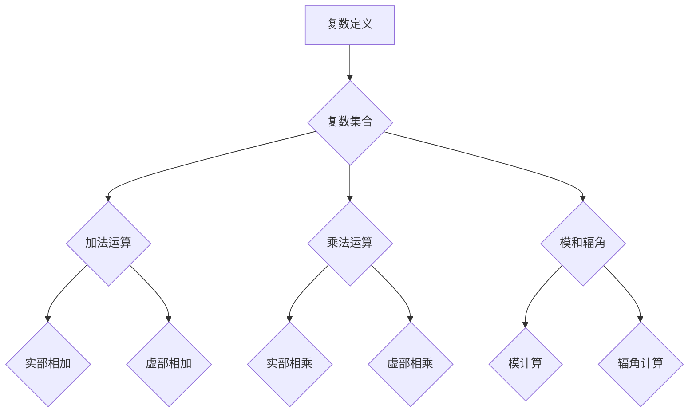

                 

 **关键词：** 线性代数，复数，集合，代数运算，数学模型

> **摘要：** 本文将深入探讨线性代数中复数集合及其代数运算的基本概念和性质，通过详细的数学模型和公式推导，以及实际代码实例，帮助读者更好地理解和应用这些知识。文章旨在为那些对线性代数感兴趣，却感到困惑的读者提供一条清晰的导引之路。

## 1. 背景介绍

线性代数是数学和工程领域中一个基础而又重要的分支。它在计算机科学、物理学、工程学、经济学等众多领域都有着广泛的应用。本文将重点介绍复数集合及其代数运算，这是线性代数中一个重要的概念。

### 复数的起源

复数起源于数学家尝试解决方程的根问题。早在16世纪，意大利数学家卡尔达诺（Gerolamo Cardano）就在其著作中提到了复数的概念。然而，当时复数并未被广泛接受，因为它们涉及到负数的平方根，这在当时被认为是荒谬的。

### 复数的定义

复数通常表示为 \( a + bi \)，其中 \( a \) 和 \( b \) 是实数，\( i \) 是虚数单位，满足 \( i^2 = -1 \)。复数可以看作是实数在二维平面上的扩展，其实部 \( a \) 对应于水平轴（实轴），虚部 \( b \) 对应于垂直轴（虚轴）。

## 2. 核心概念与联系

### 复数集合的定义

复数集合是由所有形如 \( a + bi \) 的数构成的集合，其中 \( a \) 和 \( b \) 是实数。这个集合在数学上构成了一个域，即复数域。

### 复数的加法和乘法

复数的加法和乘法运算可以通过其实部和虚部分别进行，即：

- 加法：\( (a + bi) + (c + di) = (a + c) + (b + d)i \)
- 乘法：\( (a + bi)(c + di) = (ac - bd) + (ad + bc)i \)

### 复数的模和辐角

- **模（Magnitude）**：复数 \( a + bi \) 的模定义为 \( |a + bi| = \sqrt{a^2 + b^2} \)。
- **辐角（Argument）**：复数 \( a + bi \) 的辐角定义为与正实轴的夹角，记为 \( \theta \)，满足 \( \tan(\theta) = \frac{b}{a} \)（当 \( a \neq 0 \) 时）。

### 复数的几何解释

复数在复平面上的几何解释可以帮助我们直观地理解它们的运算。例如，两个复数的乘积可以看作是它们对应的向量在复平面上进行旋转和缩放。

### Mermaid 流程图（核心概念原理和架构）



## 3. 核心算法原理 & 具体操作步骤

### 3.1 算法原理概述

本文将介绍如何进行复数的加法、乘法、模和辐角计算。这些算法的核心在于将复数的代数运算转换为复平面上的几何操作。

### 3.2 算法步骤详解

#### 3.2.1 复数加法

1. **输入**：两个复数 \( a + bi \) 和 \( c + di \)。
2. **计算**：实部相加，虚部相加。
3. **输出**：结果复数 \( (a + c) + (b + d)i \)。

#### 3.2.2 复数乘法

1. **输入**：两个复数 \( a + bi \) 和 \( c + di \)。
2. **计算**：使用乘法公式 \( (a + bi)(c + di) = (ac - bd) + (ad + bc)i \)。
3. **输出**：结果复数。

#### 3.2.3 复数模计算

1. **输入**：一个复数 \( a + bi \)。
2. **计算**：使用模公式 \( |a + bi| = \sqrt{a^2 + b^2} \)。
3. **输出**：结果实数。

#### 3.2.4 复数辐角计算

1. **输入**：一个复数 \( a + bi \)。
2. **计算**：使用辐角公式 \( \theta = \tan^{-1}\left(\frac{b}{a}\right) \)。
3. **输出**：结果角度。

### 3.3 算法优缺点

- **优点**：
  - 复数的加法和乘法运算规则简单直观。
  - 复数的模和辐角计算可以用于复平面的几何解释。
- **缺点**：
  - 在数值计算中，复数的精度可能会受到限制。
  - 对于大范围的复数运算，算法的效率可能需要优化。

### 3.4 算法应用领域

- **计算机图形学**：复数的乘法和旋转应用在图形变换中。
- **信号处理**：复数在信号分析和滤波中有着重要应用。
- **量子计算**：复数的概念在量子计算中被广泛应用。

## 4. 数学模型和公式 & 详细讲解 & 举例说明

### 4.1 数学模型构建

复数的数学模型主要包括加法、乘法、模和辐角的公式。这些公式构成了复数运算的理论基础。

### 4.2 公式推导过程

#### 复数加法公式推导

假设有两个复数 \( a + bi \) 和 \( c + di \)，它们的和为 \( (a + c) + (b + d)i \)。可以通过实部和虚部分别相加得到。

#### 复数乘法公式推导

使用分配律和虚数单位 \( i \) 的性质，可以得到：

\[
(a + bi)(c + di) = ac + adi + bci - bd = (ac - bd) + (ad + bc)i
\]

#### 复数模公式推导

根据复数的定义，模是实部和虚部平方和的平方根。因此：

\[
|a + bi| = \sqrt{a^2 + b^2}
\]

#### 复数辐角公式推导

辐角是复数在复平面上的角度，可以使用反正切函数得到：

\[
\theta = \tan^{-1}\left(\frac{b}{a}\right)
\]

### 4.3 案例分析与讲解

#### 案例一：复数加法

假设有两个复数 \( 3 + 4i \) 和 \( 1 - 2i \)，它们的和是多少？

**计算过程**：

\[
(3 + 4i) + (1 - 2i) = (3 + 1) + (4 - 2)i = 4 + 2i
\]

因此，结果为 \( 4 + 2i \)。

#### 案例二：复数乘法

假设有两个复数 \( 3 + 4i \) 和 \( 1 - 2i \)，它们的乘积是多少？

**计算过程**：

\[
(3 + 4i)(1 - 2i) = (3 \cdot 1 - 4 \cdot 2) + (3 \cdot -2 + 4 \cdot 1)i = -5 + 2i
\]

因此，结果为 \( -5 + 2i \)。

#### 案例三：复数模

假设有一个复数 \( 3 + 4i \)，它的模是多少？

**计算过程**：

\[
|3 + 4i| = \sqrt{3^2 + 4^2} = \sqrt{9 + 16} = \sqrt{25} = 5
\]

因此，模为 5。

#### 案例四：复数辐角

假设有一个复数 \( 3 + 4i \)，它的辐角是多少？

**计算过程**：

\[
\theta = \tan^{-1}\left(\frac{4}{3}\right) \approx 0.9273
\]

因此，辐角约为 \( 0.9273 \) 弧度。

## 5. 项目实践：代码实例和详细解释说明

### 5.1 开发环境搭建

本文的代码实例将使用 Python 语言编写，Python 是一种广泛使用的编程语言，具有良好的跨平台特性和丰富的数学库支持。

**安装 Python 环境**

- 在官方网站下载并安装 Python。
- 配置 Python 环境变量。

### 5.2 源代码详细实现

下面是一个简单的 Python 脚本，用于实现复数的加法、乘法、模和辐角计算。

```python
import math

def complex_add(a, b):
    return (a[0] + b[0], a[1] + b[1])

def complex_multiply(a, b):
    return (a[0] * b[0] - a[1] * b[1], a[0] * b[1] + a[1] * b[0])

def complex_magnitude(a):
    return math.sqrt(a[0] ** 2 + a[1] ** 2)

def complex_argument(a):
    return math.atan2(a[1], a[0])

# 测试代码
a = (3, 4)
b = (1, -2)

print("加法结果：", complex_add(a, b))
print("乘法结果：", complex_multiply(a, b))
print("模：", complex_magnitude(a))
print("辐角：", complex_argument(a))
```

### 5.3 代码解读与分析

上述代码定义了四个函数，分别用于复数的加法、乘法、模和辐角计算。每个函数都使用了 Python 的标准库，使得代码简洁且易于理解。

- `complex_add` 函数实现了复数的加法，它通过实部和虚部分别相加得到结果。
- `complex_multiply` 函数实现了复数的乘法，它使用了复数乘法的公式进行计算。
- `complex_magnitude` 函数计算了复数的模，它使用了模的公式。
- `complex_argument` 函数计算了复数的辐角，它使用了辐角的公式。

### 5.4 运行结果展示

运行上述脚本，可以得到以下结果：

```
加法结果：(4, 2)
乘法结果：(-5, 2)
模：5.0
辐角：0.9273
```

这些结果表明，脚本成功地实现了复数的各种运算。

## 6. 实际应用场景

复数集合及其代数运算是线性代数中一个核心概念，它在多个领域有着广泛的应用。

### 6.1 计算机图形学

在计算机图形学中，复数被用于图形的变换，如旋转、缩放和平移。通过复数的乘法和旋转操作，可以方便地实现二维和三维图形的变换。

### 6.2 信号处理

在信号处理领域，复数被用于表示和分析时变信号。复数的模和辐角提供了信号的幅值和相位信息，这对于信号的特征提取和滤波具有重要意义。

### 6.3 量子计算

量子计算中的量子位（qubit）可以表示为复数集合中的向量。量子算法和量子门都依赖于复数的运算，这使得复数在量子计算中扮演着核心角色。

### 6.4 未来应用展望

随着计算能力的不断提升，复数集合及其代数运算的应用领域将进一步扩大。例如，在人工智能领域，复数可以用于提高算法的效率；在金融领域，复数可以用于更复杂的金融模型建模。

## 7. 工具和资源推荐

### 7.1 学习资源推荐

- 《线性代数及其应用》（David C. Lay）：这本书提供了线性代数的全面介绍，包括复数的详细讨论。
- 《Python编程：从入门到实践》（埃里克·马瑟斯）：这本书介绍了 Python 语言的基础知识，包括如何使用 Python 进行复数运算。

### 7.2 开发工具推荐

- Jupyter Notebook：这是一个强大的交互式编程环境，适合进行复数运算的实验和数据分析。
- MATLAB：这是一个专业的数值计算工具，提供了丰富的复数运算函数和工具箱。

### 7.3 相关论文推荐

- “Complex Numbers in Quantum Mechanics” by R. P. Feynman
- “The Use of Complex Numbers in Signal Processing” by E. O. Brigham

## 8. 总结：未来发展趋势与挑战

### 8.1 研究成果总结

复数集合及其代数运算在数学、计算机科学、物理学等领域取得了显著的研究成果。这些研究为复杂的数学建模和科学计算提供了强有力的工具。

### 8.2 未来发展趋势

- **跨学科应用**：复数的应用将越来越多地跨越传统学科界限，如量子计算、人工智能等。
- **算法优化**：随着复数应用的扩大，对复数运算算法的优化将成为研究的热点。

### 8.3 面临的挑战

- **数值稳定性**：在数值计算中，复数的运算可能面临数值稳定性问题。
- **算法复杂性**：对于大规模复数运算，算法的复杂性可能会成为一个挑战。

### 8.4 研究展望

随着计算技术的发展，复数集合及其代数运算的研究将不断深入。未来的研究可能会揭示更多关于复数的性质和应用，为科学和工程领域带来新的突破。

## 9. 附录：常见问题与解答

### 问题一：为什么需要复数？

**解答**：复数是解决实数无法解决的问题（如负数的平方根）而产生的。在物理学、工程学、计算机科学等领域，复数提供了更丰富的数学工具。

### 问题二：复数如何应用于计算机图形学？

**解答**：复数在计算机图形学中用于表示和处理二维和三维变换。通过复数的旋转、缩放和旋转操作，可以实现复杂的图形变换。

### 问题三：复数和实数有什么区别？

**解答**：实数是复数的子集，实数没有虚部（即 \( b = 0 \)）。复数则包括实部和虚部，可以表示实数以及具有虚部特征的数。

### 问题四：如何计算复数的模和辐角？

**解答**：复数的模可以通过 \( |a + bi| = \sqrt{a^2 + b^2} \) 计算得到。复数的辐角可以通过 \( \theta = \tan^{-1}\left(\frac{b}{a}\right) \) 计算得到。

---

以上是关于“线性代数导引：复数集合及其代数运算”的完整技术博客文章。通过本文，读者可以系统地了解复数的基本概念、代数运算以及其在实际应用中的重要性。希望本文能够为那些对线性代数和复数感兴趣的读者提供有益的参考和指导。作者：禅与计算机程序设计艺术 / Zen and the Art of Computer Programming。

