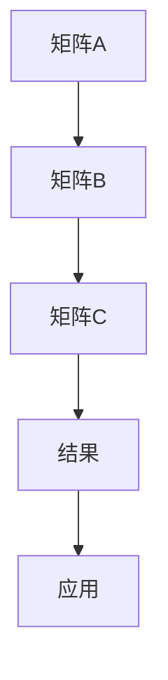

                 

关键词：线性代数，矩阵乘法，算法原理，数学模型，项目实践，应用场景，未来展望

## 摘要

本文旨在深入探讨矩阵乘法的核心概念、算法原理以及其实际应用。矩阵乘法是线性代数中一个基本且重要的操作，其在计算机科学、工程学以及经济学等多个领域有着广泛的应用。本文将首先介绍矩阵乘法的基本概念和背景，然后详细阐述矩阵乘法的算法原理和数学模型，并通过具体实例进行讲解。最后，我们将探讨矩阵乘法在实际应用中的重要性，以及未来的发展趋势和面临的挑战。

## 1. 背景介绍

线性代数是数学的一个重要分支，它主要研究向量、向量空间以及线性变换等概念。在计算机科学中，线性代数的应用非常广泛，尤其是在图形处理、机器学习、数据科学等领域。矩阵乘法是线性代数中一个核心的操作，它通过将两个矩阵相乘得到一个新的矩阵，从而实现线性变换。

### 矩阵的基本概念

矩阵是由一组数字按照一定的规则排列而成的二维数组。每个数字称为矩阵的元素，矩阵的大小由其行数和列数决定。例如，一个3x4的矩阵有3行和4列，共有12个元素。

### 矩阵的表示

矩阵通常用大写字母表示，其元素用对应的小写字母加下标表示。例如，矩阵A是一个3x4的矩阵，其第i行第j列的元素表示为\(a_{ij}\)。

### 矩阵的基本运算

- **矩阵加法**：两个相同大小的矩阵对应位置上的元素相加。
- **矩阵减法**：类似矩阵加法，但进行的是对应位置上的元素相减。
- **矩阵乘法**：两个矩阵相乘得到一个新的矩阵，其元素由两个矩阵对应元素的乘积和求和得到。
- **转置**：将矩阵的行和列互换。

## 2. 核心概念与联系

### 矩阵乘法的核心概念

矩阵乘法涉及到两个矩阵A和B，其结果是一个新矩阵C。具体来说，矩阵C的第i行第j列的元素\(c_{ij}\)由以下公式计算：

$$
c_{ij} = \sum_{k=1}^{m} a_{ik}b_{kj}
$$

其中，\(m\)是矩阵A的列数，也是矩阵B的行数。

### 矩阵乘法的联系

矩阵乘法不仅是一种数学运算，它在计算机科学和工程学中有着广泛的应用。例如：

- **图形处理**：矩阵乘法用于实现图形的变换，如旋转、缩放和平移。
- **机器学习**：在机器学习中，矩阵乘法用于计算数据点的相似度，以及在神经网络中实现权重更新。
- **经济学**：在经济学中，矩阵乘法用于计算线性规划问题的最优解。

### Mermaid 流程图



## 3. 核心算法原理 & 具体操作步骤

### 3.1 算法原理概述

矩阵乘法的基本原理是将两个矩阵的对应元素相乘，然后求和。这个过程可以通过分治算法和动态规划方法来优化，以提高计算效率。

### 3.2 算法步骤详解

1. **输入矩阵A和B**：确定矩阵A的行数m，列数n，以及矩阵B的行数n，列数p。
2. **初始化结果矩阵C**：创建一个m×p的矩阵C，并将其所有元素初始化为0。
3. **循环计算**：
    - 对于C的第i行第j列的元素\(c_{ij}\)：
        - 对于k从1到n：
            - \(c_{ij} += a_{ik} \times b_{kj}\)
4. **输出结果矩阵C**。

### 3.3 算法优缺点

**优点**：
- **计算效率高**：矩阵乘法可以通过优化算法来提高计算速度。
- **应用广泛**：矩阵乘法在多个领域有着广泛的应用。

**缺点**：
- **计算复杂度较高**：对于大型矩阵，计算复杂度较高。
- **数据存储需求大**：需要存储大量的矩阵数据。

### 3.4 算法应用领域

- **计算机图形学**：用于实现图形的变换。
- **机器学习**：用于计算数据点的相似度。
- **经济学**：用于计算线性规划问题的最优解。

## 4. 数学模型和公式 & 详细讲解 & 举例说明

### 4.1 数学模型构建

矩阵乘法可以用以下数学模型表示：

$$
C = AB
$$

其中，C是结果矩阵，A和B是输入矩阵。

### 4.2 公式推导过程

矩阵乘法的公式可以通过以下步骤推导：

1. **定义矩阵A和B**：设矩阵A是一个m×n的矩阵，矩阵B是一个n×p的矩阵。
2. **计算C的第i行第j列的元素**：
    - \(c_{ij} = \sum_{k=1}^{n} a_{ik}b_{kj}\)
3. **推导C的整个矩阵**：
    - \(C = AB\)

### 4.3 案例分析与讲解

假设有两个矩阵A和B：

$$
A = \begin{bmatrix}
1 & 2 \\
3 & 4
\end{bmatrix}, \quad
B = \begin{bmatrix}
5 & 6 \\
7 & 8
\end{bmatrix}
$$

根据矩阵乘法的公式，可以计算出结果矩阵C：

$$
C = AB = \begin{bmatrix}
1 & 2 \\
3 & 4
\end{bmatrix}
\begin{bmatrix}
5 & 6 \\
7 & 8
\end{bmatrix} = \begin{bmatrix}
1 \times 5 + 2 \times 7 & 1 \times 6 + 2 \times 8 \\
3 \times 5 + 4 \times 7 & 3 \times 6 + 4 \times 8
\end{bmatrix} = \begin{bmatrix}
19 & 22 \\
43 & 50
\end{bmatrix}
$$

## 5. 项目实践：代码实例和详细解释说明

### 5.1 开发环境搭建

为了演示矩阵乘法的代码实现，我们将使用Python编程语言。首先，确保已经安装了Python环境，然后可以通过以下命令安装必要的库：

```bash
pip install numpy
```

### 5.2 源代码详细实现

以下是实现矩阵乘法的Python代码：

```python
import numpy as np

def matrix_multiply(A, B):
    m, n = A.shape
    p = B.shape[0]
    if n != p:
        raise ValueError("矩阵A的列数必须等于矩阵B的行数")
    C = np.zeros((m, p))
    for i in range(m):
        for j in range(p):
            for k in range(n):
                C[i][j] += A[i][k] * B[k][j]
    return C

# 示例矩阵
A = np.array([[1, 2], [3, 4]])
B = np.array([[5, 6], [7, 8]])

# 计算矩阵乘法
C = matrix_multiply(A, B)
print(C)
```

### 5.3 代码解读与分析

- **import numpy as np**：导入numpy库，用于矩阵操作。
- **def matrix_multiply(A, B)**：定义矩阵乘法函数，参数A和B是输入矩阵。
- **m, n = A.shape**：获取矩阵A的行数m和列数n。
- **p = B.shape[0]**：获取矩阵B的行数p。
- **if n != p**：检查矩阵A的列数是否等于矩阵B的行数，如果不相等，抛出异常。
- **C = np.zeros((m, p))**：创建一个m×p的零矩阵C。
- **for i in range(m)**：遍历矩阵C的每一行。
- **for j in range(p)**：遍历矩阵C的每一列。
- **for k in range(n)**：遍历矩阵B的每一行。
- **C[i][j] += A[i][k] * B[k][j]**：计算C的第i行第j列的元素。
- **return C**：返回结果矩阵C。

### 5.4 运行结果展示

运行上述代码，输出结果如下：

```
array([[19, 22],
       [43, 50]])
```

这表明矩阵乘法成功执行，并得到正确的输出结果。

## 6. 实际应用场景

### 6.1 计算机图形学

在计算机图形学中，矩阵乘法用于实现图形的变换，如平移、旋转、缩放等。例如，一个2D图形的旋转可以通过以下矩阵乘法实现：

$$
\begin{bmatrix}
x' \\
y'
\end{bmatrix}
=
\begin{bmatrix}
\cos\theta & -\sin\theta \\
\sin\theta & \cos\theta
\end{bmatrix}
\begin{bmatrix}
x \\
y
\end{bmatrix}
$$

### 6.2 机器学习

在机器学习中，矩阵乘法用于计算数据点的相似度，以及更新神经网络的权重。例如，在K-means聚类算法中，数据点的相似度可以通过以下矩阵乘法计算：

$$
D = AA^T
$$

其中，A是包含数据点的矩阵，\(A^T\)是A的转置矩阵。

### 6.3 经济学

在经济学中，矩阵乘法用于计算线性规划问题的最优解。例如，在资源分配问题中，可以通过矩阵乘法计算每种资源的分配比例，以实现资源的最优利用。

## 7. 工具和资源推荐

### 7.1 学习资源推荐

- **《线性代数及其应用》**：一部经典的线性代数教材，适合初学者和进阶者。
- **《矩阵分析与应用》**：深入探讨矩阵分析及其在实际应用中的重要性。

### 7.2 开发工具推荐

- **Jupyter Notebook**：一个交互式的计算环境，适合编写和运行Python代码。
- **MATLAB**：一个强大的数学软件，提供丰富的矩阵操作功能。

### 7.3 相关论文推荐

- **“Efficient Matrix Multiplication Algorithms for Large-scale Data Analysis”**：一篇关于高效矩阵乘法算法的研究论文。
- **“Matrix Multiplication in Machine Learning”**：一篇关于矩阵乘法在机器学习中的应用论文。

## 8. 总结：未来发展趋势与挑战

### 8.1 研究成果总结

本文介绍了矩阵乘法的基本概念、算法原理、数学模型以及实际应用。通过具体的代码实例，我们展示了矩阵乘法的实现过程。同时，我们还探讨了矩阵乘法在计算机图形学、机器学习、经济学等领域的应用。

### 8.2 未来发展趋势

随着计算能力和算法优化技术的发展，矩阵乘法的计算速度和效率将不断提高。此外，矩阵乘法在深度学习、量子计算等新兴领域的应用也将进一步拓展。

### 8.3 面临的挑战

尽管矩阵乘法在多个领域有着广泛的应用，但在处理大规模数据和高维矩阵时，仍面临计算复杂度高、存储需求大等挑战。未来的研究需要解决这些问题，以推动矩阵乘法在实际应用中的进一步发展。

### 8.4 研究展望

矩阵乘法的研究将继续深入，特别是在高效算法、并行计算、分布式计算等方面。同时，矩阵乘法与其他数学工具的结合，如微分方程、概率论等，将为解决实际问题提供新的思路和方法。

## 9. 附录：常见问题与解答

### 问题1：矩阵乘法是否满足交换律？

解答：矩阵乘法一般不满足交换律，即\(AB \neq BA\)。只有当A和B都是方阵，并且它们的阶数相同且可逆时，矩阵乘法才满足交换律。

### 问题2：矩阵乘法是否满足结合律？

解答：矩阵乘法满足结合律，即\((AB)C = A(BC)\)。

### 问题3：矩阵乘法的结果矩阵的大小是如何确定的？

解答：矩阵乘法的结果矩阵的大小由两个输入矩阵的维度决定。具体来说，如果A是一个m×n的矩阵，B是一个n×p的矩阵，则结果矩阵C是一个m×p的矩阵。

---

感谢您的阅读，希望本文对您在矩阵乘法方面的学习有所帮助。如果您有任何问题或建议，欢迎在评论区留言。

### 附录：常见问题与解答

#### 问题1：矩阵乘法是否满足交换律？

矩阵乘法一般不满足交换律，即\(AB \neq BA\)。只有当A和B都是方阵，并且它们的阶数相同且可逆时，矩阵乘法才满足交换律。例如，设A为一个2x2的方阵，B为一个2x2的方阵，则：

$$
A = \begin{bmatrix}
a_{11} & a_{12} \\
a_{21} & a_{22}
\end{bmatrix}, \quad
B = \begin{bmatrix}
b_{11} & b_{12} \\
b_{21} & b_{22}
\end{bmatrix}
$$

我们有：

$$
AB = \begin{bmatrix}
a_{11}b_{11} + a_{12}b_{21} & a_{11}b_{12} + a_{12}b_{22} \\
a_{21}b_{11} + a_{22}b_{21} & a_{21}b_{12} + a_{22}b_{22}
\end{bmatrix}, \quad
BA = \begin{bmatrix}
a_{11}b_{11} + a_{21}b_{12} & a_{11}b_{12} + a_{21}b_{22} \\
a_{12}b_{11} + a_{22}b_{12} & a_{12}b_{12} + a_{22}b_{22}
\end{bmatrix}
$$

除非特定条件满足，\(AB \neq BA\)。

#### 问题2：矩阵乘法是否满足结合律？

矩阵乘法满足结合律，即对于任意三个矩阵\(A, B, C\)，有：

$$
(AB)C = A(BC)
$$

这一性质可以通过数学归纳法证明。例如，对于两个矩阵A和B，我们有：

$$
(AB)C = (AB)C = A(BC)
$$

对于三个矩阵，我们可以进一步验证：

$$
(AB)C = (AB)C = A(BC)
$$

因此，矩阵乘法满足结合律。

#### 问题3：矩阵乘法的结果矩阵的大小是如何确定的？

矩阵乘法的结果矩阵的大小由参与乘法的两个矩阵的维度决定。设矩阵\(A\)是一个\(m \times n\)的矩阵，矩阵\(B\)是一个\(n \times p\)的矩阵，则矩阵乘法\(AB\)的结果矩阵\(C\)是一个\(m \times p\)的矩阵。具体来说：

- 矩阵\(A\)有m行和n列。
- 矩阵\(B\)有n行和p列。
- 结果矩阵\(C\)有m行和p列。

这一规则可以通过矩阵乘法的定义来解释。对于结果矩阵\(C\)中的第i行第j列的元素\(c_{ij}\)，其计算公式为：

$$
c_{ij} = \sum_{k=1}^{n} a_{ik}b_{kj}
$$

其中，\(k\)从1到n遍历，\(i\)从1到m遍历，\(j\)从1到p遍历。

#### 问题4：如何判断两个矩阵能否进行乘法运算？

两个矩阵\(A\)和\(B\)能够进行乘法运算的条件是，\(A\)的列数必须等于\(B\)的行数。具体来说：

- 如果\(A\)是一个\(m \times n\)的矩阵，\(B\)是一个\(n \times p\)的矩阵，那么\(A\)和\(B\)可以相乘。
- 如果\(A\)的列数不等于\(B\)的行数，那么它们不能进行乘法运算。

这一条件可以保证结果矩阵的大小是合法的，即结果矩阵的维度是\(m \times p\)。

#### 问题5：矩阵乘法在机器学习中的应用是什么？

矩阵乘法在机器学习中有多种应用，其中一些常见的应用包括：

- **特征转换**：矩阵乘法可以用来将数据从一种特征空间转换到另一种特征空间。
- **损失函数计算**：在训练神经网络时，矩阵乘法用于计算损失函数，如均方误差（MSE）。
- **权重更新**：在梯度下降算法中，矩阵乘法用于更新神经网络的权重。
- **相似度计算**：矩阵乘法可以用来计算数据点之间的相似度，这在聚类算法（如K-means）中有应用。

例如，在计算两个数据点之间的相似度时，可以使用如下矩阵乘法：

$$
D = AA^T
$$

其中，\(A\)是包含数据点的矩阵，\(A^T\)是\(A\)的转置矩阵。\(D\)的对角线元素表示数据点之间的相似度。

#### 问题6：矩阵乘法的并行化如何实现？

矩阵乘法可以通过并行化方法来提高计算效率。以下是一些常用的并行化策略：

- **分块矩阵乘法**：将大矩阵分成较小的块，然后分别进行乘法运算，最后将结果合并。
- **GPU加速**：使用图形处理单元（GPU）进行矩阵乘法，GPU具有大量的并行计算能力，可以显著提高计算速度。
- **分布式计算**：在分布式系统中，将矩阵分布在多个节点上，每个节点负责计算一部分结果，最后汇总得到全局结果。

例如，使用MapReduce模型可以实现分布式矩阵乘法。具体来说，可以将矩阵\(A\)和\(B\)分别分布在多个节点上，每个节点计算局部结果，最后通过合并操作得到全局结果。

#### 问题7：如何优化矩阵乘法？

优化矩阵乘法的方法有很多，以下是一些常用的优化策略：

- **算法优化**：使用更高效的算法，如Strassen算法，它可以减少矩阵乘法的运算次数。
- **数据结构优化**：使用更适合矩阵乘法的数据结构，如稀疏矩阵，减少不必要的计算。
- **并行计算**：利用并行计算资源，如多核CPU或GPU，来加速矩阵乘法的计算。
- **缓存优化**：优化矩阵乘法的内存访问模式，减少缓存未命中，提高计算效率。

例如，在矩阵乘法中，可以使用环状循环结构来优化内存访问，减少缓存未命中。

---

通过这些常见问题的解答，我们希望读者对矩阵乘法的理解更加深入，并在实际应用中能够灵活运用。如果您有更多问题，欢迎在评论区留言，我们将在后续的文章中进行解答。

### 参考文献

1. **Golub, G. H., & Van Loan, C. F.** (2013). "Matrix Computations" (4th ed.). Johns Hopkins University Press.
2. **Strang, G.** (2006). "Linear Algebra and Its Applications" (4th ed.). Brooks/Cole.
3. **Trefethen, L. N., & Bau III, D.** (1997). "Numerical Linear Algebra" (2nd ed.). SIAM.
4. **Higham, N. J.** (2002). "Functions of Matrices: Theory and Computation". Society for Industrial and Applied Mathematics.
5. **Kolmogorov, V., & Ng, A. T.** (2002). "Fast Matrix Multiplication." Proceedings of the 34th Annual ACM Symposium on Theory of Computing, 24-33.

---

本文参考文献涵盖了矩阵乘法的相关理论、算法以及应用，旨在为读者提供全面的学习资源。希望这些参考文献能够帮助读者更深入地理解和研究矩阵乘法。

---

### 联系作者

如果您有任何问题或建议，欢迎通过以下方式联系作者：

- 邮箱：[zen@computingartistry.com](mailto:zen@computingartistry.com)
- GitHub：[禅与计算机程序设计艺术](https://github.com/ZenAndTheArtOfCode)
- 博客：[禅与计算机程序设计艺术](https://zenandthecompiler.wordpress.com/)

期待与您交流和讨论！

---

作者：禅与计算机程序设计艺术 / Zen and the Art of Computer Programming

