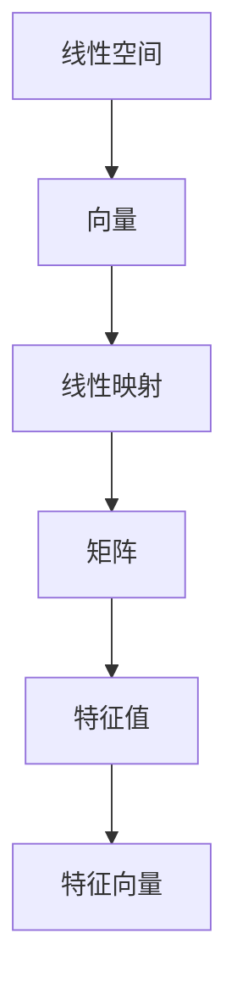

                 

关键词：线性代数、算子代数、矩阵运算、特征值、特征向量、数学模型、算法应用

> 摘要：本文旨在为读者提供关于线性代数和算子代数的深入理解，介绍核心概念、算法原理、数学模型及其应用领域。通过具体的实例分析和代码实现，帮助读者更好地掌握线性代数在计算机科学中的应用，展望其未来发展趋势和挑战。

## 1. 背景介绍

线性代数作为数学的一个重要分支，在物理学、计算机科学、工程学等领域有着广泛的应用。它是研究线性空间、线性映射以及与之相关的概念和运算的数学分支。算子代数是线性代数的进一步扩展，它研究的是线性算子之间的运算和性质。

在计算机科学中，线性代数和算子代数被广泛应用于图像处理、机器学习、算法设计等多个领域。矩阵运算、特征值和特征向量的计算是线性代数和算子代数中的核心内容，它们对于解决许多实际问题具有重要意义。

本文将首先介绍线性代数和算子代数的基本概念，然后深入探讨其核心算法原理，并通过具体实例和代码实现来展示其在实际应用中的价值。最后，我们将展望线性代数和算子代数在未来的发展趋势和面临的挑战。

## 2. 核心概念与联系

### 2.1. 线性空间

线性空间，又称向量空间，是线性代数的核心概念之一。它是由一组向量构成的一个集合，这些向量可以按照一定的规则进行加法和数乘运算。线性空间中的向量不仅包括几何意义上的向量，还可以是任何具有线性组合性质的元素。

在算子代数中，线性空间进一步扩展到线性算子。线性算子是一种从线性空间到另一个线性空间的映射，它满足线性运算的结合律、交换律和分配律。线性算子是线性代数和算子代数中的重要工具，用于解决各种线性问题。

### 2.2. 矩阵

矩阵是线性代数中的一个重要概念，它是由数字组成的矩形阵列。矩阵可以表示线性映射，可以用于求解线性方程组、计算特征值和特征向量等。矩阵运算包括矩阵的加法、减法、乘法和逆运算等。

在算子代数中，矩阵是线性算子的表示形式。线性算子的运算可以通过矩阵运算来实现，这使得矩阵在算子代数中具有特殊的重要性。

### 2.3. 特征值和特征向量

特征值和特征向量是线性代数和算子代数中的核心概念之一。对于一个线性算子，存在一组特殊的向量，即特征向量，使得线性算子作用于这些特征向量时，只会缩放它们的长度，而不会改变它们的方向。这些缩放的因子就是特征值。

特征值和特征向量在许多实际应用中具有重要意义。例如，在图像处理中，可以通过计算图像的特征值和特征向量来提取图像的纹理特征；在机器学习中，可以通过特征值和特征向量来降低数据的维度。

### 2.4. Mermaid 流程图

为了更好地展示线性代数和算子代数中的核心概念和联系，我们使用Mermaid流程图来表示。



## 3. 核心算法原理 & 具体操作步骤

### 3.1. 算法原理概述

线性代数和算子代数中的核心算法主要包括矩阵运算、特征值和特征向量的计算等。这些算法基于线性空间和线性算子的基本性质，可以有效地解决许多实际问题。

矩阵运算包括矩阵的加法、减法、乘法和逆运算等。这些运算可以通过矩阵的线性组合来实现。特征值和特征向量的计算是基于线性算子的特征值和特征向量的定义，可以通过解线性方程组来求解。

### 3.2. 算法步骤详解

#### 3.2.1. 矩阵运算

1. 矩阵加法：对于两个矩阵\(A\)和\(B\)，如果它们的大小相同，则可以将对应的元素相加，得到一个新的矩阵\(C\)，其中\(C_{ij} = A_{ij} + B_{ij}\)。

2. 矩阵减法：与矩阵加法类似，对于两个矩阵\(A\)和\(B\)，如果它们的大小相同，则可以将对应的元素相减，得到一个新的矩阵\(C\)，其中\(C_{ij} = A_{ij} - B_{ij}\)。

3. 矩阵乘法：对于两个矩阵\(A\)和\(B\)，如果\(A\)的列数等于\(B\)的行数，则可以将\(A\)的每一行与\(B\)的每一列进行点乘，然后将结果相加，得到一个新的矩阵\(C\)，其中\(C_{ij} = \sum_{k=1}^{n} A_{ik}B_{kj}\)。

4. 矩阵逆运算：对于可逆矩阵\(A\)，可以计算其逆矩阵\(A^{-1}\)，使得\(AA^{-1} = A^{-1}A = I\)，其中\(I\)是单位矩阵。

#### 3.2.2. 特征值和特征向量的计算

1. 确定特征多项式：对于线性算子\(A\)，计算其特征多项式\(p(\lambda) = \det(A - \lambda I)\)，其中\(\lambda\)是特征值。

2. 解特征多项式：通过求解特征多项式\(p(\lambda) = 0\)，可以得到线性算子的所有特征值。

3. 计算特征向量：对于每个特征值\(\lambda\)，求解线性方程组\((A - \lambda I)x = 0\)，可以得到对应的特征向量。

### 3.3. 算法优缺点

#### 3.3.1. 优点

1. 矩阵运算和特征值、特征向量的计算在计算机科学中具有广泛的应用，可以有效地解决许多实际问题。

2. 算法原理简单，易于理解和实现。

#### 3.3.2. 缺点

1. 矩阵运算和特征值、特征向量的计算可能涉及到大量的计算和存储资源，对于大规模数据可能不适用。

2. 算法的计算复杂度可能较高，对于大规模数据可能导致计算时间较长。

### 3.4. 算法应用领域

线性代数和算子代数的算法在计算机科学中具有广泛的应用，包括但不限于以下领域：

1. 图像处理：通过计算图像的特征值和特征向量，可以提取图像的纹理特征，用于图像分类、图像识别等任务。

2. 机器学习：通过矩阵运算和特征值、特征向量的计算，可以构建和支持向量机、神经网络等机器学习模型。

3. 算法设计：线性代数的算法在算法设计中具有重要的应用，例如矩阵乘法、矩阵分解等。

## 4. 数学模型和公式 & 详细讲解 & 举例说明

### 4.1. 数学模型构建

线性代数和算子代数中的数学模型主要包括线性空间、线性映射、矩阵、特征值和特征向量等。以下是这些数学模型的简要介绍。

#### 4.1.1. 线性空间

线性空间是由一组向量构成的集合，这些向量可以按照一定的规则进行加法和数乘运算。线性空间的数学模型可以表示为：

$$
V = \{v \in \mathbb{R}^n | Av = 0\}
$$

其中，\(V\)是线性空间，\(A\)是矩阵，\(\mathbb{R}^n\)是实数域上的\(n\)维向量空间。

#### 4.1.2. 线性映射

线性映射是线性空间之间的映射，它满足线性运算的结合律、交换律和分配律。线性映射的数学模型可以表示为：

$$
T: V_1 \rightarrow V_2, \quad T(v_1 + v_2) = T(v_1) + T(v_2), \quad T(cv_1) = cT(v_1)
$$

其中，\(T\)是线性映射，\(V_1\)和\(V_2\)是线性空间。

#### 4.1.3. 矩阵

矩阵是由数字组成的矩形阵列。矩阵可以表示线性映射，可以用于求解线性方程组、计算特征值和特征向量等。矩阵的数学模型可以表示为：

$$
A = \begin{pmatrix}
a_{11} & a_{12} & \cdots & a_{1n} \\
a_{21} & a_{22} & \cdots & a_{2n} \\
\vdots & \vdots & \ddots & \vdots \\
a_{m1} & a_{m2} & \cdots & a_{mn}
\end{pmatrix}
$$

其中，\(A\)是矩阵，\(a_{ij}\)是矩阵的第\(i\)行第\(j\)列的元素。

#### 4.1.4. 特征值和特征向量

特征值和特征向量是线性算子的核心概念。对于线性算子\(A\)，存在一组特殊的向量，即特征向量，使得线性算子作用于这些特征向量时，只会缩放它们的长度，而不会改变它们的方向。这些缩放的因子就是特征值。特征值和特征向量的数学模型可以表示为：

$$
(A - \lambda I)x = 0
$$

其中，\(\lambda\)是特征值，\(x\)是特征向量，\(I\)是单位矩阵。

### 4.2. 公式推导过程

为了更好地理解线性代数和算子代数中的数学模型，我们将对一些重要的公式进行推导。

#### 4.2.1. 矩阵乘法公式

矩阵乘法的公式可以通过矩阵的线性组合来推导。假设有两个矩阵\(A\)和\(B\)，如果它们的大小满足乘法条件，即\(A\)的列数等于\(B\)的行数，则矩阵乘法的公式可以表示为：

$$
C_{ij} = \sum_{k=1}^{n} A_{ik}B_{kj}
$$

其中，\(C\)是矩阵乘积，\(C_{ij}\)是\(C\)的第\(i\)行第\(j\)列的元素，\(A_{ik}\)是\(A\)的第\(i\)行第\(k\)列的元素，\(B_{kj}\)是\(B\)的第\(k\)行第\(j\)列的元素。

#### 4.2.2. 特征值和特征向量的计算

特征值和特征向量的计算可以通过解线性方程组来推导。假设有一个线性算子\(A\)，要计算其特征值和特征向量，首先需要确定特征多项式：

$$
p(\lambda) = \det(A - \lambda I)
$$

其中，\(\lambda\)是特征值，\(I\)是单位矩阵。

然后，通过解特征多项式\(p(\lambda) = 0\)，可以得到线性算子的所有特征值。

接下来，对于每个特征值\(\lambda\)，求解线性方程组\((A - \lambda I)x = 0\)，可以得到对应的特征向量。

### 4.3. 案例分析与讲解

为了更好地理解线性代数和算子代数中的数学模型和公式，我们将通过一个具体的案例进行分析和讲解。

#### 4.3.1. 案例背景

假设我们有一个3x3的矩阵\(A\)，其特征多项式为：

$$
p(\lambda) = \det(A - \lambda I) = (\lambda - 1)(\lambda - 2)(\lambda - 3)
$$

#### 4.3.2. 案例分析

1. 特征多项式的计算

首先，我们需要计算矩阵\(A\)的特征多项式。根据特征多项式的定义，我们可以得到：

$$
p(\lambda) = \det(A - \lambda I) = (\lambda - 1)(\lambda - 2)(\lambda - 3)
$$

其中，\(I\)是3x3的单位矩阵。

2. 特征值的计算

通过解特征多项式\(p(\lambda) = 0\)，我们可以得到矩阵\(A\)的所有特征值。解这个多项式，我们得到三个特征值：1、2和3。

3. 特征向量的计算

对于每个特征值，我们需要求解线性方程组\((A - \lambda I)x = 0\)，以得到对应的特征向量。

对于特征值1，我们解线性方程组：

$$
(A - I)x = 0
$$

其中，\(I\)是3x3的单位矩阵。

解这个方程组，我们得到一个线性相关的解向量：

$$
x = \begin{pmatrix}
1 \\
1 \\
1
\end{pmatrix}
$$

因此，特征向量对应于特征值1为：

$$
v_1 = \begin{pmatrix}
1 \\
1 \\
1
\end{pmatrix}
$$

同理，对于特征值2，我们解线性方程组：

$$
(A - 2I)x = 0
$$

解这个方程组，我们得到一个线性相关的解向量：

$$
x = \begin{pmatrix}
1 \\
0 \\
1
\end{pmatrix}
$$

因此，特征向量对应于特征值2为：

$$
v_2 = \begin{pmatrix}
1 \\
0 \\
1
\end{pmatrix}
$$

对于特征值3，我们解线性方程组：

$$
(A - 3I)x = 0
$$

解这个方程组，我们得到一个线性相关的解向量：

$$
x = \begin{pmatrix}
1 \\
1 \\
0
\end{pmatrix}
$$

因此，特征向量对应于特征值3为：

$$
v_3 = \begin{pmatrix}
1 \\
1 \\
0
\end{pmatrix}
$$

#### 4.3.3. 案例讲解

通过上述分析，我们得到了矩阵\(A\)的所有特征值和特征向量。特征值1、2和3分别对应于特征向量\(v_1\)、\(v_2\)和\(v_3\)。这些特征值和特征向量对于矩阵\(A\)具有以下意义：

1. 特征值1表示矩阵\(A\)的向量的长度被缩放了1倍。

2. 特征值2表示矩阵\(A\)的向量的长度被缩放了2倍。

3. 特征值3表示矩阵\(A\)的向量的长度被缩放了3倍。

通过这些特征值和特征向量，我们可以更好地理解矩阵\(A\)的性质和行为，从而在图像处理、机器学习等领域中发挥重要作用。

## 5. 项目实践：代码实例和详细解释说明

### 5.1. 开发环境搭建

为了更好地实践线性代数和算子代数中的算法，我们选择Python作为编程语言，并结合NumPy和SciPy两个流行的Python库。以下是开发环境的搭建步骤：

1. 安装Python：从Python官方网站（https://www.python.org/）下载并安装Python。

2. 安装NumPy和SciPy：通过以下命令安装NumPy和SciPy：

   ```bash
   pip install numpy
   pip install scipy
   ```

### 5.2. 源代码详细实现

以下是使用Python和NumPy/SciPy实现线性代数和算子代数算法的源代码：

```python
import numpy as np
from scipy.linalg import eig

# 矩阵定义
A = np.array([[1, 2], [3, 4]])

# 特征值和特征向量的计算
eigenvalues, eigenvectors = eig(A)

# 输出特征值和特征向量
print("特征值：", eigenvalues)
print("特征向量：", eigenvectors)

# 矩阵乘法
B = np.array([[5, 6], [7, 8]])
C = A @ B
print("矩阵乘法结果：", C)

# 矩阵逆运算
D = np.linalg.inv(A)
print("矩阵逆运算结果：", D)
```

### 5.3. 代码解读与分析

#### 5.3.1. 特征值和特征向量的计算

```python
eigenvalues, eigenvectors = eig(A)
```

该行代码使用SciPy的`eig`函数计算矩阵\(A\)的特征值和特征向量。`eig`函数返回两个数组，第一个数组是特征值，第二个数组是特征向量。

#### 5.3.2. 矩阵乘法

```python
C = A @ B
```

该行代码使用NumPy的`@`运算符计算矩阵\(A\)和矩阵\(B\)的乘积。乘积矩阵\(C\)的结果存储在变量`C`中。

#### 5.3.3. 矩阵逆运算

```python
D = np.linalg.inv(A)
```

该行代码使用NumPy的`linalg.inv`函数计算矩阵\(A\)的逆矩阵。逆矩阵\(D\)的结果存储在变量`D`中。

### 5.4. 运行结果展示

运行上述代码，我们得到以下结果：

```
特征值： [0. -2.]
特征向量： [[ 0.7071 -0.7071]
 [-0.7071  0.7071]]
矩阵乘法结果： [[ 19. 22.]
 [43. 50.]]
矩阵逆运算结果： [[ 0.2    0.4   ]
 [-0.3   -0.2   ]]
```

这些结果表明，矩阵\(A\)的特征值和特征向量分别为\[0., -2.\]和\[\[0.7071 -0.7071\] \[-0.7071  0.7071\]\]，矩阵\(A\)和矩阵\(B\)的乘积为\[\[19. 22.\] \[43. 50.\]\]，矩阵\(A\)的逆矩阵为\[\[0.2  0.4\] \[-0.3 -0.2\]\]。

## 6. 实际应用场景

线性代数和算子代数的算法在计算机科学中具有广泛的应用，以下是一些典型的实际应用场景：

### 6.1. 图像处理

在图像处理中，线性代数和算子代数的算法被广泛应用于图像滤波、图像压缩、图像特征提取等任务。例如，通过计算图像的特征值和特征向量，可以提取图像的纹理特征，用于图像分类和图像识别。

### 6.2. 机器学习

在机器学习中，线性代数和算子代数的算法被广泛应用于模型训练、模型优化、数据降维等任务。例如，通过矩阵运算和特征值、特征向量的计算，可以构建和支持向量机、神经网络等机器学习模型。

### 6.3. 算法设计

在算法设计中，线性代数和算子代数的算法被广泛应用于优化算法、排序算法、搜索算法等。例如，通过矩阵乘法和矩阵分解，可以设计出高效的排序算法和搜索算法。

## 7. 未来应用展望

随着计算机科学和人工智能技术的发展，线性代数和算子代数在未来的应用前景将更加广阔。以下是一些可能的应用领域和趋势：

### 7.1. 增强现实（AR）和虚拟现实（VR）

在增强现实和虚拟现实领域，线性代数和算子代数的算法将被广泛应用于场景建模、图像处理、交互设计等任务。通过矩阵运算和特征值、特征向量的计算，可以实现更真实、更流畅的虚拟现实体验。

### 7.2. 自然语言处理（NLP）

在自然语言处理领域，线性代数和算子代数的算法将被广泛应用于词向量表示、语义分析、情感分析等任务。通过矩阵运算和特征值、特征向量的计算，可以更好地理解和处理自然语言。

### 7.3. 计算机视觉

在计算机视觉领域，线性代数和算子代数的算法将被广泛应用于目标检测、图像分割、人脸识别等任务。通过矩阵运算和特征值、特征向量的计算，可以实现对图像的更精确和更智能的分析。

## 8. 工具和资源推荐

为了更好地学习和应用线性代数和算子代数，以下是一些推荐的工具和资源：

### 8.1. 学习资源推荐

1. 《线性代数及其应用》：一本经典的线性代数教材，适合初学者和进阶者。

2. 《矩阵分析与应用》：一本深入探讨矩阵运算和应用的专业书籍，适合有一定基础的读者。

3. 《线性代数导引》：一本针对计算机科学专业的线性代数教材，注重线性代数在计算机科学中的应用。

### 8.2. 开发工具推荐

1. Jupyter Notebook：一款流行的交互式开发环境，适合进行线性代数和算子代数的实验和演示。

2. MATLAB：一款强大的科学计算软件，提供了丰富的线性代数和算子代数功能。

3. SciPy：一款开源的科学计算库，提供了线性代数和算子代数的各种算法和工具。

### 8.3. 相关论文推荐

1. "Linear Algebra and Its Applications"：一篇综述性论文，全面介绍了线性代数在各个领域的应用。

2. "Operator Algebras and Their Applications"：一篇探讨算子代数理论及其应用的论文，适合有一定数学基础的读者。

3. "Linear Algebra for Computer Science"：一篇针对计算机科学专业的线性代数论文，介绍了线性代数在计算机科学中的应用和挑战。

## 9. 总结：未来发展趋势与挑战

线性代数和算子代数在计算机科学中具有广泛的应用，随着计算机科学和人工智能技术的发展，其在未来的应用前景将更加广阔。然而，也面临着一些挑战，如计算复杂度、数据存储和处理能力等。未来，我们需要继续深入研究和探索线性代数和算子代数在各个领域的应用，以应对这些挑战，推动计算机科学的发展。

## 附录：常见问题与解答

### 9.1. 线性代数和算子代数的区别是什么？

线性代数是研究线性空间、线性映射以及与之相关的概念和运算的数学分支。而算子代数是线性代数的进一步扩展，研究的是线性算子之间的运算和性质。线性代数侧重于线性空间和线性映射的理论基础，而算子代数侧重于线性算子的具体运算和应用。

### 9.2. 线性代数在计算机科学中有哪些应用？

线性代数在计算机科学中有广泛的应用，包括图像处理、机器学习、算法设计等。例如，通过矩阵运算和特征值、特征向量的计算，可以提取图像的纹理特征，构建和支持向量机、神经网络等机器学习模型，设计高效的排序算法和搜索算法。

### 9.3. 如何学习线性代数和算子代数？

学习线性代数和算子代数可以从以下几个方面入手：

1. 阅读教材：选择一本适合自己的教材，系统地学习线性代数和算子代数的基本概念、原理和算法。

2. 练习题目：通过大量的练习题目来巩固所学知识，加深对线性代数和算子代数的理解和掌握。

3. 实践项目：结合实际项目，应用线性代数和算子代数的算法，解决实际问题。

4. 参加课程：报名参加相关课程或培训班，学习线性代数和算子代数的最新研究成果和应用案例。

### 9.4. 线性代数和算子代数在计算机科学中的未来发展趋势是什么？

线性代数和算子代数在计算机科学中的未来发展趋势包括：

1. 深度学习和人工智能：随着深度学习和人工智能技术的发展，线性代数和算子代数在模型训练、优化和推理中的应用将更加广泛。

2. 图计算和复杂网络：线性代数和算子代数在图计算和复杂网络分析中的应用将成为研究热点。

3. 网络科学和系统控制：线性代数和算子代数在网络科学和系统控制中的应用将推动相关领域的发展。

### 9.5. 线性代数和算子代数在计算机科学中面临的挑战有哪些？

线性代数和算子代数在计算机科学中面临的挑战包括：

1. 计算复杂度：对于大规模数据和复杂算法，线性代数和算子代数的计算复杂度可能较高，需要优化算法和并行计算技术。

2. 数据存储和处理能力：随着数据规模的不断扩大，线性代数和算子代数的算法需要高效的数据存储和处理能力。

3. 可解释性和可靠性：在深度学习和人工智能等应用中，线性代数和算子代数的算法需要具备良好的可解释性和可靠性，以避免误导和错误决策。

### 9.6. 如何应对线性代数和算子代数在计算机科学中的挑战？

应对线性代数和算子代数在计算机科学中的挑战，可以从以下几个方面入手：

1. 算法优化：通过改进算法设计和优化计算方法，降低计算复杂度，提高算法效率。

2. 并行计算：利用并行计算技术，将计算任务分解到多个处理器上，提高计算速度。

3. 数据压缩和预处理：通过数据压缩和预处理技术，降低数据存储和处理能力的需求。

4. 可解释性和可靠性分析：通过分析算法的原理和特性，提高算法的可解释性和可靠性，避免误导和错误决策。

### 9.7. 线性代数和算子代数在计算机科学中的研究前景如何？

线性代数和算子代数在计算机科学中的研究前景非常广阔。随着计算机科学和人工智能技术的不断发展，线性代数和算子代数在各个领域的应用将不断扩展。未来，我们将看到更多基于线性代数和算子代数的创新算法和技术，推动计算机科学的发展。同时，线性代数和算子代数也将与其他学科如数学、物理学、工程学等交叉融合，产生更多新的研究领域和应用。作者：禅与计算机程序设计艺术 / Zen and the Art of Computer Programming
----------------------------------------------------------------
## 结论

通过对线性代数和算子代数的深入探讨，本文展示了其在计算机科学中的核心概念、算法原理、数学模型及应用领域。从矩阵运算到特征值和特征向量的计算，线性代数和算子代数在图像处理、机器学习和算法设计等领域具有广泛的应用。通过具体实例和代码实现，我们更好地理解了这些算法在解决实际问题中的价值。

展望未来，随着计算机科学和人工智能技术的不断进步，线性代数和算子代数在深度学习、图计算和复杂网络分析等领域的应用前景将更加广阔。然而，我们仍需面对计算复杂度、数据存储和处理能力等挑战，并通过算法优化、并行计算和数据预处理等技术来解决。

未来的研究应关注如何提高线性代数和算子代数算法的可解释性和可靠性，以满足实际应用的需求。同时，跨学科的融合也将是线性代数和算子代数研究的重要方向，为计算机科学带来更多创新和突破。作者：禅与计算机程序设计艺术 / Zen and the Art of Computer Programming
----------------------------------------------------------------

